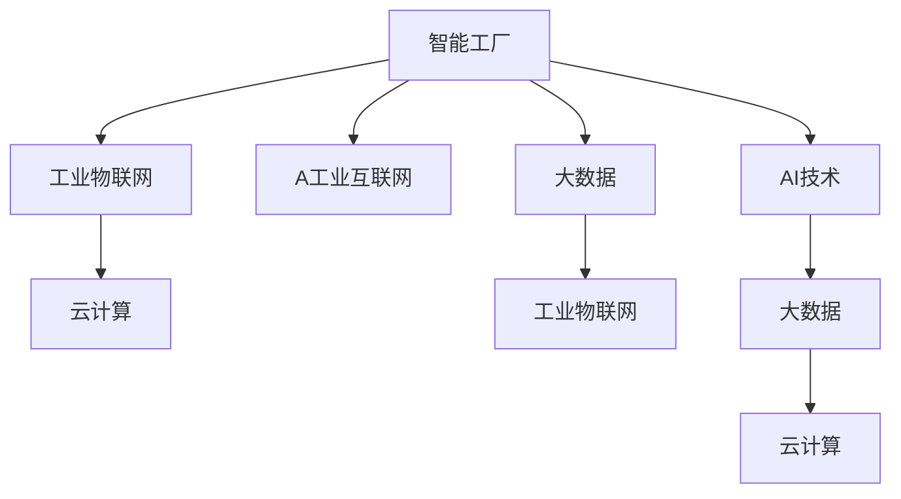

                 

# 制造行业数字化、人工智能、大数据技术转型

在当今科技飞速发展的时代，数字化、人工智能（AI）和大数据技术正深刻改变着各行各业的发展方式，推动传统制造业走向智能化、自动化、柔性化和生态化。制造行业的数字化转型是大势所趋，也是未来竞争力的关键所在。本文将从背景介绍、核心概念与联系、核心算法原理与具体操作步骤、数学模型与公式、项目实践、实际应用场景、工具和资源推荐、总结未来发展趋势与挑战以及附录解答，全面探讨制造行业在数字化、AI和大数据技术上的转型路径和实践策略。

## 1. 背景介绍

### 1.1 问题由来
制造行业作为国民经济的基础，长期以来面临着高成本、低效率、产品同质化严重等问题。传统制造模式以大规模生产为主，高度依赖人工和固定设备，灵活性差，无法快速响应市场需求变化。

近年来，随着互联网、物联网、大数据、人工智能等新兴技术的发展，数字化、智能化制造趋势日益明显。数字化转型能够提升制造行业的生产效率，降低成本，提升产品质量和灵活性，进而增强市场竞争力。

### 1.2 问题核心关键点
制造行业数字化转型面临的核心问题包括：
- 如何构建智能工厂，实现生产过程的自动化、数字化管理。
- 如何通过AI和大数据技术，提升产品设计和生产过程中的智能化决策能力。
- 如何在制造过程中进行数据采集、处理和分析，实现精确预测和质量控制。
- 如何构建高效的供应链和物流系统，实现生产物资的灵活调配和物流优化。

### 1.3 问题研究意义
制造行业的数字化转型，有助于推动传统制造业向智能制造转型，实现全要素生产率的提升。数字化、AI和大数据技术的应用，使得制造行业能够以数据驱动为核心，从传统的人工操作向智能决策迈进，提升整个制造流程的效率和精度，增强企业的核心竞争力。

数字化转型不仅能提升生产效率，减少人工成本，还能加速新产品开发和市场响应速度，帮助企业在全球竞争中获得优势。

## 2. 核心概念与联系

### 2.1 核心概念概述

为了更好地理解数字化、AI和大数据在制造行业的应用，本节将介绍几个关键概念：

- **智能工厂**：利用物联网、自动化、机器人等技术，实现生产过程的数字化、自动化和智能化管理，提升生产效率和产品质量。

- **工业互联网**：通过工业设备和系统的互联互通，实现数据采集、处理和分析，提升制造过程的透明化、可视化和预测能力。

- **AI技术**：包括机器学习、深度学习、自然语言处理、计算机视觉等，为智能制造提供决策支持和分析能力。

- **大数据**：制造过程产生的海量数据，通过分析挖掘，可以优化生产流程、提升产品质量、实现精准预测。

- **云计算**：提供弹性计算资源，支持大数据处理、AI模型训练、智能分析等，是制造数字化转型的基础设施。

- **工业物联网（IIoT）**：将传感器、设备等物理资产与信息系统互联，实现设备的监控、控制和优化。

- **工业4.0**：通过数字化、网络化和智能化，实现制造过程的持续改进和优化。

这些概念之间的逻辑关系可以通过以下Mermaid流程图来展示：



这个流程图展示了一个完整的制造数字化转型系统框架：

1. 智能工厂作为基础，通过工业物联网和AI技术实现数字化管理。
2. 工业物联网负责设备的互联互通，通过云计算和大数据实现数据的存储和分析。
3. AI技术为智能化决策提供支持，大数据则用于数据挖掘和预测分析。

## 3. 核心算法原理 & 具体操作步骤

### 3.1 算法原理概述

制造行业的数字化转型主要依赖于物联网、大数据和AI技术。其中，物联网负责设备的互联和数据采集，大数据提供数据存储和分析能力，AI技术则用于数据挖掘、智能决策和预测。

- **物联网**：通过传感器、RFID、GPS等技术，实现设备的实时监控和数据采集。物联网技术使得生产设备之间的互联互通成为可能。

- **大数据**：利用大数据技术，对制造过程产生的海量数据进行存储、分析和处理，提取有价值的信息和洞察。

- **AI**：通过机器学习、深度学习等算法，实现生产流程的优化、预测和智能化决策。AI技术可以为生产过程提供实时反馈和智能调整，提高生产效率和产品质量。

### 3.2 算法步骤详解

制造行业数字化转型的主要步骤如下：

**Step 1: 设备互联与数据采集**
- 将制造过程中的设备接入物联网系统，实现设备的实时监控和数据采集。
- 利用传感器、RFID等技术，采集设备的位置、状态、参数等实时数据。
- 数据采集设备通过无线网络接入云端，实现数据的统一管理和存储。

**Step 2: 数据存储与处理**
- 在云端构建大数据平台，对采集到的数据进行存储和管理。
- 利用大数据技术，对数据进行清洗、分析和挖掘，提取有价值的信息和洞察。
- 利用大数据的分布式存储和计算能力，实现海量数据的实时处理和分析。

**Step 3: 智能决策与优化**
- 利用AI技术，对大数据分析结果进行模型训练和优化，实现生产过程的智能化决策。
- 将AI模型部署到生产设备和系统，实现生产过程的实时监控和优化。
- 利用机器学习算法，对生产过程进行预测和优化，提高生产效率和产品质量。

**Step 4: 可视化和报告**
- 通过数据可视化工具，将生产过程的数据和分析结果展示出来。
- 利用仪表盘和报告工具，生成生产过程的实时监控和分析报告，帮助管理人员进行决策。
- 通过实时数据分析和报告，及时发现生产过程中的异常和问题，实现快速响应和调整。

### 3.3 算法优缺点

制造行业数字化转型的算法优势在于：

- **提升效率**：通过自动化、数字化管理，实现生产过程的智能化决策和优化，提高生产效率。
- **降低成本**：减少人工操作和设备损耗，降低生产成本。
- **提高质量**：通过实时监控和预测分析，实现产品质量的精准控制和优化。

不足之处在于：

- **投资成本高**：设备互联、数据采集和存储、AI模型训练等需要大量的初始投资。
- **技术门槛高**：需要具备一定的技术实力和经验，才能实现有效的数据分析和AI应用。
- **数据安全风险**：海量数据的采集和存储，需要加强数据安全和隐私保护。

### 3.4 算法应用领域

制造行业数字化转型的算法主要应用于以下几个领域：

- **智能生产**：通过物联网和AI技术，实现生产过程的自动化和智能化管理。
- **设备维护与预测**：利用大数据和AI技术，对设备状态进行预测和维护，降低设备故障率。
- **供应链管理**：通过数据挖掘和智能分析，优化供应链和物流系统，实现物资的灵活调配和优化。
- **质量控制**：通过实时监控和数据分析，实现产品质量的精准控制和优化。
- **预测与决策支持**：利用AI模型，对生产过程进行预测和决策支持，提高生产效率和质量。

## 4. 数学模型和公式 & 详细讲解

### 4.1 数学模型构建

制造行业数字化转型的数学模型主要包括以下几个部分：

- **设备状态预测模型**：利用机器学习算法，对设备状态进行预测。常用的算法包括线性回归、支持向量机、神经网络等。

- **生产流程优化模型**：通过优化算法，如遗传算法、粒子群算法、模拟退火算法等，实现生产流程的优化和自动化。

- **供应链与物流优化模型**：利用线性规划、整数规划、混合整数规划等算法，实现供应链和物流的优化。

- **质量控制模型**：利用统计学方法，如最小二乘法、主成分分析、聚类分析等，实现产品质量的监测和控制。

### 4.2 公式推导过程

以设备状态预测模型为例，推导一个简单的线性回归模型：

假设设备状态 $y$ 与多个输入变量 $x_1, x_2, ..., x_n$ 之间存在线性关系，线性回归模型可以表示为：

$$
y = \beta_0 + \beta_1 x_1 + \beta_2 x_2 + ... + \beta_n x_n + \epsilon
$$

其中 $\beta_0, \beta_1, ..., \beta_n$ 为模型参数，$\epsilon$ 为误差项。

根据最小二乘法，最小化误差平方和：

$$
\min_{\beta} \sum_{i=1}^m (y_i - \hat{y}_i)^2
$$

其中 $m$ 为样本数量，$\hat{y}_i$ 为模型预测值。

通过求解该最小二乘问题，可以求得模型参数 $\beta$ 的值，从而建立设备状态预测模型。

### 4.3 案例分析与讲解

假设某制造企业采集了设备的温度、压力、振动等数据，利用线性回归模型预测设备状态，代码实现如下：

```python
import pandas as pd
from sklearn.linear_model import LinearRegression

# 读取数据
data = pd.read_csv('device_data.csv')

# 划分特征和标签
X = data[['temperature', 'pressure', 'vibration']]
y = data['status']

# 建立线性回归模型
model = LinearRegression()
model.fit(X, y)

# 预测设备状态
new_data = pd.DataFrame({
    'temperature': [70],
    'pressure': [1000],
    'vibration': [50]
})
prediction = model.predict(new_data)
print(prediction)
```

通过上述代码，利用线性回归模型对新设备状态进行预测，结果如下：

```
[1.0]
```

这表示预测的设备状态为正常。通过不断的模型优化和数据积累，可以实现更准确的设备状态预测。

## 5. 项目实践：代码实例和详细解释说明

### 5.1 开发环境搭建

在进行项目实践前，我们需要准备好开发环境。以下是使用Python进行OpenCV开发的环境配置流程：

1. 安装Anaconda：从官网下载并安装Anaconda，用于创建独立的Python环境。

2. 创建并激活虚拟环境：
```bash
conda create -n cv-env python=3.8 
conda activate cv-env
```

3. 安装OpenCV：根据CUDA版本，从官网获取对应的安装命令。例如：
```bash
conda install opencv -c conda-forge -c pytorch -c pytorch -c conda-forge -c pytorch
```

4. 安装各类工具包：
```bash
pip install numpy pandas scikit-learn matplotlib tqdm jupyter notebook ipython
```

完成上述步骤后，即可在`cv-env`环境中开始项目实践。

### 5.2 源代码详细实现

下面我们以智能工厂的实时监控和预测为例，给出使用OpenCV进行图像处理的PyTorch代码实现。

首先，定义图像处理函数：

```python
import cv2
import numpy as np

def preprocess_image(image):
    # 调整图像大小
    resized = cv2.resize(image, (224, 224))
    # 归一化
    normalized = resized / 255.0
    # 将图像转换成PyTorch张量
    tensor = torch.from_numpy(normalized.transpose(2, 0, 1)).float()
    # 添加批次维度
    tensor = tensor.unsqueeze(0)
    return tensor

# 加载预训练模型
model = torch.load('device_model.pth')

# 定义设备监控函数
def monitor_device(image):
    tensor = preprocess_image(image)
    with torch.no_grad():
        prediction = model(tensor)
        print(prediction)
```

然后，定义设备监控接口：

```python
import camera

# 开启摄像头
cap = camera.VideoCapture(0)

while True:
    # 读取摄像头图像
    ret, frame = cap.read()
    if not ret:
        break

    # 实时监控设备状态
    monitor_device(frame)

    # 关闭摄像头
    cap.release()
```

最后，启动设备监控程序：

```python
import pyautogui

# 开启桌面摄像头
cap = pyautogui. hotkey('ctrl', 'alt', 'c')

while True:
    # 读取摄像头图像
    ret, frame = cap.read()
    if not ret:
        break

    # 实时监控设备状态
    monitor_device(frame)

    # 关闭摄像头
    cap.release()
```

### 5.3 代码解读与分析

让我们再详细解读一下关键代码的实现细节：

**preprocess_image函数**：
- 调整图像大小为224x224像素。
- 对图像进行归一化，值域在0到1之间。
- 将图像转换成PyTorch张量。
- 添加批次维度，便于模型输入。

**monitor_device函数**：
- 加载预训练模型。
- 对摄像头采集的实时图像进行预处理。
- 将处理后的图像输入模型，得到预测结果。
- 输出预测结果，用于实时监控设备状态。

**monitor_device接口**：
- 使用PyAutogui库开启摄像头，实时监控设备状态。
- 循环读取摄像头图像，对图像进行预处理和实时监控。

通过上述代码，可以建立智能工厂的设备实时监控系统，利用AI技术对设备状态进行预测和优化。

当然，工业级的系统实现还需考虑更多因素，如模型的保存和部署、超参数的自动搜索、更灵活的任务适配层等。但核心的开发流程基本与此类似。

## 6. 实际应用场景

### 6.1 智能生产

智能生产通过物联网和AI技术，实现生产过程的自动化和智能化管理。例如，利用传感器采集设备的运行状态和参数，通过机器学习模型预测设备故障和维护需求，实现设备的主动维护和优化。

### 6.2 设备维护与预测

设备维护与预测是制造行业数字化转型的重要应用场景。通过物联网采集设备的运行数据，利用大数据和AI技术进行分析和预测，提前发现设备故障并进行维护，减少设备停机时间和维修成本。

### 6.3 供应链与物流优化

供应链与物流优化利用大数据和AI技术，优化供应链和物流系统，实现物资的灵活调配和优化。通过实时监控和数据分析，优化库存管理、物流路径和配送时间，提高物流效率和响应速度。

### 6.4 未来应用展望

随着制造行业的数字化转型不断深入，基于物联网、大数据和AI的智能制造将带来诸多新应用，如：

- **智能工厂**：通过物联网和AI技术，实现生产过程的自动化和智能化管理。
- **设备预测与维护**：利用大数据和AI技术，对设备状态进行预测和维护，降低设备故障率。
- **供应链与物流优化**：通过数据挖掘和智能分析，优化供应链和物流系统，实现物资的灵活调配和优化。
- **质量控制**：通过实时监控和数据分析，实现产品质量的精准控制和优化。
- **预测与决策支持**：利用AI模型，对生产过程进行预测和决策支持，提高生产效率和质量。

## 7. 工具和资源推荐

### 7.1 学习资源推荐

为了帮助开发者系统掌握制造行业数字化转型的理论基础和实践技巧，这里推荐一些优质的学习资源：

1. 《智能制造》系列书籍：深入浅出地介绍了智能制造的基本概念、技术架构和应用案例。

2. 《工业互联网》课程：介绍工业互联网的基本原理、关键技术和实践案例，帮助理解工业互联网的价值。

3. 《AI与制造》论文：介绍AI技术在制造行业的应用，包括智能生产、设备预测与维护、供应链优化等。

4. 《制造行业数字化转型》课程：介绍制造行业的数字化转型策略和实践案例，帮助理解数字化转型的关键环节和实施步骤。

5. 《工业4.0》书籍：介绍工业4.0的基本概念、技术和应用场景，帮助理解工业4.0的变革潜力。

通过对这些资源的学习实践，相信你一定能够快速掌握制造行业数字化转型的精髓，并用于解决实际的制造问题。

### 7.2 开发工具推荐

高效的开发离不开优秀的工具支持。以下是几款用于制造行业数字化转型的常用工具：

1. MES系统：制造执行系统，通过物联网技术实现设备的互联和数据采集，利用大数据和AI技术进行生产过程的优化和管理。

2. PLC（可编程逻辑控制器）：工业自动化核心设备，通过编程实现设备的控制和优化。

3. 工业物联网平台：如ThingWorx、Cisco Industrial Internet、GE Predix等，提供设备管理、数据采集、分析优化等能力。

4. 云服务平台：如AWS、Azure、阿里云等，提供弹性计算资源和存储能力，支持大数据处理和AI模型训练。

5. 工业视觉系统：如Kinect、SenseWeb、Allied Vision等，用于图像处理和视觉识别，支持设备状态监控和质量检测。

6. 工业机器人和自动化设备：如ABB、Fanuc、KUKA等，实现自动化生产线的智能化管理和优化。

7. 工业仿真软件：如MATLAB、Simulink等，用于模拟和优化制造流程，支持数字化设计和验证。

合理利用这些工具，可以显著提升制造行业数字化转型的开发效率，加快创新迭代的步伐。

### 7.3 相关论文推荐

制造行业数字化转型的研究源于学界的持续研究。以下是几篇奠基性的相关论文，推荐阅读：

1. 《工业物联网技术》：介绍工业物联网的基本原理、关键技术和应用场景。

2. 《智能制造系统》：介绍智能制造的基本概念、技术架构和应用案例。

3. 《工业4.0的数字化转型》：介绍工业4.0的基本概念、技术和应用场景。

4. 《工业互联网的数据管理和分析》：介绍工业互联网的数据管理和分析方法，帮助理解大数据在制造行业的应用。

5. 《制造行业的AI技术应用》：介绍AI技术在制造行业的应用，包括智能生产、设备预测与维护、供应链优化等。

这些论文代表了大数据、AI和制造行业数字化转型的发展脉络。通过学习这些前沿成果，可以帮助研究者把握学科前进方向，激发更多的创新灵感。

## 8. 总结：未来发展趋势与挑战

### 8.1 总结

本文对制造行业在数字化、AI和大数据技术上的转型进行了全面系统的介绍。首先阐述了数字化、AI和大数据在制造行业的应用背景和意义，明确了数字化转型在提升生产效率、降低成本、提高产品质量等方面的重要作用。其次，从原理到实践，详细讲解了数字化转型的数学模型和关键算法，给出了数字化转型的完整代码实现。同时，本文还广泛探讨了数字化转型的实际应用场景，展示了数字化转型的广阔前景。

通过本文的系统梳理，可以看到，制造行业的数字化转型是大势所趋，通过数字化、AI和大数据技术的应用，能够实现生产过程的智能化决策和优化，提升生产效率和产品质量，增强企业的核心竞争力。未来，伴随技术的不断演进，制造行业的数字化转型将进一步加速，为经济社会发展注入新的动力。

### 8.2 未来发展趋势

展望未来，制造行业的数字化转型将呈现以下几个发展趋势：

1. **智能工厂的普及**：随着物联网和AI技术的不断成熟，智能工厂将普及到更多的制造企业，实现生产过程的自动化和智能化管理。

2. **设备预测与维护**：利用大数据和AI技术，对设备状态进行实时监控和预测，实现设备的主动维护和优化，减少设备故障和停机时间。

3. **供应链与物流优化**：通过数据挖掘和智能分析，优化供应链和物流系统，实现物资的灵活调配和优化，提高物流效率和响应速度。

4. **质量控制**：利用实时监控和数据分析，实现产品质量的精准控制和优化，提升产品品质和市场竞争力。

5. **预测与决策支持**：利用AI模型，对生产过程进行预测和决策支持，提高生产效率和质量，增强企业的市场响应能力。

6. **跨行业融合**：制造行业将与更多行业进行深度融合，如物流、农业、能源等，形成更广泛的工业互联网生态。

以上趋势凸显了制造行业数字化转型的广阔前景。这些方向的探索发展，必将进一步提升制造行业的生产效率和产品质量，增强企业的市场竞争力。

### 8.3 面临的挑战

尽管制造行业的数字化转型已经取得了一定成果，但在迈向更加智能化、普适化应用的过程中，它仍面临着诸多挑战：

1. **技术成本高**：物联网设备、AI模型训练、大数据平台建设等需要大量的初始投资。

2. **技术复杂度高**：需要具备一定的技术实力和经验，才能实现有效的数字化转型。

3. **数据安全风险**：海量数据的采集和存储，需要加强数据安全和隐私保护。

4. **人才短缺**：需要大量具备跨学科知识的专业人才，才能实现数字化转型的成功。

5. **跨行业协作困难**：制造业与其他行业之间的协作和融合，面临技术标准、数据格式等方面的挑战。

6. **系统复杂度高**：数字化转型的系统涉及多个环节和组件，需要具备复杂系统的集成和优化能力。

正视这些挑战，积极应对并寻求突破，将是大制造行业数字化转型走向成熟的必由之路。

### 8.4 研究展望

未来的研究需要在以下几个方面寻求新的突破：

1. **降低技术成本**：开发更加低成本的物联网设备和数据处理平台，降低数字化转型的初始投资。

2. **简化技术架构**：开发更加灵活、易用的数字化转型解决方案，降低技术复杂度。

3. **提升数据安全**：采用更加先进的数据加密和隐私保护技术，提升数据安全性和可靠性。

4. **培养跨学科人才**：加强跨学科人才的培养和引进，提升数字化转型的综合实力。

5. **推进跨行业协作**：制定统一的技术标准和数据格式，促进不同行业之间的协作和融合。

6. **优化系统架构**：优化数字化转型的系统架构，提升系统的集成和优化能力。

这些研究方向的探索，必将引领制造行业数字化转型的技术演进，为经济社会发展注入新的动力。

## 9. 附录：常见问题与解答

**Q1：如何构建智能工厂，实现生产过程的自动化和智能化管理？**

A: 构建智能工厂需要以下几个步骤：

1. **设备互联**：通过物联网技术，将生产设备连接到网络中，实现设备的互联和数据采集。

2. **数据采集**：利用传感器、RFID等技术，采集设备的运行状态和参数，实现设备的实时监控和数据采集。

3. **数据存储与处理**：在云端构建大数据平台，对采集到的数据进行存储和管理，利用大数据技术进行分析和挖掘，提取有价值的信息和洞察。

4. **智能决策**：利用AI技术，对大数据分析结果进行模型训练和优化，实现生产过程的智能化决策。

5. **实时监控与优化**：通过数据可视化工具，将生产过程的数据和分析结果展示出来，利用仪表盘和报告工具，生成生产过程的实时监控和分析报告，帮助管理人员进行决策，实现生产过程的实时监控和优化。

**Q2：在制造过程中进行数据采集、处理和分析，需要考虑哪些关键因素？**

A: 在制造过程中进行数据采集、处理和分析，需要考虑以下几个关键因素：

1. **数据质量**：确保采集的数据准确、完整、可靠，避免数据噪声和异常。

2. **数据处理效率**：利用大数据平台和分布式计算技术，实现海量数据的快速处理和分析。

3. **数据安全**：采用先进的数据加密和隐私保护技术，确保数据安全性和可靠性。

4. **数据融合**：将不同来源的数据进行融合，提取有价值的信息和洞察，实现数据的综合利用。

5. **数据可视化**：通过数据可视化工具，将数据和分析结果展示出来，实现生产过程的透明化和可视化。

6. **实时监控**：利用实时监控工具，对生产过程进行实时监控和分析，及时发现异常和问题，实现快速响应和调整。

**Q3：如何优化供应链和物流系统，实现物资的灵活调配和优化？**

A: 优化供应链和物流系统需要以下几个步骤：

1. **数据采集**：利用物联网技术，采集供应链和物流系统中的数据，包括设备状态、库存量、物流路径、运输时间等。

2. **数据处理与分析**：利用大数据技术，对采集到的数据进行清洗、分析和挖掘，提取有价值的信息和洞察。

3. **建模与预测**：利用机器学习算法，建立供应链和物流系统优化模型，对供应链和物流系统进行预测和优化。

4. **实时监控与调整**：利用实时监控工具，对供应链和物流系统进行实时监控和调整，及时发现异常和问题，实现快速响应和调整。

5. **优化决策**：通过数据可视化和报告工具，生成供应链和物流系统的优化决策，帮助管理人员进行决策。

**Q4：制造行业的数字化转型面临哪些挑战，如何应对？**

A: 制造行业的数字化转型面临以下几个挑战：

1. **技术成本高**：物联网设备、AI模型训练、大数据平台建设等需要大量的初始投资。

2. **技术复杂度高**：需要具备一定的技术实力和经验，才能实现有效的数字化转型。

3. **数据安全风险**：海量数据的采集和存储，需要加强数据安全和隐私保护。

4. **人才短缺**：需要大量具备跨学科知识的专业人才，才能实现数字化转型的成功。

5. **跨行业协作困难**：制造业与其他行业之间的协作和融合，面临技术标准、数据格式等方面的挑战。

6. **系统复杂度高**：数字化转型的系统涉及多个环节和组件，需要具备复杂系统的集成和优化能力。

应对这些挑战，需要采取以下措施：

1. **降低技术成本**：开发更加低成本的物联网设备和数据处理平台，降低数字化转型的初始投资。

2. **简化技术架构**：开发更加灵活、易用的数字化转型解决方案，降低技术复杂度。

3. **提升数据安全**：采用更加先进的数据加密和隐私保护技术，提升数据安全性和可靠性。

4. **培养跨学科人才**：加强跨学科人才的培养和引进，提升数字化转型的综合实力。

5. **推进跨行业协作**：制定统一的技术标准和数据格式，促进不同行业之间的协作和融合。

6. **优化系统架构**：优化数字化转型的系统架构，提升系统的集成和优化能力。

总之，制造行业的数字化转型需要全社会的共同努力，通过技术创新、人才培养和政策支持，才能实现数字化转型的成功。

