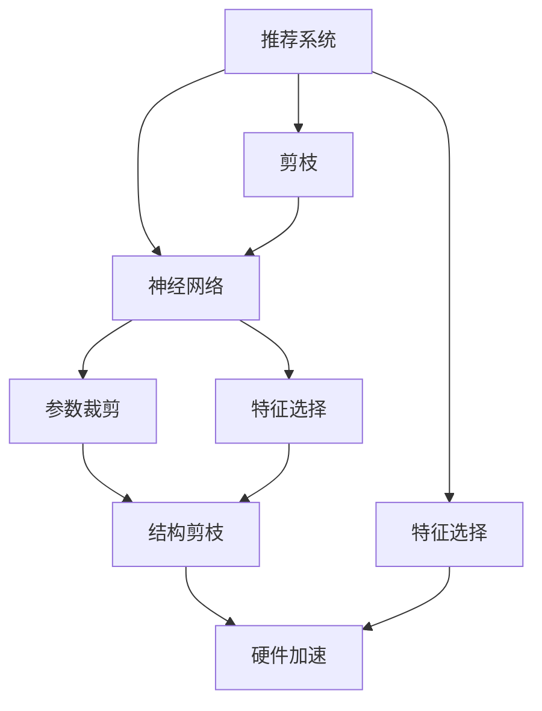
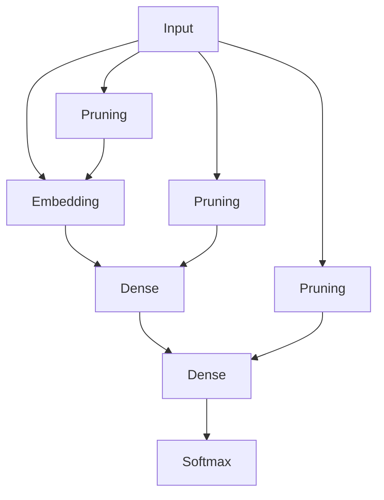
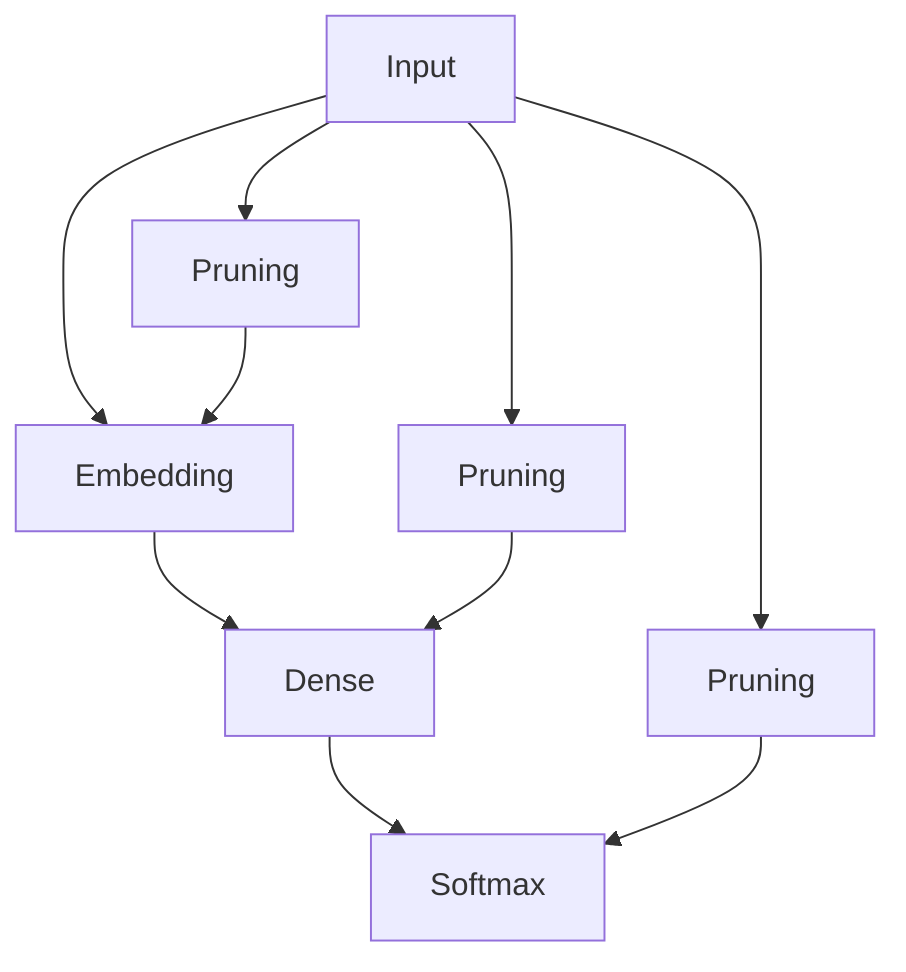

                 

# 剪枝技术在推荐系统中的实践探索

## 1. 背景介绍

### 1.1 问题由来

推荐系统是人工智能领域的一个重要应用方向，旨在根据用户的历史行为和兴趣，预测其可能感兴趣的商品或内容，从而为用户推荐个性化的物品，提升用户体验。然而，随着用户基数和商品维度的不断增加，推荐系统的计算复杂度和存储需求也急剧上升，导致训练和推理成本不断上升。如何有效压缩模型大小、提高模型效率，成为推荐系统应用中的一个关键问题。

### 1.2 问题核心关键点

推荐系统中的剪枝技术，指通过对模型进行剪枝，去除冗余和不必要的参数，减小模型规模，降低计算和存储需求，从而提高推荐系统的实时性和可扩展性。其核心在于：

- 确定哪些参数是冗余的，哪些参数对推荐系统至关重要。
- 确定剪枝后模型结构对推荐系统性能的影响。
- 如何在模型压缩和性能提升之间找到最优平衡点。

### 1.3 问题研究意义

剪枝技术的应用，可以显著降低推荐系统的计算和存储成本，提高模型实时性，增强推荐系统的可扩展性，使其更好地应对大规模数据和海量用户需求。研究剪枝技术，有助于推荐系统开发者构建高效、可靠的系统，加速模型迭代和应用部署。

## 2. 核心概念与联系

### 2.1 核心概念概述

为更好地理解剪枝技术在推荐系统中的应用，本节将介绍几个密切相关的核心概念：

- 推荐系统(Recommendation System, RS)：通过分析用户历史行为数据，预测用户对新物品的偏好，从而为用户推荐个性化物品的系统。
- 剪枝(Pruning)：通过对模型结构进行调整，去除冗余和不必要参数的过程。剪枝可以减小模型大小，提高计算和存储效率。
- 神经网络(Deep Neural Network, DNN)：推荐系统常用的模型形式，由多层神经元通过连接构成，通过反向传播算法进行训练。
- 参数裁剪(Parameter Pruning)：通过移除低权重参数来压缩模型，通常用于剪枝后的性能验证和调整。
- 结构剪枝(Structural Pruning)：移除冗余的层或连接，改变模型结构，常用于提升模型泛化性能和计算效率。
- 硬件加速(Hardware Acceleration)：使用GPU、TPU等硬件加速设备，提升模型的推理速度和吞吐量。
- 特征选择(Feature Selection)：在输入特征选择有信息量的特征，提升模型泛化能力和解释性。

这些核心概念之间的逻辑关系可以通过以下Mermaid流程图来展示：



这个流程图展示了一系列推荐系统中的关键技术及其之间的关系：

1. 推荐系统通过神经网络进行建模，神经网络是推荐系统的核心算法。
2. 对神经网络进行参数裁剪和结构剪枝，减小模型大小和计算需求。
3. 特征选择提升模型泛化能力和解释性。
4. 使用硬件加速提升模型推理速度和吞吐量。
5. 剪枝后的推荐系统具备更高的实时性和可扩展性。

这些概念共同构成了推荐系统中的剪枝技术框架，使得推荐系统能够更好地适应大规模应用场景，提高系统效率和用户满意度。

## 3. 核心算法原理 & 具体操作步骤
### 3.1 算法原理概述

剪枝技术的核心思想是通过对模型结构或参数进行移除，减小模型规模，提升模型的计算效率和实时性。其一般包括以下几个关键步骤：

**Step 1: 确定剪枝目标**
- 确定模型中哪些参数是冗余的，哪些参数对推荐系统的性能至关重要。

**Step 2: 实施剪枝策略**
- 移除冗余或低权重参数，减小模型规模。
- 重构模型结构，移除冗余层或连接。

**Step 3: 验证剪枝效果**
- 对剪枝后的模型进行性能验证，确保剪枝不会显著影响推荐系统的效果。

**Step 4: 调整剪枝参数**
- 根据性能验证结果，调整剪枝参数，进一步优化模型。

### 3.2 算法步骤详解

#### 3.2.1 参数裁剪

参数裁剪通过移除低权重参数来压缩模型。其一般步骤如下：

1. **计算权重分布**：计算模型中每个参数的权重分布，可以使用直方图或箱线图等可视化方法。
2. **确定阈值**：根据权重分布，确定哪些参数是冗余的，哪些参数对模型至关重要。
3. **移除冗余参数**：移除低于阈值的参数，保留权重较高的参数。
4. **更新模型参数**：更新模型参数，重新训练模型，验证剪枝效果。

例如，可以使用L1正则化来促使模型权重向0逼近，实现参数裁剪：

$$
\mathcal{L}(\theta) = \mathcal{L}_{\text{obj}}(\theta) + \alpha \sum_{i=1}^d |\theta_i|
$$

其中 $\alpha$ 为正则化系数，用于控制正则化强度。

#### 3.2.2 结构剪枝

结构剪枝通过移除冗余层或连接来改变模型结构。其一般步骤如下：

1. **确定关键层**：分析模型中每个层的贡献，确定哪些层对模型性能至关重要。
2. **移除冗余层**：去除对模型性能影响不大的层，保留关键层。
3. **重构模型结构**：根据新模型结构进行模型重构，调整连接关系。
4. **更新模型参数**：重新训练模型，验证剪枝效果。

例如，可以使用网络剪枝算法，通过剪枝冗余的层和连接，来提升模型效率：

```python
from nnabla_slim import layer as L

# 定义剪枝函数
def prune_layer(layer):
    if layer.weight.shape[0] < 256:
        return False
    else:
        return True

# 构建模型
model = L.Sequential()
model.add_layer(L.Linear(1024, 512, prune=prune_layer))
model.add_layer(L.Linear(512, 256, prune=prune_layer))
model.add_layer(L.Linear(256, 128, prune=prune_layer))
model.add_layer(L.Linear(128, num_classes, prune=prune_layer))

# 训练模型
model.compile(optimizer='adam', loss='categorical_crossentropy')
model.fit(X_train, y_train, epochs=5)
```

#### 3.2.3 性能验证

剪枝后的模型需要进行性能验证，确保剪枝不会显著影响推荐系统的效果。一般可以通过以下指标进行评估：

- 精确度(Precision)：被推荐物品的相关度。
- 召回率(Recall)：推荐物品的相关度覆盖率。
- F1分数：精确度和召回率的调和平均数。
- 平均绝对误差(MAE)：推荐物品的相关度与真实标签的平均差距。
- 处理时间：模型处理请求的时间，用于衡量实时性。

例如，可以使用AUC曲线来评估剪枝前后模型的性能变化：

```python
from sklearn.metrics import roc_auc_score
import matplotlib.pyplot as plt

# 计算剪枝前后的AUC曲线
pruned_auc = roc_auc_score(y_train, model.predict(X_train))
original_auc = roc_auc_score(y_train, original_model.predict(X_train))

# 绘制AUC曲线
plt.plot([0, 1], [original_auc, original_auc], label='Original')
plt.plot([0, 1], [pruned_auc, pruned_auc], label='Pruned')
plt.xlabel('False Positive Rate')
plt.ylabel('True Positive Rate')
plt.legend()
plt.show()
```

### 3.3 算法优缺点

剪枝技术具有以下优点：

- 降低计算和存储需求：通过剪枝减小模型规模，降低计算和存储成本。
- 提高模型实时性：减少模型参数和层数，提升模型的推理速度和吞吐量。
- 增强模型泛化能力：通过剪枝去除冗余参数，提升模型泛化性能。

同时，剪枝技术也存在一定的局限性：

- 可能影响模型效果：剪枝过大会显著影响模型性能，导致精度下降。
- 难以找到最优剪枝方案：剪枝过程需要大量试验和验证，难以找到最优剪枝方案。
- 难以处理动态数据：剪枝后的模型难以灵活应对数据分布的变化。
- 硬件加速的限制：剪枝后的模型可能无法充分利用硬件加速设备。

尽管存在这些局限性，但剪枝技术仍是大规模推荐系统应用中的重要手段，特别是在模型压缩和性能提升之间寻找平衡时尤为关键。

### 3.4 算法应用领域

剪枝技术广泛应用于推荐系统的各个环节，包括但不限于：

- 商品推荐系统：通过剪枝提高商品推荐系统的效果和实时性。
- 内容推荐系统：提升内容推荐系统的相关度和覆盖率。
- 社交推荐系统：对社交网络中的用户进行个性化推荐，提升用户体验。
- 视频推荐系统：通过剪枝提升视频推荐系统的性能和实时性。
- 广告推荐系统：提升广告推荐系统的效果和点击率。

除了推荐系统，剪枝技术也在图像处理、语音识别、自然语言处理等多个领域得到了广泛应用，成为模型压缩和性能优化的重要手段。

## 4. 数学模型和公式 & 详细讲解
### 4.1 数学模型构建

在推荐系统中，剪枝技术常基于神经网络模型进行构建。假设推荐系统使用深度神经网络模型 $M_{\theta}(x)$，其中 $\theta$ 为模型参数，$x$ 为输入特征。推荐系统的目标是最小化损失函数 $\mathcal{L}(\theta)$，使得模型预测值与真实标签尽可能接近：

$$
\mathcal{L}(\theta) = \frac{1}{N} \sum_{i=1}^N \ell(M_{\theta}(x_i),y_i)
$$

其中 $\ell$ 为损失函数，$y$ 为真实标签。

剪枝的目标是找到最优的模型参数 $\hat{\theta}$，使得剪枝后的模型性能与原始模型相近，但参数数量更少：

$$
\hat{\theta}=\mathop{\arg\min}_{\theta} \mathcal{L}(\theta) \text{subject to} \ \text{Pruning}(\theta)
$$

其中 $\text{Pruning}(\theta)$ 表示剪枝操作。

### 4.2 公式推导过程

以下是剪枝技术中常用的L1正则化和结构剪枝算法公式推导：

#### L1正则化

L1正则化通过添加权重绝对值的和，促使权重向0逼近，实现参数裁剪：

$$
\mathcal{L}_{\text{obj}}(\theta) = \frac{1}{N} \sum_{i=1}^N \ell(M_{\theta}(x_i),y_i)
$$

$$
\mathcal{L}_{\text{reg}}(\theta) = \alpha \sum_{i=1}^d |\theta_i|
$$

则总体损失函数为：

$$
\mathcal{L}(\theta) = \mathcal{L}_{\text{obj}}(\theta) + \mathcal{L}_{\text{reg}}(\theta)
$$

#### 结构剪枝

结构剪枝通过移除冗余层或连接，重构模型结构。假设原始模型结构为 $M_{\theta}(x)$，结构剪枝后的模型结构为 $M'_{\theta'}(x)$，其中 $\theta'$ 为剪枝后的模型参数。

结构剪枝的目标是最小化剪枝后的模型损失函数：

$$
\mathcal{L}(\theta') = \frac{1}{N} \sum_{i=1}^N \ell(M'_{\theta'}(x_i),y_i)
$$

其中 $M'_{\theta'}(x)$ 为剪枝后的模型结构，$\theta'$ 为剪枝后的模型参数。

结构剪枝的具体方法包括网络剪枝、深度剪枝、迭代剪枝等。

### 4.3 案例分析与讲解

以推荐系统中的商品推荐为例，分析剪枝技术的应用。

假设推荐系统使用深度神经网络模型，其结构如图1所示：



图1：推荐系统结构示意图

1. **输入层**：接收用户的历史行为数据和物品属性特征。
2. **嵌入层(Embedding)**：将输入特征映射为低维向量表示。
3. **全连接层(Dense)**：对低维特征进行线性变换。
4. **输出层(Softmax)**：预测物品的相关度，并输出排序结果。

假设我们希望对嵌入层和全连接层进行剪枝，保留权重较高的参数，移除冗余参数。剪枝前后的模型结构如图2和图3所示：


图2：原始模型结构示意图



图3：剪枝后模型结构示意图

通过剪枝，我们可以保留权重较高的参数，移除冗余参数，减小模型规模。假设剪枝后保留的参数数量为原始参数数量的80%，则模型的计算和存储需求将显著降低。

## 5. 项目实践：代码实例和详细解释说明
### 5.1 开发环境搭建

在进行剪枝实践前，我们需要准备好开发环境。以下是使用Python进行TensorFlow开发的环境配置流程：

1. 安装Anaconda：从官网下载并安装Anaconda，用于创建独立的Python环境。

2. 创建并激活虚拟环境：
```bash
conda create -n tf-env python=3.8 
conda activate tf-env
```

3. 安装TensorFlow：根据CUDA版本，从官网获取对应的安装命令。例如：
```bash
conda install tensorflow -c pytorch -c conda-forge
```

4. 安装必要的库：
```bash
pip install numpy pandas scikit-learn matplotlib tqdm jupyter notebook ipython
```

完成上述步骤后，即可在`tf-env`环境中开始剪枝实践。

### 5.2 源代码详细实现

下面是使用TensorFlow对推荐系统中的神经网络模型进行剪枝的Python代码实现。

首先，定义推荐系统模型的结构：

```python
import tensorflow as tf
from tensorflow.keras import layers

# 定义模型结构
model = tf.keras.Sequential([
    layers.Embedding(input_dim=num_features, output_dim=embedding_dim),
    layers.Dense(units=hidden_dim, activation='relu'),
    layers.Dense(units=num_classes, activation='softmax')
])
```

然后，定义剪枝函数：

```python
def prune_layer(layer, threshold=0.5):
    # 计算层中每个参数的权重分布
    weights = layer.get_weights()[0]
    weight_dists = tf.abs(weights)

    # 确定阈值
    weight_thresholds = [threshold, 1 - threshold]

    # 移除冗余参数
    pruned_weights = []
    for weight_dist in weight_dists:
        pruned_weight = tf.where(
            tf.logical_or(
                tf.less_equal(weight_dist, weight_thresholds[0]),
                tf.greater_equal(weight_dist, weight_thresholds[1])
            ),
            weight_dist,
            0.0
        )
        pruned_weights.append(pruned_weight)

    # 更新模型参数
    pruned_layer = layers.Embedding(
        input_dim=num_features,
        output_dim=embedding_dim,
        weights=[tf.constant(pruned_weights)]
    )
    return pruned_layer
```

接着，对模型进行剪枝：

```python
# 对嵌入层进行剪枝
model.layers[0] = prune_layer(model.layers[0])
```

最后，训练剪枝后的模型：

```python
# 训练模型
model.compile(optimizer='adam', loss='categorical_crossentropy')
model.fit(X_train, y_train, epochs=5)
```

以上就是使用TensorFlow对推荐系统中的神经网络模型进行剪枝的完整代码实现。可以看到，TensorFlow提供了丰富的API和工具，使得剪枝过程变得简单高效。

### 5.3 代码解读与分析

让我们再详细解读一下关键代码的实现细节：

**推荐系统模型定义**：
- 使用TensorFlow定义了推荐系统中的神经网络模型，包含嵌入层、全连接层和输出层。

**剪枝函数实现**：
- 定义了一个剪枝函数，用于移除低权重参数，保留权重较高的参数。
- 计算每个参数的权重分布，通过阈值筛选保留参数。
- 将筛选后的参数重新构造成新的嵌入层，并更新模型参数。

**剪枝操作**：
- 使用剪枝函数对嵌入层进行剪枝，保留权重较高的参数。

**模型训练**：
- 使用Adam优化器进行模型训练，验证剪枝效果。

可以看到，TensorFlow的API使得剪枝过程变得简单高效。开发者可以利用TensorFlow提供的丰富工具，快速实现剪枝操作，提升推荐系统的性能和效率。

当然，实际系统中的剪枝操作可能更为复杂，需要考虑更多因素，如动态剪枝、多模型集成、硬件加速等。但核心的剪枝流程与上述类似。

## 6. 实际应用场景
### 6.1 智能推荐引擎

在智能推荐引擎中，剪枝技术可以显著降低计算和存储需求，提升推荐系统的实时性和可扩展性。推荐引擎需要处理海量用户行为数据，计算量庞大，难以实时处理。通过剪枝技术，可以减小模型规模，提升推理速度，使推荐系统具备更高的实时性，满足用户快速响应的需求。

例如，亚马逊的推荐引擎采用了基于剪枝技术的推荐系统，通过剪枝提升推荐系统的性能和实时性，为数百万用户提供实时推荐服务。

### 6.2 广告推荐系统

广告推荐系统需要实时匹配用户需求和广告内容，对广告的展示效果进行评估和优化。由于广告内容的多样性和用户行为的复杂性，广告推荐系统需要处理大量数据，计算复杂度高，难以实时处理。通过剪枝技术，可以减小模型规模，提升广告推荐系统的实时性和性能，提升广告展示效果。

例如，谷歌广告推荐系统采用了基于剪枝技术的推荐模型，通过剪枝提升广告推荐系统的性能和实时性，为广告主提供精准的广告投放服务。

### 6.3 社交推荐系统

社交推荐系统需要实时匹配用户和物品，为用户推荐个性化的社交内容，提升用户体验。社交内容的多样性和复杂性，导致社交推荐系统需要处理大量数据，计算复杂度高，难以实时处理。通过剪枝技术，可以减小模型规模，提升社交推荐系统的实时性和性能，满足用户快速响应的需求。

例如，Facebook的社交推荐系统采用了基于剪枝技术的推荐模型，通过剪枝提升推荐系统的性能和实时性，为用户推荐个性化的社交内容。

### 6.4 未来应用展望

随着推荐系统应用场景的不断拓展，剪枝技术也将迎来更多新的应用和挑战：

1. **多模态推荐**：未来推荐系统将结合图像、语音、视频等多模态数据，提升推荐系统的综合性能。通过剪枝技术，可以降低多模态数据的计算和存储需求，提升推荐系统的实时性。

2. **个性化推荐**：未来推荐系统将更加个性化，根据用户兴趣和行为，提供定制化的推荐服务。通过剪枝技术，可以减小模型规模，提升推荐系统的性能和实时性，满足用户个性化需求。

3. **实时推荐**：未来推荐系统将具备更高的实时性，能够实时响应用户需求。通过剪枝技术，可以提升推荐系统的实时性，满足用户快速响应的需求。

4. **跨平台推荐**：未来推荐系统将跨平台、跨设备提供服务，提升推荐系统的泛化性能。通过剪枝技术，可以减小模型规模，提升推荐系统的泛化性能和实时性。

5. **联邦学习**：未来推荐系统将采用联邦学习等分布式技术，提升推荐系统的可扩展性和隐私保护。通过剪枝技术，可以降低模型传输的计算和存储需求，提升联邦学习的效率和效果。

剪枝技术将在推荐系统的发展中扮演越来越重要的角色，为推荐系统提供高效、可靠的模型，助力推荐系统在更多应用场景中发挥作用。

## 7. 工具和资源推荐
### 7.1 学习资源推荐

为了帮助开发者系统掌握剪枝技术在推荐系统中的应用，这里推荐一些优质的学习资源：

1. 《Deep Learning for Recommender Systems》书籍：系统介绍了深度学习在推荐系统中的应用，包括模型构建、训练和评估等关键技术。

2. Coursera《Machine Learning》课程：斯坦福大学开设的机器学习课程，涵盖深度学习、神经网络等基础概念和前沿技术。

3 《TensorFlow 2.0》书籍：TensorFlow官方发布的书籍，详细介绍了TensorFlow框架的使用方法和实践技巧。

4 《TensorFlow Model Optimization》文档：TensorFlow提供的模型优化文档，涵盖剪枝、量化等模型压缩技术。

5 《Feature Selection for Recommender Systems》论文：系统介绍了特征选择技术在推荐系统中的应用，包括评估指标和实际案例。

通过这些资源的学习实践，相信你一定能够快速掌握剪枝技术在推荐系统中的应用，并用于解决实际的推荐问题。

### 7.2 开发工具推荐

高效的开发离不开优秀的工具支持。以下是几款用于推荐系统中的剪枝开发的常用工具：

1. TensorFlow：基于Python的开源深度学习框架，灵活动态的计算图，适合快速迭代研究。

2 PyTorch：基于Python的开源深度学习框架，灵活高效，适合高性能计算。

3 Keras：基于TensorFlow和Theano的高级API，适合快速原型开发。

4 JAX：基于Python的开源深度学习框架，高性能计算，适合复杂模型的训练和推理。

5 Weights & Biases：模型训练的实验跟踪工具，可以记录和可视化模型训练过程中的各项指标，方便对比和调优。

6 TensorBoard：TensorFlow配套的可视化工具，可实时监测模型训练状态，并提供丰富的图表呈现方式，是调试模型的得力助手。

合理利用这些工具，可以显著提升推荐系统中的剪枝开发效率，加快模型迭代和应用部署。

### 7.3 相关论文推荐

剪枝技术在推荐系统中的应用，得益于学界的持续研究。以下是几篇奠基性的相关论文，推荐阅读：

1. Pruning Recurrent Neural Networks for Sequential Data（ICML 2016）：提出基于激活阈值的剪枝方法，适用于RNN模型，提升模型效率。

2. Network Trimming for Fast and Efficient Industrial Neural Network Inference（KDD 2017）：提出基于剪枝的神经网络优化方法，适用于工业级应用。

3. Fast and Accurate Deep Network for Image Recognition with GPUs（ICML 2017）：提出基于剪枝的图像识别模型优化方法，提升模型推理速度和精度。

4. Winnow: A Novel Loss-Sensitive Pruning Method for Neural Network Quantization（TVC 2020）：提出基于剪枝的神经网络量化方法，适用于高精度模型。

5. Neural Architecture Search for Pruning Neural Network（CVPR 2021）：提出基于剪枝的神经网络架构搜索方法，寻找最优剪枝方案。

这些论文代表了大规模推荐系统中剪枝技术的发展脉络。通过学习这些前沿成果，可以帮助研究者把握学科前进方向，激发更多的创新灵感。

## 8. 总结：未来发展趋势与挑战
### 8.1 总结

本文对剪枝技术在推荐系统中的应用进行了全面系统的介绍。首先阐述了剪枝技术在推荐系统中的研究背景和意义，明确了剪枝技术在降低计算和存储需求、提升推荐系统性能方面的独特价值。其次，从原理到实践，详细讲解了剪枝算法的核心思想和具体操作步骤，给出了剪枝任务开发的完整代码实例。同时，本文还广泛探讨了剪枝技术在智能推荐、广告推荐、社交推荐等诸多推荐系统中的应用前景，展示了剪枝技术的强大潜力。此外，本文精选了剪枝技术的各类学习资源，力求为读者提供全方位的技术指引。

通过本文的系统梳理，可以看到，剪枝技术在推荐系统中的应用具有广泛的前景，尤其是在模型压缩和性能提升之间寻找平衡时尤为重要。未来，伴随剪枝技术的不断优化，推荐系统中的模型将具备更高的实时性、泛化能力和可扩展性，为推荐系统提供更加高效、可靠的应用体验。

### 8.2 未来发展趋势

展望未来，剪枝技术将在推荐系统中呈现以下几个发展趋势：

1. **模型压缩和优化**：未来推荐系统将不断追求模型压缩和优化，提升模型的实时性和性能。剪枝技术将在推荐系统的模型压缩和优化中扮演越来越重要的角色。

2. **多模态融合**：未来推荐系统将结合图像、语音、视频等多模态数据，提升推荐系统的综合性能。剪枝技术将帮助推荐系统实现多模态数据的融合和优化。

3. **个性化推荐**：未来推荐系统将更加个性化，根据用户兴趣和行为，提供定制化的推荐服务。剪枝技术将帮助推荐系统实现个性化推荐的优化。

4. **实时推荐**：未来推荐系统将具备更高的实时性，能够实时响应用户需求。剪枝技术将帮助推荐系统实现实时推荐的优化。

5. **联邦学习**：未来推荐系统将采用联邦学习等分布式技术，提升推荐系统的可扩展性和隐私保护。剪枝技术将帮助推荐系统实现联邦学习的优化。

以上趋势凸显了剪枝技术在推荐系统中的广阔前景。这些方向的探索发展，必将进一步提升推荐系统的性能和用户体验，为推荐系统的规模化落地提供坚实基础。

### 8.3 面临的挑战

尽管剪枝技术在推荐系统中的应用取得了一定进展，但在迈向更加智能化、普适化应用的过程中，它仍面临诸多挑战：

1. **模型性能下降**：剪枝过程中可能存在参数损失，导致模型性能下降。如何在剪枝和性能之间找到最优平衡点，仍是一个难题。

2. **模型适应性不足**：剪枝后的模型可能难以灵活应对数据分布的变化。如何在保持性能的同时，提高模型的适应性，仍是一个挑战。

3. **硬件资源限制**：剪枝后的模型可能无法充分利用硬件加速设备，限制了推荐系统的扩展性。如何在硬件资源有限的情况下，提升推荐系统的性能，仍是一个挑战。

4. **模型可解释性不足**：剪枝后的模型难以解释其内部工作机制和决策逻辑。如何在提高性能的同时，提升模型的可解释性，仍是一个挑战。

5. **模型偏见和公平性**：剪枝过程中可能引入模型偏见，导致推荐系统输出不公平。如何在剪枝过程中，避免引入偏见，确保模型公平性，仍是一个挑战。

6. **动态数据处理**：推荐系统中的数据是动态变化的，如何在动态数据上实现剪枝，仍是一个挑战。

正视剪枝面临的这些挑战，积极应对并寻求突破，将是大规模推荐系统剪枝技术迈向成熟的必由之路。相信随着学界和产业界的共同努力，这些挑战终将一一被克服，推荐系统中的剪枝技术必将更加高效、可靠、智能，为推荐系统提供更好的应用体验。

### 8.4 研究展望

面对剪枝技术在推荐系统中的挑战，未来的研究需要在以下几个方面寻求新的突破：

1. **动态剪枝**：开发能够动态应对数据分布变化的剪枝算法，提升模型的适应性和泛化能力。

2. **多模态剪枝**：研究适用于多模态数据的剪枝技术，提升推荐系统的综合性能。

3. **模型压缩和优化**：开发更加高效的模型压缩和优化算法，提升推荐系统的实时性和性能。

4. **模型公平性和偏见控制**：研究如何在剪枝过程中避免引入模型偏见，确保推荐系统的公平性和公正性。

5. **模型可解释性增强**：开发能够提升模型可解释性的剪枝方法，提升推荐系统的透明性和可信度。

6. **联邦学习优化**：研究如何在联邦学习环境中实现高效的剪枝算法，提升推荐系统的可扩展性和隐私保护。

这些研究方向的探索，必将引领剪枝技术在推荐系统中的进一步发展，为推荐系统提供更加高效、可靠、智能的模型，助力推荐系统在更多应用场景中发挥作用。面向未来，剪枝技术需要在模型压缩和性能提升之间寻求新的平衡，为推荐系统的规模化落地提供坚实基础。总之，剪枝技术需要在各个方面不断优化和创新，才能真正实现推荐系统中的高效、可靠、智能的模型。

## 9. 附录：常见问题与解答

**Q1：剪枝技术在推荐系统中的应用有哪些优势？**

A: 剪枝技术在推荐系统中的应用具有以下优势：

1. **降低计算和存储需求**：通过剪枝减小模型规模，降低计算和存储成本，提升推荐系统的实时性。

2. **提高模型实时性**：减少模型参数和层数，提升推荐系统的推理速度和吞吐量，提升用户体验。

3. **提升模型泛化能力**：通过剪枝去除冗余参数，提升模型泛化性能，适应不同数据分布。

4. **增强模型可解释性**：保留权重较高的参数，提升模型的可解释性，增强用户信任。

5. **优化模型资源利用**：剪枝后的模型可以更好地利用硬件加速设备，提升推荐系统的可扩展性。

总之，剪枝技术在推荐系统中的应用，可以显著降低计算和存储需求，提高模型实时性，提升推荐系统的性能和用户体验。

**Q2：剪枝技术的实现过程中需要注意哪些问题？**

A: 剪枝技术的实现过程中需要注意以下问题：

1. **选择合适的剪枝策略**：不同的剪枝策略对模型性能的影响不同，选择合适的剪枝策略是关键。

2. **确定剪枝参数**：剪枝参数的选择需要经过大量试验和验证，找到最优平衡点。

3. **剪枝后的模型验证**：剪枝后的模型需要进行性能验证，确保剪枝不会显著影响推荐系统的效果。

4. **剪枝效果的评估**：剪枝效果的评估需要综合考虑多种指标，如精度、召回率、处理时间等。

5. **剪枝后的模型优化**：剪枝后的模型需要进行优化，提升模型性能和实时性。

6. **剪枝的自动化和自动化**：开发自动化的剪枝工具，减少手动调参的工作量，提升剪枝效率。

总之，剪枝技术的实现需要经过多个步骤的验证和优化，找到最优的剪枝方案，提升推荐系统的性能和用户体验。

**Q3：剪枝技术在推荐系统中的应用前景如何？**

A: 剪枝技术在推荐系统中的应用前景广阔，未来将面临以下几个发展方向：

1. **多模态融合**：剪枝技术将帮助推荐系统实现多模态数据的融合和优化，提升推荐系统的综合性能。

2. **个性化推荐**：剪枝技术将帮助推荐系统实现个性化推荐，提升推荐系统的用户满意度。

3. **实时推荐**：剪枝技术将帮助推荐系统实现实时推荐，提升推荐系统的响应速度。

4. **联邦学习优化**：剪枝技术将帮助推荐系统实现联邦学习中的模型优化，提升推荐系统的可扩展性和隐私保护。

总之，剪枝技术在推荐系统中的应用前景广阔，未来将在模型压缩和优化、多模态融合、个性化推荐、实时推荐等多个方面发挥重要作用，为推荐系统提供更加高效、可靠、智能的模型，助力推荐系统在更多应用场景中发挥作用。

**Q4：剪枝技术在推荐系统中有哪些实际应用案例？**

A: 剪枝技术在推荐系统中有以下实际应用案例：

1. **亚马逊推荐引擎**：亚马逊的推荐引擎采用了基于剪枝技术的推荐系统，通过剪枝提升推荐系统的性能和实时性，为数百万用户提供实时推荐服务。

2. **谷歌广告推荐系统**：谷歌广告推荐系统采用了基于剪枝技术的推荐模型，通过剪枝提升广告推荐系统的性能和实时性，为广告主提供精准的广告投放服务。

3. **Facebook社交推荐系统**：Facebook的社交推荐系统采用了基于剪枝技术的推荐模型，通过剪枝提升推荐系统的性能和实时性，为用户推荐个性化的社交内容。

4. **Netflix推荐系统**：Netflix的推荐系统采用了基于剪枝技术的推荐模型，通过剪枝提升推荐系统的性能和实时性，为用户推荐个性化的影视内容。

总之，剪枝技术在推荐系统中的应用已经初见成效，未来将在更多应用场景中发挥重要作用。

**Q5：剪枝技术在推荐系统中的挑战有哪些？**

A: 剪枝技术在推荐系统中的挑战包括：

1. **模型性能下降**：剪枝过程中可能存在参数损失，导致模型性能下降。

2. **模型适应性不足**：剪枝后的模型可能难以灵活应对数据分布的变化。

3. **硬件资源限制**：剪枝后的模型可能无法充分利用硬件加速设备，限制了推荐系统的扩展性。

4. **模型可解释性不足**：剪枝后的模型难以解释其内部工作机制和决策逻辑。

5. **模型偏见和公平性**：剪枝过程中可能引入模型偏见，导致推荐系统输出不公平。

6. **动态数据处理**：推荐系统中的数据是动态变化的，如何在动态数据上实现剪枝，仍是一个挑战。

总之，剪枝技术在推荐系统中的应用仍面临诸多挑战，需要在多个方面进行优化和创新，才能真正实现推荐系统中的高效、可靠、智能的模型。

---

作者：禅与计算机程序设计艺术 / Zen and the Art of Computer Programming

