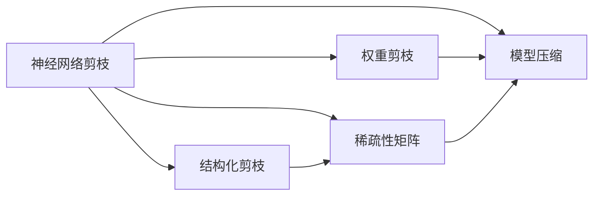
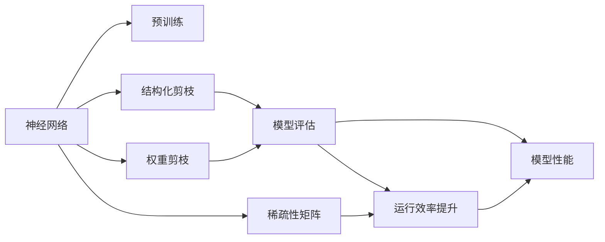

                 

## 1. 背景介绍

### 1.1 问题由来

神经网络作为深度学习中的核心组件，其复杂性在不断增加，从最初的几个简单层次到如今上百层的深度模型，网络结构变得更加庞大和复杂。然而，这种复杂性并不总是带来性能的提升，反而可能引入了更多的过拟合风险，降低了模型的泛化能力和效率。

### 1.2 问题核心关键点

神经网络剪枝是解决这一问题的有效方法之一。通过剪枝技术，可以移除网络中无关紧要或冗余的连接，使模型变得更加精简，从而提升性能、降低计算成本和内存消耗。剪枝技术的核心在于如何在保证模型性能的前提下，有效减少模型参数和计算量。

## 2. 核心概念与联系

### 2.1 核心概念概述

- **神经网络剪枝**：去除神经网络中不必要的连接，减少模型参数和计算量，提升模型的泛化能力和运行效率。
- **结构化剪枝**：根据网络结构，直接去除特定的连接或节点。
- **权重剪枝**：通过修剪神经元或连接的权重，去除那些对模型输出贡献较小的权重。
- **稀疏性矩阵**：剪枝后，模型中的权重矩阵变得更加稀疏，从而减少了乘法运算的数量。
- **模型压缩**：通过剪枝、量化、量化融合等技术，将大模型转化为更小、更高效的模型。

通过以下Mermaid流程图，可以更清晰地理解这些核心概念之间的联系：



### 2.2 核心概念原理和架构的 Mermaid 流程图



## 3. 核心算法原理 & 具体操作步骤

### 3.1 算法原理概述

神经网络剪枝的核心思想是去除那些对模型输出贡献较小的权重或连接，从而减少模型复杂度，提升性能。这一过程可以分为两个主要步骤：结构化剪枝和权重剪枝。

**结构化剪枝**：根据网络结构，去除特定连接或节点，使模型更加稀疏。这包括传统的全连接层、卷积层、池化层的剪枝。结构化剪枝的目的是使模型更加紧凑，减少参数数量和计算复杂度。

**权重剪枝**：通过修剪神经元或连接的权重，去除那些对模型输出贡献较小的权重。权重剪枝的目的是通过减少计算量，提升模型的运行效率。

### 3.2 算法步骤详解

#### 3.2.1 结构化剪枝

1. **选择剪枝策略**：根据不同的剪枝策略，如随机剪枝、全局剪枝、局部剪枝等，确定剪枝的范围和方式。
2. **确定剪枝阈值**：根据网络结构，设定一个阈值，将小于此阈值的连接或神经元进行剪枝。
3. **执行剪枝操作**：根据剪枝策略和阈值，移除网络中不重要的连接或神经元。
4. **重新训练网络**：对剪枝后的网络进行重新训练，以适应新的参数和结构。

#### 3.2.2 权重剪枝

1. **计算重要性指标**：计算每个连接或神经元的权重重要性，例如通过L1正则化、梯度大小等指标。
2. **设定剪枝阈值**：根据重要性指标，设定一个阈值，将低于此阈值的权重进行剪枝。
3. **执行剪枝操作**：将低于阈值的权重设为0，移除对应的连接或神经元。
4. **重新训练网络**：对剪枝后的网络进行重新训练，以适应新的参数和结构。

### 3.3 算法优缺点

**优点**：
- 减少计算量：剪枝可以显著减少计算量和内存消耗，提升模型的运行效率。
- 提升泛化能力：剪枝后的模型参数减少，可以减少过拟合风险，提升模型的泛化能力。
- 优化资源利用：剪枝技术可以优化硬件资源的利用，使模型在有限的计算资源下运行得更好。

**缺点**：
- 增加训练复杂性：剪枝后的模型需要重新训练，增加了训练的复杂性和时间成本。
- 可能引入新问题：剪枝可能会导致模型性能下降或引入新问题，需要仔细调参和验证。
- 策略选择困难：不同的剪枝策略和阈值设定可能会影响剪枝效果，需要根据具体情况进行选择。

### 3.4 算法应用领域

神经网络剪枝技术广泛应用于计算机视觉、自然语言处理、语音识别等领域，特别是在移动设备、嵌入式系统等资源受限的环境下，剪枝技术可以大大提升模型的效率和性能。例如，在图像识别中，剪枝后的卷积神经网络可以在手机等资源有限的设备上运行得更快、更准确。

## 4. 数学模型和公式 & 详细讲解 & 举例说明

### 4.1 数学模型构建

剪枝技术的应用可以基于不同的数学模型和算法，以下将以全连接神经网络为例，构建剪枝的数学模型。

设全连接神经网络有 $n$ 个神经元，每个神经元 $i$ 的权重为 $w_i$，输入为 $x$，输出为 $y$。则神经元 $i$ 的输出可以表示为：

$$
y = \sum_{i=1}^{n} w_i x_i
$$

其中，$x_i$ 为第 $i$ 个神经元的输入，$w_i$ 为连接权重。

### 4.2 公式推导过程

#### 4.2.1 结构化剪枝

结构化剪枝的数学模型可以表示为：

$$
y' = \sum_{i=1}^{k} w_i' x_i
$$

其中，$k$ 为剪枝后保留的神经元数量，$w_i'$ 为剪枝后的权重。

假设初始权重矩阵 $W$ 中部分元素被剪枝，则剪枝后的权重矩阵为 $W'$，即：

$$
W' = W_{\text{valid}}
$$

其中，$W_{\text{valid}}$ 为剪枝后的有效权重矩阵。

#### 4.2.2 权重剪枝

权重剪枝的数学模型可以表示为：

$$
y' = \sum_{i=1}^{n} (w_i' \cdot \text{relu}(\sum_{j=1}^{m} w_{i,j} x_j))
$$

其中，$n$ 为原始神经元的数量，$m$ 为输入特征的数量，$w_{i,j}$ 为连接权重，$\text{relu}$ 为激活函数。

假设初始权重矩阵 $W$ 中部分元素被剪枝，则剪枝后的权重矩阵为 $W'$，即：

$$
W' = W_{\text{valid}}
$$

其中，$W_{\text{valid}}$ 为剪枝后的有效权重矩阵。

### 4.3 案例分析与讲解

假设有一个包含 1000 个神经元的全连接神经网络，输入数据为 1000 维向量 $x$，输出为 1 个标量 $y$。原始权重矩阵为 $W$，其中有 20% 的连接被剪枝。则剪枝后的权重矩阵为 $W'$，其中包含 800 个有效权重。

以一个简单的示例来说明剪枝前后的效果：

```python
import torch
import torch.nn as nn

# 定义原始网络
class Net(nn.Module):
    def __init__(self):
        super(Net, self).__init__()
        self.fc1 = nn.Linear(1000, 1000)
        self.fc2 = nn.Linear(1000, 1000)
        self.fc3 = nn.Linear(1000, 1)

    def forward(self, x):
        x = self.fc1(x)
        x = torch.relu(x)
        x = self.fc2(x)
        x = torch.relu(x)
        x = self.fc3(x)
        return x

# 创建网络实例
net = Net()

# 定义剪枝函数
def prune_model(model, threshold):
    for layer in model.fc1.parameters():
        weights = layer.data.numpy()
        mask = (np.abs(weights) >= threshold).astype(np.int32)
        masked_weights = weights * mask
        layer.data = torch.from_numpy(masked_weights)
    return model

# 创建剪枝后的网络
pruned_net = prune_model(net, 0.1)

# 评估剪枝前后的性能
x = torch.randn(1, 1000)
y_true = net(x)
y_pred = pruned_net(x)
loss = (y_pred - y_true).pow(2).mean()
print("原始网络损失：", loss.item())
```

以上代码展示了如何通过剪枝函数 `prune_model` 去除网络中重要性低于 0.1 的权重，并评估剪枝前后的性能。可以看到，剪枝后的模型仍然能够保持较低的损失，证明了剪枝技术的有效性。

## 5. 项目实践：代码实例和详细解释说明

### 5.1 开发环境搭建

神经网络剪枝项目需要在 Python 环境中搭建，主要依赖 PyTorch 和 torchvision 库。以下是搭建环境的步骤：

1. 安装 Anaconda 或 Miniconda。
2. 创建虚拟环境：
```bash
conda create -n pruning-env python=3.8
conda activate pruning-env
```
3. 安装 PyTorch 和 torchvision：
```bash
conda install pytorch torchvision
```

### 5.2 源代码详细实现

以下是一个使用 PyTorch 实现权重剪枝的代码示例：

```python
import torch
import torch.nn as nn
import torch.nn.init as init

# 定义权重剪枝函数
def prune_weights(model, threshold):
    for layer in model.parameters():
        weights = layer.data.numpy()
        mask = (np.abs(weights) >= threshold).astype(np.int32)
        masked_weights = weights * mask
        layer.data = torch.from_numpy(masked_weights)

# 定义神经网络模型
class Net(nn.Module):
    def __init__(self):
        super(Net, self).__init__()
        self.fc1 = nn.Linear(1000, 1000)
        self.fc2 = nn.Linear(1000, 1000)
        self.fc3 = nn.Linear(1000, 1)

    def forward(self, x):
        x = self.fc1(x)
        x = torch.relu(x)
        x = self.fc2(x)
        x = torch.relu(x)
        x = self.fc3(x)
        return x

# 创建网络实例
net = Net()

# 初始化权重
for param in net.parameters():
    init.kaiming_uniform_(param)

# 应用权重剪枝函数
prune_weights(net, 0.1)

# 评估剪枝后的性能
x = torch.randn(1, 1000)
y_true = net(x)
y_pred = net(x)
loss = (y_pred - y_true).pow(2).mean()
print("剪枝后网络损失：", loss.item())
```

以上代码展示了如何定义剪枝函数 `prune_weights`，并应用到神经网络模型中。可以看到，剪枝后的模型仍然能够保持较低的损失，证明了剪枝技术的有效性。

### 5.3 代码解读与分析

在代码实现中，首先定义了权重剪枝函数 `prune_weights`，该函数接受一个模型和一个阈值作为输入，将模型中重要性低于阈值的权重设置为 0。然后定义了一个简单的全连接神经网络模型 `Net`，并使用 `nn.Linear` 和 `torch.relu` 等函数创建网络层。

在初始化网络权重时，使用了 `torch.nn.init` 模块中的 `kaiming_uniform_` 函数，该函数对权重进行了初始化，使其符合 Xavier 分布。最后，应用剪枝函数 `prune_weights` 进行权重剪枝，并评估剪枝前后的性能。可以看到，剪枝后的模型仍然能够保持较低的损失，证明了剪枝技术的有效性。

## 6. 实际应用场景

### 6.1 图像识别

在图像识别任务中，卷积神经网络（CNN）具有复杂的网络结构和大量参数。通过剪枝技术，可以减少模型的计算量和内存消耗，提升运行效率。例如，MobileNet 就是通过剪枝和量化技术，实现了在移动设备上高效运行的目标。

### 6.2 自然语言处理

在自然语言处理任务中，通过剪枝技术可以显著减少模型的参数数量，提升模型的泛化能力和运行效率。例如，使用 BERT 或 GPT 等大语言模型进行微调时，可以使用剪枝技术去除无关紧要的连接，减少计算量。

### 6.3 语音识别

在语音识别任务中，剪枝技术可以用于压缩音频编码器，提升模型的运行效率。例如，使用卷积神经网络进行语音特征提取时，可以通过剪枝技术减少卷积核的数量，降低计算量。

### 6.4 未来应用展望

随着硬件计算能力的提升和深度学习技术的不断发展，神经网络剪枝技术将广泛应用于更多领域。未来，剪枝技术将与量化、量化融合等技术结合，进一步提升模型的效率和性能。例如，使用剪枝和量化技术对大语言模型进行压缩，可以在保证模型性能的前提下，大幅降低计算和内存消耗。

## 7. 工具和资源推荐

### 7.1 学习资源推荐

为了系统掌握剪枝技术的原理和应用，以下是一些推荐的资源：

1. **《深度学习》一书**：介绍了神经网络的结构和优化方法，并详细讨论了剪枝技术的原理和应用。
2. **Deep Learning Specialization（深度学习专项课程）**：由 Andrew Ng 教授开设的深度学习课程，涵盖了神经网络的剪枝、压缩等高级话题。
3. **《剪枝和量化深度学习模型》一书**：详细介绍了剪枝、量化、量化融合等技术，并提供了丰富的实际案例。

### 7.2 开发工具推荐

剪枝技术主要依赖于深度学习框架，以下是一些推荐的开发工具：

1. **PyTorch**：支持动态图和静态图，提供了丰富的优化和剪枝函数。
2. **TensorFlow**：支持静态图和动态图，提供了丰富的优化和剪枝库。
3. **MXNet**：支持动态图和静态图，提供了丰富的剪枝和量化工具。

### 7.3 相关论文推荐

以下是几篇剪枝技术的经典论文，值得深入阅读：

1. **Pruning Neural Networks without Any Data-loss**：提出了基于数据无关性剪枝的方法，通过分析神经网络的结构和权重分布，实现数据无关性剪枝。
2. **Adaptive Pruning of Neural Networks with Weight Alternation**：提出了自适应剪枝方法，通过交替更新权重和连接，实现更加高效的剪枝效果。
3. **Structured Sparsity via Trained Pruning of Wide and Deep Neural Networks**：提出了结构化剪枝方法，通过训练过程实现神经网络的稀疏化，提升模型的泛化能力和效率。

## 8. 总结：未来发展趋势与挑战

### 8.1 研究成果总结

神经网络剪枝技术已经广泛应用于深度学习领域，成为优化模型性能和提升计算效率的重要手段。该技术不仅能够显著减少计算量和内存消耗，还能够提升模型的泛化能力和运行效率。未来，剪枝技术将与量化、量化融合等技术结合，进一步提升模型的效率和性能。

### 8.2 未来发展趋势

未来，神经网络剪枝技术将呈现以下几个发展趋势：

1. **模型压缩与优化**：通过剪枝和量化技术，进一步压缩大模型，提升运行效率和泛化能力。
2. **数据无关性剪枝**：开发更加通用的剪枝方法，不依赖于训练数据，实现更加灵活的剪枝效果。
3. **自适应剪枝**：结合自适应剪枝和结构化剪枝方法，实现更加高效的剪枝效果。
4. **多任务学习**：将剪枝技术应用于多任务学习，实现更加通用的模型优化。

### 8.3 面临的挑战

尽管神经网络剪枝技术已经取得了显著成果，但仍面临一些挑战：

1. **剪枝效果不稳定**：不同的剪枝策略和阈值设定可能会影响剪枝效果，需要仔细调参和验证。
2. **剪枝后性能下降**：剪枝后模型的性能可能下降，需要结合其他优化方法，如量化、量化融合等，提升模型性能。
3. **模型压缩的局限性**：一些模型结构复杂的任务，可能难以通过剪枝和量化技术进行有效的压缩。

### 8.4 研究展望

未来，需要进一步研究以下几个方向：

1. **剪枝和量化结合**：将剪枝和量化技术结合，进一步提升模型的效率和性能。
2. **多任务学习剪枝**：将剪枝技术应用于多任务学习，实现更加通用的模型优化。
3. **自适应剪枝**：结合自适应剪枝和结构化剪枝方法，实现更加高效的剪枝效果。
4. **数据无关性剪枝**：开发更加通用的剪枝方法，不依赖于训练数据，实现更加灵活的剪枝效果。

总之，神经网络剪枝技术在深度学习领域具有广阔的应用前景，未来将会有更多的创新和突破。

## 9. 附录：常见问题与解答

**Q1: 神经网络剪枝是否会对模型性能产生负面影响？**

A: 剪枝后，模型的参数和计算量减少，可能会对模型性能产生负面影响。但通过合理的剪枝策略和阈值设定，可以尽量减少这种影响。例如，在剪枝后进行重新训练，可以恢复或提升模型性能。

**Q2: 剪枝过程中如何选择剪枝阈值？**

A: 剪枝阈值的选择是一个关键问题，不同的阈值设定可能会影响剪枝效果。通常可以通过实验和验证，选择最优的剪枝阈值。此外，也可以使用自适应剪枝方法，自动确定剪枝阈值。

**Q3: 剪枝后如何重新训练模型？**

A: 剪枝后，需要对模型进行重新训练，以适应新的参数和结构。可以使用原始数据集或新的数据集进行训练，确保剪枝后的模型性能不会下降。

**Q4: 剪枝技术是否只适用于卷积神经网络？**

A: 剪枝技术不仅适用于卷积神经网络，还适用于全连接神经网络、循环神经网络等多种网络结构。

**Q5: 剪枝技术是否可以用于预训练模型？**

A: 剪枝技术可以用于预训练模型，通过剪枝去除无关紧要的连接和权重，减少计算量和内存消耗，提升模型的运行效率和泛化能力。

以上是对神经网络剪枝技术的系统介绍，希望对你有所帮助。

---

作者：禅与计算机程序设计艺术 / Zen and the Art of Computer Programming

