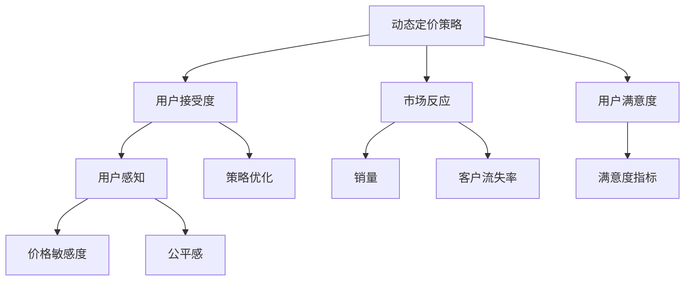

                 

# 动态定价策略的用户接受度

## 1. 背景介绍

### 1.1 问题由来
随着电子商务的蓬勃发展，在线零售商越来越多地依赖于动态定价策略来优化库存、提高销量、增加收益。动态定价是指根据市场需求变化，实时调整产品价格，以实现销售目标的策略。这种策略能够有效应对市场波动，提高销售效率，并帮助企业快速响应竞争。然而，动态定价策略的实施效果很大程度上取决于用户的接受度和满意度。如果用户对价格变化感到不公或不满意，动态定价策略不仅无法达到预期效果，还可能引发用户流失和负面口碑，损害企业品牌形象。

### 1.2 问题核心关键点
动态定价策略的成功实施依赖于用户对价格变化的接受程度。以下是几个关键点：
- 用户感知：用户如何理解和感受价格变化？
- 市场反应：动态定价策略对用户行为和销售效果的影响如何？
- 用户满意度：用户对动态定价策略的满意度和投诉情况。
- 策略优化：如何优化动态定价策略，提高用户接受度？

### 1.3 问题研究意义
研究动态定价策略的用户接受度，对于优化企业定价策略、提升用户体验、增加销售额和用户粘性具有重要意义。具体而言：
- 优化定价策略：了解用户对不同价格变化的反应，帮助企业设计更合理的价格区间。
- 提升用户体验：通过调整动态定价策略，避免用户因价格波动而感到不满，增强用户忠诚度。
- 增加销售额：通过精准定价，提高用户购买意愿，增加销售额和利润。
- 提高市场竞争力：动态定价策略可以迅速调整，帮助企业快速应对市场变化，增强市场竞争力。

## 2. 核心概念与联系

### 2.1 核心概念概述

为更好地理解动态定价策略的用户接受度，本节将介绍几个密切相关的核心概念：

- 动态定价策略(Dynamic Pricing Strategy)：根据市场需求和竞争状况，实时调整产品价格以优化销售目标的策略。常见的方法包括基于需求预测、基于竞争定价、基于用户行为的定价等。
- 用户接受度(User Acceptance)：用户对价格变化的感知和反应，直接影响企业动态定价策略的实施效果。
- 市场反应(Market Response)：动态定价策略实施后，市场和用户行为的变化情况，如销量、转化率、客户流失率等。
- 用户满意度(User Satisfaction)：用户对动态定价策略的满意程度，通常通过用户调查和反馈获得。
- 用户感知(User Perception)：用户对价格变化的理解和感受，包括价格敏感度、公平感、价格接受区间等。
- 策略优化(Strategy Optimization)：通过数据分析和实验设计，优化动态定价策略，提高用户接受度。

这些核心概念之间的逻辑关系可以通过以下Mermaid流程图来展示：



这个流程图展示了大语言模型的核心概念及其之间的关系：

1. 动态定价策略通过价格调整实现销售目标。
2. 用户接受度直接影响策略效果，需理解用户对价格变化的感受和反应。
3. 市场反应衡量策略实施后的销售效果和用户行为变化。
4. 用户满意度反映用户对策略的满意程度。
5. 用户感知包括价格敏感度、公平感等，影响用户接受度。
6. 策略优化通过数据分析和实验设计，优化策略以提高用户接受度。

这些概念共同构成了动态定价策略的用户接受度研究的框架，帮助我们系统地分析和改进策略。

## 3. 核心算法原理 & 具体操作步骤
### 3.1 算法原理概述

动态定价策略的用户接受度研究，本质上是一个多变量分析问题。其核心思想是通过收集用户反馈和市场数据，运用统计学、机器学习等方法，分析用户对价格变化的感知和反应，进而优化动态定价策略。

形式化地，假设动态定价策略的实施后，用户反馈为 $Y$，市场反应为 $X$。其中 $X$ 包括销量、客户流失率、转化率等指标。目标是通过多元回归模型等方法，找到 $X$ 和 $Y$ 之间的关系，以优化动态定价策略，提升用户接受度。

具体来说，多元回归模型为：

$$
Y = \beta_0 + \beta_1 X_1 + \beta_2 X_2 + \cdots + \beta_n X_n + \epsilon
$$

其中 $\beta_i$ 为回归系数，$X_i$ 为市场反应变量，$\epsilon$ 为误差项。模型通过最小化残差平方和，找到最优的 $\beta_i$，以预测用户接受度。

### 3.2 算法步骤详解

动态定价策略的用户接受度研究一般包括以下几个关键步骤：

**Step 1: 数据收集和预处理**
- 收集用户反馈和市场反应数据，包括用户评论、评分、销量、客户流失率等。
- 数据清洗和归一化，去除异常值和缺失值，将数据转化为机器学习模型可用的格式。

**Step 2: 模型选择和训练**
- 选择合适的回归模型（如线性回归、岭回归、Lasso回归等），构建用户接受度预测模型。
- 使用交叉验证等方法，训练模型，选择最优模型和超参数。
- 使用留一法等方法，验证模型在新数据上的泛化能力。

**Step 3: 用户感知分析**
- 收集用户对价格变化的感知数据，如价格敏感度、公平感、接受区间等。
- 通过统计分析和聚类等方法，分析用户对价格变化的感知和反应，理解用户接受度的本质。

**Step 4: 策略优化**
- 基于用户接受度预测模型和用户感知分析结果，调整动态定价策略。
- 使用A/B测试等方法，对比优化前后的策略效果，优化策略参数。
- 实时监测用户反馈和市场反应，持续改进策略。

**Step 5: 结果评估和应用**
- 通过用户满意度调查等方法，评估优化后的策略效果。
- 将优化后的策略应用于实际业务，监测销售效果和用户行为变化。
- 定期更新模型，适应市场和用户的变化。

以上是动态定价策略的用户接受度研究的一般流程。在实际应用中，还需要针对具体业务场景，对各环节进行优化设计，如改进数据收集方法、选择合适的模型和算法、设定合理的超参数等。

### 3.3 算法优缺点

动态定价策略的用户接受度研究具有以下优点：
1. 系统性分析：通过收集和分析大量数据，系统地理解用户对价格变化的感知和反应。
2. 量化评估：使用多元回归等模型，量化预测用户接受度，提供科学依据。
3. 动态调整：实时监测和调整策略，优化用户接受度。
4. 提升效果：通过优化策略，提升用户满意度和销售额。

同时，该方法也存在一定的局限性：
1. 数据依赖：研究结果高度依赖于数据质量，数据缺失或异常值可能影响分析结果。
2. 复杂度高：构建和优化模型过程复杂，需要专业知识。
3. 实时性问题：模型实时更新和调整需要时间和计算资源，可能导致策略调整延迟。
4. 模型假设：模型基于一定的假设，如线性关系、同方差等，可能不适用于特定场景。
5. 用户多样性：用户多样性和异质性可能影响模型效果。

尽管存在这些局限性，但就目前而言，基于多元回归等方法的动态定价策略研究仍然是最主流的研究范式。未来相关研究的重点在于如何进一步降低对数据质量的需求，提高模型的泛化能力，同时兼顾实时性和适用性等因素。

### 3.4 算法应用领域

动态定价策略的用户接受度研究在多个领域都有广泛的应用，例如：

- 电子商务：通过动态定价策略优化商品价格，提高用户满意度和销售额。
- 旅游和酒店：根据旅游季节、需求变化调整价格，优化用户体验。
- 航空和交通：根据航班时间、节假日等调整机票价格，提高航班利用率。
- 在线广告：通过动态定价策略优化广告投放，提升广告效果和用户点击率。
- 金融服务：根据市场和用户需求调整金融产品价格，提升客户满意度。

除了上述这些经典领域外，动态定价策略的用户接受度研究还在物流、能源、医疗等多个领域得到应用，为各行各业带来新的业务机会和发展空间。

## 4. 数学模型和公式 & 详细讲解 & 举例说明

### 4.1 数学模型构建

本节将使用数学语言对动态定价策略的用户接受度研究进行更加严格的刻画。

假设动态定价策略实施后的市场反应为 $X=\{X_1, X_2, \cdots, X_n\}$，其中 $X_i$ 为市场反应变量。用户反馈为 $Y$，表示用户对价格变化的接受程度，通常由评分、评论等量化指标表示。构建多元线性回归模型，预测用户接受度为：

$$
Y = \beta_0 + \beta_1 X_1 + \beta_2 X_2 + \cdots + \beta_n X_n + \epsilon
$$

其中 $\beta_i$ 为回归系数，$X_i$ 为市场反应变量，$\epsilon$ 为误差项。

### 4.2 公式推导过程

以下我们以线性回归模型为例，推导用户接受度预测公式及其梯度计算。

假设用户反馈 $Y$ 和市场反应 $X$ 的观测值分别为 $y_i$ 和 $x_{i1}, x_{i2}, \cdots, x_{in}$，则线性回归模型的最小二乘估计为：

$$
\beta_i = \frac{\sum_{i=1}^n x_{ij} y_i}{\sum_{i=1}^n x_{ij}^2} = \frac{\sum_{i=1}^n x_{ij} y_i}{\sum_{i=1}^n x_{ij}^2}
$$

其中 $x_{ij}$ 为第 $i$ 个观测值的第 $j$ 个变量。

代入最小二乘估计公式，得：

$$
\beta_i = \frac{\sum_{i=1}^n x_{ij} y_i}{\sum_{i=1}^n x_{ij}^2}
$$

根据梯度下降算法，模型参数 $\beta_i$ 的更新公式为：

$$
\beta_i \leftarrow \beta_i - \eta \frac{\partial \mathcal{L}(\beta_i)}{\partial \beta_i}
$$

其中 $\mathcal{L}$ 为损失函数，通常使用均方误差损失：

$$
\mathcal{L}(\beta_i) = \frac{1}{N}\sum_{i=1}^N (y_i - (\beta_0 + \sum_{j=1}^n \beta_j x_{ij}))^2
$$

对 $\mathcal{L}(\beta_i)$ 求偏导，得：

$$
\frac{\partial \mathcal{L}(\beta_i)}{\partial \beta_i} = -2 \sum_{i=1}^N \frac{y_i - (\beta_0 + \sum_{j=1}^n \beta_j x_{ij})}{\sum_{j=1}^n x_{ij}^2}
$$

在得到模型参数更新公式后，即可带入实际数据，完成用户接受度的预测。

### 4.3 案例分析与讲解

以一家电商平台为例，该平台根据用户浏览行为和购买历史，使用动态定价策略调整商品价格，提升销售额。平台收集了以下数据：

- 浏览时长：用户对商品页面浏览的平均时长。
- 购买频次：用户对商品购买的平均频次。
- 评价评分：用户对商品的评价评分。

使用多元线性回归模型预测用户对价格变化的接受程度：

1. 数据收集和预处理：收集上述数据，并进行清洗和归一化。

2. 模型选择和训练：选择多元线性回归模型，使用交叉验证等方法训练模型，选择最优模型和超参数。

3. 用户感知分析：通过问卷调查，收集用户对价格变化的感知数据，如价格敏感度、公平感、接受区间等。

4. 策略优化：基于回归模型和用户感知分析结果，调整动态定价策略。例如，对浏览时长短、购买频次低、评价评分低的产品，设置较低的价格敏感度，以提高用户购买意愿。

5. 结果评估和应用：通过用户满意度调查等方法，评估优化后的策略效果。实时监测用户反馈和市场反应，持续改进策略。

通过上述步骤，平台能够系统地理解用户对价格变化的感知和反应，优化动态定价策略，提升用户满意度和销售额。

## 5. 项目实践：代码实例和详细解释说明

### 5.1 开发环境搭建

在进行动态定价策略研究前，我们需要准备好开发环境。以下是使用Python进行Pandas和Scikit-learn开发的环境配置流程：

1. 安装Anaconda：从官网下载并安装Anaconda，用于创建独立的Python环境。

2. 创建并激活虚拟环境：
```bash
conda create -n dynamic-pricing python=3.8 
conda activate dynamic-pricing
```

3. 安装Pandas和Scikit-learn：
```bash
conda install pandas scikit-learn
```

4. 安装各类工具包：
```bash
pip install numpy matplotlib jupyter notebook ipython
```

完成上述步骤后，即可在`dynamic-pricing`环境中开始项目实践。

### 5.2 源代码详细实现

下面我们以电商平台的动态定价策略优化为例，给出使用Pandas和Scikit-learn进行回归分析和模型优化的PyTorch代码实现。

首先，定义回归模型类：

```python
import pandas as pd
from sklearn.linear_model import LinearRegression

class DynamicPricingModel:
    def __init__(self):
        self.model = LinearRegression()

    def train(self, X, y):
        self.model.fit(X, y)
        return self.model

    def predict(self, X):
        return self.model.predict(X)
```

然后，定义数据处理函数：

```python
def load_data(file_path):
    data = pd.read_csv(file_path)
    features = data[['浏览时长', '购买频次', '评价评分']]
    target = data['价格敏感度']
    features = (features - features.mean()) / features.std()
    return features, target
```

接着，定义模型训练和评估函数：

```python
from sklearn.model_selection import train_test_split
from sklearn.metrics import mean_squared_error

def train_model(model, X, y, test_size=0.2):
    X_train, X_test, y_train, y_test = train_test_split(X, y, test_size=test_size, random_state=42)
    model.fit(X_train, y_train)
    y_pred = model.predict(X_test)
    mse = mean_squared_error(y_test, y_pred)
    print(f"Model MSE: {mse:.3f}")

def evaluate_model(model, X, y):
    y_pred = model.predict(X)
    mse = mean_squared_error(y, y_pred)
    print(f"Test MSE: {mse:.3f}")
```

最后，启动训练流程并在测试集上评估：

```python
X_train, y_train = load_data('train.csv')
X_test, y_test = load_data('test.csv')

model = DynamicPricingModel()
model.train(X_train, y_train)
evaluate_model(model, X_test, y_test)
```

以上就是使用Pandas和Scikit-learn对电商平台动态定价策略进行回归分析和模型优化的完整代码实现。可以看到，得益于Pandas和Scikit-learn的强大封装，我们可以用相对简洁的代码完成动态定价策略的研究。

### 5.3 代码解读与分析

让我们再详细解读一下关键代码的实现细节：

**DynamicPricingModel类**：
- `__init__`方法：初始化回归模型对象。
- `train`方法：训练回归模型，返回模型对象。
- `predict`方法：使用训练好的模型进行预测。

**load_data函数**：
- `load_data`方法：加载数据，并进行标准化处理，以便于模型训练。

**train_model函数**：
- `train_model`方法：将数据集划分为训练集和测试集，训练回归模型，并在测试集上评估模型性能。

**evaluate_model函数**：
- `evaluate_model`方法：在测试集上评估回归模型的预测性能。

**训练流程**：
- 定义训练集和测试集。
- 创建回归模型对象。
- 训练回归模型，输出训练集和测试集的MSE值。
- 在测试集上评估模型性能，输出测试集的MSE值。

可以看到，Pandas和Scikit-learn使得动态定价策略的研究代码实现变得简洁高效。开发者可以将更多精力放在数据处理、模型改进等高层逻辑上，而不必过多关注底层的实现细节。

当然，工业级的系统实现还需考虑更多因素，如模型的保存和部署、超参数的自动搜索、更灵活的模型接口等。但核心的动态定价策略研究过程基本与此类似。

## 6. 实际应用场景

### 6.1 智能客服系统

动态定价策略在智能客服系统中也有广泛的应用。通过动态定价策略，智能客服系统可以根据用户行为和对话内容，实时调整服务价格，提升用户满意度和使用效率。

具体而言，系统可以记录用户历史互动数据，包括对话时长、咨询频次、问题类型等，使用动态定价策略计算最优服务价格。例如，对于频繁咨询、高复杂度问题的用户，系统可以设置更高的服务价格，以提高客户服务效率和满意度。

### 6.2 旅游和酒店

动态定价策略在旅游和酒店领域同样重要。航空公司和酒店可以基于市场需求和竞争状况，实时调整机票和酒店价格，提升用户体验和销售效果。

例如，航空公司可以根据预定高峰期、节假日等，动态调整机票价格。酒店可以根据市场需求和酒店入住率，实时调整房间价格，提高房间利用率和用户满意度。

### 6.3 金融服务

动态定价策略在金融服务领域也有重要应用。金融产品定价需要考虑市场变化、用户需求等因素，动态定价策略可以帮助金融机构实时调整产品价格，提升用户满意度和市场竞争力。

例如，银行可以根据用户的存款余额、消费习惯等因素，动态调整理财产品的利率。保险公司可以根据用户风险等级、市场风险等因素，实时调整保险产品的价格，提高客户满意度和销售效果。

### 6.4 未来应用展望

随着数据量的不断增长和计算技术的进步，动态定价策略的用户接受度研究将呈现以下几个发展趋势：

1. 数据来源多样化：除了传统电商数据，还将涵盖社交媒体、用户反馈等多渠道数据，提供更加全面的分析视角。
2. 实时化分析：使用实时数据流处理技术，如Kafka、Flink等，实现实时分析和决策。
3. 个性化定价：根据用户行为和偏好，提供个性化的定价方案，提升用户体验。
4. 跨领域融合：将动态定价策略与其他AI技术结合，如自然语言处理、图像识别等，实现更广泛的应用场景。
5. 模型解释性增强：引入可解释性技术，如LIME、SHAP等，增强模型决策的可理解性。
6. 模型集成优化：集成多种动态定价模型，如线性回归、决策树、神经网络等，提高模型的泛化能力和预测精度。

以上趋势凸显了动态定价策略的用户接受度研究的广阔前景。这些方向的探索发展，必将进一步提升企业定价的精准度和用户满意度，推动电子商务、旅游、金融等领域的高质量发展。

## 7. 工具和资源推荐
### 7.1 学习资源推荐

为了帮助开发者系统掌握动态定价策略的用户接受度研究的基础理论和实践技巧，这里推荐一些优质的学习资源：

1. 《动态定价：从理论到实践》系列博文：由动态定价专家撰写，深入浅出地介绍了动态定价的理论基础和实践方法。

2. 《动态定价策略》书籍：详细介绍了动态定价的理论和应用案例，适合进阶学习。

3. 《Python数据分析与可视化》书籍：讲解了Python在数据分析和可视化中的使用，提供了丰富的示例代码和数据集。

4. 《机器学习实战》系列课程：系统讲解了机器学习的基本概念和算法，适合初学者入门。

5. 动态定价社区和论坛：如Kaggle、GitHub等，提供大量开源数据集和案例分析，方便开发者学习和交流。

通过对这些资源的学习实践，相信你一定能够快速掌握动态定价策略的研究方法和应用技巧。

### 7.2 开发工具推荐

高效的开发离不开优秀的工具支持。以下是几款用于动态定价策略研究的常用工具：

1. Python：强大的动态语言，适合数据处理和机器学习开发。
2. Pandas：数据处理和分析库，提供了丰富的数据清洗和转换功能。
3. Scikit-learn：机器学习库，提供了多种回归模型和评估方法。
4. TensorFlow和PyTorch：深度学习框架，支持构建复杂的神经网络模型。
5. Jupyter Notebook：交互式开发环境，方便快速迭代和调试代码。
6. GitHub：版本控制平台，提供代码托管和团队协作功能。

合理利用这些工具，可以显著提升动态定价策略的研究开发效率，加快创新迭代的步伐。

### 7.3 相关论文推荐

动态定价策略的研究源于学界的持续研究。以下是几篇奠基性的相关论文，推荐阅读：

1. "Dynamic Pricing and Revenue Optimization"：阐述了动态定价的基本理论和算法，是动态定价领域的经典著作。
2. "Pricing Strategies in E-Commerce"：研究了电子商务中的动态定价问题，提供了大量实际案例和理论分析。
3. "Optimization of Dynamic Pricing in Online Markets"：介绍了动态定价在在线市场中的优化方法，提供了多场景的实际应用。
4. "A Survey on Dynamic Pricing"：综述了动态定价的研究进展，涵盖多种定价策略和优化方法。
5. "Data-Driven Dynamic Pricing"：研究了基于数据驱动的动态定价模型，提供了大量实验结果和分析方法。

这些论文代表了大语言模型微调技术的发展脉络。通过学习这些前沿成果，可以帮助研究者把握学科前进方向，激发更多的创新灵感。

## 8. 总结：未来发展趋势与挑战

### 8.1 总结

本文对动态定价策略的用户接受度研究进行了全面系统的介绍。首先阐述了动态定价策略的研究背景和意义，明确了用户接受度在定价策略实施中的重要地位。其次，从原理到实践，详细讲解了用户接受度的数学模型和关键步骤，给出了动态定价策略的代码实现。同时，本文还广泛探讨了用户接受度在多个行业领域的应用前景，展示了动态定价策略的巨大潜力。此外，本文精选了用户接受度研究的学习资源，力求为读者提供全方位的技术指引。

通过本文的系统梳理，可以看到，动态定价策略的用户接受度研究正在成为企业定价策略优化的一个重要范式，极大地拓展了企业定价的科学性和精准度。动态定价策略的优化不仅能提升用户满意度和销售额，还能增强企业的市场竞争力，推动各行业的数字化转型。未来，伴随数据量的不断增长和计算技术的进步，动态定价策略的用户接受度研究必将在更多领域得到应用，为经济社会发展注入新的动力。

### 8.2 未来发展趋势

展望未来，动态定价策略的用户接受度研究将呈现以下几个发展趋势：

1. 数据来源多样化：动态定价策略的研究将涵盖更多数据来源，如社交媒体、用户反馈等，提供更加全面的分析视角。
2. 实时化分析：实时数据流处理技术将使动态定价策略更加高效和灵活。
3. 个性化定价：根据用户行为和偏好，提供个性化的定价方案，提升用户体验。
4. 跨领域融合：将动态定价策略与其他AI技术结合，实现更广泛的应用场景。
5. 模型解释性增强：增强模型决策的可理解性，提高用户信任度。
6. 模型集成优化：集成多种定价模型，提高模型的泛化能力和预测精度。

以上趋势凸显了动态定价策略用户接受度研究的广阔前景。这些方向的探索发展，必将进一步提升企业定价的精准度和用户满意度，推动电子商务、旅游、金融等领域的高质量发展。

### 8.3 面临的挑战

尽管动态定价策略用户接受度研究已经取得了瞩目成就，但在迈向更加智能化、普适化应用的过程中，它仍面临着诸多挑战：

1. 数据质量瓶颈：数据缺失或异常值可能影响分析结果，需要高质量的数据采集和清洗。
2. 模型复杂度：构建和优化模型过程复杂，需要专业知识。
3. 实时性问题：实时更新和调整模型需要时间和计算资源，可能导致策略调整延迟。
4. 模型假设：模型基于一定的假设，可能不适用于特定场景。
5. 用户多样性：用户多样性和异质性可能影响模型效果。

尽管存在这些挑战，但就目前而言，基于多元回归等方法的动态定价策略研究仍然是最主流的研究范式。未来相关研究的重点在于如何进一步降低对数据质量的需求，提高模型的泛化能力，同时兼顾实时性和适用性等因素。

### 8.4 研究展望

面向未来，动态定价策略用户接受度研究的突破方向包括：

1. 探索无监督和半监督动态定价方法：摆脱对大规模标注数据的依赖，利用自监督学习、主动学习等方法，最大限度利用非结构化数据。
2. 研究参数高效和计算高效的定价方法：开发更加参数高效的定价方法，在固定大部分预训练参数的同时，只更新极少量的任务相关参数。
3. 融合因果和对比学习范式：增强定价模型建立稳定因果关系的能力，学习更加普适、鲁棒的价格表征。
4. 引入更多先验知识：将符号化的先验知识，如知识图谱、逻辑规则等，与神经网络模型进行巧妙融合，引导定价过程学习更准确、合理的定价模型。
5. 结合因果分析和博弈论工具：将因果分析方法引入定价模型，识别出模型决策的关键特征，增强定价输出的因果性和逻辑性。
6. 纳入伦理道德约束：在定价目标中引入伦理导向的评估指标，过滤和惩罚有偏见、有害的输出倾向。

这些研究方向的探索，必将引领动态定价策略用户接受度研究的进一步突破，为构建更加智能、公正、透明的定价系统铺平道路。面向未来，动态定价策略用户接受度研究还需要与其他人工智能技术进行更深入的融合，如自然语言处理、图像识别、强化学习等，多路径协同发力，共同推动定价系统的进步。只有勇于创新、敢于突破，才能不断拓展定价系统的边界，让智能技术更好地造福人类社会。

## 9. 附录：常见问题与解答

**Q1：动态定价策略是否适用于所有商品？**

A: 动态定价策略在大多数商品上都适用，但某些特定商品可能不适合。例如，对于某些奢侈品牌，商品定价受品牌形象和市场地位影响较大，难以单纯基于市场需求和竞争状况进行定价。

**Q2：动态定价策略对用户体验有何影响？**

A: 动态定价策略对用户体验的影响具有两面性。合理的定价策略可以提高用户满意度和购买意愿，但过度的价格波动可能导致用户不满和信任度下降。因此，动态定价策略需要考虑用户感知和公平感，避免用户对价格变化的敏感度过高。

**Q3：如何衡量动态定价策略的用户接受度？**

A: 用户接受度通常通过用户反馈和满意度调查来衡量。具体指标包括价格敏感度、公平感、价格接受区间等。通过统计分析，理解用户对价格变化的感受和反应。

**Q4：动态定价策略在实施中需要注意哪些问题？**

A: 动态定价策略在实施中需要注意以下问题：
1. 数据质量和完整性：数据缺失或异常值可能影响定价效果。
2. 算法复杂度：选择适当的定价模型和算法，避免模型过拟合。
3. 实时性：定价策略需要实时更新，确保响应市场变化。
4. 用户感知：定价策略需要考虑用户公平感和价格敏感度，避免过度波动。

这些问题的解决需要多方面的协作，包括数据收集、算法设计、用户反馈等。只有在综合考虑这些因素后，才能实现高效的动态定价策略。

**Q5：如何优化动态定价策略？**

A: 动态定价策略的优化需要考虑以下方面：
1. 数据收集和处理：收集用户行为数据，进行数据清洗和标准化。
2. 模型选择和训练：选择适当的定价模型，如线性回归、岭回归等，训练模型，选择最优模型和超参数。
3. 用户感知分析：通过问卷调查，收集用户对价格变化的感知数据，理解用户接受度。
4. 策略优化：基于回归模型和用户感知分析结果，调整定价策略，例如设置合理的定价区间，动态调整价格。
5. 结果评估和应用：通过用户满意度调查等方法，评估优化后的策略效果，持续改进策略。

通过以上步骤，可以系统地优化动态定价策略，提升用户满意度和销售额。

---

作者：禅与计算机程序设计艺术 / Zen and the Art of Computer Programming

