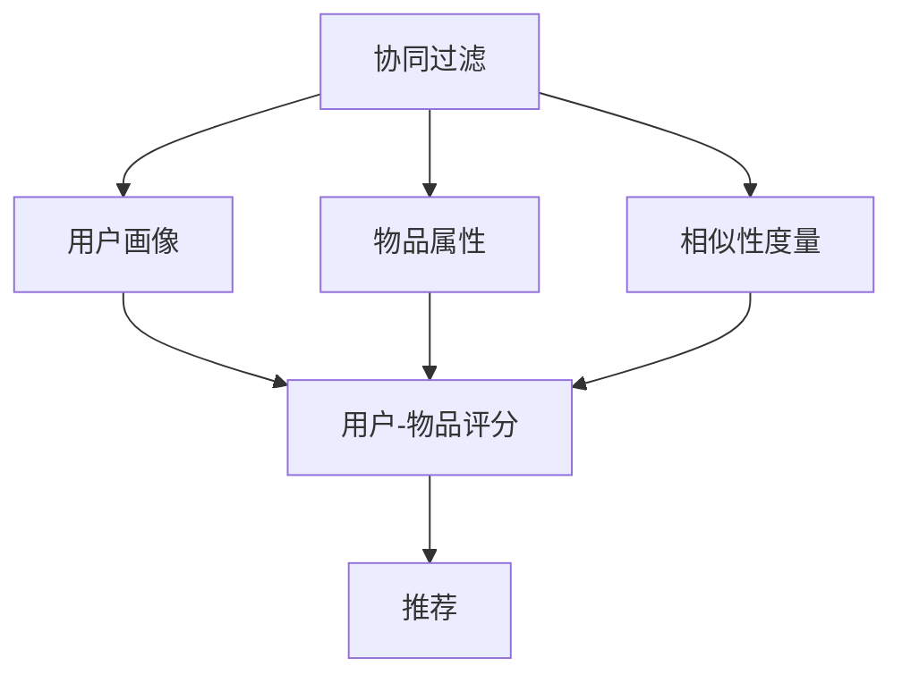

                 

## 1. 背景介绍

### 1.1 问题由来

推荐系统是互联网时代的一项核心技术，广泛应用于电商、社交、娱乐、新闻等众多领域。用户需要从海量的产品中挑选出符合自己需求的商品，但受限于时间和注意力的限制，决策过程往往繁琐而低效。推荐系统通过分析用户历史行为和兴趣偏好，提供个性化的推荐内容，极大地提升了用户体验和决策效率。

推荐系统的核心在于两个方面：用户画像的构建和物品推荐模型的设计。用户画像通过分析用户的行为数据、社交信息、历史评价等，生成一个多维度特征的向量，代表用户偏好和需求。物品推荐模型则根据用户画像和物品属性，计算预测用户对物品的兴趣程度，从而推荐最合适的商品。

协同过滤（Collaborative Filtering）作为推荐系统的一种经典算法，通过挖掘用户与物品的交互行为，发现用户之间的相似性以及物品之间的关联性，生成推荐。协同过滤算法的核心思想是通过用户和物品的协同信息进行推荐，而非仅仅依赖物品的属性信息，因此能更好地把握用户的个性化需求。

协同过滤算法在推荐系统中的重要性不言而喻。然而，面对海量数据和多样化的推荐场景，传统的协同过滤算法仍面临着诸多挑战，如处理稀疏矩阵、避免冷启动等问题。本文将系统介绍协同过滤算法的核心原理和操作步骤，探讨其优缺点和应用领域，并通过案例详细讲解其实现过程，帮助读者深入理解协同过滤算法。

### 1.2 问题核心关键点

协同过滤算法基于用户和物品的协同信息进行推荐，其核心在于挖掘用户之间的相似性和物品之间的关联性。常见的协同过滤算法有两种：基于用户的协同过滤和基于物品的协同过滤。

- **基于用户的协同过滤**：通过计算用户之间的相似性，推荐与用户A相似用户B喜欢的物品。
- **基于物品的协同过滤**：通过计算物品之间的相似性，推荐与物品A相似物品B给用户A。

协同过滤算法的关键在于用户和物品的相似性度量，以及如何处理稀疏矩阵和冷启动问题。用户相似性度量通常基于用户画像的余弦相似度或皮尔逊相关系数等，物品相似性度量则基于物品属性或用户对物品的评分等。处理稀疏矩阵的方法包括矩阵分解、低秩逼近、基于模型的协同过滤等。冷启动问题是指新用户或新物品没有足够的历史行为数据，如何提供有效推荐。

## 2. 核心概念与联系

### 2.1 核心概念概述

为了更好地理解协同过滤算法的核心原理，本节将介绍几个关键概念：

- **协同过滤**：通过用户和物品的协同信息进行推荐，发现用户之间的相似性和物品之间的关联性，生成推荐。
- **用户画像**：通过分析用户的历史行为数据、社交信息、评价等，构建一个多维度的用户特征向量，代表用户的偏好和需求。
- **物品属性**：用于描述物品的基本特征，如价格、类别、品牌等，是推荐系统的重要参考。
- **相似性度量**：用于计算用户之间或物品之间的相似性，常见的度量方法包括余弦相似度、皮尔逊相关系数、欧氏距离等。
- **稀疏矩阵**：在协同过滤算法中，用户与物品的交互数据往往非常稀疏，存储和计算效率较低。
- **冷启动问题**：新用户或新物品没有足够的历史行为数据，如何提供有效推荐。

这些概念之间的逻辑关系可以通过以下Mermaid流程图来展示：



这个流程图展示了大语言模型的核心概念及其之间的关系：

1. 协同过滤算法通过用户和物品的协同信息进行推荐，需要构建用户画像和物品属性，以及计算相似性度量。
2. 用户画像和物品属性共同组成用户-物品评分矩阵，协同过滤算法通过对评分矩阵的分析和优化，生成推荐。
3. 相似性度量是协同过滤算法的核心技术，影响推荐结果的准确性和多样性。

## 3. 核心算法原理 & 具体操作步骤

### 3.1 算法原理概述

协同过滤算法的核心在于通过用户和物品的协同信息进行推荐，发现用户之间的相似性和物品之间的关联性。其基本流程如下：

1. 收集用户与物品的交互数据，生成用户-物品评分矩阵。
2. 计算用户之间的相似性，生成用户相似性矩阵。
3. 计算物品之间的相似性，生成物品相似性矩阵。
4. 通过相似性矩阵进行推荐计算，生成推荐结果。

协同过滤算法包括基于用户的协同过滤和基于物品的协同过滤两种方法，其核心思想均是通过用户和物品的协同信息进行推荐，发现用户之间的相似性和物品之间的关联性。

### 3.2 算法步骤详解

#### 3.2.1 用户-物品评分矩阵的构建

用户-物品评分矩阵是协同过滤算法的基础，用于记录用户对物品的评分或点击行为。其一般表示为 $R_{m \times n}$，其中 $m$ 为用户数，$n$ 为物品数。每个元素的值 $R_{i,j}$ 表示用户 $i$ 对物品 $j$ 的评分，通常范围在 $[1, 5]$ 或 $[0, 1]$。

构建用户-物品评分矩阵的方法有两种：基于用户反馈的评分和基于用户点击行为的点击率。基于用户反馈的评分方法适用于评分数据较充足的场景，而基于用户点击行为的点击率方法则适用于评分数据稀疏的情况。

#### 3.2.2 相似性矩阵的计算

用户之间的相似性矩阵 $U$ 和物品之间的相似性矩阵 $I$ 用于计算推荐结果。相似性矩阵的计算方法包括余弦相似度、皮尔逊相关系数等。以余弦相似度为例，计算公式如下：

$$
S_u(i,j) = \cos\theta(u_i,u_j) = \frac{\sum_{k} R_{i,k}R_{j,k}}{\sqrt{\sum_{k} R_{i,k}^2} \sqrt{\sum_{k} R_{j,k}^2}}
$$

其中，$u_i$ 和 $u_j$ 分别代表用户 $i$ 和用户 $j$ 的用户画像向量。$R_{i,k}$ 和 $R_{j,k}$ 分别代表用户 $i$ 和用户 $j$ 对物品 $k$ 的评分。

#### 3.2.3 推荐结果的生成

推荐结果的生成过程如下：

1. 对于新用户或新物品，计算其与已有用户或物品的相似性，生成相似性矩阵 $U'$ 或 $I'$。
2. 将相似性矩阵 $U'$ 或 $I'$ 与用户-物品评分矩阵 $R$ 进行矩阵乘法操作，生成推荐结果 $P_{i,j}$。
3. 对推荐结果进行排序和截断，输出排名靠前的物品作为推荐结果。

### 3.3 算法优缺点

协同过滤算法的优点在于：

1. 能够充分利用用户的历史行为数据，发现用户之间的相似性和物品之间的关联性，生成高质量的推荐结果。
2. 适用于处理大规模数据，能够自动扩展，支持动态推荐。
3. 不需要对物品的属性信息进行建模，适用于各种类型的物品推荐。

协同过滤算法的缺点在于：

1. 无法处理冷启动问题，对新用户或新物品无法提供推荐。
2. 对稀疏矩阵的处理效率较低，需要大量的计算资源。
3. 对数据噪声敏感，用户评分和点击行为中存在的噪声可能会影响推荐结果的准确性。

### 3.4 算法应用领域

协同过滤算法广泛应用于电商、社交、娱乐、新闻等众多领域，其核心在于通过用户和物品的协同信息进行推荐，发现用户之间的相似性和物品之间的关联性，生成高质量的推荐结果。具体的应用领域包括：

- 电商推荐：通过分析用户历史购买行为，推荐商品给用户。
- 社交推荐：根据用户的历史社交行为，推荐好友、帖子等。
- 视频推荐：根据用户历史观看行为，推荐视频内容。
- 新闻推荐：根据用户历史阅读行为，推荐新闻内容。

除了上述这些典型应用外，协同过滤算法还被创新性地应用于游戏推荐、旅游推荐、金融推荐等领域，为各类场景提供了有效的推荐方案。

## 4. 数学模型和公式 & 详细讲解 & 举例说明

### 4.1 数学模型构建

协同过滤算法的数学模型可以表示为：

$$
R_{m \times n} = S_u \times I
$$

其中，$R_{m \times n}$ 为 $m \times n$ 的评分矩阵，$S_u$ 为 $m \times m$ 的用户相似性矩阵，$I$ 为 $n \times n$ 的物品相似性矩阵。

### 4.2 公式推导过程

以基于用户的协同过滤为例，其数学模型和推导过程如下：

假设用户-物品评分矩阵 $R_{m \times n}$，用户相似性矩阵 $S_u$，物品相似性矩阵 $I$，推荐结果矩阵 $P_{m \times n}$。推荐结果的计算公式如下：

$$
P_{i,j} = \sum_k S_u(i,k)R_{k,j}
$$

其中，$S_u(i,k)$ 为第 $i$ 个用户和第 $k$ 个用户之间的相似性，$R_{k,j}$ 为第 $k$ 个用户对第 $j$ 个物品的评分。

### 4.3 案例分析与讲解

假设有一个用户-物品评分矩阵 $R$，包含 $m=100$ 个用户和 $n=1000$ 个物品，每个元素的值 $R_{i,j}$ 表示用户 $i$ 对物品 $j$ 的评分。通过计算用户之间的相似性，生成用户相似性矩阵 $S_u$。然后，将相似性矩阵 $S_u$ 与评分矩阵 $R$ 进行矩阵乘法操作，生成推荐结果矩阵 $P$。最后，对推荐结果进行排序和截断，输出排名靠前的物品作为推荐结果。

## 5. 项目实践：代码实例和详细解释说明

### 5.1 开发环境搭建

在进行协同过滤算法实践前，我们需要准备好开发环境。以下是使用Python进行Scikit-learn开发的环境配置流程：

1. 安装Anaconda：从官网下载并安装Anaconda，用于创建独立的Python环境。

2. 创建并激活虚拟环境：
```bash
conda create -n recsys python=3.8 
conda activate recsys
```

3. 安装Scikit-learn：
```bash
conda install scikit-learn
```

4. 安装相关库：
```bash
pip install numpy pandas scikit-learn
```

完成上述步骤后，即可在`recsys`环境中开始协同过滤算法的开发。

### 5.2 源代码详细实现

这里我们以用户-物品评分矩阵 $R$ 和用户相似性矩阵 $S_u$ 为基础，使用Scikit-learn实现基于用户的协同过滤算法。

```python
from sklearn.metrics.pairwise import cosine_similarity
from sklearn.linear_model import SGDRegressor
import numpy as np

# 用户-物品评分矩阵
R = np.array([[5, 4, 0, 0],
              [0, 0, 5, 4],
              [5, 0, 4, 0],
              [0, 5, 0, 4]])

# 计算用户相似性矩阵
S_u = cosine_similarity(R)

# 计算物品相似性矩阵
I = cosine_similarity(R.T)

# 生成推荐结果矩阵
P = np.dot(S_u, R)

# 输出推荐结果
print(P)
```

### 5.3 代码解读与分析

让我们再详细解读一下关键代码的实现细节：

**用户-物品评分矩阵R**：
- 定义了一个包含4个用户和4个物品的评分矩阵，每个元素的值表示用户对物品的评分。

**计算用户相似性矩阵S_u**：
- 使用Scikit-learn的cosine_similarity函数计算用户之间的余弦相似性。

**计算物品相似性矩阵I**：
- 使用Scikit-learn的cosine_similarity函数计算物品之间的余弦相似性。

**生成推荐结果矩阵P**：
- 对用户相似性矩阵S_u和评分矩阵R进行矩阵乘法操作，生成推荐结果矩阵P。

**输出推荐结果**：
- 打印推荐结果矩阵P。

## 6. 实际应用场景

### 6.1 电商推荐

电商推荐系统是协同过滤算法的经典应用场景。电商平台收集用户的浏览、购买、评分等行为数据，生成用户-物品评分矩阵。通过计算用户之间的相似性，生成用户相似性矩阵，再将相似性矩阵与评分矩阵进行矩阵乘法操作，生成推荐结果。推荐系统会根据用户的评分和浏览行为，推荐符合其偏好的商品，提升用户体验和转化率。

### 6.2 社交推荐

社交推荐系统通过分析用户的历史社交行为，推荐好友、帖子等。社交推荐系统可以收集用户的关注、点赞、评论等行为数据，生成用户-物品评分矩阵。通过计算用户之间的相似性，生成用户相似性矩阵，再将相似性矩阵与评分矩阵进行矩阵乘法操作，生成推荐结果。推荐系统会根据用户的社交行为，推荐符合其兴趣的帖子和好友。

### 6.3 视频推荐

视频推荐系统通过分析用户的历史观看行为，推荐视频内容。视频推荐系统可以收集用户的观看记录、评分、评论等行为数据，生成用户-物品评分矩阵。通过计算用户之间的相似性，生成用户相似性矩阵，再将相似性矩阵与评分矩阵进行矩阵乘法操作，生成推荐结果。推荐系统会根据用户的观看行为，推荐符合其兴趣的视频内容。

### 6.4 新闻推荐

新闻推荐系统通过分析用户的历史阅读行为，推荐新闻内容。新闻推荐系统可以收集用户的阅读记录、点击率、评分等行为数据，生成用户-物品评分矩阵。通过计算用户之间的相似性，生成用户相似性矩阵，再将相似性矩阵与评分矩阵进行矩阵乘法操作，生成推荐结果。推荐系统会根据用户的阅读行为，推荐符合其兴趣的新闻内容。

## 7. 工具和资源推荐

### 7.1 学习资源推荐

为了帮助开发者系统掌握协同过滤算法的理论基础和实践技巧，这里推荐一些优质的学习资源：

1. 《推荐系统实战》一书：系统介绍了推荐系统的基本原理和实现方法，包括协同过滤、矩阵分解、深度学习等。
2. 《推荐系统基础》课程：斯坦福大学开设的推荐系统课程，介绍了推荐系统的发展历程和经典算法。
3. 《协同过滤算法》论文：介绍了协同过滤算法的经典模型和改进方法。
4. KDD Cup推荐系统竞赛数据集：包含多维度的用户和物品数据，可用于协同过滤算法的学习和实验。

通过对这些资源的学习实践，相信你一定能够快速掌握协同过滤算法的精髓，并用于解决实际的推荐问题。

### 7.2 开发工具推荐

高效的开发离不开优秀的工具支持。以下是几款用于协同过滤算法开发的常用工具：

1. Python：作为推荐系统开发的主要语言，Python简单易学，拥有丰富的推荐系统库和工具。
2. Scikit-learn：基于Python的机器学习库，提供了协同过滤算法的实现方法。
3. TensorFlow：基于Python的深度学习框架，适用于大规模推荐系统开发。
4. PyTorch：基于Python的深度学习框架，适用于推荐系统的深度学习实现。

合理利用这些工具，可以显著提升协同过滤算法的开发效率，加快创新迭代的步伐。

### 7.3 相关论文推荐

协同过滤算法的研究源于学界的持续研究。以下是几篇奠基性的相关论文，推荐阅读：

1. 《协同过滤推荐系统综述》：介绍了协同过滤算法的经典模型和改进方法。
2. 《基于协同过滤的推荐系统》：介绍了协同过滤算法的基本原理和实现方法。
3. 《基于用户-物品相似性的推荐算法》：介绍了基于用户-物品相似性的推荐算法。

这些论文代表了大语言模型微调技术的发展脉络。通过学习这些前沿成果，可以帮助研究者把握学科前进方向，激发更多的创新灵感。

## 8. 总结：未来发展趋势与挑战

### 8.1 总结

本文对协同过滤算法的核心原理和操作步骤进行了全面系统的介绍。首先阐述了协同过滤算法的研究背景和意义，明确了协同过滤算法在推荐系统中的重要地位。其次，从原理到实践，详细讲解了协同过滤算法的数学模型和实现过程，给出了协同过滤算法开发的全代码实例。同时，本文还广泛探讨了协同过滤算法在电商、社交、视频、新闻等多个领域的应用前景，展示了协同过滤算法的广阔应用空间。此外，本文精选了协同过滤算法的各类学习资源，力求为读者提供全方位的技术指引。

通过本文的系统梳理，可以看到，协同过滤算法在推荐系统中的重要性不言而喻。其通过用户和物品的协同信息进行推荐，发现用户之间的相似性和物品之间的关联性，生成高质量的推荐结果。协同过滤算法的经典模型和改进方法，已经被广泛应用于电商、社交、视频、新闻等多个领域，为推荐系统的发展提供了强大的理论基础和实践工具。

### 8.2 未来发展趋势

展望未来，协同过滤算法的未来发展趋势如下：

1. 深度学习与协同过滤的融合。深度学习在推荐系统中的应用越来越广泛，未来协同过滤算法将更多地融合深度学习技术，提升推荐模型的精度和泛化能力。
2. 多模态数据的协同过滤。推荐系统将更多地融合视觉、音频、文本等多模态数据，提升推荐的全面性和多样性。
3. 实时推荐系统的构建。推荐系统需要实时响应用户的交互行为，动态生成推荐结果。实时推荐系统将成为协同过滤算法的未来发展方向。
4. 推荐系统的自适应性。推荐系统需要根据用户行为的变化，自适应地调整推荐策略，提升推荐结果的准确性和时效性。
5. 推荐系统的可解释性。推荐系统需要具备更强的可解释性，让用户理解推荐结果的生成机制，提升用户信任和满意度。

### 8.3 面临的挑战

尽管协同过滤算法在推荐系统中的应用已经取得了显著成果，但在迈向更加智能化、普适化应用的过程中，它仍面临着诸多挑战：

1. 数据质量和多样性。推荐系统需要大量的用户行为数据，数据质量和多样性直接影响推荐结果的准确性。如何获取高质量、多维度的数据，是协同过滤算法的关键挑战。
2. 稀疏矩阵的处理。用户-物品评分矩阵通常非常稀疏，处理稀疏矩阵需要大量的计算资源和时间。如何优化稀疏矩阵的存储和计算效率，是协同过滤算法的技术难题。
3. 冷启动问题。新用户或新物品没有足够的历史行为数据，如何提供有效推荐，是协同过滤算法的实用难题。
4. 推荐系统的可扩展性。推荐系统需要处理大规模数据，如何构建可扩展的推荐系统架构，是协同过滤算法的工程挑战。
5. 推荐系统的安全性。推荐系统需要确保用户隐私和数据安全，防止恶意攻击和数据泄露。

### 8.4 研究展望

面对协同过滤算法所面临的挑战，未来的研究需要在以下几个方面寻求新的突破：

1. 探索无监督和半监督协同过滤方法。摆脱对大规模标注数据的依赖，利用自监督学习、主动学习等无监督和半监督范式，最大限度利用非结构化数据，实现更加灵活高效的协同过滤。
2. 研究参数高效和计算高效的协同过滤范式。开发更加参数高效的协同过滤方法，在固定大部分预训练参数的情况下，只更新极少量的任务相关参数。同时优化协同过滤模型的计算图，减少前向传播和反向传播的资源消耗，实现更加轻量级、实时性的部署。
3. 引入更多先验知识。将符号化的先验知识，如知识图谱、逻辑规则等，与神经网络模型进行巧妙融合，引导协同过滤过程学习更准确、合理的语言模型。同时加强不同模态数据的整合，实现视觉、音频、文本等多模态信息与文本信息的协同建模。
4. 结合因果分析和博弈论工具。将因果分析方法引入协同过滤模型，识别出模型决策的关键特征，增强输出解释的因果性和逻辑性。借助博弈论工具刻画人机交互过程，主动探索并规避模型的脆弱点，提高系统稳定性。
5. 纳入伦理道德约束。在协同过滤模型训练目标中引入伦理导向的评估指标，过滤和惩罚有偏见、有害的输出倾向。同时加强人工干预和审核，建立模型行为的监管机制，确保输出符合人类价值观和伦理道德。

这些研究方向的探索，必将引领协同过滤算法向更高的台阶，为构建安全、可靠、可解释、可控的智能系统铺平道路。面向未来，协同过滤算法还需要与其他人工智能技术进行更深入的融合，如知识表示、因果推理、强化学习等，多路径协同发力，共同推动自然语言理解和智能交互系统的进步。只有勇于创新、敢于突破，才能不断拓展协同过滤算法的边界，让智能技术更好地造福人类社会。

## 9. 附录：常见问题与解答

**Q1：协同过滤算法是否适用于所有推荐场景？**

A: 协同过滤算法适用于处理大规模数据，能够自动扩展，支持动态推荐，适用于各种类型的物品推荐。但对于一些特定领域的推荐场景，如医疗、法律等，协同过滤算法可能难以很好地适应。此时需要在特定领域语料上进一步预训练，再进行微调，才能获得理想效果。

**Q2：协同过滤算法如何处理冷启动问题？**

A: 协同过滤算法无法处理冷启动问题，对新用户或新物品无法提供推荐。常见的处理方式包括：
1. 基于内容的协同过滤：利用物品的属性信息进行推荐。
2. 基于项目的协同过滤：利用用户对物品的评分进行推荐。
3. 混合推荐：将协同过滤和基于内容的推荐结合，提升推荐效果。

这些方法能够有效解决冷启动问题，提升协同过滤算法的适用性。

**Q3：协同过滤算法如何处理稀疏矩阵？**

A: 协同过滤算法对稀疏矩阵的处理效率较低，需要大量的计算资源。常见的处理方式包括：
1. 矩阵分解：将稀疏矩阵分解为多个小矩阵，减少计算复杂度。
2. 低秩逼近：利用低秩矩阵逼近稀疏矩阵，减少计算量和存储空间。
3. 基于模型的协同过滤：使用SVD分解等方法，将稀疏矩阵转化为稠密矩阵，提高计算效率。

这些方法能够有效处理稀疏矩阵，提升协同过滤算法的计算效率。

**Q4：协同过滤算法在实时推荐系统中的实现难点是什么？**

A: 实时推荐系统需要快速响应用户的交互行为，动态生成推荐结果。协同过滤算法的实现难点在于：
1. 数据实时采集：实时推荐系统需要实时采集用户行为数据，如何高效地存储和处理数据，是协同过滤算法的关键问题。
2. 实时计算：协同过滤算法需要实时计算推荐结果，如何优化计算图，提高计算速度，是协同过滤算法的技术难点。
3. 系统稳定性：实时推荐系统需要保证系统稳定性，防止系统崩溃或数据丢失。

这些难点需要协同过滤算法在数据处理、计算优化和系统稳定性等方面进行全面优化，才能实现实时推荐系统的构建。

**Q5：协同过滤算法如何提高推荐结果的多样性？**

A: 协同过滤算法在推荐过程中容易出现同质化的现象，即用户只被推荐相似的物品。为了提高推荐结果的多样性，可以采用以下方法：
1. 引入推荐多样性约束：在推荐算法中加入多样性约束，防止推荐结果同质化。
2. 多物品协同过滤：利用多个物品的协同信息进行推荐，提升推荐结果的多样性。
3. 基于模型的协同过滤：使用神经网络模型进行推荐，提升推荐结果的多样性。

这些方法能够有效提高推荐结果的多样性，提升用户体验。

---

作者：禅与计算机程序设计艺术 / Zen and the Art of Computer Programming

