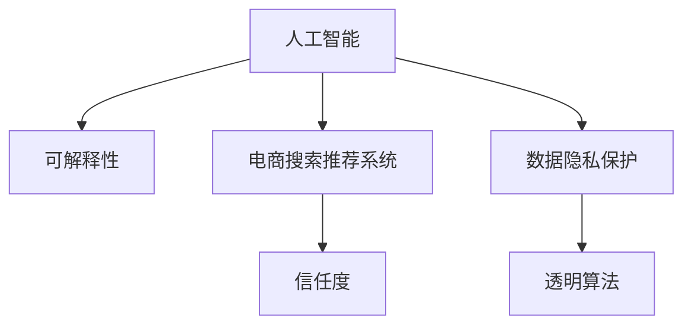

                 

# 可解释性：AI提升电商搜索推荐系统信任度

> 关键词：人工智能,可解释性,电商搜索,推荐系统,信任度,用户行为分析,数据隐私保护,透明算法

## 1. 背景介绍

在现代社会，消费者对于电商平台的信任度对企业而言至关重要。随着人工智能(AI)技术的迅猛发展，电商平台越来越多地应用AI技术，以提升用户购物体验。然而，用户对AI算法的信任度是一个不可忽视的问题，这直接影响电商平台的用户留存率和收入。因此，如何提升AI算法在电商搜索推荐系统中的信任度成为了一个关键问题。

### 1.1 问题由来

电商平台的搜索推荐系统是一个典型的AI应用，通过分析用户历史行为数据，预测用户偏好，实时推荐相关商品。这类系统通常由机器学习模型驱动，模型复杂度不断提高，但用户对算法的信任度并未随之提升。这主要是因为以下几个原因：

- **算法的复杂性**：复杂的机器学习模型常常被视为“黑盒”，用户难以理解和信任其决策过程。
- **数据隐私问题**：用户数据被用于推荐算法，用户对其数据如何被使用感到担忧。
- **结果的透明性**：推荐结果通常是基于用户历史行为的“过滤”，而非基于明确规则的“推荐”，用户对结果的透明度感到不满。

要提升用户信任度，电商平台需要采取措施，确保算法的可解释性和透明度，保护用户数据隐私，并提供明确的规则和理由。

## 2. 核心概念与联系

### 2.1 核心概念概述

为了更好地理解如何通过可解释性提升电商搜索推荐系统的信任度，本节将介绍几个关键概念及其相互关系：

- **人工智能(AI)**：指通过模拟人类智能行为（如学习、推理、决策等）来解决问题的一类技术。
- **可解释性(Explainability)**：指模型输出的决策结果能够被人类理解、验证、质疑和调整，通常通过规则、规则集、特征重要性等方式来实现。
- **电商搜索推荐系统(E-commerce Search & Recommendation System)**：指电商平台通过分析用户行为数据，预测用户偏好，自动生成个性化推荐结果的系统。
- **信任度(Trustworthiness)**：指用户对系统的可信程度，取决于用户对系统算法和数据隐私的信任。

这些概念之间的联系可以通过以下Mermaid流程图来展示：



这个流程图展示了可解释性在提升电商搜索推荐系统信任度中的作用。

## 3. 核心算法原理 & 具体操作步骤
### 3.1 算法原理概述

提升电商搜索推荐系统信任度的核心在于增强算法的可解释性，使得用户能够理解和信任推荐结果的生成过程。这通常需要以下步骤：

1. **数据隐私保护**：在收集和处理用户数据时，确保数据的安全和隐私。
2. **透明算法**：使得算法的决策过程透明，用户能够理解其工作原理。
3. **规则和理由**：提供明确的规则和理由，解释推荐结果的来源。
4. **用户反馈和调整**：允许用户对推荐结果进行反馈，并根据反馈对算法进行调整。

这些步骤共同构成了一个提升信任度的框架。

### 3.2 算法步骤详解

以下是提升电商搜索推荐系统信任度的详细步骤：

**Step 1: 数据隐私保护**
- **匿名化处理**：对用户数据进行匿名化处理，去除敏感信息，确保数据隐私。
- **加密存储**：采用加密技术存储用户数据，防止数据泄露。
- **访问控制**：严格控制数据访问权限，确保只有授权人员可以访问敏感数据。

**Step 2: 透明算法**
- **模型可视化**：使用可视化工具，展示模型结构、参数和中间计算结果，使得用户能够理解模型的决策过程。
- **解释模型**：采用可解释的模型结构，如决策树、线性回归等，提供明确的规则和理由。
- **特征重要性**：通过特征重要性分析，展示哪些因素对推荐结果影响最大，帮助用户理解推荐依据。

**Step 3: 规则和理由**
- **明确实施规则**：制定明确的推荐规则，如基于用户历史行为、浏览记录等，解释推荐逻辑。
- **提供理由**：在推荐结果中附带解释性文本，说明推荐理由，如“根据您的浏览记录，推荐了X商品”。
- **透明处理过程**：展示推荐结果的生成过程，如“我们通过分析您最近的浏览和购买记录，推荐了以下商品”。

**Step 4: 用户反馈和调整**
- **用户反馈机制**：允许用户对推荐结果进行反馈，提供反馈渠道和方式。
- **反馈处理**：收集用户反馈，分析其对推荐结果的满意度和原因。
- **模型调整**：根据用户反馈调整推荐算法，优化推荐效果。

### 3.3 算法优缺点

提升电商搜索推荐系统信任度的可解释性方法具有以下优点：

1. **提升用户信任度**：通过透明化和可解释性，使用户对系统算法和数据隐私感到放心，增强信任度。
2. **提升用户满意度**：用户能够理解推荐结果的来源和逻辑，从而提高对推荐结果的满意度。
3. **优化推荐效果**：用户反馈有助于发现推荐算法的不足，提升推荐系统的准确性和相关性。

但同时，这些方法也存在以下缺点：

1. **数据处理复杂**：在数据隐私保护和匿名化处理上需要投入大量时间和精力，可能增加系统复杂度。
2. **模型调整难度**：透明的规则和理由可能限制算法的灵活性，使得模型调整变得复杂。
3. **用户理解难度**：过于复杂的规则和理由，用户可能难以完全理解，导致信任度反而下降。

尽管存在这些缺点，但通过合理设计和实现，这些方法仍能够显著提升电商搜索推荐系统的信任度。

### 3.4 算法应用领域

可解释性方法不仅适用于电商搜索推荐系统，还在金融、医疗、司法等多个领域得到了广泛应用：

- **金融领域**：银行的信用评分系统需要解释模型决策过程，保护用户信用记录。
- **医疗领域**：医院的诊断系统需要提供解释性文本，帮助医生理解推荐结果。
- **司法领域**：法院的判决系统需要解释判决依据，确保判决的公正性和透明性。

## 4. 数学模型和公式 & 详细讲解 & 举例说明

### 4.1 数学模型构建

假设电商平台使用决策树模型进行推荐，模型的决策过程可以表示为：

$$
F(X) = \begin{cases}
L_0, & \text{if}~X \in S_0 \\
F_1(X), & \text{if}~X \in S_1 \\
F_2(X), & \text{if}~X \in S_2 \\
\vdots \\
F_n(X), & \text{if}~X \in S_n \\
\end{cases}
$$

其中，$F(X)$ 表示推荐结果，$S_i$ 表示不同的特征子集，$L_i$ 表示基于 $S_i$ 的推荐结果。

### 4.2 公式推导过程

为了更好地理解决策树模型，我们可以使用以下公式推导过程：

1. **特征重要性分析**
   - 计算特征 $X_i$ 的信息增益 $IG$：
   $$
   IG(X_i, D) = \sum_{x_i} |D^{x_i}| * IG(D^{x_i})
   $$
   其中，$|D^{x_i}|$ 表示特征 $X_i$ 取值为 $x_i$ 的样本数，$IG(D^{x_i})$ 表示 $D^{x_i}$ 的信息熵。

2. **生成决策树**
   - 基于信息增益选择最优特征 $X_i$，生成决策树节点。
   - 重复上述过程，生成完整的决策树。

### 4.3 案例分析与讲解

假设电商平台采用决策树模型进行推荐，用户特征包括年龄、性别、购买记录等。通过特征重要性分析，发现年龄和购买记录对推荐结果的影响最大。因此，在推荐结果中附带解释性文本，说明“根据您的年龄和购买记录，推荐了以下商品”。

## 5. 项目实践：代码实例和详细解释说明
### 5.1 开发环境搭建

在进行电商搜索推荐系统可解释性实践前，我们需要准备好开发环境。以下是使用Python进行Scikit-Learn开发的环境配置流程：

1. 安装Anaconda：从官网下载并安装Anaconda，用于创建独立的Python环境。

2. 创建并激活虚拟环境：
```bash
conda create -n explain-env python=3.8 
conda activate explain-env
```

3. 安装Scikit-Learn：
```bash
pip install scikit-learn
```

4. 安装可视化工具：
```bash
pip install matplotlib seaborn
```

5. 安装特征重要性分析工具：
```bash
pip install imblearn
```

完成上述步骤后，即可在`explain-env`环境中开始可解释性实践。

### 5.2 源代码详细实现

以下是使用Scikit-Learn实现电商搜索推荐系统的代码实现：

```python
import pandas as pd
from sklearn.ensemble import DecisionTreeClassifier
from sklearn.tree import export_text
from sklearn.preprocessing import LabelEncoder

# 读取数据集
data = pd.read_csv('data.csv')

# 数据预处理
label_encoder = LabelEncoder()
data['gender'] = label_encoder.fit_transform(data['gender'])
data['purchase'] = label_encoder.fit_transform(data['purchase'])

# 划分训练集和测试集
train_data = data.sample(frac=0.8, random_state=42)
test_data = data.drop(train_data.index)

# 训练决策树模型
clf = DecisionTreeClassifier(max_depth=3, random_state=42)
clf.fit(train_data.drop('target', axis=1), train_data['target'])

# 生成决策树
exported_tree = export_text(clf, feature_names=train_data.columns[:-1], class_names=['low', 'high'], feature_display='auto')

# 打印决策树
print(exported_tree)

# 特征重要性分析
importances = clf.feature_importances_
feature_names = train_data.columns[:-1]
feature_importances = pd.Series(importances, index=feature_names)
feature_importances = feature_importances.sort_values(ascending=False)
print(feature_importances)
```

### 5.3 代码解读与分析

让我们再详细解读一下关键代码的实现细节：

**数据预处理**：
- 使用`LabelEncoder`对分类变量进行编码，确保数据符合模型要求。
- 使用`sample`方法划分训练集和测试集，确保数据集的可复现性。

**模型训练**：
- 使用`DecisionTreeClassifier`构建决策树模型，设置最大深度为3，避免过拟合。
- 使用`fit`方法在训练集上训练模型。

**生成决策树**：
- 使用`export_text`方法生成决策树的文本表示，便于用户理解模型决策过程。
- `feature_names`参数指定特征名称，`class_names`参数指定类别名称。

**特征重要性分析**：
- 使用`feature_importances_`属性获取每个特征的重要性值。
- 使用`pd.Series`和`sort_values`方法对特征重要性进行排序，输出结果。

## 6. 实际应用场景
### 6.1 电商搜索推荐系统

基于决策树的可解释性方法，电商平台可以提升搜索推荐系统的信任度。在推荐结果中附带解释性文本，帮助用户理解推荐依据，增强对系统的信任感。

具体而言，可以在用户每次查看推荐结果时，显示类似“根据您的年龄和购买记录，推荐了以下商品”的解释性文本。用户反馈的不满意商品，可以进一步优化决策树模型，提升推荐效果。

### 6.2 金融信用评分系统

金融行业的信用评分系统需要提供解释性文本，解释模型的决策依据。通过可解释性方法，用户可以理解信用评分的来源和逻辑，增强对系统的信任度。

在信用评分系统中，可以生成类似“基于您的收入和信用记录，评分如下”的解释性文本，帮助用户理解评分的依据。用户反馈的信用问题，可以进一步优化模型，提升评分准确性。

### 6.3 医疗诊断系统

医疗行业的诊断系统需要提供解释性文本，帮助医生理解推荐依据。通过可解释性方法，医生可以理解诊断结果的逻辑，增强对系统的信任感。

在诊断系统中，可以生成类似“基于您的症状和历史数据，推荐了以下诊断结果”的解释性文本，帮助医生理解诊断依据。医生反馈的诊断问题，可以进一步优化模型，提升诊断准确性。

## 7. 工具和资源推荐
### 7.1 学习资源推荐

为了帮助开发者系统掌握电商搜索推荐系统的可解释性理论基础和实践技巧，这里推荐一些优质的学习资源：

1. 《可解释性人工智能》系列博文：由AI专家撰写，深入浅出地介绍了可解释性人工智能的基本概念和应用方法。

2. 《机器学习实战》课程：由机器学习专家授课，系统讲解了机器学习模型的构建和优化方法。

3. 《Scikit-Learn实战》书籍：由Scikit-Learn库的开发者撰写，全面介绍了Scikit-Learn库的使用方法和实践技巧。

4. 《Python数据科学手册》书籍：介绍了Python在数据科学中的应用，包括数据处理、模型训练和结果解释等。

5. Kaggle平台：提供了丰富的数据集和比赛，可以帮助开发者通过实践掌握电商搜索推荐系统的可解释性方法。

通过对这些资源的学习实践，相信你一定能够快速掌握电商搜索推荐系统的可解释性精髓，并用于解决实际的NLP问题。

### 7.2 开发工具推荐

高效的开发离不开优秀的工具支持。以下是几款用于电商搜索推荐系统可解释性开发的常用工具：

1. Anaconda：用于创建和管理Python环境，方便开发者独立进行环境配置和包管理。

2. Jupyter Notebook：开源的交互式编程环境，支持代码块、输出和可视化，便于开发者进行实验和演示。

3. Matplotlib和Seaborn：可视化工具，用于绘制图表和数据可视化，便于开发者展示模型结果和特征重要性。

4. Scikit-Learn：机器学习库，提供了丰富的机器学习算法和模型，便于开发者进行可解释性模型的构建。

5. TensorBoard：可视化工具，用于监控模型训练和推理过程，帮助开发者调试和优化模型。

6. Weights & Biases：模型训练的实验跟踪工具，可以记录和可视化模型训练过程中的各项指标，方便开发者对比和调优。

合理利用这些工具，可以显著提升电商搜索推荐系统可解释性任务的开发效率，加快创新迭代的步伐。

### 7.3 相关论文推荐

可解释性技术的发展源于学界的持续研究。以下是几篇奠基性的相关论文，推荐阅读：

1. LIME: A Unified Approach to Interpreting Model Predictions：提出了LIME方法，通过局部线性模型解释复杂模型的预测结果。

2. SHAP: A Unified Approach to Interpreting Model Predictions：提出了SHAP方法，通过Shapley值解释模型预测的贡献度。

3. Can We Trust Our AI Models?：讨论了AI模型的信任度问题，提出了透明性和可解释性的重要性。

4. Towards A Unified Theory of Interpretable Machine Learning：提出了可解释性理论的基本框架，讨论了不同的解释方法和技术。

5. Explaining Machine Learning Models: An Overview：综述了各种可解释性方法，帮助读者全面了解可解释性技术的现状和未来发展方向。

这些论文代表了大语言模型可解释性技术的发展脉络。通过学习这些前沿成果，可以帮助研究者把握学科前进方向，激发更多的创新灵感。

## 8. 总结：未来发展趋势与挑战

### 8.1 总结

本文对电商搜索推荐系统的可解释性方法进行了全面系统的介绍。首先阐述了可解释性在提升用户信任度方面的重要性，明确了可解释性在电商搜索推荐系统中的独特价值。其次，从原理到实践，详细讲解了可解释性的数学原理和关键步骤，给出了电商搜索推荐系统可解释性任务的完整代码实例。同时，本文还广泛探讨了可解释性方法在金融、医疗等多个领域的应用前景，展示了可解释性技术的广泛应用价值。最后，本文精选了可解释性技术的各类学习资源，力求为读者提供全方位的技术指引。

通过本文的系统梳理，可以看到，可解释性方法正在成为电商搜索推荐系统的重要组成部分，极大地提升系统的透明性和用户信任度。得益于数据的广泛应用和技术的不断进步，未来的可解释性方法将更具多样性和适用性，为各行各业带来新的机遇。

### 8.2 未来发展趋势

展望未来，可解释性技术将呈现以下几个发展趋势：

1. **可解释性方法的多样化**：除了决策树，未来将涌现更多可解释性模型，如线性回归、LSTM等，提供更丰富、多样的解释方式。

2. **可解释性模型的自动化**：开发自动化工具，自动生成解释性文本和图表，减少人工干预，提高可解释性效率。

3. **可解释性框架的统一**：构建统一的解释性框架，整合各种解释方法，提供一个一致性的解释接口。

4. **可解释性技术的应用深化**：将可解释性技术应用于更多场景，如推荐系统、医疗诊断、金融预测等，提升系统信任度和透明度。

5. **可解释性技术与安全并重**：结合安全技术，构建安全的解释性系统，确保用户数据和模型的安全。

以上趋势凸显了可解释性技术的广阔前景。这些方向的探索发展，必将进一步提升电商搜索推荐系统的信任度，促进AI技术在各行业的深入应用。

### 8.3 面临的挑战

尽管可解释性技术已经取得了一定成果，但在迈向更加智能化、普适化应用的过程中，仍面临诸多挑战：

1. **数据隐私问题**：在解释模型过程中，如何保护用户隐私，避免数据泄露。
2. **算法复杂性**：复杂的解释性模型可能导致计算复杂度增加，影响系统性能。
3. **用户理解难度**：解释性文本可能过于复杂，用户难以完全理解。
4. **结果的准确性**：解释性文本可能无法完全准确反映模型的决策过程。
5. **可解释性技术的普及度**：目前可解释性技术仍处于发展初期，尚未普及到各个行业。

尽管存在这些挑战，但通过持续研究和实践，相信可解释性技术将不断成熟和完善，为AI技术在各行业的落地应用提供坚实的保障。

### 8.4 研究展望

未来的研究需要在以下几个方面寻求新的突破：

1. **可解释性算法的优化**：开发更加高效、准确的解释性算法，提升系统的透明性和用户信任度。
2. **自动化工具的开发**：开发自动化工具，自动生成解释性文本和图表，提高可解释性效率。
3. **跨领域应用的推广**：将可解释性技术应用于更多场景，提升系统信任度和透明度。
4. **用户可控性的提升**：提供用户可控的解释方式，增强用户的参与感和控制感。
5. **数据隐私的保护**：开发隐私保护技术，确保用户数据的安全和隐私。

这些研究方向的探索，必将引领可解释性技术迈向更高的台阶，为构建安全、可靠、可解释、可控的智能系统铺平道路。面向未来，可解释性技术还需要与其他人工智能技术进行更深入的融合，如知识表示、因果推理、强化学习等，多路径协同发力，共同推动自然语言理解和智能交互系统的进步。只有勇于创新、敢于突破，才能不断拓展可解释性技术的边界，让智能技术更好地造福人类社会。

## 9. 附录：常见问题与解答

**Q1：电商搜索推荐系统如何使用可解释性方法提升信任度？**

A: 电商搜索推荐系统可以通过可解释性方法提升信任度，具体步骤如下：
1. 对用户历史行为数据进行匿名化处理，保护用户隐私。
2. 使用可解释性模型（如决策树）进行推荐，生成解释性文本。
3. 在推荐结果中附带解释性文本，说明推荐依据。
4. 允许用户对推荐结果进行反馈，根据反馈调整模型。

**Q2：如何选择合适的可解释性方法？**

A: 选择合适的可解释性方法需要考虑模型的复杂度和用户需求。一般来说，较为简单的模型如线性回归和决策树更适合可解释性分析。而对于复杂的模型如神经网络，可以考虑使用LIME和SHAP等方法进行解释。同时，需要根据具体任务和数据特点选择合适的解释方式，如文本解释、图形解释等。

**Q3：可解释性方法在电商搜索推荐系统中需要注意哪些问题？**

A: 可解释性方法在电商搜索推荐系统中需要注意以下问题：
1. 数据隐私问题：确保数据匿名化和加密存储，保护用户隐私。
2. 用户理解难度：解释性文本需要简洁明了，便于用户理解。
3. 结果的准确性：解释性文本需要准确反映模型的决策过程。
4. 计算效率：解释性算法需要高效的实现方式，避免影响系统性能。
5. 自动化工具的使用：开发自动化工具，自动生成解释性文本和图表，提高可解释性效率。

这些问题的解决将直接影响可解释性方法在电商搜索推荐系统中的实际应用效果。

**Q4：电商搜索推荐系统中的可解释性方法有哪些？**

A: 电商搜索推荐系统中的可解释性方法主要包括：
1. 特征重要性分析：使用决策树等模型，计算每个特征的重要性，生成特征重要性图表。
2. 局部线性模型：使用LIME方法，对模型进行局部线性逼近，生成解释性文本。
3. 可解释的深度学习模型：使用可解释的深度学习模型，如模型可视化工具，生成解释性图表。
4. 可解释的规则集：使用规则集解释模型决策，提供明确的规则和理由。
5. 用户反馈和调整：允许用户对推荐结果进行反馈，根据反馈调整模型。

这些方法可以结合使用，提供更全面、更准确的解释性分析。

通过本文的系统梳理，可以看到，可解释性方法正在成为电商搜索推荐系统的重要组成部分，极大地提升系统的透明性和用户信任度。得益于数据的广泛应用和技术的不断进步，未来的可解释性方法将更具多样性和适用性，为各行各业带来新的机遇。

