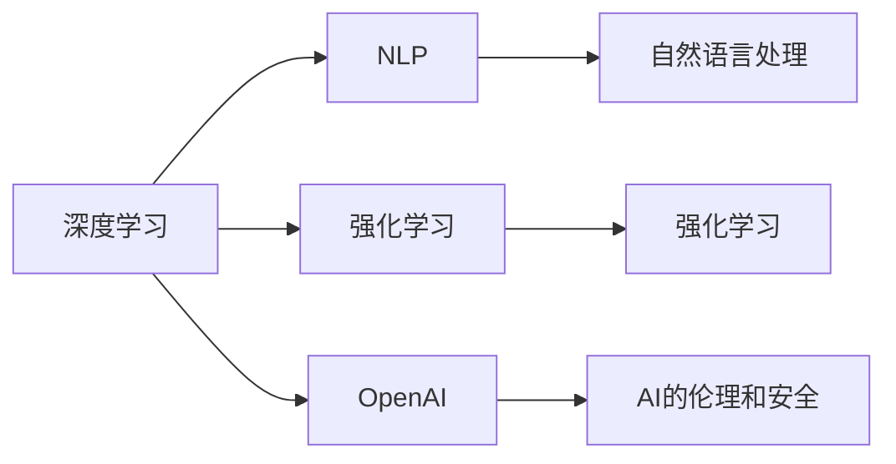

                 

## 1. 背景介绍

在当今竞争激烈的科技市场中，初创公司如何脱颖而出，吸引用户和投资者的目光？一种有效的策略是，通过激进的表达方式，传达公司愿景和技术的突破，从而快速站稳脚跟。本文章以OpenAI的创始人贾扬清（Yann LeCun）为例，探讨他如何通过激进但实际的表达，推动OpenAI成为全球领先的人工智能公司。

## 2. 核心概念与联系

### 2.1 核心概念概述

- **OpenAI**: 成立于2015年，致力于推进人工智能技术的发展，专注于创建安全、有益于人类的AI。
- **贾扬清（Yann LeCun）**: 深度学习先驱之一，现任OpenAI首席科学家，因其在深度学习领域的贡献获得了2018年图灵奖。
- **深度学习**: 一种机器学习技术，通过多层次的神经网络结构学习数据的复杂表示，用于图像识别、语音识别、自然语言处理等任务。
- **自然语言处理（NLP）**: 利用计算机处理和理解人类语言的技术，包括文本生成、翻译、情感分析等。
- **强化学习（Reinforcement Learning, RL）**: 通过试错和奖励机制，让智能体学习最优决策的机器学习方法。

这些核心概念之间通过OpenAI公司的创新技术和愿景相联系。贾扬清和他的团队通过深度学习、自然语言处理和强化学习技术，致力于开发能够理解、解释和生成人类语言的人工智能。

### 2.2 核心概念原理和架构的 Mermaid 流程图



该图展示了OpenAI的构建过程，其中深度学习是基础，NLP和强化学习是关键技术，而OpenAI则是在这些技术的基础上，创建了安全、负责任的人工智能。

## 3. 核心算法原理 & 具体操作步骤

### 3.1 算法原理概述

OpenAI的微调策略主要基于以下几个核心算法原理：

- **深度学习**: 通过多层次神经网络，捕捉数据的复杂特征。
- **NLP**: 使用Transformer等模型，处理和理解自然语言。
- **强化学习**: 通过模拟环境，训练智能体进行决策。

这些算法结合OpenAI的预训练模型和微调技术，形成了OpenAI独特的AI解决方案。

### 3.2 算法步骤详解

OpenAI的微调步骤如下：

1. **预训练模型选择**: 选择适合任务的预训练模型，如GPT-3、BERT等。
2. **任务适配层设计**: 设计适配当前任务的输出层和损失函数。
3. **微调数据准备**: 收集并标注数据集，用于微调。
4. **微调训练**: 使用预训练模型和适配层，在微调数据上训练模型。
5. **模型评估与部署**: 在测试集上评估微调后的模型，并将模型部署到实际应用中。

### 3.3 算法优缺点

**优点**:

- **快速迭代**: 预训练模型可以在大量无标注数据上进行预训练，微调则可以快速适应特定任务。
- **高性能**: 预训练模型通常具有强大的泛化能力，微调后性能提升显著。
- **灵活性**: 微调可以根据具体任务进行优化，适应多种应用场景。

**缺点**:

- **数据依赖**: 微调效果依赖于标注数据的质量和数量，数据不足可能导致过拟合。
- **资源消耗**: 大规模预训练和微调需要大量计算资源，可能带来成本压力。
- **可解释性差**: 深度学习模型通常被认为是"黑盒"，难以解释其内部工作机制。

### 3.4 算法应用领域

OpenAI的微调方法已广泛应用于以下几个领域：

- **NLP**: 包括文本分类、情感分析、对话系统等。
- **计算机视觉**: 如图像生成、目标检测等。
- **推荐系统**: 通过微调模型推荐个性化的产品或内容。
- **游戏AI**: 开发具有自主决策能力的智能游戏角色。

这些应用展示了OpenAI微调技术的多样性和强大能力。

## 4. 数学模型和公式 & 详细讲解 & 举例说明

### 4.1 数学模型构建

OpenAI的微调模型通常基于Transformer结构，使用自回归机制进行文本生成。以生成式预训练语言模型（GPT）为例，模型输入为自然语言文本，输出为目标文本序列。

数学上，生成式预训练语言模型的输出概率模型为：

$$
P(x_{1:T} | x_{<1}) = \prod_{t=1}^T P(x_t | x_{<t}, \theta)
$$

其中，$x_{<1}$ 为输入文本的前一时刻的词，$x_t$ 为当前时刻的输出词。

### 4.2 公式推导过程

GPT模型的目标函数为：

$$
\mathcal{L}(\theta) = -\frac{1}{N}\sum_{i=1}^N \sum_{t=1}^T \log P(x_{i,t} | x_{i<t}, \theta)
$$

其中，$N$ 为训练样本数，$T$ 为最大时间步数。

微调过程中，通过对目标函数求梯度，更新模型参数 $\theta$：

$$
\theta \leftarrow \theta - \eta \nabla_{\theta}\mathcal{L}(\theta)
$$

其中，$\eta$ 为学习率。

### 4.3 案例分析与讲解

以GPT-3为例，其微调过程可以概括为：

1. **数据准备**: 收集和标注任务相关的数据集。
2. **模型初始化**: 使用GPT-3作为初始模型。
3. **任务适配层设计**: 设计适配当前任务的输出层和损失函数。
4. **微调训练**: 在训练集上进行微调，优化模型。
5. **模型评估与部署**: 在测试集上评估微调后的模型，并将其部署到实际应用中。

## 5. 项目实践：代码实例和详细解释说明

### 5.1 开发环境搭建

安装Python 3.8，使用conda或pip安装必要的库，如TensorFlow、PyTorch等。

### 5.2 源代码详细实现

以下是一个简单的微调示例代码：

```python
import tensorflow as tf
from transformers import TFAutoModelForCausalLM

# 加载预训练模型
model = TFAutoModelForCausalLM.from_pretrained('gpt3')

# 设计任务适配层
model.add_output_layer(tf.keras.layers.Dense(10))

# 准备数据集
train_dataset = ...

# 定义损失函数
loss_fn = tf.keras.losses.SparseCategoricalCrossentropy(from_logits=True)

# 定义优化器
optimizer = tf.keras.optimizers.Adam(learning_rate=1e-5)

# 微调训练
for epoch in range(num_epochs):
    for batch in train_dataset:
        with tf.GradientTape() as tape:
            outputs = model(batch)
            loss = loss_fn(labels, outputs)
        grads = tape.gradient(loss, model.trainable_variables)
        optimizer.apply_gradients(zip(grads, model.trainable_variables))
```

### 5.3 代码解读与分析

代码中，我们首先加载预训练的GPT-3模型，并添加适配层的输出层。接着，准备训练数据集，并定义损失函数和优化器。最后，通过梯度下降等优化算法，微调模型。

## 6. 实际应用场景

### 6.4 未来应用展望

未来，OpenAI的微调技术将在更多领域得到应用，例如：

- **自动编程**: 通过微调生成代码，辅助开发者进行编程。
- **知识图谱**: 利用微调技术，构建更加全面和精确的知识图谱。
- **跨模态学习**: 结合图像、语音等多模态数据，进行综合分析。
- **道德与责任**: 开发具有伦理和安全保障的AI模型。

这些应用展示了OpenAI微调技术的多样性和未来前景。

## 7. 工具和资源推荐

### 7.1 学习资源推荐

- **Coursera**: 提供深度学习、强化学习等课程。
- **arXiv**: 获取最新的人工智能研究论文。
- **Google AI Blog**: 了解OpenAI最新的研究进展和实践经验。

### 7.2 开发工具推荐

- **TensorFlow**: 强大的深度学习框架，支持分布式训练。
- **PyTorch**: 灵活的深度学习框架，易于快速迭代。
- **GitHub**: 托管和共享代码的平台。

### 7.3 相关论文推荐

- **Attention is All You Need**: Transformer模型的原始论文。
- **The Unreasonable Effectiveness of Transfer Learning**: 深度学习中迁移学习的经典论文。
- **GPT-3: Language Models are Unsupervised Multitask Learners**: GPT-3的发布论文。

## 8. 总结：未来发展趋势与挑战

### 8.1 研究成果总结

OpenAI的微调技术在深度学习、自然语言处理和强化学习等领域取得了显著成果，推动了AI技术的发展。

### 8.2 未来发展趋势

未来，OpenAI的微调技术将向着更高效、更可解释、更负责任的方向发展。

### 8.3 面临的挑战

- **资源消耗**: 大规模模型的训练和微调需要大量计算资源。
- **可解释性**: 深度学习模型通常被认为是"黑盒"，难以解释其内部工作机制。
- **伦理与责任**: 确保AI模型的道德和安全，避免误导性和歧视性输出。

### 8.4 研究展望

未来研究将专注于以下几个方向：

- **少样本学习**: 在少量标注数据上，利用微调技术快速训练模型。
- **跨模态学习**: 结合多模态数据，进行更加全面的分析和推理。
- **可解释性**: 开发更具可解释性的AI模型，便于理解和使用。

这些研究方向将推动AI技术的进一步发展和应用。

## 9. 附录：常见问题与解答

**Q1: OpenAI的微调技术为何如此成功？**

A: OpenAI通过深度学习、自然语言处理和强化学习等核心算法，构建了强大的预训练模型，并在微调过程中设计了适配层的输出层和损失函数，快速适应特定任务。

**Q2: 微调过程中如何避免过拟合？**

A: 数据增强、正则化、参数高效微调等方法可以有效避免过拟合。

**Q3: 如何提升微调模型的可解释性？**

A: 引入可解释性技术，如模型可视化、重要性解释等。

**Q4: OpenAI未来的研究方向有哪些？**

A: 少样本学习、跨模态学习、可解释性研究等方向将推动OpenAI的进一步发展。

---

作者：禅与计算机程序设计艺术 / Zen and the Art of Computer Programming

