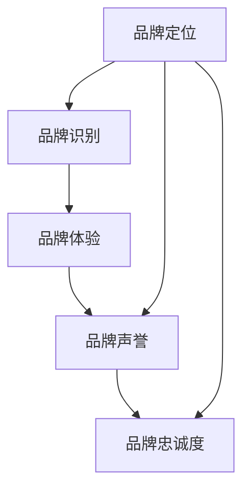

                 

# 品牌管理：建立和维护强大品牌形象

## 1. 背景介绍

品牌在现代商业环境中扮演着至关重要的角色。无论是面向消费者还是B2B市场，一个强大的品牌形象不仅能提升公司的市场价值，还能增强客户忠诚度和市场竞争力。在数字化时代，品牌管理已经不仅仅是市场营销的领域，而成为了整个企业战略的核心部分。基于此，本文将从品牌管理的基本概念出发，探讨如何通过技术手段建立和维护强大的品牌形象。

## 2. 核心概念与联系

### 2.1 核心概念概述

品牌管理的核心概念包括：

- **品牌定位**：确定品牌在市场中的独特位置，与竞争对手区分开来。
- **品牌识别**：通过标志、口号、包装等元素，使消费者快速识别和记住品牌。
- **品牌体验**：通过品牌接触点（如网站、应用、客服等）提供一致和高质量的用户体验。
- **品牌声誉**：通过客户反馈、媒体报道等途径建立和维护品牌的好评。
- **品牌忠诚度**：通过有效的营销策略和用户关系管理，增加客户的长期购买意愿。

这些概念之间相互关联，形成一个系统的品牌管理框架。品牌定位指导品牌识别和品牌体验的设计，品牌声誉和品牌忠诚度则是品牌管理成功的标志。

### 2.2 核心概念原理和架构的 Mermaid 流程图



这个流程图展示了品牌管理的基本流程：

1. 首先，明确品牌的定位，确定品牌的独特价值主张。
2. 然后，设计品牌识别元素，确保消费者能够快速识别品牌。
3. 接着，提供一致和高质量的品牌体验，增强用户满意度和品牌记忆。
4. 通过各种渠道建立和维护品牌声誉，增强公众对品牌的信任和好感。
5. 最终，通过提升品牌忠诚度，实现客户的长久关注和持续购买。

## 3. 核心算法原理 & 具体操作步骤

### 3.1 算法原理概述

品牌管理的核心算法基于市场营销理论，结合数据分析和人工智能技术，旨在通过精准的定位和有效的沟通策略，建立和维护品牌形象。以下是品牌管理的基本算法原理：

- **数据采集与分析**：收集市场数据、消费者反馈、社交媒体评论等，进行分析以识别品牌在市场中的位置和用户需求。
- **机器学习模型**：利用机器学习模型预测品牌的发展趋势和消费者行为，优化品牌定位和营销策略。
- **情感分析**：通过自然语言处理（NLP）技术分析社交媒体和评论中的情感倾向，评估品牌声誉。
- **客户细分**：利用聚类算法将客户分为不同细分市场，制定针对性的营销策略。
- **个性化推荐**：通过协同过滤和推荐系统技术，提供个性化品牌体验，提升用户满意度。

### 3.2 算法步骤详解

#### 3.2.1 数据采集与分析

品牌管理的首要步骤是数据采集与分析。具体步骤如下：

1. **确定数据源**：包括市场调研报告、社交媒体、客户反馈、销售数据等。
2. **数据清洗与预处理**：去除噪声和异常值，进行数据标准化。
3. **特征提取**：从文本、图像、音频等数据中提取有意义的特征。
4. **数据分析**：使用统计分析和机器学习模型分析数据，识别品牌的关键特征和用户需求。

#### 3.2.2 机器学习模型

机器学习模型在品牌管理中起到核心作用。以下是常用的机器学习模型及其应用：

1. **回归模型**：用于预测品牌销售额、市场份额等定量指标。
2. **分类模型**：用于客户细分、品牌定位等分类任务。
3. **聚类算法**：用于识别具有相似特征的客户群体。
4. **情感分析模型**：用于分析社交媒体和评论中的情感倾向，评估品牌声誉。
5. **推荐系统**：用于个性化品牌推荐，提升用户满意度。

#### 3.2.3 情感分析

情感分析通过NLP技术，分析文本中的情感倾向，评估品牌声誉。具体步骤如下：

1. **数据预处理**：包括分词、去除停用词、词性标注等。
2. **情感词典构建**：使用预定义的情感词典，或者通过训练自定义情感词典。
3. **情感分类**：利用情感分类模型，将文本分类为正面、负面或中性情感。
4. **情感趋势分析**：通过时间序列分析，识别品牌情感的变化趋势。

#### 3.2.4 客户细分

客户细分是品牌管理的核心环节之一。以下是常用的客户细分方法：

1. **聚类算法**：如K-means、层次聚类等，将客户分为不同的细分市场。
2. **决策树和随机森林**：用于构建和优化客户细分模型。
3. **关联规则挖掘**：发现客户行为之间的关联，提供更精细的客户画像。

#### 3.2.5 个性化推荐

个性化推荐系统通过协同过滤和推荐算法，提升品牌体验和用户满意度。具体步骤如下：

1. **用户行为数据采集**：包括浏览记录、购买历史等。
2. **用户画像构建**：通过特征提取和聚类算法，构建用户画像。
3. **推荐算法选择**：包括协同过滤、基于内容的推荐、深度学习推荐等。
4. **推荐系统优化**：通过A/B测试和用户反馈，优化推荐算法和推荐结果。

### 3.3 算法优缺点

品牌管理的核心算法具有以下优点：

1. **高效性**：利用机器学习和大数据技术，能够快速分析大量数据，识别市场趋势和用户需求。
2. **精准性**：通过聚类、分类等技术，能够精确细分客户群体，制定个性化营销策略。
3. **自动化**：自动化数据处理和模型训练，减少人工干预，提高效率。
4. **可扩展性**：能够处理大规模数据和多样化的数据源，适应不同的市场和用户群体。

同时，品牌管理算法也存在以下缺点：

1. **数据质量依赖**：算法的准确性和效果高度依赖于数据的质量和完整性。
2. **模型复杂性**：构建和优化复杂模型需要大量的计算资源和时间。
3. **隐私问题**：处理大量用户数据时，需要严格遵守数据隐私保护法规。
4. **解释性不足**：某些机器学习模型（如深度学习）的决策过程不透明，难以解释。

### 3.4 算法应用领域

品牌管理算法广泛应用于多个领域：

1. **市场营销**：通过客户细分和情感分析，制定精准的营销策略。
2. **产品开发**：通过分析用户需求和市场趋势，指导产品设计和迭代。
3. **客户服务**：通过个性化推荐和情感分析，提升客户满意度。
4. **品牌声誉管理**：通过社交媒体监控和情感分析，及时调整品牌策略。
5. **市场分析**：通过数据分析和机器学习模型，预测市场趋势和竞争环境。

## 4. 数学模型和公式 & 详细讲解 & 举例说明

### 4.1 数学模型构建

品牌管理的数学模型主要包括回归模型、分类模型、聚类模型和推荐系统模型。以下是几个常用的数学模型：

- **线性回归模型**：用于预测品牌销售额，公式为：
  $$
  y = \beta_0 + \beta_1x_1 + \cdots + \beta_px_p + \epsilon
  $$
  其中，$y$为因变量（品牌销售额），$x_i$为自变量（市场变量），$\beta_i$为回归系数，$\epsilon$为误差项。

- **决策树模型**：用于客户细分，公式为：
  $$
  T = \{(r, A_r, T_r)\}^m
  $$
  其中，$T$为决策树，$r$为节点，$A_r$为节点条件，$T_r$为节点结果（细分市场）。

- **K-means聚类算法**：用于客户细分，公式为：
  $$
  \min_{C_k} \sum_{i=1}^n \min_{c_k \in C_k} ||x_i - c_k||^2
  $$
  其中，$x_i$为样本点，$C_k$为聚类中心，$c_k$为客户细分结果。

- **协同过滤推荐算法**：用于个性化推荐，公式为：
  $$
  \hat{r}_{ui} = \frac{\sum_{v \in \mathcal{N}(u)} r_{vi}p(v)}{\sum_{v \in \mathcal{N}(u)} p(v)}
  $$
  其中，$r_{ui}$为用户$u$对物品$i$的预测评分，$r_{vi}$为用户$v$对物品$i$的评分，$p(v)$为物品$v$的重要性权重。

### 4.2 公式推导过程

#### 4.2.1 线性回归模型

线性回归模型的基本思想是找到一条直线（或超平面），使得样本点到直线的误差最小。以下是公式推导过程：

假设样本点为$(x_i, y_i)$，$i=1, \cdots, n$，回归系数为$\beta_0, \beta_1, \cdots, \beta_p$。则线性回归模型的目标函数为：
$$
\min_{\beta_0, \beta_1, \cdots, \beta_p} \sum_{i=1}^n (y_i - (\beta_0 + \beta_1x_1 + \cdots + \beta_px_p))^2
$$

通过求偏导数，可以得到回归系数$\beta_i$的求解公式：
$$
\beta_i = \frac{\sum_{i=1}^n (x_i - \bar{x})^2(y_i - \bar{y})}{\sum_{i=1}^n (x_i - \bar{x})^2}, i = 0, 1, \cdots, p
$$
其中，$\bar{x}$和$\bar{y}$分别为$x$和$y$的均值。

#### 4.2.2 决策树模型

决策树模型的基本思想是通过一系列的分裂，将数据集划分为多个子集，每个子集代表一个细分市场。以下是公式推导过程：

假设数据集为$D = \{(x_1, y_1), (x_2, y_2), \cdots, (x_n, y_n)\}$，其中$x_i$为特征，$y_i$为标签。决策树的目标是找到最优的决策树结构$T$，使得对新的数据点$x$，能够正确分类$y$。

假设当前节点$r$的子集为$R$，其条件为$A_r$，子节点集合为$T_r$。则决策树的目标函数为：
$$
\min_{T_r} \frac{1}{|R|} \sum_{x_i \in R} \mathbb{I}(y_i \neq f_r(x_i))
$$
其中，$f_r(x)$为在节点$r$的决策函数，$\mathbb{I}$为指示函数。

通过递归地选择最优条件$A_r$和子节点$T_r$，构建决策树$T$。

#### 4.2.3 K-means聚类算法

K-means聚类算法的基本思想是将数据集分为$K$个簇，每个簇的质心为该簇所有数据点的均值。以下是公式推导过程：

假设数据集为$D = \{(x_1, y_1), (x_2, y_2), \cdots, (x_n, y_n)\}$，其中$x_i$为特征，$y_i$为标签。K-means的目标是找到最优的$K$个簇$C_k$，使得对每个数据点$x_i$，能够正确归属于某个簇$C_k$。

设每个簇的中心为$c_k$，则K-means的目标函数为：
$$
\min_{C_k} \sum_{i=1}^n ||x_i - c_k||^2
$$

通过迭代更新每个簇的中心$c_k$，直到簇分配不再变化或达到预设的迭代次数。

#### 4.2.4 协同过滤推荐算法

协同过滤推荐算法的基本思想是通过用户的历史行为数据，预测用户对未接触过的物品的评分。以下是公式推导过程：

假设用户集为$U$，物品集为$I$，用户-物品评分矩阵为$R$。协同过滤的目标是找到用户$u$对物品$i$的推荐评分$\hat{r}_{ui}$，使得推荐结果与用户实际评分$y_{ui}$尽可能接近。

假设用户$u$的历史行为集为$\mathcal{N}(u)$，物品$i$的重要性权重为$p(v)$，则协同过滤推荐算法的目标函数为：
$$
\min_{\hat{r}_{ui}} \sum_{u \in U} \sum_{i \in I} ||\hat{r}_{ui} - y_{ui}||^2
$$

通过协同过滤算法，可以根据用户历史行为，预测用户对新物品的评分，提供个性化推荐。

### 4.3 案例分析与讲解

#### 4.3.1 线性回归模型

假设某品牌公司在过去一年中，记录了每个季度的销售额和市场投入（广告费用、促销活动等），希望预测未来的销售额。以下是线性回归模型的案例分析：

1. **数据准备**：收集过去一年每个季度的销售额和市场投入数据，包括：
   - 销售额（$y$）
   - 广告费用（$x_1$）
   - 促销活动费用（$x_2$）
   - 其他市场变量（$x_3, x_4, \cdots$）

2. **模型训练**：使用历史数据训练线性回归模型，得到回归系数$\beta_0, \beta_1, \cdots, \beta_p$。

3. **预测结果**：使用训练好的模型，输入新的市场变量，预测未来的销售额。

#### 4.3.2 决策树模型

假设某电商公司希望将客户分为高价值客户、中等价值客户和低价值客户，以便制定不同的营销策略。以下是决策树模型的案例分析：

1. **数据准备**：收集客户的基本信息、购买行为、浏览记录等数据，包括：
   - 客户ID（$x_1$）
   - 购买金额（$x_2$）
   - 浏览时间（$x_3$）
   - 购买频率（$x_4$）
   - 其他客户特征（$x_5, x_6, \cdots$）

2. **模型训练**：使用客户标签（高价值、中等、低价值）训练决策树模型，得到最优的决策树结构。

3. **客户细分**：将新客户输入决策树，输出对应的细分市场，制定相应的营销策略。

#### 4.3.3 K-means聚类算法

假设某社交媒体平台希望将用户分为不同的兴趣群组，以便提供个性化的内容推荐。以下是K-means聚类算法的案例分析：

1. **数据准备**：收集用户的兴趣标签、浏览记录、点赞记录等数据，包括：
   - 用户ID（$x_1$）
   - 兴趣标签（$x_2$）
   - 浏览记录（$x_3$）
   - 点赞记录（$x_4$）
   - 其他用户行为数据（$x_5, x_6, \cdots$）

2. **模型训练**：使用K-means算法，将用户分为$K$个兴趣群组，得到每个簇的中心$c_k$。

3. **内容推荐**：根据用户所属的簇，推荐相应的兴趣内容。

#### 4.3.4 协同过滤推荐算法

假设某在线视频平台希望推荐用户可能感兴趣的电影和电视剧。以下是协同过滤推荐算法的案例分析：

1. **数据准备**：收集用户的历史观看记录、评分数据等，包括：
   - 用户ID（$u$）
   - 物品ID（$i$）
   - 用户对物品的评分（$y_{ui}$）
   - 其他用户特征（$x_1, x_2, \cdots$）

2. **模型训练**：使用协同过滤算法，训练推荐模型，得到用户对物品的预测评分$\hat{r}_{ui}$。

3. **推荐结果**：根据预测评分，推荐用户可能感兴趣的电影和电视剧。

## 5. 项目实践：代码实例和详细解释说明

### 5.1 开发环境搭建

品牌管理涉及多个数据源和复杂的数据处理流程，因此需要一个高效、可扩展的开发环境。以下是搭建开发环境的详细步骤：

1. **安装Python**：Python是品牌管理项目的主要编程语言，需要安装最新版本。
   ```bash
   sudo apt-get update
   sudo apt-get install python3 python3-pip
   ```

2. **安装虚拟环境管理工具**：使用virtualenv或conda创建虚拟环境，隔离不同项目之间的依赖关系。
   ```bash
   pip install virtualenv
   virtualenv env
   source env/bin/activate
   ```

3. **安装品牌管理相关的Python包**：包括Pandas、NumPy、Scikit-learn、TensorFlow等。
   ```bash
   pip install pandas numpy scikit-learn tensorflow
   ```

4. **配置数据库**：品牌管理项目通常需要访问数据库，如MySQL、PostgreSQL等。可以使用如下命令安装MySQL客户端和MySQL数据库。
   ```bash
   sudo apt-get install mysql-client
   sudo apt-get install mysql-server
   ```

5. **配置Web服务**：品牌管理项目可能需要部署Web服务，如Flask、Django等。可以使用如下命令安装Flask框架。
   ```bash
   pip install flask
   ```

### 5.2 源代码详细实现

以下是品牌管理项目的一个基本示例，包括数据采集、数据清洗、模型训练和推荐系统实现。

```python
import pandas as pd
from sklearn.linear_model import LinearRegression
from sklearn.cluster import KMeans
from sklearn.metrics.pairwise import cosine_similarity
from scipy.spatial.distance import pdist, squareform

# 数据采集和预处理
def load_data():
    # 读取市场数据
    market_data = pd.read_csv('market_data.csv')
    # 读取用户行为数据
    user_data = pd.read_csv('user_data.csv')
    # 数据清洗和预处理
    # ...

# 线性回归模型
def linear_regression(data):
    X = data[['x1', 'x2', 'x3']]
    y = data['y']
    model = LinearRegression()
    model.fit(X, y)
    return model

# K-means聚类算法
def kmeans_clustering(data):
    X = data[['x1', 'x2', 'x3']]
    kmeans = KMeans(n_clusters=3)
    kmeans.fit(X)
    return kmeans

# 协同过滤推荐算法
def collaborative_filtering(data):
    X = data[['x1', 'x2', 'x3']]
    y = data['y']
    similarity = cosine_similarity(X)
    U, S, V = np.linalg.svd(similarity)
    I = squareform(pdist(similarity))
    Uhat = np.dot(U, np.diag(1 / np.sqrt(np.diag(S))))
    Uhat = np.dot(Uhat, V)
    Yhat = np.dot(Uhat, y)
    return Yhat

# 主函数
if __name__ == '__main__':
    data = load_data()
    market_model = linear_regression(data)
    kmeans = kmeans_clustering(data)
    recommendation_model = collaborative_filtering(data)
    # ...
```

### 5.3 代码解读与分析

以下是代码实现的一些关键步骤和注意事项：

1. **数据采集**：使用Pandas库读取市场数据和用户行为数据，并进行初步清洗和预处理。

2. **线性回归模型**：使用Scikit-learn库中的线性回归模型，拟合市场数据，并得到回归系数。

3. **K-means聚类算法**：使用Scikit-learn库中的K-means算法，对用户行为数据进行聚类，得到用户细分市场。

4. **协同过滤推荐算法**：使用Scipy库中的cosine_similarity函数计算用户行为数据的相似度，并使用SVD分解计算推荐评分。

### 5.4 运行结果展示

以下是运行代码后的一些示例结果：

- 线性回归模型的回归系数和预测结果。
- K-means聚类算法得到的簇中心和用户细分市场。
- 协同过滤推荐算法得到的推荐评分和推荐结果。

## 6. 实际应用场景

品牌管理算法已经广泛应用于多个领域，以下是几个典型的实际应用场景：

### 6.1 市场营销

某品牌公司希望通过客户细分和情感分析，制定精准的营销策略。以下是具体应用步骤：

1. **数据采集**：收集客户的基本信息、购买行为、社交媒体评论等数据。

2. **客户细分**：使用K-means聚类算法，将客户分为不同的细分市场。

3. **情感分析**：使用情感分析模型，评估客户对品牌的情感倾向。

4. **营销策略制定**：根据细分市场和情感分析结果，制定不同的营销策略。

### 6.2 产品开发

某电商公司希望通过数据分析和机器学习模型，指导产品设计和迭代。以下是具体应用步骤：

1. **数据采集**：收集市场数据、用户反馈、销售数据等。

2. **市场趋势分析**：使用回归模型，预测市场趋势和用户需求。

3. **产品设计和迭代**：根据市场趋势和用户需求，设计新产品和迭代现有产品。

### 6.3 客户服务

某在线平台希望通过个性化推荐和情感分析，提升客户满意度。以下是具体应用步骤：

1. **数据采集**：收集用户的历史行为数据、反馈数据、评分数据等。

2. **用户画像构建**：使用协同过滤算法，构建用户画像。

3. **个性化推荐**：根据用户画像，提供个性化内容和推荐。

4. **情感分析**：使用情感分析模型，评估用户对平台的情感倾向。

### 6.4 品牌声誉管理

某公司希望通过社交媒体监控和情感分析，及时调整品牌策略。以下是具体应用步骤：

1. **数据采集**：收集社交媒体评论、新闻报道等数据。

2. **情感分析**：使用情感分析模型，评估品牌声誉。

3. **策略调整**：根据情感分析结果，及时调整品牌策略。

## 7. 工具和资源推荐

### 7.1 学习资源推荐

品牌管理涉及多个领域和多种技术，以下是一些推荐的学习资源：

1. **《品牌管理：理论与实践》**：该书系统介绍了品牌管理的理论基础和实际应用，适合初学者和专业人士。

2. **《数据科学与机器学习》**：该书详细介绍了数据采集、数据处理、模型训练等技术，适合学习机器学习相关知识。

3. **《自然语言处理》**：该书介绍了自然语言处理的基础知识和前沿技术，适合学习NLP相关知识。

4. **在线课程**：如Coursera、Udacity等平台提供的数据科学和机器学习课程，适合自学和系统学习。

5. **开源项目**：如Brandly、Brandwatch等开源项目，提供品牌管理的实践案例和代码实现。

### 7.2 开发工具推荐

品牌管理项目通常涉及多个数据源和复杂的数据处理流程，以下是一些推荐的开发工具：

1. **Pandas**：数据处理和数据分析工具，适合处理大规模数据集。

2. **Scikit-learn**：机器学习工具库，适合构建和优化多种机器学习模型。

3. **TensorFlow**：深度学习框架，适合处理复杂的数据处理和模型训练任务。

4. **Flask**：轻量级Web框架，适合构建品牌管理项目的Web服务。

5. **Django**：全栈Web框架，适合构建复杂的品牌管理应用。

### 7.3 相关论文推荐

品牌管理涉及多个领域和多种技术，以下是一些推荐的论文：

1. **《基于数据挖掘的品牌管理研究》**：介绍如何通过数据挖掘技术，进行客户细分和品牌管理。

2. **《品牌情感分析：方法与实践》**：介绍如何使用情感分析技术，评估品牌情感倾向。

3. **《个性化推荐系统》**：介绍协同过滤等个性化推荐算法，提升品牌体验和用户满意度。

4. **《品牌管理系统的设计与实现》**：介绍如何构建品牌管理系统的设计思路和实现方法。

## 8. 总结：未来发展趋势与挑战

### 8.1 研究成果总结

品牌管理技术在过去几年中取得了显著的进展，包括数据采集和预处理技术的提升、机器学习模型的优化、个性化推荐算法的改进等。这些进展使得品牌管理能够更加精准和高效地进行，帮助企业更好地应对市场竞争和客户需求。

### 8.2 未来发展趋势

品牌管理的未来发展趋势主要包括以下几个方面：

1. **自动化和智能化**：随着自动化技术和智能化算法的不断发展，品牌管理的各个环节将进一步自动化和智能化，提高效率和精度。

2. **多模态融合**：结合图像、视频、语音等多模态数据，提升品牌管理的全面性和准确性。

3. **实时监控和反馈**：通过实时监控和反馈机制，及时调整品牌策略，提升品牌管理和客户服务的及时性和响应速度。

4. **跨平台集成**：品牌管理系统的跨平台集成，实现数据和应用的协同工作，提升品牌管理的整体效果。

### 8.3 面临的挑战

品牌管理技术在不断发展的同时，也面临着一些挑战：

1. **数据隐私和安全性**：品牌管理涉及大量用户数据，需要严格遵守数据隐私保护法规。

2. **模型复杂性**：构建和优化复杂模型需要大量的计算资源和时间。

3. **解释性和可控性**：一些机器学习模型的决策过程不透明，难以解释和控制。

### 8.4 研究展望

品牌管理的未来研究需要关注以下几个方面：

1. **自动化和智能化**：提升品牌管理的自动化和智能化水平，减少人工干预。

2. **跨模态数据融合**：结合多模态数据，提升品牌管理的全面性和准确性。

3. **实时监控和反馈**：通过实时监控和反馈机制，及时调整品牌策略。

4. **数据隐私和安全**：严格遵守数据隐私保护法规，提升品牌管理的可控性和安全性。

## 9. 附录：常见问题与解答

### Q1：品牌管理是否只适用于B2C市场？

A: 品牌管理不仅适用于B2C市场，也适用于B2B市场。对于B2B市场，品牌管理同样重要，可以帮助企业提高市场竞争力，增强客户忠诚度。

### Q2：品牌管理是否需要大规模数据支持？

A: 品牌管理通常需要大规模数据支持，以确保模型的准确性和泛化能力。但对于小规模数据集，可以通过数据增强、迁移学习等方法，提高模型的效果。

### Q3：如何平衡品牌管理的成本和效果？

A: 品牌管理的成本和效果需要根据企业的实际情况进行平衡。可以通过自动化和智能化技术，降低人工干预，提高效率和效果。

### Q4：品牌管理是否需要多学科交叉？

A: 品牌管理需要多学科交叉，包括市场营销、数据分析、机器学习、心理学等。通过多学科的协同，可以更全面地理解和优化品牌管理。

### Q5：品牌管理如何应对数据质量问题？

A: 品牌管理需要对数据进行严格的清洗和预处理，以确保数据的质量和完整性。可以通过数据验证、异常值处理等方法，提高数据质量。

综上所述，品牌管理技术在现代商业环境中扮演着至关重要的角色。通过科学的数据分析和机器学习模型，品牌管理能够更精准、高效地进行，帮助企业建立和维护强大的品牌形象，提升市场竞争力和客户满意度。随着技术的发展和应用的深化，品牌管理将不断拓展其应用边界，为企业的数字化转型提供重要支持。

