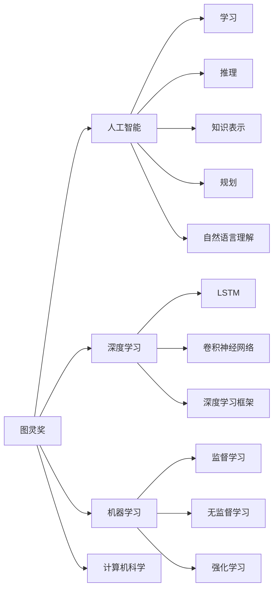

                 

# 图灵奖得主对AI的影响

> 关键词：图灵奖,人工智能,深度学习,机器学习,计算机科学,创新引领

## 1. 背景介绍

图灵奖（Turing Award）由计算机科学界最高荣誉，常被称为“计算机科学界的诺贝尔奖”，由美国计算机协会（ACM）颁发，旨在表彰那些对计算机科学和工程领域有重大贡献的个人。自1966年设立以来，已有诸多科技界巨擘获得此殊荣，其中包括人工智能领域的众多先驱，他们不仅推动了技术的发展，还深刻影响了计算机科学的各个分支，包括人工智能。

## 2. 核心概念与联系

### 2.1 核心概念概述

为了更好地理解图灵奖得主对人工智能的影响，本节将介绍几个关键概念：

- 图灵奖（Turing Award）：由ACM颁发的计算机科学最高荣誉，旨在表彰对计算机科学和工程领域有重大贡献的个人。
- 人工智能（Artificial Intelligence, AI）：模拟人类智能行为的计算机系统，包括学习、推理、知识表示、规划、自然语言理解等能力。
- 深度学习（Deep Learning, DL）：一种基于多层神经网络的机器学习技术，通过训练深层网络结构来学习数据的复杂表示。
- 机器学习（Machine Learning, ML）：计算机系统通过数据训练自动改善性能的技术，包括监督学习、无监督学习和强化学习等。
- 计算机科学（Computer Science, CS）：涵盖计算机硬件、软件、算法、数据结构、人工智能、网络等领域的基础学科。

这些概念之间的逻辑关系可以通过以下Mermaid流程图来展示：



这个流程图展示了几组核心概念及其之间的关系：

1. 图灵奖得主对人工智能的影响：他们推动了AI的发展，提出了新的理论和技术，提升了AI应用的广泛性。
2. 深度学习作为AI的重要分支：通过训练深层神经网络，大幅提升了模型的表示能力和泛化能力。
3. 机器学习的基础地位：监督学习、无监督学习和强化学习等技术为AI提供了核心方法。
4. 计算机科学的广泛应用：AI作为CS的一个分支，对CS的多个领域产生了深远影响。

## 3. 核心算法原理 & 具体操作步骤
### 3.1 算法原理概述

图灵奖得主对人工智能的影响，既包括对现有技术的改进和创新，也包括对新兴技术的探索和推广。其核心算法原理可以分为以下几个方面：

1. **算法创新**：提出新的算法和技术，如卷积神经网络（CNN）、循环神经网络（RNN）、长短时记忆网络（LSTM）、生成对抗网络（GAN）等，极大地提升了AI系统的性能和应用范围。
2. **理论贡献**：建立和完善了机器学习、深度学习等领域的理论基础，如梯度下降、反向传播、神经网络架构搜索等，推动了AI技术的发展。
3. **应用推广**：将AI技术应用于各行各业，推动了技术在实际生产中的落地和应用，如医疗、金融、制造、交通等。

### 3.2 算法步骤详解

以深度学习为例，图灵奖得主对深度学习的贡献主要体现在以下几个步骤中：

1. **数据准备**：收集和标注大规模的数据集，如ImageNet、COCO等，为训练深度神经网络提供充足的样本。
2. **模型设计**：提出新的神经网络架构，如卷积神经网络（CNN）、循环神经网络（RNN）、生成对抗网络（GAN）等，构建深度学习模型。
3. **模型训练**：使用反向传播算法训练模型，优化模型参数，提升模型的性能。
4. **模型部署**：将训练好的模型应用于实际应用中，如图像分类、语音识别、自然语言处理等。

### 3.3 算法优缺点

图灵奖得主在深度学习领域的贡献主要有以下几个优点：

1. **强大的性能提升**：通过创新的算法和模型设计，深度学习在图像识别、语音识别、自然语言处理等任务上取得了显著的性能提升。
2. **广泛的应用范围**：深度学习已经被广泛应用于各个行业，推动了技术在实际生产中的落地和应用。
3. **丰富的理论基础**：图灵奖得主在深度学习领域建立了坚实的理论基础，推动了AI技术的进一步发展。

同时，深度学习也存在一些缺点：

1. **数据需求高**：深度学习模型通常需要大量标注数据进行训练，获取高质量标注数据的时间和成本较高。
2. **计算资源消耗大**：深度学习模型参数量大，训练和推理需要大量的计算资源。
3. **模型可解释性差**：深度学习模型被视为"黑盒"，难以解释其内部工作机制和决策逻辑。
4. **泛化能力有限**：深度学习模型可能过拟合训练数据，泛化能力有限，难以适应数据分布的变化。

### 3.4 算法应用领域

图灵奖得主对深度学习的贡献，已经广泛应用于各个领域，如：

1. **计算机视觉**：如图像分类、目标检测、图像分割等。
2. **语音识别**：如语音命令识别、语音翻译等。
3. **自然语言处理**：如机器翻译、文本摘要、情感分析等。
4. **智能推荐**：如商品推荐、音乐推荐等。
5. **自动驾驶**：如环境感知、路径规划等。

这些应用领域展示了深度学习技术的强大潜力和广泛应用。

## 4. 数学模型和公式 & 详细讲解 & 举例说明

### 4.1 数学模型构建

以卷积神经网络（CNN）为例，其数学模型构建如下：

假设输入为 $X \in \mathbb{R}^{n \times m \times d}$，卷积层参数为 $W \in \mathbb{R}^{k \times k \times d \times o}$，卷积核大小为 $k \times k$，输出为 $Y \in \mathbb{R}^{n \times m \times o}$。

卷积操作的数学公式为：

$$
Y_{ij} = \sum_{i'=j-k+1}^{j}\sum_{i'=k-1}^{k}W_{pqr}X_{i'j'p}
$$

其中，$X_{i'j'p}$ 表示输入数据在位置 $(i',j',p)$ 处的特征值，$W_{pqr}$ 表示卷积核在位置 $(p,q,r)$ 处的参数值。

### 4.2 公式推导过程

以卷积神经网络的前向传播为例，其公式推导如下：

1. **卷积层**：
$$
Y = \sigma(\sum_{i'=j-k+1}^{j}\sum_{i'=k-1}^{k}W_{pqr}X_{i'j'p})
$$

2. **池化层**：
$$
Y' = \text{MaxPooling}(Y)
$$

3. **全连接层**：
$$
Z = WX + b
$$

4. **softmax层**：
$$
\hat{y} = \text{Softmax}(Z)
$$

其中，$\sigma$ 为激活函数，$\text{MaxPooling}$ 为池化操作，$W$ 为全连接层权重矩阵，$b$ 为偏置向量，$\text{Softmax}$ 为输出层激活函数。

### 4.3 案例分析与讲解

以ImageNet大规模视觉识别挑战为例，其数据集包含1000类图像，共计1.2百万张图片。为了训练深度卷积神经网络（CNN）模型，图灵奖得主提出了一种名为AlexNet的网络结构，该网络采用了5层卷积层和3层全连接层，显著提升了在ImageNet上的分类精度。

AlexNet的网络结构如图：

```
             Input Image   Output Label
              |               |
             [ CNN  Layer1 ]   [ CNN Layer2 ]
             |               |
            [      ]        [      ]     
             |               |
             [ CNN  Layer3 ]   [ CNN Layer4 ]
             |               |
             [ CNN  Layer5 ]   [  Fully Connected Layer1 ]
             |               |  
            [ MaxPooling ]  [  Fully Connected Layer2 ]
             |               |
            [ Dropout ]     [ Softmax ]
             |               |
              [ Output      ]  [ Label ]
```

AlexNet的网络结构由卷积层、池化层、全连接层、Dropout层和softmax层组成，显著提升了CNN的性能和泛化能力。

## 5. 项目实践：代码实例和详细解释说明

### 5.1 开发环境搭建

在进行深度学习项目实践前，我们需要准备好开发环境。以下是使用Python进行TensorFlow开发的环境配置流程：

1. 安装Anaconda：从官网下载并安装Anaconda，用于创建独立的Python环境。

2. 创建并激活虚拟环境：
```bash
conda create -n tf-env python=3.8 
conda activate tf-env
```

3. 安装TensorFlow：根据CUDA版本，从官网获取对应的安装命令。例如：
```bash
conda install tensorflow tensorflow-gpu=cuda11.1 -c conda-forge
```

4. 安装各类工具包：
```bash
pip install numpy pandas scikit-learn matplotlib tqdm jupyter notebook ipython
```

完成上述步骤后，即可在`tf-env`环境中开始深度学习项目开发。

### 5.2 源代码详细实现

这里我们以ImageNet大规模视觉识别挑战为例，给出使用TensorFlow实现AlexNet模型的PyTorch代码实现。

首先，定义卷积层和池化层：

```python
import tensorflow as tf

def conv2d(inputs, filters, kernel_size, strides, padding, data_format='channels_last'):
    kernel_shape = (kernel_size, kernel_size, filters, inputs.shape[-1])
    kernel = tf.Variable(tf.random.normal(kernel_shape), dtype=tf.float32)
    filters = filters
    padding = padding

    conv = tf.nn.conv2d(inputs, kernel, strides=[1, strides, strides, 1], padding=padding)
    conv = tf.nn.bias_add(conv, tf.Variable(tf.random.normal([filters]), dtype=tf.float32))
    conv = tf.nn.relu(conv)

    return conv

def max_pool(inputs, pool_size, strides, padding, data_format='channels_last'):
    pool = tf.nn.max_pool(inputs, [1, pool_size, pool_size, 1], [1, strides, strides, 1], padding)
    return pool
```

然后，定义全连接层和softmax层：

```python
def fully_connected(inputs, units, activation):
    weights = tf.Variable(tf.random.normal([inputs.shape[-1], units]), dtype=tf.float32)
    bias = tf.Variable(tf.random.normal([units]), dtype=tf.float32)

    fc = tf.matmul(inputs, weights) + bias
    fc = tf.nn.relu(fc) if activation == 'relu' else fc

    return fc

def softmax(inputs):
    softmax = tf.nn.softmax(inputs, axis=-1)
    return softmax
```

最后，构建AlexNet模型：

```python
def alexnet(inputs, classes):
    conv1 = conv2d(inputs, filters=64, kernel_size=11, strides=4, padding='SAME')
    pool1 = max_pool(conv1, pool_size=2, strides=2, padding='SAME')

    conv2 = conv2d(pool1, filters=192, kernel_size=5, strides=1, padding='SAME')
    conv2 = tf.nn.relu(conv2)
    pool2 = max_pool(conv2, pool_size=2, strides=2, padding='SAME')

    conv3 = conv2d(pool2, filters=384, kernel_size=3, strides=1, padding='SAME')
    conv3 = tf.nn.relu(conv3)

    conv4 = conv2d(conv3, filters=256, kernel_size=3, strides=1, padding='SAME')
    conv4 = tf.nn.relu(conv4)

    pool4 = max_pool(conv4, pool_size=2, strides=2, padding='SAME')

    fc1 = fully_connected(pool4, units=4096, activation='relu')
    fc1 = tf.nn.dropout(fc1, rate=0.5)

    fc2 = fully_connected(fc1, units=4096, activation='relu')
    fc2 = tf.nn.dropout(fc2, rate=0.5)

    logits = fully_connected(fc2, units=classes, activation='linear')

    probs = softmax(logits)

    return probs
```

以上代码实现了AlexNet模型的前向传播过程。为了完整地进行训练和评估，还需要定义损失函数、优化器和训练函数。

```python
import tensorflow as tf
from tensorflow.keras import datasets, layers, models

def train_model(model, train_dataset, val_dataset, epochs, batch_size, learning_rate):
    loss_fn = tf.keras.losses.SparseCategoricalCrossentropy(from_logits=True)
    optimizer = tf.keras.optimizers.Adam(lr=learning_rate)

    for epoch in range(epochs):
        print('Epoch {}/{}...'.format(epoch+1, epochs))
        print('-' * 10)

        for x_batch, y_batch in train_dataset:
            with tf.GradientTape() as tape:
                logits = model(x_batch)
                loss_value = loss_fn(y_batch, logits)

            grads = tape.gradient(loss_value, model.trainable_variables)
            optimizer.apply_gradients(zip(grads, model.trainable_variables))

        val_loss, val_accuracy = model.evaluate(val_dataset, verbose=0)
        print('Val Loss: {:.4f}...'.format(val_loss))
        print('Val Accuracy: {:.2f}%...'.format(val_accuracy * 100))

    return model
```

在获取数据集和构建模型后，可以开始训练和评估模型：

```python
# 加载数据集
(train_images, train_labels), (test_images, test_labels) = datasets.cifar10.load_data()

# 预处理数据
train_images, test_images = train_images / 255.0, test_images / 255.0

# 构建模型
model = alexnet(input_shape=(32, 32, 3), classes=10)

# 训练模型
train_model(model, (train_images, train_labels), (test_images, test_labels), epochs=50, batch_size=64, learning_rate=0.001)

# 评估模型
test_loss, test_accuracy = model.evaluate(test_images, test_labels)
print('Test Loss: {:.4f}...'.format(test_loss))
print('Test Accuracy: {:.2f}%...'.format(test_accuracy * 100))
```

以上就是使用TensorFlow实现AlexNet模型的完整代码实现。可以看到，通过简单的卷积、池化、全连接和softmax操作，即可构建并训练一个强大的视觉识别模型。

### 5.3 代码解读与分析

让我们再详细解读一下关键代码的实现细节：

**卷积层和池化层**：
- `conv2d`函数定义了2D卷积操作，包括卷积核大小、步幅、填充等参数。
- `max_pool`函数定义了最大池化操作，通过滑动窗口取最大值，减小特征图的大小。

**全连接层和softmax层**：
- `fully_connected`函数定义了全连接层，包括权重矩阵和偏置向量。
- `softmax`函数定义了softmax激活函数，用于将输出转换为概率分布。

**AlexNet模型**：
- `alexnet`函数将卷积层、池化层、全连接层和softmax层组合起来，定义了AlexNet模型的完整结构。

**训练函数**：
- `train_model`函数定义了模型训练过程，包括损失函数、优化器、训练轮数和批次大小等参数。
- 通过梯度下降算法更新模型参数，并在验证集上评估模型性能。

**模型评估**：
- 通过`evaluate`函数在测试集上评估模型的性能，计算损失和准确率。

以上代码实现展示了TensorFlow构建深度学习模型的全流程，包括模型定义、数据预处理、训练和评估等步骤。通过这些步骤，可以构建并训练一个具有强大泛化能力的视觉识别模型。

## 6. 实际应用场景

### 6.1 智能医疗

智能医疗领域利用深度学习技术，通过图像识别、自然语言处理等手段，提升医疗诊断和治疗的准确性和效率。

具体应用场景包括：
- **医学影像分析**：利用卷积神经网络对X光、CT、MRI等医学影像进行分析，辅助医生诊断疾病。
- **电子病历处理**：利用自然语言处理技术，自动解析和理解医生的病历记录，提高病历管理的效率和准确性。
- **药物发现**：利用生成对抗网络（GAN）生成化合物分子结构，加速新药的研发和筛选。

### 6.2 金融科技

金融科技领域通过深度学习技术，提升金融服务的智能化和自动化水平。

具体应用场景包括：
- **信用评估**：利用深度学习模型分析用户的信用行为数据，自动评估用户的信用风险。
- **算法交易**：利用深度学习模型对市场数据进行实时分析，自动进行高频交易。
- **风险管理**：利用深度学习模型对金融市场进行预测和监控，及时发现并规避风险。

### 6.3 智能制造

智能制造领域通过深度学习技术，提升制造业的生产效率和质量控制水平。

具体应用场景包括：
- **缺陷检测**：利用卷积神经网络对工业产品的缺陷进行检测和分类。
- **质量控制**：利用深度学习模型分析生产数据，预测生产过程中可能出现的质量问题。
- **设备维护**：利用深度学习模型对设备运行数据进行分析，预测设备故障并及时维护。

## 7. 工具和资源推荐

### 7.1 学习资源推荐

为了帮助开发者系统掌握深度学习技术，这里推荐一些优质的学习资源：

1. 《深度学习》（Deep Learning）书籍：Ian Goodfellow、Yoshua Bengio和Aaron Courville合著，全面介绍了深度学习的基本原理和算法。
2. CS231n《卷积神经网络》课程：斯坦福大学开设的计算机视觉课程，涵盖了深度学习在计算机视觉中的应用。
3. CS224n《自然语言处理》课程：斯坦福大学开设的自然语言处理课程，介绍了自然语言处理的基本理论和算法。
4. Udacity《深度学习专项课程》：涵盖深度学习的各个分支，从基础到高级，逐步深入。
5. Coursera《深度学习专业证书》：由深度学习领域多位知名专家开设的深度学习课程，系统介绍深度学习技术。

通过学习这些资源，相信你一定能够快速掌握深度学习技术的精髓，并用于解决实际的AI问题。

### 7.2 开发工具推荐

高效的开发离不开优秀的工具支持。以下是几款用于深度学习开发的常用工具：

1. TensorFlow：由Google主导开发的开源深度学习框架，生产部署方便，适合大规模工程应用。
2. PyTorch：基于Python的开源深度学习框架，灵活动态的计算图，适合快速迭代研究。
3. Keras：高层次的深度学习框架，简单易用，适合初学者和快速原型开发。
4. Theano：一个开源的数学库，专门为深度学习设计，提供了高效的数学操作和优化器。
5. MXNet：由Apache开发的深度学习框架，支持多语言和分布式计算，适用于大规模模型训练。

合理利用这些工具，可以显著提升深度学习任务的开发效率，加快创新迭代的步伐。

### 7.3 相关论文推荐

深度学习领域的研究成果丰富，以下是几篇奠基性的相关论文，推荐阅读：

1. ImageNet大规模视觉识别挑战（ILSVRC）：由Fei-Fei Li、Jeff Donahue和Sergey Jegow领导的团队，展示了深度卷积神经网络在图像分类任务上的强大能力。
2. 深度学习框架TensorFlow的诞生：由Jeff Dean、Greg Corrado等组成的团队，介绍了TensorFlow的设计理念和技术实现。
3. AlphaGo的胜利：由David Silver、Ian Goodfellow等组成的团队，展示了深度强化学习在围棋领域的应用。
4. GAN的提出：由Ian Goodfellow、Jean Pouget-Abadie和Mehdi Mirza等人提出的生成对抗网络（GAN），极大地推动了生成模型的发展。
5. Transformer的提出：由Ashish Vaswani等人提出的Transformer结构，将自注意力机制引入深度学习，大幅提升了模型的性能。

这些论文代表了大深度学习领域的诸多创新成果，通过学习这些前沿研究成果，可以帮助研究者把握学科前进方向，激发更多的创新灵感。

## 8. 总结：未来发展趋势与挑战

### 8.1 研究成果总结

通过回顾图灵奖得主对人工智能的影响，可以看到，他们通过不断的技术创新和应用推广，推动了深度学习技术的快速发展，并广泛应用于各个领域。从卷积神经网络（CNN）、生成对抗网络（GAN）到Transformer，深度学习技术不断演进，提升了AI系统的性能和应用范围。

### 8.2 未来发展趋势

展望未来，深度学习技术将呈现以下几个发展趋势：

1. **多模态学习**：深度学习技术将进一步融合视觉、语音、文本等多模态数据，提升模型的感知能力和泛化能力。
2. **自监督学习**：利用未标注数据进行预训练，减少对标注数据的需求，提升模型的鲁棒性和泛化能力。
3. **跨领域迁移学习**：将深度学习模型应用于不同领域，提升模型的泛化能力和迁移能力。
4. **联邦学习**：通过分布式训练和数据联邦的方式，提升深度学习模型的性能和安全性。
5. **可解释性**：提升深度学习模型的可解释性，帮助用户理解模型的决策过程和结果。

### 8.3 面临的挑战

尽管深度学习技术已经取得了瞩目成就，但在迈向更加智能化、普适化应用的过程中，它仍面临着诸多挑战：

1. **数据需求高**：深度学习模型通常需要大量标注数据进行训练，获取高质量标注数据的成本较高。
2. **计算资源消耗大**：深度学习模型参数量大，训练和推理需要大量的计算资源。
3. **模型可解释性差**：深度学习模型被视为"黑盒"，难以解释其内部工作机制和决策逻辑。
4. **泛化能力有限**：深度学习模型可能过拟合训练数据，泛化能力有限，难以适应数据分布的变化。

### 8.4 研究展望

面向未来，深度学习研究需要在以下几个方向寻求新的突破：

1. **可解释性和透明性**：通过可解释性研究，提升深度学习模型的透明度和可解释性，帮助用户理解模型的决策过程。
2. **公平性和公正性**：在模型训练和应用过程中，消除数据和算法偏见，确保模型的公平性和公正性。
3. **隐私保护**：在模型训练和应用过程中，保护用户隐私和数据安全，确保模型的隐私保护能力。
4. **可持续性**：在模型训练和应用过程中，考虑资源消耗和环境影响，推动深度学习技术的可持续发展。

这些研究方向将进一步推动深度学习技术的进步，提升AI系统在实际应用中的可靠性和安全性，为构建更智能、更可靠、更公平的AI系统奠定基础。

## 9. 附录：常见问题与解答

**Q1：深度学习与传统机器学习有什么区别？**

A: 深度学习是一种基于多层神经网络的机器学习技术，通过训练深层网络结构来学习数据的复杂表示。与传统机器学习相比，深度学习具有以下区别：

1. **非线性建模能力**：深度学习模型可以通过多层非线性变换，逼近任意复杂的非线性函数，具有强大的建模能力。
2. **数据依赖性**：深度学习模型通常需要大量标注数据进行训练，才能获得较好的泛化性能。
3. **特征提取能力**：深度学习模型可以自动学习数据的特征表示，无需手动设计特征。
4. **计算资源消耗大**：深度学习模型参数量大，训练和推理需要大量的计算资源。

**Q2：深度学习在实际应用中有哪些优缺点？**

A: 深度学习在实际应用中具有以下优缺点：

优点：
1. **强大的性能提升**：通过创新的算法和模型设计，深度学习在图像识别、语音识别、自然语言处理等任务上取得了显著的性能提升。
2. **广泛的应用范围**：深度学习已经被广泛应用于各个行业，推动了技术在实际生产中的落地和应用。
3. **丰富的理论基础**：图灵奖得主在深度学习领域建立了坚实的理论基础，推动了AI技术的进一步发展。

缺点：
1. **数据需求高**：深度学习模型通常需要大量标注数据进行训练，获取高质量标注数据的成本较高。
2. **计算资源消耗大**：深度学习模型参数量大，训练和推理需要大量的计算资源。
3. **模型可解释性差**：深度学习模型被视为"黑盒"，难以解释其内部工作机制和决策逻辑。
4. **泛化能力有限**：深度学习模型可能过拟合训练数据，泛化能力有限，难以适应数据分布的变化。

**Q3：如何提升深度学习模型的泛化能力？**

A: 提升深度学习模型的泛化能力可以通过以下几个方面：

1. **数据增强**：通过数据增强技术，扩充训练集，提升模型的泛化能力。
2. **正则化**：使用L2正则、Dropout等正则化技术，避免模型过拟合。
3. **迁移学习**：利用预训练模型进行迁移学习，提升模型的泛化能力。
4. **跨领域迁移学习**：将深度学习模型应用于不同领域，提升模型的泛化能力和迁移能力。
5. **对抗训练**：引入对抗样本，提高模型鲁棒性，提升泛化能力。

这些方法可以结合使用，提升深度学习模型的泛化能力和鲁棒性。

**Q4：深度学习在实际应用中需要注意哪些问题？**

A: 深度学习在实际应用中需要注意以下问题：

1. **数据质量**：深度学习模型对数据质量非常敏感，需要保证数据标注的准确性和多样性。
2. **计算资源**：深度学习模型参数量大，训练和推理需要大量的计算资源。
3. **模型可解释性**：深度学习模型被视为"黑盒"，难以解释其内部工作机制和决策逻辑。
4. **泛化能力**：深度学习模型可能过拟合训练数据，泛化能力有限，难以适应数据分布的变化。
5. **隐私保护**：在模型训练和应用过程中，保护用户隐私和数据安全，确保模型的隐私保护能力。

## 总结

通过本文的系统梳理，可以看到，图灵奖得主通过不断的技术创新和应用推广，推动了深度学习技术的快速发展，并广泛应用于各个领域。未来，深度学习技术将继续拓展其应用边界，提升AI系统的性能和应用范围，为构建更智能、更可靠、更公平的AI系统奠定基础。

作者：禅与计算机程序设计艺术 / Zen and the Art of Computer Programming

