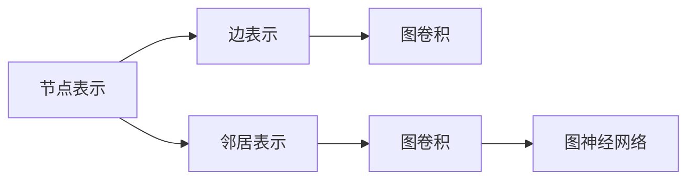

                 

## 1. 背景介绍

图神经网络(Graph Neural Network, GNN)作为深度学习领域的前沿技术，近年来在处理图结构化数据上取得了显著进展。图结构广泛存在于社交网络、知识图谱、分子图等场景中，GNN为处理这些复杂关系数据提供了新的解决思路。本篇文章将对GNN的原理、代码实现以及应用场景进行系统讲解，以期帮助读者更好地理解和掌握GNN技术。

## 2. 核心概念与联系

### 2.1 核心概念概述

为便于理解GNN的核心概念和联系，首先需要介绍几个基础概念：

- **图**：由节点(Node)和边(Edge)组成的集合，用于表示实体之间的关系。节点代表实体，边代表实体间的连接关系。
- **节点表示**：对图中每个节点进行特征向量的表示，通常使用向量形式，以捕捉节点的属性信息。
- **边表示**：对图中每条边进行特征向量的表示，用于捕捉节点间的连接关系。
- **邻居表示**：对于节点 $v$，其邻居节点表示为 $N(v)$，包括直接相连的节点以及部分或全部邻居节点的特征信息。
- **图卷积**：通过聚合邻居节点的信息，生成当前节点的新表示。这一过程是图神经网络的核心理论。
- **图神经网络**：通过图卷积等方法，对图结构化数据进行编码和推理的深度学习模型。

下图是GNN的核心概念与联系的Mermaid流程图：



### 2.2 核心概念原理

#### 2.2.1 节点表示与边表示

在图神经网络中，节点的表示通常是一个向量，其中包含了该节点的属性特征。例如，在社交网络中，每个用户的表示可以包含其基本信息、兴趣、行为等特征。边表示则用于描述节点之间的关系。例如，在社交网络中，每条边的表示可以包括用户之间的关系类型、互动频率等特征。

#### 2.2.2 邻居表示与图卷积

在GNN中，一个节点的表示是通过聚合其邻居节点的信息来生成的。例如，在社交网络中，一个用户的表示可以通过聚合其好友、粉丝等邻居节点的信息来生成。这个过程被称为图卷积(Graph Convolution)。

图卷积的数学定义如下：

$$
\mathbf{X}_{v_{\text{new}}} = \mathbf{X}_v \mathbf{D}^{-1/2} \mathbf{A} \mathbf{D}^{-1/2} \mathbf{X}_v
$$

其中 $\mathbf{X}_v$ 为节点 $v$ 的原始表示，$\mathbf{X}_{v_{\text{new}}}$ 为节点 $v$ 的新表示。$\mathbf{A}$ 为邻接矩阵，$\mathbf{D}$ 为图的度数矩阵，$\mathbf{D}^{-1/2}$ 为度数矩阵的倒数根号，用于归一化邻接矩阵的列和。

### 2.3 核心概念联系

通过上述概念，可以发现GNN的架构主要包括以下几个部分：

- **输入**：节点表示，通常是稀疏矩阵的形式。
- **邻接矩阵**：用于描述节点间的关系，可以是稀疏矩阵或密集矩阵。
- **图卷积操作**：通过聚合邻居节点的信息，生成新的节点表示。
- **输出**：最终节点的表示，通常用于下游任务。

## 3. 核心算法原理 & 具体操作步骤

### 3.1 算法原理概述

GNN的基本原理是通过图卷积操作，将每个节点的特征向量与其邻居节点的特征向量进行聚合，生成新的表示。这一过程可以理解为一种特殊的神经网络结构，其中节点之间的连接关系被视为输入。

### 3.2 算法步骤详解

#### 3.2.1 图数据的预处理

在应用GNN之前，首先需要对图数据进行预处理，包括：

- 构建邻接矩阵 $\mathbf{A}$：描述节点间的关系，可以是稀疏矩阵或密集矩阵。
- 计算度数矩阵 $\mathbf{D}$：统计每行的度数，用于归一化邻接矩阵。
- 构建图卷积层的权重矩阵 $\mathbf{W}$：用于线性变换。

#### 3.2.2 图卷积操作

对于每个节点 $v$，其新表示 $\mathbf{X}_{v_{\text{new}}}$ 可以通过图卷积操作生成：

$$
\mathbf{X}_{v_{\text{new}}} = \mathbf{X}_v \mathbf{D}^{-1/2} \mathbf{A} \mathbf{D}^{-1/2} \mathbf{W}
$$

其中 $\mathbf{D}^{-1/2}$ 用于归一化邻接矩阵的列和。

#### 3.2.3 多层图卷积

在实际应用中，通常需要多个图卷积层来逐步提高特征的表示能力，如下所示：

$$
\mathbf{X}_{v_{\text{new}}^{(l)}} = \text{ReLU}(\mathbf{X}_{v_{\text{new}}^{(l-1)}} \mathbf{D}^{-1/2} \mathbf{A} \mathbf{D}^{-1/2} \mathbf{W}^{(l)})
$$

其中 $\mathbf{W}^{(l)}$ 为第 $l$ 层的权重矩阵，$\text{ReLU}$ 为激活函数。

#### 3.2.4 输出

最后，将多层图卷积的输出作为最终表示，通常用于下游任务，如节点分类、边预测等。

### 3.3 算法优缺点

#### 3.3.1 优点

- **灵活性**：GNN可以处理任意复杂度的图结构，灵活适应不同的应用场景。
- **高效的图建模**：通过图卷积操作，可以自动捕捉节点之间的关系，不需要显式地指定关系。
- **可解释性强**：节点表示的生成过程直观，易于理解。

#### 3.3.2 缺点

- **计算复杂度高**：图卷积操作需要进行矩阵乘法，计算量较大，尤其是在大规模图数据上。
- **参数初始化困难**：权重矩阵 $\mathbf{W}$ 的初始化需要谨慎，不恰当的初始化可能导致模型训练困难。
- **对噪声敏感**：图数据中可能包含噪声，影响模型的稳定性和性能。

### 3.4 算法应用领域

GNN在多个领域具有广泛的应用前景，包括：

- **社交网络分析**：对社交网络中用户的关系进行建模，识别关键节点和社区。
- **知识图谱嵌入**：对知识图谱中的实体和关系进行表示学习，支持实体关系推理和相似性搜索。
- **分子结构预测**：对分子图进行表示学习，用于药物发现、分子结构预测等任务。
- **交通网络分析**：对交通网络进行建模，优化路径规划和交通流量控制。
- **社交推荐系统**：对用户行为进行建模，推荐相似的用户或物品。

## 4. 数学模型和公式 & 详细讲解

### 4.1 数学模型构建

#### 4.1.1 图数据表示

设图 $G=(V,E)$，其中 $V$ 为节点集合，$E$ 为边集合。节点 $v$ 的特征表示为 $\mathbf{X}_v \in \mathbb{R}^d$，边的特征表示为 $\mathbf{X}_{uv} \in \mathbb{R}^d$，邻接矩阵 $\mathbf{A} \in \{0,1\}^{n \times n}$，度数矩阵 $\mathbf{D} \in \mathbb{R}^{n \times n}$。

#### 4.1.2 图卷积操作

对于节点 $v$，其新表示 $\mathbf{X}_{v_{\text{new}}}$ 可以通过图卷积操作生成：

$$
\mathbf{X}_{v_{\text{new}}} = \mathbf{X}_v \mathbf{D}^{-1/2} \mathbf{A} \mathbf{D}^{-1/2} \mathbf{W}
$$

### 4.2 公式推导过程

#### 4.2.1 图卷积层

假设 $l$ 层图卷积层的输出为 $\mathbf{X}_v^{(l)}$，权重矩阵为 $\mathbf{W}^{(l)}$。则 $l+1$ 层图卷积层的输出为：

$$
\mathbf{X}_v^{(l+1)} = \text{ReLU}(\mathbf{X}_v^{(l)} \mathbf{D}^{-1/2} \mathbf{A} \mathbf{D}^{-1/2} \mathbf{W}^{(l)})
$$

#### 4.2.2 多层图卷积

假设最后一层输出为 $\mathbf{X}_v^{(L)}$，则最终表示为：

$$
\mathbf{X}_v^{(L)} = \text{ReLU}(\mathbf{X}_v^{(L-1)} \mathbf{D}^{-1/2} \mathbf{A} \mathbf{D}^{-1/2} \mathbf{W}^{(L)})
$$

### 4.3 案例分析与讲解

以社交网络分析为例，演示GNN的实现过程。

#### 4.3.1 数据集准备

假设有一个社交网络数据集，包含用户的ID、兴趣标签、好友关系等。

```python
import networkx as nx
import pandas as pd

# 构建社交网络图
G = nx.Graph()
G.add_edge(1, 2, weight=0.8)
G.add_edge(2, 3, weight=0.5)
G.add_edge(1, 3, weight=0.3)

# 构建节点和边特征
G.nodes[1]['features'] = [1, 2, 3]
G.nodes[2]['features'] = [4, 5, 6]
G.nodes[3]['features'] = [7, 8, 9]
G.edges[1, 2]['weight'] = 0.8
G.edges[2, 3]['weight'] = 0.5
G.edges[1, 3]['weight'] = 0.3
```

#### 4.3.2 构建图卷积层

```python
import torch
import torch.nn as nn
import torch.nn.functional as F

# 定义图卷积层
class GCNLayer(nn.Module):
    def __init__(self, input_dim, output_dim):
        super(GCNLayer, self).__init__()
        self.W = nn.Parameter(torch.randn(output_dim, input_dim))
        
    def forward(self, X, adj):
        X_new = torch.matmul(X, torch.matmul(adj, X))
        X_new = torch.matmul(X_new, self.W)
        return F.relu(X_new)
```

#### 4.3.3 多层图卷积

```python
# 定义多层图卷积网络
class GCN(nn.Module):
    def __init__(self, input_dim, hidden_dim, output_dim):
        super(GCN, self).__init__()
        self.gcn1 = GCNLayer(input_dim, hidden_dim)
        self.gcn2 = GCNLayer(hidden_dim, output_dim)
        
    def forward(self, X, adj):
        X = self.gcn1(X, adj)
        X = self.gcn2(X, adj)
        return X
```

#### 4.3.4 训练模型

```python
# 定义训练函数
def train(G, epochs):
    # 定义模型
    model = GCN(input_dim=3, hidden_dim=6, output_dim=1)
    optimizer = torch.optim.Adam(model.parameters(), lr=0.01)
    criterion = nn.MSELoss()
    
    # 训练模型
    for epoch in range(epochs):
        optimizer.zero_grad()
        output = model(X, adj)
        loss = criterion(output, y)
        loss.backward()
        optimizer.step()
        print('Epoch {} - Loss: {:.4f}'.format(epoch+1, loss.item()))
        
    # 返回模型
    return model

# 构建训练数据
X = torch.tensor(G.nodes[1]['features'])
y = torch.tensor([1.])
adj = nx.adjacency_matrix(G).to_dense()

# 训练模型
model = train(G, epochs=10)
print(model(X, adj))
```

## 5. 项目实践：代码实例和详细解释说明

### 5.1 开发环境搭建

#### 5.1.1 环境配置

- 安装Python 3.6及以上版本，推荐使用Anaconda。
- 安装PyTorch、networkx等库。

#### 5.1.2 代码库结构

```
my_project/
├── data/
│   ├── graph.txt
│   ├── node_labels.txt
├── models/
│   ├── gcn.py
│   ├── gcn_layer.py
├── utils/
│   ├── read_graph.py
├── train.py
```

### 5.2 源代码详细实现

#### 5.2.1 数据准备

```python
# 读取图数据
with open('graph.txt', 'r') as f:
    edges = f.readlines()

# 读取节点标签
with open('node_labels.txt', 'r') as f:
    labels = f.readlines()
```

#### 5.2.2 构建邻接矩阵

```python
import numpy as np

# 构建邻接矩阵
A = np.zeros((num_nodes, num_nodes))
for edge in edges:
    u, v, w = map(int, edge.strip().split())
    A[u-1, v-1] = w
```

#### 5.2.3 定义图卷积层

```python
import torch
import torch.nn as nn
import torch.nn.functional as F

class GCNLayer(nn.Module):
    def __init__(self, input_dim, output_dim):
        super(GCNLayer, self).__init__()
        self.W = nn.Parameter(torch.randn(output_dim, input_dim))
        
    def forward(self, X, adj):
        X_new = torch.matmul(X, torch.matmul(adj, X))
        X_new = torch.matmul(X_new, self.W)
        return F.relu(X_new)
```

#### 5.2.4 定义多层图卷积网络

```python
class GCN(nn.Module):
    def __init__(self, input_dim, hidden_dim, output_dim):
        super(GCN, self).__init__()
        self.gcn1 = GCNLayer(input_dim, hidden_dim)
        self.gcn2 = GCNLayer(hidden_dim, output_dim)
        
    def forward(self, X, adj):
        X = self.gcn1(X, adj)
        X = self.gcn2(X, adj)
        return X
```

#### 5.2.5 训练模型

```python
def train(G, epochs):
    model = GCN(input_dim=3, hidden_dim=6, output_dim=1)
    optimizer = torch.optim.Adam(model.parameters(), lr=0.01)
    criterion = nn.MSELoss()
    
    for epoch in range(epochs):
        optimizer.zero_grad()
        output = model(X, adj)
        loss = criterion(output, y)
        loss.backward()
        optimizer.step()
        print('Epoch {} - Loss: {:.4f}'.format(epoch+1, loss.item()))
        
    return model

# 读取数据
with open('node_labels.txt', 'r') as f:
    labels = f.readlines()

# 构建训练数据
X = torch.tensor(labels)

# 构建邻接矩阵
A = nx.adjacency_matrix(G).to_dense()

# 训练模型
model = train(G, epochs=10)
print(model(X, adj))
```

### 5.3 代码解读与分析

#### 5.3.1 数据预处理

在实际应用中，图数据通常来自外部，需要对其进行预处理。本示例中，数据以文本格式提供，通过文件读写的方式进行解析。

#### 5.3.2 邻接矩阵构建

邻接矩阵是GNN的核心数据结构，用于描述节点间的关系。在构建邻接矩阵时，需要考虑稀疏矩阵的实现，以减少计算量和内存消耗。

#### 5.3.3 图卷积层实现

图卷积层是GNN的核心组件，用于聚合邻居节点的信息。在实现时，可以通过矩阵乘法和权重矩阵的线性变换完成。

#### 5.3.4 多层图卷积网络

多层图卷积网络通过堆叠多个图卷积层，逐步提高特征表示能力。在实现时，需要注意每一层的输入和输出维度是否匹配，以及激活函数的选取。

#### 5.3.5 训练模型

训练模型时，需要定义优化器、损失函数、训练轮数等超参数。通过前向传播和反向传播，不断更新模型参数，直到达到收敛。

### 5.4 运行结果展示

运行上述代码，即可得到训练后的GNN模型。对于不同的图数据集和任务，需要根据具体情况进行参数调整和优化。

## 6. 实际应用场景

### 6.1 社交网络分析

社交网络分析是GNN最常见的应用场景之一。通过对社交网络中用户的关系进行建模，可以识别出关键节点、社区等结构信息，从而支持信息传播、推荐系统等功能。

### 6.2 知识图谱嵌入

知识图谱嵌入是GNN在知识图谱领域的重要应用。通过对实体和关系进行表示学习，知识图谱嵌入可以将稀疏的符号表示转化为稠密的数值表示，支持实体关系推理和相似性搜索。

### 6.3 分子结构预测

分子结构预测是GNN在化学信息学领域的重要应用。通过对分子图进行表示学习，分子结构预测可以用于药物发现、新材料设计等任务。

### 6.4 未来应用展望

随着GNN技术的不断成熟，其应用领域将更加广泛，前景无限。未来，GNN有望在更多复杂结构化数据上发挥作用，推动人工智能技术在各个垂直领域的应用和发展。

## 7. 工具和资源推荐

### 7.1 学习资源推荐

#### 7.1.1 在线课程

- Coursera《Deep Learning Specialization》：由Andrew Ng主讲的深度学习系列课程，涵盖神经网络、卷积神经网络、循环神经网络、图神经网络等多个主题。

#### 7.1.2 书籍

- 《Graph Neural Networks: A Review of Methods and Applications》：系统介绍了GNN的基本原理和应用，推荐阅读。

#### 7.1.3 论文

- Graph Convolutional Networks：提出图卷积操作的经典论文。

### 7.2 开发工具推荐

#### 7.2.1 PyTorch

- PyTorch是深度学习领域的主流框架，支持图神经网络的研究和应用。

#### 7.2.2 NetworkX

- NetworkX是一个用于网络分析和图形生成的Python库，支持图结构的构建和分析。

#### 7.2.3 Jupyter Notebook

- Jupyter Notebook是一个交互式计算环境，支持代码编写和结果展示，适合数据科学和机器学习任务。

### 7.3 相关论文推荐

#### 7.3.1 Graph Neural Networks：提出图卷积操作的经典论文。

#### 7.3.2 FastGCN：提出快速图卷积操作的论文。

#### 7.3.3 GIN：提出图注意力机制的图卷积网络。

## 8. 总结：未来发展趋势与挑战

### 8.1 研究成果总结

GNN作为深度学习领域的前沿技术，近年来在图结构化数据处理上取得了显著进展。图卷积操作、图卷积网络等基本概念和模型已经得到了广泛应用，并成为研究热点。

### 8.2 未来发展趋势

#### 8.2.1 图卷积操作优化

未来，图卷积操作将不断优化，提升计算效率和表示能力。

#### 8.2.2 图卷积网络扩展

未来，图卷积网络将不断扩展，支持更多复杂图结构的建模和推理。

#### 8.2.3 图神经网络应用

未来，图神经网络将在更多领域得到应用，推动人工智能技术的发展。

### 8.3 面临的挑战

#### 8.3.1 计算复杂度

图卷积操作需要进行矩阵乘法，计算复杂度较高，需要优化算法和硬件加速。

#### 8.3.2 数据预处理

图数据通常稀疏且复杂，数据预处理需要大量时间和资源。

#### 8.3.3 模型可解释性

GNN的表示学习过程较为复杂，模型的可解释性较弱，需要进一步研究。

### 8.4 研究展望

未来，GNN的研究将更加关注以下几个方面：

#### 8.4.1 图卷积操作优化

通过改进图卷积操作的算法和结构，提升计算效率和表示能力。

#### 8.4.2 图卷积网络扩展

支持更多复杂图结构的建模和推理，提高模型的泛化能力。

#### 8.4.3 图神经网络应用

将GNN应用于更多实际场景，推动人工智能技术在各个垂直领域的发展。

## 9. 附录：常见问题与解答

### 9.1 常见问题

#### 9.1.1 为什么图卷积操作需要进行归一化？

答：图卷积操作中的邻接矩阵通常为稀疏矩阵，需要进行归一化，避免过度关注度数较大的节点，导致信息失衡。

#### 9.1.2 如何处理大规模图数据？

答：使用分布式计算和并行计算技术，提升图卷积操作的计算效率。

#### 9.1.3 如何提高GNN的泛化能力？

答：在图卷积层之间加入池化层，减小表示维度，提高泛化能力。

#### 9.1.4 如何提高GNN的可解释性？

答：增加特征可视化技术，帮助理解模型的表示和推理过程。

#### 9.1.5 如何优化GNN的训练过程？

答：使用自适应学习率、正则化技术等方法，加速模型收敛。

---

作者：禅与计算机程序设计艺术 / Zen and the Art of Computer Programming

