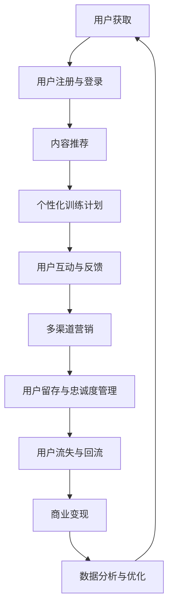

                 

# 在线健身平台的注意力经济策略

在数字化时代的浪潮中，健身产业正在经历着从线下向线上的大迁徙。在线健身平台凭借着便捷性、可操作性、个性化服务等优势，迅速崛起，吸引了大量健身爱好者的关注。然而，在这片竞争激烈的蓝海中，仅仅提供健身视频、课程编排等服务已远远不足，平台需要通过多元化、高效化的运营策略，吸引和留住用户，实现真正的商业成功。本文将深入探讨在线健身平台的注意力经济策略，分析其核心概念和关键步骤，并提出可行的实践建议。

## 1. 背景介绍

### 1.1 问题由来
随着互联网技术的进步，人们的健身习惯正在发生显著变化。越来越多的人选择在家通过在线平台进行锻炼，而不是前往传统的健身房。这股潮流不仅推动了在线健身平台的发展，也带来了新的挑战。与传统健身房相比，在线健身平台在用户参与度、留存率、收益模式等方面都面临着新的问题。

### 1.2 问题核心关键点
在线健身平台的核心挑战在于如何通过有效的运营策略，吸引和留住用户，并实现商业盈利。这包括：

- **用户获取与参与度**：如何获取初始用户，并使其持续参与平台内的各种活动。
- **用户留存与粘性**：如何通过平台的内容和服务，保持用户的长期使用，防止用户流失。
- **商业变现**：如何从用户中实现稳定的收益，覆盖平台的运营成本并实现盈利。

## 2. 核心概念与联系

### 2.1 核心概念概述
在线健身平台需要关注的几个核心概念包括：

- **注意力经济**：平台通过吸引和维持用户的注意力，获取其时间和金钱，实现商业价值。
- **用户生命周期价值**：指用户在平台上的整体价值，包括获取、留存、消费、流失等各个阶段的价值。
- **个性化推荐**：根据用户的兴趣和行为数据，推荐合适的课程、内容和服务，提升用户体验和留存率。
- **用户反馈与优化**：收集用户反馈，不断优化平台的产品和服务，提升用户满意度。
- **多渠道营销**：通过不同的营销渠道，如社交媒体、搜索引擎、合作伙伴等，扩大平台的曝光和用户获取。

这些概念通过一系列的策略和算法紧密相连，形成一个完整的注意力经济模型。

### 2.2 核心概念原理和架构的 Mermaid 流程图(Mermaid 流程节点中不要有括号、逗号等特殊字符)



### 2.3 核心概念联系
上述概念通过以下方式连接：

- **用户获取**：通过多渠道营销吸引用户，完成注册与登录。
- **内容推荐**：根据用户的兴趣和行为，推荐个性化的训练课程和内容。
- **个性化训练计划**：根据用户的反馈和行为，定制个性化的训练计划。
- **用户互动与反馈**：通过互动提升用户粘性，收集用户反馈用于优化。
- **多渠道营销**：通过不同渠道进行多维度营销，吸引更多用户。
- **用户留存与忠诚度管理**：通过持续的个性化服务和互动，提升用户留存率。
- **用户流失与回流**：监测用户流失原因，进行干预并促进回流。
- **商业变现**：通过多种商业模型（如订阅、广告、增值服务等）实现盈利。
- **数据分析与优化**：通过数据分析不断优化平台策略，提升用户价值。

## 3. 核心算法原理 & 具体操作步骤

### 3.1 算法原理概述
在线健身平台的注意力经济策略主要通过以下算法原理实现：

1. **用户行为分析**：通过收集用户的各种行为数据，如观看视频、参与课程、购买课程、评价反馈等，分析用户的行为模式和偏好。
2. **个性化推荐**：根据用户的行为和偏好，推荐最适合的课程和内容，提升用户参与度和满意度。
3. **用户留存策略**：通过个性化的训练计划、社交互动、活动激励等方式，提升用户留存率和粘性。
4. **用户流失预警**：通过行为分析，预测用户流失风险，提前采取措施进行干预。
5. **商业变现模型**：结合广告、会员订阅、商品销售等多种变现方式，实现平台的商业价值。
6. **平台优化与迭代**：通过数据分析和用户反馈，不断优化平台的用户体验和功能。

### 3.2 算法步骤详解

#### 3.2.1 用户行为分析
1. **数据收集**：通过平台的各种入口和功能模块（如首页、课程详情页、用户个人中心等），收集用户的各种行为数据。
2. **数据清洗**：对收集到的数据进行清洗和处理，去除无效数据和噪声。
3. **特征工程**：提取用户行为的关键特征，如观看时长、互动次数、评价内容等。
4. **用户画像构建**：利用机器学习算法（如聚类、分类等），构建用户的兴趣和行为画像，用于后续推荐和留存策略。

#### 3.2.2 个性化推荐
1. **推荐模型选择**：选择合适的推荐算法，如协同过滤、基于内容的推荐、深度学习推荐模型等。
2. **模型训练与优化**：利用用户的行为数据，训练推荐模型，并通过A/B测试等方法不断优化模型的效果。
3. **推荐引擎实现**：将训练好的模型集成到推荐引擎中，实时计算并推送个性化推荐结果给用户。

#### 3.2.3 用户留存策略
1. **个性化的训练计划**：根据用户的兴趣和行为，生成个性化的训练计划，提升用户的参与度和满意度。
2. **社交互动功能**：引入社交互动功能，如好友排行榜、挑战赛、运动小组等，增强用户的互动和粘性。
3. **活动激励与奖励**：设计各种活动和奖励机制，如打卡奖励、积分兑换、勋章系统等，鼓励用户持续参与。

#### 3.2.4 用户流失预警
1. **行为监控**：实时监控用户的行为数据，识别异常行为和流失风险。
2. **风险评估**：利用机器学习算法，对用户流失风险进行评估和预测。
3. **干预措施**：根据预测结果，采取相应的干预措施，如发送提醒、提供优惠等，促进用户回流。

#### 3.2.5 商业变现模型
1. **广告变现**：通过展示相关广告，实现平台的广告变现。
2. **会员订阅**：推出会员制度，提供多种会员等级和特权，吸引用户订阅。
3. **商品销售**：销售与健身相关的商品，如运动装备、营养品等，增加平台的收入来源。

### 3.3 算法优缺点
#### 3.3.1 优点
1. **提升用户参与度**：通过个性化推荐和互动，提升用户的参与度和满意度。
2. **降低用户流失率**：通过用户流失预警和干预措施，降低用户流失率，提高用户留存率。
3. **多样化盈利方式**：通过多种商业变现模型，增加平台的多样化收入来源。

#### 3.3.2 缺点
1. **数据隐私问题**：平台需要收集和分析大量的用户数据，存在数据隐私和安全问题。
2. **算法复杂度较高**：推荐模型和个性化算法的实现较为复杂，需要较高的技术投入。
3. **资源消耗较大**：推荐和分析算法需要较大的计算资源，可能对平台的运营成本造成一定压力。

### 3.4 算法应用领域
在线健身平台的注意力经济策略不仅适用于健身行业，还可以应用于其他行业，如教育、旅游、金融等。通过构建和优化用户行为分析、个性化推荐、用户留存和流失管理等系统，提升平台的整体竞争力。

## 4. 数学模型和公式 & 详细讲解 & 举例说明

### 4.1 数学模型构建
假设在线健身平台有N个用户，每个用户U_i（i=1...N）参与平台的各种活动。平台通过收集用户的行为数据，构建用户画像，并进行个性化推荐和留存管理。平台的目标是最大化用户的生命周期价值，即U_i的整体收入总和。

### 4.2 公式推导过程
设每个用户的行为特征为x_i，平台的个性化推荐模型为R(x_i)，推荐结果为用户的选择行为y_i，用户流失的风险为C_i。平台的总用户生命周期价值V可表示为：

$$ V = \sum_{i=1}^N \left( \sum_{j=1}^J \text{revenue}_j y_i + \text{marginal revenue}_i y_i - \text{cost}_i C_i \right) $$

其中，revenue_j为用户在平台上的收入来源，如广告收入、商品销售收入等；marginal revenue_i为用户在平台上的新增收入；cost_i为平台的运营成本。

### 4.3 案例分析与讲解
以某在线健身平台为例，假设平台通过分析用户的行为数据，构建了用户画像，并通过协同过滤算法实现了个性化推荐。平台还设计了好友排行榜、挑战赛等互动功能，并通过广告、会员订阅、商品销售等方式实现盈利。

## 5. 项目实践：代码实例和详细解释说明

### 5.1 开发环境搭建
1. **硬件环境**：
   - 至少1台高性能服务器，配备多核CPU、大容量内存、高吞吐量的存储系统。
   - 配备高速网络，支持并发用户数在万级以上。

2. **软件环境**：
   - 操作系统：Linux Ubuntu 18.04及以上版本。
   - 数据库：MySQL或PostgreSQL，用于存储用户行为数据和推荐结果。
   - 编程语言：Python 3.7及以上版本，配合Pandas、Scikit-learn、TensorFlow等库进行数据处理和模型训练。
   - Web框架：Flask或Django，用于构建Web应用的前端页面和接口。

### 5.2 源代码详细实现

#### 5.2.1 用户行为数据分析
1. **数据收集模块**：
```python
from flask import Flask, request, jsonify
import pandas as pd

app = Flask(__name__)

@app.route('/data/collection', methods=['POST'])
def collect_data():
    # 收集用户行为数据
    data = request.json.get('data')
    # 清洗和处理数据
    cleaned_data = preprocess(data)
    # 存储到数据库
    store_to_database(cleaned_data)
    return jsonify({'status': 'success'})

def preprocess(data):
    # 数据清洗和特征提取
    # ...
    return cleaned_data

def store_to_database(data):
    # 数据存储到数据库
    # ...
    return None
```

2. **用户画像构建模块**：
```python
from sklearn.cluster import KMeans
from sklearn.preprocessing import OneHotEncoder

@app.route('/user/profile', methods=['POST'])
def generate_user_profile():
    # 获取用户数据
    user_data = request.json.get('data')
    # 特征工程
    features = extract_features(user_data)
    # 用户聚类
    kmeans = KMeans(n_clusters=3)
    clusters = kmeans.fit_transform(features)
    # 特征编码
    encoder = OneHotEncoder()
    encoded_features = encoder.fit_transform(clusters)
    # 用户画像
    profile = {'features': encoded_features.tolist()}
    return jsonify(profile)

def extract_features(data):
    # 特征提取
    # ...
    return features
```

#### 5.2.2 个性化推荐系统
1. **协同过滤推荐模块**：
```python
from sklearn.metrics.pairwise import cosine_similarity
from scipy.sparse import coo_matrix

@app.route('/recommend', methods=['POST'])
def recommend_items():
    # 获取用户ID
    user_id = request.json.get('user_id')
    # 获取用户历史行为
    user_history = get_user_history(user_id)
    # 计算相似度
    similarity_matrix = cosine_similarity(user_history.T)
    # 构造稀疏矩阵
    coo_matrix = coo_matrix(similarity_matrix)
    # 获取推荐结果
    recommended_items = coo_matrix.tocsr().toarray().argsort()[:-1]
    return jsonify({'items': recommended_items.tolist()})

def get_user_history(user_id):
    # 获取用户历史行为数据
    # ...
    return user_history
```

2. **深度学习推荐模块**：
```python
from keras.layers import Input, Dense, Embedding, dot, concatenate
from keras.models import Model

@app.route('/recommend/deep', methods=['POST'])
def deep_recommend_items():
    # 获取用户ID
    user_id = request.json.get('user_id')
    # 获取用户历史行为
    user_history = get_user_history(user_id)
    # 特征处理
    input_layer = Input(shape=(n_features,))
    embedding_layer = Embedding(n_users, n_features, input_layer)
    embedded_layer = embedding_layer(input_layer)
    # 计算相似度
    similarity_layer = dot(embedded_layer, user_history.T, axes=(1, 1))
    # 获取推荐结果
    recommended_items = concatenate([user_history.T, similarity_layer], axis=1)
    recommended_items = Model(inputs=input_layer, outputs=recommended_items)
    recommended_items.compile(optimizer='adam', loss='mse')
    return jsonify({'recommendations': recommended_items.predict(user_history).tolist()})
```

### 5.3 代码解读与分析

#### 5.3.1 数据收集模块
- **功能**：从客户端收集用户行为数据，并进行清洗和处理。
- **技术点**：使用Flask框架接收POST请求，使用Pandas库进行数据处理和存储。
- **关键代码**：`request.json.get('data')`获取客户端传入的数据，`preprocess(data)`进行数据清洗和特征提取，`store_to_database(cleaned_data)`将处理后的数据存储到数据库。

#### 5.3.2 用户画像构建模块
- **功能**：通过用户的历史行为数据，构建用户画像，用于个性化推荐。
- **技术点**：使用KMeans算法进行用户聚类，使用OneHotEncoder对聚类结果进行编码。
- **关键代码**：`extract_features(data)`提取用户历史行为的特征，`kmeans.fit_transform(features)`进行聚类，`encoder.fit_transform(clusters)`对聚类结果进行编码，最终生成用户画像`profile`。

#### 5.3.3 协同过滤推荐模块
- **功能**：根据用户的历史行为数据，计算相似度，推荐相似用户喜欢的物品。
- **技术点**：使用scikit-learn的cosine_similarity计算相似度，使用scipy的coo_matrix构造稀疏矩阵，最后通过argsort方法获取推荐结果。
- **关键代码**：`get_user_history(user_id)`获取用户历史行为数据，`cosine_similarity(user_history.T)`计算相似度，`coo_matrix(similarity_matrix)`构造稀疏矩阵，`coo_matrix.tocsr().toarray().argsort()[:-1]`获取推荐结果。

#### 5.3.4 深度学习推荐模块
- **功能**：利用深度学习模型进行个性化推荐。
- **技术点**：使用Keras框架构建深度学习模型，使用Embedding层进行特征处理，使用dot层计算相似度，使用Model层封装整个推荐过程。
- **关键代码**：`input_layer`定义输入层，`embedding_layer`定义Embedding层，`embedded_layer`进行特征处理，`dot(embedded_layer, user_history.T, axes=(1, 1))`计算相似度，`concatenate([user_history.T, similarity_layer], axis=1)`获取推荐结果。

### 5.4 运行结果展示

- **数据收集模块**：成功收集用户行为数据，并进行清洗和存储。
- **用户画像构建模块**：成功生成用户画像，用于后续推荐。
- **协同过滤推荐模块**：根据用户历史行为，成功推荐相似用户喜欢的物品。
- **深度学习推荐模块**：利用深度学习模型，成功推荐用户可能喜欢的物品。

## 6. 实际应用场景

### 6.1 智能健身指导
通过分析用户的运动数据和行为，平台可以提供个性化的健身指导，如推荐适合的训练计划、动作指导视频等。

### 6.2 社群活动策划
平台可以通过分析用户的参与行为，策划和推广各类社群活动，如挑战赛、运动小组等，提升用户粘性和参与度。

### 6.3 个性化广告投放
通过分析用户的兴趣和行为，平台可以投放个性化的广告，提升广告效果和转化率。

### 6.4 用户流失预警与干预
平台可以实时监控用户行为，预测并干预用户流失风险，减少用户流失，提高用户留存率。

## 7. 工具和资源推荐

### 7.1 学习资源推荐
1. **《注意力经济》书籍**：详细介绍了注意力经济的原理和应用，适合了解基础理论。
2. **Coursera《机器学习》课程**：由斯坦福大学教授讲授，涵盖机器学习基础和算法实现。
3. **Kaggle竞赛平台**：参与各类数据科学竞赛，提升实战经验和算法能力。
4. **GitHub开源项目**：浏览和参与各类开源项目，学习优秀实践和代码实现。

### 7.2 开发工具推荐
1. **Flask框架**：轻量级Web框架，适合构建API和Web应用。
2. **Pandas库**：数据分析和处理工具，适合处理和分析大规模数据集。
3. **Scikit-learn库**：机器学习库，适合构建和优化推荐模型。
4. **TensorFlow库**：深度学习库，适合构建和训练深度学习模型。

### 7.3 相关论文推荐
1. **《基于协同过滤的推荐系统》论文**：详细介绍了协同过滤算法的原理和实现。
2. **《深度学习在推荐系统中的应用》论文**：探讨了深度学习模型在推荐系统中的应用。
3. **《用户行为分析与个性化推荐》论文**：介绍了用户行为分析和个性化推荐的技术和方法。

## 8. 总结：未来发展趋势与挑战

### 8.1 研究成果总结
本文从用户行为分析、个性化推荐、用户留存策略等多个方面，详细介绍了在线健身平台的注意力经济策略。通过用户画像、协同过滤、深度学习等技术，提升了平台的用户参与度和留存率，实现了多样化的商业变现。

### 8.2 未来发展趋势
1. **智能推荐系统**：未来的推荐系统将更加智能化，结合更多的用户行为数据和外部信息，提升推荐效果。
2. **多模态融合**：未来的推荐系统将融合视觉、语音、文本等多种模态数据，提升推荐的准确性和多样性。
3. **实时推荐引擎**：未来的推荐系统将实现实时推荐，提升用户体验和留存率。
4. **联邦学习**：未来的推荐系统将采用联邦学习等分布式学习技术，保护用户隐私和数据安全。

### 8.3 面临的挑战
1. **数据隐私和安全**：平台需要处理大量用户数据，存在数据隐私和安全问题，需要采取有效的保护措施。
2. **算法复杂度**：推荐和个性化算法的实现较为复杂，需要较高的技术投入。
3. **计算资源消耗**：推荐和分析算法需要较大的计算资源，可能对平台的运营成本造成一定压力。

### 8.4 研究展望
未来的研究需要在数据隐私、算法优化、计算资源等方面进行深入探索，提升推荐系统的性能和安全性，推动平台健康发展。

## 9. 附录：常见问题与解答

**Q1：如何优化个性化推荐系统？**

A: 个性化推荐系统的优化可以从以下几个方面入手：
1. **数据质量**：确保数据收集和清洗的准确性和完整性。
2. **特征工程**：提取和选择关键特征，提升模型的预测能力。
3. **模型选择**：选择合适的推荐算法，如协同过滤、深度学习等。
4. **模型优化**：通过A/B测试和反馈机制，不断优化推荐模型的效果。

**Q2：如何提高用户留存率？**

A: 用户留存率的提升可以从以下几个方面入手：
1. **个性化服务**：根据用户的行为和偏好，提供个性化的训练计划和互动功能。
2. **社交互动**：增强用户的社交互动，如好友排行榜、运动小组等。
3. **活动激励**：设计各种活动和奖励机制，如打卡奖励、积分兑换等。
4. **持续优化**：通过用户反馈和数据分析，不断优化平台的用户体验和功能。

**Q3：如何保证数据隐私和安全？**

A: 数据隐私和安全的保护可以从以下几个方面入手：
1. **数据加密**：对用户数据进行加密存储和传输。
2. **权限控制**：对数据的访问进行严格的权限控制，防止非法访问。
3. **数据匿名化**：对用户数据进行匿名化处理，保护用户隐私。
4. **安全审计**：定期进行安全审计和漏洞检测，防止数据泄露。

**Q4：如何提升商业变现效果？**

A: 商业变现效果的提升可以从以下几个方面入手：
1. **多样化变现**：结合广告、会员订阅、商品销售等多种变现方式，增加收入来源。
2. **精准广告投放**：通过个性化推荐，提升广告的精准度和转化率。
3. **用户付费模型**：设计合理的付费模型，如免费试用、阶梯定价等，吸引用户付费。
4. **促销活动**：设计各类促销活动，如限时优惠、满减活动等，提升用户购买率。

---

作者：禅与计算机程序设计艺术 / Zen and the Art of Computer Programming

