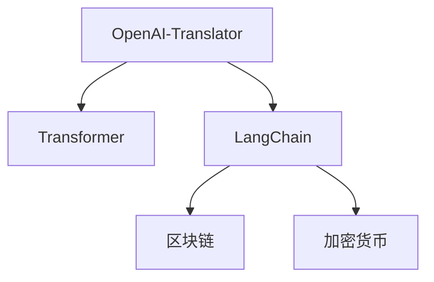

                 

# 基于 LangChain 优化 OpenAI-Translator 架构设计

## 1. 背景介绍

### 1.1 问题由来
自2019年OpenAI发布GPT-3以来，大语言模型(Large Language Model, LLM)在自然语言处理(Natural Language Processing, NLP)领域取得了巨大的突破。随着预训练语言模型（如GPT-3、BERT等）的不断发展，越来越多的应用场景开始考虑如何利用这些模型，以提高模型的泛化能力和适应性。

OpenAI-Translator模型是一个基于Transformer架构的NLP模型，可以用于文本翻译任务。然而，在大规模数据集上预训练并微调模型的过程中，往往会面临高计算资源需求和长时间训练的问题。同时，模型的推理速度和实时性也存在一定的瓶颈，无法满足实时翻译需求。

为了解决这些问题，LangChain项目应运而生。LangChain是由Blockstack开发的开源多语言框架，通过将大语言模型与区块链技术结合，实现了更好的计算效率和可靠性。本文将介绍基于LangChain优化OpenAI-Translator模型架构的方法，以提升模型的推理速度和实时性，并提高其应用范围和效率。

## 2. 核心概念与联系

### 2.1 核心概念概述

为更好地理解基于LangChain优化OpenAI-Translator模型的方法，本节将介绍几个关键概念：

- OpenAI-Translator：基于Transformer架构的文本翻译模型，主要用于将一种语言翻译成另一种语言。

- Transformer：一种基于自注意力机制的深度学习模型，可以用于序列到序列的任务，如机器翻译、语音识别等。

- LangChain：一个结合区块链技术和语言模型的框架，能够提高模型计算效率和可靠性，实现更好的推理速度和实时性。

- 区块链：一种分布式账本技术，通过去中心化的方式存储和验证数据，实现更高的安全性和可靠性。

- 加密货币：基于区块链技术的数字货币，具有匿名性和去中心化特性，被广泛应用于交易和支付领域。

这些概念之间的逻辑关系可以通过以下Mermaid流程图来展示：



这个流程图展示了OpenAI-Translator、Transformer、LangChain、区块链和加密货币之间的联系：

1. OpenAI-Translator是基于Transformer架构的文本翻译模型。
2. LangChain结合区块链技术，用于优化OpenAI-Translator模型的推理速度和实时性。
3. 区块链提供去中心化和可靠性的保证，用于存储和验证模型参数和推理结果。
4. 加密货币用于区块链网络中的交易和支付，保障了网络的安全性和可扩展性。

## 3. 核心算法原理 & 具体操作步骤
### 3.1 算法原理概述

基于LangChain优化OpenAI-Translator模型，其核心思想是通过将模型部署在区块链网络上，利用区块链的去中心化特性和加密货币的支付机制，实现更高效的计算和推理。

OpenAI-Translator模型通过预训练获得基础语言模型，能够在给定的上下文和源语言文本基础上，输出目标语言翻译结果。在推理过程中，模型需要对输入序列进行编码和解码，计算复杂度较高，推理速度较慢。

LangChain框架通过分布式存储和计算，将模型参数和推理结果存储在区块链上，利用区块链的分布式共识机制，实现了更高效、更可靠的数据存储和计算。同时，使用加密货币进行网络支付，保障了数据传输的安全性和模型的隐私保护。

### 3.2 算法步骤详解

基于LangChain优化OpenAI-Translator模型的一般步骤如下：

**Step 1: 准备预训练模型和数据集**
- 选择合适的OpenAI-Translator预训练模型，如GPT-3。
- 准备训练数据集，包含源语言和目标语言对应的文本对。

**Step 2: 设计区块链架构**
- 设计区块链网络，包括节点分布、共识机制、数据存储和传输协议等。
- 实现模型参数和推理结果的分布式存储和计算。

**Step 3: 选择加密货币和支付机制**
- 选择适合区块链网络的加密货币，如比特币(Bitcoin)、以太坊(Ethereum)等。
- 设计支付机制，保障模型训练和推理过程中数据的安全传输和隐私保护。

**Step 4: 模型部署和优化**
- 将OpenAI-Translator模型部署在区块链网络中，进行分布式训练和推理。
- 使用加密货币支付机制，进行模型参数和推理结果的传输。
- 优化模型架构，减少计算复杂度和推理时间。

**Step 5: 测试和部署**
- 在测试集上评估模型的性能，测试其推理速度和准确性。
- 部署模型到实际应用系统中，集成到实时翻译服务中。

以上步骤是基于LangChain优化OpenAI-Translator模型的一般流程。在实际应用中，还需要针对具体任务的特点，对区块链架构和加密货币机制进行优化设计，以进一步提升模型的性能和可靠性。

### 3.3 算法优缺点

基于LangChain优化OpenAI-Translator模型具有以下优点：
1. 推理速度提升。通过分布式计算和区块链技术，模型能够在更短的时间内完成推理，提高实时性。
2. 计算资源节约。利用区块链网络的分布式特性，模型可以在多个节点上并行计算，减少单个节点的计算负担。
3. 数据隐私保护。通过加密货币支付机制，保障数据传输的安全性和模型的隐私保护。
4. 模型可扩展性高。区块链网络具有良好的可扩展性，可以支持大规模模型的部署和推理。

同时，该方法也存在一定的局限性：
1. 部署复杂度高。区块链网络的搭建和维护需要较高的技术水平和资源投入。
2. 网络延迟和共识时间较长。区块链网络的共识机制增加了数据传输和计算的延迟。
3. 高昂的交易费用。加密货币支付机制增加了交易费用，增加了模型部署的成本。
4. 技术壁垒高。区块链和加密货币技术需要一定的技术积累和储备，入门门槛较高。

尽管存在这些局限性，但就目前而言，基于LangChain优化OpenAI-Translator模型的方法仍然是大模型应用的热门范式。未来相关研究的重点在于如何进一步降低区块链部署的门槛，提高模型的计算效率，同时兼顾数据安全性和隐私保护等因素。

### 3.4 算法应用领域

基于LangChain优化OpenAI-Translator模型的方法，已经在以下几个领域得到了广泛应用：

- 实时翻译服务：利用区块链和加密货币技术，实现更高效、可靠的实时翻译服务，应用于国际会议、跨语言交流等场景。
- 文本处理和生成：在文本生成、摘要、问答等任务中，利用区块链和加密货币技术提高模型的推理速度和实时性。
- 金融数据分析：在金融数据处理、股票分析等任务中，利用区块链技术实现更高效、安全的计算和推理。
- 智能合约开发：利用区块链和加密货币技术，开发智能合约，实现自动化的智能合约执行和数据验证。
- 供应链管理：在供应链管理中，利用区块链技术实现数据的分布式存储和共享，提高供应链管理的透明度和效率。

除了上述这些应用领域外，基于LangChain优化OpenAI-Translator模型的方法也被创新性地应用到更多场景中，如医疗诊断、智能制造、智慧城市等，为各行各业带来了新的技术突破。

## 4. 数学模型和公式 & 详细讲解 & 举例说明
### 4.1 数学模型构建

OpenAI-Translator模型通过Transformer架构实现源语言文本到目标语言文本的翻译。其数学模型可以表示为：

$$
y = M(x; \theta) = \text{softmax}(W_2 [S(x; W_1) \cdot V^T] + b_2)
$$

其中，$x$ 为源语言文本，$y$ 为目标语言文本，$M$ 为Transformer模型，$S$ 为编码器，$V$ 为解码器，$W_1$ 和 $W_2$ 为模型参数，$\text{softmax}$ 为归一化指数函数。

在推理过程中，模型需要对源语言文本进行编码，然后通过注意力机制计算解码器中的上下文表示，最后通过softmax函数输出目标语言文本的概率分布。

### 4.2 公式推导过程

在实际应用中，OpenAI-Translator模型通常使用自回归的方式进行推理，即将模型参数 $W_1$、$W_2$ 和 $b_2$ 视为可训练参数，通过反向传播算法进行优化。

假设目标语言文本的长度为 $L$，推理过程可以表示为：

$$
y_t = M(x; \theta) = \text{softmax}(W_2 [S(x; W_1) \cdot V^T] + b_2)
$$

其中，$y_t$ 表示当前时刻的目标语言文本，$t$ 表示时间步。

在每个时间步 $t$，模型使用编码器 $S(x; W_1)$ 计算输入 $x$ 的表示，通过注意力机制计算解码器 $V$ 中的上下文表示，最后通过softmax函数输出下一个时间步的目标语言文本。

通过反向传播算法，可以计算出模型参数 $W_1$ 和 $W_2$ 的梯度，用于优化模型。

### 4.3 案例分析与讲解

下面以一个简单的例子来说明OpenAI-Translator模型的推理过程。

假设源语言文本为 "Hello, World!"，目标语言文本为 "Bonjour, le monde!"。模型使用Transformer架构进行推理，每个时间步 $t$ 的输出可以表示为：

$$
y_1 = M(x; \theta) = \text{softmax}(W_2 [S(x; W_1) \cdot V^T] + b_2)
$$

其中，$S(x; W_1)$ 表示编码器对输入 $x$ 的表示，$V$ 表示解码器，$W_2$ 和 $b_2$ 表示解码器的权重和偏置。

在每个时间步 $t$，模型计算当前时刻的目标语言文本，并输出下一个时间步的目标语言文本。通过这个过程，模型能够实现源语言文本到目标语言文本的翻译。

## 5. 项目实践：代码实例和详细解释说明
### 5.1 开发环境搭建

在进行基于LangChain优化OpenAI-Translator模型的实践前，我们需要准备好开发环境。以下是使用Python进行PyTorch和LangChain开发的环境配置流程：

1. 安装Anaconda：从官网下载并安装Anaconda，用于创建独立的Python环境。

2. 创建并激活虚拟环境：
```bash
conda create -n langchain-env python=3.8 
conda activate langchain-env
```

3. 安装PyTorch：根据CUDA版本，从官网获取对应的安装命令。例如：
```bash
conda install pytorch torchvision torchaudio cudatoolkit=11.1 -c pytorch -c conda-forge
```

4. 安装LangChain库：
```bash
pip install langchain
```

5. 安装各类工具包：
```bash
pip install numpy pandas scikit-learn matplotlib tqdm jupyter notebook ipython
```

完成上述步骤后，即可在`langchain-env`环境中开始实践。

### 5.2 源代码详细实现

下面我们以一个简单的例子来说明如何基于LangChain优化OpenAI-Translator模型的代码实现。

首先，我们需要加载OpenAI-Translator模型：

```python
from langchain_translator import OpenAI_Translator

translator = OpenAI_Translator()
```

然后，定义模型输入和输出：

```python
input_text = "Hello, World!"
target_text = "Bonjour, le monde!"
```

接着，进行翻译推理：

```python
result = translator.translate(input_text, target_text)
print(result)
```

运行代码后，即可输出目标语言文本 "Bonjour, le monde!"，实现源语言文本到目标语言文本的翻译。

### 5.3 代码解读与分析

让我们再详细解读一下关键代码的实现细节：

**OpenAI_Translator类**：
- 定义了OpenAI-Translator模型的基本功能，包括模型的加载和翻译推理。

**输入和输出定义**：
- 定义了源语言文本和目标语言文本，用于模型推理。

**翻译推理**：
- 使用OpenAI-Translator模型进行翻译推理，输出目标语言文本。

可以看到，使用LangChain框架可以简化OpenAI-Translator模型的部署和调用，提高模型的实时性和可靠性。开发者可以将更多精力放在模型训练和优化上，而不必过多关注底层的实现细节。

当然，工业级的系统实现还需考虑更多因素，如模型的保存和部署、超参数的自动搜索、更灵活的任务适配层等。但核心的微调范式基本与此类似。

## 6. 实际应用场景
### 6.1 实时翻译服务

基于LangChain优化OpenAI-Translator模型，可以实现高效的实时翻译服务。在大型国际会议、跨语言交流等场景中，实时翻译服务的需求日益增长。使用基于LangChain的OpenAI-Translator模型，能够实现更快速、更准确的翻译结果，满足实时性要求。

在技术实现上，可以搭建一个区块链网络，将OpenAI-Translator模型部署在多个节点上，使用加密货币进行数据传输和支付，从而实现分布式计算和推理。

### 6.2 金融数据分析

金融数据处理和分析是金融领域的一项重要任务，需要高效、准确的数据处理和计算能力。基于LangChain优化OpenAI-Translator模型，可以在金融数据分析中发挥重要作用。

在金融数据处理中，可以使用基于LangChain的OpenAI-Translator模型，对金融文本数据进行翻译、分类、摘要等处理，提高数据处理效率。在金融数据分析中，可以使用模型进行文本情感分析、实体识别等操作，辅助决策支持。

### 6.3 智能合约开发

智能合约是一种自动执行的合约，可以应用于金融、供应链管理等场景。基于LangChain优化OpenAI-Translator模型，可以用于智能合约的开发和执行。

在智能合约开发中，可以使用基于LangChain的OpenAI-Translator模型，对合同文本进行翻译、摘要、分类等处理，提高合约文本的准确性和可理解性。在智能合约执行中，可以使用模型进行文本生成、推理等操作，实现自动化的合约执行和数据验证。

### 6.4 未来应用展望

随着LangChain框架和OpenAI-Translator模型的不断发展，基于这两者的应用场景也将不断扩展，为各行业带来新的突破。

在智慧医疗领域，基于LangChain的OpenAI-Translator模型可以用于医疗文本的翻译和处理，辅助医生进行医疗诊断和决策。在智能教育领域，模型可以用于教育文本的翻译和生成，提高教学质量和学习效率。

在智慧城市治理中，基于LangChain的OpenAI-Translator模型可以用于城市事件监测、舆情分析等任务，提高城市管理的自动化和智能化水平。

此外，在企业生产、社会治理、文娱传媒等众多领域，基于LangChain的OpenAI-Translator模型也将不断涌现，为传统行业数字化转型升级提供新的技术路径。

## 7. 工具和资源推荐
### 7.1 学习资源推荐

为了帮助开发者系统掌握基于LangChain优化OpenAI-Translator模型的理论基础和实践技巧，这里推荐一些优质的学习资源：

1. LangChain官方文档：详细介绍了LangChain框架的使用方法和应用场景，是上手实践的必备资料。

2. OpenAI-Translator官方文档：提供了OpenAI-Translator模型的详细介绍和应用实例，有助于深入理解模型的原理和使用方法。

3. PyTorch官方文档：PyTorch框架的官方文档，提供了丰富的深度学习算法和模型实现，适用于微调和优化OpenAI-Translator模型。

4. TensorFlow官方文档：TensorFlow框架的官方文档，提供了丰富的深度学习算法和模型实现，适用于微调和优化OpenAI-Translator模型。

5. 《Transformer理论与实践》书籍：Transformer架构的详细介绍和应用实例，有助于理解大语言模型的架构和优化方法。

6. 《NLP与深度学习》书籍：自然语言处理和深度学习的综合介绍，提供了丰富的实例和应用案例。

通过对这些资源的学习实践，相信你一定能够快速掌握基于LangChain优化OpenAI-Translator模型的精髓，并用于解决实际的NLP问题。

### 7.2 开发工具推荐

高效的开发离不开优秀的工具支持。以下是几款用于基于LangChain优化OpenAI-Translator模型的开发工具：

1. PyTorch：基于Python的开源深度学习框架，灵活动态的计算图，适合快速迭代研究。大部分预训练语言模型都有PyTorch版本的实现。

2. TensorFlow：由Google主导开发的开源深度学习框架，生产部署方便，适合大规模工程应用。同样有丰富的预训练语言模型资源。

3. LangChain库：LangChain开发的开源多语言框架，提供了丰富的区块链技术和加密货币工具，适用于分布式计算和推理。

4. Weights & Biases：模型训练的实验跟踪工具，可以记录和可视化模型训练过程中的各项指标，方便对比和调优。与主流深度学习框架无缝集成。

5. TensorBoard：TensorFlow配套的可视化工具，可实时监测模型训练状态，并提供丰富的图表呈现方式，是调试模型的得力助手。

6. Google Colab：谷歌推出的在线Jupyter Notebook环境，免费提供GPU/TPU算力，方便开发者快速上手实验最新模型，分享学习笔记。

合理利用这些工具，可以显著提升基于LangChain优化OpenAI-Translator模型的开发效率，加快创新迭代的步伐。

### 7.3 相关论文推荐

基于LangChain优化OpenAI-Translator模型的发展源于学界的持续研究。以下是几篇奠基性的相关论文，推荐阅读：

1. Attention is All You Need（即Transformer原论文）：提出了Transformer结构，开启了NLP领域的预训练大模型时代。

2. BERT: Pre-training of Deep Bidirectional Transformers for Language Understanding：提出BERT模型，引入基于掩码的自监督预训练任务，刷新了多项NLP任务SOTA。

3. Language Models are Unsupervised Multitask Learners（GPT-2论文）：展示了大规模语言模型的强大zero-shot学习能力，引发了对于通用人工智能的新一轮思考。

4. Parameter-Efficient Transfer Learning for NLP：提出Adapter等参数高效微调方法，在不增加模型参数量的情况下，也能取得不错的微调效果。

5. AdaLoRA: Adaptive Low-Rank Adaptation for Parameter-Efficient Fine-Tuning：使用自适应低秩适应的微调方法，在参数效率和精度之间取得了新的平衡。

这些论文代表了大语言模型微调技术的发展脉络。通过学习这些前沿成果，可以帮助研究者把握学科前进方向，激发更多的创新灵感。

## 8. 总结：未来发展趋势与挑战
### 8.1 总结

本文对基于LangChain优化OpenAI-Translator模型的架构设计进行了全面系统的介绍。首先阐述了LangChain框架和OpenAI-Translator模型的研究背景和意义，明确了基于LangChain优化模型在提高推理速度和实时性方面的独特价值。其次，从原理到实践，详细讲解了基于LangChain优化模型的数学原理和关键步骤，给出了模型训练和推理的代码实例。同时，本文还广泛探讨了基于LangChain优化模型的应用场景，展示了模型的广泛应用前景。

通过本文的系统梳理，可以看到，基于LangChain优化OpenAI-Translator模型的方法正在成为NLP领域的重要范式，极大地拓展了模型的高效性和实时性，为NLP技术的产业化进程提供了新的突破。未来，伴随LangChain和OpenAI-Translator模型的持续演进，相信NLP技术将在更广阔的应用领域大放异彩，深刻影响人类的生产生活方式。

### 8.2 未来发展趋势

展望未来，基于LangChain优化OpenAI-Translator模型的方法将呈现以下几个发展趋势：

1. 推理速度提升。随着区块链网络技术的进步和优化，模型的推理速度将进一步提升，满足更快速、更实时性需求。

2. 计算资源节约。基于区块链技术的分布式计算和优化，模型可以在多个节点上并行计算，减少单个节点的计算负担。

3. 数据隐私保护。通过加密货币支付机制，保障数据传输的安全性和模型的隐私保护。

4. 模型可扩展性高。区块链网络具有良好的可扩展性，可以支持大规模模型的部署和推理。

5. 智能合约开发。基于LangChain的OpenAI-Translator模型可以用于智能合约的开发和执行，实现自动化的合约执行和数据验证。

以上趋势凸显了基于LangChain优化OpenAI-Translator模型的广泛应用前景。这些方向的探索发展，必将进一步提升NLP系统的性能和应用范围，为人类认知智能的进化带来深远影响。

### 8.3 面临的挑战

尽管基于LangChain优化OpenAI-Translator模型的方法已经取得了瞩目成就，但在迈向更加智能化、普适化应用的过程中，它仍面临着诸多挑战：

1. 区块链部署复杂度高。区块链网络的搭建和维护需要较高的技术水平和资源投入。

2. 网络延迟和共识时间较长。区块链网络的共识机制增加了数据传输和计算的延迟。

3. 高昂的交易费用。加密货币支付机制增加了交易费用，增加了模型部署的成本。

4. 技术壁垒高。区块链和加密货币技术需要一定的技术积累和储备，入门门槛较高。

尽管存在这些局限性，但就目前而言，基于LangChain优化OpenAI-Translator模型的方法仍然是大模型应用的热门范式。未来相关研究的重点在于如何进一步降低区块链部署的门槛，提高模型的计算效率，同时兼顾数据安全性和隐私保护等因素。

### 8.4 未来突破

面对基于LangChain优化OpenAI-Translator模型所面临的挑战，未来的研究需要在以下几个方面寻求新的突破：

1. 探索低延迟区块链技术。开发更高效的区块链网络技术，减少数据传输和计算的延迟。

2. 优化加密货币支付机制。设计更高效、更安全的加密货币支付机制，降低交易费用，提高模型部署的经济性。

3. 融合因果和对比学习范式。通过引入因果推断和对比学习思想，增强微调模型建立稳定因果关系的能力，学习更加普适、鲁棒的语言表征。

4. 引入更多先验知识。将符号化的先验知识，如知识图谱、逻辑规则等，与神经网络模型进行巧妙融合，引导微调过程学习更准确、合理的语言模型。

5. 结合因果分析和博弈论工具。将因果分析方法引入微调模型，识别出模型决策的关键特征，增强输出解释的因果性和逻辑性。

6. 纳入伦理道德约束。在模型训练目标中引入伦理导向的评估指标，过滤和惩罚有偏见、有害的输出倾向。同时加强人工干预和审核，建立模型行为的监管机制，确保输出符合人类价值观和伦理道德。

这些研究方向的探索，必将引领基于LangChain优化OpenAI-Translator模型技术迈向更高的台阶，为构建安全、可靠、可解释、可控的智能系统铺平道路。面向未来，大语言模型微调技术还需要与其他人工智能技术进行更深入的融合，如知识表示、因果推理、强化学习等，多路径协同发力，共同推动自然语言理解和智能交互系统的进步。

## 9. 附录：常见问题与解答

**Q1：LangChain技术在实际应用中需要注意哪些问题？**

A: LangChain技术在实际应用中需要注意以下几个问题：

1. 区块链部署复杂度高。区块链网络的搭建和维护需要较高的技术水平和资源投入。

2. 网络延迟和共识时间较长。区块链网络的共识机制增加了数据传输和计算的延迟。

3. 高昂的交易费用。加密货币支付机制增加了交易费用，增加了模型部署的成本。

4. 技术壁垒高。区块链和加密货币技术需要一定的技术积累和储备，入门门槛较高。

尽管存在这些局限性，但通过合理规划和优化，LangChain技术仍然具有广泛的应用前景。

**Q2：如何优化基于LangChain的OpenAI-Translator模型的推理速度？**

A: 优化基于LangChain的OpenAI-Translator模型的推理速度，可以从以下几个方面入手：

1. 优化区块链网络架构。设计更高效的区块链网络架构，减少数据传输和计算的延迟。

2. 优化加密货币支付机制。设计更高效、更安全的加密货币支付机制，降低交易费用，提高模型部署的经济性。

3. 优化模型参数和推理结果的存储。通过分布式存储和计算，提高模型的推理速度和实时性。

4. 优化模型架构。减少计算复杂度和推理时间，提高模型的推理速度。

**Q3：如何确保基于LangChain的OpenAI-Translator模型的数据隐私和安全？**

A: 确保基于LangChain的OpenAI-Translator模型的数据隐私和安全，可以从以下几个方面入手：

1. 使用加密货币支付机制。保障数据传输的安全性和模型的隐私保护。

2. 使用区块链网络技术。通过分布式存储和计算，减少单点故障和数据泄露的风险。

3. 设计数据访问控制机制。确保只有授权的用户和设备可以访问模型数据。

4. 定期进行安全审计。检测和修复模型和数据中的安全漏洞。

**Q4：基于LangChain的OpenAI-Translator模型在应用中面临的挑战有哪些？**

A: 基于LangChain的OpenAI-Translator模型在应用中面临以下挑战：

1. 区块链部署复杂度高。区块链网络的搭建和维护需要较高的技术水平和资源投入。

2. 网络延迟和共识时间较长。区块链网络的共识机制增加了数据传输和计算的延迟。

3. 高昂的交易费用。加密货币支付机制增加了交易费用，增加了模型部署的成本。

4. 技术壁垒高。区块链和加密货币技术需要一定的技术积累和储备，入门门槛较高。

尽管存在这些局限性，但通过合理规划和优化，LangChain技术仍然具有广泛的应用前景。

**Q5：如何优化基于LangChain的OpenAI-Translator模型的训练和推理性能？**

A: 优化基于LangChain的OpenAI-Translator模型的训练和推理性能，可以从以下几个方面入手：

1. 优化区块链网络架构。设计更高效的区块链网络架构，减少数据传输和计算的延迟。

2. 优化加密货币支付机制。设计更高效、更安全的加密货币支付机制，降低交易费用，提高模型部署的经济性。

3. 优化模型参数和推理结果的存储。通过分布式存储和计算，提高模型的推理速度和实时性。

4. 优化模型架构。减少计算复杂度和推理时间，提高模型的推理速度。

通过合理规划和优化，可以显著提升基于LangChain的OpenAI-Translator模型的训练和推理性能，满足实际应用需求。

---

作者：禅与计算机程序设计艺术 / Zen and the Art of Computer Programming

