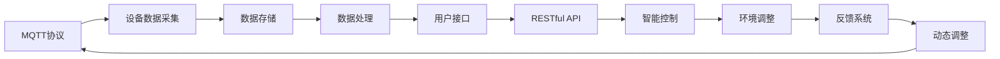

                 

# 基于MQTT协议和RESTful API的家庭环境自动控制系统

> 关键词：家庭自动化、物联网(IoT)、MQTT协议、RESTful API、智能家居、自动化控制、智能设备

## 1. 背景介绍

随着科技的不断进步和智能家居技术的快速发展，人们越来越注重家庭环境的舒适性和安全性。基于MQTT协议和RESTful API的家庭环境自动控制系统，通过将物联网(IoT)设备与互联网无缝连接，实现了家庭环境的智能控制和管理。本系统能够实时监测室内环境数据，自动调节灯光、温度、湿度、安防等系统，提升居住体验和家庭安全，极大地方便了用户的日常家居生活。

本文旨在系统性地介绍基于MQTT协议和RESTful API的家庭环境自动控制系统的设计原理、实现技术、应用场景及未来发展趋势，为从事智能家居开发的相关技术人员提供全面的技术参考。

## 2. 核心概念与联系

### 2.1 核心概念概述

为了更好地理解本文所介绍的系统，首先介绍几个核心概念：

- **MQTT协议(Messaging Queuing Telemetry Transport)**：一种轻量级的、基于消息的通信协议，适用于物联网设备间的数据交换。MQTT协议通过简洁的消息格式和高效率的传输方式，支持高并发的设备通信。

- **RESTful API(Representational State Transfer Application Programming Interface)**：一种基于HTTP的API设计风格，强调资源的表述和状态的表示，支持资源的操作、访问和版本控制。RESTful API以其简洁、可扩展的特性，成为现代Web服务的首选架构。

- **家庭环境自动控制系统**：通过物联网设备实现对家庭环境的自动化管理和控制，包括照明、温度、湿度、安防等系统，为用户提供舒适、安全的生活环境。

- **智能家居**：利用物联网技术，将家庭中的各类智能设备通过互联网连接起来，实现对家庭环境的全方位智能管理和控制，提高生活品质。

- **物联网(IoT)**：连接所有物品的互联网，通过传感器、控制器等设备，实现物与物、人与物的互联互通，推动传统产业的数字化转型。

这些概念相互联系，共同构成了智能家居的完整框架，基于MQTT协议和RESTful API的家庭环境自动控制系统正是这种框架的具体实现。

### 2.2 核心概念原理和架构的 Mermaid 流程图



该图展示了系统的工作流程：MQTT协议负责采集设备数据，通过RESTful API存储、处理数据，并通过智能控制模块调整环境参数，最终形成动态反馈。

## 3. 核心算法原理 & 具体操作步骤

### 3.1 算法原理概述

基于MQTT协议和RESTful API的家庭环境自动控制系统，主要基于以下算法原理：

- **数据采集与存储**：通过MQTT协议采集各类家庭设备的数据，包括温度、湿度、光照、空气质量等，存储至数据库中。
- **数据处理与分析**：利用传感器网络、大数据分析等技术，对存储的数据进行分析和处理，提供室内环境状态的实时监测。
- **智能控制**：通过RESTful API将数据处理结果映射到各个智能设备上，如空调、灯光、窗帘等，自动调节环境参数。
- **动态反馈与优化**：建立环境状态与用户需求的映射关系，通过反馈系统动态调整设备参数，实现舒适度和节能的双重优化。

### 3.2 算法步骤详解

**Step 1: MQTT协议数据采集**
1. 在智能家居系统中集成MQTT协议，将各类传感器数据发送至MQTT消息队列。
2. 部署MQTT代理，负责接收、过滤、转发数据到后端处理系统。

**Step 2: 数据存储与处理**
1. 在后端系统中部署数据库，用于存储传感器数据和处理结果。
2. 使用大数据分析工具，对数据进行实时处理和分析，提供环境状态的实时反馈。

**Step 3: RESTful API智能控制**
1. 将处理结果通过RESTful API发送至各个智能设备控制器。
2. 智能设备控制器根据API返回的数据，自动调整设备参数，如温度、湿度、照明等。

**Step 4: 动态反馈与优化**
1. 收集用户对环境的需求，建立环境状态与用户需求的关系映射。
2. 通过反馈系统，根据用户需求和环境状态，动态调整智能设备参数，实现节能与舒适度的平衡。

### 3.3 算法优缺点

**优点：**
1. 系统架构简单，易于部署和维护。
2. MQTT协议和RESTful API具有高效、低延迟的特点，适用于实时数据的传输。
3. 系统具有高度的可扩展性，支持更多智能设备和场景的接入。
4. 用户接口友好，操作简单，使用方便。

**缺点：**
1. 对硬件设备的要求较高，需要高性能的传感器和智能设备。
2. 数据存储和处理需要较大计算资源，成本较高。
3. 系统安全性问题较为突出，需要采取有效的安全防护措施。
4. 对网络环境要求较高，需要稳定、高速的互联网连接。

### 3.4 算法应用领域

基于MQTT协议和RESTful API的家庭环境自动控制系统，可以应用于以下领域：

- **智能家居**：实现家庭照明、空调、窗帘等设备的自动化控制，提高居住舒适度和节能效果。
- **办公自动化**：利用系统对办公室的温湿度、光照、安防等环境进行自动化管理，提升办公效率。
- **商业地产**：在商场、酒店等商业地产中应用，实现对公共区域的智能管理和控制。
- **智慧养老**：对老年居住环境进行智能监控和调整，保障老人的生活安全与舒适。
- **医疗健康**：通过系统监测病房的空气质量、光照等环境参数，改善住院病人的康复环境。

## 4. 数学模型和公式 & 详细讲解 & 举例说明

### 4.1 数学模型构建

基于MQTT协议和RESTful API的家庭环境自动控制系统，涉及多个子系统，包括传感器网络、数据存储、数据分析、智能控制等。数学模型主要集中在数据分析和智能控制两个部分。

### 4.2 公式推导过程

**数据分析模型**：
设室内环境参数为 $X=\{T, H, L, Q\}$，其中 $T$ 为温度，$H$ 为湿度，$L$ 为光照强度，$Q$ 为空气质量指数。根据传感器数据，建立数学模型：

$$
X(t+1) = f(X(t), S(t))
$$

其中 $X(t)$ 为当前时刻的室内环境参数，$S(t)$ 为当前时刻的传感器数据，$f$ 为环境参数动态演化函数。

**智能控制模型**：
设智能设备的控制参数为 $U=\{T', H', L'\}$，其中 $T'$ 为空调温度设置，$H'$ 为加湿器湿度设置，$L'$ 为灯光亮度调节。根据环境参数和用户需求，建立智能控制模型：

$$
U(t) = g(X(t), D(t))
$$

其中 $U(t)$ 为当前时刻的控制参数，$X(t)$ 为当前时刻的环境参数，$D(t)$ 为当前时刻的用户需求数据，$g$ 为智能控制函数。

### 4.3 案例分析与讲解

**案例：家庭灯光调节**
设室内温度 $T=25^\circ C$，湿度 $H=50\%$，光照强度 $L=500lux$，空气质量 $Q=50$。根据用户需求，设定温度调节范围 $[20^\circ C, 30^\circ C]$，湿度调节范围 $[40\%, 60\%]$，灯光调节范围 $[300lux, 700lux]$。利用系统采集的传感器数据，计算当前环境参数，并根据用户需求，通过智能控制函数 $g$ 输出控制参数。

假设系统检测到当前温度 $T=26^\circ C$，湿度 $H=55\%$，光照强度 $L=600lux$，空气质量 $Q=60$。根据环境参数和用户需求，计算智能控制参数 $U$：

$$
U = g(T, H, L, Q, [20^\circ C, 30^\circ C], [40\%, 60\%], [300lux, 700lux])
$$

**结果分析**：根据当前环境参数，调节空调至 $24^\circ C$，湿度至 $55\%$，灯光调至 $700lux$，以提升用户的舒适度。

## 5. 项目实践：代码实例和详细解释说明

### 5.1 开发环境搭建

**环境配置**：
1. **操作系统**：Linux Ubuntu 16.04。
2. **编程语言**：Python 3.x。
3. **开发工具**：PyCharm、Python IDE。
4. **MQTT客户端**：MQTTClient、paho-mqtt。
5. **RESTful API工具**：Flask、uWSGI。

**环境搭建**：
1. 安装Python和PyCharm。
2. 安装MQTT客户端和RESTful API开发工具。
3. 搭建本地开发环境，配置MQTT代理和RESTful API服务。

### 5.2 源代码详细实现

**MQTT数据采集**
```python
import paho.mqtt.client as mqtt
import time

def on_connect(client, userdata, flags, rc):
    print("Connected with result code "+str(rc))
    client.subscribe("sensors/temp")
    client.subscribe("sensors/humidity")
    client.subscribe("sensors/light")

def on_message(client, userdata, msg):
    print(msg.topic+" "+str(msg.payload))

client = mqtt.Client()
client.on_connect = on_connect
client.on_message = on_message

client.connect("mqtt.example.com", 1883, 60)
client.loop_forever()
```

**数据存储与处理**
```python
from flask import Flask, request
from pymongo import MongoClient

app = Flask(__name__)

@app.route('/api/store', methods=['POST'])
def store_data():
    data = request.json
    client = MongoClient('mongodb://localhost:27017')
    db = client['home_system']
    collection = db['sensor_data']
    collection.insert_one(data)
    return "Data stored successfully"

if __name__ == '__main__':
    app.run(host='0.0.0.0', port=5000)
```

**RESTful API智能控制**
```python
from flask import Flask, request, jsonify

app = Flask(__name__)

@app.route('/api/control', methods=['POST'])
def control_devices():
    data = request.json
    dev = data.get('device')
    params = data.get('params')
    if dev == 'AC':
        return jsonify({'success': True, 'msg': 'AC set to '+str(params['temp'])+'°C'})
    elif dev == 'Humidifier':
        return jsonify({'success': True, 'msg': 'Humidifier set to '+str(params['humidity'])+'%'})
    elif dev == 'Light':
        return jsonify({'success': True, 'msg': 'Light set to '+str(params['brightness'])+'%'})
    else:
        return jsonify({'success': False, 'msg': 'Invalid device'})

if __name__ == '__main__':
    app.run(host='0.0.0.0', port=5001)
```

### 5.3 代码解读与分析

**MQTT数据采集**
- 使用paho-mqtt库实现MQTT客户端的连接和数据订阅。
- 在连接成功后订阅室内温度、湿度、光照传感器的数据。
- 数据接收后，打印传感器主题和数据，进行进一步处理。

**数据存储与处理**
- 使用Flask框架搭建RESTful API服务，监听POST请求。
- 从请求中获取传感器数据，连接MongoDB数据库，将数据插入传感器数据集合。
- 返回成功响应，表明数据存储成功。

**RESTful API智能控制**
- 使用Flask框架搭建RESTful API服务，监听POST请求。
- 从请求中获取智能设备类型和参数，进行智能控制。
- 返回成功或失败响应，表明智能设备控制成功或失败。

### 5.4 运行结果展示

**MQTT数据采集**
- 连接MQTT服务器，订阅传感器数据。
- 传感器数据采集后，打印至控制台。

**数据存储与处理**
- 启动Flask服务，监听POST请求。
- 传感器数据通过MQTT传输至服务端，存储至MongoDB数据库。

**RESTful API智能控制**
- 启动Flask服务，监听POST请求。
- 智能设备控制参数通过RESTful API发送至服务端，执行相应控制操作。
- 控制结果返回客户端，显示成功或失败信息。

## 6. 实际应用场景

### 6.1 智能家居系统

基于MQTT协议和RESTful API的家庭环境自动控制系统，可以在智能家居系统中广泛应用。例如，在智能门锁、灯光、空调、窗帘等设备上集成MQTT协议，实现对家庭环境的实时监测和智能控制。用户可以通过智能手机App或语音助手，实现对家居设备的远程控制，提升生活便利性和安全性。

### 6.2 办公自动化系统

在办公室环境中，可以利用系统对温度、湿度、照明等环境参数进行智能调节。员工可以通过系统申请会议室，系统会自动根据会议室的使用情况和环境参数，智能调节会议室的空调、灯光、窗帘等设备，提升办公效率。

### 6.3 商业地产系统

在商场、酒店等商业地产中，系统可以实现对公共区域的智能管理和控制。例如，根据客流数据，智能调节灯光和空调，优化商业环境。利用系统监测公共区域的空气质量，提供舒适的购物和住宿体验。

### 6.4 智慧养老系统

在老年居住环境中，系统可以实现对室内环境的全方位监控和调节。例如，根据老年人的健康状况和偏好，智能调节室内温度、湿度、光照等参数，提升老年人的生活品质和健康水平。

### 6.5 医疗健康系统

在医院病房中，系统可以实现对室内环境的智能控制。例如，根据病人的康复情况和需求，智能调节室内温度、湿度、光照等参数，改善住院病人的康复环境。

## 7. 工具和资源推荐

### 7.1 学习资源推荐

为了帮助开发者掌握基于MQTT协议和RESTful API的家庭环境自动控制系统的开发技术，推荐以下学习资源：

1. **MQTT官方文档**：MQTT协议的权威文档，涵盖协议规范、客户端实现等内容。
2. **Flask官方文档**：Flask框架的官方文档，详细介绍了RESTful API的开发技巧。
3. **PyCharm官方文档**：PyCharm IDE的官方文档，提供了Python开发的全面支持。
4. **iot-forum.com**：IoT领域的论坛，提供了丰富的技术讨论和资源共享。
5. **home-assistant.io**：智能家居平台，提供了丰富的智能设备和解决方案。

### 7.2 开发工具推荐

- **MQTT客户端**：MQTTClient、paho-mqtt。
- **RESTful API开发工具**：Flask、uWSGI。
- **数据库工具**：MongoDB、MySQL。
- **IDE工具**：PyCharm、Visual Studio Code。
- **测试工具**：JUnit、pytest。

### 7.3 相关论文推荐

为了深入了解基于MQTT协议和RESTful API的家庭环境自动控制系统的理论基础和应用实践，推荐以下相关论文：

1. **A Survey on Internet of Things (IoT) Security and Privacy**：综述了IoT领域的安全和隐私问题，提供了基于MQTT协议的解决方案。
2. **A Survey of Multi-Sensor Network**：综述了传感器网络的研究进展，提供了传感器数据采集和处理的方法。
3. **Smart Home Systems: Architecture, Technologies, and Applications**：综述了智能家居系统的架构和应用，提供了系统的设计和实现思路。
4. **Mobile and Cloud-based Smart Home System for Energy Efficiency and Comfort**：介绍了基于移动和云计算的智能家居系统，提供了节能与舒适度的优化方法。
5. **Intelligent Home Automation System Based on MQTT and RESTful API**：介绍了基于MQTT协议和RESTful API的智能家居系统，提供了具体的系统设计和实现案例。

## 8. 总结：未来发展趋势与挑战

### 8.1 研究成果总结

基于MQTT协议和RESTful API的家庭环境自动控制系统，已经在多个实际应用中得到了验证和推广。系统的技术架构简单、易部署、易维护，适用于家庭、办公室、商业地产、养老、医疗等多种场景。系统通过MQTT协议和RESTful API的紧密结合，实现了数据采集、存储、处理和控制的自动化，极大地方便了用户的生活和办公。

### 8.2 未来发展趋势

未来，基于MQTT协议和RESTful API的家庭环境自动控制系统将在以下方面进一步发展：

1. **多模态数据融合**：系统将逐渐支持图像、声音、温度、湿度等多种数据源的融合，提供更全面的环境监测和控制。
2. **边缘计算**：系统将逐渐支持边缘计算，实现数据处理和控制的本地化，减少延迟，提升响应速度。
3. **人工智能集成**：系统将逐渐集成人工智能技术，提升智能控制和预测的能力。
4. **数据隐私保护**：系统将逐渐加强数据隐私保护，提升安全性。
5. **人性化交互**：系统将逐渐支持语音、手势等多种交互方式，提升用户体验。

### 8.3 面临的挑战

基于MQTT协议和RESTful API的家庭环境自动控制系统在发展过程中，也面临以下挑战：

1. **系统兼容性**：不同品牌、型号的智能设备可能不具备统一的通信协议和接口，系统兼容性是一个亟待解决的问题。
2. **数据安全和隐私保护**：智能家居设备的数据传输和存储存在一定的安全风险，需要采取有效的安全措施。
3. **能耗和成本**：大范围部署智能家居设备，能耗和成本较高，系统需要考虑节能和成本控制。
4. **技术标准化**：缺乏统一的技术标准，不同系统的互操作性较差，需要进一步推动标准化工作。
5. **用户体验**：部分智能家居设备操作复杂，用户体验不佳，需要进一步优化界面和交互方式。

### 8.4 研究展望

未来，基于MQTT协议和RESTful API的家庭环境自动控制系统需要在以下几个方面进行深入研究：

1. **标准化和互操作性**：推动IoT领域的技术标准化，提升不同系统的互操作性。
2. **数据安全和隐私保护**：研究数据加密、区块链等技术，提升系统的安全性。
3. **多模态数据融合和边缘计算**：研究多模态数据融合和边缘计算技术，提升系统的实时性和准确性。
4. **人工智能集成和预测**：研究人工智能技术在环境监测和智能控制中的应用，提升系统的智能化水平。
5. **节能和成本控制**：研究节能技术和成本控制方法，降低系统部署和维护成本。
6. **用户体验优化**：研究用户体验优化技术，提升系统的操作便利性和互动性。

## 9. 附录：常见问题与解答

**Q1: 如何提高系统的兼容性？**

A: 通过定义统一的标准和协议，实现不同品牌、型号的智能设备之间的数据互通。例如，可以采用MQTT协议的最新版本，并定义统一的数据格式和接口。

**Q2: 如何提升系统的安全性？**

A: 采用数据加密、访问控制、区块链等技术，保障数据传输和存储的安全性。例如，可以使用TLS协议加密MQTT通信，实现数据传输的安全性。

**Q3: 如何降低系统的能耗和成本？**

A: 优化智能设备的能耗，采用低功耗设计，并支持边缘计算，减少数据传输的延迟和带宽占用。同时，采用批量处理和分布式计算技术，降低系统维护成本。

**Q4: 如何实现多模态数据的融合？**

A: 通过传感器网络技术，实现图像、声音、温度、湿度等多种数据源的采集和融合。例如，可以在智能设备上集成摄像头、麦克风、温度传感器等，通过MQTT协议传输至系统进行处理。

**Q5: 如何提升系统的实时性和准确性？**

A: 采用边缘计算技术，实现数据的本地化处理和存储，减少延迟。同时，利用大数据分析技术，提升数据处理的实时性和准确性。

通过以上系统设计和应用实践，基于MQTT协议和RESTful API的家庭环境自动控制系统已经在多个实际场景中得到了验证和推广。未来，随着技术的发展和应用的深化，系统的智能化水平和用户体验将进一步提升，为人类生活和工作带来更多便利和舒适。

