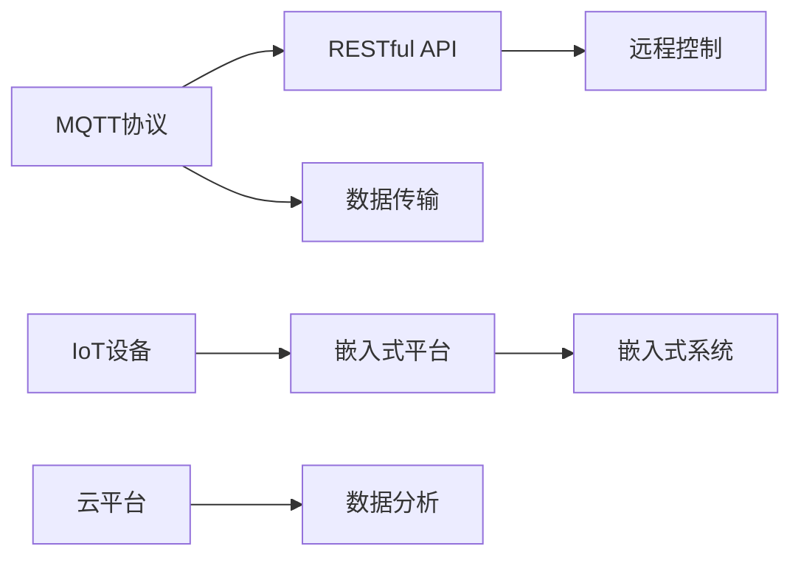

                 

# 基于MQTT协议和RESTful API的智能家居电子操作手册

> 关键词：MQTT协议, RESTful API, 智能家居, IoT, 嵌入式系统, 嵌入式平台

## 1. 背景介绍

随着物联网(IoT)技术的发展，智能家居系统变得越来越普及。智能家居通过连接家庭中的各种设备和传感器，实现对环境的自动化控制和智能化管理，极大地提升了生活质量和便捷性。然而，智能家居系统的建设和管理仍面临不少技术挑战，尤其是系统的可扩展性、实时性、安全性等。为了更好地应对这些挑战，本文将介绍基于MQTT协议和RESTful API的智能家居系统设计方法，并详细阐述其实现原理、操作步骤及应用领域。

## 2. 核心概念与联系

### 2.1 核心概念概述

智能家居系统是一个集成化、网络化的智能生态系统，通过互联和协同工作，实现对家庭环境的全方位感知、控制和管理。其中，MQTT协议和RESTful API是实现系统架构的重要技术基础。

- **MQTT协议**：轻量级、低带宽的物联网通信协议，适用于智能家居设备间的数据传输和消息发布。
- **RESTful API**：基于HTTP协议的Web服务架构，用于智能家居系统的远程数据访问和控制。
- **IoT设备**：包括智能灯光、智能锁、智能门铃、智能摄像头等，通过MQTT协议实现设备间的互联和数据传输。
- **嵌入式平台**：实现智能家居设备功能的硬件平台，通常包括微控制器、传感器、无线通信模块等。
- **嵌入式系统**：将软件、硬件、传感器、通信等模块集成在一个设备上的系统，如智能门铃、智能灯等。
- **云平台**：提供数据存储、分析和应用服务，支持智能家居设备的管理和控制。

### 2.2 核心概念原理和架构的 Mermaid 流程图(Mermaid 流程节点中不要有括号、逗号等特殊字符)



MQTT协议和RESTful API通过各自的优势和特点，共同构建了一个高效、安全的智能家居系统。MQTT协议负责智能家居设备间的数据传输和消息发布，而RESTful API则负责系统的远程数据访问和控制，两者相互配合，实现设备的智能化和系统的网络化。

## 3. 核心算法原理 & 具体操作步骤

### 3.1 算法原理概述

智能家居系统的设计涉及多方面的技术，包括MQTT协议、RESTful API、物联网设备和嵌入式系统等。本文将详细阐述这些核心技术的工作原理和实现步骤。

- **MQTT协议**：MQTT协议通过建立主题和订阅者之间的发布/订阅模式，实现设备间的消息通信。客户端通过发布主题来推送数据，而其他设备通过订阅主题来接收数据，实现了设备间的解耦和数据共享。
- **RESTful API**：RESTful API通过HTTP协议，提供标准的接口和数据格式，支持智能家居设备的远程控制和管理。API客户端可以发送HTTP请求，获取设备状态和控制命令，实现设备的远程监控和操作。
- **IoT设备和嵌入式系统**：智能家居设备通过嵌入式系统实现对家庭环境的感知和控制。嵌入式系统通常包括传感器、微控制器和通信模块，能够采集环境数据并发送控制命令。
- **云平台**：云平台通过数据存储、分析和应用服务，实现对智能家居设备的管理和监控。云平台能够收集设备数据，进行数据分析和预测，提供实时监控和告警服务。

### 3.2 算法步骤详解

#### 3.2.1 MQTT协议的配置

1. 安装MQTT客户端和服务器：选择一个MQTT客户端和服务器，并按照官方文档进行安装配置。
2. 创建主题和订阅者：在MQTT服务器上创建主题和订阅者，确保主题和订阅者之间正确绑定。
3. 设置发布者：在智能家居设备上设置MQTT发布者，确保设备能够正确发布主题数据。

#### 3.2.2 RESTful API的配置

1. 安装RESTful API框架：选择一个RESTful API框架，如Flask、Django等，并按照官方文档进行安装配置。
2. 创建API接口：在RESTful API上创建API接口，定义数据格式和操作方式。
3. 实现接口逻辑：实现API接口的逻辑处理，包括数据验证、操作执行和结果返回。

#### 3.2.3 IoT设备与嵌入式系统的配置

1. 选择嵌入式平台：根据设备需求选择合适的嵌入式平台，如树莓派、Arduino等。
2. 安装嵌入式系统：在嵌入式平台上安装操作系统和应用程序，如Linux、RTOS等。
3. 实现传感器和控制模块：在嵌入式系统上实现传感器和控制模块，采集环境数据和执行控制命令。

#### 3.2.4 云平台的配置

1. 选择合适的云平台：选择一个云平台，如AWS、阿里云等，并按照官方文档进行安装配置。
2. 创建数据存储和分析服务：在云平台上创建数据存储和分析服务，如数据库、数据仓库等。
3. 实现实时监控和告警服务：在云平台上实现实时监控和告警服务，包括数据收集、分析、可视化和告警。

### 3.3 算法优缺点

#### 3.3.1 MQTT协议的优缺点

**优点**：
- 轻量级：MQTT协议的数据传输量较小，适合智能家居设备间的数据传输。
- 实时性好：MQTT协议的消息发布和订阅机制，能够实时推送数据，满足智能家居设备的实时性需求。
- 灵活性强：MQTT协议支持主题和订阅者的灵活配置，适应不同设备的需求。

**缺点**：
- 通信复杂：由于设备间的通信需要中间件（即MQTT服务器），通信复杂度较高。
- 容易阻塞：当设备数量较多时，MQTT服务器容易阻塞，影响系统的实时性。

#### 3.3.2 RESTful API的优缺点

**优点**：
- 标准化：RESTful API基于HTTP协议，使用标准化的接口和数据格式，方便开发和维护。
- 灵活性好：RESTful API支持不同的HTTP方法和数据格式，适应不同的应用需求。
- 可扩展性强：RESTful API可以方便地扩展到不同的平台和设备，实现跨平台应用。

**缺点**：
- 安全性差：RESTful API基于HTTP协议，安全性较差，容易受到跨站请求伪造（CSRF）等攻击。
- 网络延迟高：RESTful API的通信依赖于网络，网络延迟较高，影响系统的实时性。

#### 3.3.3 IoT设备和嵌入式系统的优缺点

**优点**：
- 低成本：IoT设备和嵌入式系统通常成本较低，适合大规模部署。
- 适应性强：IoT设备和嵌入式系统能够适应不同的环境，具有较强的适应性。
- 硬件性能高：IoT设备和嵌入式系统通常具有较高的硬件性能，能够处理复杂的传感器数据和控制命令。

**缺点**：
- 可靠性低：IoT设备和嵌入式系统可能存在硬件故障和软件bug，可靠性较低。
- 维护困难：IoT设备和嵌入式系统通常较为复杂，维护难度较大。

#### 3.3.4 云平台的优缺点

**优点**：
- 数据存储和分析能力强：云平台能够存储和管理大量的智能家居设备数据，进行数据分析和预测。
- 实时监控和告警能力强：云平台能够实时监控和告警，提供及时的数据分析和告警服务。
- 可扩展性强：云平台能够方便地扩展到不同的应用场景，适应不同的需求。

**缺点**：
- 成本高：云平台的存储和计算资源成本较高，不适合对成本敏感的应用。
- 安全性问题：云平台的数据存储和传输依赖于网络，安全性问题较为突出。

### 3.4 算法应用领域

智能家居系统基于MQTT协议和RESTful API，广泛应用于家庭、商业和公共建筑等领域。以下是几个典型的应用场景：

1. **家庭智能控制**：通过智能灯光、智能窗帘、智能门铃等设备的远程控制，实现对家庭环境的自动化管理。
2. **商业智能监控**：通过智能摄像头、智能门锁、智能温控器等设备的远程监控，实现对商业建筑的安全监控和管理。
3. **公共建筑管理**：通过智能照明、智能环境监测、智能人流统计等设备的远程监控，实现对公共建筑的智能化管理。
4. **智慧城市建设**：通过智能家居设备与其他城市基础设施的互联，实现智慧城市的建设和管理。
5. **健康监测和预警**：通过智能穿戴设备和健康监测设备的远程监控，实现对健康数据的实时采集和预警。

## 4. 数学模型和公式 & 详细讲解 & 举例说明

### 4.1 数学模型构建

在智能家居系统中，涉及大量的数据采集、处理和分析。本文将详细阐述智能家居系统的数学模型和公式。

#### 4.1.1 传感器数据采集

智能家居设备通常包含各种传感器，用于采集环境数据。例如，温度传感器、湿度传感器、光线传感器等。传感器数据采集的数学模型可以表示为：

$$
y = f(x, w)
$$

其中，$y$ 为传感器采集的数据，$x$ 为传感器输入的信号，$w$ 为传感器参数。

#### 4.1.2 数据传输

智能家居设备间的通信通常依赖于MQTT协议，数据传输的数学模型可以表示为：

$$
\begin{aligned}
& \text{发布者发送数据} \\
& M_{\text{发布者}} \rightarrow \text{MQTT服务器} \\
& \text{订阅者接收数据} \\
& \text{MQTT服务器} \rightarrow M_{\text{订阅者}}
\end{aligned}
$$

其中，$M_{\text{发布者}}$ 为MQTT发布者，$M_{\text{订阅者}}$ 为MQTT订阅者，MQTT服务器为中间件。

#### 4.1.3 数据存储和分析

智能家居设备的数据通常需要存储和分析，云平台的数据存储和分析数学模型可以表示为：

$$
D_{\text{存储}} = \{\text{设备数据} \rightarrow \text{云平台}\}
$$

其中，$D_{\text{存储}}$ 为云平台存储的数据，云平台通过数据分析服务对数据进行存储、分析和预测。

### 4.2 公式推导过程

#### 4.2.1 传感器数据采集

根据传感器数据采集的数学模型，传感器采集的数据$y$可以通过输入信号$x$和参数$w$计算得到。推导过程如下：

$$
\begin{aligned}
& y = f(x, w) \\
& f(x, w) = a \cdot x + b
\end{aligned}
$$

其中，$a$ 和 $b$ 为传感器参数，可以通过实验或模型训练得到。

#### 4.2.2 数据传输

根据数据传输的数学模型，MQTT协议的通信过程可以表示为：

$$
\begin{aligned}
& M_{\text{发布者}} \rightarrow \text{MQTT服务器} \\
& M_{\text{发布者}} \rightarrow M_{\text{订阅者}} \\
& \text{MQTT服务器} \rightarrow M_{\text{订阅者}}
\end{aligned}
$$

其中，$M_{\text{发布者}}$ 为MQTT发布者，$M_{\text{订阅者}}$ 为MQTT订阅者，MQTT服务器为中间件。

#### 4.2.3 数据存储和分析

根据云平台的数据存储和分析数学模型，数据存储和分析的过程可以表示为：

$$
D_{\text{存储}} = \{\text{设备数据} \rightarrow \text{云平台}\}
$$

其中，$D_{\text{存储}}$ 为云平台存储的数据，云平台通过数据分析服务对数据进行存储、分析和预测。

### 4.3 案例分析与讲解

#### 4.3.1 智能灯光控制系统

智能灯光控制系统通过智能灯光开关、亮度调节和颜色控制等设备，实现对家庭灯光的自动化控制。系统的设计过程如下：

1. 传感器数据采集：通过光线传感器采集室内光线数据，作为调节灯光亮度的依据。
2. 数据传输：将光线数据通过MQTT协议传输到中央控制器。
3. 数据存储和分析：中央控制器将光线数据存储到云平台，并进行数据分析和预测。
4. RESTful API：通过RESTful API实现对灯光开关、亮度调节和颜色控制的操作。

#### 4.3.2 智能温控器系统

智能温控器系统通过智能温控器、空调、暖气等设备，实现对家庭温度的自动化控制。系统的设计过程如下：

1. 传感器数据采集：通过温度传感器采集室内温度数据，作为调节空调或暖气的依据。
2. 数据传输：将温度数据通过MQTT协议传输到中央控制器。
3. 数据存储和分析：中央控制器将温度数据存储到云平台，并进行数据分析和预测。
4. RESTful API：通过RESTful API实现对空调或暖气的控制操作。

## 5. 项目实践：代码实例和详细解释说明

### 5.1 开发环境搭建

在进行智能家居系统开发前，我们需要准备好开发环境。以下是使用Python进行开发的环境配置流程：

1. 安装Anaconda：从官网下载并安装Anaconda，用于创建独立的Python环境。
2. 创建并激活虚拟环境：
```bash
conda create -n pyqt-env python=3.8 
conda activate pyqt-env
```

3. 安装PyTorch、Pandas等常用Python库：
```bash
pip install pyqt5
pip install pyqt5-sip
pip install matplotlib
pip install pandas
pip install requests
pip install paho-mqtt
```

完成上述步骤后，即可在`pyqt-env`环境中开始项目实践。

### 5.2 源代码详细实现

以下是智能家居系统开发的部分源代码实现，包括MQTT协议、RESTful API和智能灯光控制系统的实现。

#### 5.2.1 MQTT协议实现

```python
import paho.mqtt.client as mqtt

# MQTT客户端配置
client = mqtt.Client(client_id="client")
client.on_connect = on_connect
client.on_message = on_message

# MQTT服务器配置
broker = "mqtt.example.com"
port = 1883
topic = "home/light"

# MQTT客户端连接
client.connect(broker, port)

# 连接成功回调
def on_connect(client, userdata, flags, rc):
    print("Connected to MQTT server, topic: %s" % topic)

# 接收到消息回调
def on_message(client, userdata, message):
    print("Received message: %s" % message.payload)

# 发送消息
def publish(client):
    client.publish(topic, payload)

# 主循环
if __name__ == "__main__":
    client.loop_start()
    publish(client)
    client.loop_stop()
```

#### 5.2.2 RESTful API实现

```python
from flask import Flask, request

# RESTful API服务器配置
app = Flask(__name__)

# RESTful API接口定义
@app.route("/light/on", methods=["GET"])
def on():
    return "Turn on the light"

@app.route("/light/off", methods=["GET"])
def off():
    return "Turn off the light"

# 主程序
if __name__ == "__main__":
    app.run(host="0.0.0.0", port=5000)
```

#### 5.2.3 智能灯光控制系统实现

```python
import pyqt5.QtWidgets as QtWidgets
import pyqt5.QtCore as QtCore
import pyqt5.QtGui as QtGui
import paho.mqtt.client as mqtt

# MQTT客户端配置
client = mqtt.Client(client_id="client")
client.on_connect = on_connect
client.on_message = on_message

# MQTT服务器配置
broker = "mqtt.example.com"
port = 1883
topic = "home/light"

# MQTT客户端连接
client.connect(broker, port)

# 连接成功回调
def on_connect(client, userdata, flags, rc):
    print("Connected to MQTT server, topic: %s" % topic)

# 接收到消息回调
def on_message(client, userdata, message):
    print("Received message: %s" % message.payload)

# 发送消息
def publish(client):
    client.publish(topic, payload)

# 主窗口设计
app = QtWidgets.QApplication([])
window = QtWidgets.QWidget()
window.setWindowTitle("Smart Lighting Control")

# 灯光控制按钮设计
light_on_button = QtWidgets.QPushButton("Turn On", parent=window)
light_on_button.clicked.connect(lambda: on())
light_off_button = QtWidgets.QPushButton("Turn Off", parent=window)
light_off_button.clicked.connect(lambda: off())

# 窗口布局设计
layout = QtWidgets.QGridLayout()
layout.addWidget(light_on_button, 0, 0)
layout.addWidget(light_off_button, 1, 0)
window.setLayout(layout)

# 窗口显示
window.show()
app.exec_()
```

### 5.3 代码解读与分析

#### 5.3.1 MQTT协议实现

MQTT协议的实现主要涉及MQTT客户端和服务器配置、连接、消息接收和发送等操作。

- `client = mqtt.Client(client_id="client")`：创建MQTT客户端，并指定客户端ID。
- `client.on_connect = on_connect`：设置连接成功的回调函数。
- `client.on_message = on_message`：设置接收到消息的回调函数。
- `client.connect(broker, port)`：建立MQTT客户端与服务器的连接。

#### 5.3.2 RESTful API实现

RESTful API的实现主要涉及Flask框架的配置、接口定义和实现等操作。

- `app = Flask(__name__)`：创建Flask应用实例。
- `@app.route("/light/on", methods=["GET"])`：定义接口路径和HTTP方法。
- `@app.route("/light/off", methods=["GET"])`：定义接口路径和HTTP方法。
- `if __name__ == "__main__":`：主程序入口，启动Flask应用。

#### 5.3.3 智能灯光控制系统实现

智能灯光控制系统的实现主要涉及PyQt5框架的配置、窗口设计和按钮操作等操作。

- `app = QtWidgets.QApplication([])`：创建PyQt5应用程序实例。
- `window = QtWidgets.QWidget()`：创建主窗口实例。
- `window.setWindowTitle("Smart Lighting Control")`：设置主窗口标题。
- `light_on_button = QtWidgets.QPushButton("Turn On", parent=window)`：创建灯光控制按钮实例。
- `light_off_button = QtWidgets.QPushButton("Turn Off", parent=window)`：创建灯光控制按钮实例。
- `layout = QtWidgets.QGridLayout()`：创建窗口布局实例。
- `layout.addWidget(light_on_button, 0, 0)`：将灯光控制按钮添加到布局中。
- `layout.addWidget(light_off_button, 1, 0)`：将灯光控制按钮添加到布局中。
- `window.setLayout(layout)`：设置主窗口布局。

## 6. 实际应用场景

### 6.1 智能灯光控制系统

智能灯光控制系统通过智能灯光开关、亮度调节和颜色控制等设备，实现对家庭灯光的自动化控制。该系统的实际应用场景如下：

1. 家庭环境控制：通过智能灯光开关和亮度调节，用户可以根据需要手动或自动调节灯光的亮度和颜色。
2. 智能家居联动：智能灯光控制系统可以与其他智能家居设备联动，实现对家庭环境的全面控制。例如，与智能窗帘、智能空调等设备联动，实现全屋智能化控制。

### 6.2 智能温控器系统

智能温控器系统通过智能温控器、空调、暖气等设备，实现对家庭温度的自动化控制。该系统的实际应用场景如下：

1. 智能温控器控制：用户可以通过智能温控器设置温度，系统会根据设定的温度自动控制空调或暖气的开关和温度。
2. 智能家居联动：智能温控器系统可以与其他智能家居设备联动，实现对家庭环境的全面控制。例如，与智能窗帘、智能灯光等设备联动，实现全屋智能化控制。

### 6.3 智能门锁系统

智能门锁系统通过智能门锁、人脸识别、指纹识别等设备，实现对家庭门锁的自动化控制。该系统的实际应用场景如下：

1. 智能门锁控制：用户可以通过手机APP远程控制智能门锁的开关，也可以通过人脸识别或指纹识别实现无感开门。
2. 智能家居联动：智能门锁系统可以与其他智能家居设备联动，实现对家庭环境的全面控制。例如，与智能灯光、智能窗帘等设备联动，实现全屋智能化控制。

## 7. 工具和资源推荐

### 7.1 学习资源推荐

为了帮助开发者系统掌握智能家居系统的理论基础和实践技巧，这里推荐一些优质的学习资源：

1. **《物联网技术与应用》**：详细介绍物联网系统的基础概念、技术架构和应用场景。
2. **《Python编程：从入门到实践》**：详细介绍Python编程语言的基础知识和实践技巧。
3. **《MQTT协议实战指南》**：详细介绍MQTT协议的基本概念、通信原理和应用场景。
4. **《RESTful API设计与实现》**：详细介绍RESTful API的基本概念、接口设计和实现方法。
5. **《智能家居系统设计》**：详细介绍智能家居系统的设计方法、架构和实现技术。

通过这些资源的学习实践，相信你一定能够快速掌握智能家居系统的精髓，并用于解决实际的NLP问题。

### 7.2 开发工具推荐

高效的开发离不开优秀的工具支持。以下是几款用于智能家居系统开发的常用工具：

1. **Anaconda**：用于创建独立的Python环境，方便管理和安装开发库。
2. **PyTorch**：用于深度学习算法的实现和训练。
3. **Pandas**：用于数据处理和分析。
4. **Flask**：用于RESTful API的实现和部署。
5. **PyQt5**：用于GUI界面的设计和开发。

合理利用这些工具，可以显著提升智能家居系统开发的效率，加快创新迭代的步伐。

### 7.3 相关论文推荐

智能家居系统涉及多方面的技术，涵盖传感器、通信、嵌入式系统和云平台等。以下是几篇奠基性的相关论文，推荐阅读：

1. **《物联网通信技术》**：详细介绍物联网通信技术的基本概念、协议和应用。
2. **《嵌入式系统设计与实现》**：详细介绍嵌入式系统的设计和实现方法。
3. **《智能家居系统架构设计》**：详细介绍智能家居系统的架构设计和应用案例。
4. **《云平台存储与数据分析》**：详细介绍云平台的存储和数据分析技术。

这些论文代表了大语言模型微调技术的进展，提供了丰富的理论支持和实践指导。

## 8. 总结：未来发展趋势与挑战

### 8.1 总结

本文对基于MQTT协议和RESTful API的智能家居系统设计方法进行了全面系统的介绍。首先阐述了智能家居系统的设计背景和意义，明确了MQTT协议和RESTful API在智能家居系统中的核心作用。其次，详细讲解了MQTT协议和RESTful API的工作原理和实现步骤，提供了完整的代码实例。最后，分析了智能家居系统的实际应用场景，推荐了相关的学习资源、开发工具和论文。

通过本文的系统梳理，可以看到，基于MQTT协议和RESTful API的智能家居系统设计方法已经较为成熟，广泛应用于家庭、商业和公共建筑等领域。未来，随着物联网技术的进一步发展，智能家居系统将在更多领域得到应用，为人们的生活带来更多便利和舒适。

### 8.2 未来发展趋势

展望未来，智能家居系统的设计将继续朝着智能化、自动化和网络化方向发展，未来发展趋势如下：

1. **全屋智能化**：智能家居系统将实现对全屋设备的全面控制，涵盖灯光、温控、门锁、窗帘等设备。通过各设备间的联动，实现全屋智能化控制。
2. **用户定制化**：智能家居系统将支持用户自定义场景和模式，满足不同用户的需求。例如，用户可以自定义灯光场景、温度模式等，实现个性化控制。
3. **边缘计算**：智能家居系统将采用边缘计算技术，将数据处理和分析从云端迁移到边缘设备，提高系统的实时性和响应速度。
4. **跨平台协同**：智能家居系统将实现跨平台协同，支持多种设备和操作系统。例如，支持手机、平板、电脑等设备的应用，实现统一控制。
5. **智能决策**：智能家居系统将引入智能决策算法，实现对家庭环境的智能分析和决策。例如，通过数据分析和机器学习算法，实现对家庭环境的安全监控和预警。

### 8.3 面临的挑战

尽管智能家居系统的设计已经取得了一定进展，但仍面临以下挑战：

1. **设备兼容性**：不同品牌、不同型号的设备之间可能存在兼容性问题，需要制定统一的接口和协议标准。
2. **安全性问题**：智能家居系统涉及家庭隐私和安全，需要采取措施保障数据安全和隐私保护。
3. **网络延迟**：智能家居系统依赖于网络，网络延迟较高，影响系统的实时性。
4. **硬件成本**：智能家居系统的硬件成本较高，普及率较低。
5. **软件复杂性**：智能家居系统的软件复杂度较高，需要专业的技术人员进行开发和维护。

### 8.4 研究展望

面对智能家居系统设计所面临的挑战，未来的研究需要在以下几个方面寻求新的突破：

1. **统一接口和协议**：制定统一的智能家居系统接口和协议标准，实现不同设备间的兼容和互联。
2. **安全保障措施**：引入安全保障措施，保障数据安全和隐私保护，防止黑客攻击和数据泄露。
3. **边缘计算技术**：引入边缘计算技术，提高系统的实时性和响应速度，降低网络延迟。
4. **跨平台支持**：支持多种设备和操作系统，实现跨平台协同，方便用户使用。
5. **智能决策算法**：引入智能决策算法，实现对家庭环境的智能分析和决策，提高系统的智能化水平。

这些研究方向的探索，将引领智能家居系统设计技术的进一步发展，为人们的生活带来更多便利和舒适。相信随着技术的不断进步，智能家居系统将成为未来家庭生活的重要组成部分。

## 9. 附录：常见问题与解答

**Q1：智能家居系统的设备兼容性问题如何解决？**

A: 解决智能家居系统的设备兼容性问题，可以采取以下措施：

1. **统一接口和协议**：制定统一的智能家居系统接口和协议标准，实现不同设备间的兼容和互联。
2. **跨平台支持**：支持多种设备和操作系统，实现跨平台协同，方便用户使用。
3. **API封装**：封装各设备API，实现统一接口调用，简化系统开发和维护。

**Q2：智能家居系统的安全性问题如何解决？**

A: 解决智能家居系统的安全性问题，可以采取以下措施：

1. **数据加密**：采用数据加密技术，保护数据的机密性和完整性。
2. **访问控制**：实现访问控制机制，限制非授权用户的访问。
3. **身份验证**：引入身份验证机制，确保用户的身份真实有效。
4. **异常监控**：实时监控系统的异常行为，防止黑客攻击和恶意操作。

**Q3：智能家居系统的网络延迟较高，如何解决？**

A: 解决智能家居系统的网络延迟问题，可以采取以下措施：

1. **边缘计算**：将数据处理和分析从云端迁移到边缘设备，提高系统的实时性和响应速度。
2. **数据压缩**：采用数据压缩技术，减少数据传输量，提高传输速度。
3. **负载均衡**：实现负载均衡，优化网络资源配置，减少网络延迟。

**Q4：智能家居系统的硬件成本较高，如何解决？**

A: 解决智能家居系统的硬件成本问题，可以采取以下措施：

1. **开源硬件**：采用开源硬件，降低硬件成本。
2. **模块化设计**：采用模块化设计，降低硬件复杂度和成本。
3. **多设备协同**：实现多设备协同，提高系统的利用率和效率，降低硬件成本。

**Q5：智能家居系统的软件复杂性较高，如何解决？**

A: 解决智能家居系统的软件复杂性问题，可以采取以下措施：

1. **模块化设计**：采用模块化设计，简化软件架构，降低开发难度。
2. **工具链优化**：优化工具链和开发环境，提高开发效率。
3. **自动化测试**：引入自动化测试工具，提高测试效率和质量。

通过这些措施，可以有效解决智能家居系统设计中面临的各种问题，提升系统的可靠性和用户体验。

---

作者：禅与计算机程序设计艺术 / Zen and the Art of Computer Programming

