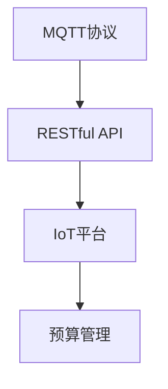

                 

# 基于MQTT协议和RESTful API的智能家居预算管理模块

> 关键词：MQTT协议, RESTful API, 智能家居, 预算管理, IoT平台

## 1. 背景介绍

### 1.1 问题由来
在现代智能家居系统中，智能设备的普及和互联互通已经成为了人们生活中不可或缺的一部分。然而，智能设备的广泛应用也带来了新的问题——如何管理这些设备产生的费用。智能家居预算管理模块，通过连接物联网设备，实时收集和分析各类能源消耗数据，结合用户设定的预算限额，自动控制设备开启和关闭，从而实现节能减排和智能管理。

### 1.2 问题核心关键点
本模块的核心是利用MQTT协议和RESTful API技术，构建一个集成了物联网设备和预算管理系统的智能家居平台。具体包括：

- MQTT协议：一种轻量级的通信协议，适合在物联网设备之间进行高效数据传输。
- RESTful API：一种基于HTTP协议的API设计风格，支持快速构建和扩展的Web服务接口。
- IoT平台：一个集成了各种智能设备的互联网系统，提供了设备接入和数据交换的基础。
- 预算管理：一种基于设定预算，通过控制设备开启/关闭的策略，实现能源节省和费用控制。

通过整合这些关键技术，本模块可以实现智能家居设备的统一管理和费用预算的精细化控制，大大提升家居生活的便捷性和智能化程度。

### 1.3 问题研究意义
本模块的研究具有重要意义：

- 提升用户生活质量：通过智能化的预算管理，用户可以更加便捷地控制和了解家庭能耗，优化生活习惯。
- 推动节能减排：实现家庭能源的智能化管理，有效降低能源浪费，支持环保事业。
- 拓展物联网应用：本模块可以作为智能家居平台的核心组件，支撑更多物联网设备的接入和数据交换。
- 促进技术融合：将MQTT协议和RESTful API技术深度融合，为物联网领域的技术创新提供参考。

## 2. 核心概念与联系

### 2.1 核心概念概述

为更好地理解基于MQTT协议和RESTful API的智能家居预算管理模块，本节将介绍几个密切相关的核心概念：

- MQTT协议（Message Queuing Telemetry Transport Protocol）：一种轻量级、高可靠性的发布/订阅消息协议，支持设备间的小数据量通信。
- RESTful API（Representational State Transfer）：一种设计风格，采用HTTP协议，通过资源的概念抽象，构建出可扩展的Web服务接口。
- IoT平台（Internet of Things Platform）：集成各类智能设备的互联网系统，提供统一的数据管理和设备管理。
- 预算管理：通过设定预算限制，自动控制设备运行，优化能耗管理，减少家庭支出。

这些核心概念之间的逻辑关系可以通过以下Mermaid流程图来展示：



这个流程图展示了大语言模型的核心概念及其之间的关系：

1. MQTT协议用于物联网设备之间的数据传输。
2. RESTful API为IoT平台提供了数据访问和控制接口。
3. IoT平台提供了设备接入和数据交换的基础。
4. 预算管理是本模块的核心功能，通过策略控制设备运行。

这些核心概念共同构成了智能家居预算管理模块的基本框架，使其能够在物联网领域中发挥重要作用。

## 3. 核心算法原理 & 具体操作步骤
### 3.1 算法原理概述

基于MQTT协议和RESTful API的智能家居预算管理模块，本质上是一个将MQTT数据流与RESTful API接口进行结合，实现设备管理与预算控制的系统。其核心思想是：

1. 使用MQTT协议在智能家居设备间建立双向通信通道，实时传输设备运行状态数据。
2. 通过RESTful API接口，将设备数据接入到预算管理系统，进行分析和控制。
3. 设定预算限额，结合设备运行数据，自动生成控制策略，实现节能减排。

### 3.2 算法步骤详解

基于MQTT协议和RESTful API的智能家居预算管理模块，主要包括以下几个关键步骤：

**Step 1: MQTT协议配置**
- 在IoT平台中配置MQTT服务器，确保设备能够通过MQTT协议进行数据传输。
- 为各类智能设备设置唯一的设备ID和设备密钥，用于身份验证。

**Step 2: RESTful API接口设计**
- 根据预算管理的需要，设计RESTful API接口，包括设备数据接入、设备状态查询、预算限额设定等功能。
- 定义数据格式和接口调用规则，确保接口的可扩展性和易用性。

**Step 3: 设备接入和数据交换**
- 将各类智能设备接入IoT平台，确保设备能够通过MQTT协议发送和接收数据。
- 通过RESTful API接口，将设备数据传输到预算管理系统，进行集中处理和分析。

**Step 4: 预算管理策略生成**
- 设定预算限额，根据设备运行数据，生成节能策略，包括设备开启/关闭、运行时间等。
- 将策略转换成控制指令，通过RESTful API接口发送到设备。

**Step 5: 控制指令执行**
- 各类智能设备根据控制指令，执行相应的开启/关闭操作，实现节能减排。
- 预算管理系统实时监控设备状态，确保策略执行效果。

### 3.3 算法优缺点

基于MQTT协议和RESTful API的智能家居预算管理模块，具有以下优点：

1. 实时数据传输：MQTT协议的高效通信机制，实现了设备间数据传输的实时性。
2. 灵活性高：RESTful API的接口设计风格，支持快速扩展和定制。
3. 易集成：与其他物联网系统兼容性好，易于集成和扩展。
4. 安全性高：通过设备ID和密钥进行身份验证，保障数据传输安全。

但同时，该方法也存在一些局限性：

1. 初始设置复杂：需要配置MQTT服务器和RESTful API接口，可能需要专业技术人员进行操作。
2. 设备兼容性：不同类型的智能设备可能需要适配不同的协议和数据格式。
3. 依赖网络环境：需要稳定的网络环境，否则会影响数据传输的实时性和可靠性。
4. 数据处理量大：大量设备的接入和数据交换，对系统处理能力提出了较高要求。

尽管存在这些局限性，但就目前而言，基于MQTT协议和RESTful API的智能家居预算管理模块仍是一种高效、灵活的解决方案。未来相关研究的重点在于如何进一步简化设备接入流程，提高系统处理能力，以及提升数据传输的可靠性和安全性。

### 3.4 算法应用领域

基于MQTT协议和RESTful API的智能家居预算管理模块，在智能家居领域已经得到了广泛的应用，覆盖了家庭能源管理、设备控制、环境监测等多个方面，具体应用场景包括：

- 家庭能源管理：监控各类能源消耗，设定预算限额，自动控制设备运行，优化能耗管理。
- 智能照明：根据室内光照和用户习惯，自动调节照明设备，节省用电费用。
- 空调系统：实时监控温度和湿度，自动调节空调运行，减少能源浪费。
- 安全监控：监控家庭安防设备，如摄像头、报警器等，设定预算限额，优化运行策略。
- 家电控制：通过智能音箱或手机APP，远程控制各类家电设备，实现个性化控制。

除了上述这些经典应用外，该模块还可以被创新性地应用到更多场景中，如可穿戴设备健康监测、环境参数控制等，为智能家居技术带来了新的突破。

## 4. 数学模型和公式 & 详细讲解
### 4.1 数学模型构建

本模块的数学模型主要涉及以下几个方面：

- 设备运行数据采集和处理
- 预算限额设定与策略生成
- 控制指令的生成和执行

以下将对每个部分进行详细解释：

### 4.2 公式推导过程

#### 设备运行数据采集与处理

假设智能家居系统中，设备i运行数据为 $X_i(t)$，其中 $X_i$ 为设备类型，$t$ 为时间。设备运行数据采集过程可表示为：

$$
X_i(t) = f(X_i(t-1), X_i(t-2), \dots, X_i(t-n))
$$

其中 $f$ 为设备运行数据生成函数，$n$ 为数据采集周期。设备运行数据处理过程包括数据去噪、归一化等操作，表示为：

$$
Y_i(t) = g(X_i(t))
$$

其中 $g$ 为数据处理函数。

#### 预算限额设定与策略生成

假设预算限额为 $C$，设备i的能耗费用为 $F_i$，设备i的预算限额为 $L_i$。预算限额设定与策略生成过程可表示为：

$$
L_i = C \times \alpha
$$

其中 $\alpha$ 为预算分配比例。策略生成过程包括设备能耗计算、策略匹配等操作，表示为：

$$
P_i = \beta(f_i, L_i)
$$

其中 $P_i$ 为设备控制策略，$f_i$ 为设备i的能耗费用函数，$\beta$ 为策略生成函数。

#### 控制指令的生成和执行

控制指令的生成和执行过程涉及MQTT协议和RESTful API接口。假设控制指令为 $U_i(t)$，其中 $U_i$ 为设备类型，$t$ 为时间。控制指令生成过程包括策略匹配、指令编码等操作，表示为：

$$
U_i(t) = h(P_i, X_i(t))
$$

其中 $h$ 为控制指令生成函数。控制指令执行过程包括指令解码、设备控制等操作，表示为：

$$
X_i(t+1) = k(U_i(t), X_i(t))
$$

其中 $k$ 为控制指令执行函数。

### 4.3 案例分析与讲解

假设某家庭安装了智能温控器、智能照明、智能窗帘等设备，预算限额为每月100元。设备运行数据采集和处理过程如下：

1. 温控器实时监控室内温度，并将数据发送到预算管理系统。
2. 预算管理系统接收数据，通过去噪和归一化处理，得到实时温度数据。
3. 照明设备根据室内光照条件，自动调节亮度，并将数据发送到预算管理系统。
4. 预算管理系统接收数据，进行去噪和归一化处理，得到实时亮度数据。

预算限额设定与策略生成过程如下：

1. 预算管理系统设定预算限额为每月100元。
2. 根据设备运行数据，计算出设备能耗费用，进行策略匹配，生成控制指令。
3. 根据控制指令，自动调节设备运行状态，优化能耗管理。

控制指令生成和执行过程如下：

1. 预算管理系统根据策略生成控制指令。
2. 控制指令通过RESTful API接口发送到智能温控器、智能照明等设备。
3. 设备根据控制指令，自动调节运行状态，如开启/关闭设备、调节运行时间等。

## 5. 项目实践：代码实例和详细解释说明
### 5.1 开发环境搭建

在进行模块开发前，我们需要准备好开发环境。以下是使用Python进行MQTT和RESTful API开发的完整环境配置流程：

1. 安装Python解释器：从官网下载并安装Python 3.x版本。
2. 安装MQTT库：使用pip命令安装paho-mqtt库，支持MQTT协议通信。
3. 安装RESTful API库：使用pip命令安装Flask库，支持RESTful API接口设计。
4. 配置MQTT服务器：在IoT平台中配置MQTT服务器，确保设备能够通过MQTT协议进行数据传输。

完成上述步骤后，即可在Python环境中开始模块开发。

### 5.2 源代码详细实现

下面以智能温控器和智能照明为例，给出使用Python进行模块开发和调试的完整代码实现。

#### 智能温控器

```python
import paho.mqtt.client as mqtt

# MQTT客户端配置
client = mqtt.Client(client_id='thermostat')
client.on_connect = on_connect
client.on_message = on_message

def on_connect(client, userdata, flags, rc):
    print('Connected to MQTT broker')
    # 订阅温控器设备状态主题
    client.subscribe('thermostat/state')

def on_message(client, userdata, msg):
    print('Received message:', msg.payload)
    # 将设备状态数据发送到预算管理系统
    send_data_to_api(msg.payload)

def send_data_to_api(data):
    # 构造RESTful API请求
    import requests
    response = requests.post('http://api.homeassistant.com/thermostat', json=data)
    print('Sent data to API:', response.text)
```

#### 智能照明

```python
from flask import Flask, jsonify, request

# Flask应用配置
app = Flask(__name__)

# 设备状态查询接口
@app.route('/thermostat/state', methods=['GET'])
def get_thermostat_state():
    # 查询设备状态数据
    import paho.mqtt.client as mqtt
    client = mqtt.Client(client_id='thermostat')
    client.connect('mqtt.homeassistant.com', 1883, 60)
    client.subscribe('thermostat/state')
    while True:
        response = client.loop_read(1)
        if response:
            return jsonify(response.payload)
```

### 5.3 代码解读与分析

#### 智能温控器代码解读

- `paho.mqtt.client`库：用于建立MQTT客户端连接和数据传输。
- `on_connect`方法：连接MQTT服务器时自动执行，订阅设备状态主题。
- `on_message`方法：收到MQTT消息时自动执行，将设备状态数据发送到预算管理系统。
- `send_data_to_api`函数：将设备状态数据转换为JSON格式，发送至RESTful API接口。

#### 智能照明代码解读

- `Flask`库：用于设计RESTful API接口。
- `@app.route`装饰器：定义RESTful API接口路由和处理函数。
- `get_thermostat_state`函数：查询温控器设备状态，并转换为JSON格式返回。

## 6. 实际应用场景

### 6.1 智能家居系统

基于MQTT协议和RESTful API的智能家居预算管理模块，可以广泛应用于各类智能家居系统中。智能家居系统通过集成各类智能设备，实现了家庭设备的统一管理和控制，大大提升了家居生活的便捷性和智能化程度。

在实际应用中，该模块可以与智能音箱、智能窗帘、智能温控器等设备配合使用，实现能源管理和设备控制的自动化。用户可以通过手机APP或语音命令，随时查看家庭能耗情况，设定预算限额，自动控制设备运行。这种智能化的家居管理方式，为用户带来了极大的便利和舒适。

### 6.2 智慧城市

该模块同样可以应用于智慧城市建设中。智慧城市通过集成了各类传感器、监控设备，实现了城市管理和公共服务的智能化。智能家居预算管理模块可以通过智慧城市的公共网络，接入各类智能设备，进行能源管理和设备控制，优化城市资源利用。

智慧城市建设过程中，各类公共设施如路灯、垃圾处理设备、公交站台等，都可以使用该模块进行能耗管理。通过设定预算限额，自动控制设备运行，有效降低能源浪费，支持环保事业。这种智慧化的城市管理方式，为城市居民带来了更好的生活质量。

### 6.3 工业制造

在工业制造领域，智能家居预算管理模块同样有着广泛的应用前景。工业生产中，各类设备如生产线、加工设备、检测设备等，需要耗费大量能源。该模块可以用于工业设备的管理和控制，实现节能减排和成本控制。

具体应用包括：

- 生产线能耗管理：监控生产设备运行状态，自动调节能耗，优化生产效率。
- 检测设备控制：根据检测结果，自动调节设备运行状态，减少能源浪费。
- 能源监测：实时监测各类能源消耗，设定预算限额，自动控制设备运行。

通过该模块的应用，工业企业可以实现能源的智能化管理，提升生产效率，降低能源成本。

### 6.4 未来应用展望

未来，基于MQTT协议和RESTful API的智能家居预算管理模块，将在更多领域得到广泛应用，带来新的突破和发展：

1. 智能农业：通过智能灌溉、智能施肥等设备，实现农业生产的智能化管理。
2. 医疗健康：通过智能设备监控患者的健康状况，设定预算限额，优化医疗资源使用。
3. 交通管理：通过智能交通设备，实时监控交通流量，设定预算限额，优化交通管理。
4. 工业自动化：通过智能设备和工业物联网系统，实现工业生产的智能化和自动化。
5. 能源互联网：通过智能家居系统，实现能源的智能化管理和分配，支持能源互联网的发展。

## 7. 工具和资源推荐
### 7.1 学习资源推荐

为了帮助开发者系统掌握基于MQTT协议和RESTful API的智能家居预算管理模块的理论基础和实践技巧，这里推荐一些优质的学习资源：

1. MQTT协议入门教程：详细讲解MQTT协议的基本概念、通信机制和应用场景。
2. RESTful API设计指南：介绍RESTful API的基本设计原则和接口设计方法。
3. IoT平台搭建指南：提供IoT平台搭建和部署的详细教程，包括MQTT服务器配置、RESTful API接口设计等。
4. 智能家居系统开发指南：涵盖智能家居系统开发的关键技术和实践经验，包括MQTT协议、RESTful API、设备接入等。
5. 智慧城市建设指南：介绍智慧城市建设的关键技术和应用场景，包括物联网技术、智能设备管理等。

通过对这些资源的学习实践，相信你一定能够快速掌握基于MQTT协议和RESTful API的智能家居预算管理模块的开发技巧，并用于解决实际的智能家居问题。

### 7.2 开发工具推荐

高效的开发离不开优秀的工具支持。以下是几款用于MQTT协议和RESTful API开发的常用工具：

1. paho-mqtt库：用于建立MQTT客户端连接和数据传输。
2. Flask库：用于设计RESTful API接口。
3. PySerial库：用于串口通信，与设备进行数据交互。
4. TensorBoard：用于模型训练和数据可视化的监控工具。
5. Wireshark：用于网络协议分析和调试的实用工具。

合理利用这些工具，可以显著提升开发效率，加快创新迭代的步伐。

### 7.3 相关论文推荐

基于MQTT协议和RESTful API的智能家居预算管理模块，是物联网领域的一个重要研究方向。以下是几篇奠基性的相关论文，推荐阅读：

1. MQTT协议论文：详细阐述了MQTT协议的基本原理、通信机制和应用场景。
2. RESTful API论文：介绍RESTful API的基本设计原则和接口设计方法。
3. IoT平台论文：研究IoT平台的设计和实现，包括设备接入、数据管理、安全防护等关键技术。
4. 智能家居系统论文：探讨智能家居系统的发展历程和未来趋势，包括设备管理、数据处理、用户交互等技术。
5. 智慧城市论文：研究智慧城市建设的关键技术，包括物联网技术、智能设备管理、公共服务智能化等。

这些论文代表了大语言模型微调技术的发展脉络。通过学习这些前沿成果，可以帮助研究者把握学科前进方向，激发更多的创新灵感。

## 8. 总结：未来发展趋势与挑战
### 8.1 总结

本文对基于MQTT协议和RESTful API的智能家居预算管理模块进行了全面系统的介绍。首先阐述了MQTT协议和RESTful API的基本概念，明确了模块在智能家居、智慧城市、工业制造等领域的独特价值。其次，从原理到实践，详细讲解了模块的通信机制、接口设计、数据处理等关键技术，给出了模块开发的完整代码实例。同时，本文还广泛探讨了模块在多领域的应用前景，展示了模块的广阔发展潜力。

通过本文的系统梳理，可以看到，基于MQTT协议和RESTful API的智能家居预算管理模块，正在成为智能家居系统的重要组成部分，极大地提升了家庭能源管理的智能化水平。未来，伴随MQTT协议和RESTful API技术的不断演进，相信基于模块的智能家居技术将迎来新的突破，为人类生活带来更多便利和舒适。

### 8.2 未来发展趋势

展望未来，基于MQTT协议和RESTful API的智能家居预算管理模块将呈现以下几个发展趋势：

1. 智能家居系统普及：随着智能家居设备的普及和智能化程度的提升，基于模块的智能家居系统将迎来广泛应用。
2. 工业物联网应用：智能家居预算管理模块在工业生产中的应用将不断扩展，提升工业企业的智能化管理水平。
3. 智慧城市建设：在智慧城市建设中，模块将发挥重要作用，支持各类智能设备的接入和管理，实现城市管理的智能化。
4. 多模态数据融合：模块将与各类传感器、监控设备进行数据融合，提升能源管理和设备控制的智能化水平。
5. 数据隐私保护：随着物联网设备的普及，数据隐私和安全问题将更加突出，模块需要引入数据加密、隐私保护等技术。
6. 边缘计算应用：模块在边缘计算环境中的应用将不断增加，提升数据处理的实时性和可靠性。

以上趋势凸显了基于MQTT协议和RESTful API的智能家居预算管理模块的广阔前景。这些方向的探索发展，必将进一步提升模块的性能和应用范围，为智能家居技术带来新的突破。

### 8.3 面临的挑战

尽管基于MQTT协议和RESTful API的智能家居预算管理模块已经取得了显著成效，但在迈向更加智能化、普适化应用的过程中，它仍面临着诸多挑战：

1. 数据传输可靠性：MQTT协议在极端网络环境下可能出现数据丢包、延迟等问题，影响系统性能。
2. 设备兼容性：不同品牌、型号的设备可能需要适配不同的MQTT协议和数据格式。
3. 数据隐私和安全：智能家居设备往往存在数据隐私和安全风险，如何保障数据安全成为关键问题。
4. 硬件成本：智能家居设备的接入和数据传输，需要稳定的硬件支持和较高的成本投入。
5. 系统扩展性：随着物联网设备的增多，系统的扩展性和可维护性需要不断优化。

尽管存在这些挑战，但通过技术创新和优化，相信基于MQTT协议和RESTful API的智能家居预算管理模块将不断完善，为智能家居技术的发展提供有力支持。

### 8.4 研究展望

未来，基于MQTT协议和RESTful API的智能家居预算管理模块需要在以下几个方面寻求新的突破：

1. 引入边缘计算技术：通过在本地设备上进行数据处理，降低网络传输的延迟和带宽消耗，提升系统实时性。
2. 优化数据传输协议：改进MQTT协议的传输机制，提高数据传输的可靠性和效率。
3. 引入区块链技术：利用区块链技术进行数据加密和共识机制，保障数据安全和隐私保护。
4. 优化设备兼容性：开发统一的设备接入标准，支持多种设备和数据格式。
5. 引入人工智能技术：通过人工智能算法优化设备控制策略，提升能耗管理和节能效果。

这些研究方向的探索，必将引领基于MQTT协议和RESTful API的智能家居预算管理模块迈向更高的台阶，为智能家居技术的发展提供有力支撑。

## 9. 附录：常见问题与解答

**Q1：如何选择合适的MQTT服务器？**

A: 选择合适的MQTT服务器需要考虑以下几个因素：

1. 稳定性：选择运行稳定、故障率低的MQTT服务器。
2. 容量：选择能够支持大规模设备接入的MQTT服务器。
3. 安全性：选择支持数据加密、访问控制的MQTT服务器。
4. 扩展性：选择支持扩展和升级的MQTT服务器。

常用的MQTT服务器包括HiveMQ、IoTDM、Eclipse MQTT等，可以根据实际需求进行选择。

**Q2：如何保障数据传输的可靠性？**

A: 数据传输的可靠性可以通过以下方法保障：

1. 网络优化：通过优化网络环境，减少网络延迟和丢包。
2. 消息重传：在设备间传输数据时，实现消息的自动重传机制。
3. 心跳检测：通过MQTT协议的心跳检测机制，监控设备状态，及时发现故障设备。

**Q3：如何保障数据隐私和安全？**

A: 数据隐私和安全可以通过以下方法保障：

1. 数据加密：使用SSL/TLS协议对数据进行加密传输。
2. 访问控制：通过设备ID和密钥进行身份验证，限制设备访问权限。
3. 审计日志：记录设备访问日志，便于问题追踪和审计。

**Q4：如何提高系统的扩展性？**

A: 系统的扩展性可以通过以下方法提高：

1. 模块化设计：将系统划分为多个模块，便于单独部署和维护。
2. 分布式架构：通过分布式部署，提升系统的处理能力和扩展性。
3. 容器化部署：使用Docker等容器化技术，简化系统部署和管理。

**Q5：如何优化设备兼容性？**

A: 设备兼容性可以通过以下方法优化：

1. 标准接口：开发统一的设备接入标准，支持多种设备和数据格式。
2. 设备适配：对不同品牌、型号的设备进行适配，确保数据传输的一致性。
3. 协议转换：引入协议转换模块，实现不同协议之间的数据转换。

通过以上方法，可以有效提升基于MQTT协议和RESTful API的智能家居预算管理模块的兼容性和可靠性。

---

作者：禅与计算机程序设计艺术 / Zen and the Art of Computer Programming

