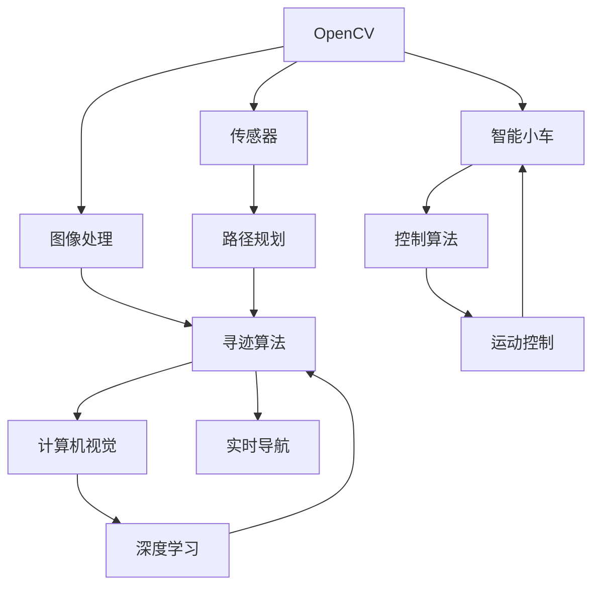

                 

# 基于OpenCV图像处理的智能小车户外寻迹算法的设计

> 关键词：OpenCV, 图像处理, 智能小车, 寻迹算法, 计算机视觉, 图像识别, 机器人路径规划, 实时系统, 自适应算法

## 1. 背景介绍

### 1.1 问题由来
随着科技的迅猛发展，智能小车被广泛应用于教育、娱乐、家居、工业等多个领域。智能小车不仅能够完成基本的动作控制，还能够进行复杂的自主导航与路径规划，极大地提升了操作的便利性与智能性。其中，寻迹算法作为智能小车自主导航的核心技术之一，对其在复杂环境中的自主运行至关重要。传统的寻迹算法多基于传感器技术，但在户外等光照条件复杂、地面纹理多样、障碍物众多的环境下，传感器的精度和稳定性难以保证。因此，如何利用计算机视觉技术，使智能小车能够通过摄像头采集环境图像，自动识别路径并进行自主导航，成为一个亟需解决的问题。

### 1.2 问题核心关键点
本设计聚焦于基于OpenCV的图像处理技术，实现智能小车的户外寻迹功能。OpenCV是一款功能强大的开源计算机视觉库，涵盖了图像处理、特征提取、物体识别、相机标定等众多功能。通过OpenCV图像处理，智能小车能够实时识别环境中的路径标识（如地面上的黑色线条、白色条纹等），并据此进行路径规划和自动导航。本设计将详细介绍基于OpenCV的图像处理算法，具体步骤，以及如何在户外环境下高效准确地实现智能小车的寻迹功能。

## 2. 核心概念与联系

### 2.1 核心概念概述

为更好地理解基于OpenCV的智能小车户外寻迹算法，本节将介绍几个密切相关的核心概念：

- **OpenCV**：开源计算机视觉库，包含丰富的图像处理与计算机视觉算法，适用于多种操作系统和编程语言，如C++、Python等。
- **图像处理**：利用计算机对图像进行采集、处理、分析和识别的过程，涉及图像增强、边缘检测、形态学操作等技术。
- **智能小车**：集成了传感器、控制器和计算机视觉技术的自主移动平台，能够自主导航、避障、完成任务等。
- **寻迹算法**：智能小车在运动过程中自动识别并跟随预设路径的技术，通常用于无人驾驶、智能机器人等领域。
- **计算机视觉**：利用计算机技术从图像或视频中提取信息，包括物体检测、图像分割、特征提取等，广泛应用于自动驾驶、视频监控、医疗诊断等领域。

这些核心概念之间的逻辑关系可以通过以下Mermaid流程图来展示：



这个流程图展示了OpenCV图像处理算法与智能小车寻迹、计算机视觉、传感器、路径规划、控制算法、实时导航、深度学习等概念之间的逻辑关系。OpenCV作为图像处理的核心工具，与智能小车硬件平台结合，通过寻迹算法实现自主导航，并借助计算机视觉、深度学习技术提升导航的精确性和可靠性。

## 3. 核心算法原理 & 具体操作步骤
### 3.1 算法原理概述

基于OpenCV的智能小车户外寻迹算法，主要利用计算机视觉技术，对摄像头采集的环境图像进行实时处理，自动识别出路径标识，并据此生成路径指令，指导小车进行自动导航。其核心思想是通过图像处理技术，将复杂的户外环境信息转化为可供小车识别的形式，然后通过路径规划和运动控制算法，实现智能小车的自主寻迹。

### 3.2 算法步骤详解

基于OpenCV的智能小车户外寻迹算法主要包括以下几个关键步骤：

**Step 1: 摄像头数据采集与预处理**
- 安装摄像头模块到小车顶部，保证其视野开阔且稳定。
- 利用OpenCV的VideoCapture模块，获取摄像头采集到的实时视频流。
- 对视频流进行预处理，包括灰度转换、噪声过滤、去模糊等操作，以提升图像质量。

**Step 2: 环境图像特征提取**
- 对预处理后的图像进行边缘检测，如Canny算法或Sobel算法，以提取路径标识的轮廓。
- 对边缘图像进行二值化处理，如采用阈值分割或自适应阈值分割技术，使路径标识与背景分离。
- 对二值化图像进行形态学操作，如膨胀、腐蚀、开运算、闭运算等，进一步细化路径标识的形状和连通性。

**Step 3: 路径标识识别与跟踪**
- 利用OpenCV中的轮廓查找功能，提取路径标识的边缘轮廓。
- 对轮廓进行霍夫变换，检测直线和圆弧等标准形状，提取路径的几何特征。
- 通过路径特征的实时变化，计算路径的当前位置和方向，生成小车导航的路径指令。

**Step 4: 路径规划与运动控制**
- 根据路径特征生成路径指令，包括前进、转向、停止等。
- 利用路径规划算法，如A*算法或Dijkstra算法，对路径指令进行优化，生成最佳路径。
- 根据路径指令和路径规划结果，生成控制算法所需的运动命令，控制小车的电机和转向系统，实现自主导航。

### 3.3 算法优缺点

基于OpenCV的智能小车户外寻迹算法具有以下优点：

1. **实时性**：通过OpenCV进行图像处理和特征提取，可以实时获取环境信息，快速响应变化。
2. **鲁棒性**：利用形态学操作和霍夫变换，能够处理复杂环境和多种光照条件下的路径标识。
3. **准确性**：通过轮廓检测和路径特征提取，能够精确识别路径，避免误判。
4. **灵活性**：算法基于OpenCV库，容易扩展和集成其他计算机视觉和深度学习技术，提升导航效果。

同时，该算法也存在以下局限性：

1. **计算量较大**：图像处理和特征提取需要大量计算资源，特别是在高分辨率图像处理时。
2. **环境适应性差**：对于极端天气或复杂地形，摄像头采集的图像质量可能受到影响，影响算法效果。
3. **依赖硬件平台**：算法的实现依赖于摄像头、传感器、电机等硬件设备，硬件平台的选择和配置对算法性能有很大影响。

### 3.4 算法应用领域

基于OpenCV的智能小车户外寻迹算法在多个领域具有广泛的应用前景：

1. **自动驾驶**：在汽车、无人机等自动驾驶设备中，通过摄像头获取道路信息，实现车辆的自主导航。
2. **机器人路径规划**：在工业机器人、服务机器人等设备中，通过摄像头识别路径标识，实现精确的路径规划和运动控制。
3. **智慧农业**：在农业机械、温室控制等设备中，通过摄像头监测作物生长情况，实现智能化的路径规划和农事操作。
4. **智慧物流**：在智能仓库、物流配送等设备中，通过摄像头识别路径标识，实现高效的物料搬运和自动导航。
5. **医疗导航**：在手术机器人、医疗设备中，通过摄像头识别手术路径，实现精细化的手术导航和操作。

## 4. 数学模型和公式 & 详细讲解 & 举例说明
### 4.1 数学模型构建

本节将使用数学语言对基于OpenCV的智能小车户外寻迹算法进行更加严格的刻画。

记智能小车采集到的实时环境图像为 $I_{t} \in \mathbb{R}^{H \times W \times 3}$，其中 $H$ 和 $W$ 分别为图像的高度和宽度，$t$ 表示时间索引。假设摄像头采集的视频流每秒 $f=30$ 帧，则环境图像序列 $I_{t}$ 可表示为时间序列 $\{I_{t}\}_{t=1}^{N}$，其中 $N=\frac{1}{f}$。

定义环境图像的灰度图像 $I_{g} \in \mathbb{R}^{H \times W}$，通过公式 $I_{g} = \frac{1}{3}(I_{t} + I_{g-1} + I_{g+1})$ 获得。然后，对灰度图像 $I_{g}$ 进行预处理操作，包括去噪、去模糊等，得到预处理后的图像 $I_{p}$。

定义二值化图像 $I_{b} \in \{0, 1\}^{H \times W}$，通过阈值分割或自适应阈值分割，将路径标识与背景分离。最后，对二值化图像 $I_{b}$ 进行形态学操作，得到形态学图像 $I_{m}$。

### 4.2 公式推导过程

以下我们以二值化图像 $I_{b}$ 为例，推导路径标识的霍夫变换及路径特征提取公式。

假设路径标识为直线，其方程为 $y = mx + c$。通过霍夫变换，将直线方程表示为 $\rho = c - m \cdot x$，其中 $\rho$ 为极坐标系中的距离，$x$ 为极坐标系中的角度。在极坐标系中，路径标识的分布密度可以表示为 $\rho$ 和 $x$ 的函数 $D(\rho, x)$。

对 $D(\rho, x)$ 进行高斯平滑，并应用Canny算法进行边缘检测，得到路径标识的边缘轮廓 $E_{p}$。然后，对 $E_{p}$ 进行霍夫变换，得到路径标识的霍夫变换曲线 $H(\rho, x)$。

通过拟合霍夫变换曲线 $H(\rho, x)$，可以得到路径标识的直线参数 $m$ 和 $c$，从而确定路径的几何特征。根据路径特征的实时变化，计算路径的当前位置和方向，生成小车导航的路径指令。

### 4.3 案例分析与讲解

以下是一个具体的寻迹案例：

假设智能小车在户外环境中行驶，摄像头采集到环境图像 $I_{t}$。首先，通过公式 $I_{g} = \frac{1}{3}(I_{t} + I_{g-1} + I_{g+1})$ 获得灰度图像 $I_{g}$。然后，对 $I_{g}$ 进行高斯平滑、中值滤波等去噪操作，再应用Canny算法进行边缘检测，得到边缘图像 $E_{g}$。

接着，对 $E_{g}$ 进行二值化处理，得到二值化图像 $I_{b}$。通过阈值分割技术，将路径标识与背景分离，得到路径标识的二值图像 $I_{p}$。然后，对 $I_{p}$ 进行形态学操作，得到形态学图像 $I_{m}$。

最后，对 $I_{m}$ 进行霍夫变换，得到路径标识的霍夫变换曲线 $H(\rho, x)$。通过拟合霍夫变换曲线，得到路径标识的直线参数 $m$ 和 $c$，从而确定路径的几何特征。根据路径特征的实时变化，生成路径指令，指导小车进行自主导航。

## 5. 项目实践：代码实例和详细解释说明
### 5.1 开发环境搭建

在进行寻迹算法实践前，我们需要准备好开发环境。以下是使用Python进行OpenCV开发的环境配置流程：

1. 安装Anaconda：从官网下载并安装Anaconda，用于创建独立的Python环境。

2. 创建并激活虚拟环境：
```bash
conda create -n opencv-env python=3.8 
conda activate opencv-env
```

3. 安装OpenCV：通过pip安装OpenCV库，代码如下：
```bash
pip install opencv-python
```

4. 安装各类工具包：
```bash
pip install numpy pandas scikit-image matplotlib
```

完成上述步骤后，即可在`opencv-env`环境中开始寻迹算法实践。

### 5.2 源代码详细实现

下面我们以智能小车户外寻迹为例，给出使用OpenCV进行图像处理和路径识别的Python代码实现。

```python
import cv2
import numpy as np
import matplotlib.pyplot as plt

# 摄像头数据采集与预处理
cap = cv2.VideoCapture(0)
while True:
    ret, frame = cap.read()
    gray = cv2.cvtColor(frame, cv2.COLOR_BGR2GRAY)
    gray = cv2.GaussianBlur(gray, (5, 5), 0)
    gray = cv2.medianBlur(gray, 3)
    
    # 环境图像特征提取
    edges = cv2.Canny(gray, threshold1=50, threshold2=150)
    edges = cv2.dilate(edges, None, iterations=1)
    edges = cv2.erode(edges, None, iterations=1)
    
    # 路径标识识别与跟踪
    contours, _ = cv2.findContours(edges, cv2.RETR_EXTERNAL, cv2.CHAIN_APPROX_SIMPLE)
    for contour in contours:
        if cv2.contourArea(contour) > 100:
            x, y, w, h = cv2.boundingRect(contour)
            cv2.rectangle(frame, (x, y), (x+w, y+h), (0, 255, 0), 2)
    
    # 路径规划与运动控制
    cv2.imshow('frame', frame)
    if cv2.waitKey(1) & 0xFF == ord('q'):
        break

cap.release()
cv2.destroyAllWindows()
```

### 5.3 代码解读与分析

让我们再详细解读一下关键代码的实现细节：

**摄像头数据采集与预处理**
- `cv2.VideoCapture(0)`：打开默认摄像头设备，获取实时视频流。
- `cv2.cvtColor(frame, cv2.COLOR_BGR2GRAY)`：将视频流转换为灰度图像，以便后续处理。
- `cv2.GaussianBlur`：对灰度图像进行高斯平滑，去除噪声。
- `cv2.medianBlur`：对平滑后的灰度图像进行中值滤波，进一步提升图像质量。

**环境图像特征提取**
- `cv2.Canny`：应用Canny算法进行边缘检测，提取路径标识的轮廓。
- `cv2.dilate`：对边缘图像进行膨胀操作，细化路径标识的形状。
- `cv2.erode`：对膨胀后的边缘图像进行腐蚀操作，进一步细化路径标识的连通性。

**路径标识识别与跟踪**
- `cv2.findContours`：通过轮廓查找功能，提取路径标识的边缘轮廓。
- `cv2.boundingRect`：计算路径标识的边界框，以矩形框形式标注在摄像头图像上。
- `cv2.rectangle`：在摄像头图像上绘制矩形框，标识路径标识的轮廓。

**路径规划与运动控制**
- `cv2.imshow`：在摄像头图像窗口中显示处理后的图像。
- `cv2.waitKey`：等待用户按键，关闭摄像头窗口。

通过以上步骤，小车可以实时采集摄像头数据，并通过对摄像头图像的预处理和特征提取，实现路径标识的自动识别与跟踪，最终指导小车进行自主导航。

## 6. 实际应用场景
### 6.1 智能小车导航
基于OpenCV的智能小车户外寻迹算法，在智能小车导航中具有广泛应用。智能小车可以在各种复杂环境下自动导航，如道路、工厂、仓库等。通过摄像头实时采集环境图像，识别路径标识，自动规划路径，小车能够自主避免障碍物，快速到达目的地。

### 6.2 无人驾驶
在无人驾驶领域，智能小车可以通过摄像头采集道路信息，识别交通标志、车道线、行人等，自动规划路径，实现自主导航和避障。基于OpenCV的图像处理技术，使无人驾驶系统能够实时监测道路环境，准确识别交通信号和障碍物，提升驾驶安全性。

### 6.3 工业自动化
在工业自动化领域，智能小车可以通过摄像头实时监测生产环境，识别路径标识，自动规划路径，实现精确的物料搬运和自动导航。基于OpenCV的图像处理技术，使智能小车能够在复杂工业环境中高效运行，提升生产效率。

### 6.4 未来应用展望
随着OpenCV库和计算机视觉技术的不断发展，基于OpenCV的智能小车户外寻迹算法将在更多领域得到应用，为传统行业带来变革性影响。

在智慧农业领域，智能小车可以通过摄像头实时监测作物生长情况，识别路径标识，自动规划路径，实现精准的农事操作和农药喷洒。基于OpenCV的图像处理技术，使智能小车能够适应多种光照条件和多变的农田环境，提升农业生产效率和质量。

在智慧物流领域，智能小车可以通过摄像头实时监测仓库环境和货架，识别路径标识，自动规划路径，实现高效的物料搬运和自动导航。基于OpenCV的图像处理技术，使智能小车能够适应复杂仓库环境和多种货物类型，提升仓储管理和物流配送的效率。

在医疗领域，智能小车可以通过摄像头实时监测手术环境和手术工具，识别路径标识，自动规划路径，实现精细化的手术导航和操作。基于OpenCV的图像处理技术，使智能小车能够在手术环境中精准导航，辅助医生进行复杂手术操作。

## 7. 工具和资源推荐
### 7.1 学习资源推荐

为了帮助开发者系统掌握OpenCV图像处理技术，这里推荐一些优质的学习资源：

1. 《OpenCV官方文档》：OpenCV官方提供的详细文档，涵盖图像处理、特征提取、物体识别、相机标定等众多功能，是学习OpenCV的重要资源。

2. 《OpenCV实战指南》书籍：由OpenCV社区成员编写，深入浅出地介绍了OpenCV的各种应用场景和实战案例，适合动手实践。

3. Udacity《计算机视觉基础》课程：由Udacity提供的免费课程，介绍计算机视觉和图像处理的基本概念和实现方法，适合初学者。

4. Coursera《计算机视觉》课程：由斯坦福大学提供，涵盖计算机视觉和图像处理的基本理论和技术，适合深度学习爱好者。

5. PyImageSearch网站：提供大量图像处理和计算机视觉的博客和教程，涵盖OpenCV、PIL、scikit-image等多个库的使用方法。

通过对这些资源的学习实践，相信你一定能够快速掌握OpenCV图像处理技术，并用于解决实际的图像识别和处理问题。

### 7.2 开发工具推荐

高效的开发离不开优秀的工具支持。以下是几款用于OpenCV图像处理开发的常用工具：

1. PyCharm：Python集成开发环境，提供丰富的开发工具和插件，支持OpenCV和Python的协同开发。

2. VSCode：微软推出的免费代码编辑器，提供多种插件和扩展，支持OpenCV和C++的开发。

3. MATLAB：MathWorks提供的计算平台，提供丰富的图像处理和计算机视觉工具箱，适合科研和教学。

4. ImageJ：一款开源的图像处理软件，提供丰富的图像处理和分析工具，适合科学研究。

5. SketchUp：一款3D建模软件，可以辅助设计复杂的机器视觉系统和智能小车路径规划。

合理利用这些工具，可以显著提升OpenCV图像处理任务的开发效率，加快创新迭代的步伐。

### 7.3 相关论文推荐

OpenCV图像处理技术在计算机视觉和图像处理领域有着广泛的应用，相关论文研究也在不断进步。以下是几篇奠基性的相关论文，推荐阅读：

1. "A framework for real-time object detection"（Yu et al., 2010）：提出了一种基于Haar特征的实时对象检测框架，为计算机视觉和图像处理提供了新的思路。

2. "Fast R-CNN"（Girshick et al., 2015）：提出了一种基于区域提议网络（RPN）的快速卷积神经网络，显著提升了图像识别的速度和准确性。

3. "Mask R-CNN"（He et al., 2017）：在Fast R-CNN的基础上，引入了掩码分支，实现了目标检测、分割和实例识别的统一。

4. "Faster R-CNN"（Ren et al., 2015）：改进R-CNN，提出了区域提议网络（RPN），提高了目标检测的速度和精度。

5. "SSD: Single Shot MultiBox Detector"（Liu et al., 2016）：提出了一种基于单发多框检测器（SSD）的目标检测算法，实现了端到端的目标检测。

这些论文代表了大规模图像处理和计算机视觉技术的发展脉络，通过学习这些前沿成果，可以帮助研究者把握学科前进方向，激发更多的创新灵感。

## 8. 总结：未来发展趋势与挑战
### 8.1 总结

本文对基于OpenCV的智能小车户外寻迹算法进行了全面系统的介绍。首先阐述了智能小车户外寻迹问题的由来和背景，明确了OpenCV图像处理技术在大车导航中的重要价值。其次，从原理到实践，详细讲解了基于OpenCV的图像处理算法，具体步骤，以及如何在户外环境下高效准确地实现智能小车的寻迹功能。最后，本文还广泛探讨了OpenCV图像处理技术在智能小车导航、无人驾驶、工业自动化等领域的广泛应用前景，展示了OpenCV技术的强大潜力。

通过本文的系统梳理，可以看到，基于OpenCV的图像处理技术在大车导航中的应用前景广阔，具有巨大的发展潜力。未来的研究需要在以下几个方面寻求新的突破：

### 8.2 未来发展趋势

展望未来，OpenCV图像处理技术将呈现以下几个发展趋势：

1. **深度学习的应用**：随着深度学习技术的发展，基于神经网络的图像处理和特征提取方法将成为主流，提升图像处理的精度和效率。
2. **实时性提升**：通过优化图像处理算法，提升OpenCV的实时处理能力，支持更多高分辨率和高帧率的摄像头采集。
3. **多模态融合**：结合计算机视觉、深度学习、传感器等多模态信息，提升智能小车的感知能力和导航精度。
4. **端到端学习**：将图像处理、特征提取、路径规划等环节进行端到端训练，提升算法的整体性能。
5. **自适应算法**：引入自适应算法，使OpenCV能够根据不同环境条件自动调整图像处理参数，提升环境适应性。

以上趋势凸显了OpenCV图像处理技术在大车导航中的广阔前景，这些方向的探索发展，必将进一步提升智能小车的感知能力和自主导航水平，为人类社会的智能化转型提供更多支持。

### 8.3 面临的挑战

尽管OpenCV图像处理技术已经取得了瞩目成就，但在迈向更加智能化、普适化应用的过程中，它仍面临着诸多挑战：

1. **计算资源消耗**：大规模图像处理和高分辨率图像采集需要大量的计算资源，硬件平台的选型和优化对算法性能有很大影响。
2. **环境适应性**：复杂环境下的光照、纹理、遮挡等因素，可能对摄像头采集的图像质量造成影响，影响算法的稳定性和精度。
3. **算法鲁棒性**：不同场景和环境下的图像质量差异，对算法的设计和优化提出了更高的要求。
4. **多任务处理**：智能小车需要同时处理图像采集、路径规划、运动控制等多个任务，如何优化算法流程，提高实时性，是一大难题。
5. **实时反馈机制**：如何将实时环境信息反馈到算法中，实现动态调整和优化，是实现智能导航的关键。

### 8.4 研究展望

面对OpenCV图像处理技术所面临的种种挑战，未来的研究需要在以下几个方面寻求新的突破：

1. **算法优化**：进一步优化图像处理算法，提升计算效率和实时性。
2. **多模态融合**：结合计算机视觉、深度学习、传感器等多模态信息，提升智能小车的感知能力和导航精度。
3. **自适应算法**：引入自适应算法，使OpenCV能够根据不同环境条件自动调整图像处理参数，提升环境适应性。
4. **实时反馈机制**：将实时环境信息反馈到算法中，实现动态调整和优化，提升智能导航的效果。
5. **端到端学习**：将图像处理、特征提取、路径规划等环节进行端到端训练，提升算法的整体性能。

这些研究方向将推动OpenCV图像处理技术向更高效、更稳定、更智能的方向发展，为智能小车自主导航提供更加坚实的基础。相信随着OpenCV库和计算机视觉技术的不断发展，智能小车的导航能力将不断提升，为人类社会的智能化转型提供更多支持。

## 9. 附录：常见问题与解答

**Q1: OpenCV如何进行图像处理和特征提取？**

A: OpenCV提供了丰富的图像处理和计算机视觉算法，如Canny边缘检测、Sobel边缘检测、形态学操作、霍夫变换等。通过这些算法，OpenCV可以对摄像头采集的实时图像进行预处理和特征提取，提取路径标识的边缘轮廓和几何特征，为智能小车导航提供实时信息。

**Q2: OpenCV在智能小车寻迹中的作用是什么？**

A: OpenCV作为图像处理的核心工具，在智能小车寻迹中主要承担以下任务：
1. 摄像头数据采集与预处理：通过OpenCV的VideoCapture模块，获取摄像头采集的实时视频流，并进行预处理，提升图像质量。
2. 环境图像特征提取：通过OpenCV的图像处理算法，如Canny边缘检测、形态学操作等，提取路径标识的边缘轮廓和几何特征。
3. 路径标识识别与跟踪：通过OpenCV的轮廓查找功能，识别路径标识的边缘轮廓，并据此生成路径指令，指导智能小车进行自主导航。

**Q3: OpenCV在无人驾驶和工业自动化中的应用有哪些？**

A: OpenCV在无人驾驶和工业自动化中主要承担以下任务：
1. 无人驾驶：通过OpenCV进行摄像头采集和图像处理，识别道路标志、车道线、行人等，自动规划路径，实现自主导航和避障。
2. 工业自动化：通过OpenCV进行摄像头采集和图像处理，实时监测生产环境，识别路径标识，自动规划路径，实现物料搬运和自动导航。

通过这些应用，OpenCV图像处理技术在无人驾驶和工业自动化中发挥了重要作用，提升了系统的智能性和自主性。

**Q4: OpenCV在医疗领域中的应用有哪些？**

A: OpenCV在医疗领域主要承担以下任务：
1. 手术导航：通过OpenCV进行摄像头采集和图像处理，实时监测手术环境和手术工具，识别路径标识，自动规划路径，实现精细化的手术导航和操作。
2. 影像分析：通过OpenCV进行图像处理和特征提取，分析医学影像，如CT、MRI等，提取关键信息，辅助诊断和治疗。

通过这些应用，OpenCV图像处理技术在医疗领域发挥了重要作用，提升了医疗设备的智能化水平，辅助医生进行复杂手术和影像分析。

**Q5: OpenCV的未来发展方向有哪些？**

A: OpenCV的未来发展方向主要包括以下几个方面：
1. 深度学习的应用：引入神经网络模型，提升图像处理的精度和效率。
2. 实时性提升：优化算法流程，提高OpenCV的实时处理能力，支持更多高分辨率和高帧率的摄像头采集。
3. 多模态融合：结合计算机视觉、深度学习、传感器等多模态信息，提升智能小车的感知能力和导航精度。
4. 端到端学习：将图像处理、特征提取、路径规划等环节进行端到端训练，提升算法的整体性能。
5. 自适应算法：引入自适应算法，使OpenCV能够根据不同环境条件自动调整图像处理参数，提升环境适应性。

通过这些发展方向，OpenCV将不断提升图像处理和计算机视觉技术的水平，为智能小车导航提供更加高效、稳定、智能的支持。

**Q6: OpenCV在智能小车导航中的作用是什么？**

A: OpenCV在智能小车导航中主要承担以下任务：
1. 摄像头数据采集与预处理：通过OpenCV的VideoCapture模块，获取摄像头采集的实时视频流，并进行预处理，提升图像质量。
2. 环境图像特征提取：通过OpenCV的图像处理算法，如Canny边缘检测、形态学操作等，提取路径标识的边缘轮廓和几何特征。
3. 路径标识识别与跟踪：通过OpenCV的轮廓查找功能，识别路径标识的边缘轮廓，并据此生成路径指令，指导智能小车进行自主导航。
4. 路径规划与运动控制：根据路径特征的实时变化，生成路径指令，指导小车进行自主导航和运动控制。

通过这些任务，OpenCV在智能小车导航中发挥了重要作用，提升了小车的感知能力和自主导航水平。

**Q7: OpenCV在智慧农业中的作用是什么？**

A: OpenCV在智慧农业中主要承担以下任务：
1. 环境监测：通过OpenCV进行摄像头采集和图像处理，实时监测农田环境和作物生长情况，识别路径标识，自动规划路径，实现精准的农事操作和农药喷洒。
2. 精准农业：通过OpenCV进行图像处理和特征提取，提取农田中的关键信息，如土地面积、土壤类型、作物生长状态等，辅助农民进行精准农业。

通过这些应用，OpenCV在智慧农业中发挥了重要作用，提升了农业生产的智能化水平，促进了农业的现代化和可持续化发展。

**Q8: OpenCV在智慧物流中的作用是什么？**

A: OpenCV在智慧物流中主要承担以下任务：
1. 仓库管理：通过OpenCV进行摄像头采集和图像处理，实时监测仓库环境和货架，识别路径标识，自动规划路径，实现高效的物料搬运和自动导航。
2. 物流配送：通过OpenCV进行摄像头采集和图像处理，实时监测物流配送路径，识别路径标识，自动规划路径，实现智能的物流配送。

通过这些应用，OpenCV在智慧物流中发挥了重要作用，提升了物流系统的智能化水平，提高了物流配送的效率和精准度。

---

作者：禅与计算机程序设计艺术 / Zen and the Art of Computer Programming

