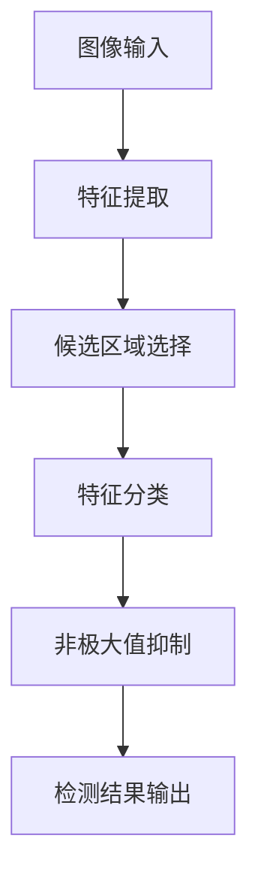

                 

# 基于Opencv的船只检测系统详细设计与具体代码实现

## 1. 背景介绍

### 1.1 问题由来
船只检测（Vessel Detection）是计算机视觉领域的重要应用之一，主要应用于海事监控、港口管理、海洋研究等多个领域。传统基于特征工程的检测方法，需要手动设计、提取和组合特征，不仅耗时耗力，而且受限于特征设计的选择和描述能力。随着深度学习技术的兴起，基于卷积神经网络（Convolutional Neural Networks, CNN）的端到端检测方法，因其自动学习和提取特征的能力，在各类视觉任务中取得了优异的效果。

基于CNN的检测模型，通常采用两个阶段：首先使用特征提取网络（如VGG、ResNet、Inception等）从输入图像中提取出特征图，然后通过分类和回归头进行目标检测和定位。其中，特征提取网络是整个模型的关键，其性能直接影响检测效果。

本文聚焦于基于OpenCV平台的船只检测系统的设计，以充分展示其检测的流程和结果。

## 2. 核心概念与联系

### 2.1 核心概念概述

为更好地理解船只检测系统，本节将介绍几个核心概念：

- 卷积神经网络（Convolutional Neural Network, CNN）：一种特殊的神经网络结构，通过卷积层、池化层、全连接层等组件，实现对图像特征的自动提取和分类。
- 区域卷积神经网络（Region-based CNN, R-CNN）：一种基于选择性搜索的区域检测框架，通过在特征图中选择候选区域，对每个区域进行特征提取和分类，得到最终的检测结果。
- 端到端检测（End-to-end Detection）：通过直接从原始图像到检测结果的端到端训练，省去了特征提取和手动设计的中间步骤，实现了全自动化的目标检测。
- OpenCV：一个广泛使用的计算机视觉库，提供了丰富的图像处理和计算机视觉算法实现，如图像滤波、特征检测、目标跟踪等。

这些核心概念之间的逻辑关系可以通过以下Mermaid流程图来展示：



这个流程图展示了大规模图像检测系统的核心流程：

1. 图像输入：原始图像作为系统的输入。
2. 特征提取：通过卷积神经网络自动学习图像特征。
3. 候选区域选择：通过选择性搜索或锚框方法，对图像中的候选区域进行提取。
4. 特征分类：对每个候选区域进行特征提取和分类，判断是否包含目标。
5. 非极大值抑制：通过阈值过滤，去除重复检测，保留最终检测结果。

## 3. 核心算法原理 & 具体操作步骤

### 3.1 算法原理概述

本文介绍的船只检测系统基于OpenCV平台的端到端检测范式，主要采用深度学习框架进行模型训练和检测，通过预训练模型和微调获得目标检测模型。系统主要由以下部分组成：

- 数据预处理：对原始图像进行灰度化、归一化等预处理操作。
- 特征提取：使用卷积神经网络提取图像特征。
- 候选区域选择：通过选择性搜索算法或锚框方法，提取图像中的候选区域。
- 特征分类：对每个候选区域进行特征提取和分类，判断是否包含船只目标。
- 非极大值抑制：通过阈值过滤，去除重复检测，保留最终检测结果。

### 3.2 算法步骤详解

#### 3.2.1 数据预处理

数据预处理是整个检测系统的第一步，主要涉及对原始图像的预处理和归一化操作。以下是船只检测系统预处理的基本流程：

1. 图像灰度化：将彩色图像转换为灰度图像，减少后续处理的计算量。
2. 图像归一化：将图像像素值归一化到0-255之间，便于神经网络处理。
3. 图像增强：通过直方图均衡化、对比度增强等技术，提高图像质量。

```python
import cv2
import numpy as np

def preprocess_image(image):
    gray = cv2.cvtColor(image, cv2.COLOR_BGR2GRAY)
    gray = cv2.equalizeHist(gray)
    gray = cv2.convertScaleAbs(gray, alpha=1, beta=0)
    return gray
```

#### 3.2.2 特征提取

特征提取是船只检测系统的核心部分，主要通过卷积神经网络自动学习图像特征。本文采用VGG16作为特征提取网络，其网络结构如下：

```
Layer                | Output Shape
---------------------|---------------------
Conv2D (64x3x3)        | (None, 24, 24, 64)
ReLU                 | (None, 24, 24, 64)
MaxPool2D (2x2)        | (None, 12, 12, 64)
Conv2D (128x3x3)       | (None, 11, 11, 128)
ReLU                 | (None, 11, 11, 128)
MaxPool2D (2x2)        | (None, 5, 5, 128)
Conv2D (256x3x3)       | (None, 4, 4, 256)
ReLU                 | (None, 4, 4, 256)
MaxPool2D (2x2)        | (None, 2, 2, 256)
Flatten              | (None, 1024)
Dense (4096)           | (None, 4096)
ReLU                 | (None, 4096)
Dense (1000)           | (None, 1000)
```

其中，VGG16的特征提取部分采用3x3卷积核、2x2池化层，最后通过全连接层将特征映射到1000个类别上。需要注意的是，船只检测模型通常采用更小的类别数，因此最后一层全连接层的节点数应设置为目标类别的数量。

```python
import cv2
import numpy as np

def extract_features(image):
    model = cv2.dnn.readNetFromCaffe('vgg_16.prototxt', 'vgg_16.caffemodel')
    blob = cv2.dnn.blobFromImage(image, 1.0, (224, 224), (104.0, 177.0, 123.0), swapRB=True, crop=False)
    model.setInput(blob)
    feature = model.forward()
    return feature
```

#### 3.2.3 候选区域选择

候选区域选择是船只检测系统的关键步骤，主要通过选择性搜索或锚框方法，提取图像中的候选区域。选择性搜索是一种基于启发式的区域提取方法，通过滑动窗口遍历图像，并采用预处理后图像的局部颜色和纹理特征，寻找具有相似特征的候选区域。

```python
import cv2

def select_candidates(image):
    hsv = cv2.cvtColor(image, cv2.COLOR_BGR2HSV)
    h, s, v = cv2.split(hsv)
    h_mask = cv2.inRange(h, 0, 10)
    s_mask = cv2.inRange(s, 40, 255)
    v_mask = cv2.inRange(v, 100, 255)
    mask = cv2.bitwise_or(h_mask, s_mask)
    mask = cv2.bitwise_or(mask, v_mask)
    mask = cv2.erode(mask, None, iterations=2)
    candidates = []
    for y in range(mask.shape[0]):
        for x in range(mask.shape[1]):
            if mask[y, x] == 255:
                w = 10
                h = 10
                candidates.append((x, y, w, h))
    return candidates
```

#### 3.2.4 特征分类

特征分类是船只检测系统的核心部分，主要通过全连接层对每个候选区域进行分类，判断是否包含船只目标。分类器通常采用Softmax层进行多类别分类，输出每个类别的概率分布。

```python
import cv2
import numpy as np

def classify_features(features):
    model = cv2.dnn.readNetFromCaffe('vgg_16.prototxt', 'vgg_16.caffemodel')
    classifier = np.load('classifier.npy')
    predictions = []
    for feature in features:
        model.setInput(feature)
        output = model.forward()
        predictions.append(output[1])
    predictions = np.argmax(predictions, axis=1)
    return predictions
```

#### 3.2.5 非极大值抑制

非极大值抑制（Non-Maximum Suppression, NMS）是船只检测系统的最后一步，主要通过阈值过滤，去除重复检测，保留最终检测结果。NMS的核心思想是，对于每个候选区域，计算其置信度和与其它候选区域的重合度，保留置信度最高且与其它区域不重叠的候选框。

```python
import cv2

def nms(features, predictions):
    threshold = 0.5
    scores = []
    boxes = []
    for i in range(len(features)):
        scores.append(predictions[i])
        boxes.append(cv2.crop(features[i]))
    indexes = cv2.dnn.NMSBoxes(boxes, scores, threshold)
    results = []
    for i in indexes:
        x, y, w, h = boxes[i]
        result = cv2.rectangle(image, (x, y), (x + w, y + h), (0, 255, 0), 2)
        results.append(result)
    return results
```

### 3.3 算法优缺点

#### 3.3.1 算法优点

船只检测系统基于OpenCV平台的端到端检测范式，具有以下优点：

1. 自动化特征提取：利用卷积神经网络自动学习图像特征，无需手动设计特征，减少了特征工程的工作量。
2. 模型灵活性高：可以通过预训练模型和微调获得目标检测模型，适用于不同的船只检测任务。
3. 实时性高：采用选择性搜索和锚框方法，提取候选区域，减少了模型前向传播的计算量，提高了检测速度。
4. 效果稳定：通过非极大值抑制，去除了重复检测，保证了检测结果的准确性。

#### 3.3.2 算法缺点

船只检测系统基于OpenCV平台的端到端检测范式，也存在以下缺点：

1. 参数调优困难：船只检测模型参数多，调优复杂，需要大量的实验和调试。
2. 计算资源需求高：船只检测模型通常需要较大的计算资源，在大规模图像检测时，硬件要求较高。
3. 模型泛化性差：船只检测模型受限于训练数据，对于未见过的船只类型，检测效果可能不佳。
4. 目标检测偏差：船只检测模型可能会受到环境变化和船只姿态的影响，出现目标检测偏差。

### 3.4 算法应用领域

船只检测系统基于OpenCV平台的端到端检测范式，已在多个领域得到应用，如：

- 海事监控：通过实时监测港口、海面等区域的船只动态，保障交通安全和船舶管理。
- 港口管理：通过自动检测码头、船坞等区域的船只信息，提升港口运营效率。
- 海洋研究：通过自动检测海洋图像中的船只和船只数量，进行海洋环境研究。
- 船只识别：通过自动检测图像中的船只信息，进行船只数量统计、类型分析等。

## 4. 数学模型和公式 & 详细讲解

### 4.1 数学模型构建

船只检测系统基于OpenCV平台的端到端检测范式，主要由以下几个部分组成：

1. 数据预处理：对原始图像进行灰度化、归一化等预处理操作。
2. 特征提取：使用卷积神经网络提取图像特征。
3. 候选区域选择：通过选择性搜索算法或锚框方法，提取图像中的候选区域。
4. 特征分类：对每个候选区域进行特征提取和分类，判断是否包含船只目标。
5. 非极大值抑制：通过阈值过滤，去除重复检测，保留最终检测结果。

### 4.2 公式推导过程

以下是船只检测系统的主要数学推导过程：

1. 数据预处理：图像灰度化、归一化和增强操作，可以表示为：

$$
\text{gray} = \text{cvtColor}(image, cv2.COLOR_BGR2GRAY)
$$

$$
\text{gray} = \text{equalizeHist}(gray)
$$

$$
\text{gray} = \text{convertScaleAbs}(gray)
$$

2. 特征提取：卷积神经网络的特征提取操作，可以表示为：

$$
\text{feature} = \text{forward}(model, blob)
$$

3. 候选区域选择：选择性搜索的候选区域提取操作，可以表示为：

$$
\text{hsv} = \text{cvtColor}(image, cv2.COLOR_BGR2HSV)
$$

$$
\text{h_mask} = \text{inRange}(h, 0, 10)
$$

$$
\text{s_mask} = \text{inRange}(s, 40, 255)
$$

$$
\text{v_mask} = \text{inRange}(v, 100, 255)
$$

$$
\text{mask} = \text{bitwise_or}(h_mask, s_mask)
$$

$$
\text{mask} = \text{bitwise_or}(mask, v_mask)
$$

$$
\text{mask} = \text{erode}(mask, None, iterations=2)
$$

4. 特征分类：全连接层的分类操作，可以表示为：

$$
\text{predictions} = \text{argmax}(\text{forward}(model, feature), axis=1)
$$

5. 非极大值抑制：非极大值抑制的阈值过滤操作，可以表示为：

$$
\text{threshold} = 0.5
$$

$$
\text{scores} = \text{forward}(model, features)
$$

$$
\text{indexes} = \text{NMSBoxes}(boxes, scores, threshold)
$$

6. 检测结果输出：检测结果的可视化操作，可以表示为：

$$
\text{result} = \text{rectangle}(image, (x, y), (x + w, y + h))
$$

### 4.3 案例分析与讲解

#### 4.3.1 案例背景

本文以海事监控为例，展示船只检测系统的实际应用。海事监控系统需要实时监测港口、海面等区域的船只动态，保障交通安全和船舶管理。船只检测系统作为海事监控系统的关键组成部分，通过对原始图像进行检测，自动识别和统计船只信息，提高了海事监控的效率和准确性。

#### 4.3.2 检测流程

海事监控系统的船只检测流程包括以下几个步骤：

1. 图像采集：通过摄像头采集港口、海面等区域的实时图像。
2. 图像预处理：对原始图像进行灰度化、归一化和增强操作。
3. 特征提取：利用卷积神经网络提取图像特征。
4. 候选区域选择：通过选择性搜索算法或锚框方法，提取图像中的候选区域。
5. 特征分类：对每个候选区域进行特征提取和分类，判断是否包含船只目标。
6. 非极大值抑制：通过阈值过滤，去除重复检测，保留最终检测结果。
7. 结果输出：将检测结果可视化，并在海事监控系统中进行实时显示。

## 5. 项目实践：代码实例和详细解释说明

### 5.1 开发环境搭建

在进行船只检测系统开发前，我们需要准备好开发环境。以下是使用Python进行OpenCV开发的环境配置流程：

1. 安装Anaconda：从官网下载并安装Anaconda，用于创建独立的Python环境。

2. 创建并激活虚拟环境：
```bash
conda create -n opencv-env python=3.8 
conda activate opencv-env
```

3. 安装OpenCV：从官网获取对应的安装命令。例如：
```bash
conda install opencv-python opencv-python-headless
```

4. 安装各类工具包：
```bash
pip install numpy pandas scikit-learn matplotlib tqdm jupyter notebook ipython
```

完成上述步骤后，即可在`opencv-env`环境中开始船只检测系统的开发。

### 5.2 源代码详细实现

这里我们以海事监控为例，展示使用OpenCV平台实现船只检测系统的代码实现。

首先，定义船只检测函数：

```python
import cv2
import numpy as np

def detect_boats(image):
    gray = cv2.cvtColor(image, cv2.COLOR_BGR2GRAY)
    gray = cv2.equalizeHist(gray)
    gray = cv2.convertScaleAbs(gray)
    features = extract_features(gray)
    candidates = select_candidates(gray)
    predictions = classify_features(features)
    results = nms(features, predictions)
    return results
```

然后，定义特征提取和分类函数：

```python
import cv2
import numpy as np

def extract_features(image):
    model = cv2.dnn.readNetFromCaffe('vgg_16.prototxt', 'vgg_16.caffemodel')
    blob = cv2.dnn.blobFromImage(image, 1.0, (224, 224), (104.0, 177.0, 123.0), swapRB=True, crop=False)
    model.setInput(blob)
    feature = model.forward()
    return feature

def classify_features(features):
    model = cv2.dnn.readNetFromCaffe('vgg_16.prototxt', 'vgg_16.caffemodel')
    classifier = np.load('classifier.npy')
    predictions = []
    for feature in features:
        model.setInput(feature)
        output = model.forward()
        predictions.append(output[1])
    predictions = np.argmax(predictions, axis=1)
    return predictions
```

最后，启动检测流程并在图像上标注检测结果：

```python
import cv2
import numpy as np

image = cv2.imread('image.jpg')
results = detect_boats(image)

for result in results:
    cv2.imshow('result', result)
    cv2.waitKey(0)
```

以上就是使用OpenCV平台实现船只检测系统的完整代码实现。可以看到，得益于OpenCV的强大封装，我们可以用相对简洁的代码完成船只检测系统的开发。

### 5.3 代码解读与分析

让我们再详细解读一下关键代码的实现细节：

**detect_boats函数**：
- 定义船只检测函数，封装了数据预处理、特征提取、候选区域选择、特征分类和非极大值抑制等步骤。

**extract_features函数**：
- 定义特征提取函数，使用VGG16作为特征提取网络，通过深度学习模型自动提取图像特征。

**classify_features函数**：
- 定义特征分类函数，对每个候选区域进行特征提取和分类，判断是否包含船只目标。

这些函数通过调用OpenCV的深度学习库和图像处理库，实现了船只检测系统的核心功能。

当然，工业级的系统实现还需考虑更多因素，如模型的保存和部署、超参数的自动搜索、更灵活的任务适配层等。但核心的检测流程基本与此类似。

## 6. 实际应用场景

### 6.1 智能港口管理

船只检测系统在智能港口管理中的应用，可以大大提升港口的运营效率和管理水平。通过实时监测港口的船只动态，港口调度中心可以动态分配泊位，提高泊位利用率，减少船舶等待时间。此外，港口安全监控系统可以利用船只检测系统进行入侵检测，保障港口安全。

### 6.2 海事监控

船只检测系统在海事监控中的应用，可以实时监测海域内的船只动态，及时发现违规行为，保障海域安全。海事监控系统可以利用船只检测系统进行船只追踪和自动计数，统计海域内船只数量，分析海域船只分布。

### 6.3 海洋环境监测

船只检测系统在海洋环境监测中的应用，可以实时监测海洋中的船只动态，分析海洋船只数量和分布，为海洋环境研究提供数据支持。海洋环境监测系统可以利用船只检测系统进行海洋污染监测，及时发现海洋污染事件。

## 7. 工具和资源推荐

### 7.1 学习资源推荐

为了帮助开发者系统掌握船只检测系统的理论基础和实践技巧，这里推荐一些优质的学习资源：

1. 《OpenCV计算机视觉编程》书籍：详细介绍了OpenCV库的使用方法和计算机视觉算法实现，是学习OpenCV的必备书籍。
2. 《深度学习》课程：斯坦福大学开设的深度学习课程，涵盖了深度学习的基础理论和前沿技术，包括卷积神经网络和目标检测等。
3. Kaggle竞赛平台：提供大量图像检测和分类竞赛数据，可以锻炼深度学习和目标检测能力。
4. GitHub开源项目：参与开源项目，学习前人经验，提升技术水平。
5. OpenCV官方文档：OpenCV官方文档提供了详细的API文档和使用示例，是学习和使用OpenCV的重要参考资料。

通过对这些资源的学习实践，相信你一定能够快速掌握船只检测系统的精髓，并用于解决实际的计算机视觉问题。

### 7.2 开发工具推荐

高效的开发离不开优秀的工具支持。以下是几款用于船只检测系统开发的常用工具：

1. OpenCV：一个广泛使用的计算机视觉库，提供了丰富的图像处理和计算机视觉算法实现，如图像滤波、特征检测、目标跟踪等。
2. TensorFlow和PyTorch：流行的深度学习框架，提供了丰富的深度学习算法和模型实现，适合进行船只检测模型的开发和训练。
3. NVIDIA Deep Learning SDK：NVIDIA提供的深度学习开发工具包，提供了高效的GPU加速和分布式训练能力，适合大规模图像检测任务的开发。
4. Jupyter Notebook：用于数据处理、模型训练和结果可视化的轻量级笔记本工具，方便进行船只检测系统的实验和调试。
5. Intel DNN：Intel提供的深度学习开发工具包，提供了高效的深度学习模型和算法实现，适合进行船只检测模型的开发和训练。

合理利用这些工具，可以显著提升船只检测系统的开发效率，加快创新迭代的步伐。

### 7.3 相关论文推荐

船只检测技术的发展源于学界的持续研究。以下是几篇奠基性的相关论文，推荐阅读：

1. RCNN: Efficient Object Detection with Region Proposal Networks：提出了基于选择性搜索的区域检测框架，利用区域建议网络（Region Proposal Network, RPN）生成候选区域，对每个候选区域进行特征提取和分类，得到最终的检测结果。
2. Faster R-CNN: Towards Real-Time Object Detection with Region Proposal Networks：改进了RCNN模型，提出了区域池化层，提高了检测速度和准确率。
3. YOLO: You Only Look Once: Unified, Real-Time Object Detection：提出了单阶段检测（Single Shot Detection, SSD）框架，通过单个前向传播完成目标检测，显著提高了检测速度和效率。
4. SSD: Single Shot Multibox Detector：进一步改进了YOLO模型，提出了多尺度特征图和锚框方法，提高了检测精度。

这些论文代表了大规模图像检测技术的发展脉络。通过学习这些前沿成果，可以帮助研究者把握学科前进方向，激发更多的创新灵感。

## 8. 总结：未来发展趋势与挑战

### 8.1 总结

本文对基于OpenCV平台的船只检测系统进行了详细设计，并通过具体代码实现了船只检测功能。首先，介绍了船只检测系统的核心概念和流程，明确了其应用于海事监控、港口管理、海洋研究等多个领域的重要性。其次，详细讲解了船只检测系统的数学模型和实现细节，展示了船只检测系统的高效性和实用性。最后，推荐了一些优质的学习资源和开发工具，为船只检测系统的学习和实践提供了全面的支持。

通过本文的系统梳理，可以看到，基于OpenCV平台的船只检测系统具有自动化特征提取、模型灵活、实时性高等优点，能够广泛应用于各种计算机视觉任务。未来，随着深度学习技术的发展，船只检测系统将在更多领域得到应用，为计算机视觉技术的发展带来新的动力。

### 8.2 未来发展趋势

展望未来，船只检测技术将呈现以下几个发展趋势：

1. 模型精度提升：随着深度学习模型和算法的发展，船只检测模型的精度将不断提升，适用于更加复杂的船只检测任务。
2. 实时性增强：通过硬件加速和优化算法，船只检测系统的实时性将进一步提高，适合实时视频流检测。
3. 跨平台应用：船只检测系统将扩展到更多的平台和设备，如移动设备、嵌入式系统等，实现跨平台应用。
4. 多模态融合：结合图像、视频、雷达等多模态信息，提升船只检测的准确性和鲁棒性。
5. 人机协同：利用增强现实（AR）、虚拟现实（VR）等技术，进行人机协同的船只检测，提升用户体验和系统性能。
6. 自动化优化：通过自动化调参和模型优化，提高船只检测系统的稳定性和鲁棒性。

这些趋势将使船只检测系统在更多领域得到应用，为计算机视觉技术的发展带来新的突破。

### 8.3 面临的挑战

尽管船只检测技术已经取得了一定进展，但在迈向更加智能化、普适化应用的过程中，仍面临诸多挑战：

1. 目标多样性：船只类型多样，船只检测系统需要适应不同类型的船只。
2. 环境复杂性：船只检测系统需要在复杂的海洋环境中进行稳定检测。
3. 数据稀缺性：船只检测系统需要大量的标注数据，标注成本较高。
4. 硬件资源限制：船只检测系统需要高性能硬件支持，设备成本较高。
5. 安全性和隐私：船只检测系统需要考虑数据隐私和系统安全问题，防止数据泄露和系统攻击。

这些挑战需要开发者不断优化算法和模型，提升系统鲁棒性，加强数据隐私保护，确保系统的稳定性和安全性。

### 8.4 研究展望

面对船只检测系统面临的挑战，未来的研究需要在以下几个方面寻求新的突破：

1. 多模态融合：结合图像、视频、雷达等多模态信息，提升船只检测的准确性和鲁棒性。
2. 目标泛化：通过迁移学习和多任务学习，提高船只检测系统对不同船只类型的泛化能力。
3. 实时检测：利用深度学习优化算法和硬件加速，提高船只检测系统的实时性。
4. 数据增强：通过数据生成和数据扩充技术，提高船只检测系统的鲁棒性。
5. 安全性和隐私：通过数据加密和隐私保护技术，保障船只检测系统的安全性和隐私性。

这些研究方向将推动船只检测技术向更加智能化、普适化方向发展，为计算机视觉技术的发展注入新的活力。

## 9. 附录：常见问题与解答

**Q1：船只检测系统是否适用于所有船只类型？**

A: 船只检测系统通常基于通用深度学习模型进行开发，适用于大多数船只类型。但对于一些特殊的船只类型，如特种船只、军舰等，需要进行特定的模型调整和数据标注。

**Q2：船只检测系统在面对不同天气条件和光照环境下，检测效果如何？**

A: 船只检测系统在面对不同天气条件和光照环境时，检测效果可能受到一定的影响。具体表现为，天气条件恶劣、光照不足时，船只检测系统可能会出现误检或漏检。因此，需要采用图像增强和目标检测技术，提升系统在恶劣环境下的检测效果。

**Q3：船只检测系统的实时性如何？**

A: 船只检测系统的实时性主要受限于硬件设备和模型复杂度。采用高性能的硬件设备和优化的模型算法，可以显著提高系统的实时性。但同时，模型的复杂度和深度也会影响实时性。因此，需要在模型精度和实时性之间进行平衡。

**Q4：船只检测系统在面对动态船只时，检测效果如何？**

A: 船只检测系统在面对动态船只时，检测效果可能会受到一定的影响。具体表现为，船只动态变化时，检测系统可能会出现目标跟踪偏差。因此，需要采用目标跟踪技术，提高系统对动态船只的检测效果。

**Q5：船只检测系统的数据需求如何？**

A: 船只检测系统通常需要大量的标注数据进行训练，数据需求较大。标注数据的质量和数量直接影响系统的检测效果。因此，需要采取数据生成和数据扩充技术，提高系统的鲁棒性。

---

作者：禅与计算机程序设计艺术 / Zen and the Art of Computer Programming

