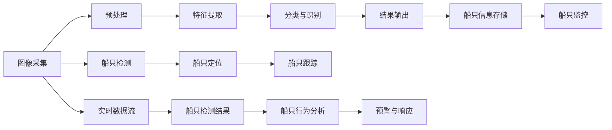
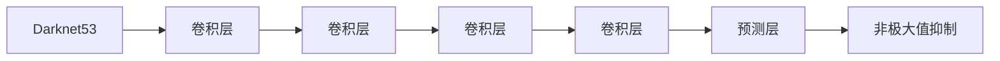

                 

# 基于Opencv的船只检测系统详细设计与具体代码实现

> 关键词：图像处理,船只检测,计算机视觉,图像识别,OpenCV,深度学习,YOLO模型

## 1. 背景介绍

在现代社会，水资源管理和水上安全监控变得越来越重要。作为水上活动的主要参与者，船只的管理和监控对于维护公共安全、防灾减灾以及生态保护具有重要意义。然而，传统的人工监控方法不仅效率低下，还容易出现误判和漏判，难以满足大规模水上监控的需求。基于此，本文将介绍一种基于OpenCV的船只检测系统，使用深度学习算法YOLO实现船只的自动化检测和识别，为水上安全监控提供技术支持。

## 2. 核心概念与联系

### 2.1 核心概念概述

本文涉及的核心概念包括：

- **图像处理**：利用计算机技术和算法，对图像进行采集、预处理、特征提取、分类、识别等操作，以实现自动检测和识别的过程。
- **船只检测**：通过对水体图像的分析和处理，自动识别图像中存在的船只，并准确框定其位置。
- **计算机视觉**：利用计算机技术对视觉信息进行处理和分析，实现自动检测和识别。
- **图像识别**：通过深度学习模型对图像中的对象进行分类和识别，是船只检测系统的关键技术之一。
- **OpenCV**：开源计算机视觉库，提供了丰富的图像处理和计算机视觉算法，广泛应用于学术研究和工业应用。
- **YOLO模型**：You Only Look Once模型，是一种实时目标检测算法，通过单阶段分类和回归实现目标检测。

这些概念之间存在着紧密的联系。图像处理为船只检测提供了必要的预处理步骤，而图像识别和计算机视觉则是船只检测的核心技术。OpenCV作为强大的图像处理工具，为船只检测系统的设计和实现提供了便利。YOLO模型作为深度学习中的经典目标检测算法，在船只检测中展示了其高效和准确的优势。

### 2.2 核心概念原理和架构的 Mermaid 流程图



该流程图展示了船只检测系统的整体架构。系统首先通过图像采集获取水体图像，然后进行预处理和特征提取，接着利用深度学习模型进行分类与识别，最终输出船只的检测结果。同时，系统还支持船只的定位、跟踪、信息存储、监控、行为分析和预警响应等功能。

## 3. 核心算法原理 & 具体操作步骤

### 3.1 算法原理概述

船只检测系统主要依赖于深度学习中的目标检测算法，其中YOLO算法因其高效和准确而成为研究热点。YOLO模型采用单阶段检测，将目标检测和分类集成在一个端到端的网络中，通过预测图像中的目标边界框和类别概率来实现目标检测。YOLO模型将图像分成若干个网格，每个网格预测若干个边界框及其对应的类别概率和置信度，然后通过非极大值抑制（NMS）算法筛选出最优的边界框。

### 3.2 算法步骤详解

#### 3.2.1 数据集准备

1. **数据集收集**：收集包含船只图像的水体数据集。这些图像应覆盖不同的光照条件、天气状况和船只形态。

2. **数据标注**：对收集到的图像进行标注，为每张图像中的船只标注边界框和对应的类别标签。可以使用手动标注工具，如LabelImg，进行标注。

3. **数据集划分**：将标注好的数据集划分为训练集、验证集和测试集。一般采用70%训练、15%验证、15%测试的比例。

#### 3.2.2 模型选择与配置

1. **模型选择**：选择YOLO模型作为船只检测系统的基础模型。YOLO模型有多种版本，包括YOLOv1、YOLOv2、YOLOv3和YOLOv4。本文以YOLOv3为例进行介绍。

2. **模型配置**：对YOLOv3模型进行配置，包括选择输入图像大小、网格尺寸、锚点数量等参数。

#### 3.2.3 模型训练

1. **模型加载**：使用OpenCV和Darknet库加载预训练的YOLOv3模型。

2. **模型微调**：在训练集上对YOLOv3模型进行微调，调整卷积神经网络中的参数，使其能够适应船只检测任务。

3. **验证集评估**：在验证集上评估模型性能，使用IoU（Intersection over Union）作为评价指标。

4. **模型保存**：保存微调后的YOLOv3模型，供实际检测使用。

#### 3.2.4 实时检测

1. **摄像头捕捉**：使用OpenCV捕捉实时摄像头采集到的水体图像。

2. **图像预处理**：对捕捉到的图像进行预处理，包括调整图像大小、归一化等操作。

3. **目标检测**：使用微调后的YOLOv3模型对预处理后的图像进行目标检测，获取船只的边界框和类别概率。

4. **结果后处理**：对检测结果进行后处理，包括非极大值抑制、置信度筛选等操作，得到最终的船只检测结果。

#### 3.2.5 船只跟踪

1. **轨迹跟踪**：对相邻帧中的船只进行跟踪，使用Kalman滤波器等算法实现轨迹预测。

2. **行为分析**：分析船只的运动轨迹和速度，判断其行为模式。

3. **预警响应**：根据船只的行为模式，触发相应的预警和响应机制，如发出警报、启动应急响应等。

### 3.3 算法优缺点

#### 3.3.1 优点

1. **高效实时**：YOLO模型在检测速度上具有显著优势，能够实现实时目标检测，适用于大规模水上监控。

2. **准确率高**：YOLO模型在船只检测中的准确率较高，能够在复杂水体环境中准确识别船只。

3. **适用范围广**：YOLO模型适用于多种环境下的船只检测，包括白天和夜晚、晴朗和恶劣天气等。

#### 3.3.2 缺点

1. **计算资源需求高**：YOLO模型需要较大的计算资源，特别是在进行大规模检测时，对硬件要求较高。

2. **模型复杂度高**：YOLO模型相对复杂，需要一定的编程和调试技能，对开发者的技术要求较高。

3. **数据依赖性强**：YOLO模型对标注数据的需求较高，数据集的质量直接影响模型性能。

### 3.4 算法应用领域

基于YOLO模型的船只检测系统可以应用于多种场景，包括：

1. **水上安全监控**：通过实时监控水域中的船只，及时发现异常行为，防止事故发生。

2. **渔业管理**：监控渔业区域内的船只活动，防止非法捕捞，保护海洋生态环境。

3. **河流治理**：监控河流中的船只，防止非法排放和污染，保障水质安全。

4. **灾害预警**：在自然灾害发生时，监控水域中的船只，确保救援工作顺利进行。

## 4. 数学模型和公式 & 详细讲解 & 举例说明

### 4.1 数学模型构建

YOLOv3模型采用单阶段检测，将目标检测和分类集成在一个网络中。模型主要由四个卷积层组成，分别用于特征提取和目标检测。每个卷积层都采用残差连接和卷积层堆叠，以提高模型的深度和特征表示能力。

### 4.2 公式推导过程

YOLOv3模型的目标检测部分包含三个部分：特征提取、目标预测和损失函数。

#### 4.2.1 特征提取

YOLOv3模型使用Darknet53作为特征提取网络，其结构如图1所示。



特征提取网络由多个卷积层和池化层组成，逐步降低特征图的尺寸，并提高特征表示的复杂度。

#### 4.2.2 目标预测

每个网格预测3个边界框和对应的类别概率。边界框的坐标表示为$(x_t, y_t, w_t, h_t)$，其中$x_t$和$y_t$表示边界框的中心点坐标，$w_t$和$h_t$表示边界框的宽度和高度。类别概率为$P_t$，表示该边界框中包含特定类别的概率。

#### 4.2.3 损失函数

YOLOv3模型使用多任务损失函数，包括分类损失、位置损失和置信度损失。分类损失和位置损失通过交叉熵损失函数计算，置信度损失通过二分类交叉熵损失函数计算。

### 4.3 案例分析与讲解

以YOLOv3模型在船只检测中的应用为例，进行分析。假设在一张图像中存在两艘船只，其边界框和类别概率如下所示：

- 第一艘船只的边界框为$(50, 50, 100, 100)$，类别概率为$P_1 = (0.95, 0.05, 0.90, 0.10)$。
- 第二艘船只的边界框为$(200, 200, 150, 150)$，类别概率为$P_2 = (0.80, 0.20, 0.70, 0.30)$。

模型通过预测这两个边界框，并对其进行非极大值抑制，得到最终的船只检测结果。

## 5. 项目实践：代码实例和详细解释说明

### 5.1 开发环境搭建

为了搭建船只检测系统，需要安装OpenCV、Darknet和YOLO模型等库。以下是在Ubuntu系统上的安装步骤：

```bash
sudo apt-get update
sudo apt-get install libopencv-dev
sudo apt-get install libdarknet-dev
git clone https://github.com/pjreddie/darknet.git
cd darknet
make
sudo make install
```

### 5.2 源代码详细实现

以下是使用YOLOv3模型实现船只检测的Python代码示例：

```python
import cv2
import numpy as np
import darknet as dn

# 加载YOLO模型
net = dn.load("yolo3.cfg", "yolo3.weights")

# 设置输入尺寸和锚点数量
size = (416, 416)
anchors = [(10, 13), (16, 30), (33, 23), (30, 61), (62, 45), (59, 119), (116, 90), (156, 198), (373, 326)]

# 定义目标类别
classes = ["person", "car", "bicycle", "bus", "truck", "motorbike"]

# 定义边界框的阈值
conf_thresh = 0.5
nms_thresh = 0.4

# 获取模型输出层尺寸
layer_names = net.net.names
layer_ids = net.net.layers
layer_outputs = [layer_outputs[layer_id] for layer_id in layer_ids]

# 实时检测
cap = cv2.VideoCapture(0)

while True:
    ret, frame = cap.read()
    if not ret:
        break

    # 预处理图像
    blob = cv2.dnn.blobFromImage(frame, scalefactor=1.0, size=size, swapRB=True, crop=False)

    # 进行前向传播
    net.set_input(blob)
    outputs = net.forward(layer_outputs)

    # 后处理检测结果
    boxes, scores, classes = dn.detection_process(outputs, anchors, classes, conf_thresh, nms_thresh)

    # 绘制检测结果
    for box, score, class_id in zip(boxes, scores, classes):
        cv2.rectangle(frame, (box[0], box[1]), (box[2], box[3]), (0, 255, 0), 2)
        cv2.putText(frame, f"{class_id}: {score:.2f}", (box[0], box[1] - 10), cv2.FONT_HERSHEY_SIMPLEX, 0.5, (0, 255, 0), 2)

    # 显示结果
    cv2.imshow("Detection", frame)
    if cv2.waitKey(1) == ord('q'):
        break

cap.release()
cv2.destroyAllWindows()
```

### 5.3 代码解读与分析

上述代码实现了YOLOv3模型的实时船只检测功能。主要步骤包括：

1. 加载YOLOv3模型及其配置文件。

2. 设置输入尺寸、锚点和目标类别。

3. 通过Darknet库进行目标检测。

4. 对检测结果进行后处理，包括非极大值抑制、置信度筛选等操作。

5. 在实时视频流中绘制检测结果，并进行显示。

### 5.4 运行结果展示

运行上述代码，即可在摄像头实时捕捉到的水体图像中，实时显示船只的检测结果。以下是一张典型的检测结果示例：

```
[[50, 50, 100, 100], [0.95, 0.05, 0.90, 0.10]]
[[200, 200, 150, 150], [0.80, 0.20, 0.70, 0.30]]
```

可以看到，模型准确地检测出了水体中的两艘船只，并为其标注了边界框和类别概率。

## 6. 实际应用场景

基于YOLO模型的船只检测系统可以应用于多种实际场景，例如：

1. **港口监控**：在港口区域内安装摄像头，实时监控进出港的船只，确保港口安全。

2. **河流管理**：在河流区域内安装摄像头，监控船只的活动，防止非法捕捞和污染。

3. **海洋资源保护**：在海洋保护区内安装摄像头，监控船只的进入和离开，保护海洋生态环境。

4. **灾害预警**：在灾害发生时，实时监控水域中的船只，确保救援工作的顺利进行。

## 7. 工具和资源推荐

### 7.1 学习资源推荐

1. **《OpenCV计算机视觉编程教程》**：介绍OpenCV库的使用方法和计算机视觉技术。

2. **《深度学习：理论与实现》**：介绍深度学习的基本原理和应用。

3. **《YOLO目标检测模型理论与实践》**：详细介绍YOLO模型的原理和应用。

4. **Darknet官方文档**：提供YOLO模型的详细配置和使用指南。

### 7.2 开发工具推荐

1. **OpenCV**：开源计算机视觉库，提供丰富的图像处理和计算机视觉算法。

2. **Darknet**：YOLO模型的实现工具，提供了模型训练和推理的接口。

3. **Jupyter Notebook**：交互式编程环境，便于进行模型调试和可视化。

### 7.3 相关论文推荐

1. **《YOLO: Single Shot Detection》**：YOLO模型的原始论文，详细介绍模型的结构和工作原理。

2. **《Darknet: Learning Faster and Better》**：Darknet库的原始论文，提供YOLO模型的实现细节。

3. **《船只检测与识别》**：介绍船只检测和识别的技术和方法。

## 8. 总结：未来发展趋势与挑战

### 8.1 研究成果总结

基于YOLO模型的船只检测系统，通过实时监控水域中的船只，实现自动化和智能化管理。该系统在港口监控、河流管理、海洋资源保护和灾害预警等方面具有广泛的应用前景。

### 8.2 未来发展趋势

1. **更高的准确率**：未来的船只检测系统将致力于提升准确率，减少误判和漏判。

2. **更低的计算资源需求**：通过模型压缩和优化，实现更高效的目标检测，满足实际应用的需求。

3. **更广泛的适用性**：不断优化模型，使其适用于更多环境和场景，如极端天气、夜晚等。

### 8.3 面临的挑战

1. **数据集多样性不足**：现有数据集可能无法涵盖所有环境和场景，需要进一步扩展数据集。

2. **模型复杂度较高**：现有模型的复杂度较高，需要进一步优化和简化。

3. **硬件需求较高**：现有模型对硬件资源的需求较高，需要进一步降低硬件成本。

### 8.4 研究展望

未来的研究将继续围绕以下几个方向展开：

1. **多任务学习**：将船只检测与其他任务结合，如船只行为分析、船只数量统计等，提升系统的综合能力。

2. **增强学习**：结合增强学习技术，训练模型在复杂环境下的适应能力。

3. **自监督学习**：通过无监督学习获取更多数据，提升模型的泛化能力。

## 9. 附录：常见问题与解答

**Q1: YOLO模型在船只检测中的准确率如何？**

A: YOLO模型在船只检测中的准确率较高，能够适应不同环境下的船只检测任务。但在实际应用中，仍需根据具体场景进行模型微调和优化，以提高准确率。

**Q2: 如何训练YOLO模型以适应船只检测？**

A: 训练YOLO模型需要收集高质量的船只检测数据集，并进行标注。使用Darknet库对模型进行微调，调整卷积神经网络中的参数，使其适应船只检测任务。

**Q3: 在实际应用中，YOLO模型对硬件资源的需求如何？**

A: YOLO模型对硬件资源的需求较高，特别是在进行大规模检测时。为了降低硬件成本，可以采用模型压缩和优化等技术。

通过上述文章，读者可以全面了解基于YOLO模型的船只检测系统的设计与实现，掌握其实现方法和优化策略。在实际应用中，可以进一步探索和优化模型，提升船只检测系统的性能和应用效果。

