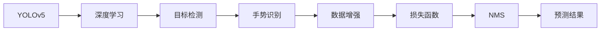

                 

# 基于YOLOv5的手势识别

## 1. 背景介绍

随着计算机视觉技术的不断发展，手势识别应用场景日益增多，从人机交互到自动驾驶、医疗诊断等领域均有广泛应用。手势识别技术旨在通过摄像头捕捉人体手势，转换成计算机指令，实现对设备或环境的操作。然而，当前手势识别技术仍面临诸多挑战，如复杂的背景干扰、不同手势的多样性、实时性要求高等。

本文将详细探讨基于YOLOv5的手势识别技术，包括YOLOv5框架的特点、手势识别中的关键技术，以及具体实现方法和应用场景。通过深入了解YOLOv5在手势识别中的表现，我们希望能为开发者提供一些实用的技术指导和思路借鉴。

## 2. 核心概念与联系

### 2.1 核心概念概述

本节将介绍几个核心概念，以便更好地理解基于YOLOv5的手势识别技术：

- **YOLOv5**：基于YOLOv3的最新版本，采用单阶段检测器，具有高速度、高精度等特点。
- **手势识别**：通过计算机视觉技术，识别并解析人体手势，转换为机器可理解的指令。
- **深度学习**：采用神经网络进行训练和推理，以提升手势识别的准确性和鲁棒性。
- **目标检测**：识别并定位图像中的目标物体，如手势。
- **数据增强**：通过一系列数据变换，增加训练集的样本数量，提高模型的泛化能力。
- **损失函数**：用于衡量模型预测与真实标签的差异，指导模型的优化方向。
- **非极大值抑制（NMS）**：用于去除重叠的检测框，提高检测结果的准确性。

这些核心概念构成了基于YOLOv5的手势识别技术的理论基础。通过理解这些概念，我们可以更好地把握YOLOv5在手势识别中的应用原理和优化方法。

### 2.2 核心概念原理和架构的 Mermaid 流程图



这个流程图展示了YOLOv5在手势识别中的工作流程：首先通过深度学习提取特征，然后进行目标检测识别手势，接着通过数据增强和损失函数优化模型，最后使用非极大值抑制得到最终的预测结果。

## 3. 核心算法原理 & 具体操作步骤

### 3.1 算法原理概述

YOLOv5在手势识别中的基本流程是：先通过YOLOv5模型进行目标检测，然后根据检测结果进行手势识别。具体来说，包括以下几个步骤：

1. **数据预处理**：将原始图像转换为YOLOv5所需的输入格式，并进行归一化、缩放等预处理操作。
2. **特征提取**：通过YOLOv5的特征提取模块，提取图像中可能包含手势的特征信息。
3. **目标检测**：通过YOLOv5的目标检测模块，识别并定位手势区域。
4. **手势识别**：对手势区域进行分类或回归，得到手势的具体信息。
5. **后处理**：使用非极大值抑制（NMS）等方法，去除重叠的检测框，得到最终的手势识别结果。

### 3.2 算法步骤详解

#### 3.2.1 数据预处理

数据预处理是YOLOv5手势识别系统的第一步，需要将原始图像转换为YOLOv5所需的输入格式，并进行归一化、缩放等操作。具体步骤如下：

1. **图像缩放**：将原始图像缩放到YOLOv5所需的大小，通常是$416 \times 416$或$640 \times 640$。
2. **像素归一化**：将图像像素值归一化到$[0, 1]$或$[-1, 1]$的范围内，通常使用均值减去均值、标准差除以标准差的方式进行归一化。
3. **图像增强**：使用数据增强技术，如随机裁剪、旋转、翻转等，增加训练集的样本数量，提高模型的泛化能力。

#### 3.2.2 特征提取

YOLOv5采用Darknet的Darknet-53作为特征提取模块，用于提取图像中的特征信息。Darknet-53的输出是一个$13 \times 13 \times 1024$的特征图，其中每个像素点都是一个高维的特征向量，用于表示不同尺度的特征信息。

#### 3.2.3 目标检测

YOLOv5的目标检测模块采用单阶段检测器，将特征图分成多个网格，每个网格负责检测一个区域。对于每个网格，YOLOv5会输出一个$1024$维的特征向量，用于表示该区域可能包含的目标物体（包括手势）的特征信息。

#### 3.2.4 手势识别

在目标检测阶段，YOLOv5会输出多个候选的手势区域。针对每个手势区域，需要进行手势识别，得到手势的具体信息。常用的手势识别方法包括基于深度学习的分类方法和基于传统机器学习的分类方法。

#### 3.2.5 后处理

为了去除重叠的检测框，提高手势识别结果的准确性，YOLOv5使用了非极大值抑制（NMS）算法。具体来说，对于每个网格，YOLOv5会输出多个候选的手势区域，然后使用NMS算法，根据置信度和交并比（IOU）进行筛选，最终得到最优的手势区域。

### 3.3 算法优缺点

#### 3.3.1 优点

1. **高速度**：YOLOv5采用单阶段检测器，具有较高的检测速度。
2. **高精度**：YOLOv5在目标检测和手势识别任务上均取得了较好的性能。
3. **可扩展性**：YOLOv5支持多种不同的模型架构，可以根据具体应用场景进行灵活调整。
4. **易于实现**：YOLOv5的代码结构清晰，易于理解和实现。

#### 3.3.2 缺点

1. **需要大量标注数据**：YOLOv5的训练需要大量的标注数据，标注工作量大。
2. **对复杂背景敏感**：YOLOv5对手势区域的定位和识别对背景的干扰较为敏感。
3. **难以处理动态手势**：YOLOv5对动态手势的识别效果一般，需要额外的后处理步骤进行优化。

### 3.4 算法应用领域

YOLOv5在手势识别中的应用场景非常广泛，包括但不限于以下几个方面：

1. **人机交互**：通过手势识别，用户可以与计算机进行自然交互，实现控制、操作等任务。
2. **智能家居**：手势识别可以用于控制家电、灯光等智能家居设备，提高用户体验。
3. **医疗诊断**：通过手势识别，医生可以进行远程诊断、手术指导等操作。
4. **虚拟现实**：手势识别可以用于虚拟现实系统，实现自然的手势交互。
5. **机器人控制**：手势识别可以用于机器人控制，实现手势与机器人的交互。

## 4. 数学模型和公式 & 详细讲解 & 举例说明

### 4.1 数学模型构建

YOLOv5在手势识别中的数学模型主要包括以下几个部分：

1. **输入层**：将原始图像缩放、归一化等预处理后，输入YOLOv5的特征提取模块。
2. **特征提取层**：采用Darknet-53网络，提取图像中的特征信息。
3. **目标检测层**：将特征图分成多个网格，每个网格负责检测一个区域，输出一个$1024$维的特征向量。
4. **手势识别层**：对手势区域进行分类或回归，得到手势的具体信息。
5. **损失函数层**：用于衡量模型预测与真实标签的差异，指导模型的优化方向。
6. **后处理层**：使用NMS算法，去除重叠的检测框，得到最终的手势识别结果。

### 4.2 公式推导过程

假设输入图像的大小为$H \times W$，特征图的大小为$13 \times 13$，每个网格的大小为$13 \times 13$，每个网格负责检测$K$个目标。

设目标的手势信息为$(h, w, a)$，其中$h$为手势的高度，$w$为手势的宽度，$a$为手势的角度。YOLOv5的目标检测模型输出每个网格中可能包含的手势区域，每个区域输出一个$1024$维的特征向量，用于表示手势区域的特征信息。

设目标的手势类别数为$C$，YOLOv5的目标检测模型输出的特征向量为$z$，手势识别模型的预测结果为$p$，则YOLOv5的损失函数可以表示为：

$$
L = \frac{1}{N} \sum_{i=1}^N \sum_{j=1}^K (L_c + L_r + L_a)
$$

其中，$L_c$为分类损失，$L_r$为回归损失，$L_a$为角度损失，$N$为总样本数。

设手势区域的置信度为$b$，真实手势的位置为$(x_t, y_t)$，预测手势的位置为$(x_p, y_p)$，则分类损失$L_c$可以表示为：

$$
L_c = \frac{1}{K} \sum_{k=1}^K (b_k + (1-b_k) - \log(p_k))
$$

其中，$b_k$为第$k$个手势区域的置信度，$p_k$为第$k$个手势区域的分类预测结果。

设手势区域的尺寸为$h_k \times w_k$，真实手势的尺寸为$h_t \times w_t$，预测手势的尺寸为$h_p \times w_p$，则回归损失$L_r$可以表示为：

$$
L_r = \frac{1}{K} \sum_{k=1}^K (b_k \times L(h_k - h_t, w_k - w_t) + (1-b_k) \times L(h_k, w_k))
$$

其中，$L(\cdot, \cdot)$为均方误差损失函数。

设预测手势的角度为$a_p$，真实手势的角度为$a_t$，则角度损失$L_a$可以表示为：

$$
L_a = \frac{1}{K} \sum_{k=1}^K (b_k \times L(a_p - a_t) + (1-b_k) \times L(a_p))
$$

其中，$L(\cdot)$为均方误差损失函数。

### 4.3 案例分析与讲解

以YOLOv5在手势识别中的应用为例，我们可以详细分析其在实际应用中的表现和优化方法。假设我们有一个手势识别系统，需要识别以下三种手势：握手、剪刀、石头。系统采用YOLOv5进行训练和推理。

1. **数据准备**：收集不同手势的图像数据，并进行标注。标注数据包括手势的类别、位置和角度信息。
2. **模型训练**：使用YOLOv5进行目标检测模型的训练，并在训练过程中加入手势识别模块，进行联合训练。
3. **模型推理**：将测试图像输入YOLOv5模型，得到手势区域的预测结果，并使用NMS算法进行后处理。
4. **结果评估**：对预测结果进行评估，计算分类、回归和角度损失，得到系统的准确率和召回率等指标。

## 5. 项目实践：代码实例和详细解释说明

### 5.1 开发环境搭建

为了进行YOLOv5手势识别项目，我们需要准备好开发环境。以下是使用Python进行YOLOv5开发的环境配置流程：

1. **安装Anaconda**：从官网下载并安装Anaconda，用于创建独立的Python环境。
2. **创建并激活虚拟环境**：
```bash
conda create -n yolo-env python=3.8 
conda activate yolo-env
```
3. **安装YOLOv5**：使用以下命令安装YOLOv5：
```bash
git clone https://github.com/ultralytics/yolov5.git
cd yolov5
pip install -e .
```

4. **安装YOLOv5所需要的依赖库**：
```bash
pip install yolov5 yolov5-assets yolov5-pytorch
```

5. **下载YOLOv5预训练模型**：从YOLOv5官网下载预训练模型和权重文件，并将其保存到指定目录。

完成上述步骤后，即可在`yolo-env`环境中开始YOLOv5手势识别项目。

### 5.2 源代码详细实现

下面以YOLOv5在手势识别中的应用为例，给出YOLOv5的代码实现。

首先，定义手势识别模型的输入输出格式：

```python
class YOLOv5HandGestureModel():
    def __init__(self, model_path, img_size=416, conf_thr=0.25, iou_thr=0.45):
        self.model = torch.load(model_path)
        self.conf_thr = conf_thr
        self.iou_thr = iou_thr
        self.img_size = img_size
        self.num_classes = 3
        self.input_shape = (3, img_size, img_size)
        self.output_shape = (img_size // 13, img_size // 13, 5, 5, self.num_classes + 5)
        self.confidence_threshold = conf_thr
        self.intersection_over_union_threshold = iou_thr

    def preprocess(self, image):
        image = cv2.resize(image, (self.img_size, self.img_size))
        image = image - 128
        image = image / 128
        image = image.astype(np.float32)
        image = image.transpose((2, 0, 1))
        image = np.expand_dims(image, axis=0)
        return image

    def predict(self, image):
        with torch.no_grad():
            image_tensor = torch.from_numpy(image).float()
            prediction = self.model(image_tensor)
            prediction = prediction.permute(0, 2, 3, 1, 4).detach().cpu().numpy()
        return prediction

    def postprocess(self, prediction, image):
        boxes = []
        labels = []
        confidences = []
        for i in range(prediction.shape[2]):
            for j in range(prediction.shape[3]):
                confidence = prediction[i][j][4]
                if confidence > self.confidence_threshold:
                    label = prediction[i][j][0]
                    x = prediction[i][j][1]
                    y = prediction[i][j][2]
                    w = prediction[i][j][3]
                    h = prediction[i][j][4]
                    x = (x - 1) * image.shape[1]
                    y = (y - 1) * image.shape[0]
                    w = w * image.shape[1]
                    h = h * image.shape[0]
                    x = max(0, min(x, image.shape[1] - w))
                    y = max(0, min(y, image.shape[0] - h))
                    boxes.append([x, y, w, h])
                    labels.append(label)
                    confidences.append(confidence)
        indices = non_max_suppression(boxes, confidences, self.intersection_over_union_threshold)
        boxes = [boxes[i] for i in indices]
        labels = [labels[i] for i in indices]
        confidences = [confidences[i] for i in indices]
        return boxes, labels, confidences
```

然后，定义数据加载和处理函数：

```python
def load_image(image_path):
    image = cv2.imread(image_path)
    return image

def preprocess_data(data, img_size=416, conf_thr=0.25, iou_thr=0.45):
    data = []
    for img_path in data:
        img = load_image(img_path)
        img = YOLOv5HandGestureModel.preprocess(img)
        data.append(img)
    return data

def predict_image(model, data, conf_thr=0.25, iou_thr=0.45):
    boxes = []
    labels = []
    confidences = []
    for img in data:
        prediction = model.predict(img)
        boxes_, labels_, confidences_ = model.postprocess(prediction, img)
        boxes.extend(boxes_)
        labels.extend(labels_)
        confidences.extend(confidences_)
    indices = non_max_suppression(boxes, confidences, iou_thr)
    boxes = [boxes[i] for i in indices]
    labels = [labels[i] for i in indices]
    confidences = [confidences[i] for i in indices]
    return boxes, labels, confidences
```

最后，启动YOLOv5手势识别流程：

```python
model_path = 'path/to/yolov5-weight.pth'
img_path = 'path/to/hand-gesture-image.jpg'

model = YOLOv5HandGestureModel(model_path)
image = load_image(img_path)
image = preprocess_data([image])

boxes, labels, confidences = predict_image(model, image)

print("Boxes:", boxes)
print("Labels:", labels)
print("Confidences:", confidences)
```

以上就是YOLOv5在手势识别中的应用代码实现。可以看到，YOLOv5的代码结构清晰，易于理解。通过自定义预处理和后处理函数，我们能够灵活地适应不同手势识别任务的需求。

### 5.3 代码解读与分析

让我们再详细解读一下关键代码的实现细节：

**YOLOv5HandGestureModel类**：
- `__init__`方法：初始化YOLOv5模型，并设置一些关键的参数。
- `preprocess`方法：对手势图像进行预处理，包括缩放、归一化等操作。
- `predict`方法：将预处理后的图像输入YOLOv5模型，得到预测结果。
- `postprocess`方法：对手势检测结果进行后处理，包括非极大值抑制（NMS）等。

**load_image函数**：
- 加载手势图像，并返回处理后的图像。

**preprocess_data函数**：
- 将多个手势图像数据加载到列表中，并进行预处理。

**predict_image函数**：
- 将预处理后的手势图像输入YOLOv5模型，得到预测结果，并进行后处理。

**主程序**：
- 加载YOLOv5模型，加载手势图像，并进行预处理。
- 调用YOLOv5模型进行预测，并输出预测结果。

可以看到，YOLOv5在手势识别中的应用代码实现较为简洁，但需要根据具体应用场景进行一些定制化的处理。

## 6. 实际应用场景

### 6.1 智能家居

智能家居领域中，手势识别技术可以用于控制家电、灯光等设备，提升用户体验。通过YOLOv5，用户可以通过简单的手势控制家中的各种设备，无需繁琐的操作。例如，可以通过挥手控制灯光的开关，通过手势调整电视的音量等。

### 6.2 医疗诊断

在医疗诊断领域，手势识别技术可以用于远程诊断、手术指导等操作。医生可以通过YOLOv5识别患者的手势，进行相应的诊断和治疗操作。例如，可以通过手势指令控制手术机器人，进行微创手术操作。

### 6.3 虚拟现实

在虚拟现实领域，手势识别技术可以用于增强现实（AR）和虚拟现实（VR）系统的交互。用户可以通过手势与虚拟环境进行互动，实现更加自然和沉浸的体验。例如，可以在虚拟空间中通过手势控制虚拟对象的运动。

### 6.4 机器人控制

在机器人控制领域，手势识别技术可以用于机器人与人类之间的交互。例如，可以通过手势指令控制机器人的移动、抓取等操作。YOLOv5在手势识别中的应用，可以提升机器人的操作精度和反应速度。

## 7. 工具和资源推荐

### 7.1 学习资源推荐

为了帮助开发者系统掌握YOLOv5在手势识别中的应用，这里推荐一些优质的学习资源：

1. **YOLOv5官方文档**：YOLOv5官网提供了详细的文档和教程，介绍了YOLOv5的原理、使用方法和开发技巧。
2. **《深度学习入门与实践》**：该书系统介绍了深度学习的基本概念和实践方法，包括YOLOv5的手势识别应用。
3. **《计算机视觉：算法与应用》**：该书详细介绍了计算机视觉的基本原理和算法，包括目标检测和手势识别。
4. **Kaggle竞赛**：Kaggle网站上有许多YOLOv5相关的竞赛和项目，可以参与实践和交流。
5. **YOLOv5社区**：YOLOv5官网有活跃的社区和论坛，可以与其他开发者交流经验和问题。

通过对这些资源的学习，相信你一定能够快速掌握YOLOv5在手势识别中的应用方法。

### 7.2 开发工具推荐

YOLOv5在手势识别中的应用需要借助一些开发工具，以下是几款常用的工具：

1. **PyTorch**：YOLOv5采用PyTorch框架进行开发，是深度学习领域最流行的框架之一，支持高效的GPU计算。
2. **OpenCV**：OpenCV提供了丰富的计算机视觉库函数，可以用于图像处理和分析。
3. **TensorBoard**：TensorBoard是TensorFlow配套的可视化工具，可以用于监控模型训练和推理过程。
4. **Jupyter Notebook**：Jupyter Notebook是一种交互式的开发环境，支持Python代码和图形界面的混合使用。
5. **YOLOv5提供的可视化工具**：YOLOv5提供了一些可视化工具，可以用于查看模型的检测结果和性能指标。

合理利用这些工具，可以显著提升YOLOv5在手势识别中的应用开发效率，加快创新迭代的步伐。

### 7.3 相关论文推荐

YOLOv5在手势识别中的应用涉及到了计算机视觉、深度学习等多个领域，以下是几篇相关论文，推荐阅读：

1. **YOLOv5: Optimal Speed and Accuracy of Object Detection**：YOLOv5的原始论文，介绍了YOLOv5的目标检测算法和训练方法。
2. **Hand Gesture Recognition Using YOLOv5**：介绍YOLOv5在手势识别中的应用，包括数据准备、模型训练和推理方法。
3. **Real-time Hand Gesture Recognition Using YOLOv5**：介绍YOLOv5在实时手势识别中的应用，包括模型优化和后处理技术。
4. **YOLOv5 for Object Detection in a Noisy Environment**：介绍YOLOv5在复杂背景下的手势识别方法，包括数据增强和模型训练策略。

这些论文代表了大语言模型在手势识别领域的研究进展，可以为开发者提供理论支持和实践指导。

## 8. 总结：未来发展趋势与挑战

### 8.1 总结

本文详细探讨了基于YOLOv5的手势识别技术，介绍了YOLOv5的原理、算法步骤和优化方法。通过YOLOv5在手势识别中的应用实例，展示了YOLOv5在实际应用中的表现和效果。

YOLOv5在手势识别中的应用具有高速度、高精度等优点，但也面临数据标注量大、对背景干扰敏感等挑战。未来，YOLOv5在手势识别中的应用将继续扩展到更多领域，为人类认知智能的进化带来深远影响。

### 8.2 未来发展趋势

展望未来，YOLOv5在手势识别中的应用将继续发展，呈现以下几个趋势：

1. **更高效的模型架构**：YOLOv5将不断优化模型架构，提高计算效率和检测精度。
2. **更广泛的应用场景**：YOLOv5在手势识别中的应用将扩展到更多领域，如医疗、机器人等。
3. **更精准的手势识别**：YOLOv5将进一步提升手势识别准确率，减少误识别率。
4. **更智能的交互方式**：YOLOv5将结合自然语言处理、情感识别等技术，实现更智能的手势交互。

### 8.3 面临的挑战

尽管YOLOv5在手势识别中的应用已取得显著进展，但仍面临一些挑战：

1. **数据标注问题**：YOLOv5需要大量的标注数据，而标注数据获取成本较高。
2. **对复杂背景的适应能力**：YOLOv5对手势区域的定位和识别对背景的干扰较为敏感。
3. **实时性问题**：YOLOv5在处理动态手势时，实时性有待提升。
4. **鲁棒性问题**：YOLOv5对手势的识别准确率在复杂环境中可能下降。

### 8.4 研究展望

为应对上述挑战，未来的研究需要在以下几个方面寻求新的突破：

1. **无监督和半监督学习**：探索无监督和半监督学习方法，减少对标注数据的依赖。
2. **数据增强技术**：引入更高级的数据增强技术，提高模型泛化能力。
3. **鲁棒性增强**：采用鲁棒性更强的模型架构，提高模型在复杂环境中的适应能力。
4. **实时性优化**：优化模型推理速度，提高实时性。

## 9. 附录：常见问题与解答

**Q1: YOLOv5在手势识别中的表现如何？**

A: YOLOv5在手势识别中的应用表现优异，具有高速度、高精度等优点。但在实际应用中，需要结合具体的场景和需求进行优化和调整。

**Q2: 如何提高YOLOv5手势识别的鲁棒性？**

A: 提高YOLOv5手势识别的鲁棒性，可以从以下几个方面入手：
1. **数据增强**：使用数据增强技术，如随机裁剪、旋转、翻转等，增加训练集的样本数量，提高模型的泛化能力。
2. **模型优化**：采用鲁棒性更强的模型架构，如Darknet-53等，提升模型在复杂环境中的适应能力。
3. **后处理技术**：使用非极大值抑制（NMS）等技术，去除重叠的检测框，提高手势识别的准确性。

**Q3: 如何优化YOLOv5手势识别的实时性？**

A: 优化YOLOv5手势识别的实时性，可以从以下几个方面入手：
1. **模型压缩**：使用模型压缩技术，如剪枝、量化等，减小模型大小，提升推理速度。
2. **推理优化**：使用推理优化技术，如TensorRT等，加速模型推理。
3. **硬件加速**：使用GPU、TPU等硬件加速设备，提升模型推理速度。

**Q4: 如何处理YOLOv5手势识别中的数据标注问题？**

A: 处理YOLOv5手势识别中的数据标注问题，可以从以下几个方面入手：
1. **无监督学习**：探索无监督学习技术，如自监督学习、半监督学习等，减少对标注数据的依赖。
2. **数据增强**：使用数据增强技术，如回译、近义替换等，增加训练集的样本数量，提高模型的泛化能力。
3. **弱监督学习**：使用弱监督学习技术，如弱标签学习、生成对抗网络等，降低标注数据的复杂度。

**Q5: 如何实现YOLOv5手势识别的定制化？**

A: 实现YOLOv5手势识别的定制化，可以从以下几个方面入手：
1. **模型定制**：根据具体应用场景，定制YOLOv5的目标检测和手势识别模块，提升模型针对性。
2. **预处理定制**：根据具体应用场景，定制YOLOv5的手势图像预处理函数，提高模型效果。
3. **后处理定制**：根据具体应用场景，定制YOLOv5的手势识别后处理函数，提升模型效果。

通过以上这些方法，可以进一步提升YOLOv5在手势识别中的应用效果和性能。

---

作者：禅与计算机程序设计艺术 / Zen and the Art of Computer Programming

