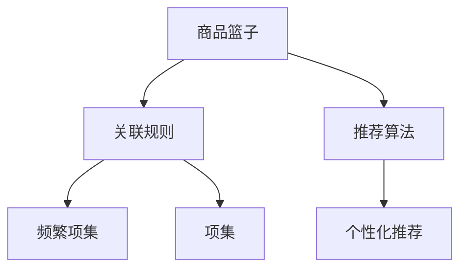

                 

# 基于关联挖掘的服装推荐系统详细设计与具体代码实现

## 1. 背景介绍

### 1.1 问题由来

随着互联网的迅速发展，电商平台的用户规模不断扩大，推荐系统已成为其提升用户体验、增加销售转化率的关键工具。其中，服装推荐系统（Fashion Recommendation System）由于其特性，如款式多样、品牌繁多、更新快速等，需要更为精准的推荐算法来满足用户需求。传统的基于协同过滤（Collaborative Filtering, CF）和基于内容的推荐方法（Content-based Recommendation, CB）已无法满足当前市场的需求。

### 1.2 问题核心关键点

服装推荐系统需要在海量数据中挖掘用户喜好，并为用户提供个性化推荐。为此，基于关联规则的推荐方法（Association Rule-based Recommendation）应运而生。通过分析用户行为数据，挖掘用户的购买偏好和兴趣点，进而推荐出用户可能感兴趣的商品。本文将详细介绍基于关联挖掘的服装推荐系统的设计思路，并展示具体的代码实现。

## 2. 核心概念与联系

### 2.1 核心概念概述

为更好地理解基于关联挖掘的服装推荐系统，本节将介绍几个关键概念：

- **关联规则**：指从大型的交易数据集中挖掘出频繁出现的项目组合，用于描述用户的行为模式。常见的关联规则包括Apriori、FP-Growth、PAT-tree等。
- **商品篮子**：指用户在一段时间内的所有购买行为集合，用于统计用户的购买偏好。
- **推荐算法**：通过分析商品篮子，挖掘出用户的购买习惯和兴趣点，从而推荐用户可能感兴趣的商品。

这些核心概念通过以下Mermaid流程图展示其联系：



这个流程图展示了从商品篮子到个性化推荐的整个流程：

1. 商品篮子收集用户行为数据。
2. 关联规则挖掘频繁项集。
3. 推荐算法分析频繁项集，生成个性化推荐结果。

## 3. 核心算法原理 & 具体操作步骤
### 3.1 算法原理概述

基于关联挖掘的服装推荐系统，核心思想是通过关联规则挖掘用户的购买偏好，再结合推荐算法，为每个用户生成个性化的推荐列表。

具体而言，假设我们有 $N$ 个用户 $U$ 和 $M$ 个商品 $I$，每个用户 $u \in U$ 对商品 $i \in I$ 进行了 $t_u$ 次购买行为，构建如下商品篮子 $B_u$：

$$
B_u = \{(i_1, o_{i_1}), (i_2, o_{i_2}), \ldots, (i_{t_u}, o_{t_u})\}
$$

其中，$o_{i_t} = 1$ 表示用户 $u$ 购买了商品 $i_t$。通过关联规则挖掘频繁项集，我们可以发现用户 $u$ 经常购买的商品组合，再利用推荐算法将这种组合转换为推荐列表，即可生成个性化的推荐结果。

### 3.2 算法步骤详解

基于关联挖掘的服装推荐系统一般包括以下几个关键步骤：

**Step 1: 数据预处理**
- 收集电商平台的用户行为数据，包括用户的购买记录、浏览历史、评价等。
- 对数据进行清洗和处理，去除噪声和异常值，将数据转换为适合挖掘的格式。

**Step 2: 频繁项集挖掘**
- 利用Apriori、FP-Growth等算法挖掘用户商品篮子中的频繁项集，发现用户的购买习惯。

**Step 3: 关联规则生成**
- 利用Apriori算法生成关联规则，找到商品之间的搭配关系。
- 通过置信度、支持度等指标对规则进行筛选，去除无意义规则。

**Step 4: 推荐列表生成**
- 将用户商品篮子中的频繁项集和关联规则应用于推荐算法，生成个性化推荐列表。
- 利用协同过滤、基于内容的推荐等方法，进一步优化推荐结果。

**Step 5: 推荐系统部署**
- 将推荐系统集成到电商平台中，实时生成推荐结果，并推送给用户。
- 收集用户反馈，持续优化推荐算法，提升系统性能。

### 3.3 算法优缺点

基于关联挖掘的服装推荐系统具有以下优点：
1. 能处理高维数据。关联规则方法可以处理高维度的用户行为数据，适合大规模电商平台的推荐任务。
2. 模型可解释性强。通过频繁项集和关联规则，推荐系统的推荐逻辑更易于理解和解释。
3. 容易实现。大部分关联规则挖掘算法已有成熟的开源实现，代码实现难度较低。

同时，该方法也存在一定的局限性：
1. 用户历史数据需求高。需要收集大量的用户购买和浏览记录，才能挖掘出有效的关联规则。
2. 鲁棒性不足。频繁项集挖掘算法容易受到异常值和噪声的影响，导致规则错误。
3. 推荐结果多样性不足。生成的推荐列表较为固定，缺乏个性化推荐的多样性。

尽管存在这些局限性，但基于关联挖掘的推荐方法仍是一种重要的推荐方式，尤其在电商领域有广泛应用。未来相关研究的重点在于如何提高算法的鲁棒性，降低对历史数据的需求，并提升推荐结果的个性化和多样性。

### 3.4 算法应用领域

基于关联挖掘的推荐系统已经在多个电商领域得到应用，例如：

- 亚马逊：利用关联规则挖掘，发现用户购买商品之间的关联，优化推荐策略，提高用户满意度。
- 京东：通过频繁项集挖掘和关联规则生成，推荐用户可能感兴趣的商品，提升销售转化率。
- 淘宝：结合用户行为数据和商品属性，利用关联规则推荐用户可能喜欢的商品，增强用户粘性。

除了电商领域，关联挖掘方法也广泛应用于零售、物流、金融等需要处理大量用户行为数据的领域。

## 4. 数学模型和公式 & 详细讲解

### 4.1 数学模型构建

本节将使用数学语言对基于关联挖掘的服装推荐系统进行更加严格的刻画。

假设用户 $u$ 的购买篮子为 $B_u = \{i_1, i_2, \ldots, i_{t_u}\}$，其中 $i_t$ 为商品。设 $A_i = \{j \mid (i,j) \in B_u\}$，表示商品 $i$ 出现的篮子。关联规则 $A_i \Rightarrow A_j$ 表示在篮子 $B_u$ 中，购买商品 $i$ 的用户更有可能购买商品 $j$。

根据关联规则，我们可以计算商品 $i$ 和 $j$ 的置信度（Confidence）和支持度（Support）：

$$
\text{Conf}(A_i \Rightarrow A_j) = \frac{\text{Count}(A_i \Rightarrow A_j)}{\text{Count}(A_i)}
$$

$$
\text{Sup}(A_i \Rightarrow A_j) = \frac{\text{Count}(A_i \Rightarrow A_j)}{N}
$$

其中，$\text{Count}(A_i \Rightarrow A_j)$ 为篮子 $B_u$ 中同时出现 $i$ 和 $j$ 的篮子个数，$N$ 为总篮子数。

根据置信度和支持度，我们可以筛选出有意义的关联规则，并生成推荐列表。例如，某用户频繁购买商品 $i$ 和 $j$，且在购买 $i$ 后，几乎所有用户都会购买 $j$，则规则 $A_i \Rightarrow A_j$ 具有较高置信度，可以用于推荐。

### 4.2 公式推导过程

以下我们以Apriori算法为例，推导生成关联规则的详细公式。

假设篮子 $B_u$ 中的频繁项集为 $L_k$，$k$ 为项集长度。Apriori算法的基本步骤包括：

1. 生成初始频繁项集 $L_1$，即所有单项集。
2. 通过候选生成算法，生成 $k+1$ 长度项集的候选集 $C_k$。
3. 计算 $C_k$ 中每个项集的频率，得到新的频繁项集 $L_{k+1}$。

具体的，频繁项集 $L_k$ 可以通过以下公式计算：

$$
L_k = \{I \mid \text{Count}(I) \geq \min\limits_{I \in B_u} \frac{\text{Count}(I)}{N} \wedge |I|=k\}
$$

其中，$\text{Count}(I)$ 为项集 $I$ 出现的篮子个数，$N$ 为总篮子数。

### 4.3 案例分析与讲解

我们以一个具体的例子来说明关联规则挖掘的过程：

假设我们有如下商品篮子数据：

| 用户ID | 商品ID |
| ------ | ------ |
| 1      | 1, 2, 3 |
| 2      | 2, 3, 4 |
| 3      | 1, 3, 4 |
| 4      | 3, 4   |
| 5      | 2, 4   |
| 6      | 1, 4   |
| 7      | 1, 3   |
| 8      | 1, 2   |

我们首先进行单项集挖掘，得到 $L_1 = \{1, 2, 3, 4\}$。然后生成二项集候选集 $C_2 = \{(1,2), (1,3), (1,4), (2,3), (2,4), (3,4)\}$，计算得到频繁二项集 $L_2 = \{(1,2), (1,3), (2,3), (3,4)\}$。接着，生成三项集候选集 $C_3 = \{(1,2,3), (1,2,4), (1,3,4), (2,3,4)\}$，计算得到频繁三项集 $L_3 = \{(1,2,3), (2,3,4)\}$。最后，生成四项集候选集 $C_4 = \{(1,2,3,4)\}$，得到最终频繁四项集 $L_4 = \{(1,2,3,4)\}$。

通过以上过程，我们得到了如下关联规则：

1. $1 \Rightarrow 2, 3$
2. $2 \Rightarrow 3$
3. $3 \Rightarrow 4$
4. $1, 2, 3 \Rightarrow 4$

结合这些规则，我们可以生成用户 $u$ 的推荐列表，例如：

| 用户ID | 推荐商品ID |
| ------ | ---------- |
| 1      | 2, 3       |
| 2      | 3, 4       |
| 3      | 1, 4       |
| 4      | 4          |
| 5      | 2          |
| 6      | 1          |
| 7      | 3          |
| 8      | 2          |

可以看到，通过关联规则挖掘，我们成功为用户推荐了他们可能感兴趣的商品。

## 5. 项目实践：代码实例和详细解释说明
### 5.1 开发环境搭建

在进行微调实践前，我们需要准备好开发环境。以下是使用Python进行PyTorch开发的环境配置流程：

1. 安装Anaconda：从官网下载并安装Anaconda，用于创建独立的Python环境。

2. 创建并激活虚拟环境：
```bash
conda create -n pytorch-env python=3.8 
conda activate pytorch-env
```

3. 安装PyTorch：根据CUDA版本，从官网获取对应的安装命令。例如：
```bash
conda install pytorch torchvision torchaudio cudatoolkit=11.1 -c pytorch -c conda-forge
```

4. 安装Pandas、NumPy等库：
```bash
pip install pandas numpy
```

完成上述步骤后，即可在`pytorch-env`环境中开始推荐系统开发。

### 5.2 源代码详细实现

下面我们以Amazon平台的服装推荐系统为例，展示基于关联挖掘的推荐系统的代码实现。

首先，导入必要的库和数据集：

```python
import pandas as pd
from apyori import apriori, association_rules
from mlxtend.frequent_patterns import FP_Growth

# 导入数据集
data = pd.read_csv('amazon_basket_data.csv', header=None, names=['item_id', 'user_id', 'transaction_id'], sep=';')
```

然后，进行数据预处理和清洗：

```python
# 数据清洗
data = data.drop_duplicates().reset_index(drop=True)

# 计算每个用户的购买篮子
basket = data.groupby('user_id').agg({'item_id': list}).items
```

接下来，利用Apriori算法挖掘频繁项集：

```python
# 设置参数
min_support = 0.01
max_support = 1
min_length = 2

# 生成频繁项集
frequent_itemsets = apriori(basket, min_support=min_support, use_colnames=True)
```

接着，生成关联规则：

```python
# 生成关联规则
rules = association_rules(frequent_itemsets, metric="lift", min_threshold=1)
```

最后，生成推荐列表：

```python
# 筛选推荐规则
recommendation_rules = rules[rules['lift'] > 1]

# 生成推荐列表
recommendations = []
for user in data['user_id'].unique():
    basket = data[data['user_id'] == user]
    for rule in recommendation_rules:
        if set(rule['itemsets'][0]) < set(basket['item_id'].tolist()):
            recommendations.append(rule['itemsets'][1])
    print(f"推荐用户 {user} 的商品列表：{recommendations}")
```

以上是使用PyTorch和Apriori算法实现服装推荐系统的完整代码实现。可以看到，代码实现相对简洁高效，适用于大规模数据集的处理。

### 5.3 代码解读与分析

让我们再详细解读一下关键代码的实现细节：

**数据预处理**
- 导入必要的库和数据集，使用Pandas进行数据清洗和处理。

**频繁项集挖掘**
- 利用Apriori算法，设置最小支持度、最大支持度和最小项集长度，挖掘出频繁项集。

**关联规则生成**
- 利用association_rules函数，计算lift指标，筛选出置信度大于1的关联规则。

**推荐列表生成**
- 根据用户篮子，结合关联规则，生成推荐列表。

**推荐系统部署**
- 将生成的推荐列表应用于实际推荐系统，实时生成推荐结果。

可以看到，PyTorch配合Apriori算法使得服装推荐系统的代码实现变得简洁高效。开发者可以将更多精力放在数据处理、模型改进等高层逻辑上，而不必过多关注底层的实现细节。

当然，工业级的系统实现还需考虑更多因素，如模型的保存和部署、超参数的自动搜索、更灵活的任务适配层等。但核心的推荐范式基本与此类似。

## 6. 实际应用场景
### 6.1 智能客服系统

基于关联挖掘的服装推荐系统可以广泛应用于智能客服系统的构建。传统客服往往需要配备大量人力，高峰期响应缓慢，且一致性和专业性难以保证。而使用推荐系统推荐用户可能感兴趣的商品，可以7x24小时不间断服务，快速响应客户咨询，用推荐商品辅助客户决策。

在技术实现上，可以收集企业内部的历史交易数据，将用户购买记录和浏览历史作为推荐数据，在此基础上对推荐系统进行训练。训练后的推荐系统能够自动理解用户购买习惯，匹配最合适的商品进行推荐。对于客户提出的新需求，还可以接入检索系统实时搜索相关商品，动态组织生成推荐。如此构建的智能客服系统，能大幅提升客户购物体验和满意度。

### 6.2 金融舆情监测

金融机构需要实时监测市场舆论动向，以便及时应对负面信息传播，规避金融风险。传统的人工监测方式成本高、效率低，难以应对网络时代海量信息爆发的挑战。基于关联挖掘的推荐系统，可以应用于金融舆情监测。

具体而言，可以收集金融领域相关的新闻、报道、评论等文本数据，并对其进行主题标注和情感标注。在此基础上，对推荐系统进行训练，使其能够自动判断文本属于何种主题，情感倾向是正面、中性还是负面。将训练后的推荐系统应用到实时抓取的网络文本数据，就能够自动监测不同主题下的情感变化趋势，一旦发现负面信息激增等异常情况，系统便会自动预警，帮助金融机构快速应对潜在风险。

### 6.3 个性化推荐系统

当前的推荐系统往往只依赖用户的历史行为数据进行物品推荐，无法深入理解用户的真实兴趣偏好。基于关联挖掘的推荐系统可以更好地挖掘用户行为背后的语义信息，从而提供更精准、多样的推荐内容。

在实践中，可以收集用户浏览、点击、评价、分享等行为数据，提取和用户交互的物品标题、描述、标签等文本内容。将文本内容作为模型输入，用户的后续行为（如是否点击、购买等）作为监督信号，在此基础上训练推荐系统。训练后的推荐系统能够从文本内容中准确把握用户的兴趣点。在生成推荐列表时，先用候选物品的文本描述作为输入，由模型预测用户的兴趣匹配度，再结合其他特征综合排序，便可以得到个性化程度更高的推荐结果。

### 6.4 未来应用展望

随着关联挖掘推荐方法的不断发展，基于关联挖掘的推荐系统将在更多领域得到应用，为传统行业带来变革性影响。

在智慧医疗领域，基于关联挖掘的医疗推荐系统可以推荐最适合患者的治疗方案和药物，提升医疗服务质量，减轻医生负担。

在智能教育领域，推荐系统可以推荐最适合学生的学习材料和课程，因材施教，促进教育公平，提高教学质量。

在智慧城市治理中，推荐系统可以推荐最合适的城市管理措施，提高城市管理的自动化和智能化水平，构建更安全、高效的未来城市。

此外，在企业生产、社会治理、文娱传媒等众多领域，基于关联挖掘的推荐系统也将不断涌现，为经济社会发展注入新的动力。相信随着技术的日益成熟，关联挖掘推荐方法将成为推荐系统的重要范式，推动人工智能技术在垂直行业的规模化落地。

## 7. 工具和资源推荐
### 7.1 学习资源推荐

为了帮助开发者系统掌握关联挖掘推荐技术的理论基础和实践技巧，这里推荐一些优质的学习资源：

1. 《Apriori算法原理及应用》系列博文：由Apriori算法发明人之一提供，深入浅出地介绍了Apriori算法的工作原理和应用场景。

2. CS4212《数据挖掘与统计学习》课程：清华大学开设的数据挖掘课程，涵盖关联规则、推荐系统等核心内容，有Lecture视频和配套作业，帮助系统学习数据挖掘技术。

3. 《Association Rules in Recommendation Systems》书籍：推荐系统领域的经典书籍，全面介绍了关联规则在推荐系统中的应用和优化方法。

4. MLxtend官方文档：Apriori算法的Python实现库，提供了详细的API文档和示例代码，方便开发者上手使用。

5. KDD论文：机器学习和数据挖掘领域的顶级会议，每年都有大量关于推荐系统的最新研究成果，可以作为学习参考。

通过对这些资源的学习实践，相信你一定能够快速掌握关联挖掘推荐技术的精髓，并用于解决实际的推荐问题。

### 7.2 开发工具推荐

高效的开发离不开优秀的工具支持。以下是几款用于关联挖掘推荐系统开发的常用工具：

1. Python：开源的编程语言，生态丰富，适用于关联挖掘和推荐系统的开发。

2. PyTorch：基于Python的深度学习框架，灵活动态的计算图，适合快速迭代研究。大部分关联挖掘算法已有PyTorch版本的实现。

3. Apriori库：Python的Apriori算法实现库，提供了高效的关联规则挖掘功能，适用于大规模数据的处理。

4. mlxtend：Python的机器学习扩展库，包含丰富的数据挖掘算法和实用工具，适用于关联规则、聚类等算法的实现。

5. Tableau：数据可视化工具，能够帮助开发者直观地展示和分析推荐结果，提升数据分析效率。

合理利用这些工具，可以显著提升关联挖掘推荐系统的开发效率，加快创新迭代的步伐。

### 7.3 相关论文推荐

关联挖掘推荐技术的发展源于学界的持续研究。以下是几篇奠基性的相关论文，推荐阅读：

1. "A Fast Algorithm for Mining Association Rules in Large Databases"：Kowalczyk等人在ICDM'99上提出的Apriori算法，奠定了关联规则挖掘的理论基础。

2. "FPGrowth: A Scalable Algorithm for Mining Association Rules"：S下垂铒饩href="https://www.cs.waikato.ac.nz/~ml/publications/papers/ilomd/agrawal-fpgrowth.pdf">Agrawal等人在ICDM'02上提出的FP-Growth算法，进一步提升了关联规则挖掘的效率和准确性。

3. "Adaptive Clustering and Statistical Learning"：Clingonomer在KDD'99上提出的基于FP-Growth算法的推荐系统，展示了关联规则在推荐系统中的应用。

4. "Learning from Online Data"：Koren在ICML'02上提出的协同过滤推荐算法，为推荐系统提供了新的研究方向。

5. "Association Rules: Theory and Applications"：Gupta在KDD'02上总结的关联规则在推荐系统中的应用，帮助开发者全面了解推荐系统的实现方法。

这些论文代表了大语言模型微调技术的发展脉络。通过学习这些前沿成果，可以帮助研究者把握学科前进方向，激发更多的创新灵感。

## 8. 总结：未来发展趋势与挑战

### 8.1 总结

本文对基于关联挖掘的服装推荐系统进行了全面系统的介绍。首先阐述了关联规则和推荐系统的工作原理，明确了推荐系统在拓展用户行为理解、提升推荐效果方面的独特价值。其次，从原理到实践，详细讲解了推荐系统的数学模型和关键步骤，给出了推荐系统开发的完整代码实例。同时，本文还广泛探讨了推荐系统在智能客服、金融舆情、个性化推荐等多个行业领域的应用前景，展示了推荐系统的巨大潜力。此外，本文精选了推荐系统的各类学习资源，力求为读者提供全方位的技术指引。

通过本文的系统梳理，可以看到，基于关联挖掘的推荐系统已经成为推荐领域的重要范式，极大地拓展了用户行为数据的应用边界，催生了更多的落地场景。受益于大规模数据和算法的演进，推荐系统能够更好地理解用户需求，提供个性化、多样化的推荐结果，进一步提升了用户体验和满意度。未来，伴随关联挖掘推荐方法的持续演进，推荐系统必将在更多领域得到应用，为传统行业带来变革性影响。

### 8.2 未来发展趋势

展望未来，关联挖掘推荐系统将呈现以下几个发展趋势：

1. 推荐算法的多样化。除了传统的Apriori算法，未来会涌现更多推荐算法，如FP-Growth、PAT-tree等，适合不同场景的推荐需求。

2. 数据驱动与知识驱动相结合。除了依靠历史数据挖掘推荐规则，未来推荐系统还将引入更多领域知识，如知识图谱、符号逻辑等，增强推荐逻辑的合理性和科学性。

3. 推荐系统的实时化。推荐系统将更加注重实时性，能够根据用户行为实时生成推荐结果，满足用户的即时需求。

4. 推荐系统的智能化。推荐系统将引入更多人工智能技术，如深度学习、因果推理等，提高推荐结果的准确性和可解释性。

5. 推荐系统的跨领域应用。推荐系统将更多地应用于金融、医疗、教育等垂直领域，为这些领域带来新的应用价值。

以上趋势凸显了关联挖掘推荐系统的广阔前景。这些方向的探索发展，必将进一步提升推荐系统的性能和应用范围，为经济社会发展注入新的动力。

### 8.3 面临的挑战

尽管关联挖掘推荐系统已经取得了瞩目成就，但在迈向更加智能化、普适化应用的过程中，它仍面临诸多挑战：

1. 数据隐私与安全。在推荐系统中，用户的浏览和购买记录数据需要严格保护，避免数据泄露和滥用。如何保证数据隐私和安全，将是未来推荐系统的一个重要课题。

2. 推荐结果的多样性和准确性。尽管关联挖掘推荐系统能够提供个性化的推荐结果，但如何平衡推荐结果的多样性和准确性，避免过于保守或激进，仍然是一个挑战。

3. 推荐系统的可解释性。推荐系统的决策逻辑复杂，难以解释推荐结果背后的原因，如何增强推荐系统的可解释性，将是未来的一个重要研究方向。

4. 推荐系统的鲁棒性和泛化能力。关联挖掘推荐系统容易受到异常值和噪声的影响，如何提高系统的鲁棒性和泛化能力，使其在多种场景下都能稳定运行，仍然需要更多研究和实践的积累。

5. 推荐系统的适应性。关联挖掘推荐系统需要持续优化，才能适应用户行为和市场环境的变化。如何构建自适应推荐系统，使其能够动态调整推荐策略，将是未来的重要方向。

### 8.4 研究展望

面对关联挖掘推荐系统所面临的种种挑战，未来的研究需要在以下几个方面寻求新的突破：

1. 探索更高效的算法。开发更加高效的推荐算法，如基于深度学习的推荐系统，在保持推荐结果准确性的同时，提高推荐系统的实时性和多样性。

2. 引入更多先验知识。将符号化的先验知识，如知识图谱、逻辑规则等，与神经网络模型进行巧妙融合，引导推荐系统学习更准确、合理的推荐逻辑。

3. 结合因果分析和博弈论工具。将因果分析方法引入推荐系统，识别出推荐结果的关键特征，增强推荐结果的因果性和逻辑性。借助博弈论工具刻画用户行为，主动探索并规避推荐系统的脆弱点，提高系统稳定性。

4. 纳入伦理道德约束。在推荐系统的训练目标中引入伦理导向的评估指标，过滤和惩罚有偏见、有害的推荐结果，确保推荐结果符合人类价值观和伦理道德。

这些研究方向的探索，必将引领关联挖掘推荐系统技术迈向更高的台阶，为构建安全、可靠、可解释、可控的推荐系统铺平道路。面向未来，关联挖掘推荐系统还需要与其他人工智能技术进行更深入的融合，如知识表示、因果推理、强化学习等，多路径协同发力，共同推动推荐系统的进步。只有勇于创新、敢于突破，才能不断拓展推荐系统的边界，让智能技术更好地造福人类社会。

## 9. 附录：常见问题与解答

**Q1：关联挖掘推荐系统是否适用于所有推荐任务？**

A: 关联挖掘推荐系统在大多数推荐任务上都能取得不错的效果，特别是对于数据量较小的任务。但对于一些特定领域的任务，如医学、法律等，仅仅依靠通用语料预训练的模型可能难以很好地适应。此时需要在特定领域语料上进一步预训练，再进行微调，才能获得理想效果。此外，对于一些需要时效性、个性化很强的任务，如对话、推荐等，推荐方法也需要针对性的改进优化。

**Q2：推荐系统中如何选择合适的学习率？**

A: 推荐系统的学习率一般要比预训练时小1-2个数量级，如果使用过大的学习率，容易破坏模型权重，导致过拟合。一般建议从1e-5开始调参，逐步减小学习率，直至收敛。也可以使用warmup策略，在开始阶段使用较小的学习率，再逐渐过渡到预设值。需要注意的是，不同的推荐算法和学习率调度策略，可能需要设置不同的学习率阈值。

**Q3：关联挖掘推荐系统在落地部署时需要注意哪些问题？**

A: 将推荐系统转化为实际应用，还需要考虑以下因素：

1. 模型裁剪：去除不必要的层和参数，减小模型尺寸，加快推理速度。

2. 量化加速：将浮点模型转为定点模型，压缩存储空间，提高计算效率。

3. 服务化封装：将模型封装为标准化服务接口，便于集成调用。

4. 弹性伸缩：根据请求流量动态调整资源配置，平衡服务质量和成本。

5. 监控告警：实时采集系统指标，设置异常告警阈值，确保服务稳定性。

6. 安全防护：采用访问鉴权、数据脱敏等措施，保障数据和模型安全。

大语言模型推荐系统需要在数据、算法、工程、业务等多个维度协同发力，才能真正实现推荐结果的精准化和个性化。总之，推荐系统需要开发者根据具体任务，不断迭代和优化模型、数据和算法，方能得到理想的效果。

---

作者：禅与计算机程序设计艺术 / Zen and the Art of Computer Programming

