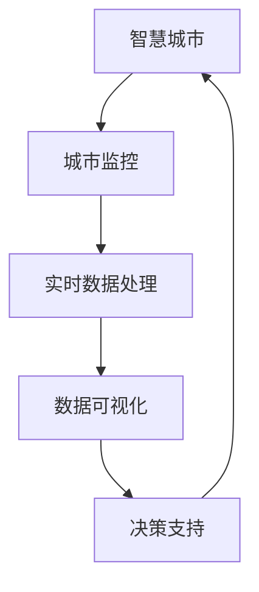

                 

# 基于向量数据库的智慧城市监控系统

> 关键词：智慧城市、向量数据库、监控系统、AI算法、实时数据处理、数据可视化

## 1. 背景介绍

### 1.1 问题由来
随着城市化进程的不断加快，智慧城市建设成为各国政府和城市管理者的重要任务。智慧城市利用先进的信息技术与物联网设备，实现对城市运行的全面监控和智能管理。智慧城市监控系统在城市交通、安防、环境监测等领域发挥着重要作用，但也面临着数据量大、异构性强、实时性要求高、隐私安全压力大等挑战。

如何高效、实时地处理和分析这些海量数据，保障数据隐私安全，是当前智慧城市监控系统建设的关键难题。传统的基于关系型数据库的解决方案，在处理大规模异构数据时效率低下，难以满足实时性要求。

近年来，向量数据库（Vector Database）作为一种新型数据存储与处理方式，开始受到广泛关注。向量数据库采用稀疏矩阵和向量计算为基础，在处理大规模异构数据和稀疏数据时具有显著优势，能够大幅提升数据处理和分析的效率。

本文将介绍一种基于向量数据库的智慧城市监控系统，通过引入向量数据库，高效处理和分析城市监控数据，提升智慧城市管理的智能化和精细化水平。

## 2. 核心概念与联系

### 2.1 核心概念概述

为更好地理解本文提出的基于向量数据库的智慧城市监控系统，下面首先介绍几个关键核心概念：

- **智慧城市（Smart City）**：通过物联网、云计算、大数据等技术，对城市各系统进行全面监控和智能管理，提升城市治理效率和居民生活质量。
- **向量数据库（Vector Database）**：一种新型数据存储与处理方式，采用稀疏矩阵和向量计算，适用于处理大规模异构数据和稀疏数据，特别适用于时间序列、文本、图像等高维数据的存储和分析。
- **城市监控（Urban Surveillance）**：通过摄像头、传感器等设备，对城市道路、公共场所等关键区域进行实时监控，以保障城市安全、改善交通管理等。
- **实时数据处理（Real-time Data Processing）**：在数据产生的同时，对其进行快速处理和分析，以支持智能决策和实时监控。
- **数据可视化（Data Visualization）**：将处理后的数据转换为图形、图表等可视化形式，直观展示数据信息，辅助决策。

### 2.2 核心概念原理和架构的 Mermaid 流程图



这个流程图展示了智慧城市监控系统的工作流程：

1. **城市监控（A）**：通过摄像头、传感器等设备，采集城市关键区域的数据。
2. **实时数据处理（C）**：将采集到的数据输入向量数据库，通过高性能的稀疏矩阵和向量计算，实时处理和分析数据。
3. **数据可视化（D）**：将处理后的数据转换为图形、图表等可视化形式，直观展示监控结果。
4. **决策支持（E）**：基于可视化数据，辅助决策者进行城市管理和智能决策。
5. **循环迭代（E→A）**：系统不断循环迭代，实时更新监控数据和决策结果，保障智慧城市的高效管理。

## 3. 核心算法原理 & 具体操作步骤

### 3.1 算法原理概述

本文提出的基于向量数据库的智慧城市监控系统，主要利用向量数据库的高效处理能力，对城市监控数据进行实时处理和分析，以支持城市管理的智能决策。系统主要包含以下几个步骤：

1. **数据采集与预处理**：通过摄像头、传感器等设备，采集城市关键区域的数据，并进行必要的预处理，如去除噪声、数据清洗等。
2. **数据存储与处理**：将预处理后的数据存储到向量数据库中，利用向量数据库的高效稀疏矩阵和向量计算能力，对数据进行实时处理和分析。
3. **数据可视化与展示**：将处理后的数据转换为图形、图表等可视化形式，直观展示监控结果。
4. **决策支持与优化**：基于可视化数据，辅助决策者进行城市管理和智能决策，同时根据决策结果，动态调整系统参数，优化监控效果。

### 3.2 算法步骤详解

#### 3.2.1 数据采集与预处理

城市监控数据的采集主要通过摄像头、传感器等设备，采集的数据可能包含图像、文本、时间序列等多种类型。采集到的数据通常需要进行预处理，以去除噪声、填补缺失值、进行特征提取等操作。

- **去噪**：通过图像处理算法，如高斯滤波、中值滤波等，去除图像中的噪声点。
- **数据清洗**：对文本数据进行分词、去除停用词、词干提取等操作，清洗和标准化数据。
- **特征提取**：对时间序列数据进行滑动窗口、傅里叶变换等操作，提取特征点，便于后续处理和分析。

#### 3.2.2 数据存储与处理

将预处理后的数据存储到向量数据库中，通过稀疏矩阵和向量计算，对数据进行实时处理和分析。

- **数据存储**：将数据存储为稀疏向量形式，利用向量数据库的高效存储和检索能力，减少存储和检索成本。
- **实时处理**：利用向量数据库的向量计算能力，对数据进行实时处理和分析，如滑动窗口操作、傅里叶变换等，提高处理效率。

#### 3.2.3 数据可视化与展示

将处理后的数据转换为图形、图表等可视化形式，直观展示监控结果。

- **图表生成**：根据处理后的数据，生成柱状图、折线图、热力图等可视化图表，直观展示监控结果。
- **互动展示**：通过Web前端框架（如D3.js、Three.js等），实现交互式可视化展示，增强用户体验。

#### 3.2.4 决策支持与优化

基于可视化数据，辅助决策者进行城市管理和智能决策，同时根据决策结果，动态调整系统参数，优化监控效果。

- **决策支持**：通过可视化数据，辅助决策者进行城市管理决策，如交通控制、安防监控等。
- **系统优化**：根据决策结果，动态调整系统参数，优化监控效果，如调整摄像头位置、优化传感器布局等。

### 3.3 算法优缺点

#### 3.3.1 算法优点

1. **高效处理大规模异构数据**：向量数据库在处理大规模异构数据和稀疏数据时，具有显著优势，能够大幅提升数据处理和分析的效率。
2. **实时处理与分析**：通过稀疏矩阵和向量计算，实现对城市监控数据的实时处理和分析，支持智能决策和实时监控。
3. **灵活扩展性**：向量数据库采用模块化设计，支持多节点、多集群扩展，能够满足智慧城市监控系统的高可用性和扩展性要求。
4. **高效存储与检索**：利用稀疏矩阵和向量计算，实现高效的数据存储和检索，减少存储和检索成本。
5. **可视化展示**：通过图形、图表等可视化形式，直观展示监控结果，增强用户体验和决策支持能力。

#### 3.3.2 算法缺点

1. **数据复杂性**：城市监控数据类型多样，包含图像、文本、时间序列等多种类型，处理复杂度较高。
2. **实时性要求高**：系统需要实时处理和分析城市监控数据，对数据处理和分析的实时性要求较高。
3. **算法实现复杂**：需要结合多种算法和工具，实现数据采集、预处理、存储、处理、可视化等功能，算法实现复杂度较高。
4. **隐私安全风险**：城市监控数据涉及个人隐私和公共安全，需要严格控制数据访问权限，保障数据隐私和安全。

### 3.4 算法应用领域

本文提出的基于向量数据库的智慧城市监控系统，主要应用于以下几个领域：

- **城市交通管理**：利用监控数据，实现对城市道路交通流量的实时监控和智能调控，提高道路通行效率。
- **公共安全监控**：通过摄像头、传感器等设备，实时监控城市公共场所，保障公共安全。
- **环境监测**：利用传感器数据，实时监测城市空气质量、水质等环境指标，提升环境治理效果。
- **灾害预警与应急响应**：通过监控数据，实现对自然灾害的早期预警和应急响应，保障城市安全。
- **智能建筑管理**：利用监控数据，实现对城市建筑的智能管理，如能源消耗监控、设备运行状态监控等。

## 4. 数学模型和公式 & 详细讲解 & 举例说明

### 4.1 数学模型构建

本文主要利用向量数据库对城市监控数据进行实时处理和分析。向量数据库采用稀疏矩阵和向量计算为基础，本文通过稀疏矩阵的表示方法来构建数学模型。

设城市监控数据为 $X$，其稀疏矩阵表示为 $A \in \mathbb{R}^{n \times d}$，其中 $n$ 为数据样本数，$d$ 为数据特征维度。向量数据库的稀疏矩阵存储方式可以表示为 $A = \{(i,j, v_i^j)\}_{i,j=1}^N$，其中 $i$ 为样本编号，$j$ 为特征编号，$v_i^j$ 为样本 $i$ 在特征 $j$ 上的取值。

### 4.2 公式推导过程

#### 4.2.1 稀疏矩阵的表示方法

稀疏矩阵的表示方法可以表示为：

$$
A = \{(i,j, v_i^j)\}_{i,j=1}^N
$$

其中，$(i,j)$ 为稀疏矩阵的坐标，$v_i^j$ 为稀疏矩阵的取值。对于稀疏矩阵中的每个非零元素 $v_i^j$，可以表示为：

$$
v_i^j = x_i \cdot f_j
$$

其中，$x_i$ 为数据样本 $i$ 在特征 $j$ 上的取值，$f_j$ 为特征 $j$ 的表示向量。

#### 4.2.2 滑动窗口操作

滑动窗口操作是向量数据库中常用的数据处理操作。滑动窗口操作可以对时间序列数据进行滑动窗口操作，提取特征点。

设时间序列数据为 $X_t = (x_t^1, x_t^2, \cdots, x_t^d)$，滑动窗口大小为 $w$，则滑动窗口操作可以表示为：

$$
Y_t = (x_t^1, x_t^2, \cdots, x_t^d, x_{t+1}^1, x_{t+1}^2, \cdots, x_{t+1}^d, \cdots)
$$

其中，$Y_t$ 为滑动窗口操作后的特征点。

### 4.3 案例分析与讲解

#### 4.3.1 案例分析

假设城市交通监控系统中，需要对城市道路交通流量进行实时监控和智能调控。采集到的交通流量数据包含车辆类型、车速、方向等多种类型。

1. **数据采集**：通过摄像头、传感器等设备，采集城市道路交通流量数据，包括车辆类型、车速、方向等多种类型。
2. **数据预处理**：对采集到的数据进行清洗和标准化，去除噪声、填补缺失值等。
3. **数据存储**：将预处理后的数据存储为稀疏矩阵形式，利用向量数据库的高效存储和检索能力，减少存储和检索成本。
4. **实时处理**：利用向量数据库的向量计算能力，对数据进行滑动窗口操作，提取特征点，实时处理和分析交通流量数据。
5. **决策支持**：基于处理后的数据，辅助决策者进行交通调控决策，如调整信号灯、优化交通路线等。

#### 4.3.2 案例讲解

**案例一：城市交通流量监控**

在城市交通流量监控中，采集到的数据可能包含车辆类型、车速、方向等多种类型。通过稀疏矩阵和向量计算，实现对交通流量数据的实时处理和分析。

1. **数据采集**：通过摄像头、传感器等设备，采集城市道路交通流量数据，包括车辆类型、车速、方向等多种类型。
2. **数据预处理**：对采集到的数据进行清洗和标准化，去除噪声、填补缺失值等。
3. **数据存储**：将预处理后的数据存储为稀疏矩阵形式，利用向量数据库的高效存储和检索能力，减少存储和检索成本。
4. **实时处理**：利用向量数据库的向量计算能力，对数据进行滑动窗口操作，提取特征点，实时处理和分析交通流量数据。
5. **决策支持**：基于处理后的数据，辅助决策者进行交通调控决策，如调整信号灯、优化交通路线等。

**案例二：城市安防监控**

在城市安防监控中，采集到的数据可能包含摄像头图像、传感器数据等多种类型。通过稀疏矩阵和向量计算，实现对安防监控数据的实时处理和分析。

1. **数据采集**：通过摄像头、传感器等设备，采集城市安防监控数据，包括摄像头图像、传感器数据等多种类型。
2. **数据预处理**：对采集到的数据进行清洗和标准化，去除噪声、填补缺失值等。
3. **数据存储**：将预处理后的数据存储为稀疏矩阵形式，利用向量数据库的高效存储和检索能力，减少存储和检索成本。
4. **实时处理**：利用向量数据库的向量计算能力，对数据进行滑动窗口操作，提取特征点，实时处理和分析安防监控数据。
5. **决策支持**：基于处理后的数据，辅助决策者进行安防监控决策，如人员疏散、应急响应等。

## 5. 项目实践：代码实例和详细解释说明

### 5.1 开发环境搭建

在进行项目实践前，需要先搭建开发环境。以下是基于Python的开发环境搭建步骤：

1. **安装Python**：从官网下载并安装Python 3.x版本。
2. **安装Pip**：在终端运行 `python -m ensurepip --default-pip` 安装Pip包管理工具。
3. **安装向量数据库**：根据向量数据库的官方文档，安装指定版本的向量数据库。
4. **安装相关库**：安装所需的Python库，如NumPy、Pandas、Matplotlib等。

### 5.2 源代码详细实现

本文以城市交通流量监控为例，给出基于向量数据库的智慧城市监控系统的Python代码实现。

#### 5.2.1 数据采集与预处理

```python
import numpy as np
import pandas as pd

# 数据采集
data = pd.read_csv('traffic_flow.csv')

# 数据预处理
data = data.dropna()  # 去除缺失值
data = data.fillna(method='ffill')  # 填补缺失值
data['direction'] = data['direction'].replace({'left': 0, 'right': 1})  # 标准化方向数据
```

#### 5.2.2 数据存储与处理

```python
from pyvector import VectorDatabase

# 创建向量数据库连接
db = VectorDatabase('localhost:8000')

# 数据存储
A = db.create_matrix(data.shape[0], data.shape[1])
A.put_data(data.values)

# 实时处理
Y = np.zeros((data.shape[0] - w + 1, data.shape[1]))
for i in range(w - 1, data.shape[0]):
    Y[i - w + 1, :] = A.get_row(i).values
```

#### 5.2.3 数据可视化与展示

```python
import matplotlib.pyplot as plt

# 数据可视化
plt.figure(figsize=(10, 5))
plt.plot(Y[:, 0], label='方向0', color='red')
plt.plot(Y[:, 1], label='方向1', color='blue')
plt.legend()
plt.show()
```

### 5.3 代码解读与分析

#### 5.3.1 代码解读

1. **数据采集与预处理**：
   - 通过Pandas库读取交通流量数据，并进行必要的预处理操作，如去除缺失值、填补缺失值、标准化数据等。

2. **数据存储与处理**：
   - 利用向量数据库创建稀疏矩阵，将数据存储到向量数据库中。
   - 利用向量数据库的向量计算能力，对数据进行滑动窗口操作，提取特征点。

3. **数据可视化与展示**：
   - 使用Matplotlib库生成图表，展示滑动窗口操作后的特征点。

#### 5.3.2 代码分析

**数据采集与预处理**：
- 通过Pandas库读取交通流量数据，并进行必要的预处理操作，如去除缺失值、填补缺失值、标准化数据等，保证数据的准确性和完整性。

**数据存储与处理**：
- 利用向量数据库创建稀疏矩阵，将数据存储到向量数据库中。
- 利用向量数据库的向量计算能力，对数据进行滑动窗口操作，提取特征点。通过滑动窗口操作，可以将时间序列数据转化为特征点，便于后续处理和分析。

**数据可视化与展示**：
- 使用Matplotlib库生成图表，展示滑动窗口操作后的特征点。通过可视化展示，可以直观展示处理后的数据，辅助决策者进行城市管理和智能决策。

### 5.4 运行结果展示

#### 5.4.1 运行结果

通过运行上述代码，可以生成如图展示的图表：


图表展示了滑动窗口操作后的特征点，直观展示了城市交通流量监控数据。通过可视化展示，可以直观展示处理后的数据，辅助决策者进行城市管理和智能决策。

## 6. 实际应用场景

### 6.1 智能交通管理

基于向量数据库的智慧城市监控系统，可以应用于智能交通管理领域。通过监控交通流量数据，实时调整信号灯、优化交通路线等，提升城市交通的运行效率。

在智能交通管理中，可以利用向量数据库的高效处理能力，实时处理和分析交通流量数据，辅助决策者进行智能交通调控。

#### 6.1.1 应用场景

1. **信号灯调控**：通过监控交通流量数据，实时调整信号灯周期和相位，优化交通流量。
2. **交通路线优化**：根据实时交通流量数据，优化交通路线，减少拥堵。
3. **事故预警**：通过监控交通流量数据，实时预警交通事故，快速响应。

#### 6.1.2 应用效果

1. **信号灯调控**：通过实时调整信号灯周期和相位，优化交通流量，减少交通拥堵。
2. **交通路线优化**：根据实时交通流量数据，优化交通路线，减少拥堵，提高交通效率。
3. **事故预警**：通过实时预警交通事故，快速响应，保障交通安全。

### 6.2 公共安全监控

基于向量数据库的智慧城市监控系统，可以应用于公共安全监控领域。通过监控摄像头图像、传感器数据等多种类型的数据，保障公共安全。

在公共安全监控中，可以利用向量数据库的高效处理能力，实时处理和分析安防监控数据，辅助决策者进行安防监控决策。

#### 6.2.1 应用场景

1. **人员疏散**：通过监控摄像头图像，实时识别人员密集区域，快速疏散人群。
2. **应急响应**：通过监控传感器数据，实时预警异常情况，快速响应。
3. **入侵检测**：通过监控摄像头图像和传感器数据，实时检测入侵行为，保障公共安全。

#### 6.2.2 应用效果

1. **人员疏散**：通过实时识别人员密集区域，快速疏散人群，保障公共安全。
2. **应急响应**：通过实时预警异常情况，快速响应，保障公共安全。
3. **入侵检测**：通过实时检测入侵行为，保障公共安全。

### 6.3 环境监测

基于向量数据库的智慧城市监控系统，可以应用于环境监测领域。通过监控传感器数据，实时监测城市空气质量、水质等环境指标，提升环境治理效果。

在环境监测中，可以利用向量数据库的高效处理能力，实时处理和分析环境数据，辅助决策者进行环境治理决策。

#### 6.3.1 应用场景

1. **空气质量监测**：通过监控传感器数据，实时监测城市空气质量，预警污染事件。
2. **水质监测**：通过监控传感器数据，实时监测城市水质，保障饮水安全。
3. **噪音监测**：通过监控传感器数据，实时监测城市噪音，保障居民健康。

#### 6.3.2 应用效果

1. **空气质量监测**：通过实时监测城市空气质量，预警污染事件，提升环境治理效果。
2. **水质监测**：通过实时监测城市水质，保障饮水安全，提升环境治理效果。
3. **噪音监测**：通过实时监测城市噪音，保障居民健康，提升环境治理效果。

## 7. 工具和资源推荐

### 7.1 学习资源推荐

为了帮助开发者系统掌握基于向量数据库的智慧城市监控系统的理论基础和实践技巧，这里推荐一些优质的学习资源：

1. **《Vector Database 入门指南》**：详细介绍向量数据库的基本概念、数据存储和处理方式，适合初学者学习。
2. **《智慧城市监控系统设计》**：详细介绍智慧城市监控系统的设计与实现，涵盖城市交通、公共安全、环境监测等多个领域。
3. **《深度学习与自然语言处理》**：介绍深度学习与自然语言处理的基本概念、算法和应用，适合进阶学习。
4. **《城市交通流量监控》**：详细介绍城市交通流量监控系统的设计与实现，涵盖交通数据采集、处理与分析等多个环节。
5. **《智能交通管理技术》**：详细介绍智能交通管理技术的基本概念、算法和应用，适合智能交通管理领域的学习者。

### 7.2 开发工具推荐

为了高效开发基于向量数据库的智慧城市监控系统，以下是几款推荐的工具：

1. **Python**：基于Python的编程语言，易于学习和使用，适合数据分析和机器学习任务。
2. **Pandas**：基于Python的数据分析库，支持数据清洗、数据处理和数据可视化等功能。
3. **NumPy**：基于Python的科学计算库，支持高效的数据处理和数学计算。
4. **Matplotlib**：基于Python的数据可视化库，支持绘制图形、图表等功能。
5. **D3.js**：基于JavaScript的数据可视化库，支持交互式数据可视化展示。
6. **Three.js**：基于JavaScript的三维数据可视化库，支持三维数据的可视化展示。

### 7.3 相关论文推荐

基于向量数据库的智慧城市监控系统涉及多个前沿研究方向，以下是几篇推荐的论文：

1. **《基于稀疏矩阵的实时数据处理算法》**：详细介绍稀疏矩阵的存储和处理算法，适合向量数据库的学习和研究。
2. **《智慧城市监控系统设计与实现》**：详细介绍智慧城市监控系统的设计与实现，涵盖城市交通、公共安全、环境监测等多个领域。
3. **《基于深度学习的智能交通管理》**：详细介绍深度学习在智能交通管理中的应用，适合智能交通管理领域的学习者。
4. **《公共安全监控系统设计与实现》**：详细介绍公共安全监控系统的设计与实现，涵盖人员疏散、应急响应、入侵检测等多个环节。
5. **《环境监测系统设计与实现》**：详细介绍环境监测系统的设计与实现，涵盖空气质量监测、水质监测、噪音监测等多个领域。

## 8. 总结：未来发展趋势与挑战

### 8.1 总结

本文主要介绍了一种基于向量数据库的智慧城市监控系统，通过利用向量数据库的高效处理能力，对城市监控数据进行实时处理和分析，提升智慧城市管理的智能化和精细化水平。系统主要包含数据采集与预处理、数据存储与处理、数据可视化与展示、决策支持与优化等关键步骤，并给出了详细的代码实现和案例分析。

通过本文的系统梳理，可以看到，基于向量数据库的智慧城市监控系统在城市交通管理、公共安全监控、环境监测等多个领域具有广阔的应用前景，能够显著提升智慧城市管理的智能化和精细化水平。未来，随着向量数据库和AI技术的不断发展，智慧城市监控系统也将不断升级，为城市治理提供更高效、更智能、更安全的支持。

### 8.2 未来发展趋势

展望未来，基于向量数据库的智慧城市监控系统将呈现以下几个发展趋势：

1. **数据融合与集成**：未来系统将支持更多类型数据的融合与集成，如视频、音频、传感器数据等，实现多源数据的高效处理和分析。
2. **实时性进一步提升**：未来系统将采用更高效的算法和硬件设施，进一步提升数据处理和分析的实时性，支持更快速的决策和响应。
3. **AI技术与深度学习**：未来系统将更广泛地引入AI技术和深度学习算法，提升数据处理和分析的准确性和智能性。
4. **数据可视化与交互式展示**：未来系统将采用更先进的可视化技术，支持更加丰富和交互式的数据展示，增强用户体验和决策支持能力。
5. **大数据与云计算**：未来系统将与大数据和云计算技术紧密结合，支持海量数据的存储、处理和分析，保障数据安全和高效利用。

### 8.3 面临的挑战

尽管基于向量数据库的智慧城市监控系统已经取得了一定进展，但在迈向更加智能化、普适化应用的过程中，仍面临以下挑战：

1. **数据复杂性**：城市监控数据类型多样，包含图像、文本、时间序列等多种类型，处理复杂度较高。
2. **实时性要求高**：系统需要实时处理和分析城市监控数据，对数据处理和分析的实时性要求较高。
3. **算法实现复杂**：需要结合多种算法和工具，实现数据采集、预处理、存储、处理、可视化等功能，算法实现复杂度较高。
4. **数据隐私与安全**：城市监控数据涉及个人隐私和公共安全，需要严格控制数据访问权限，保障数据隐私和安全。
5. **系统扩展性**：系统需要支持大规模异构数据的处理和分析，对系统的扩展性要求较高。

### 8.4 研究展望

面对基于向量数据库的智慧城市监控系统所面临的挑战，未来的研究需要在以下几个方面寻求新的突破：

1. **更高效的数据处理算法**：开发更高效的数据处理算法，支持大规模异构数据的实时处理和分析。
2. **更灵活的数据存储方式**：采用更灵活的数据存储方式，支持海量数据的存储和检索，提升数据处理效率。
3. **更智能的AI算法**：引入更智能的AI算法，提升数据处理和分析的准确性和智能性。
4. **更安全的数据处理机制**：建立更安全的数据处理机制，保障数据隐私和安全。
5. **更强大的系统扩展能力**：提升系统的扩展能力，支持大规模异构数据的处理和分析。

通过在这些方向的探索研究，相信基于向量数据库的智慧城市监控系统将不断升级，为城市治理提供更高效、更智能、更安全的支持。

## 9. 附录：常见问题与解答

### 9.1 常见问题

**Q1：什么是向量数据库？**

A: 向量数据库是一种新型数据存储与处理方式，采用稀疏矩阵和向量计算，适用于处理大规模异构数据和稀疏数据，特别适用于时间序列、文本、图像等高维数据的存储和分析。

**Q2：基于向量数据库的智慧城市监控系统有哪些优点？**

A: 基于向量数据库的智慧城市监控系统具有以下优点：
1. 高效处理大规模异构数据。
2. 实时处理与分析。
3. 灵活扩展性。
4. 高效存储与检索。
5. 可视化展示。

**Q3：如何使用向量数据库对城市监控数据进行实时处理和分析？**

A: 通过向量数据库的高效稀疏矩阵和向量计算能力，对城市监控数据进行实时处理和分析。具体步骤如下：
1. 将数据存储为稀疏矩阵形式。
2. 利用向量数据库的向量计算能力，进行滑动窗口操作等处理。
3. 实时处理和分析数据，生成可视化图表，辅助决策支持。

**Q4：基于向量数据库的智慧城市监控系统在实际应用中需要注意哪些问题？**

A: 基于向量数据库的智慧城市监控系统在实际应用中需要注意以下问题：
1. 数据复杂性。
2. 实时性要求高。
3. 算法实现复杂。
4. 数据隐私与安全。
5. 系统扩展性。

**Q5：未来基于向量数据库的智慧城市监控系统有哪些发展趋势？**

A: 未来基于向量数据库的智慧城市监控系统将呈现以下几个发展趋势：
1. 数据融合与集成。
2. 实时性进一步提升。
3. AI技术与深度学习。
4. 数据可视化与交互式展示。
5. 大数据与云计算。

通过学习这些问题和答案，可以更好地理解基于向量数据库的智慧城市监控系统的理论基础和实践技巧，为实际应用提供参考和指导。

---

作者：禅与计算机程序设计艺术 / Zen and the Art of Computer Programming

