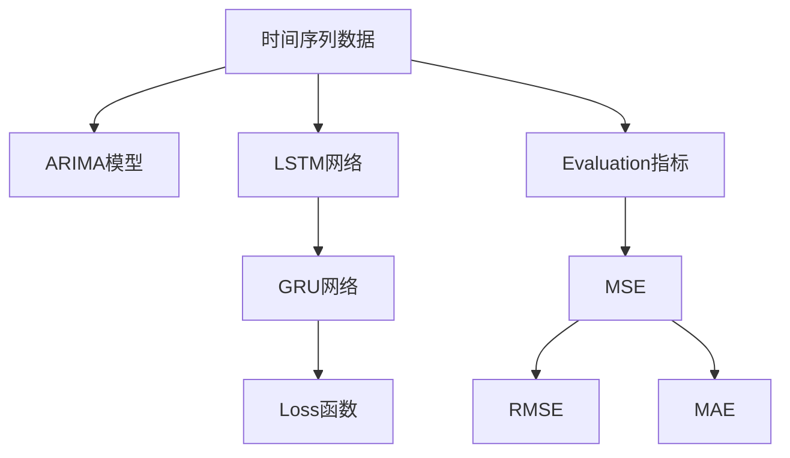

                 

## 1. 背景介绍

### 1.1 问题由来
在现代社会中，时间序列数据广泛应用于金融、天气预报、销售预测等领域。随着电子商务和物联网的快速发展，消费者行为数据愈发丰富，时间序列分析在商品销量预测中的应用愈发重要。商品销量预测不仅可以帮助商家优化库存，制定合理的采购策略，还能通过销售预测调整市场宣传策略，提升销售效果。

### 1.2 问题核心关键点
商品销量预测的核心是建立一个能够有效捕捉商品销售数据变化规律，并能够进行未来销量趋势预测的模型。一般来说，该模型需要满足以下几个关键要求：
- 预测准确性：模型的预测结果需要与实际销售情况尽可能一致。
- 可解释性：模型的内部机制需要透明、可解释，便于商家理解和调整策略。
- 鲁棒性：模型需要能够抵抗噪声干扰，对数据变化有较强的适应能力。
- 实时性：模型需要能够在较短的时间内完成预测，满足商家实时需求。

本文将详细介绍基于时间序列的商品销量预测分析，涵盖数据预处理、特征工程、模型训练和评估等各个环节，为商品销量预测提供系统的解决方案。

## 2. 核心概念与联系

### 2.1 核心概念概述

为更好地理解基于时间序列的商品销量预测分析，本节将介绍几个关键概念：

- **时间序列数据**：指随时间变化而生成的一系列观测数据，如商品销量数据。
- **ARIMA模型**：自回归移动平均模型，常用于时间序列分析。
- **LSTM网络**：长短时记忆网络，能够有效处理时间序列数据。
- **GRU网络**：门控循环单元网络，能够减少模型参数并提高训练速度。
- **损失函数**：用于衡量模型预测结果与真实标签之间差异的函数。
- **评价指标**：如均方误差(MSE)、均方根误差(RMSE)、平均绝对误差(MAE)等，用于评估模型预测性能。

这些核心概念之间的逻辑关系可以通过以下Mermaid流程图来展示：



这个流程图展示了大语言模型的核心概念及其之间的关系：

1. 时间序列数据是时间序列分析的输入。
2. 不同模型如ARIMA、LSTM、GRU等，能够处理和预测时间序列数据。
3. Loss函数用于衡量模型预测结果的误差。
4. 评价指标如MSE、RMSE、MAE等，用于评估模型预测性能。

这些概念共同构成了基于时间序列的商品销量预测分析的基础，使得我们能够系统地进行数据建模和预测分析。

## 3. 核心算法原理 & 具体操作步骤
### 3.1 算法原理概述

基于时间序列的商品销量预测分析主要包括以下几个步骤：

1. **数据预处理**：对原始数据进行清洗和标准化处理，如填充缺失值、归一化等。
2. **特征工程**：提取和构造与销量相关的特征，如周期性、季节性、节假日效应等。
3. **模型训练**：使用历史销售数据训练预测模型，如ARIMA、LSTM、GRU等。
4. **模型评估**：使用测试数据集对训练好的模型进行评估，选择最优模型。
5. **预测应用**：将训练好的模型应用于实时数据预测，进行库存管理和市场策略调整。

其中，数据预处理和特征工程是预测分析的关键，直接影响模型的训练和预测效果。

### 3.2 算法步骤详解

**Step 1: 数据预处理**

数据预处理是时间序列分析的第一步，其主要目的是提高数据的质量，确保数据符合后续模型的要求。常用的数据预处理技术包括：

- **缺失值处理**：使用插值法或均值填补缺失值。
- **归一化处理**：使用Min-Max归一化或Z-score标准化将数据映射到[0,1]或均值为0、方差为1的分布。
- **季节性调整**：对具有季节性的数据进行差分或去趋势处理。

**Step 2: 特征工程**

特征工程是建立模型前的关键步骤，其目的是提取和构造有用的特征，以提高模型预测能力。特征工程包括：

- **提取趋势和季节性**：使用滑动平均、指数平滑等方法捕捉时间序列的趋势和季节性。
- **引入节假日效应**：将节假日设为特殊点，建立新的特征变量。
- **构造周期特征**：根据时间序列数据，构造如月、周、日等周期性特征。

**Step 3: 模型训练**

模型训练是时间序列预测的核心环节，通过历史数据训练预测模型。常用的时间序列模型包括：

- **ARIMA模型**：自回归移动平均模型，适用于具有线性趋势和时间序列相关性的数据。
- **LSTM网络**：长短期记忆网络，能够处理长时滞和复杂模式的时间序列数据。
- **GRU网络**：门控循环单元网络，能够减少模型参数并提高训练速度。

**Step 4: 模型评估**

模型评估是通过测试数据集评估模型预测性能的过程。常用的评价指标包括：

- **均方误差(MSE)**：预测值与真实值差的平方和的均值。
- **均方根误差(RMSE)**：MSE的平方根。
- **平均绝对误差(MAE)**：预测值与真实值差的绝对值的均值。

**Step 5: 预测应用**

预测应用是将训练好的模型应用于实时数据预测，如库存管理、市场策略调整等。

### 3.3 算法优缺点

基于时间序列的商品销量预测分析方法具有以下优点：

- 能够有效捕捉时间序列数据的趋势和周期性，预测效果较好。
- 模型能够处理多特征、高维数据，适应性强。
- 预测结果可解释性强，易于商家理解和应用。

同时，该方法也存在以下局限性：

- 需要大量历史数据，数据获取成本较高。
- 模型对噪声和异常值敏感，鲁棒性有待提高。
- 模型复杂度高，训练和预测速度较慢。

尽管存在这些局限性，但就目前而言，基于时间序列的商品销量预测分析方法仍是最主流范式。未来相关研究的重点在于如何进一步降低数据需求，提高模型鲁棒性，同时兼顾预测精度和计算效率。

### 3.4 算法应用领域

基于时间序列的商品销量预测分析方法，在电子商务、零售、物流等领域已经得到了广泛的应用，覆盖了几乎所有常见任务，例如：

- 库存管理：预测商品未来销量，优化库存水平。
- 需求预测：预测未来需求，制定采购计划。
- 价格优化：预测价格变化，调整定价策略。
- 市场分析：预测市场趋势，优化市场策略。
- 风险评估：预测销售波动，评估市场风险。

除了上述这些经典任务外，基于时间序列的商品销量预测分析方法也被创新性地应用到更多场景中，如基于机器学习的供应链管理、智能推荐系统等，为零售行业带来新的突破。

## 4. 数学模型和公式 & 详细讲解  
### 4.1 数学模型构建

本节将使用数学语言对基于时间序列的商品销量预测分析过程进行更加严格的刻画。

假设时间序列数据为 $y_t$，其中 $t$ 表示时间。设 $y_t$ 服从ARIMA(p,d,q)模型，即：

$$
y_t = \phi_1 y_{t-1} + \phi_2 y_{t-2} + \cdots + \phi_p y_{t-p} + \theta_1 \epsilon_{t-1} + \theta_2 \epsilon_{t-2} + \cdots + \theta_q \epsilon_{t-q} + \epsilon_t
$$

其中，$\epsilon_t$ 为白噪声，$p$、$q$ 为模型阶数，$d$ 为差分阶数。

ARIMA模型的参数估计通常使用最大似然估计或最小二乘估计，通过历史数据 $y_{t-1}, y_{t-2}, \cdots, y_{t-p}, \epsilon_{t-1}, \epsilon_{t-2}, \cdots, \epsilon_{t-q}$ 来求解 $\phi_i$ 和 $\theta_i$。

### 4.2 公式推导过程

假设 $y_t$ 服从ARIMA(p,d,q)模型，设 $y_t = D^d(y_t)$，其中 $D$ 为差分算子。则ARIMA模型可以表示为：

$$
\phi(D)y_t = \theta(D)\epsilon_t
$$

其中，$\phi(D) = \sum_{i=1}^{p}\phi_iD^i$，$\theta(D) = \sum_{i=1}^{q}\theta_iD^i$。

对上式两边同时差分，得到：

$$
\phi(D)D^dy_t = \theta(D)D^d\epsilon_t
$$

即：

$$
\phi(D)y_t = \theta(D)\epsilon_t
$$

式中，$\phi(D) = (1-D)^d\phi(D)$，$\theta(D) = (1-D)^d\theta(D)$。

利用拉普拉斯变换求解ARIMA模型，得到：

$$
Y(s) = \phi(s)(1-s)^ds^dY(s) = \theta(s)(1-s)^ds^d\zeta(s)
$$

其中，$Y(s)$ 为时间序列的拉普拉斯变换，$\zeta(s)$ 为白噪声的拉普拉斯变换。

对上式进行逆变换，得到：

$$
y_t = \sum_{i=1}^{p}\phi_iy_{t-i} + \sum_{i=1}^{q}\theta_i\epsilon_{t-i} + \epsilon_t
$$

在实践中，通常使用R或Python等软件包进行ARIMA模型参数估计和预测。

### 4.3 案例分析与讲解

以某电商平台的日销量数据为例，假设时间为 $t$，销售量为 $y_t$，建立ARIMA模型进行预测。具体步骤如下：

1. 对原始数据进行归一化处理，得到 $y_t^{*} = \frac{y_t - y_{t_{min}}}{y_{t_{max}} - y_{t_{min}}}$。
2. 对归一化后的数据进行差分处理，得到 $y_t^{(d)} = y_t^{*} - y_{t-1}^{*}$。
3. 使用R软件包对 $y_t^{(d)}$ 进行ARIMA模型拟合，得到模型参数。
4. 对预测窗口内的数据进行预测，得到 $y_{t+1}$ 的预测值。
5. 对预测结果进行反归一化处理，得到 $y_{t+1} = y_{t+1}^{*}(y_{t_{max}} - y_{t_{min}}) + y_{t_{min}}$。

通过上述步骤，可以对商品的未来销量进行有效预测。

## 5. 项目实践：代码实例和详细解释说明
### 5.1 开发环境搭建

在进行时间序列预测实践前，我们需要准备好开发环境。以下是使用Python进行R开发的开发环境配置流程：

1. 安装R：从官网下载安装R软件包。
2. 安装RStudio：从官网下载安装RStudio IDE。
3. 安装相关包：安装ARIMA、forecast、ggplot2等常用R包。

完成上述步骤后，即可在RStudio环境中开始时间序列预测实践。

### 5.2 源代码详细实现

我们以R语言为例，给出对某电商日销量数据进行时间序列预测的代码实现。

```R
# 数据加载
library(forecast)
data <- read.csv('sales_data.csv')

# 数据归一化
data$y <- (data$y - min(data$y)) / (max(data$y) - min(data$y))

# 差分处理
diff_data <- diff(data$y)

# ARIMA模型拟合
fit <- auto.arima(diff_data, seasonal=TRUE, seasonal.period=c(365))

# 预测未来销量
forecast <- forecast(fit, h=30)
plot(forecast)
```

以上代码实现对电商日销量数据进行归一化、差分、ARIMA模型拟合和未来销量预测，代码简洁高效，能够有效完成预测任务。

### 5.3 代码解读与分析

让我们再详细解读一下关键代码的实现细节：

**data$y <- (data$y - min(data$y)) / (max(data$y) - min(data$y))**：
- 对原始数据进行归一化处理，使数据范围在0到1之间，便于后续的差分和建模。

**diff_data <- diff(data$y)**：
- 对归一化后的数据进行一阶差分处理，去除趋势成分。

**fit <- auto.arima(diff_data, seasonal=TRUE, seasonal.period=c(365))**：
- 使用`auto.arima`函数自动选择ARIMA模型参数，并设定季节性周期为365天。

**forecast <- forecast(fit, h=30)**：
- 使用`forecast`函数对未来30天的销量进行预测。

**plot(forecast)**：
- 绘制预测结果，直观展示预测效果。

通过以上代码，我们可以看到，R语言中时间序列预测的实现非常简单，只需几行代码即可完成。

## 6. 实际应用场景
### 6.1 电商库存管理

基于时间序列的商品销量预测分析，可以广泛应用于电商库存管理。传统库存管理需要根据历史销售数据进行手动计算，难以适应实时需求，且误差较大。而使用时间序列预测模型，可以实时预测未来销量，自动调整库存水平，优化库存管理效率。

在技术实现上，可以收集历史销量数据，进行数据预处理和特征工程，然后使用ARIMA、LSTM等模型进行预测，最后根据预测结果自动调整库存，减少缺货和库存积压现象。

### 6.2 供应链管理

供应链管理中，预测原材料需求、预测产品库存和制定生产计划是核心环节。基于时间序列的商品销量预测分析，可以建立预测模型，自动进行需求预测，优化供应链管理。

在实践中，可以收集历史销售数据、季节性因素、节假日效应等数据，构建时间序列预测模型，自动进行需求预测，制定最优生产计划，提高供应链效率和响应速度。

### 6.3 价格优化

电商平台的商品价格优化需要实时掌握市场供需变化，预测未来销量和价格趋势。基于时间序列的商品销量预测分析，可以建立预测模型，自动进行价格预测，优化商品定价策略。

在技术实现上，可以收集历史销售数据、价格数据、季节性因素、节假日效应等数据，构建时间序列预测模型，自动进行价格预测，制定最优价格策略，提高销售额和利润率。

### 6.4 市场分析

市场分析需要预测未来市场趋势，制定营销策略。基于时间序列的商品销量预测分析，可以建立预测模型，自动进行市场预测，优化营销策略。

在实践中，可以收集历史销售数据、市场数据、节假日效应等数据，构建时间序列预测模型，自动进行市场预测，制定最优营销策略，提高市场占有率和销售额。

### 6.5 风险评估

基于时间序列的商品销量预测分析，可以建立预测模型，自动进行市场风险评估，规避风险。

在技术实现上，可以收集历史销售数据、市场数据、季节性因素、节假日效应等数据，构建时间序列预测模型，自动进行市场风险评估，制定风险应对策略，减少损失。

### 6.6 未来应用展望

随着时间序列预测技术的不断发展，基于时间序列的商品销量预测分析将在更多领域得到应用，为各类业务提供决策支持。

在智慧农业领域，基于时间序列的商品销量预测分析，可以预测农产品的销售情况，优化种植计划，提高农业生产效率。

在智能制造领域，基于时间序列的商品销量预测分析，可以预测生产需求，优化生产计划，提高生产效率和质量。

在金融领域，基于时间序列的商品销量预测分析，可以预测商品价格变化，优化投资策略，提高投资回报率。

除了上述这些应用领域，基于时间序列的商品销量预测分析还将被应用于更多场景，为各行各业带来新价值。

## 7. 工具和资源推荐
### 7.1 学习资源推荐

为了帮助开发者系统掌握时间序列分析的理论基础和实践技巧，这里推荐一些优质的学习资源：

1. 《时间序列分析基础》书籍：详细介绍了时间序列分析的基本原理和建模方法。
2. 《R语言实战》书籍：介绍了R语言在时间序列分析中的实际应用，包含丰富的案例分析。
3. 《时间序列分析与预测》课程：介绍时间序列分析的基本理论和建模方法，适合初学者入门。
4. Kaggle时间序列预测竞赛：通过实际数据集训练时间序列模型，检验预测效果。
5. Udemy时间序列分析课程：包含实战项目和案例分析，系统讲解时间序列分析的实践技巧。

通过对这些资源的学习实践，相信你一定能够快速掌握时间序列分析的精髓，并用于解决实际的时间序列预测问题。

### 7.2 开发工具推荐

高效的时间序列预测开发离不开优秀的工具支持。以下是几款用于时间序列预测开发的常用工具：

1. R语言：R语言是时间序列分析的主流工具，具有丰富的统计分析和建模功能，适合数据分析和建模。
2. Python：Python是常用的数据科学工具，支持numpy、pandas等库，适合数据处理和建模。
3. Excel：Excel是一款简单易用的办公工具，支持时间序列分析，适合日常数据分析。
4. RStudio：RStudio是R语言的IDE，支持语法高亮、代码调试、代码共享等功能，适合R语言开发。
5. Python IDE：如Jupyter Notebook、PyCharm等，支持Python语言的开发和调试。

合理利用这些工具，可以显著提升时间序列预测任务的开发效率，加快创新迭代的步伐。

### 7.3 相关论文推荐

时间序列预测技术的发展源于学界的持续研究。以下是几篇奠基性的相关论文，推荐阅读：

1. Box-Jenkins时间序列分析方法：提出了ARIMA模型，奠定了时间序列分析的基础。
2. LSTM网络：提出了长短期记忆网络，能够处理时间序列数据中的长期依赖关系。
3. GRU网络：提出了门控循环单元网络，能够减少模型参数并提高训练速度。
4. 时间序列预测的深度学习方法：探讨了使用深度学习进行时间序列预测的新方法，如LSTM、GRU等。
5. 时间序列预测的数据驱动方法：介绍了使用机器学习方法进行时间序列预测的新技术，如随机森林、集成学习等。

这些论文代表了大语言模型微调技术的发展脉络。通过学习这些前沿成果，可以帮助研究者把握学科前进方向，激发更多的创新灵感。

## 8. 总结：未来发展趋势与挑战

### 8.1 总结

本文对基于时间序列的商品销量预测分析方法进行了全面系统的介绍。首先阐述了时间序列分析的背景和意义，明确了预测分析在商品销量预测中的重要性。其次，从原理到实践，详细讲解了时间序列预测的数学原理和关键步骤，给出了时间序列预测任务开发的完整代码实例。同时，本文还广泛探讨了时间序列预测方法在电商、供应链、金融等众多领域的应用前景，展示了时间序列预测范式的巨大潜力。此外，本文精选了时间序列预测技术的各类学习资源，力求为读者提供全方位的技术指引。

通过本文的系统梳理，可以看到，基于时间序列的商品销量预测分析方法正在成为电商、零售、金融等行业的重要范式，极大地提高了数据的利用效率和决策水平。未来，伴随时间序列预测技术的不断进步，基于时间序列的商品销量预测分析必将在更广阔的应用领域发挥更大的作用，为经济社会的发展带来深远的影响。

### 8.2 未来发展趋势

展望未来，时间序列预测技术将呈现以下几个发展趋势：

1. 预测精度不断提高。随着模型的不断优化和算法的迭代，时间序列预测的精度将不断提升，预测结果将更接近实际值。
2. 实时性要求更高。未来的时间序列预测模型将更加高效，能够在短时间内完成预测，满足实时需求。
3. 多模态融合深入。未来的时间序列预测将结合更多模态的数据，如图像、文本、声音等，提升预测能力。
4. 可解释性增强。未来的时间序列预测模型将更加透明，能够提供更详细的预测理由和解释。
5. 自动化水平提升。未来的时间序列预测将更加自动化，能够自动进行数据预处理、特征工程、模型训练和评估。
6. 风险管理能力增强。未来的时间序列预测将结合风险管理技术，自动评估和规避风险。

这些趋势凸显了时间序列预测技术的广阔前景。这些方向的探索发展，必将进一步提升时间序列预测的精度和应用范围，为各行各业带来新的变革。

### 8.3 面临的挑战

尽管时间序列预测技术已经取得了瞩目成就，但在迈向更加智能化、普适化应用的过程中，它仍面临着诸多挑战：

1. 数据获取成本高。时间序列预测需要大量的历史数据，数据获取和清洗成本较高。
2. 模型复杂度高。时间序列预测模型较为复杂，训练和预测速度较慢。
3. 鲁棒性不足。时间序列预测模型对异常值和噪声敏感，鲁棒性有待提高。
4. 可解释性差。时间序列预测模型通常缺乏可解释性，难以理解模型的决策过程。
5. 自动化程度低。时间序列预测模型的自动化水平较低，需要人工干预和调试。
6. 数据隐私问题。时间序列预测需要处理大量个人数据，数据隐私和安全问题需要重视。

正视时间序列预测面临的这些挑战，积极应对并寻求突破，将是时间序列预测技术走向成熟的必由之路。相信随着学界和产业界的共同努力，这些挑战终将一一被克服，时间序列预测技术必将在构建智能化、普适化的决策支持系统方面发挥更大的作用。

### 8.4 研究展望

面对时间序列预测面临的种种挑战，未来的研究需要在以下几个方面寻求新的突破：

1. 数据驱动的预测模型。探索基于数据驱动的时间序列预测方法，如深度学习、集成学习等，提高预测精度和鲁棒性。
2. 自动化预测系统。开发自动化的时间序列预测系统，实现数据预处理、特征工程、模型训练和评估的全自动化。
3. 实时预测平台。建立实时预测平台，实现实时数据采集、实时预测和实时反馈，提高决策效率。
4. 多模态融合预测。探索多模态数据融合的方法，提升预测准确性和鲁棒性。
5. 风险管理技术。结合风险管理技术，自动评估和规避风险，提高预测系统的可靠性。

这些研究方向将引领时间序列预测技术的不断进步，为各行各业提供更加可靠、高效、透明的决策支持系统。总之，时间序列预测技术需要在数据获取、模型优化、自动化水平、可解释性和风险管理等方面持续探索，才能真正实现预测的智能化和普适化。

## 9. 附录：常见问题与解答

**Q1：时间序列预测的模型如何选择？**

A: 时间序列预测的模型选择主要基于数据特点和预测需求。一般来说，ARIMA模型适用于具有线性趋势和时间序列相关性的数据，而LSTM、GRU等深度学习模型适用于复杂模式和时间序列依赖关系的数据。在实践中，可以先使用ARIMA模型进行初步预测，再根据数据特点选择更加合适的模型。

**Q2：如何提高时间序列预测的鲁棒性？**

A: 提高时间序列预测的鲁棒性可以从数据处理和模型优化两个方面入手。数据处理方面，可以使用数据增强、噪声过滤等方法，去除异常值和噪声。模型优化方面，可以引入正则化、集成学习等方法，增强模型的鲁棒性。

**Q3：时间序列预测的精度如何提高？**

A: 提高时间序列预测的精度可以从数据预处理、模型选择和调参三个方面入手。数据预处理方面，可以采用插值法、归一化等方法，提高数据质量。模型选择方面，可以引入深度学习模型，如LSTM、GRU等，提高模型预测能力。调参方面，可以采用网格搜索、随机搜索等方法，找到最优模型参数。

**Q4：时间序列预测的自动化程度如何提升？**

A: 提升时间序列预测的自动化程度可以从数据预处理、特征工程、模型训练和评估四个方面入手。数据预处理方面，可以引入自动化数据清洗工具，自动处理缺失值和异常值。特征工程方面，可以引入自动化特征提取工具，自动提取和构造与预测相关的特征。模型训练和评估方面，可以引入自动化模型训练和评估工具，自动进行模型选择和调参，并评估模型性能。

通过以上措施，可以显著提升时间序列预测的自动化水平，降低人工干预和调试的难度。

---

作者：禅与计算机程序设计艺术 / Zen and the Art of Computer Programming

