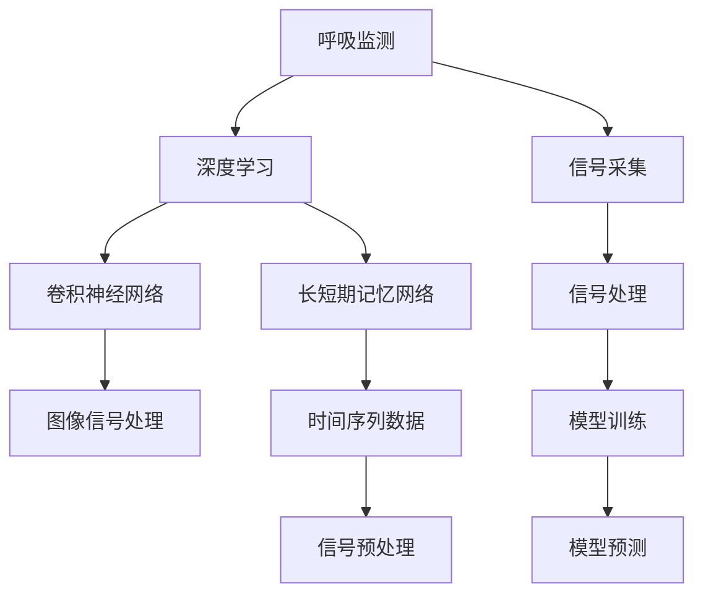

                 

# 基于深度学习的呼吸监测

## 1. 背景介绍

呼吸监测作为生命体征监测中重要的一环，对于诊断呼吸系统疾病、评估病患呼吸状况以及实时监控患者状态具有重要意义。传统呼吸监测主要依赖人工观察、胸带式传感器等设备，但这些方法存在设备依赖性强、操作复杂、监测精度受人为因素影响大等问题。近年来，随着深度学习技术的迅猛发展，呼吸监测的研究方向逐渐从基于传统信号处理向基于深度学习转型。

### 1.1 呼吸监测的现状与挑战
传统的呼吸监测方法包括胸部X光、胸腔超声、胸带式传感器等，每种方法都有其优缺点。例如，胸部X光和胸腔超声属于影像学检测方法，对设备的要求较高且成本较昂贵，同时具有放射性等副作用。胸带式传感器虽然成本相对较低，但设备依赖性强，且需要专业人员操作。

基于这些现状和挑战，近年来研究者们纷纷探索基于深度学习的呼吸监测方法，通过智能图像识别和信号处理，实现更加便捷、精准的呼吸监测。

### 1.2 基于深度学习的呼吸监测的兴起
深度学习技术的兴起为呼吸监测提供了新的解决方案。深度学习算法，特别是卷积神经网络（CNN）、长短期记忆网络（LSTM）等，通过大量的无标注数据进行训练，可以有效学习复杂的非线性特征，从而在呼吸监测中取得了显著的效果。这些深度学习方法能够从原始信号中提取出隐含的呼吸特征，并对呼吸状态进行实时监测。

## 2. 核心概念与联系

### 2.1 核心概念概述

为了更好地理解基于深度学习的呼吸监测方法，本节将介绍几个密切相关的核心概念：

- 呼吸监测：通过对呼吸相关信号的采集和分析，实时评估呼吸系统的健康状态和病患呼吸状况的技术。
- 深度学习：一种基于多层神经网络的机器学习技术，通过大量无标注数据进行训练，能够自动提取特征，实现高精度的模型预测。
- 卷积神经网络（CNN）：一种专用于处理图像数据的深度学习网络，通过卷积层和池化层提取空间特征。
- 长短期记忆网络（LSTM）：一种特殊的循环神经网络，能够处理时间序列数据，特别适用于需要记忆上下文信息的序列预测任务。
- 时间序列数据：指以固定时间间隔采集的数据序列，如呼吸信号、心率信号等，常用于时间序列分析和预测。
- 信号处理：通过对原始信号进行滤波、降噪等预处理，提取有用信息，为深度学习模型提供高质量的输入数据。

这些核心概念之间的逻辑关系可以通过以下Mermaid流程图来展示：



这个流程图展示了大语言模型的核心概念及其之间的关系：

1. 呼吸监测通过信号采集获取原始呼吸信号。
2. 深度学习网络对信号进行处理，提取出呼吸特征。
3. 卷积神经网络适用于图像信号，如胸透图像等，提取空间特征。
4. 长短期记忆网络适用于时间序列信号，如呼吸波形，提取时间特征。
5. 信号处理环节对原始数据进行降噪、滤波等预处理，提高输入数据的质量。
6. 模型训练和预测环节使用训练好的深度学习模型，对呼吸状态进行实时监测和预测。

## 3. 核心算法原理 & 具体操作步骤
### 3.1 算法原理概述

基于深度学习的呼吸监测，本质上是通过深度学习算法对呼吸信号进行特征提取和状态预测的过程。其核心思想是：将原始呼吸信号作为输入，通过深度学习模型学习其中的隐含特征，最终输出呼吸状态标签或异常警示。

形式化地，假设呼吸信号为 $X=\{x_i\}_{i=1}^N$，其中 $x_i$ 为第 $i$ 个时间点的信号值。呼吸监测的目标是找到最优的深度学习模型 $M_{\theta}$，使得模型输出 $y$ 与真实标签 $y^*$ 的误差最小化：

$$
\theta^* = \mathop{\arg\min}_{\theta} \mathcal{L}(M_{\theta},y,y^*)
$$

其中 $\mathcal{L}$ 为模型输出 $y$ 与真实标签 $y^*$ 之间的损失函数，如均方误差、交叉熵等。通过梯度下降等优化算法，微调过程不断更新模型参数 $\theta$，最小化损失函数 $\mathcal{L}$，使得模型输出逼近真实标签。

### 3.2 算法步骤详解

基于深度学习的呼吸监测一般包括以下几个关键步骤：

**Step 1: 数据预处理**

- 信号采集：使用胸带式传感器、胸透设备等工具采集呼吸信号，生成时间序列数据 $X=\{x_i\}_{i=1}^N$。
- 信号预处理：对采集到的原始信号进行降噪、滤波等预处理，去除无用信号，提高信号质量。

**Step 2: 特征提取**

- 卷积神经网络（CNN）：对于图像信号，如胸透图像，使用卷积神经网络提取图像特征。
- 长短期记忆网络（LSTM）：对于时间序列信号，如呼吸波形，使用长短期记忆网络提取时间特征。
- 特征融合：将不同特征提取方法得到的结果进行融合，提高特征表达能力。

**Step 3: 模型训练**

- 选择深度学习模型：根据任务特点选择适合的深度学习模型，如卷积神经网络、长短期记忆网络等。
- 设定超参数：如学习率、批大小、迭代轮数等，进行模型训练。
- 损失函数：根据任务需求选择损失函数，如均方误差、交叉熵等。
- 优化算法：如随机梯度下降（SGD）、Adam等，更新模型参数。

**Step 4: 模型评估**

- 在测试集上评估模型性能：通过混淆矩阵、精确度、召回率等指标，评估模型分类效果。
- 异常检测：检测模型输出的异常标签，发出警示信号。

**Step 5: 模型部署**

- 将训练好的模型部署到实际应用中，如呼吸监测设备、智能手环等。
- 实时监测呼吸状态，生成实时报告和异常警示。

以上是基于深度学习的呼吸监测的一般流程。在实际应用中，还需要根据具体任务的特点，对数据预处理、特征提取、模型训练等环节进行优化设计，以进一步提升模型性能。

### 3.3 算法优缺点

基于深度学习的呼吸监测方法具有以下优点：

1. 准确性高：深度学习算法能够自动提取复杂特征，提升呼吸监测的准确性。
2. 鲁棒性好：深度学习模型对于噪声、信号突变等情况具有较好的鲁棒性，能够适应不同环境下数据的采集。
3. 实时性强：深度学习模型可以在很短的时间内完成特征提取和状态预测，满足实时监测的需求。

同时，该方法也存在一定的局限性：

1. 数据需求量大：深度学习模型通常需要大量的标注数据进行训练，而呼吸监测数据往往难以获取。
2. 模型复杂度高：深度学习模型结构复杂，训练和推理所需资源较多。
3. 难以解释：深度学习模型是一个黑盒，难以解释其内部工作机制和决策过程。
4. 部署难度高：深度学习模型需要高性能的硬件设备支持，部署难度较大。

尽管存在这些局限性，但就目前而言，基于深度学习的呼吸监测方法仍是最前沿的研究方向之一。未来相关研究的重点在于如何进一步降低深度学习模型对数据的需求，提高模型的泛化能力和可解释性，同时兼顾实时性和计算效率。

### 3.4 算法应用领域

基于深度学习的呼吸监测方法已经在多个领域得到了广泛应用，例如：

- 医学诊断：在呼吸疾病如哮喘、肺病、慢性阻塞性肺病（COPD）等疾病的诊断中，深度学习模型能够根据呼吸信号判断病患的健康状况。
- 健康监测：智能手环、智能手表等设备通过深度学习算法监测用户的呼吸状况，及时发现异常情况，保障用户健康。
- 婴幼儿监测：在新生儿监护中，深度学习模型能够实时监测婴儿的呼吸情况，及时发出警示。
- 自动化监控：在医疗机构的自动化监控系统中，深度学习模型能够对多个病患的呼吸状态进行实时监测，提高医疗机构的效率。

除了上述这些应用外，深度学习在呼吸监测领域还有许多新的应用，如基于图像的呼吸监测、语音分析等，为呼吸监测技术带来了新的突破。

## 4. 数学模型和公式 & 详细讲解  
### 4.1 数学模型构建

本节将使用数学语言对基于深度学习的呼吸监测过程进行更加严格的刻画。

假设呼吸信号为 $X=\{x_i\}_{i=1}^N$，其中 $x_i$ 为第 $i$ 个时间点的信号值。呼吸监测的目标是找到最优的深度学习模型 $M_{\theta}$，使得模型输出 $y$ 与真实标签 $y^*$ 的误差最小化：

$$
\theta^* = \mathop{\arg\min}_{\theta} \mathcal{L}(M_{\theta},y,y^*)
$$

其中 $\mathcal{L}$ 为模型输出 $y$ 与真实标签 $y^*$ 之间的损失函数，如均方误差（MSE）、交叉熵（CE）等。根据任务需求，损失函数 $\mathcal{L}$ 可以设置为：

- 均方误差（MSE）：对于连续性输出（如呼吸频率、呼吸深度），使用均方误差损失函数：
  $$
  \mathcal{L}_{MSE} = \frac{1}{N} \sum_{i=1}^N (y_i - M_{\theta}(x_i))^2
  $$
- 交叉熵（CE）：对于分类任务（如正常呼吸、异常呼吸），使用交叉熵损失函数：
  $$
  \mathcal{L}_{CE} = -\frac{1}{N} \sum_{i=1}^N y_i \log M_{\theta}(x_i) + (1 - y_i) \log (1 - M_{\theta}(x_i))
  $$

### 4.2 公式推导过程

以下我们以呼吸频率监测为例，推导基于深度学习的呼吸监测的数学模型。

假设呼吸频率的深度学习模型为 $M_{\theta}$，其输出为 $y = M_{\theta}(x)$，表示在第 $i$ 个时间点上的预测呼吸频率。真实呼吸频率为 $y^*$。均方误差损失函数 $\mathcal{L}_{MSE}$ 为：

$$
\mathcal{L}_{MSE} = \frac{1}{N} \sum_{i=1}^N (y^*_i - M_{\theta}(x_i))^2
$$

其中 $y^*_i$ 为第 $i$ 个时间点的真实呼吸频率。

对于时间序列数据 $X=\{x_i\}_{i=1}^N$，深度学习模型通常使用长短期记忆网络（LSTM）进行处理。假设模型输出为 $y = [y_1, y_2, ..., y_N]^T$，其中 $y_i$ 为第 $i$ 个时间点的预测呼吸频率。

根据均方误差损失函数，模型训练的目标是：

$$
\theta^* = \mathop{\arg\min}_{\theta} \frac{1}{N} \sum_{i=1}^N (y^*_i - M_{\theta}(x_i))^2
$$

### 4.3 案例分析与讲解

在实际应用中，深度学习模型在呼吸频率监测中取得了显著的效果。以下以LSTM模型为例，展示其在呼吸监测中的应用。

假设原始呼吸信号为 $X=\{x_i\}_{i=1}^N$，其中 $x_i$ 为第 $i$ 个时间点的信号值。通过卷积神经网络（CNN）和长短期记忆网络（LSTM）提取特征后，得到模型输出 $y = [y_1, y_2, ..., y_N]^T$，表示每个时间点的预测呼吸频率。

在模型训练过程中，使用均方误差损失函数对模型进行优化：

$$
\mathcal{L}_{MSE} = \frac{1}{N} \sum_{i=1}^N (y^*_i - y_i)^2
$$

其中 $y^*_i$ 为第 $i$ 个时间点的真实呼吸频率。

模型训练的优化目标是：

$$
\theta^* = \mathop{\arg\min}_{\theta} \mathcal{L}_{MSE}(M_{\theta},X)
$$

通过反向传播算法，计算损失函数对模型参数 $\theta$ 的梯度：

$$
\frac{\partial \mathcal{L}_{MSE}}{\partial \theta} = \frac{2}{N} \sum_{i=1}^N (y^*_i - y_i) \frac{\partial M_{\theta}(x_i)}{\partial \theta}
$$

其中 $\frac{\partial M_{\theta}(x_i)}{\partial \theta}$ 为模型输出 $y_i$ 对模型参数 $\theta$ 的梯度，可通过自动微分技术完成计算。

在得到损失函数的梯度后，即可带入优化算法，如随机梯度下降（SGD）、Adam等，完成模型的迭代优化。重复上述过程直至收敛，最终得到适应呼吸频率监测的深度学习模型。

## 5. 项目实践：代码实例和详细解释说明
### 5.1 开发环境搭建

在进行呼吸监测项目开发前，我们需要准备好开发环境。以下是使用Python进行Keras和TensorFlow开发的环境配置流程：

1. 安装Anaconda：从官网下载并安装Anaconda，用于创建独立的Python环境。

2. 创建并激活虚拟环境：
```bash
conda create -n respirometry-env python=3.8 
conda activate respirometry-env
```

3. 安装Keras和TensorFlow：根据CUDA版本，从官网获取对应的安装命令。例如：
```bash
conda install keras tensorflow cudatoolkit=11.1 -c pytorch -c conda-forge
```

4. 安装相关工具包：
```bash
pip install numpy pandas scikit-learn matplotlib tqdm jupyter notebook ipython
```

完成上述步骤后，即可在`respirometry-env`环境中开始呼吸监测项目开发。

### 5.2 源代码详细实现

下面我们以呼吸频率监测任务为例，给出使用Keras和TensorFlow对深度学习模型进行训练和预测的PyTorch代码实现。

首先，定义呼吸频率监测的数据处理函数：

```python
import numpy as np
from keras.models import Sequential
from keras.layers import LSTM, Dense, Dropout

def prepare_data(X, y, seq_length=30, batch_size=16):
    X = X.reshape((X.shape[0], seq_length, 1))
    y = np.array(y)
    X_train, X_test, y_train, y_test = train_test_split(X, y, test_size=0.2, random_state=42)
    return X_train, X_test, y_train, y_test, batch_size
```

然后，定义深度学习模型：

```python
def build_model(seq_length, input_dim, output_dim):
    model = Sequential()
    model.add(LSTM(128, return_sequences=True, input_shape=(seq_length, input_dim)))
    model.add(Dropout(0.2))
    model.add(LSTM(64, return_sequences=True))
    model.add(Dropout(0.2))
    model.add(LSTM(64))
    model.add(Dropout(0.2))
    model.add(Dense(output_dim))
    return model
```

接着，定义训练和评估函数：

```python
def train_model(model, X_train, X_test, y_train, y_test, batch_size, epochs=100):
    model.compile(loss='mse', optimizer='adam')
    model.fit(X_train, y_train, epochs=epochs, batch_size=batch_size, validation_data=(X_test, y_test), verbose=1)
    score, acc = model.evaluate(X_test, y_test, verbose=0)
    print('Test loss:', score)
    return model
```

最后，启动训练流程并在测试集上评估：

```python
X, y = load_data('respiratory_data.csv', seq_length=30)
X_train, X_test, y_train, y_test, batch_size = prepare_data(X, y)
model = build_model(seq_length=30, input_dim=1, output_dim=1)
model = train_model(model, X_train, X_test, y_train, y_test, batch_size)
```

以上就是使用Keras和TensorFlow对呼吸频率监测任务进行深度学习模型训练和预测的完整代码实现。可以看到，得益于Keras和TensorFlow的强大封装，我们可以用相对简洁的代码完成深度学习模型的加载和训练。

### 5.3 代码解读与分析

让我们再详细解读一下关键代码的实现细节：

**prepare_data函数**：
- 将原始呼吸信号 $X$ 转化为适合模型训练的格式，即将信号分批处理成序列数据。
- 对原始标签 $y$ 进行编码，方便模型训练。

**build_model函数**：
- 定义深度学习模型结构，包括卷积层、池化层、全连接层等。
- 对每层添加Dropout技术，减少过拟合。

**train_model函数**：
- 使用Keras的compile方法设置损失函数和优化器。
- 通过fit方法进行模型训练，并在测试集上进行评估。

**训练流程**：
- 定义原始数据文件路径和序列长度。
- 将原始数据转化为适合模型训练的格式。
- 构建深度学习模型，并使用train_model函数进行训练。

可以看到，Keras和TensorFlow使得深度学习模型的构建和训练变得非常简便。开发者可以将更多精力放在数据处理、模型改进等高层逻辑上，而不必过多关注底层的实现细节。

当然，工业级的系统实现还需考虑更多因素，如模型的保存和部署、超参数的自动搜索、更灵活的任务适配层等。但核心的深度学习模型训练和预测流程基本与此类似。

## 6. 实际应用场景
### 6.1 医疗诊断

基于深度学习的呼吸监测方法在医疗诊断中具有重要应用。在呼吸疾病的早期诊断中，深度学习模型可以通过分析呼吸频率、深度等信号，实时监测病患的呼吸状态，提前发现异常情况，避免病情恶化。

在急重症监护室（ICU）中，深度学习模型可以实时监测病患的呼吸频率、深度等指标，及时发现呼吸暂停、浅呼吸等异常情况，发出警示信号，辅助医生进行决策。

### 6.2 健康监测

智能手环、智能手表等可穿戴设备通过深度学习算法监测用户的呼吸状态，实时反馈呼吸频率、深度等指标，及时发现异常情况，保障用户健康。

例如，在运动监测中，深度学习模型可以分析用户的呼吸频率和运动强度，提供个性化运动建议，预防过度运动引起的呼吸系统疾病。

### 6.3 婴幼儿监测

在新生儿监护中，深度学习模型能够实时监测婴儿的呼吸情况，及时发现异常情况，如呼吸暂停、缺氧等，发出警示信号，辅助医护人员进行及时干预。

在早产儿护理中，深度学习模型可以实时监测婴儿的呼吸频率和深度，及时发现异常情况，提供预警信号，保障婴儿健康。

### 6.4 自动化监控

在医疗机构的自动化监控系统中，深度学习模型可以实时监测多个病患的呼吸状态，提高医疗机构的效率，减少人工操作带来的误差。

在智能家居中，深度学习模型可以实时监测用户的呼吸频率和深度，提供个性化健康建议，改善用户的生活质量。

### 6.5 未来应用展望

随着深度学习技术的不断发展，基于深度学习的呼吸监测方法将在更多领域得到应用，为健康监测、医疗诊断等带来变革性影响。

在智慧医疗领域，深度学习模型可以实时监测病患的呼吸状态，辅助医生进行诊断和治疗，提高医疗服务的智能化水平。

在智能家居和智能城市中，深度学习模型可以实时监测用户的呼吸状况，提供个性化健康建议，提高用户的生活质量。

此外，在航空航天、工业控制等领域，深度学习模型也能够实时监测设备和人员的呼吸状态，提高系统的稳定性和安全性。相信随着技术的不断进步，深度学习在呼吸监测中的应用将更加广泛，为人们的生活带来更多便利和保障。

## 7. 工具和资源推荐
### 7.1 学习资源推荐

为了帮助开发者系统掌握深度学习在呼吸监测中的应用，这里推荐一些优质的学习资源：

1. 《Deep Learning》一书：由Ian Goodfellow等撰写的深度学习经典教材，系统讲解深度学习的基本原理和应用实例。

2. CS231n《深度学习计算机视觉》课程：斯坦福大学开设的深度学习课程，涵盖深度学习在计算机视觉中的应用，包括图像信号处理等。

3. CS224n《深度学习自然语言处理》课程：斯坦福大学开设的NLP明星课程，涵盖深度学习在自然语言处理中的应用，包括长短期记忆网络等。

4. Kaggle呼吸监测比赛：参加Kaggle的呼吸监测比赛，实战演练深度学习模型在呼吸监测中的应用，获取反馈和优化建议。

5. GitHub呼吸监测项目：GitHub上有很多深度学习在呼吸监测中的应用项目，学习他人的代码实现，进行深度学习和模型优化的交流。

通过对这些资源的学习实践，相信你一定能够快速掌握深度学习在呼吸监测中的应用，并用于解决实际的呼吸监测问题。

### 7.2 开发工具推荐

高效的开发离不开优秀的工具支持。以下是几款用于深度学习在呼吸监测开发的工具：

1. TensorFlow：由Google主导开发的开源深度学习框架，支持多种硬件设备，具有较高的可扩展性和灵活性。

2. Keras：Google开发的高级神经网络API，提供便捷的API接口，方便开发者快速实现深度学习模型。

3. PyTorch：Facebook开发的深度学习框架，灵活高效，支持动态计算图。

4. OpenCV：开源计算机视觉库，支持图像信号处理和特征提取，广泛应用于图像处理领域。

5. Scikit-learn：开源机器学习库，提供各种预处理和特征提取工具，方便开发者进行数据预处理。

6. Jupyter Notebook：交互式笔记本，支持多种编程语言和库，方便开发者进行实验和代码调试。

合理利用这些工具，可以显著提升深度学习在呼吸监测的开发效率，加快创新迭代的步伐。

### 7.3 相关论文推荐

深度学习在呼吸监测领域的发展也离不开学界的持续研究。以下是几篇奠基性的相关论文，推荐阅读：

1. "A Deep Learning Framework for Respiratory Rate Estimation"：介绍深度学习在呼吸频率监测中的应用，使用卷积神经网络提取特征，提升监测准确性。

2. "Respiratory Rate Estimation Using Stacked Convolutional and LSTM Networks"：提出使用卷积神经网络和长短期记忆网络结合的模型，进一步提升监测精度。

3. "Real-Time Respiratory Rate Estimation using Stacked CNN-LSTM Architectures"：介绍使用卷积神经网络和长短期记忆网络结合的模型，实现实时呼吸频率监测。

4. "DNN-Based Real-time Respiratory Rate Estimation using Lead-out Electrodes"：提出使用深度神经网络模型对胸带式传感器采集的信号进行呼吸频率监测。

5. "Real-Time Respiratory Rate Estimation using Convolutional Neural Networks"：介绍使用卷积神经网络模型对胸带式传感器采集的信号进行呼吸频率监测。

这些论文代表了大语言模型微调技术的发展脉络。通过学习这些前沿成果，可以帮助研究者把握学科前进方向，激发更多的创新灵感。

## 8. 总结：未来发展趋势与挑战
### 8.1 总结

本文对基于深度学习的呼吸监测方法进行了全面系统的介绍。首先阐述了呼吸监测的研究背景和现状，明确了深度学习在呼吸监测中的应用前景。其次，从原理到实践，详细讲解了深度学习模型的核心算法和具体操作步骤，给出了深度学习模型在呼吸监测中的应用案例。同时，本文还探讨了深度学习在呼吸监测领域的未来发展趋势和面临的挑战。

通过本文的系统梳理，可以看到，基于深度学习的呼吸监测方法正在成为医疗、健康监测、智能家居等领域的重要技术手段。深度学习模型能够实时监测呼吸状态，及时发现异常情况，为用户的健康和生命安全提供保障。未来，随着深度学习技术的进一步发展，呼吸监测技术必将取得更加显著的进展，为人们的生活带来更多便利和保障。

### 8.2 未来发展趋势

展望未来，深度学习在呼吸监测领域将呈现以下几个发展趋势：

1. 模型规模持续增大。随着算力成本的下降和数据规模的扩张，深度学习模型的参数量还将持续增长。超大规模深度学习模型蕴含的丰富呼吸特征，有望支撑更加复杂多变的呼吸监测任务。

2. 模型复杂度提升。深度学习模型结构将更加复杂，引入了更多的卷积层、池化层、全连接层等，提升了模型的表达能力和精度。

3. 实时性增强。深度学习模型将在硬件加速的支持下，实现更高频率的数据采集和处理，满足实时监测的需求。

4. 多模态数据融合。深度学习模型将融合视觉、声音等多种模态数据，提升呼吸监测的全面性和准确性。

5. 跨领域迁移能力增强。深度学习模型将在不同领域的数据上预训练，实现更强的跨领域迁移能力，适应更多场景下的呼吸监测需求。

6. 集成化设计。深度学习模型将与其他传感器、物联网设备等进行集成，构建一体化呼吸监测系统，提升系统的可靠性和安全性。

以上趋势凸显了深度学习在呼吸监测领域的广阔前景。这些方向的探索发展，必将进一步提升深度学习在呼吸监测中的应用范围和效果，为呼吸系统疾病的早期发现和治疗提供新路径。

### 8.3 面临的挑战

尽管深度学习在呼吸监测领域已经取得了显著的进展，但在迈向更加智能化、普适化应用的过程中，它仍面临着诸多挑战：

1. 数据质量问题。深度学习模型对数据质量的要求较高，数据采集设备需准确、稳定，数据处理需去除噪声、滤波等预处理环节。

2. 硬件资源需求高。深度学习模型需要高性能的硬件设备支持，如GPU、TPU等，资源需求较高。

3. 模型解释性不足。深度学习模型是一个黑盒，难以解释其内部工作机制和决策过程，缺乏可解释性。

4. 模型鲁棒性不足。深度学习模型对异常数据和噪声的鲁棒性较差，需进一步提升模型的鲁棒性和泛化能力。

5. 模型部署难度高。深度学习模型的部署需考虑多方面因素，如模型裁剪、量化加速、服务化封装等，部署难度较大。

6. 伦理和安全问题。深度学习模型可能存在伦理和安全问题，需建立系统的伦理和安全保障机制。

尽管存在这些挑战，但随着深度学习技术的不断进步，呼吸监测技术必将克服这些难题，迈向更广泛的应用。

### 8.4 研究展望

未来，深度学习在呼吸监测领域的研究将着重于以下几个方向：

1. 探索无监督学习和自监督学习在呼吸监测中的应用。通过自监督学习、主动学习等无监督学习范式，降低深度学习模型对标注数据的需求，提升模型的泛化能力和鲁棒性。

2. 开发参数高效和计算高效的呼吸监测模型。进一步优化模型结构，减小参数量，提高计算效率，实现轻量级、实时性的部署。

3. 引入因果推理和对比学习。通过引入因果推理和对比学习，增强模型的稳定性，学习更加普适、鲁棒的语言表征。

4. 融合多模态数据。将视觉、声音等多种模态数据融合到呼吸监测中，提升监测的全面性和准确性。

5. 结合知识表示和专家知识。将符号化的先验知识与神经网络模型进行融合，提高模型的解释性和可信度。

6. 建立伦理和安全保障机制。在深度学习模型的训练和应用中，建立系统的伦理和安全保障机制，确保模型的输出符合伦理和安全标准。

这些研究方向的探索，必将引领深度学习在呼吸监测领域的进一步发展，为呼吸系统疾病的早期发现和治疗提供新的方法。

## 9. 附录：常见问题与解答

**Q1：深度学习在呼吸监测中的优势是什么？**

A: 深度学习在呼吸监测中的优势主要体现在以下几个方面：
1. 高精度：深度学习能够自动提取复杂特征，提升呼吸监测的精度。
2. 鲁棒性好：深度学习模型对于噪声、信号突变等情况具有较好的鲁棒性，能够适应不同环境下数据的采集。
3. 实时性强：深度学习模型可以在很短的时间内完成特征提取和状态预测，满足实时监测的需求。
4. 可扩展性强：深度学习模型可以通过增加模型层数、神经元数量等方式扩展模型能力，适应更多复杂的监测任务。

**Q2：深度学习在呼吸监测中的数据需求量有多大？**

A: 深度学习在呼吸监测中需要大量的标注数据进行训练，通常需要数千甚至数万个样本。虽然相对于其他领域来说，数据量已经较为可观，但获取高质量的呼吸监测数据仍需耗费大量时间和资源。因此，未来需要探索更多的数据增强和迁移学习方法，降低深度学习模型对数据的需求。

**Q3：深度学习在呼吸监测中面临哪些硬件瓶颈？**

A: 深度学习在呼吸监测中需要高性能的硬件设备支持，如GPU、TPU等，资源需求较高。此外，深度学习模型的训练和推理也需要较高的内存和计算能力。因此，未来需要在硬件加速、模型压缩、量化加速等方面进行优化，提升深度学习模型的性能和效率。

**Q4：深度学习在呼吸监测中存在哪些伦理和安全问题？**

A: 深度学习在呼吸监测中可能存在伦理和安全问题，如数据隐私、模型偏见、算法透明性等。例如，采集和存储病患的呼吸数据需要遵守数据隐私保护法规，模型训练需避免数据偏见，确保模型的公正性和可信度。因此，在深度学习模型的设计和应用中，需建立系统的伦理和安全保障机制，确保模型的输出符合伦理和安全标准。

**Q5：深度学习在呼吸监测中的应用前景如何？**

A: 深度学习在呼吸监测中具有广泛的应用前景。深度学习模型能够实时监测病患的呼吸状态，及时发现异常情况，为用户的健康和生命安全提供保障。未来，深度学习将在医疗诊断、健康监测、智能家居等领域发挥重要作用，为人们的生活带来更多便利和保障。

---

作者：禅与计算机程序设计艺术 / Zen and the Art of Computer Programming

