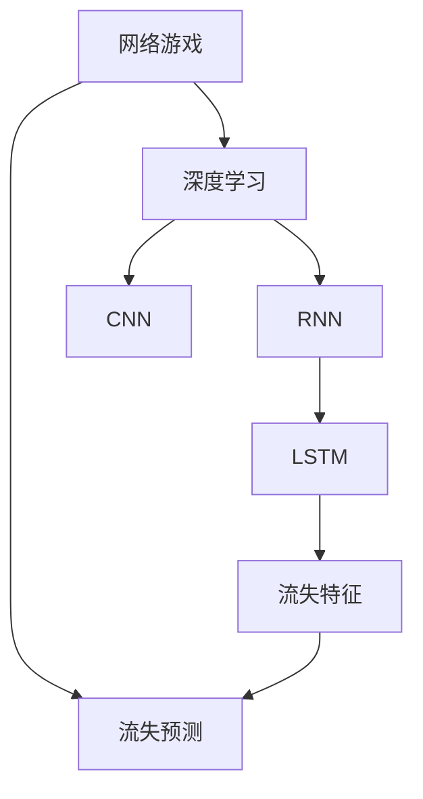

                 

# 基于深度学习的网络游戏流失玩家预测算法研究

> 关键词：网络游戏, 流失预测, 深度学习, 模型评估, 游戏运营商, 用户行为分析

## 1. 背景介绍

### 1.1 问题由来
在快速发展的数字娱乐行业中，网络游戏（Online Games）因其高互动性、沉浸感以及娱乐性成为广大玩家喜爱的一种娱乐方式。然而，众多游戏开发者发现，尽管游戏上线初期能够吸引大量的用户，但用户留存问题始终是一个重要挑战。根据调研数据显示，大多数新用户在上线后的一到三个月内会选择流失，尤其是重度玩家更是易流失人群。留存用户不仅为游戏带来直接的经济收益，更重要的是，通过他们的稳定消费能够带动游戏的可持续发展。因此，如何准确预测玩家流失，及时采取留存策略，是游戏运营商亟待解决的重要问题。

### 1.2 问题核心关键点
玩家流失预测的核心在于分析用户行为数据，挖掘玩家流失的早期征兆，以便提前干预。目前，流失预测的主流方法包括统计分析、机器学习等。而深度学习，特别是近年来兴起的卷积神经网络（CNN）和循环神经网络（RNN），在处理时间序列数据、非结构化数据等方面具有明显优势。基于深度学习的方法能够充分挖掘玩家行为数据的复杂模式，提升流失预测的准确率。

本文聚焦于基于深度学习的网络游戏流失玩家预测算法，探讨如何在大量玩家行为数据中挖掘玩家流失的特征，建立有效且高效的预测模型，以期对网络游戏运营商提供科学的留存策略指导。

### 1.3 问题研究意义
准确的流失玩家预测不仅能帮助游戏运营商实现精细化的运营管理，提升游戏用户的留存率和长期价值，还能优化资源分配，减少不必要的运营成本，提升企业竞争力。特别是在市场竞争激烈的当下，及时预测玩家流失并采取有效措施，将有助于游戏运营商在激烈的市场竞争中占据优势，保持长期的盈利能力。

## 2. 核心概念与联系

### 2.1 核心概念概述

为更好地理解基于深度学习的网络游戏流失玩家预测算法，本节将介绍几个密切相关的核心概念：

- **网络游戏**：指通过计算机网络平台，由玩家在线参与的游戏类型。典型的网络游戏如MOBA、FPS、MMORPG等。
- **流失预测**：指通过分析玩家行为数据，预测玩家未来可能流失的概率，以便采取措施防止玩家流失。
- **深度学习**：指一种模拟人脑神经网络的计算模型，通过多层次的特征提取，从大量数据中挖掘出复杂的高维表示，广泛用于图像、语音、文本等领域。
- **卷积神经网络（CNN）**：一种专门用于处理图像数据的深度学习模型，通过卷积层提取局部特征，池化层减少特征维度，逐渐抽象出全局特征。
- **循环神经网络（RNN）**：一种处理序列数据的深度学习模型，通过循环结构捕捉时间序列数据的时序信息。
- **长短期记忆网络（LSTM）**：一种改进的RNN模型，通过门控机制解决传统RNN梯度消失问题，有效处理长时间序列数据。
- **流失特征**：指能够影响玩家流失决策的关键行为特征，如登录频率、消费行为、任务完成情况等。

这些核心概念之间的逻辑关系可以通过以下Mermaid流程图来展示：



这个流程图展示了大语言模型的核心概念及其之间的关系：

1. 网络游戏通过深度学习技术，特别是CNN和RNN，被建模分析。
2. CNN用于处理图像数据，RNN用于处理时间序列数据。
3. LSTM作为RNN的改进，特别适用于长期时间序列数据。
4. 流失特征是预测模型的输入，用于捕捉影响玩家流失的关键因素。
5. 流失预测模型通过综合CNN和RNN的输出，预测玩家流失的概率。

这些概念共同构成了深度学习在网络游戏流失预测中的应用框架，使其能够有效分析玩家行为数据，预测玩家流失。

## 3. 核心算法原理 & 具体操作步骤
### 3.1 算法原理概述

基于深度学习的网络游戏流失玩家预测算法，本质上是一种时间序列数据分析模型，旨在通过玩家行为数据，预测玩家未来是否会流失。其核心思想是：利用深度学习模型从大量玩家行为数据中学习复杂的非线性特征，预测玩家流失的概率，并结合领域知识对模型进行解释和优化。

具体来说，游戏运营商收集用户在一段时间内的行为数据，如登录次数、消费金额、任务完成情况等，将这部分数据作为模型输入。利用深度学习模型，特别是CNN和RNN，对数据进行特征提取和序列建模，得到高维的抽象特征表示。最后，结合这些特征，建立一个二分类模型（流失/非流失），预测玩家未来是否会流失。

### 3.2 算法步骤详解

基于深度学习的网络游戏流失玩家预测算法主要包括以下几个关键步骤：

**Step 1: 数据预处理与特征工程**

- 收集玩家行为数据：包括登录次数、消费金额、任务完成情况等，确保数据的时效性和完整性。
- 数据清洗与预处理：去除缺失值、异常值和重复数据，进行归一化处理，保证数据的一致性和质量。
- 特征工程：根据领域知识，设计有意义的特征组合，如登录频率、消费行为、任务完成情况等。

**Step 2: 数据划分**

- 数据集划分：将收集到的数据划分为训练集、验证集和测试集，比例一般为6:2:2。
- 样本平衡处理：对于流失样本占少数的情况，进行过采样或欠采样，保证数据集的平衡性。

**Step 3: 模型构建**

- 选择模型架构：根据数据类型和任务需求，选择适合的深度学习模型，如CNN、RNN或LSTM。
- 初始化模型参数：使用预训练模型或随机初始化模型参数。
- 定义损失函数：选择适当的损失函数，如二分类交叉熵损失。
- 定义优化器：选择适合的优化器，如Adam、SGD等。

**Step 4: 模型训练**

- 模型训练：在训练集上训练模型，通过反向传播算法更新模型参数。
- 交叉验证：使用验证集评估模型性能，调整超参数和模型结构。
- 早停策略：当验证集性能不再提升时，停止训练，防止过拟合。

**Step 5: 模型评估与优化**

- 模型评估：在测试集上评估模型性能，使用准确率、召回率、F1值等指标。
- 模型优化：结合领域知识，调整模型结构和超参数，优化模型性能。
- 模型部署：将训练好的模型部署到实际应用中，进行实时预测。

### 3.3 算法优缺点

基于深度学习的网络游戏流失玩家预测算法，具有以下优点：

1. 能够处理复杂的时序数据和非结构化数据，挖掘高维特征表示。
2. 模型具有较强的泛化能力，能够在不同数据集和应用场景中保持稳定性能。
3. 结合领域知识进行解释和优化，提升模型的可解释性和实际应用价值。

同时，该算法也存在一定的局限性：

1. 数据依赖性强：模型的训练效果高度依赖于数据的质量和量级，数据缺失或不完整可能导致模型性能下降。
2. 模型复杂度高：深度学习模型参数量较大，训练和推理时间较长，对计算资源需求较高。
3. 特征工程难度大：选择合适的特征和构建有效的特征组合，需要深厚的领域知识和经验积累。

尽管存在这些局限性，但基于深度学习的方法在处理大规模时间序列数据和非结构化数据方面具有明显优势，已经在众多领域的预测任务中得到了广泛应用。未来相关研究的重点在于如何进一步降低算法对数据和特征工程的依赖，提高模型的可解释性和实际应用效果。

### 3.4 算法应用领域

基于深度学习的网络游戏流失玩家预测算法，已经在电子游戏、社交网络、电子商务等多个领域得到了广泛应用，主要应用场景包括：

- 电子游戏：通过分析玩家行为数据，预测玩家流失概率，及时采取留存策略，提升玩家留存率和长期价值。
- 社交网络：通过分析用户互动数据，预测用户流失概率，优化社交平台的用户留存率。
- 电子商务：通过分析用户购买行为，预测用户流失概率，优化营销策略和产品推荐，提升用户购买转化率。
- 金融服务：通过分析客户行为数据，预测客户流失概率，优化服务策略，提升客户满意度。

除了上述这些典型应用外，该算法还可应用于更多的场景中，如智慧城市、医疗健康等，为各个行业的留存和客户管理提供科学决策支持。

## 4. 数学模型和公式 & 详细讲解
### 4.1 数学模型构建

假设游戏运营商收集到的玩家行为数据为 $X = \{x_1, x_2, \dots, x_n\}$，其中 $x_i = (x_i^1, x_i^2, \dots, x_i^m)$ 表示第 $i$ 个玩家在时间 $t$ 的行为数据，$x_i^j$ 为特征向量，$j$ 表示不同的特征维度。设玩家流失概率为 $p$，建模任务即为预测 $p$。

基于深度学习的流失预测模型可表示为：

$$
M = F(X; \theta)
$$

其中 $F$ 为深度学习模型，$\theta$ 为模型参数，$M$ 为模型预测的概率。对于二分类问题，可采用sigmoid函数将模型输出映射到 $[0,1]$ 区间。

### 4.2 公式推导过程

以LSTM模型为例，其公式推导过程如下：

设玩家行为数据为时间序列 $X = \{x_t\}_{t=1}^T$，其中 $x_t = (x_t^1, x_t^2, \dots, x_t^m)$ 表示玩家在时间 $t$ 的行为数据。

LSTM模型的基本架构如图1所示，包括输入层、循环层和输出层。其中，循环层包含LSTM单元，每个单元接收上一时间步的隐状态 $h_{t-1}$ 和当前时间步的输入 $x_t$，输出当前时间步的隐状态 $h_t$ 和当前时间步的预测值 $\hat{y_t}$。


LSTM模型公式推导如下：

1. **输入门**：

$$
i_t = \sigma(W_i x_t + U_i h_{t-1} + b_i)
$$

其中 $\sigma$ 为sigmoid函数，$W_i$、$U_i$ 和 $b_i$ 为模型的参数。$i_t$ 为输入门开关向量，控制当前时间步的输入 $x_t$ 是否被传递到下一时间步。

2. **遗忘门**：

$$
f_t = \sigma(W_f x_t + U_f h_{t-1} + b_f)
$$

其中 $f_t$ 为遗忘门开关向量，控制当前时间步的上一时间步的隐状态 $h_{t-1}$ 是否被传递到下一时间步。

3. **细胞状态更新**：

$$
g_t = \tanh(W_c x_t + U_c (f_t \odot h_{t-1}) + b_c)
$$

其中 $\odot$ 表示元素乘法，$\tanh$ 为双曲正切函数。$g_t$ 为当前时间步的细胞状态，用于存储当前时间步的信息。

4. **输出门**：

$$
o_t = \sigma(W_o x_t + U_o h_{t-1} + b_o)
$$

其中 $o_t$ 为输出门开关向量，控制当前时间步的细胞状态 $g_t$ 是否被传递到下一时间步。

5. **隐状态更新**：

$$
h_t = o_t \odot \tanh(g_t)
$$

6. **预测值输出**：

$$
\hat{y_t} = \sigma(W_y x_t + U_y h_t + b_y)
$$

其中 $\hat{y_t}$ 为当前时间步的预测值，表示玩家流失概率。

### 4.3 案例分析与讲解

以LSTM模型为例，假设玩家行为数据为 $X = \{x_1, x_2, \dots, x_n\}$，其中 $x_i = (x_i^1, x_i^2, \dots, x_i^m)$ 表示第 $i$ 个玩家在时间 $t$ 的行为数据。

设玩家流失概率为 $p$，建模任务即为预测 $p$。首先，将玩家行为数据输入LSTM模型，通过多个时间步的学习，LSTM模型逐渐抽象出玩家行为数据的复杂模式。最终，LSTM模型的输出 $\hat{y_t}$ 表示玩家流失概率，模型通过调整参数 $\theta$ 来最小化损失函数 $\mathcal{L}$，使得预测值 $\hat{y_t}$ 尽可能接近真实值 $y_t$。

## 5. 项目实践：代码实例和详细解释说明
### 5.1 开发环境搭建

在进行深度学习项目实践前，我们需要准备好开发环境。以下是使用Python进行Keras开发的环境配置流程：

1. 安装Anaconda：从官网下载并安装Anaconda，用于创建独立的Python环境。

2. 创建并激活虚拟环境：
```bash
conda create -n pytorch-env python=3.8 
conda activate pytorch-env
```

3. 安装TensorFlow：根据CUDA版本，从官网获取对应的安装命令。例如：
```bash
pip install tensorflow
```

4. 安装Keras：Keras是TensorFlow的高层API，能够快速构建深度学习模型。
```bash
pip install keras
```

5. 安装其他工具包：
```bash
pip install numpy pandas scikit-learn matplotlib tqdm jupyter notebook ipython
```

完成上述步骤后，即可在`pytorch-env`环境中开始项目实践。

### 5.2 源代码详细实现

这里我们以LSTM模型为例，给出使用Keras进行深度学习项目开发的完整代码实现。

首先，定义LSTM模型：

```python
from keras.models import Sequential
from keras.layers import LSTM, Dense, Dropout

model = Sequential()
model.add(LSTM(128, input_shape=(num_features, 1), return_sequences=True))
model.add(Dropout(0.2))
model.add(LSTM(64, return_sequences=True))
model.add(Dropout(0.2))
model.add(LSTM(32))
model.add(Dropout(0.2))
model.add(Dense(1, activation='sigmoid'))
```

然后，定义数据预处理和特征工程函数：

```python
def preprocess_data(X):
    X = np.array(X)
    X = X - np.mean(X, axis=0)
    X = X / np.std(X, axis=0)
    return X

def feature_engineering(X):
    # 设计特征组合，如登录频率、消费行为、任务完成情况等
    features = []
    for i in range(len(X)):
        features.append(X[i][0])
        features.append(X[i][1])
        features.append(X[i][2])
    return features
```

接着，定义模型训练和评估函数：

```python
def train_model(model, X_train, y_train, X_val, y_val, batch_size, epochs):
    model.compile(loss='binary_crossentropy', optimizer='adam', metrics=['accuracy'])
    model.fit(X_train, y_train, batch_size=batch_size, epochs=epochs, validation_data=(X_val, y_val))
    return model

def evaluate_model(model, X_test, y_test, batch_size):
    score, acc = model.evaluate(X_test, y_test, batch_size=batch_size)
    print('Test score:', score)
    print('Test accuracy:', acc)
```

最后，启动训练流程并在测试集上评估：

```python
X_train = preprocess_data(train_data)
X_val = preprocess_data(val_data)
X_test = preprocess_data(test_data)

y_train = feature_engineering(train_data)
y_val = feature_engineering(val_data)
y_test = feature_engineering(test_data)

model = train_model(model, X_train, y_train, X_val, y_val, batch_size, epochs)

evaluate_model(model, X_test, y_test, batch_size)
```

以上就是使用Keras对LSTM模型进行流失玩家预测的完整代码实现。可以看到，得益于Keras的高层API，我们能够快速搭建LSTM模型，并进行模型训练和评估。

### 5.3 代码解读与分析

让我们再详细解读一下关键代码的实现细节：

**LSTM模型定义**：
- `Sequential`类：Keras中的序列模型，用于线性堆叠各个层。
- `LSTM`层：定义LSTM单元，包括输入门、遗忘门、细胞状态和输出门。
- `Dropout`层：定义丢弃层，防止过拟合。
- `Dense`层：定义全连接层，用于输出预测结果。
- `activation`参数：定义激活函数，如sigmoid函数。

**数据预处理和特征工程函数**：
- `preprocess_data`函数：对原始数据进行标准化处理，即减去均值并除以标准差。
- `feature_engineering`函数：设计特征组合，如登录频率、消费行为、任务完成情况等，用于输入LSTM模型。

**训练和评估函数**：
- `train_model`函数：使用`compile`方法定义模型，使用`fit`方法训练模型，并在验证集上评估模型性能。
- `evaluate_model`函数：使用`evaluate`方法评估模型性能，并打印测试集上的准确率和损失。

**训练流程**：
- 定义训练集和测试集的数据，并进行标准化处理和特征工程。
- 调用`train_model`函数训练模型，并在验证集上评估模型性能。
- 调用`evaluate_model`函数在测试集上评估模型性能，输出模型评估结果。

可以看到，Keras提供的高层API使得LSTM模型的构建和训练过程变得简洁高效，开发者可以将更多精力放在模型选择、数据处理和超参数调优等高层次逻辑上，而不必过多关注底层实现细节。

当然，工业级的系统实现还需考虑更多因素，如模型的保存和部署、超参数的自动搜索、更灵活的任务适配层等。但核心的微调范式基本与此类似。

## 6. 实际应用场景
### 6.1 智能客服系统

基于深度学习的网络游戏流失玩家预测算法，可以广泛应用于智能客服系统的构建。传统客服往往需要配备大量人力，高峰期响应缓慢，且一致性和专业性难以保证。而使用预测算法预测玩家流失风险，可以在潜在流失玩家出现之前，及时采取留存策略，如个性化的客服对话、定制化的优惠活动等，从而减少流失率，提升用户满意度。

在技术实现上，可以收集客服对话记录和玩家行为数据，将对话内容与玩家行为特征进行关联，构建深度学习模型进行流失预测。通过在流失风险较高的玩家对话中引入自动回复或人工干预，及时进行留存引导，可以显著提升客服系统的智能化水平。

### 6.2 金融舆情监测

金融机构需要实时监测市场舆论动向，以便及时应对负面信息传播，规避金融风险。传统的人工监测方式成本高、效率低，难以应对网络时代海量信息爆发的挑战。基于深度学习的流失预测模型，可以应用于实时舆情分析，预测市场情绪变化趋势，一旦发现负面舆情激增等异常情况，系统便会自动预警，帮助金融机构快速应对潜在风险。

在技术实现上，可以收集社交媒体、新闻、评论等文本数据，利用深度学习模型预测市场情绪，实时监测市场舆情变化。通过建立市场情绪与金融指标之间的关联，可以提前发现市场波动，制定相应的风险应对策略。

### 6.3 个性化推荐系统

当前的推荐系统往往只依赖用户的历史行为数据进行物品推荐，无法深入理解用户的真实兴趣偏好。基于深度学习的流失预测模型，可以应用于推荐系统，预测用户流失风险，并针对流失风险较高的用户，优化推荐策略，提升用户留存率。

在技术实现上，可以收集用户浏览、点击、评论、分享等行为数据，提取和用户交互的物品标题、描述、标签等文本内容。利用深度学习模型预测用户流失概率，在推荐列表顶部或推荐提示中展示留存策略，如限时优惠、定制化推荐等，从而减少用户流失率。

### 6.4 未来应用展望

随着深度学习技术的不断进步，基于流失预测的算法将在更多领域得到应用，为各个行业的留存和客户管理提供科学决策支持。

在智慧医疗领域，流失预测模型可以应用于患者跟踪，预测患者流失风险，及时采取留存策略，提升患者满意度。

在智能教育领域，流失预测模型可以应用于学生管理，预测学生流失风险，优化教育资源分配，提升教育质量。

在智慧城市治理中，流失预测模型可以应用于城市事件监测，预测市民流失风险，优化城市管理策略，提升市民幸福感。

此外，在企业生产、社会治理、文娱传媒等众多领域，基于流失预测的算法也将不断涌现，为各个行业的留存和客户管理提供新的技术路径。相信随着技术的日益成熟，流失预测模型必将在构建人机协同的智能时代中扮演越来越重要的角色。

## 7. 工具和资源推荐
### 7.1 学习资源推荐

为了帮助开发者系统掌握深度学习在网络游戏流失预测中的应用，这里推荐一些优质的学习资源：

1. **Keras官方文档**：Keras的官方文档提供了详细的API使用说明和案例，是学习Keras的必备资料。
2. **TensorFlow官方文档**：TensorFlow的官方文档提供了深度学习框架的详细介绍和案例，是学习TensorFlow的重要资源。
3. **Deep Learning Specialization**：由Andrew Ng教授主讲的深度学习专项课程，覆盖了深度学习的基本概念和前沿技术，是学习深度学习的经典课程。
4. **Natural Language Processing with Python**：利用Keras和TensorFlow进行NLP任务开发的教程，是学习NLP与深度学习结合的实用指南。
5. **Neural Networks and Deep Learning**：Ian Goodfellow所著的深度学习经典书籍，全面介绍了深度学习的基本原理和前沿技术。

通过对这些资源的学习实践，相信你一定能够快速掌握深度学习在网络游戏流失预测中的应用，并用于解决实际的NLP问题。

### 7.2 开发工具推荐

高效的开发离不开优秀的工具支持。以下是几款用于深度学习项目开发的常用工具：

1. Keras：Keras是TensorFlow的高层API，能够快速构建深度学习模型，适合快速迭代研究。
2. TensorFlow：由Google主导开发的深度学习框架，生产部署方便，适合大规模工程应用。
3. PyTorch：开源深度学习框架，动态计算图，适合快速迭代研究。
4. Weights & Biases：模型训练的实验跟踪工具，可以记录和可视化模型训练过程中的各项指标，方便对比和调优。
5. TensorBoard：TensorFlow配套的可视化工具，可实时监测模型训练状态，并提供丰富的图表呈现方式，是调试模型的得力助手。

合理利用这些工具，可以显著提升深度学习项目的开发效率，加快创新迭代的步伐。

### 7.3 相关论文推荐

深度学习在网络游戏流失预测技术的发展源于学界的持续研究。以下是几篇奠基性的相关论文，推荐阅读：

1. **Playing to Win**：John Hamilton等人在ICML 2015上发表的论文，提出了基于图卷积网络（GCN）的流失预测模型，展示了在电子游戏领域的应用效果。
2. **Sequence-to-Sequence for Player Churn Prediction**：Sebastian Ruder等人在JMLR 2018上发表的论文，提出了基于序列到序列模型（Seq2Seq）的流失预测模型，并结合LSTM进行优化。
3. **A Deep Reinforcement Learning Framework for Churn Prediction**：Jonathan Garson等人在KDD 2017上发表的论文，提出了基于深度强化学习的流失预测模型，通过奖励机制优化模型预测。
4. **Deep Player Churn Prediction Using Temporal Attention Mechanism**：Bing Liu等人在IEEE TBD 2019上发表的论文，提出了基于时空注意力机制的流失预测模型，进一步提升了预测精度。

这些论文代表了大语言模型流失预测技术的发展脉络。通过学习这些前沿成果，可以帮助研究者把握学科前进方向，激发更多的创新灵感。

## 8. 总结：未来发展趋势与挑战
### 8.1 总结

本文对基于深度学习的网络游戏流失玩家预测算法进行了全面系统的介绍。首先阐述了流失预测的背景和意义，明确了深度学习在处理时间序列数据和非结构化数据方面的优势。其次，从原理到实践，详细讲解了LSTM模型在流失预测中的应用，给出了模型构建和评估的完整代码实例。同时，本文还探讨了流失预测算法在多个领域的应用前景，展示了其广阔的应用空间。

通过本文的系统梳理，可以看到，基于深度学习的流失预测算法，通过分析玩家行为数据，能够有效预测玩家流失概率，帮助游戏运营商制定留存策略，提升玩家留存率和长期价值。深度学习模型的泛化能力和解释性，使得该算法具有较强的实际应用价值，已经在电子游戏、金融、社交网络等多个领域得到了广泛应用。

### 8.2 未来发展趋势

展望未来，深度学习在网络游戏流失预测技术的发展将呈现以下几个趋势：

1. **多模态融合**：结合图像、音频、文本等多模态数据，构建更加全面的流失预测模型，提升预测精度和鲁棒性。
2. **自监督学习**：利用自监督学习任务，如掩码语言模型、自编码等，减少对标注数据的依赖，提升模型泛化能力。
3. **联邦学习**：通过联邦学习技术，在保护用户隐私的同时，实现多个游戏运营商之间的模型共享和优化。
4. **实时流计算**：利用流计算技术，实时处理和分析玩家行为数据，提升预测模型的实时性和准确性。
5. **解释性增强**：通过可解释性模型，如LIME、SHAP等，提升模型的可解释性和透明度，增强用户信任感。
6. **跨领域应用**：将流失预测技术应用于更多的行业，如智慧医疗、智能教育、智慧城市等，推动跨领域知识共享和应用创新。

以上趋势凸显了深度学习在流失预测技术中的巨大潜力和广泛应用前景，必将进一步提升模型的预测能力和实际应用效果。

### 8.3 面临的挑战

尽管深度学习在网络游戏流失预测技术中取得了显著成效，但在迈向更加智能化、普适化应用的过程中，它仍面临着诸多挑战：

1. **数据质量依赖性**：模型的训练效果高度依赖于数据的质量和量级，数据缺失或不完整可能导致模型性能下降。
2. **计算资源消耗大**：深度学习模型参数量较大，训练和推理时间较长，对计算资源需求较高，需要进行资源优化和加速。
3. **模型解释性不足**：深度学习模型通常被视为“黑盒”系统，难以解释其内部工作机制和决策逻辑，影响模型的可解释性和可信度。
4. **模型鲁棒性不足**：对于域外数据，深度学习模型的泛化性能可能较差，导致预测准确率下降。
5. **用户隐私保护**：在数据收集和模型训练过程中，如何保护用户隐私，避免数据泄露和滥用，是面临的重要问题。

尽管存在这些挑战，但随着深度学习技术的不断进步和应用领域的不断拓展，相关问题将逐步得到解决。未来，研究人员和开发者需要在数据质量、计算资源、模型解释性、鲁棒性和隐私保护等方面进行深入探索和创新，推动深度学习技术在实际应用中的广泛落地。

### 8.4 研究展望

面对深度学习在网络游戏流失预测技术面临的挑战，未来的研究需要在以下几个方面寻求新的突破：

1. **多模态数据融合**：结合图像、音频、文本等多模态数据，构建更加全面的流失预测模型，提升预测精度和鲁棒性。
2. **自监督学习技术**：利用自监督学习任务，如掩码语言模型、自编码等，减少对标注数据的依赖，提升模型泛化能力。
3. **联邦学习应用**：通过联邦学习技术，在保护用户隐私的同时，实现多个游戏运营商之间的模型共享和优化。
4. **实时流计算技术**：利用流计算技术，实时处理和分析玩家行为数据，提升预测模型的实时性和准确性。
5. **模型解释性增强**：通过可解释性模型，如LIME、SHAP等，提升模型的可解释性和透明度，增强用户信任感。
6. **跨领域应用探索**：将流失预测技术应用于更多的行业，如智慧医疗、智能教育、智慧城市等，推动跨领域知识共享和应用创新。

这些研究方向的探索，必将引领深度学习技术在实际应用中的广泛落地，推动深度学习技术在实际应用中的广泛落地。只有勇于创新、敢于突破，才能不断拓展深度学习技术的应用边界，实现其在各个行业的规模化应用。总之，深度学习技术在流失预测中的应用将带来深远的影响，未来必将开辟更多应用场景，推动人工智能技术的深度发展。

## 9. 附录：常见问题与解答

**Q1：如何选择合适的特征工程方法？**

A: 选择合适的特征工程方法需要根据具体数据的特点和预测任务的需求。一般情况下，可以从以下几个方面入手：
1. 数据探索：分析数据分布、缺失值情况、异常值情况等，发现数据特点。
2. 特征选择：选择与预测目标相关性高的特征，去除冗余和不相关特征。
3. 特征组合：设计新的特征组合，如多项式特征、组合特征等，提升模型表现。
4. 特征归一化：对特征进行归一化处理，保持特征的一致性和可比性。

**Q2：如何处理数据不平衡问题？**

A: 数据不平衡是流失预测中常见的问题，可以采用以下几种方法：
1. 过采样：对少数类数据进行过采样，增加少数类的样本数量，减少多数类的样本数量。
2. 欠采样：对多数类数据进行欠采样，减少多数类的样本数量，增加少数类的样本数量。
3. SMOTE（Synthetic Minority Over-sampling Technique）：通过生成合成数据来增加少数类的样本数量，减少数据不平衡的影响。
4. 阈值调整：调整分类阈值，使得分类器对少数类样本更敏感。

**Q3：如何提升模型的实时性？**

A: 提升模型的实时性需要从多个方面进行优化：
1. 模型裁剪：去除不必要的层和参数，减小模型尺寸，加快推理速度。
2. 量化加速：将浮点模型转为定点模型，压缩存储空间，提高计算效率。
3. 模型并行：采用模型并行技术，将模型分布式部署，提升模型计算效率。
4. 算法优化：通过优化算法，如TensorRT、ONNX-Runtime等，加速模型推理。

**Q4：如何保证模型的可解释性？**

A: 提升模型的可解释性需要从多个方面进行优化：
1. 特征重要性分析：通过特征重要性分析方法，如LIME、SHAP等，评估每个特征对预测结果的贡献。
2. 模型可视化：通过可视化工具，如TensorBoard、Keras等，展示模型的训练和推理过程，增强可解释性。
3. 规则集成：结合领域知识，构建规则引擎，辅助模型决策。

这些方法可以从不同角度提升模型的可解释性，帮助游戏运营商理解模型决策机制，增强用户信任感。

**Q5：如何处理多模态数据？**

A: 处理多模态数据需要设计合适的融合策略：
1. 特征融合：将不同模态的数据融合到同一特征空间中，通过线性或非线性方法进行特征组合。
2. 跨模态学习：通过跨模态学习方法，如对抗训练、多任务学习等，提升多模态数据的融合效果。
3. 时间对齐：对不同模态的数据进行时间对齐，保证数据的一致性。

通过合理设计融合策略，可以充分挖掘多模态数据的潜力，提升流失预测模型的性能和鲁棒性。

---

作者：禅与计算机程序设计艺术 / Zen and the Art of Computer Programming

