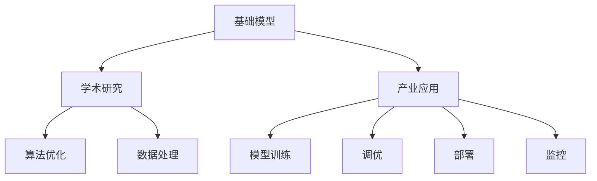

                 

# 基础模型的学术研究与产业应用

## 1. 背景介绍

随着人工智能技术的迅猛发展，基础模型的研究和应用已经成为推动行业创新和进步的重要力量。无论是学术界还是工业界，对基础模型的关注程度日益提高。本文旨在梳理基础模型的学术研究进展，并探讨其在产业应用中的现状及未来发展趋势。

## 2. 核心概念与联系

### 2.1 核心概念概述

在探讨基础模型的学术研究与产业应用之前，我们需要先了解一些核心概念：

- **基础模型**：通常指在特定领域内具有广泛应用价值的通用模型，比如在计算机视觉中的卷积神经网络（CNN），在自然语言处理（NLP）中的循环神经网络（RNN）和Transformer。这些模型经过大量数据训练，具有较强的泛化能力，可以在多种任务中取得良好性能。
- **学术研究**：涉及理论模型设计、算法优化、数据处理等，旨在解决特定问题或提升模型性能。
- **产业应用**：将学术研究成果转化为实际产品的过程，包括模型训练、调优、部署、监控等环节。

这些核心概念之间的关系可以通过以下Mermaid流程图来展示：



### 2.2 核心概念原理和架构的 Mermaid 流程图

基础模型通常由神经网络组成，以数据为输入，输出为预测结果。以卷积神经网络为例，其基本架构包括卷积层、池化层、全连接层等。


## 3. 核心算法原理 & 具体操作步骤

### 3.1 算法原理概述

基础模型的学术研究主要集中在以下几个方面：

- **模型设计**：设计具有一定通用性和可扩展性的基础模型架构，如卷积神经网络、Transformer等。
- **优化算法**：研究高效、稳定的优化算法，如Adam、SGD等，以提升模型训练速度和性能。
- **数据处理**：探讨数据增强、迁移学习、预训练等方法，以提高模型泛化能力和适应性。

### 3.2 算法步骤详解

以下是基础模型学术研究的一般步骤：

1. **问题定义**：明确研究目标，如分类、回归、生成等。
2. **数据准备**：收集、标注、预处理训练数据。
3. **模型构建**：选择合适的模型架构和超参数。
4. **训练过程**：使用优化算法对模型进行训练。
5. **评估指标**：设计合适的评估指标，如准确率、F1-score等。
6. **模型优化**：根据评估结果对模型进行调参和优化。

### 3.3 算法优缺点

基础模型的学术研究具有以下优点：

- **通用性强**：基础模型经过广泛应用，具有较强的泛化能力，适用于多种任务。
- **可扩展性高**：通过微调、迁移学习等方式，可以适应不同领域和应用场景。
- **研究成果丰富**：众多研究者和机构在此领域投入了大量精力，形成了大量的研究成果和工具库。

同时，基础模型也存在以下缺点：

- **数据依赖性强**：模型的性能高度依赖于训练数据的质量和数量。
- **计算资源消耗大**：大规模模型训练和推理需要大量计算资源，增加了应用成本。
- **易过拟合**：由于模型复杂度高，训练过程中容易过拟合。

### 3.4 算法应用领域

基础模型在以下几个领域得到了广泛应用：

- **计算机视觉**：如CNN在图像分类、目标检测、图像分割等任务中的表现。
- **自然语言处理**：如Transformer在机器翻译、文本分类、情感分析等任务中的表现。
- **语音识别**：如卷积神经网络在语音识别中的表现。
- **推荐系统**：如协同过滤和基于内容的推荐系统，均可以基于基础模型进行优化。

## 4. 数学模型和公式 & 详细讲解 & 举例说明

### 4.1 数学模型构建

基础模型的数学模型构建通常涉及以下步骤：

1. **输入输出定义**：定义输入数据和输出标签的数学表达式。
2. **损失函数定义**：根据模型预测与实际标签之间的差异，定义损失函数。
3. **模型参数定义**：定义模型中需要优化的参数。
4. **优化目标**：最小化损失函数，得到最优参数。

### 4.2 公式推导过程

以卷积神经网络为例，其损失函数定义如下：

$$
\mathcal{L} = \frac{1}{N}\sum_{i=1}^N \sum_{j=1}^{m} L(y_j, \hat{y}_j)
$$

其中，$y_j$ 为真实标签，$\hat{y}_j$ 为模型预测结果，$m$ 为样本数量，$L$ 为损失函数（如交叉熵）。

### 4.3 案例分析与讲解

以ImageNet数据集为例，探讨卷积神经网络在图像分类任务中的应用。首先，收集并标注数据集，然后将数据分为训练集和测试集。接着，构建卷积神经网络模型，并进行训练和验证。最后，使用测试集评估模型性能。

## 5. 项目实践：代码实例和详细解释说明

### 5.1 开发环境搭建

在开始项目实践之前，我们需要搭建开发环境。以下是Python环境搭建的具体步骤：

1. 安装Python：从官网下载并安装Python，推荐使用3.7及以上版本。
2. 安装PyTorch：从官网下载并安装PyTorch，推荐使用1.8及以上版本。
3. 安装其他依赖包：如NumPy、Pandas、Scikit-Learn等。
4. 创建虚拟环境：使用`virtualenv`命令创建虚拟环境，以避免全局环境的影响。

### 5.2 源代码详细实现

以下是一个简单的卷积神经网络模型实现，用于图像分类任务：

```python
import torch
import torch.nn as nn
import torch.optim as optim

# 定义卷积神经网络模型
class ConvNet(nn.Module):
    def __init__(self):
        super(ConvNet, self).__init__()
        self.conv1 = nn.Conv2d(3, 32, 3, 1)
        self.pool = nn.MaxPool2d(2, 2)
        self.conv2 = nn.Conv2d(32, 64, 3, 1)
        self.fc1 = nn.Linear(64 * 28 * 28, 128)
        self.fc2 = nn.Linear(128, 10)

    def forward(self, x):
        x = self.pool(F.relu(self.conv1(x)))
        x = self.pool(F.relu(self.conv2(x)))
        x = x.view(-1, 64 * 28 * 28)
        x = F.relu(self.fc1(x))
        x = self.fc2(x)
        return x

# 训练模型
model = ConvNet()
criterion = nn.CrossEntropyLoss()
optimizer = optim.Adam(model.parameters(), lr=0.001)

# 训练数据加载
train_loader = DataLoader(train_data, batch_size=64, shuffle=True)

# 模型训练
for epoch in range(num_epochs):
    for i, (images, labels) in enumerate(train_loader):
        images = images.to(device)
        labels = labels.to(device)
        optimizer.zero_grad()
        outputs = model(images)
        loss = criterion(outputs, labels)
        loss.backward()
        optimizer.step()
```

### 5.3 代码解读与分析

以上代码中，我们首先定义了一个简单的卷积神经网络模型，包括卷积层、池化层和全连接层。然后，定义了损失函数和优化器，并使用DataLoader加载训练数据。在每个epoch中，我们对数据进行迭代训练，使用Adam优化器更新模型参数。

## 6. 实际应用场景

### 6.1 计算机视觉

在计算机视觉领域，基础模型（如CNN）在图像分类、目标检测、图像分割等任务中表现出色。以下是一些实际应用场景：

- **自动驾驶**：基础模型在自动驾驶中用于识别道路标志、交通信号等，辅助车辆做出决策。
- **医学影像诊断**：基础模型在医学影像中识别肿瘤、骨折等病变，辅助医生进行诊断。

### 6.2 自然语言处理

在自然语言处理领域，基础模型（如Transformer）在机器翻译、文本分类、情感分析等任务中表现出色。以下是一些实际应用场景：

- **智能客服**：基础模型用于理解客户意图，生成智能回复，提升客户满意度。
- **新闻推荐**：基础模型用于分析用户兴趣，推荐相关新闻，提高用户粘性。

### 6.3 语音识别

在语音识别领域，基础模型（如卷积神经网络）在语音识别任务中表现出色。以下是一些实际应用场景：

- **智能音箱**：基础模型用于识别用户语音指令，控制设备执行相应操作。
- **语音助手**：基础模型用于理解用户语言，生成自然语言回复。

## 7. 工具和资源推荐

### 7.1 学习资源推荐

为了深入了解基础模型的学术研究与产业应用，以下是一些推荐的资源：

- **Kaggle**：提供大量数据集和竞赛，涵盖计算机视觉、自然语言处理等多个领域。
- **GitHub**：全球最大的代码托管平台，可以找到众多开源项目和模型。
- **arXiv**：权威的学术资源库，提供最新的研究论文和预印本。
- **Coursera**：在线学习平台，提供众多与深度学习相关的课程。

### 7.2 开发工具推荐

以下是一些常用的开发工具，可以帮助开发者高效地实现基础模型：

- **PyTorch**：功能强大的深度学习框架，支持动态图和静态图两种模式。
- **TensorFlow**：由Google开发的深度学习框架，具有高效的计算图优化和分布式训练能力。
- **TensorBoard**：可视化工具，可以实时监测模型训练状态，提供丰富的图表呈现方式。
- **Weights & Biases**：实验跟踪工具，可以记录和可视化模型训练过程中的各项指标。

### 7.3 相关论文推荐

以下是一些重要的基础模型相关论文，推荐阅读：

- **ImageNet Classification with Deep Convolutional Neural Networks**：AlexNet论文，展示了卷积神经网络在图像分类任务中的表现。
- **Attention is All You Need**：Transformer论文，展示了Transformer在机器翻译任务中的表现。
- **Deep Residual Learning for Image Recognition**：ResNet论文，展示了残差网络在图像分类任务中的表现。

## 8. 总结：未来发展趋势与挑战

### 8.1 研究成果总结

基础模型在学术研究和产业应用方面已经取得了显著进展，广泛应用于计算机视觉、自然语言处理等多个领域。未来，随着深度学习技术的进一步发展，基础模型的应用前景将更加广阔。

### 8.2 未来发展趋势

未来，基础模型的发展趋势包括：

- **模型架构创新**：研究更加高效、泛化能力更强的模型架构，如注意力机制、自适应网络等。
- **数据增强技术**：研究更加多样、有效的数据增强技术，以提高模型泛化能力。
- **迁移学习与跨领域应用**：研究如何通过迁移学习将基础模型应用于更多领域，提高模型适应性。
- **多模态学习**：研究如何将基础模型应用于多模态数据，如文本、图像、语音等。

### 8.3 面临的挑战

基础模型在学术研究和产业应用中也面临一些挑战：

- **数据依赖性强**：基础模型对数据质量要求高，数据获取和标注成本较高。
- **计算资源消耗大**：大规模模型训练和推理需要大量计算资源，增加了应用成本。
- **模型复杂度高**：基础模型结构复杂，训练和优化过程中容易出现过拟合等问题。

### 8.4 研究展望

为了应对这些挑战，未来的研究方向包括：

- **无监督和半监督学习**：研究如何利用非结构化数据进行无监督和半监督学习，降低对标注数据的依赖。
- **分布式训练技术**：研究如何利用分布式训练技术提高模型训练效率，降低计算成本。
- **模型压缩与加速**：研究如何通过模型压缩和加速技术，降低模型计算资源消耗。
- **模型可解释性**：研究如何提高模型的可解释性，增强用户对模型决策过程的理解。

## 9. 附录：常见问题与解答

**Q1：如何选择基础模型？**

A: 选择基础模型时，需要考虑以下几个因素：
- **任务类型**：不同类型的任务需要不同类型的模型。
- **数据规模**：数据规模越大，模型结构越复杂越好。
- **计算资源**：计算资源有限时，选择计算效率高的模型。

**Q2：如何优化基础模型？**

A: 优化基础模型的方法包括：
- **超参数调整**：通过调整学习率、批次大小等超参数，提高模型性能。
- **数据增强**：通过数据增强技术，增加训练数据的多样性，提高模型泛化能力。
- **迁移学习**：通过迁移学习，利用已有模型的知识，提高模型在新任务上的性能。

**Q3：如何评估基础模型？**

A: 评估基础模型的常用指标包括：
- **准确率**：分类任务中，模型预测正确的样本数量占总样本数量的比例。
- **F1-score**：综合考虑精确率和召回率，适用于不平衡数据集。
- **AUC**：用于二分类任务，表示ROC曲线下的面积，越高表示模型性能越好。

通过本文的梳理和讨论，我们可以看到，基础模型在学术研究和产业应用中具有广泛的应用前景。未来，随着技术的不断进步和创新，基础模型将在更多领域发挥更大的作用，推动人工智能技术的普及和发展。

