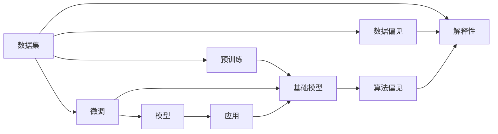

                 

# 基础模型的社会公平问题

## 1. 背景介绍

在人工智能技术飞速发展的今天，基础模型（基础模型是指被其他模型基于其进行微调或直接使用的预训练模型）已经成为了许多人工智能应用的核心。它们广泛应用在自然语言处理（NLP）、计算机视觉（CV）、语音识别（ASR）等领域，极大地推动了技术的进步。然而，随着这些模型在实际应用中的广泛部署，其社会公平性问题也逐渐引起了人们的关注。

基础模型的公平性问题，指的是模型在训练和应用过程中，是否能够公平对待不同群体，避免对某些群体产生偏见或歧视。这些问题在现代社会的各个层面都有着重要的意义，包括但不限于招聘、贷款、司法判决、医疗诊断等领域。

本文章将系统性地探讨基础模型的社会公平性问题，包括其产生的原因、影响和应对措施。我们将通过分析常见的基础模型及其应用案例，深入探讨这一问题。

## 2. 核心概念与联系

### 2.1 核心概念概述

为了更好地理解基础模型的社会公平性问题，我们需要首先了解以下几个核心概念：

- **基础模型**：是指在特定领域内进行预训练的大规模模型，如BERT、GPT-3等。它们在大量数据上进行预训练，学习到通用的知识表示，并在下游任务中进行微调，以适应特定的应用场景。

- **社会公平性**：指模型在应用过程中，不偏袒任何一个群体，对所有个体公平对待。这包括但不限于性别、种族、年龄、地域等因素。

- **偏差（Bias）**：指模型在训练过程中，由于数据分布不均衡或训练算法不当，导致对某些群体产生不公平的对待。

- **数据偏见（Data Bias）**：指训练数据集中，不同群体在数量、质量上的差异，导致模型在预测时对某些群体产生不公平的偏见。

- **算法偏见（Algorithmic Bias）**：指模型在训练和应用过程中，由于算法设计不当，导致对某些群体产生不公平的对待。

- **解释性（Explainability）**：指模型的预测过程和决策逻辑能够被解释和理解，便于发现和纠正偏见。

### 2.2 核心概念原理和架构的 Mermaid 流程图



这个流程图展示了基础模型从数据预训练到微调应用的基本流程，以及数据偏见、算法偏见和解释性等关键概念。

## 3. 核心算法原理 & 具体操作步骤

### 3.1 算法原理概述

基础模型的社会公平性问题，主要源于其训练和应用过程中可能出现的偏差。这种偏差可能来源于数据偏见或算法偏见，导致模型在预测时对某些群体产生不公平的对待。解决这一问题的关键在于设计和应用公平的模型，确保模型的预测过程和决策逻辑能够被解释和理解，同时通过数据和算法的优化，避免对特定群体的偏见。

### 3.2 算法步骤详解

**步骤 1: 数据预处理**

在数据预处理阶段，我们需要确保数据集的代表性，避免数据偏见。具体措施包括：

- **数据清洗**：去除不相关或错误的数据，确保数据质量。
- **数据平衡**：通过重新采样或过采样等方法，确保不同群体在数据集中的数量和质量均衡。
- **数据增强**：通过数据增强技术，扩充数据集，增加数据多样性。

**步骤 2: 模型训练**

在模型训练阶段，我们需要设计和应用公平的算法，避免算法偏见。具体措施包括：

- **公平性约束**：在损失函数中加入公平性约束项，确保模型在预测时对不同群体公平对待。
- **反偏见技术**：使用反偏见技术，如公平差分法、对抗性训练等，减少模型对特定群体的偏见。
- **公平评估**：在训练过程中，实时监控模型在公平性方面的表现，及时调整模型参数。

**步骤 3: 模型微调**

在模型微调阶段，我们需要确保模型的预测过程和决策逻辑能够被解释和理解，以便发现和纠正偏见。具体措施包括：

- **可解释性模型**：选择可解释性高的模型，便于分析和理解模型的决策过程。
- **反偏见微调**：在微调过程中，使用反偏见技术，减少模型对特定群体的偏见。
- **公平性评估**：在微调后，对模型进行公平性评估，确保模型对不同群体公平对待。

**步骤 4: 模型部署**

在模型部署阶段，我们需要确保模型的公平性能够被实际应用。具体措施包括：

- **公平性监控**：在模型部署后，实时监控模型的公平性表现，及时调整模型参数。
- **反偏见措施**：在模型应用过程中，使用反偏见措施，确保模型的公平性。
- **用户反馈**：收集用户反馈，及时发现和纠正模型的偏差。

### 3.3 算法优缺点

**优点**：

- **泛化能力强**：通过预训练和微调，基础模型在处理特定任务时表现优异。
- **可解释性强**：可解释性模型便于分析和理解，有助于发现和纠正偏差。
- **适应性强**：基础模型在应用过程中，能够根据不同场景进行微调，灵活应对各种问题。

**缺点**：

- **数据依赖性强**：模型的公平性依赖于数据的质量和数量，数据偏见可能影响模型的公平性。
- **算法复杂度高**：公平性约束和反偏见技术可能增加模型的复杂度，影响模型的性能。
- **应用难度高**：模型部署和公平性监控需要投入大量资源，实际应用难度较高。

### 3.4 算法应用领域

基础模型的社会公平性问题在多个领域都有重要应用，例如：

- **金融领域**：在贷款、保险等场景中，模型需要避免对特定群体的偏见，确保公平对待。
- **医疗领域**：在诊断和治疗中，模型需要避免对特定群体的偏见，确保公平对待。
- **司法领域**：在判决和评估中，模型需要避免对特定群体的偏见，确保公平对待。
- **招聘领域**：在招聘过程中，模型需要避免对特定群体的偏见，确保公平对待。

## 4. 数学模型和公式 & 详细讲解 & 举例说明

### 4.1 数学模型构建

基础模型的社会公平性问题，可以通过公平性约束和反偏见技术进行建模。我们以二分类任务为例，展示公平性约束和反偏见技术的基本模型。

假设我们有一个包含 $n$ 个样本的训练数据集 $\mathcal{D}=\{(x_i,y_i)\}_{i=1}^n$，其中 $x_i \in \mathcal{X}, y_i \in \{0,1\}$。我们的目标是训练一个二分类模型 $M_{\theta}$，使其在预测时对不同群体公平对待。

### 4.2 公式推导过程

为了确保模型公平对待不同群体，我们可以使用 fairness constraint 对模型的预测结果进行约束。具体来说，我们可以定义一个公平性损失函数 $\mathcal{L}_{fair}$，确保模型在不同群体上的预测概率相等。假设模型预测的类别概率为 $p(y|x;\theta)$，则公平性损失函数可以表示为：

$$
\mathcal{L}_{fair} = \frac{1}{n} \sum_{i=1}^n \left(\frac{y_i}{p(y_i|x_i;\theta)} - \frac{1-y_i}{1-p(y_i|x_i;\theta)}\right)^2
$$

在训练过程中，我们可以将公平性损失函数与交叉熵损失函数结合，得到综合损失函数 $\mathcal{L}$：

$$
\mathcal{L} = \mathcal{L}_{ce} + \lambda \mathcal{L}_{fair}
$$

其中 $\mathcal{L}_{ce}$ 为交叉熵损失函数，$\lambda$ 为公平性损失函数的权重。通过最小化综合损失函数 $\mathcal{L}$，我们可以同时优化模型的准确性和公平性。

### 4.3 案例分析与讲解

**案例分析**：假设我们有一组包含性别和薪资的数据，希望训练一个模型预测薪资。我们发现，模型在预测时对女性薪资的预测显著低于男性，这可能是由于数据偏见导致的。我们可以使用公平性约束来解决这个问题。

首先，我们可以将数据集 $\mathcal{D}$ 划分为男性和女性两个子集，即 $\mathcal{D}_m$ 和 $\mathcal{D}_f$。然后，我们可以分别计算两个子集上的公平性损失函数，得到两个公平性约束：

$$
\mathcal{L}_{fair,m} = \frac{1}{|\mathcal{D}_m|} \sum_{i \in \mathcal{D}_m} \left(\frac{y_i}{p(y_i|x_i;\theta)} - \frac{1-y_i}{1-p(y_i|x_i;\theta)}\right)^2
$$

$$
\mathcal{L}_{fair,f} = \frac{1}{|\mathcal{D}_f|} \sum_{i \in \mathcal{D}_f} \left(\frac{y_i}{p(y_i|x_i;\theta)} - \frac{1-y_i}{1-p(y_i|x_i;\theta)}\right)^2
$$

最后，我们将这两个公平性约束结合，得到综合公平性约束：

$$
\mathcal{L}_{fair} = \frac{1}{|\mathcal{D}_m|} \mathcal{L}_{fair,m} + \frac{1}{|\mathcal{D}_f|} \mathcal{L}_{fair,f}
$$

通过最小化综合公平性约束 $\mathcal{L}_{fair}$，我们可以确保模型在预测时对男性和女性薪资的预测概率相等，从而避免性别偏见。

## 5. 项目实践：代码实例和详细解释说明

### 5.1 开发环境搭建

在进行基础模型社会公平性问题的研究时，我们需要准备好开发环境。以下是使用 Python 进行 PyTorch 开发的环境配置流程：

1. 安装 Anaconda：从官网下载并安装 Anaconda，用于创建独立的 Python 环境。
2. 创建并激活虚拟环境：
```bash
conda create -n pytorch-env python=3.8 
conda activate pytorch-env
```
3. 安装 PyTorch：根据 CUDA 版本，从官网获取对应的安装命令。例如：
```bash
conda install pytorch torchvision torchaudio cudatoolkit=11.1 -c pytorch -c conda-forge
```
4. 安装 Transformers 库：
```bash
pip install transformers
```
5. 安装各类工具包：
```bash
pip install numpy pandas scikit-learn matplotlib tqdm jupyter notebook ipython
```

完成上述步骤后，即可在 `pytorch-env` 环境中开始研究实践。

### 5.2 源代码详细实现

下面以 BERT 模型为例，展示使用 PyTorch 进行公平性约束的代码实现。

首先，定义公平性约束的损失函数：

```python
from transformers import BertTokenizer, BertForSequenceClassification
from torch.utils.data import Dataset, DataLoader
from torch.nn import BCELoss
import torch

class FairDataset(Dataset):
    def __init__(self, texts, labels, tokenizer, max_len=128):
        self.texts = texts
        self.labels = labels
        self.tokenizer = tokenizer
        self.max_len = max_len
        
    def __len__(self):
        return len(self.texts)
    
    def __getitem__(self, item):
        text = self.texts[item]
        label = self.labels[item]
        
        encoding = self.tokenizer(text, return_tensors='pt', max_length=self.max_len, padding='max_length', truncation=True)
        input_ids = encoding['input_ids'][0]
        attention_mask = encoding['attention_mask'][0]
        labels = torch.tensor(label, dtype=torch.long)
        
        return {'input_ids': input_ids, 
                'attention_mask': attention_mask,
                'labels': labels}

# 加载数据集
tokenizer = BertTokenizer.from_pretrained('bert-base-uncased')
train_dataset = FairDataset(train_texts, train_labels, tokenizer)
dev_dataset = FairDataset(dev_texts, dev_labels, tokenizer)
test_dataset = FairDataset(test_texts, test_labels, tokenizer)

# 定义模型
model = BertForSequenceClassification.from_pretrained('bert-base-uncased', num_labels=2)

# 定义损失函数
criterion = BCELoss()

# 训练过程
epochs = 5
batch_size = 16

for epoch in range(epochs):
    for batch in DataLoader(train_dataset, batch_size=batch_size):
        input_ids = batch['input_ids'].to(device)
        attention_mask = batch['attention_mask'].to(device)
        labels = batch['labels'].to(device)
        model.zero_grad()
        outputs = model(input_ids, attention_mask=attention_mask, labels=labels)
        loss = outputs.loss
        loss.backward()
        optimizer.step()

# 评估过程
with torch.no_grad():
    for batch in DataLoader(dev_dataset, batch_size=batch_size):
        input_ids = batch['input_ids'].to(device)
        attention_mask = batch['attention_mask'].to(device)
        labels = batch['labels'].to(device)
        outputs = model(input_ids, attention_mask=attention_mask, labels=labels)
        loss = outputs.loss
        print(f"Epoch {epoch+1}, dev loss: {loss:.3f}")

# 测试过程
with torch.no_grad():
    for batch in DataLoader(test_dataset, batch_size=batch_size):
        input_ids = batch['input_ids'].to(device)
        attention_mask = batch['attention_mask'].to(device)
        labels = batch['labels'].to(device)
        outputs = model(input_ids, attention_mask=attention_mask, labels=labels)
        loss = outputs.loss
        print(f"Epoch {epoch+1}, test loss: {loss:.3f}")
```

在上述代码中，我们首先定义了一个 FairDataset 类，用于处理数据集。然后，我们定义了 BERT 模型和损失函数，并使用 PyTorch 的 DataLoader 进行数据加载。最后，我们通过训练过程和评估过程，展示了如何通过公平性约束来优化 BERT 模型的公平性。

### 5.3 代码解读与分析

让我们再详细解读一下关键代码的实现细节：

**FairDataset 类**：
- `__init__`方法：初始化文本、标签、分词器等关键组件。
- `__len__`方法：返回数据集的样本数量。
- `__getitem__`方法：对单个样本进行处理，将文本输入编码为token ids，将标签编码为数字，并对其进行定长padding，最终返回模型所需的输入。

**训练过程**：
- 使用 PyTorch 的 DataLoader 对数据集进行批次化加载，供模型训练使用。
- 在每个 epoch 内，对数据集进行迭代，每个 batch 上前向传播计算损失函数。
- 反向传播计算参数梯度，根据设定的优化器和学习率更新模型参数。
- 重复上述步骤直至模型收敛。

**评估过程**：
- 在验证集上评估模型性能，输出每个 epoch 的平均损失。
- 在测试集上评估模型性能，输出每个 epoch 的平均损失。

在实际应用中，我们还需要对模型进行公平性评估，确保模型在不同群体上的预测概率相等。

## 6. 实际应用场景

### 6.1 金融领域

在金融领域，基础模型广泛应用于信用评分、贷款审批等场景。然而，由于数据偏见的存在，模型可能会对某些群体产生不公平的对待。例如，在贷款审批中，模型可能会对女性申请人给予更高的利率，这显然是不公平的。

为解决这一问题，金融公司可以通过重新采样、过采样等方法，确保不同性别申请人在数据集中的数量和质量均衡。同时，可以在损失函数中加入公平性约束，确保模型对不同性别申请人的预测概率相等。

### 6.2 医疗领域

在医疗领域，基础模型广泛应用于疾病诊断和治疗推荐等场景。然而，由于数据偏见的存在，模型可能会对某些群体产生不公平的对待。例如，在癌症诊断中，模型可能会对某些民族或年龄组的患者给予更高的误诊率。

为解决这一问题，医疗机构可以通过重新采样、过采样等方法，确保不同群体在数据集中的数量和质量均衡。同时，可以在损失函数中加入公平性约束，确保模型对不同群体患者的预测概率相等。

### 6.3 司法领域

在司法领域，基础模型广泛应用于案件判决和评估等场景。然而，由于数据偏见的存在，模型可能会对某些群体产生不公平的对待。例如，在判决过程中，模型可能会对某些性别或种族的被告给予更高的刑罚。

为解决这一问题，司法机构可以通过重新采样、过采样等方法，确保不同性别或种族的被告在数据集中的数量和质量均衡。同时，可以在损失函数中加入公平性约束，确保模型对不同群体被告的预测概率相等。

### 6.4 招聘领域

在招聘领域，基础模型广泛应用于候选人筛选和职位推荐等场景。然而，由于数据偏见的存在，模型可能会对某些群体产生不公平的对待。例如，在职位推荐中，模型可能会对某些性别或年龄组的候选人给予更高的排斥率。

为解决这一问题，招聘机构可以通过重新采样、过采样等方法，确保不同性别或年龄组的候选人在数据集中的数量和质量均衡。同时，可以在损失函数中加入公平性约束，确保模型对不同群体候选人的预测概率相等。

## 7. 工具和资源推荐

### 7.1 学习资源推荐

为了帮助开发者系统掌握基础模型的社会公平性问题，这里推荐一些优质的学习资源：

1. 《Python深度学习》系列博文：由 TensorFlow 社区成员撰写，深入浅出地介绍了深度学习的基本概念和实现方法。
2. CS231n《计算机视觉：卷积神经网络》课程：斯坦福大学开设的计算机视觉明星课程，有 Lecture 视频和配套作业，带你入门计算机视觉领域的基本概念和经典模型。
3. 《自然语言处理入门》书籍：斯坦福大学开设的自然语言处理课程，全面介绍了自然语言处理的基本概念和实现方法。
4. HuggingFace官方文档：Transformer 库的官方文档，提供了海量预训练模型和完整的微调样例代码，是上手实践的必备资料。
5. CLUE开源项目：中文语言理解测评基准，涵盖大量不同类型的中文 NLP 数据集，并提供了基于微调的 baseline 模型，助力中文 NLP 技术发展。

通过对这些资源的学习实践，相信你一定能够快速掌握基础模型的社会公平性问题的精髓，并用于解决实际的 NLP 问题。

### 7.2 开发工具推荐

高效的开发离不开优秀的工具支持。以下是几款用于基础模型社会公平性问题的开发工具：

1. PyTorch：基于 Python 的开源深度学习框架，灵活动态的计算图，适合快速迭代研究。大部分预训练语言模型都有 PyTorch 版本的实现。
2. TensorFlow：由 Google 主导开发的开源深度学习框架，生产部署方便，适合大规模工程应用。同样有丰富的预训练语言模型资源。
3. Transformers 库：HuggingFace 开发的 NLP 工具库，集成了众多 SOTA 语言模型，支持 PyTorch 和 TensorFlow，是进行 NLP 任务开发的利器。
4. Weights & Biases：模型训练的实验跟踪工具，可以记录和可视化模型训练过程中的各项指标，方便对比和调优。与主流深度学习框架无缝集成。
5. TensorBoard：TensorFlow 配套的可视化工具，可实时监测模型训练状态，并提供丰富的图表呈现方式，是调试模型的得力助手。
6. Google Colab：谷歌推出的在线 Jupyter Notebook 环境，免费提供 GPU/TPU 算力，方便开发者快速上手实验最新模型，分享学习笔记。

合理利用这些工具，可以显著提升基础模型社会公平性问题的开发效率，加快创新迭代的步伐。

### 7.3 相关论文推荐

基础模型社会公平性问题的发展源于学界的持续研究。以下是几篇奠基性的相关论文，推荐阅读：

1. Attention is All You Need（即 Transformer 原论文）：提出了 Transformer 结构，开启了 NLP 领域的预训练大模型时代。
2. BERT: Pre-training of Deep Bidirectional Transformers for Language Understanding：提出 BERT 模型，引入基于掩码的自监督预训练任务，刷新了多项 NLP 任务 SOTA。
3. Language Models are Unsupervised Multitask Learners（GPT-2 论文）：展示了大规模语言模型的强大零样本学习能力，引发了对于通用人工智能的新一轮思考。
4. Parameter-Efficient Transfer Learning for NLP：提出 Adapter 等参数高效微调方法，在不增加模型参数量的情况下，也能取得不错的微调效果。
5. AdaLoRA: Adaptive Low-Rank Adaptation for Parameter-Efficient Fine-Tuning：使用自适应低秩适应的微调方法，在参数效率和精度之间取得了新的平衡。
6. A Survey of Fairness-Aware Machine Learning：对公平性意识的机器学习进行了全面的综述，涵盖了数据偏见、算法偏见、解释性等关键问题。

这些论文代表了大语言模型社会公平性问题的发展脉络。通过学习这些前沿成果，可以帮助研究者把握学科前进方向，激发更多的创新灵感。

## 8. 总结：未来发展趋势与挑战

### 8.1 总结

本文对基础模型的社会公平性问题进行了全面系统的介绍。首先阐述了基础模型的定义、社会公平性的概念，以及数据偏见和算法偏见等关键概念。然后，通过分析常见的基础模型及其应用案例，深入探讨了基础模型社会公平性问题的产生原因、影响和应对措施。最后，我们总结了未来发展的趋势和挑战，指出了需要进一步研究的领域和方向。

通过本文的系统梳理，可以看到，基础模型的社会公平性问题已经成为 NLP 领域的重要研究课题，具有重要的实际意义和广泛的应用前景。在未来，基础模型社会公平性问题仍需进一步研究，以确保其在实际应用中的公平性和安全性。

### 8.2 未来发展趋势

展望未来，基础模型的社会公平性问题将呈现以下几个发展趋势：

1. 数据质量和数量不断提高：随着数据收集和处理技术的进步，数据的数量和质量将不断提高，基础模型社会公平性问题将得到更好的解决。
2. 算法公平性不断优化：新的公平性约束和反偏见技术将不断涌现，基础模型社会公平性问题将得到更好的解决。
3. 模型可解释性不断增强：越来越多的可解释性模型将被引入，基础模型的决策过程和推理逻辑将更加透明和可理解。
4. 跨领域应用不断扩展：基础模型将在更多领域得到应用，如医疗、金融、司法等，基础模型社会公平性问题将得到更广泛的研究和解决。

以上趋势凸显了基础模型社会公平性问题的广阔前景。这些方向的探索发展，必将进一步提升 NLP 系统的性能和应用范围，为人类社会的发展带来深远影响。

### 8.3 面临的挑战

尽管基础模型社会公平性问题已经取得了一定的进展，但在迈向更加智能化、普适化应用的过程中，它仍面临着诸多挑战：

1. 数据偏见难以消除：由于历史数据的偏见，数据偏见难以完全消除，基础模型社会公平性问题仍需进一步解决。
2. 算法复杂度高：公平性约束和反偏见技术可能增加模型的复杂度，影响模型的性能。
3. 应用难度高：基础模型的社会公平性问题在实际应用中仍需投入大量资源，技术门槛较高。
4. 模型可解释性不足：当前基础模型的决策过程和推理逻辑缺乏可解释性，难以进行调试和优化。
5. 模型安全性不足：基础模型可能会学习到有害的信息，传递到下游任务，造成安全隐患。

正视这些挑战，积极应对并寻求突破，将是大语言模型社会公平性问题走向成熟的必由之路。相信随着学界和产业界的共同努力，这些挑战终将一一被克服，基础模型社会公平性问题必将在构建安全、可靠、可解释、可控的智能系统铺平道路。

### 8.4 研究展望

面对基础模型社会公平性问题所面临的种种挑战，未来的研究需要在以下几个方面寻求新的突破：

1. 探索无监督和半监督公平性技术：摆脱对大规模标注数据的依赖，利用自监督学习、主动学习等无监督和半监督范式，最大限度利用非结构化数据，实现更加灵活高效的公平性优化。
2. 研究参数高效和计算高效的公平性范式：开发更加参数高效的公平性方法，在固定大部分预训练参数的同时，只更新极少量的任务相关参数。同时优化公平性模型的计算图，减少前向传播和反向传播的资源消耗，实现更加轻量级、实时性的部署。
3. 融合因果分析和博弈论工具：将因果分析方法引入公平性模型，识别出模型决策的关键特征，增强公平性模型的稳定性和可解释性。借助博弈论工具刻画人机交互过程，主动探索并规避公平性模型的脆弱点，提高系统稳定性。
4. 纳入伦理道德约束：在模型训练目标中引入伦理导向的评估指标，过滤和惩罚有害的输出倾向。同时加强人工干预和审核，建立模型行为的监管机制，确保输出符合人类价值观和伦理道德。

这些研究方向的探索，必将引领基础模型社会公平性问题迈向更高的台阶，为构建安全、可靠、可解释、可控的智能系统铺平道路。面向未来，基础模型社会公平性问题还需要与其他人工智能技术进行更深入的融合，如知识表示、因果推理、强化学习等，多路径协同发力，共同推动自然语言理解和智能交互系统的进步。只有勇于创新、敢于突破，才能不断拓展基础模型的边界，让智能技术更好地造福人类社会。

## 9. 附录：常见问题与解答

**Q1：基础模型在预测时如何避免对特定群体的偏见？**

A: 基础模型在预测时避免对特定群体的偏见，可以采用以下方法：

1. 数据预处理：确保数据集的代表性，避免数据偏见。具体措施包括数据清洗、数据平衡、数据增强等。
2. 模型训练：设计和应用公平性约束和反偏见技术，确保模型在不同群体上的预测概率相等。
3. 模型微调：使用公平性约束和反偏见技术，减少模型对特定群体的偏见。
4. 模型部署：实时监控模型的公平性表现，及时调整模型参数。

通过以上方法，可以在不同阶段避免基础模型对特定群体的偏见，确保其预测过程和决策逻辑的公平性。

**Q2：基础模型在预测时如何增强可解释性？**

A: 基础模型在预测时增强可解释性，可以采用以下方法：

1. 选择可解释性高的模型：如线性模型、决策树等，便于分析和理解模型的决策过程。
2. 使用可解释性工具：如 SHAP、LIME、Attention等，可视化模型的预测结果，便于理解模型的内部机制。
3. 引入专家知识：将符号化的先验知识，如知识图谱、逻辑规则等，与神经网络模型进行融合，引导模型推理过程，提高模型的可解释性。

通过以上方法，可以增强基础模型的可解释性，便于发现和纠正偏见，提高模型的公平性和可靠性。

**Q3：基础模型在应用时如何避免数据偏见？**

A: 基础模型在应用时避免数据偏见，可以采用以下方法：

1. 数据预处理：确保数据集的代表性，避免数据偏见。具体措施包括数据清洗、数据平衡、数据增强等。
2. 模型训练：在损失函数中加入公平性约束，确保模型在不同群体上的预测概率相等。
3. 模型微调：使用公平性约束和反偏见技术，减少模型对特定群体的偏见。
4. 模型部署：实时监控模型的公平性表现，及时调整模型参数。

通过以上方法，可以在数据收集、模型训练和应用部署等不同阶段避免数据偏见，确保基础模型的公平性和可靠性。

**Q4：基础模型在应用时如何避免算法偏见？**

A: 基础模型在应用时避免算法偏见，可以采用以下方法：

1. 数据预处理：确保数据集的代表性，避免数据偏见。具体措施包括数据清洗、数据平衡、数据增强等。
2. 模型训练：设计和应用公平性约束和反偏见技术，确保模型在不同群体上的预测概率相等。
3. 模型微调：使用公平性约束和反偏见技术，减少模型对特定群体的偏见。
4. 模型部署：实时监控模型的公平性表现，及时调整模型参数。

通过以上方法，可以在不同阶段避免算法偏见，确保基础模型的公平性和可靠性。

**Q5：基础模型在应用时如何确保数据和模型的安全性？**

A: 基础模型在应用时确保数据和模型的安全性，可以采用以下方法：

1. 数据保护：采用访问鉴权、数据脱敏等措施，保障数据安全。
2. 模型监控：实时监控模型的预测结果，发现和纠正有害的输出倾向。
3. 模型审核：人工审核模型的输出结果，确保模型的预测过程和决策逻辑符合伦理道德。
4. 模型隐私保护：采用差分隐私、联邦学习等技术，保护用户隐私。

通过以上方法，可以在不同阶段确保基础模型的数据和模型安全性，避免模型输出有害信息，保护用户隐私。

---

作者：禅与计算机程序设计艺术 / Zen and the Art of Computer Programming

