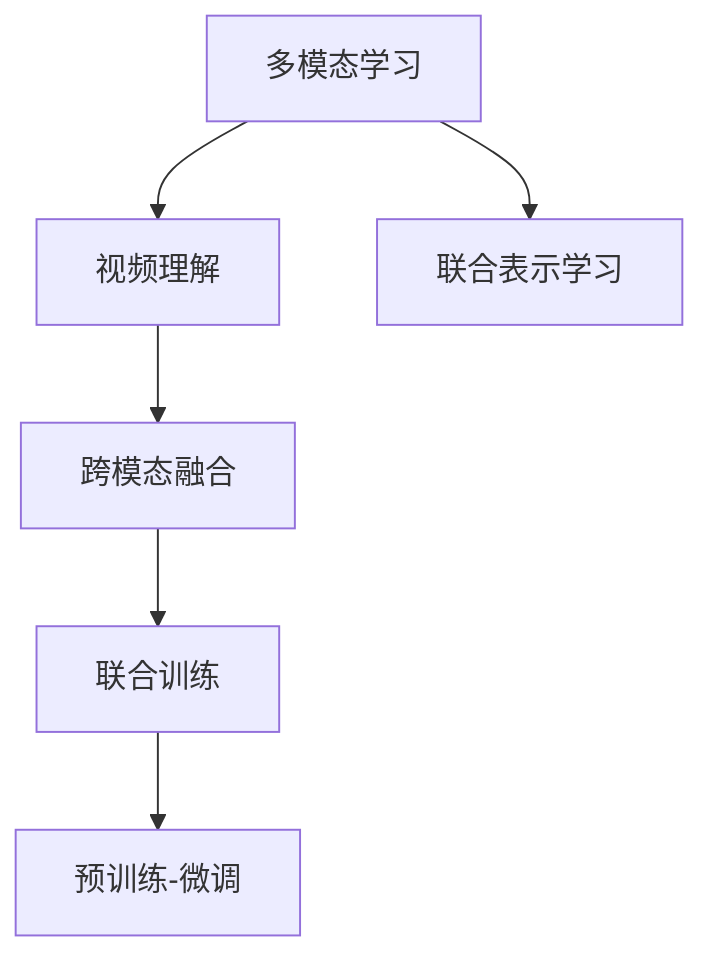

                 

## 1. 背景介绍

### 1.1 问题由来
随着视频数据的爆炸式增长，视频理解技术成为了计算机视觉和自然语言处理（NLP）领域的重要研究方向。传统的视频理解方法往往只关注单一的视觉或语音信息，而忽略了视频中蕴含的丰富模态信息，导致在处理复杂视频内容时效果欠佳。

### 1.2 问题核心关键点
多模态AI在视频理解中的应用，旨在利用视频中包含的视觉、听觉、文本等多源信息，构建更加全面和精准的视频理解模型。该技术对于视频搜索、内容推荐、事件检测、行为分析等多个应用场景具有重要价值。

### 1.3 问题研究意义
研究多模态视频理解技术，对于提升视频内容分析和处理的效率、准确性和自动化水平，具有重要意义。在实际应用中，多模态AI能够帮助人们在大量的视频数据中快速找到感兴趣的内容，提升用户体验，同时也能应用于安防监控、医学影像分析等对安全性、精度要求较高的领域。

## 2. 核心概念与联系

### 2.1 核心概念概述

为了更好地理解多模态AI在视频理解中的应用与挑战，本节将介绍几个关键概念：

- **多模态学习(Multimodal Learning)**：指同时利用多种数据源（如图像、文本、语音等）进行模型训练，以提高模型对复杂数据环境的适应能力。

- **视频理解(Video Understanding)**：指通过机器学习技术，分析视频中的视觉、音频和文本信息，理解视频内容。

- **跨模态融合(Cross-Modal Fusion)**：指将不同模态的信息通过某种方式整合在一起，生成更加全面、准确的视频表示。

- **联合训练(Joint Training)**：指在训练过程中同时考虑不同模态的数据，以提高模型的跨模态泛化能力。

- **预训练-微调(Fine-Tuning)**：指在预训练大模型基础上，通过少量标注数据进行微调，使其适应特定视频理解任务。

- **多模态表示学习(Multimodal Representation Learning)**：指学习视频中不同模态的联合表示，以便更好地捕捉视频内容的多方面特征。

这些核心概念之间的逻辑关系可以通过以下Mermaid流程图来展示：



这个流程图展示了多模态视频理解中各个概念的联系和作用。

## 3. 核心算法原理 & 具体操作步骤

### 3.1 算法原理概述

多模态AI在视频理解中的核心思想是利用视频的多模态信息，通过深度学习模型进行联合学习，以获得更加全面和准确的视频表示。其关键在于如何有效地将视觉、音频、文本等多种数据源融合在一起，并学习到跨模态的联合表示。

形式化地，设视频中的视觉信息为 $x$，音频信息为 $y$，文本信息为 $z$，目标为学习一个联合表示函数 $f: (x, y, z) \rightarrow h$，其中 $h$ 表示跨模态的联合表示。通过优化损失函数 $\mathcal{L}$，使得 $f$ 尽可能地逼近视频内容：

$$
\mathop{\arg\min}_{f} \mathcal{L}(f(x, y, z), \text{Ground Truth})
$$

在实践中，我们通常采用端到端的深度学习框架，如PyTorch、TensorFlow等，来实现这一目标。

### 3.2 算法步骤详解

基于多模态AI的视频理解通常包括以下几个关键步骤：

**Step 1: 数据预处理**
- 收集视频数据集，并对每段视频进行剪辑，提取其中的视觉、音频、文本等多模态信息。
- 对数据集进行标注，包括视觉事件、语音关键词、文本摘要等。

**Step 2: 选择模型架构**
- 选择合适的深度学习模型架构，如CNN、RNN、Transformer等，并对其进行多模态扩展。
- 设计合适的跨模态融合方式，如concatenation、attention等。

**Step 3: 联合训练**
- 定义联合训练的损失函数，同时考虑视觉、音频、文本等多个模态的信息。
- 使用深度学习框架进行联合训练，逐步优化模型参数。

**Step 4: 预训练-微调**
- 在多模态数据上对模型进行预训练，提高其泛化能力。
- 使用目标任务的数据进行微调，调整模型参数以适应特定任务。

**Step 5: 模型评估与部署**
- 在测试集上评估模型的性能，使用常见的评价指标如准确率、F1分数等。
- 将模型部署到实际应用中，进行实时视频理解。

### 3.3 算法优缺点

多模态AI在视频理解中的优点包括：

- **多源融合**：利用视频中的多种模态信息，提高模型的全面性和准确性。
- **泛化能力强**：预训练-微调方法提升了模型的泛化能力，使其在处理新数据时表现更加稳定。
- **灵活性高**：多种模型架构可供选择，可以根据具体任务进行灵活调整。

然而，该方法也存在一些局限性：

- **数据需求高**：需要大量的标注数据进行联合训练和微调。
- **计算复杂度高**：多模态信息的处理和融合增加了计算复杂度。
- **模型复杂度高**：多模态模型的参数量和计算量较大，需要较强的计算资源。

### 3.4 算法应用领域

多模态AI在视频理解中已经应用于多个领域，例如：

- **视频搜索**：根据用户输入的关键词，从视频库中检索出相关视频。
- **内容推荐**：根据用户的视频观看历史和兴趣标签，推荐感兴趣的视频内容。
- **事件检测**：从视频中自动检测特定事件（如火灾、车祸）的发生。
- **行为分析**：通过分析视频中的人物动作和表情，进行情感分析、行为识别等。
- **医学影像分析**：对医学影像中的多种模态信息进行分析，辅助医生诊断。

## 4. 数学模型和公式 & 详细讲解 & 举例说明

### 4.1 数学模型构建

为了更好地理解多模态AI在视频理解中的数学模型，我们首先定义视频中的视觉、音频、文本等多个模态的信息表示：

- **视觉信息**：$x \in \mathbb{R}^{C \times H \times W}$，其中 $C$ 是通道数，$H$ 和 $W$ 分别是视频的高度和宽度。
- **音频信息**：$y \in \mathbb{R}^{T}$，其中 $T$ 是时间长度。
- **文本信息**：$z \in \mathbb{R}^{L}$，其中 $L$ 是文本长度。

目标为学习一个联合表示函数 $f: (x, y, z) \rightarrow h$，其中 $h \in \mathbb{R}^{D}$，$D$ 是联合表示的维度。

### 4.2 公式推导过程

假设我们采用Transformer模型来进行多模态联合学习，设视觉编码器为 $V$，音频编码器为 $A$，文本编码器为 $T$，跨模态融合器为 $F$，联合表示器为 $H$。则多模态AI在视频理解中的基本框架可以表示为：

$$
h = H(f(V(x), A(y), T(z)))
$$

其中 $f$ 是跨模态融合器，$H$ 是联合表示器。在实践中，$f$ 和 $H$ 的具体实现形式可以是attention机制、concatenation、MLP等。

以attention机制为例，其计算公式为：

$$
f_{att}(x, y, z) = \mathrm{Attention}(x, y, z) = \mathrm{Softmax}(Q(K^{V} x, K^{A} y, K^{T} z)) \cdot (K^{V} x, K^{A} y, K^{T} z)
$$

其中 $Q(K^{V} x, K^{A} y, K^{T} z)$ 是跨模态的注意力权重，$K^{V}, K^{A}, K^{T}$ 是视觉、音频、文本编码器的输出。

### 4.3 案例分析与讲解

以事件检测为例，假设我们要检测视频中的火灾事件。通过预训练-微调的方式，我们首先使用大规模无标签视频数据对模型进行预训练，然后使用标注好的火灾视频进行微调。在微调过程中，模型会自动学习到火灾事件的关键视觉、音频和文本特征，并在新视频中进行事件检测。

## 5. 项目实践：代码实例和详细解释说明

### 5.1 开发环境搭建

在进行多模态视频理解开发前，我们需要准备好开发环境。以下是使用Python进行PyTorch开发的环境配置流程：

1. 安装Anaconda：从官网下载并安装Anaconda，用于创建独立的Python环境。

2. 创建并激活虚拟环境：
```bash
conda create -n pytorch-env python=3.8 
conda activate pytorch-env
```

3. 安装PyTorch：根据CUDA版本，从官网获取对应的安装命令。例如：
```bash
conda install pytorch torchvision torchaudio cudatoolkit=11.1 -c pytorch -c conda-forge
```

4. 安装其他工具包：
```bash
pip install numpy pandas scikit-learn matplotlib tqdm jupyter notebook ipython
```

完成上述步骤后，即可在`pytorch-env`环境中开始多模态视频理解的实践。

### 5.2 源代码详细实现

这里以视频搜索为例，给出使用PyTorch进行多模态视频搜索的代码实现。

```python
import torch
import torchvision.transforms as transforms
import torch.nn as nn
import torch.nn.functional as F
from transformers import BertForSequenceClassification, BertTokenizer
from torch.utils.data import DataLoader, Dataset

class VideoSearchDataset(Dataset):
    def __init__(self, videos, titles, labels):
        self.videos = videos
        self.titles = titles
        self.labels = labels
        self.transform = transforms.Compose([
            transforms.Resize((224, 224)),
            transforms.ToTensor(),
        ])
        
    def __len__(self):
        return len(self.videos)
    
    def __getitem__(self, idx):
        video = self.videos[idx]
        title = self.titles[idx]
        label = self.labels[idx]
        
        video = self.transform(video)
        title = self.transform(title)
        
        return {'video': video, 'title': title, 'label': label}

class VideoSearchModel(nn.Module):
    def __init__(self, num_classes):
        super(VideoSearchModel, self).__init__()
        self.video_encoder = VGG19(pretrained=True)
        self.audio_encoder = Wav2Vec2FeatureExtractor()
        self.text_encoder = BertForSequenceClassification.from_pretrained('bert-base-uncased', num_labels=1)
        self.classifier = nn.Linear(1024, num_classes)
        
    def forward(self, video, title, label):
        video_feature = self.video_encoder(video)
        audio_feature = self.audio_encoder(video)
        text_feature = self.text_encoder(title)
        
        features = torch.cat([video_feature, audio_feature, text_feature], dim=1)
        logits = self.classifier(features)
        
        return logits

# 加载模型和数据集
model = VideoSearchModel(num_classes)
dataloader = DataLoader(VideoSearchDataset(videos, titles, labels), batch_size=16, shuffle=True)
device = torch.device('cuda' if torch.cuda.is_available() else 'cpu')
model.to(device)

# 训练模型
criterion = nn.BCEWithLogitsLoss()
optimizer = torch.optim.Adam(model.parameters(), lr=1e-4)

for epoch in range(epochs):
    model.train()
    loss = 0
    for video, title, label in dataloader:
        video = video.to(device)
        title = title.to(device)
        label = label.to(device)
        
        optimizer.zero_grad()
        logits = model(video, title, label)
        loss = criterion(logits, label)
        loss.backward()
        optimizer.step()
        
    print(f"Epoch {epoch+1}, loss: {loss:.4f}")
```

这段代码展示了如何使用PyTorch实现多模态视频搜索模型，包括数据预处理、模型定义、训练流程等关键步骤。

### 5.3 代码解读与分析

让我们再详细解读一下关键代码的实现细节：

**VideoSearchDataset类**：
- `__init__`方法：初始化视频、标题、标签等数据信息，并定义数据预处理方式。
- `__len__`方法：返回数据集大小。
- `__getitem__`方法：对单个样本进行处理，将视频和标题数据转换为模型所需的输入格式。

**VideoSearchModel类**：
- `__init__`方法：定义多模态视频搜索模型结构，包括视觉、音频、文本编码器和分类器。
- `forward`方法：前向传播计算模型输出。

**训练流程**：
- 使用DataLoader对数据集进行批处理，以便模型进行训练。
- 在每个批次上，前向传播计算模型输出和损失函数。
- 反向传播更新模型参数，并输出该批次的平均损失。

可以看到，多模态视频搜索模型的代码实现相对复杂，但基于PyTorch的灵活性和丰富功能，可以很容易地处理多种数据源，实现模型训练和推理。

## 6. 实际应用场景

### 6.1 视频搜索

多模态AI在视频搜索中的应用场景非常广泛。例如，在视频网站如YouTube、Bilibili等平台上，用户可以通过视频标题、描述、标签等信息进行搜索，找到感兴趣的视频内容。多模态视频搜索模型能够更好地理解用户的搜索意图，提供更加准确和相关的搜索结果。

### 6.2 内容推荐

基于多模态AI的视频推荐系统，能够根据用户的视频观看历史、兴趣标签、评分等信息，推荐相似的视频内容。例如，用户看完一部科幻电影后，推荐系统可以根据视觉、文本等模态信息，推荐更多科幻题材的电影。

### 6.3 事件检测

在安防监控、社交媒体分析等场景中，需要自动检测特定事件的发生。多模态AI能够从视频中提取视觉、音频、文本等多种信息，准确识别事件的发生，并提供预警。

### 6.4 行为分析

在智能家居、智慧办公等场景中，需要对视频中的人物行为进行分析，例如检测是否在摄像头范围内。多模态AI能够从视频中提取视觉和动作信息，检测和跟踪人物行为，从而提高安全性和智能化水平。

## 7. 工具和资源推荐

### 7.1 学习资源推荐

为了帮助开发者系统掌握多模态视频理解的技术基础和实践技巧，这里推荐一些优质的学习资源：

1. **《深度学习》书籍**：Ian Goodfellow、Yoshua Bengio 和 Aaron Courville 编写的经典教材，全面介绍了深度学习的基本概念和算法。

2. **CS231n《卷积神经网络》课程**：斯坦福大学开设的深度学习课程，重点介绍计算机视觉领域的算法和模型。

3. **CS224d《多模态学习》课程**：斯坦福大学开设的课程，讲解多模态学习和跨模态融合的基本方法和技术。

4. **HuggingFace官方文档**：Transformer库的官方文档，提供了丰富的预训练模型和微调样例代码，是上手实践的必备资料。

5. **Video Understanding with Attention-based Multimodal Fusion**：一篇综述性论文，总结了基于注意力机制的多模态视频理解技术，并展望了未来的研究方向。

通过对这些资源的学习实践，相信你一定能够快速掌握多模态视频理解的核心技术，并用于解决实际的多模态视频理解问题。

### 7.2 开发工具推荐

高效的开发离不开优秀的工具支持。以下是几款用于多模态视频理解开发的常用工具：

1. **PyTorch**：基于Python的开源深度学习框架，灵活动态的计算图，适合快速迭代研究。

2. **TensorFlow**：由Google主导开发的开源深度学习框架，生产部署方便，适合大规模工程应用。

3. **HuggingFace Transformers库**：提供了丰富的预训练模型和跨模态融合方法，是进行多模态视频理解开发的利器。

4. **Jupyter Notebook**：交互式编程环境，适合快速迭代实验。

5. **Weights & Biases**：模型训练的实验跟踪工具，可以记录和可视化模型训练过程中的各项指标。

6. **TensorBoard**：TensorFlow配套的可视化工具，可实时监测模型训练状态，并提供丰富的图表呈现方式。

合理利用这些工具，可以显著提升多模态视频理解的开发效率，加快创新迭代的步伐。

### 7.3 相关论文推荐

多模态视频理解的发展源于学界的持续研究。以下是几篇奠基性的相关论文，推荐阅读：

1. **Attention is All You Need**：提出了Transformer结构，开启了NLP领域的预训练大模型时代。

2. **ViT: An Image is Worth 16x16 Words**：提出了视觉Transformer模型，展示了其在图像分类、物体检测等任务中的强大表现。

3. **VideoBERT: A Multimodal Pre-training Approach for Video Understanding**：提出VideoBERT模型，通过联合训练视觉、文本信息，显著提升了视频理解性能。

4. **Self-Attention Guided Multimodal Fusion for Action Recognition**：研究了多模态信息融合的方法，提高了视频行为识别的准确性。

5. **The Multimodal Transformer**：提出了多模态Transformer模型，进一步提升了多模态视频理解的性能。

这些论文代表了大语言模型微调技术的发展脉络。通过学习这些前沿成果，可以帮助研究者把握学科前进方向，激发更多的创新灵感。

## 8. 总结：未来发展趋势与挑战

### 8.1 总结

本文对多模态AI在视频理解中的应用与挑战进行了全面系统的介绍。首先阐述了多模态AI在视频理解中的研究背景和意义，明确了多模态AI在提高视频内容分析和处理的效率、准确性和自动化水平方面的独特价值。其次，从原理到实践，详细讲解了多模态视频理解模型的数学模型和关键步骤，给出了多模态视频搜索的完整代码实例。同时，本文还广泛探讨了多模态AI在视频搜索、内容推荐、事件检测等多个领域的应用前景，展示了多模态AI的巨大潜力。此外，本文精选了多模态视频理解技术的各类学习资源，力求为读者提供全方位的技术指引。

通过本文的系统梳理，可以看到，多模态AI在视频理解中正在成为计算机视觉和自然语言处理领域的重要研究方向，极大地拓展了视频内容分析和处理的边界，催生了更多的落地场景。得益于大规模数据和算力的支持，多模态AI在处理复杂视频内容时表现出了强大的能力，其发展前景值得期待。

### 8.2 未来发展趋势

展望未来，多模态AI在视频理解领域将呈现以下几个发展趋势：

1. **模型规模不断增大**：随着算力成本的下降和数据规模的扩张，多模态模型的参数量还将持续增长。超大规模多模态模型蕴含的丰富语言和视觉知识，有望支撑更加复杂多变的视频理解任务。

2. **跨模态融合方法不断改进**：未来的跨模态融合方法将更加高效和准确，通过更复杂的注意力机制、跨模态编码器等技术，提高不同模态信息的融合效果。

3. **联合训练和微调技术不断发展**：预训练-微调技术将不断优化，联合训练技术也将更加广泛应用，提高模型的泛化能力和跨模态适应性。

4. **视频理解任务的不断拓展**：未来将出现更多新的视频理解任务，例如视频生成、视频检索等，这些任务将推动多模态视频理解技术进一步发展。

5. **跨模态推理和因果推理**：未来的多模态视频理解模型将更加注重跨模态推理和因果推理，提高模型的解释性和鲁棒性。

6. **自监督学习与少样本学习**：自监督学习和少样本学习技术将更多地应用于多模态视频理解，减少标注数据需求，提高模型的适应性和泛化能力。

以上趋势凸显了多模态视频理解技术的广阔前景。这些方向的探索发展，必将进一步提升视频内容分析和处理的性能和自动化水平，为视频搜索、内容推荐、行为分析等多个领域带来深刻影响。

### 8.3 面临的挑战

尽管多模态AI在视频理解中已经取得了瞩目成就，但在迈向更加智能化、普适化应用的过程中，它仍面临着诸多挑战：

1. **数据需求高**：需要大量的标注数据进行联合训练和微调，这对数据的获取和处理提出了很高的要求。

2. **计算复杂度高**：多模态信息的处理和融合增加了计算复杂度，需要较强的计算资源支持。

3. **模型复杂度高**：多模态模型的参数量和计算量较大，模型训练和推理的效率和准确性需要进一步提升。

4. **模型解释性不足**：多模态模型通常被视为"黑盒"系统，难以解释其内部工作机制和决策逻辑，这对某些高风险应用提出了挑战。

5. **跨模态泛化能力有限**：多模态模型在不同模态信息源上的表现可能不一致，跨模态泛化能力有限。

6. **鲁棒性不足**：多模态模型对域外数据的泛化能力较弱，面对噪声和扰动可能出现性能下降。

### 8.4 研究展望

面对多模态视频理解所面临的挑战，未来的研究需要在以下几个方面寻求新的突破：

1. **自监督学习与弱监督学习**：通过自监督学习和弱监督学习技术，减少对标注数据的依赖，提高模型的泛化能力和适应性。

2. **跨模态信息融合技术**：开发更加高效和精确的跨模态信息融合技术，提高不同模态信息的融合效果。

3. **模型压缩与优化**：通过模型压缩和优化技术，提高多模态视频理解模型的效率和性能，降低计算复杂度。

4. **跨模态推理与因果推理**：引入跨模态推理和因果推理技术，提高模型的解释性和鲁棒性。

5. **多模态知识图谱**：结合多模态知识图谱，提高模型的跨模态泛化能力。

6. **多模态信息增强**：通过增强多模态信息源，提高模型的表现和鲁棒性。

这些研究方向的探索，必将引领多模态视频理解技术迈向更高的台阶，为视频理解领域带来新的突破和创新。

## 9. 附录：常见问题与解答

**Q1: 多模态AI在视频理解中的应用有哪些？**

A: 多模态AI在视频理解中的应用非常广泛，包括但不限于视频搜索、内容推荐、事件检测、行为分析等。例如，在视频搜索中，可以根据视频标题、描述、标签等信息进行搜索；在内容推荐中，可以根据用户的视频观看历史、兴趣标签等信息推荐相似的视频内容；在事件检测中，可以从视频中自动检测特定事件的发生；在行为分析中，可以对视频中的人物行为进行分析，例如检测是否在摄像头范围内。

**Q2: 多模态AI在视频理解中是如何进行联合训练的？**

A: 多模态AI在视频理解中进行联合训练时，通常会采用端到端的深度学习框架，如PyTorch、TensorFlow等。具体步骤包括：

1. 定义联合训练的损失函数，同时考虑不同模态的信息。

2. 使用深度学习框架进行联合训练，逐步优化模型参数。

3. 在联合训练过程中，对不同模态的信息进行融合，学习跨模态的联合表示。

4. 在训练完成后，进行微调，使其适应特定任务。

**Q3: 多模态AI在视频理解中的计算复杂度如何？**

A: 多模态AI在视频理解中的计算复杂度较高，主要原因在于其处理和融合多种模态信息。具体计算复杂度取决于模型的架构和数据的大小。例如，采用Transformer模型进行多模态视频理解，需要计算视频、音频、文本编码器的输出，并进行跨模态融合，计算复杂度较高。

**Q4: 多模态AI在视频理解中的模型复杂度如何？**

A: 多模态AI在视频理解中的模型复杂度较高，主要原因在于其处理和融合多种模态信息。具体模型复杂度取决于模型的架构和参数量。例如，采用Transformer模型进行多模态视频理解，需要计算视频、音频、文本编码器的输出，并进行跨模态融合，模型参数量较大。

**Q5: 多模态AI在视频理解中的数据需求如何？**

A: 多模态AI在视频理解中对数据的需求较高，主要原因在于其需要大量的标注数据进行联合训练和微调。例如，在视频搜索中，需要标注大量的视频数据和标题、描述等信息；在内容推荐中，需要标注用户的视频观看历史、兴趣标签等信息；在事件检测中，需要标注特定事件的视频数据。

**Q6: 多模态AI在视频理解中的计算资源需求如何？**

A: 多模态AI在视频理解中的计算资源需求较高，主要原因在于其处理和融合多种模态信息，计算复杂度较高。例如，采用Transformer模型进行多模态视频理解，需要计算视频、音频、文本编码器的输出，并进行跨模态融合，计算复杂度较高，需要较强的计算资源支持。

**Q7: 多模态AI在视频理解中的模型解释性如何？**

A: 多模态AI在视频理解中的模型解释性不足，主要原因在于其通常被视为"黑盒"系统，难以解释其内部工作机制和决策逻辑。例如，采用Transformer模型进行多模态视频理解，模型的决策过程较为复杂，难以解释其推理逻辑。

**Q8: 多模态AI在视频理解中的鲁棒性如何？**

A: 多模态AI在视频理解中的鲁棒性不足，主要原因在于其对噪声和扰动的敏感性较高。例如，采用Transformer模型进行多模态视频理解，面对噪声和扰动可能出现性能下降，需要进行鲁棒性增强。

**Q9: 多模态AI在视频理解中的跨模态泛化能力如何？**

A: 多模态AI在视频理解中的跨模态泛化能力有限，主要原因在于其不同模态信息源上的表现可能不一致。例如，采用Transformer模型进行多模态视频理解，在不同的模态信息源上表现可能有所不同，需要进行跨模态泛化能力的提升。

通过这些常见问题的解答，希望能对读者在多模态视频理解领域的学习和实践提供帮助。

