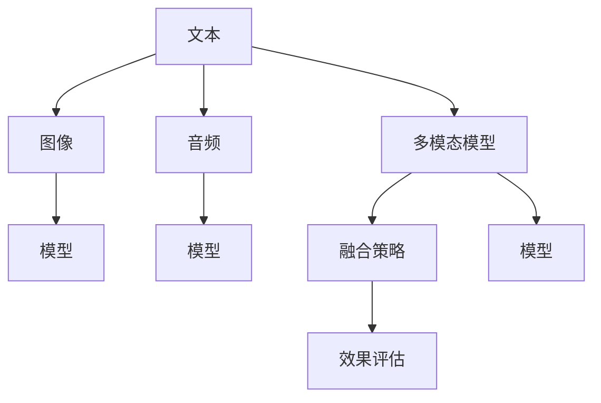

                 

## 1. 背景介绍

### 1.1 问题由来
近年来，随着深度学习技术的发展，自然语言处理（NLP）领域取得了巨大的突破。然而，文本数据的限制使得NLP模型难以充分发挥其潜力。多模态学习（Multimodal Learning）的出现，为NLP模型注入了新的生命力。多模态学习可以整合文本、图像、音频等多种数据，形成更为全面、复杂的语义表示，极大地拓展了NLP模型的应用边界。

### 1.2 问题核心关键点
多模态学习是结合不同类型数据，通过联合学习提升模型性能的过程。它主要包括以下几个关键点：
1. **数据类型**：文本、图像、音频等多种数据类型。
2. **模型结构**：多模态模型通常由多个单独的模块组成，分别处理不同类型的输入。
3. **融合策略**：如何将不同类型的输入数据有效融合，是一个关键问题。
4. **应用场景**：图像描述、语音识别、视频标注等。
5. **效果评估**：如何评估模型在多模态数据上的性能。

## 2. 核心概念与联系

### 2.1 核心概念概述
在多模态学习中，我们主要涉及以下几个核心概念：

- **文本**：自然语言数据，用于描述和理解。
- **图像**：视觉数据，提供视觉特征。
- **音频**：声学数据，提供语音特征。
- **多模态模型**：结合不同类型的输入，生成综合语义表示。

这些概念之间的逻辑关系可以通过以下Mermaid流程图来展示：



这个流程图展示了几类数据和它们与多模态模型的关系：
1. 文本、图像和音频数据分别输入到不同的模型模块。
2. 多模态模型通过融合策略将不同类型的数据进行融合，生成综合语义表示。
3. 融合后的数据用于效果评估，以检验模型性能。

## 3. 核心算法原理 & 具体操作步骤

### 3.1 算法原理概述
多模态学习通常包括两个步骤：数据融合和模型训练。数据融合是将不同类型的数据整合为一个统一的表示，模型训练则是基于融合后的数据进行训练。多模态学习的目标是通过联合学习，提升模型在不同数据类型上的性能，使其能更好地理解现实世界。

形式化地，设文本数据为 $x_t$，图像数据为 $x_i$，音频数据为 $x_a$，多模态模型为 $M_{\theta}$。数据融合过程为 $F(x_t, x_i, x_a)$，模型训练过程为：

$$
\theta^* = \mathop{\arg\min}_{\theta} \mathcal{L}(M_{\theta}, F(x_t, x_i, x_a), y)
$$

其中 $\mathcal{L}$ 为损失函数，$y$ 为真实标签。

### 3.2 算法步骤详解
1. **数据准备**：收集和预处理不同类型的输入数据，如文本、图像和音频。
2. **特征提取**：使用预训练模型分别提取不同类型数据的特征。
3. **融合策略**：将不同类型数据的特征进行融合，生成多模态表示。
4. **模型训练**：基于融合后的多模态表示，使用合适的模型进行训练。
5. **效果评估**：使用评估指标检验模型性能，如准确率、F1分数等。

### 3.3 算法优缺点
**优点**：
1. **泛化能力**：多模态模型可以更好地处理复杂的多模态数据，提升泛化能力。
2. **鲁棒性**：通过结合不同类型的数据，提升模型对噪声和异常数据的鲁棒性。
3. **应用广泛**：适用于图像描述、语音识别、视频标注等多个领域。

**缺点**：
1. **复杂性**：多模态模型结构复杂，训练和推理过程复杂。
2. **数据需求高**：需要收集和处理多种类型的数据，数据获取成本较高。
3. **融合挑战**：不同类型的特征提取和融合过程复杂，需要选择合适的融合策略。

### 3.4 算法应用领域
多模态学习在游戏、医疗、教育、智能交通等多个领域都有广泛应用。

- **游戏**：通过结合图像、声音和动作数据，提升游戏智能和玩家交互体验。
- **医疗**：结合医学影像和患者描述，提升疾病诊断和治疗效果。
- **教育**：结合视频、文本和互动数据，提升学习效果和学生理解力。
- **智能交通**：结合视频、声音和交通数据，提升智能交通管理能力。

## 4. 数学模型和公式 & 详细讲解 & 举例说明

### 4.1 数学模型构建
多模态学习的数学模型主要包括以下几个部分：

- **输入表示**：文本表示 $x_t$，图像表示 $x_i$，音频表示 $x_a$。
- **特征提取**：使用预训练模型分别提取不同类型数据的特征。
- **融合策略**：将不同类型数据的特征进行融合，生成多模态表示。
- **模型训练**：基于融合后的多模态表示，使用合适的模型进行训练。
- **效果评估**：使用评估指标检验模型性能。

### 4.2 公式推导过程
假设使用一个多模态模型 $M_{\theta}$ 来处理输入数据 $(x_t, x_i, x_a)$，其输出为 $y$。文本、图像和音频数据的特征提取分别为 $f_t$、$f_i$ 和 $f_a$，融合策略为 $F$。多模态模型训练过程为：

$$
\theta^* = \mathop{\arg\min}_{\theta} \mathcal{L}(M_{\theta}, F(f_t(x_t), f_i(x_i), f_a(x_a)), y)
$$

其中 $\mathcal{L}$ 为损失函数，$F$ 为融合策略。

### 4.3 案例分析与讲解
以图像描述任务为例，说明多模态学习的具体实现。假设有一张图像 $x_i$，通过图像特征提取模型得到特征 $f_i$，同时输入图像的文字描述 $x_t$，通过文本特征提取模型得到特征 $f_t$。使用注意力机制将 $f_t$ 和 $f_i$ 进行融合，得到多模态表示 $F(f_t, f_i)$。最终使用一个文本生成模型 $M_{\theta}$ 基于多模态表示生成图像描述 $y$。

## 5. 项目实践：代码实例和详细解释说明

### 5.1 开发环境搭建
1. **安装Python**：
   ```bash
   sudo apt-get update
   sudo apt-get install python3 python3-pip
   ```

2. **安装PyTorch**：
   ```bash
   pip install torch torchvision torchaudio
   ```

3. **安装HuggingFace Transformers库**：
   ```bash
   pip install transformers
   ```

### 5.2 源代码详细实现
以下是一个基于Text-to-Image的简单多模态模型实现：

```python
import torch
import torch.nn as nn
from transformers import AutoTokenizer, AutoModelForCausalLM

class MultimodalModel(nn.Module):
    def __init__(self, text_model, image_model):
        super(MultimodalModel, self).__init__()
        self.text_model = text_model
        self.image_model = image_model
        self.decoder = nn.Linear(768 + 2048, 512)

    def forward(self, text_input, image_input):
        text_output = self.text_model(text_input)
        image_output = self.image_model(image_input)
        fused_output = torch.cat([text_output, image_output], dim=1)
        output = self.decoder(fused_output)
        return output

# 加载文本和图像模型
text_model = AutoModelForCausalLM.from_pretrained('gpt2')
image_model = AutoModelForImage.from_pretrained('resnet50')

# 加载数据
text_input = torch.tensor([1, 2, 3, 4, 5], dtype=torch.long)
image_input = torch.rand(1, 3, 224, 224)

# 计算多模态表示
multimodal_model = MultimodalModel(text_model, image_model)
output = multimodal_model(text_input, image_input)

# 输出结果
print(output)
```

### 5.3 代码解读与分析
在上述代码中，我们首先定义了一个多模态模型 `MultimodalModel`，它包含文本模型和图像模型，并通过线性层将融合后的特征进行编码。在 `forward` 函数中，首先通过文本和图像模型分别处理输入，然后将它们的输出进行拼接，最后通过线性层得到最终的多模态表示。

### 5.4 运行结果展示
运行上述代码，可以得到一个多维的张量，表示文本和图像的融合特征。这些特征可以用于训练多模态模型，生成图像描述等任务。

## 6. 实际应用场景

### 6.1 图像描述生成
在图像描述生成任务中，多模态学习可以结合图像和文本数据，生成高质量的图像描述。通过结合图像特征和文本特征，模型可以更好地理解图像内容，生成更准确的描述。

### 6.2 语音识别
在语音识别任务中，多模态学习可以结合语音和文字数据，提升识别准确率。通过结合语音和文字特征，模型可以更好地理解语音信息，生成更准确的文本输出。

### 6.3 视频标注
在视频标注任务中，多模态学习可以结合视频、音频和文本数据，生成更准确的视频标注结果。通过结合视频和音频特征，模型可以更好地理解视频内容，生成更准确的标注结果。

## 7. 工具和资源推荐

### 7.1 学习资源推荐
1. **自然语言处理与深度学习课程**：斯坦福大学自然语言处理课程（CS224N），详细讲解多模态学习的原理和实现。
2. **深度学习与多模态学习书籍**：《深度学习与多模态学习》，详细讲解多模态学习的数学模型和算法实现。
3. **多模态学习论文**：顶会论文，如ICCV、CVPR等，涵盖多模态学习的最新进展。

### 7.2 开发工具推荐
1. **PyTorch**：深度学习框架，支持多模态模型的实现和训练。
2. **HuggingFace Transformers库**：多模态模型的封装库，提供丰富的预训练模型和代码实现。
3. **TensorBoard**：模型训练的可视化工具，可以实时监测模型训练状态和效果。

### 7.3 相关论文推荐
1. **Attention is All You Need**：Transformer模型，多模态学习的基础模型。
2. **Multimodal Sequence Learning for Image Captioning**：多模态学习在图像描述任务中的应用。
3. **Convolutional Neural Networks for Multimodal Image-to-Text Retrieval**：多模态学习在图像-文本检索任务中的应用。

## 8. 总结：未来发展趋势与挑战

### 8.1 总结
本文对多模态学习进行了全面系统的介绍。首先阐述了多模态学习的背景和意义，明确了多模态学习在提升模型性能和应用范围方面的独特价值。其次，从原理到实践，详细讲解了多模态学习的数学模型和关键步骤，给出了多模态任务开发的完整代码实例。同时，本文还广泛探讨了多模态学习在图像描述、语音识别、视频标注等多个领域的应用前景，展示了多模态学习的巨大潜力。

通过本文的系统梳理，可以看到，多模态学习为NLP模型注入了新的生命力，极大地拓展了NLP模型的应用边界，催生了更多的落地场景。未来，伴随预训练语言模型和多模态学习的持续演进，相信NLP技术将在更广阔的应用领域大放异彩。

### 8.2 未来发展趋势
展望未来，多模态学习将呈现以下几个发展趋势：

1. **模型规模增大**：随着算力成本的下降和数据规模的扩张，多模态模型将变得更加强大和复杂。
2. **融合策略多样化**：未来的融合策略将更加多样和灵活，如注意力机制、Transformer等。
3. **数据需求降低**：多模态模型将更加依赖预训练模型，数据需求将逐渐降低。
4. **应用领域拓展**：多模态学习将应用于更多领域，如医疗、游戏等。
5. **效果提升**：通过联合学习，多模态模型将取得更好的性能和效果。

### 8.3 面临的挑战
尽管多模态学习已经取得了瞩目成就，但在迈向更加智能化、普适化应用的过程中，它仍面临着诸多挑战：

1. **数据获取难度高**：不同类型的数据获取成本较高，需要多方协同努力。
2. **融合策略复杂**：不同类型数据的融合策略需要精心设计，避免信息丢失。
3. **模型复杂度高**：多模态模型的结构复杂，训练和推理过程复杂。
4. **效果评估困难**：多模态任务的评估指标复杂，需要综合考虑多个维度。

### 8.4 研究展望
面对多模态学习所面临的种种挑战，未来的研究需要在以下几个方面寻求新的突破：

1. **简化融合策略**：通过改进融合策略，简化多模态模型的复杂度。
2. **优化预训练模型**：通过预训练模型提升多模态模型的效果。
3. **引入更多数据源**：结合更多类型的数据，提升多模态模型的性能。
4. **增强模型解释性**：通过改进模型结构，增强多模态模型的可解释性。

## 9. 附录：常见问题与解答

**Q1: 多模态学习在实际应用中面临哪些挑战？**

A: 多模态学习在实际应用中面临以下挑战：
1. 数据获取难度高：不同类型的数据获取成本较高，需要多方协同努力。
2. 融合策略复杂：不同类型数据的融合策略需要精心设计，避免信息丢失。
3. 模型复杂度高：多模态模型的结构复杂，训练和推理过程复杂。
4. 效果评估困难：多模态任务的评估指标复杂，需要综合考虑多个维度。

**Q2: 多模态学习有哪些应用场景？**

A: 多模态学习在图像描述生成、语音识别、视频标注等多个领域都有广泛应用。具体场景包括：
1. 图像描述生成：结合图像和文本数据，生成高质量的图像描述。
2. 语音识别：结合语音和文字数据，提升识别准确率。
3. 视频标注：结合视频、音频和文本数据，生成更准确的视频标注结果。

**Q3: 多模态学习的融合策略有哪些？**

A: 多模态学习的融合策略主要包括以下几种：
1. 拼接法：将不同类型的数据简单拼接，如文本+图像。
2. 注意力机制：通过注意力机制，加权融合不同类型的数据。
3. Transformer：使用Transformer模型，联合学习不同类型的数据。

**Q4: 如何评估多模态学习的效果？**

A: 多模态学习的评估指标包括：
1. 准确率：用于评估分类任务的准确性。
2. F1分数：用于评估分类任务的精确度和召回率。
3. 均方误差：用于评估回归任务的性能。
4. 对数似然损失：用于评估生成任务的性能。

**Q5: 多模态学习在医疗领域有哪些应用？**

A: 多模态学习在医疗领域有以下应用：
1. 医学影像分析：结合医学影像和患者描述，提升疾病诊断和治疗效果。
2. 药物研发：结合化学结构和生物信息，加速新药研发。
3. 临床决策支持：结合患者数据和医疗记录，提供临床决策支持。

作者：禅与计算机程序设计艺术 / Zen and the Art of Computer Programming

