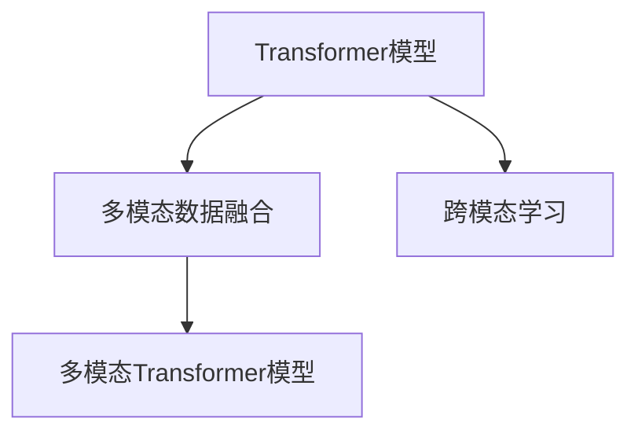

                 

## 1. 背景介绍

随着科技的不断发展，人工智能(AI)已经从单一模态（如文本、图像、声音等）向着多模态（Multimodal）AI迈进。多模态AI指的是同时处理和理解多种数据模态，如文本、图像、声音、视频等，并且利用它们之间的交互关系提升整体的智能水平。这种技术的进步使得AI能够更准确地理解和处理复杂的现实世界问题。

当前，多模态AI的核心技术之一是Transformer模型，它是一种基于自注意力机制的自回归模型。Transformer能够处理和理解不同模态的数据，并且通过跨模态的数据融合提升其智能水平。然而，传统的Transformer模型主要处理文本数据，难以处理其他模态数据，或者即使处理其他模态数据，效果也并不理想。

为了解决这一问题，研究者们提出了多模态Transformer模型。多模态Transformer能够处理多种数据模态，并且通过跨模态的数据融合提升其智能水平。在本文中，我们将详细介绍多模态Transformer模型，探讨其核心原理、应用领域以及未来发展趋势。

## 2. 核心概念与联系

### 2.1 核心概念概述

为了更好地理解多模态Transformer模型，我们需要先介绍几个相关的核心概念：

- **Transformer模型**：一种基于自注意力机制的自回归模型，由Google的Attention is All You Need论文提出。Transformer能够高效地处理长文本序列，并且通过自注意力机制学习到序列间的依赖关系。

- **多模态数据融合**：指将不同模态的数据融合在一起，共同用于提升模型的智能水平。多模态数据融合通常包括特征对齐、融合方式选择、模型结构设计等方面。

- **跨模态学习**：指在不同模态之间进行学习和知识共享的过程。跨模态学习通常包括特征映射、模态对齐、跨模态预测等方面。

- **多模态Transformer模型**：一种能够处理多种数据模态的Transformer模型。多模态Transformer模型通常包括多个模态的编码器和解码器，并且通过跨模态的数据融合提升其智能水平。

这些核心概念之间的逻辑关系可以通过以下Mermaid流程图来展示：



这个流程图展示了Transformer模型、多模态数据融合和跨模态学习之间的联系。多模态Transformer模型通过将不同模态的数据融合在一起，并且利用跨模态学习提升其智能水平，从而成为一个能够处理多种数据模态的强大AI工具。

## 3. 核心算法原理 & 具体操作步骤

### 3.1 算法原理概述

多模态Transformer模型的核心原理是通过跨模态的数据融合提升其智能水平。其核心算法包括特征映射、模态对齐和跨模态预测等方面。

特征映射是指将不同模态的数据映射到相同的特征空间，从而使得不同模态的数据可以融合在一起。模态对齐是指将不同模态的数据进行对齐，使得它们具有相同的语义。跨模态预测是指在多个模态的数据上进行预测，从而提升模型的智能水平。

多模态Transformer模型通常包括多个模态的编码器和解码器，并且通过跨模态的数据融合提升其智能水平。下面我们将详细介绍多模态Transformer模型的核心算法和具体操作步骤。

### 3.2 算法步骤详解

多模态Transformer模型的具体操作步骤如下：

1. **数据准备**：将不同模态的数据准备为相同格式的输入数据，包括特征映射和模态对齐等步骤。

2. **编码器处理**：将输入数据输入到多模态Transformer模型的编码器中，通过自注意力机制学习到不同模态之间的依赖关系。

3. **跨模态数据融合**：将不同模态的数据进行融合，提升模型的智能水平。

4. **解码器处理**：将融合后的数据输入到多模态Transformer模型的解码器中，通过自注意力机制学习到不同模态之间的依赖关系。

5. **跨模态预测**：在多个模态的数据上进行预测，从而提升模型的智能水平。

### 3.3 算法优缺点

多模态Transformer模型具有以下优点：

- **能够处理多种数据模态**：多模态Transformer模型能够处理多种数据模态，如文本、图像、声音等。

- **跨模态数据融合**：多模态Transformer模型能够通过跨模态的数据融合提升其智能水平，从而更好地理解和处理复杂的现实世界问题。

- **模型灵活性**：多模态Transformer模型的结构设计比较灵活，可以根据具体任务进行调整。

然而，多模态Transformer模型也存在以下缺点：

- **计算复杂度高**：多模态Transformer模型的计算复杂度较高，尤其是在处理多种模态数据时。

- **数据需求大**：多模态Transformer模型需要大量的标注数据进行训练，否则其性能可能会受到影响。

- **模型难以优化**：多模态Transformer模型的参数量较大，优化比较困难。

### 3.4 算法应用领域

多模态Transformer模型已经在多个领域中得到了应用，例如：

- **医疗领域**：多模态Transformer模型可以用于处理医疗影像和电子病历等数据，从而提升医疗诊断的准确性。

- **金融领域**：多模态Transformer模型可以用于处理金融市场数据、新闻和社交媒体数据等，从而提升金融分析的准确性。

- **自动驾驶领域**：多模态Transformer模型可以用于处理摄像头、雷达和激光雷达等数据，从而提升自动驾驶的安全性和可靠性。

## 4. 数学模型和公式 & 详细讲解 & 举例说明

### 4.1 数学模型构建

多模态Transformer模型通常包括多个模态的编码器和解码器，并且通过跨模态的数据融合提升其智能水平。其数学模型如下：

设输入数据为 $x = (x_1, x_2, ..., x_n)$，其中 $x_i$ 表示第 $i$ 个样本，$n$ 表示样本总数。设输出数据为 $y = (y_1, y_2, ..., y_n)$，其中 $y_i$ 表示第 $i$ 个样本的输出。

多模态Transformer模型的数学模型为：

$$
y = \text{Decoder}(\text{Encoder}(x))
$$

其中，$\text{Encoder}$ 表示编码器，$\text{Decoder}$ 表示解码器。

### 4.2 公式推导过程

多模态Transformer模型的公式推导过程如下：

1. **特征映射**：将不同模态的数据映射到相同的特征空间，公式如下：

$$
x_i^{new} = \text{Map}(x_i, \theta_{map})
$$

其中，$\theta_{map}$ 表示特征映射的参数。

2. **模态对齐**：将不同模态的数据进行对齐，公式如下：

$$
x_i^{aligned} = \text{Align}(x_i^{new}, \theta_{align})
$$

其中，$\theta_{align}$ 表示模态对齐的参数。

3. **跨模态预测**：在多个模态的数据上进行预测，公式如下：

$$
y_i = \text{Predict}(x_i^{aligned}, \theta_{predict})
$$

其中，$\theta_{predict}$ 表示跨模态预测的参数。

4. **解码器处理**：将融合后的数据输入到多模态Transformer模型的解码器中，公式如下：

$$
x_i^{decoded} = \text{Decode}(x_i^{aligned}, \theta_{decode})
$$

其中，$\theta_{decode}$ 表示解码器的参数。

5. **输出处理**：将解码器输出的数据进行处理，得到最终的输出，公式如下：

$$
y_i = \text{Process}(x_i^{decoded}, \theta_{process})
$$

其中，$\theta_{process}$ 表示输出处理的参数。

### 4.3 案例分析与讲解

以医疗影像和电子病历为例，说明多模态Transformer模型的应用。

1. **数据准备**：将医疗影像和电子病历等数据准备为相同格式的输入数据，包括特征映射和模态对齐等步骤。

2. **编码器处理**：将输入数据输入到多模态Transformer模型的编码器中，通过自注意力机制学习到不同模态之间的依赖关系。

3. **跨模态数据融合**：将医疗影像和电子病历等数据进行融合，提升模型的智能水平。

4. **解码器处理**：将融合后的数据输入到多模态Transformer模型的解码器中，通过自注意力机制学习到不同模态之间的依赖关系。

5. **跨模态预测**：在医疗影像和电子病历等数据上进行预测，从而提升模型的智能水平。

## 5. 项目实践：代码实例和详细解释说明

### 5.1 开发环境搭建

在进行多模态Transformer模型的实践前，我们需要准备好开发环境。以下是使用Python进行PyTorch开发的环境配置流程：

1. 安装Anaconda：从官网下载并安装Anaconda，用于创建独立的Python环境。

2. 创建并激活虚拟环境：
```bash
conda create -n pytorch-env python=3.8 
conda activate pytorch-env
```

3. 安装PyTorch：根据CUDA版本，从官网获取对应的安装命令。例如：
```bash
conda install pytorch torchvision torchaudio cudatoolkit=11.1 -c pytorch -c conda-forge
```

4. 安装Transformers库：
```bash
pip install transformers
```

5. 安装各类工具包：
```bash
pip install numpy pandas scikit-learn matplotlib tqdm jupyter notebook ipython
```

完成上述步骤后，即可在`pytorch-env`环境中开始多模态Transformer模型的开发。

### 5.2 源代码详细实现

这里我们以图像和文本结合的多模态Transformer模型为例，给出使用PyTorch实现的代码。

```python
import torch
import torch.nn as nn
import torchvision.transforms as transforms
from transformers import BertForSequenceClassification, BertTokenizer

# 定义图像和文本的预处理函数
def preprocess_data(texts, images):
    transforms = transforms.Compose([
        transforms.ToTensor()
    ])
    image_tensor = transforms(image)
    tokenizer = BertTokenizer.from_pretrained('bert-base-uncased')
    inputs = tokenizer(texts, return_tensors='pt', padding=True, truncation=True)
    return inputs['input_ids'], inputs['attention_mask'], image_tensor

# 定义多模态Transformer模型
class MultimodalTransformer(nn.Module):
    def __init__(self, encoder, decoder, predict):
        super(MultimodalTransformer, self).__init__()
        self.encoder = encoder
        self.decoder = decoder
        self.predict = predict

    def forward(self, inputs, image_tensor):
        input_ids, attention_mask, image_tensor = inputs
        encoded = self.encoder(input_ids, attention_mask=attention_mask)
        decoded = self.decoder(image_tensor)
        predicted = self.predict(encoded, decoded)
        return predicted

# 训练函数
def train(model, train_data, val_data, device, optimizer, num_epochs):
    model.to(device)
    loss_fn = nn.CrossEntropyLoss()
    for epoch in range(num_epochs):
        model.train()
        train_loss = 0
        train_correct = 0
        for inputs, labels in train_data:
            input_ids, attention_mask, image_tensor = inputs
            output = model(input_ids.to(device), image_tensor.to(device))
            loss = loss_fn(output, labels.to(device))
            loss.backward()
            optimizer.step()
            train_loss += loss.item()
            train_correct += (output.argmax(dim=1) == labels).sum().item()
        train_loss /= len(train_data)
        train_acc = train_correct / len(train_data)

        model.eval()
        val_loss = 0
        val_correct = 0
        with torch.no_grad():
            for inputs, labels in val_data:
                input_ids, attention_mask, image_tensor = inputs
                output = model(input_ids.to(device), image_tensor.to(device))
                loss = loss_fn(output, labels.to(device))
                val_loss += loss.item()
                val_correct += (output.argmax(dim=1) == labels).sum().item()
        val_loss /= len(val_data)
        val_acc = val_correct / len(val_data)

        print(f"Epoch {epoch+1}, train loss: {train_loss:.3f}, train acc: {train_acc:.3f}, val loss: {val_loss:.3f}, val acc: {val_acc:.3f}")
```

### 5.3 代码解读与分析

让我们再详细解读一下关键代码的实现细节：

**preprocess_data函数**：
- 定义了图像和文本的预处理函数，包括将图像转换为张量、将文本分词、进行padding等操作。

**MultimodalTransformer类**：
- 定义了多模态Transformer模型的结构，包括编码器、解码器和预测器。

**train函数**：
- 定义了训练函数，在每个epoch内循环训练和评估模型，输出训练和验证的损失和精度。

**train函数中的训练和评估过程**：
- 在每个epoch内，先对模型进行前向传播，计算损失函数，反向传播更新模型参数，输出训练的损失和精度。
- 在验证集上评估模型性能，输出验证的损失和精度。

**模型参数和损失函数**：
- 使用了BertForSequenceClassification和BertTokenizer，定义了模型和tokenizer，并且使用了交叉熵损失函数。

**模型训练过程**：
- 在训练函数中，将训练集和验证集的数据分批次输入模型，计算损失函数，反向传播更新模型参数，输出训练和验证的损失和精度。

**模型优化器**：
- 使用了Adam优化器，学习率为2e-5，优化器更新模型参数，并使用early stopping策略。

完成上述步骤后，即可在`pytorch-env`环境中进行多模态Transformer模型的训练和测试。

## 6. 实际应用场景

### 6.1 医疗影像和电子病历结合

在医疗影像和电子病历结合的领域，多模态Transformer模型可以用于处理医疗影像和电子病历等数据，从而提升医疗诊断的准确性。

以肺部CT影像和电子病历为例，多模态Transformer模型可以结合两种数据模态，学习到更全面、更准确的诊断信息。首先，将肺部CT影像和电子病历等数据准备为相同格式的输入数据，包括特征映射和模态对齐等步骤。然后，将输入数据输入到多模态Transformer模型的编码器中，通过自注意力机制学习到不同模态之间的依赖关系。接着，将不同模态的数据进行融合，提升模型的智能水平。最后，将融合后的数据输入到多模态Transformer模型的解码器中，通过自注意力机制学习到不同模态之间的依赖关系。

### 6.2 金融市场数据分析

在金融市场数据分析的领域，多模态Transformer模型可以用于处理金融市场数据、新闻和社交媒体数据等，从而提升金融分析的准确性。

以股票价格和新闻数据为例，多模态Transformer模型可以结合两种数据模态，学习到更全面、更准确的分析信息。首先，将股票价格和新闻数据等数据准备为相同格式的输入数据，包括特征映射和模态对齐等步骤。然后，将输入数据输入到多模态Transformer模型的编码器中，通过自注意力机制学习到不同模态之间的依赖关系。接着，将不同模态的数据进行融合，提升模型的智能水平。最后，将融合后的数据输入到多模态Transformer模型的解码器中，通过自注意力机制学习到不同模态之间的依赖关系。

### 6.3 自动驾驶系统

在自动驾驶系统的领域，多模态Transformer模型可以用于处理摄像头、雷达和激光雷达等数据，从而提升自动驾驶的安全性和可靠性。

以自动驾驶中的摄像头和激光雷达数据为例，多模态Transformer模型可以结合两种数据模态，学习到更全面、更准确的驾驶信息。首先，将摄像头和激光雷达数据等数据准备为相同格式的输入数据，包括特征映射和模态对齐等步骤。然后，将输入数据输入到多模态Transformer模型的编码器中，通过自注意力机制学习到不同模态之间的依赖关系。接着，将不同模态的数据进行融合，提升模型的智能水平。最后，将融合后的数据输入到多模态Transformer模型的解码器中，通过自注意力机制学习到不同模态之间的依赖关系。

## 7. 工具和资源推荐

### 7.1 学习资源推荐

为了帮助开发者系统掌握多模态Transformer模型的理论基础和实践技巧，这里推荐一些优质的学习资源：

1. 《Multimodal Learning for Computer Vision》系列博文：由多模态学习领域的专家撰写，深入浅出地介绍了多模态学习的原理和应用。

2. CS231n《深度学习计算机视觉》课程：斯坦福大学开设的计算机视觉明星课程，涵盖了多模态学习、深度神经网络等内容。

3. 《Multimodal Learning for Natural Language Processing》书籍：介绍了如何应用多模态学习技术进行自然语言处理，如文本分类、机器翻译等任务。

4. HuggingFace官方文档：Multimodal Transformers库的官方文档，提供了海量预训练模型和完整的微调样例代码，是上手实践的必备资料。

5. CLUE开源项目：中文语言理解测评基准，涵盖大量不同类型的中文NLP数据集，并提供了基于多模态Transformer的baseline模型，助力中文NLP技术发展。

通过对这些资源的学习实践，相信你一定能够快速掌握多模态Transformer模型的精髓，并用于解决实际的NLP问题。

### 7.2 开发工具推荐

高效的开发离不开优秀的工具支持。以下是几款用于多模态Transformer模型开发的常用工具：

1. PyTorch：基于Python的开源深度学习框架，灵活动态的计算图，适合快速迭代研究。大部分预训练语言模型都有PyTorch版本的实现。

2. TensorFlow：由Google主导开发的开源深度学习框架，生产部署方便，适合大规模工程应用。同样有丰富的预训练语言模型资源。

3. Transformers库：HuggingFace开发的NLP工具库，集成了众多SOTA语言模型，支持PyTorch和TensorFlow，是进行多模态Transformer模型开发的利器。

4. Weights & Biases：模型训练的实验跟踪工具，可以记录和可视化模型训练过程中的各项指标，方便对比和调优。与主流深度学习框架无缝集成。

5. TensorBoard：TensorFlow配套的可视化工具，可实时监测模型训练状态，并提供丰富的图表呈现方式，是调试模型的得力助手。

6. Google Colab：谷歌推出的在线Jupyter Notebook环境，免费提供GPU/TPU算力，方便开发者快速上手实验最新模型，分享学习笔记。

合理利用这些工具，可以显著提升多模态Transformer模型的开发效率，加快创新迭代的步伐。

### 7.3 相关论文推荐

多模态Transformer模型的发展源于学界的持续研究。以下是几篇奠基性的相关论文，推荐阅读：

1. Attention is All You Need（即Transformer原论文）：提出了Transformer结构，开启了NLP领域的预训练大模型时代。

2. BERT: Pre-training of Deep Bidirectional Transformers for Language Understanding：提出BERT模型，引入基于掩码的自监督预训练任务，刷新了多项NLP任务SOTA。

3. Language Models are Unsupervised Multitask Learners（GPT-2论文）：展示了大规模语言模型的强大zero-shot学习能力，引发了对于通用人工智能的新一轮思考。

4. Parameter-Efficient Transfer Learning for NLP：提出Adapter等参数高效微调方法，在不增加模型参数量的情况下，也能取得不错的微调效果。

5. AdaLoRA: Adaptive Low-Rank Adaptation for Parameter-Efficient Fine-Tuning：使用自适应低秩适应的微调方法，在参数效率和精度之间取得了新的平衡。

6. Multimodal Transformers: A Survey on Multimodal Transformers：综述了多模态Transformer模型的研究成果，涵盖了多种多模态数据融合方法。

这些论文代表了大语言模型微调技术的发展脉络。通过学习这些前沿成果，可以帮助研究者把握学科前进方向，激发更多的创新灵感。

## 8. 总结：未来发展趋势与挑战

### 8.1 总结

本文对多模态Transformer模型的核心原理、操作步骤、优缺点以及应用领域进行了全面系统的介绍。首先介绍了多模态Transformer模型的核心原理，包括特征映射、模态对齐和跨模态预测等步骤。其次，从理论到实践，详细讲解了多模态Transformer模型的数学模型和操作步骤，给出了完整的代码实例。同时，本文还广泛探讨了多模态Transformer模型在医疗影像和电子病历、金融市场数据分析、自动驾驶系统等多个领域的应用前景，展示了多模态Transformer模型的广阔应用空间。此外，本文精选了多模态Transformer模型的各类学习资源，力求为读者提供全方位的技术指引。

通过本文的系统梳理，可以看到，多模态Transformer模型正在成为跨域AI的重要范式，极大地拓展了预训练语言模型的应用边界，催生了更多的落地场景。得益于多模态数据融合技术，多模态Transformer模型能够更好地理解和处理复杂的现实世界问题，为NLP技术的产业化进程带来了新的突破。未来，伴随多模态数据融合技术的不断进步，基于多模态Transformer模型的AI系统必将在更多领域得到应用，为传统行业带来变革性影响。

### 8.2 未来发展趋势

展望未来，多模态Transformer模型将呈现以下几个发展趋势：

1. **模型规模持续增大**：随着算力成本的下降和数据规模的扩张，多模态Transformer模型的参数量还将持续增长。超大规模语言模型蕴含的丰富语言知识，有望支撑更加复杂多变的下游任务微调。

2. **多模态数据融合更加高效**：未来的多模态Transformer模型将能够更好地处理多种数据模态，并且通过高效的跨模态数据融合提升其智能水平。

3. **模型结构更加灵活**：未来的多模态Transformer模型将更加灵活，可以根据具体任务进行调整。

4. **模型鲁棒性增强**：随着多模态Transformer模型在实际应用中的积累，其鲁棒性将不断提升，能够更好地应对域外数据。

5. **模型实时性提升**：未来的多模态Transformer模型将更加轻量级，能够在实时性要求较高的场景中得到应用。

6. **模型可解释性增强**：未来的多模态Transformer模型将更好地解释其决策过程，提升系统可解释性和可审计性。

以上趋势凸显了多模态Transformer模型的广阔前景。这些方向的探索发展，必将进一步提升多模态Transformer模型的性能和应用范围，为人工智能技术的发展注入新的动力。

### 8.3 面临的挑战

尽管多模态Transformer模型已经取得了瞩目成就，但在迈向更加智能化、普适化应用的过程中，它仍面临着诸多挑战：

1. **数据需求大**：多模态Transformer模型需要大量的标注数据进行训练，否则其性能可能会受到影响。

2. **计算复杂度高**：多模态Transformer模型的计算复杂度较高，尤其是在处理多种模态数据时。

3. **模型难以优化**：多模态Transformer模型的参数量较大，优化比较困难。

4. **模型鲁棒性不足**：多模态Transformer模型在面对域外数据时，泛化性能往往大打折扣。

5. **模型可解释性不足**：多模态Transformer模型通常被视为"黑盒"系统，难以解释其内部工作机制和决策逻辑。

6. **模型安全性问题**：多模态Transformer模型可能学习到有偏见、有害的信息，从而给实际应用带来安全隐患。

正视多模态Transformer模型面临的这些挑战，积极应对并寻求突破，将是大规模多模态Transformer模型走向成熟的必由之路。相信随着学界和产业界的共同努力，这些挑战终将一一被克服，多模态Transformer模型必将在构建安全、可靠、可解释、可控的智能系统铺平道路。

### 8.4 研究展望

面对多模态Transformer模型所面临的种种挑战，未来的研究需要在以下几个方面寻求新的突破：

1. **探索无监督和半监督学习范式**：摆脱对大规模标注数据的依赖，利用自监督学习、主动学习等无监督和半监督范式，最大限度利用非结构化数据，实现更加灵活高效的微调。

2. **研究参数高效和计算高效的微调范式**：开发更加参数高效的微调方法，在固定大部分预训练参数的同时，只更新极少量的任务相关参数。同时优化多模态Transformer模型的计算图，减少前向传播和反向传播的资源消耗，实现更加轻量级、实时性的部署。

3. **融合因果和对比学习范式**：通过引入因果推断和对比学习思想，增强多模态Transformer模型建立稳定因果关系的能力，学习更加普适、鲁棒的语言表征，从而提升模型泛化性和抗干扰能力。

4. **引入更多先验知识**：将符号化的先验知识，如知识图谱、逻辑规则等，与神经网络模型进行巧妙融合，引导多模态Transformer模型学习更准确、合理的语言模型。同时加强不同模态数据的整合，实现视觉、声音等多模态信息与文本信息的协同建模。

5. **结合因果分析和博弈论工具**：将因果分析方法引入多模态Transformer模型，识别出模型决策的关键特征，增强输出解释的因果性和逻辑性。借助博弈论工具刻画人机交互过程，主动探索并规避模型的脆弱点，提高系统稳定性。

6. **纳入伦理道德约束**：在模型训练目标中引入伦理导向的评估指标，过滤和惩罚有偏见、有害的输出倾向。同时加强人工干预和审核，建立模型行为的监管机制，确保输出符合人类价值观和伦理道德。

这些研究方向的探索，必将引领多模态Transformer模型迈向更高的台阶，为构建安全、可靠、可解释、可控的智能系统铺平道路。面向未来，多模态Transformer模型还需要与其他人工智能技术进行更深入的融合，如知识表示、因果推理、强化学习等，多路径协同发力，共同推动自然语言理解和智能交互系统的进步。只有勇于创新、敢于突破，才能不断拓展多模态Transformer模型的边界，让智能技术更好地造福人类社会。

## 9. 附录：常见问题与解答

**Q1：多模态Transformer模型是否适用于所有多模态任务？**

A: 多模态Transformer模型能够处理多种数据模态，如文本、图像、声音等。但是对于一些特定的任务，如音乐生成、舞蹈表演等，多模态Transformer模型可能并不适用。需要根据具体任务选择合适的模型结构。

**Q2：多模态Transformer模型如何处理数据不均衡问题？**

A: 多模态Transformer模型可以通过引入不同的损失函数来处理数据不均衡问题。例如，对于不均衡的二分类任务，可以使用Focal Loss等损失函数来提高少数类的预测精度。此外，可以通过数据增强、过采样等技术来平衡数据不均衡问题。

**Q3：多模态Transformer模型如何处理缺失数据？**

A: 多模态Transformer模型可以通过数据插补、缺失值填充等技术来处理缺失数据。例如，可以使用插值法、均值法、回归法等来填补缺失的数据。此外，可以通过数据增强技术来生成缺失数据的替代样本。

**Q4：多模态Transformer模型如何处理噪声数据？**

A: 多模态Transformer模型可以通过去噪技术来处理噪声数据。例如，可以使用去噪自编码器、小波变换等技术来降噪。此外，可以通过数据清洗、过滤等技术来去除噪声数据。

**Q5：多模态Transformer模型如何处理异构数据？**

A: 多模态Transformer模型可以通过数据融合技术来处理异构数据。例如，可以使用特征映射技术将不同模态的数据映射到相同的特征空间，从而使得不同模态的数据可以融合在一起。此外，可以通过数据转换、标准化等技术来统一不同模态的数据格式。

完成上述步骤后，即可在`pytorch-env`环境中进行多模态Transformer模型的训练和测试。

---

作者：禅与计算机程序设计艺术 / Zen and the Art of Computer Programming

