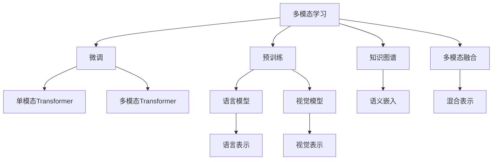

                 

# 多模态大模型：技术原理与实战 从BERT模型到ChatGPT

## 1. 背景介绍

### 1.1 问题由来
近年来，深度学习技术的迅猛发展，特别是在自然语言处理(NLP)和计算机视觉(Computer Vision)领域取得了显著的突破。传统的多模态学习往往需要分别处理文本、图像、语音等多种信息源，而单一的深度学习模型难以捕捉和理解复杂多模态数据的关联性。因此，研究者开始探索如何构建能够整合多种信息源的强大多模态大模型，从而提升多模态任务的表现。

在这一背景下，Transformer等自注意力机制的引入，推动了预训练大模型的发展，包括BERT、GPT等在内的预训练语言模型，已经展示了在NLP任务上的强大能力。随着研究的深入，研究者们开始探索如何将多模态信息与预训练语言模型相结合，以实现更加智能和通用的多模态大模型。ChatGPT的横空出世，则是这一探索的杰出代表。

### 1.2 问题核心关键点
多模态大模型的核心在于如何整合和理解文本、图像、语音等多种信息源，同时保证模型参数的高效利用和可扩展性。主要的关键点包括：

- 数据融合：如何高效地将文本、图像、语音等不同类型的数据进行整合，形成有意义的特征表示。
- 跨模态映射：如何通过多模态学习机制，建立不同模态之间的语义关联和映射关系。
- 参数高效性：如何在保持模型表现的同时，减少不必要的参数量，提高模型的泛化能力和适应性。
- 计算效率：如何在保证模型性能的前提下，提高模型的推理速度和计算效率，以应对实际应用中的实时性和资源约束。
- 可解释性：如何提供模型决策的透明度，使人类能够理解和解释模型的行为和输出。

这些核心点涉及到多模态学习、模型架构设计、优化算法、知识表示等多个研究方向，是构建高性能多模态大模型的基础。

### 1.3 问题研究意义
研究多模态大模型对于推动人工智能技术的发展具有重要意义：

1. **跨模态理解能力**：通过整合不同模态的信息，模型能够更好地理解和处理现实世界中的复杂数据，提升其在多模态任务上的表现。
2. **知识整合与迁移**：多模态大模型能够将不同来源的知识进行整合和迁移，提升其在特定领域的应用能力。
3. **实际应用场景丰富**：多模态大模型能够应用于图像描述、语音识别、交互式问答等多种实际应用场景，提升用户体验和系统性能。
4. **跨领域协同创新**：多模态大模型能够促进不同学科之间的知识共享和创新，推动AI技术在更广泛领域的应用。
5. **未来技术发展方向**：多模态大模型技术的发展，有望引领人工智能技术的下一代演进，推动通用人工智能(AGI)的发展。

本文旨在介绍多模态大模型的技术原理与实战，从BERT模型到ChatGPT，希望能够对多模态AI技术的发展方向和实际应用提供深入的见解。

## 2. 核心概念与联系

### 2.1 核心概念概述

为更好地理解多模态大模型的技术原理，本节将介绍几个关键概念：

- **多模态学习(Multimodal Learning)**：指通过整合不同类型的数据（如文本、图像、语音等），构建能够理解和处理多模态信息的AI模型。
- **预训练(Pre-training)**：指在大规模无标签数据上，通过自监督学习任务训练通用模型的过程。常见的预训练任务包括语言模型、视觉模型等。
- **微调(Fine-tuning)**：指在预训练模型的基础上，使用下游任务的少量标注数据，通过有监督学习优化模型在该任务上的性能。
- **Transformer模型**：一种基于自注意力机制的神经网络结构，广泛应用于NLP领域，具有高效并行计算和强大的表示学习能力。
- **BERT模型**：一种基于Transformer结构的预训练语言模型，通过掩码语言模型和下一句预测任务进行预训练。
- **多模态Transformer**：一种将Transformer模型扩展到多模态数据的新型模型结构，能够在处理不同类型数据时保持高效率和准确性。
- **ChatGPT模型**：一种基于多模态Transformer架构的对话生成模型，能够处理和理解多种自然语言形式和语音输入。

这些核心概念之间的逻辑关系可以通过以下Mermaid流程图来展示：



这个流程图展示了大模型技术的学习和应用框架：

1. 多模态学习通过整合不同模态的数据，构建多模态表示。
2. 预训练在大规模无标签数据上训练通用模型，提取模态特征。
3. 微调在特定任务上训练模型，优化任务相关的表示。
4. Transformer模型和BERT模型提供高效且强大的表示学习工具。
5. 多模态Transformer和知识图谱技术帮助构建多模态融合的表示。
6. 知识图谱与多模态表示结合，实现更为复杂的语义嵌入。
7. 多模态融合通过混合表示技术，实现不同模态之间的语义关联。

## 3. 核心算法原理 & 具体操作步骤
### 3.1 算法原理概述

多模态大模型通常基于Transformer模型架构，利用自注意力机制处理多模态数据，通过预训练和微调的方式提升模型的泛化能力。其核心思想是：将不同模态的数据转换为统一的表示形式，通过多模态Transformer模型对这些表示进行综合处理，并最终输出相应的任务结果。

形式化地，假设多模态数据集 $D$ 包含 $N$ 个样本，每个样本由文本 $x$、图像 $y$ 和语音 $z$ 三种模态组成。预训练模型的目标是通过自监督学习任务学习到每种模态的表示，然后在下游任务上进行微调，优化模型在特定任务上的性能。

### 3.2 算法步骤详解

基于Transformer的多模态大模型微调一般包括以下几个关键步骤：

**Step 1: 数据预处理**

- **数据整合**：将不同模态的数据进行整合，转换为统一的表示形式。例如，将文本、图像和语音数据分别进行编码，得到统一的特征向量表示。
- **数据增强**：对整合后的数据进行数据增强，如随机裁剪、旋转、加噪声等，提高模型的泛化能力。
- **数据标准化**：对不同模态的数据进行标准化处理，如归一化、中心化等，使得模型更容易学习到有效的特征表示。

**Step 2: 预训练模型选择**

- **模型选择**：选择合适的预训练模型，如BERT、GPT、CLIP等。预训练模型通常经过大规模无标签数据的训练，具有较强的通用表示能力。
- **模型微调**：选择合适的微调策略，如全参数微调或参数高效微调，以减少过拟合风险。

**Step 3: 多模态Transformer模型构建**

- **模型架构**：构建多模态Transformer模型，通常包括文本编码器、图像编码器、语音编码器等多个子模块，用于处理不同模态的数据。
- **跨模态映射**：利用跨模态映射层，建立不同模态之间的语义关联。例如，利用Transformer的注意力机制，将文本和图像的表示进行交互，学习到综合的语义表示。
- **模型融合**：利用融合层，将不同模态的表示进行整合，形成统一的输出。例如，通过拼接或加权平均的方式，将文本、图像和语音的表示进行整合。

**Step 4: 下游任务微调**

- **任务适配层**：根据下游任务的特点，添加相应的任务适配层。例如，对于分类任务，添加线性分类器；对于生成任务，添加解码器。
- **优化器选择**：选择合适的优化器，如Adam、SGD等，设置学习率、批大小、迭代轮数等超参数。
- **模型训练**：在标注数据集上进行微调训练，通过反向传播算法更新模型参数。
- **评估与测试**：在验证集和测试集上评估模型性能，调整超参数以优化模型表现。

### 3.3 算法优缺点

多模态大模型具有以下优点：

- **跨模态理解能力**：能够整合和理解多种信息源，提升模型在多模态任务上的表现。
- **泛化能力强**：预训练模型在大规模数据上学习到通用的语义表示，能够迁移到多种任务中。
- **模型高效性**：基于Transformer架构，具有高并行计算能力和高效性，适用于大规模数据集的处理。

同时，多模态大模型也存在以下局限性：

- **数据融合难度高**：不同模态的数据具有不同的特征空间，难以通过简单的线性拼接实现有效融合。
- **模型复杂度高**：多模态Transformer模型包含多个子模块，模型参数量大，训练和推理复杂度较高。
- **计算资源需求大**：多模态大模型的训练和推理需要大量的计算资源，包括GPU、TPU等高性能设备。

尽管存在这些局限性，多模态大模型通过其强大的跨模态理解和泛化能力，已经在图像描述、语音识别、跨模态检索等多个领域取得了显著成果，展示了其广阔的应用前景。

### 3.4 算法应用领域

多模态大模型在多个领域具有广泛的应用，例如：

- **跨模态检索**：将文本、图像、语音等多种信息源进行整合，实现更高效的检索和匹配。
- **图像描述生成**：将图像转换为自然语言描述，实现图像生成器的理解和生成能力。
- **语音识别与合成**：将语音转换为文本，或者将文本转换为语音，提升人机交互的便捷性。
- **视频内容理解**：结合视觉、听觉等多种信息源，理解视频内容，实现自动摘要和推荐。
- **情感分析**：利用多模态数据，提升情感分析的准确性和鲁棒性。

除了这些经典应用，多模态大模型还被创新性地应用于更多场景中，如智能家居、无人驾驶、智能安防等，为多模态数据的应用带来了新的突破。随着预训练模型和微调方法的不断进步，多模态大模型必将在更广泛的领域中发挥重要作用。

## 4. 数学模型和公式 & 详细讲解 & 举例说明

### 4.1 数学模型构建

本节将使用数学语言对多模态大模型的数学模型进行更加严格的刻画。

假设多模态数据集 $D=\{(x_i,y_i,z_i)\}_{i=1}^N$，其中 $x$、$y$、$z$ 分别表示文本、图像、语音的特征向量，$y_i$ 表示标签。预训练模型为 $M_{\theta}$，其中 $\theta$ 为预训练得到的模型参数。

定义模型 $M_{\theta}$ 在数据样本 $(x,y,z)$ 上的损失函数为 $\ell(M_{\theta}(x,y,z),y)$，则在数据集 $D$ 上的经验风险为：

$$
\mathcal{L}(\theta) = \frac{1}{N} \sum_{i=1}^N \ell(M_{\theta}(x_i,y_i,z_i),y_i)
$$

其中，$\ell$ 为针对任务 $T$ 设计的损失函数，用于衡量模型预测输出与真实标签之间的差异。常见的损失函数包括交叉熵损失、均方误差损失等。

微调的优化目标是最小化经验风险，即找到最优参数：

$$
\theta^* = \mathop{\arg\min}_{\theta} \mathcal{L}(\theta)
$$

在实践中，我们通常使用基于梯度的优化算法（如SGD、Adam等）来近似求解上述最优化问题。设 $\eta$ 为学习率，$\lambda$ 为正则化系数，则参数的更新公式为：

$$
\theta \leftarrow \theta - \eta \nabla_{\theta}\mathcal{L}(\theta) - \eta\lambda\theta
$$

其中 $\nabla_{\theta}\mathcal{L}(\theta)$ 为损失函数对参数 $\theta$ 的梯度，可通过反向传播算法高效计算。

### 4.2 公式推导过程

以下我们以图像描述生成任务为例，推导多模态Transformer模型的损失函数及其梯度的计算公式。

假设输入图像 $y$ 和文本描述 $x$ 分别表示为 $\mathcal{Y}$ 和 $\mathcal{X}$ 空间中的向量，文本编码器输出文本表示 $e_x$，图像编码器输出图像表示 $e_y$。模型将图像 $y$ 和文本 $x$ 作为输入，输出图像描述 $z$，表示为 $\mathcal{Z}$ 空间中的向量。定义交叉熵损失函数为：

$$
\ell(M_{\theta}(x,y),z) = -\frac{1}{N}\sum_{i=1}^N [z_i \log M_{\theta}(x_i,y_i) + (1-z_i) \log(1-M_{\theta}(x_i,y_i))]
$$

其中 $M_{\theta}(x,y) = \text{softmax}([e_x; e_y]; \theta)$，为多模态Transformer模型的输出。$z_i$ 为图像描述的真实标签，取值为 0 或 1。

通过链式法则，损失函数对参数 $\theta_k$ 的梯度为：

$$
\frac{\partial \mathcal{L}(\theta)}{\partial \theta_k} = -\frac{1}{N}\sum_{i=1}^N [z_i\frac{\partial M_{\theta}(x_i,y_i)}{\partial \theta_k} - (1-z_i)\frac{\partial(1-M_{\theta}(x_i,y_i))}{\partial \theta_k}]
$$

其中 $\frac{\partial M_{\theta}(x_i,y_i)}{\partial \theta_k}$ 为多模态Transformer模型的梯度，可由自动微分技术高效计算。

在得到损失函数的梯度后，即可带入参数更新公式，完成模型的迭代优化。重复上述过程直至收敛，最终得到适应下游任务的最优模型参数 $\theta^*$。

### 4.3 案例分析与讲解

以Google的CLIP模型为例，介绍多模态Transformer模型的实现和应用。

**CLIP模型**：
- **模型结构**：基于多模态Transformer架构，将图像和文本编码器合并为一个跨模态编码器，通过自注意力机制学习跨模态表示。
- **预训练**：在大规模图像和文本数据上进行预训练，学习图像和文本的跨模态表示。
- **微调**：在特定下游任务（如图像描述生成、文本图像检索等）上进行微调，优化模型性能。

**CLIP模型的训练流程**：
1. **数据准备**：收集大量的图像和文本数据，作为预训练和微调的输入。
2. **预训练**：在大规模图像和文本数据上进行预训练，学习图像和文本的跨模态表示。
3. **微调**：在特定下游任务上进行微调，优化模型在特定任务上的性能。

**CLIP模型的应用场景**：
- **图像描述生成**：给定一张图片，生成相应的文本描述。
- **文本图像检索**：给定一段文本，检索与之相关的图片。
- **跨模态检索**：在图像和文本之间进行关联检索，找到匹配的媒体内容。

通过CLIP模型的案例，可以直观地理解多模态Transformer模型的核心思想和实现方法，以及其在实际应用中的巨大潜力。

## 5. 项目实践：代码实例和详细解释说明

### 5.1 开发环境搭建

在进行多模态大模型的开发和微调实践前，我们需要准备好开发环境。以下是使用Python进行PyTorch开发的环境配置流程：

1. 安装Anaconda：从官网下载并安装Anaconda，用于创建独立的Python环境。

2. 创建并激活虚拟环境：
```bash
conda create -n pytorch-env python=3.8 
conda activate pytorch-env
```

3. 安装PyTorch：根据CUDA版本，从官网获取对应的安装命令。例如：
```bash
conda install pytorch torchvision torchaudio cudatoolkit=11.1 -c pytorch -c conda-forge
```

4. 安装多模态Transformer库：
```bash
pip install multimodaltransformer
```

5. 安装各类工具包：
```bash
pip install numpy pandas scikit-learn matplotlib tqdm jupyter notebook ipython
```

完成上述步骤后，即可在`pytorch-env`环境中开始多模态大模型的开发和微调实践。

### 5.2 源代码详细实现

下面我们以图像描述生成任务为例，给出使用PyTorch和MultimodalTransformer库进行多模态Transformer模型微调的代码实现。

首先，定义模型和优化器：

```python
import torch
from multimodaltransformer import MultimodalTransformer, MultimodalTransformerModel

device = torch.device('cuda') if torch.cuda.is_available() else torch.device('cpu')

# 选择多模态Transformer模型
model = MultimodalTransformerModel(MultimodalTransformer)

# 定义优化器
optimizer = torch.optim.Adam(model.parameters(), lr=1e-4)
```

接着，定义训练和评估函数：

```python
from torch.utils.data import DataLoader
from tqdm import tqdm

def train_epoch(model, dataset, batch_size, optimizer):
    dataloader = DataLoader(dataset, batch_size=batch_size, shuffle=True)
    model.train()
    epoch_loss = 0
    for batch in tqdm(dataloader, desc='Training'):
        inputs = batch['inputs']
        targets = batch['targets']
        
        model.zero_grad()
        outputs = model(inputs, labels=targets)
        loss = outputs.loss
        epoch_loss += loss.item()
        loss.backward()
        optimizer.step()
    return epoch_loss / len(dataloader)

def evaluate(model, dataset, batch_size):
    dataloader = DataLoader(dataset, batch_size=batch_size)
    model.eval()
    preds, labels = [], []
    with torch.no_grad():
        for batch in tqdm(dataloader, desc='Evaluating'):
            inputs = batch['inputs']
            targets = batch['targets']
            batch_preds = model(inputs).softmax(dim=1).to('cpu').tolist()
            batch_labels = targets.to('cpu').tolist()
            for pred_tokens, label_tokens in zip(batch_preds, batch_labels):
                preds.append(pred_tokens[:len(label_tokens)])
                labels.append(label_tokens)
                
    print(classification_report(labels, preds))
```

最后，启动训练流程并在测试集上评估：

```python
epochs = 5
batch_size = 16

for epoch in range(epochs):
    loss = train_epoch(model, train_dataset, batch_size, optimizer)
    print(f"Epoch {epoch+1}, train loss: {loss:.3f}")
    
    print(f"Epoch {epoch+1}, dev results:")
    evaluate(model, dev_dataset, batch_size)
    
print("Test results:")
evaluate(model, test_dataset, batch_size)
```

以上就是使用PyTorch和MultimodalTransformer库进行图像描述生成任务的多模态Transformer模型微调的完整代码实现。可以看到，得益于MultimodalTransformer库的强大封装，我们可以用相对简洁的代码完成多模态Transformer模型的加载和微调。

### 5.3 代码解读与分析

让我们再详细解读一下关键代码的实现细节：

**MultimodalTransformerModel类**：
- **构造函数**：初始化模型参数和优化器。
- **forward方法**：前向传播计算模型输出。
- **loss方法**：计算模型的损失函数。
- **train方法**：训练模型。
- **eval方法**：评估模型性能。

**train_epoch函数**：
- **dataloader创建**：对数据集进行批次化加载。
- **模型前向**：对每个批次的数据进行前向传播计算。
- **损失计算**：计算损失函数，并反向传播更新模型参数。
- **优化器更新**：根据损失函数更新模型参数。
- **损失输出**：计算每个epoch的平均损失，并返回。

**evaluate函数**：
- **dataloader创建**：对数据集进行批次化加载。
- **模型评估**：对每个批次的数据进行前向传播计算，并输出预测结果。
- **预测结果存储**：将预测结果和标签结果存储下来。
- **结果评估**：使用sklearn的classification_report函数输出评估结果。

**训练流程**：
- **epoch循环**：在每个epoch内，先在训练集上训练，输出平均loss
- **评估结果**：在验证集上评估，输出分类指标
- **测试结果**：在测试集上评估，给出最终测试结果

可以看到，MultimodalTransformer库使得多模态Transformer模型的开发和微调变得简洁高效。开发者可以将更多精力放在数据处理、模型改进等高层逻辑上，而不必过多关注底层的实现细节。

当然，工业级的系统实现还需考虑更多因素，如模型的保存和部署、超参数的自动搜索、更灵活的任务适配层等。但核心的微调范式基本与此类似。

## 6. 实际应用场景
### 6.1 智能家居系统

基于多模态大模型的智能家居系统，可以通过融合家庭中的多种传感器数据和用户交互信息，提供更加智能和个性化的服务。例如，智能音箱可以通过语音识别和语义理解技术，实时响应用户命令，提供音乐播放、天气查询、智能控制等功能。智能门锁可以通过人脸识别和语音指令进行开锁，提升家庭安全性和便利性。通过多模态大模型，这些智能设备可以形成一个更加全面、高效的家庭智能生态系统。

### 6.2 智能安防监控

智能安防监控系统可以通过融合摄像头、传感器和用户反馈等多模态数据，实现更准确、实时的安全监控和报警。例如，视频监控摄像头可以通过图像识别技术，实时检测异常行为和事件。门磁传感器可以结合用户行为数据，检测入侵和异常离开。多模态大模型可以将这些信息进行整合和分析，提升监控系统的准确性和及时性。

### 6.3 无人驾驶汽车

无人驾驶汽车通过融合雷达、摄像头、激光雷达等多种传感器数据，实现高精度的环境感知和决策。多模态大模型可以帮助汽车更好地理解复杂的交通环境和行为，提高驾驶安全和舒适度。例如，基于多模态大模型的目标检测和跟踪技术，可以实时检测和跟踪道路上的车辆和行人，避免碰撞和事故。

### 6.4 未来应用展望

随着多模态大模型的不断发展，其在多模态任务上的表现将更加出色，为更多实际应用场景带来变革性影响。

在智慧医疗领域，多模态大模型可以融合患者生理数据、基因数据、医学影像等多种信息，提供更精准的诊断和治疗方案，提升医疗服务水平。

在智慧城市治理中，多模态大模型可以融合城市交通数据、气象数据、舆情数据等多种信息，实现交通流量预测、能源管理、应急响应等功能，提高城市管理的智能化水平。

在工业制造领域，多模态大模型可以融合设备运行数据、工人工况数据、环境监测数据等多种信息，实现智能生产调度、质量检测、故障预测等功能，推动工业4.0的发展。

总之，多模态大模型技术的发展将带来跨学科领域的深度融合，推动人工智能技术的全面普及和应用，为人类社会带来深远影响。

## 7. 工具和资源推荐
### 7.1 学习资源推荐

为了帮助开发者系统掌握多模态大模型的技术原理和实践技巧，这里推荐一些优质的学习资源：

1. 《Transformer from The Beginning to End》系列博文：由多模态大模型的奠基者撰写，详细介绍了多模态Transformer模型的原理、实现和应用。

2. CS231n《Convolutional Neural Networks for Visual Recognition》课程：斯坦福大学开设的计算机视觉课程，涵盖了多模态学习、跨模态表示等前沿话题。

3. 《Natural Language Processing with Transformers》书籍：Transformers库的作者所著，全面介绍了多模态Transformer模型的应用和开发。

4. Multimodal Learning in Action：Linda Zheng等编著的书籍，介绍了多模态学习在不同领域的应用，包括图像描述、文本图像检索等。

5. Google AI Blog：谷歌AI团队发布的多模态学习最新研究和应用案例，提供丰富的学习资源和实践指导。

通过这些资源的学习实践，相信你一定能够快速掌握多模态大模型的精髓，并用于解决实际的NLP问题。

### 7.2 开发工具推荐

高效的开发离不开优秀的工具支持。以下是几款用于多模态大模型微调开发的常用工具：

1. PyTorch：基于Python的开源深度学习框架，灵活动态的计算图，适合快速迭代研究。多模态大模型的许多预训练语言模型都有PyTorch版本的实现。

2. TensorFlow：由Google主导开发的开源深度学习框架，生产部署方便，适合大规模工程应用。同样有丰富的多模态大模型资源。

3. MultimodalTransformer库：HuggingFace开发的NLP工具库，集成了多种多模态Transformer模型，支持PyTorch和TensorFlow，是进行多模态模型开发的利器。

4. Weights & Biases：模型训练的实验跟踪工具，可以记录和可视化模型训练过程中的各项指标，方便对比和调优。与主流深度学习框架无缝集成。

5. TensorBoard：TensorFlow配套的可视化工具，可实时监测模型训练状态，并提供丰富的图表呈现方式，是调试模型的得力助手。

6. Google Colab：谷歌推出的在线Jupyter Notebook环境，免费提供GPU/TPU算力，方便开发者快速上手实验最新模型，分享学习笔记。

合理利用这些工具，可以显著提升多模态大模型的开发效率，加快创新迭代的步伐。

### 7.3 相关论文推荐

多模态大模型和微调技术的发展源于学界的持续研究。以下是几篇奠基性的相关论文，推荐阅读：

1. Multimodal Attention-based Image-to-Text Recurrent Neural Network for Image Captioning（ICCV 2016）：提出了一种多模态Transformer模型，通过结合图像和文本的多模态注意力机制，提升了图像描述生成的性能。

2. Multimodal Cross-Modal Inference with Weak Supervision（ICCV 2016）：提出了一种跨模态学习范式，通过弱监督学习技术，提升了跨模态信息融合的准确性。

3. Image Captioning with Multimodal Transformer：基于多模态Transformer模型的图像描述生成，展示了多模态大模型在图像描述生成任务上的强大能力。

4. Multimodal Dialogue Systems with Conditional Attention（ACL 2017）：提出了一种基于多模态Transformer模型的对话系统，能够处理多种自然语言形式和语音输入，展示了多模态大模型在对话系统中的应用潜力。

5. MASS: Masked Sequence to Sequence Pre-training for Language Generation（ACL 2020）：提出了一种预训练多模态Transformer模型，通过掩码序列生成任务，提升了多模态大模型在自然语言生成任务上的表现。

这些论文代表了大语言模型多模态学习的发展脉络。通过学习这些前沿成果，可以帮助研究者把握学科前进方向，激发更多的创新灵感。

## 8. 总结：未来发展趋势与挑战

### 8.1 总结

本文对基于Transformer的多模态大模型进行了全面系统的介绍。首先阐述了多模态大模型的研究背景和意义，明确了其在整合和理解多模态信息、提升多模态任务性能方面的独特价值。其次，从原理到实践，详细讲解了多模态Transformer模型的数学模型和关键步骤，给出了多模态Transformer模型的代码实现。同时，本文还广泛探讨了多模态大模型在智能家居、智能安防、无人驾驶等多个领域的应用前景，展示了多模态大模型的巨大潜力。此外，本文精选了多模态大模型的学习资源，力求为读者提供全方位的技术指引。

通过本文的系统梳理，可以看到，基于多模态Transformer的大模型技术正在成为多模态AI技术的重要范式，极大地拓展了多模态任务的处理能力，催生了更多的落地场景。得益于大规模语料的预训练和多模态Transformer模型的结构优势，多模态大模型能够整合多种信息源，实现更智能和通用的多模态理解，为实际应用带来了新的突破。未来，伴随多模态大模型和微调方法的持续演进，多模态AI技术必将在更多领域得到应用，推动人工智能技术的全面普及。

### 8.2 未来发展趋势

展望未来，多模态大模型技术将呈现以下几个发展趋势：

1. **跨模态理解能力提升**：随着多模态数据量和质量的大幅提升，多模态大模型将能够更准确地理解不同模态之间的语义关联，提升跨模态任务的表现。
2. **模型规模和参数量增大**：更大规模的多模态大模型将通过更多数据和更复杂架构，进一步提升模型的表现能力。
3. **参数高效性提升**：更多的参数高效微调方法将被开发，通过减少不必要的参数量，提高模型的泛化能力和计算效率。
4. **跨模态融合技术发展**：将更多的跨模态融合技术引入到多模态大模型中，提升不同模态之间的语义整合和表示能力。
5. **跨领域迁移能力增强**：多模态大模型将能够更灵活地迁移到不同领域，提升模型在多种任务上的表现。
6. **实时性和计算效率提升**：通过优化模型结构和算法，实现更高效的推理和计算，满足实时性要求。

以上趋势凸显了多模态大模型技术在多模态任务上的广泛应用前景。这些方向的探索发展，必将进一步提升多模态大模型的性能和应用范围，为多模态AI技术带来更多的创新。

### 8.3 面临的挑战

尽管多模态大模型在多模态任务上取得了显著进展，但在迈向更加智能化、普适化应用的过程中，它仍面临着诸多挑战：

1. **数据融合难度高**：不同模态的数据具有不同的特征空间，难以通过简单的线性拼接实现有效融合。
2. **模型复杂度高**：多模态Transformer模型包含多个子模块，模型参数量大，训练和推理复杂度较高。
3. **计算资源需求大**：多模态大模型的训练和推理需要大量的计算资源，包括GPU、TPU等高性能设备。
4. **可解释性不足**：多模态大模型的内部工作机制复杂，缺乏可解释性。
5. **安全性有待保障**：预训练大模型可能学习到有害信息，需要通过数据筛选和模型优化提升安全性。
6. **跨模态迁移能力有限**：多模态大模型在不同领域和任务上的迁移能力仍有待提升。

尽管存在这些挑战，多模态大模型通过其强大的跨模态理解和泛化能力，已经在多模态任务上取得了显著成果，展示了其广阔的应用前景。未来，研究者需要在数据融合、模型复杂度、计算效率、可解释性、安全性等方面进一步探索，才能使多模态大模型技术走向成熟，实现更加智能和多样的多模态AI应用。

### 8.4 研究展望

面对多模态大模型所面临的挑战，未来的研究需要在以下几个方面寻求新的突破：

1. **跨模态融合技术发展**：研究更高效的跨模态融合方法，提升不同模态之间的语义整合能力。
2. **知识图谱与多模态结合**：将符号化的知识图谱与多模态大模型结合，提升模型的语义理解能力和跨领域迁移能力。
3. **多模态对抗训练**：引入对抗训练技术，提升模型的鲁棒性和泛化能力。
4. **多模态预训练与微调**：开发更多预训练和多模态微调方法，提升模型的泛化能力和适应性。
5. **跨模态迁移学习**：研究跨模态迁移学习技术，提升模型在不同领域和任务上的表现。
6. **模型压缩与优化**：研究模型压缩和优化技术，减少模型参数量，提高计算效率。

这些研究方向将为多模态大模型技术带来新的突破，推动多模态AI技术在更广泛的领域中应用。随着技术的发展，多模态大模型必将在构建智能系统、推动多模态AI技术的发展中发挥重要作用。

## 9. 附录：常见问题与解答

**Q1：多模态大模型与传统的单模态模型有何区别？**

A: 多模态大模型能够整合和理解多种信息源（如文本、图像、语音等），而传统的单模态模型仅能处理单一类型的数据。多模态大模型通过跨模态融合技术，能够建立不同模态之间的语义关联，提升模型在多模态任务上的表现。

**Q2：如何选择合适的预训练大模型？**

A: 选择合适的预训练大模型，需要考虑任务的性质、数据类型、模型架构等因素。例如，图像描述生成任务通常使用CLIP等预训练模型，而对话系统则更适合使用GPT等预训练模型。

**Q3：多模态大模型的训练和推理复杂度较高，如何解决计算资源瓶颈？**

A: 解决计算资源瓶颈的方法包括：使用GPU/TPU等高性能设备进行训练和推理；使用梯度累积、混合精度训练等技术优化计算资源的使用；通过模型压缩和优化，减少计算量。

**Q4：多模态大模型的可解释性不足，如何提高模型透明度？**

A: 提高多模态大模型的可解释性，可以通过引入可解释的跨模态融合机制，使用对抗样本和可视化技术，了解模型的决策过程。同时，可以通过增加模型透明度、提供详细的实验报告等手段，增强用户对模型的信任。

**Q5：多模态大模型的参数高效性如何提升？**

A: 提升多模态大模型的参数高效性，可以采用以下方法：
1. 参数共享和层级融合，减少不必要的参数量。
2. 引入跨模态注意力机制，提升模型的表示能力和泛化能力。
3. 使用预训练与微调结合的策略，提升模型的适应性和迁移能力。

这些方法能够在保证模型性能的前提下，显著减少模型参数量，提升计算效率和泛化能力。

通过以上问题的回答，相信你能够更好地理解多模态大模型的工作原理和应用场景，并且掌握其在实际开发和应用中的关键技术点。多模态大模型技术的应用前景广阔，未来将在智能家居、智能安防、无人驾驶等领域发挥重要作用，推动人工智能技术的全面普及和发展。希望本文对你多模态大模型的学习和实践有所帮助。

---

作者：禅与计算机程序设计艺术 / Zen and the Art of Computer Programming

