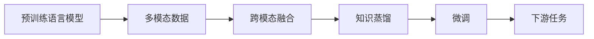

                 

# 多模态大模型：技术原理与实战 优化逻辑介绍

## 1. 背景介绍

在当前的人工智能研究与应用中，多模态大模型（Multimodal Large Models）正逐渐成为主流，其强大的跨模态学习能力和泛化能力，能够显著提升模型在多领域任务的性能。例如，基于多模态大模型的视觉问答系统、情感识别、视频摘要等应用，已经在诸多场景中取得了显著的效果。本文将深入探讨多模态大模型的技术原理、优化逻辑及其实际应用，为相关领域的研究者与开发者提供参考。

## 2. 核心概念与联系

### 2.1 核心概念概述

为了更准确地理解多模态大模型，我们先来介绍一些核心概念：

- 多模态大模型：指能够同时处理和融合多种数据类型（如文本、图像、音频等）的预训练语言模型，这些模型在各自模态中均具备强大的建模能力，并能够通过跨模态的信息共享与融合，提升整体性能。

- 预训练（Pre-training）：指在大规模无标签数据上，通过自监督学习任务训练通用语言模型的过程。常见的预训练任务包括掩码语言模型（MLM）、自回归语言模型（ARLM）等。

- 微调（Fine-tuning）：指在预训练模型的基础上，使用下游任务的少量标注数据，通过有监督学习优化模型在特定任务上的性能。通常只需要调整顶层分类器或解码器，并以较小的学习率更新全部或部分的模型参数。

- 跨模态融合（Cross-modal Fusion）：指将不同模态的数据（如文本、图像、音频等）转化为相同的表示形式，进而通过模型进行融合和理解。这一过程需要设计合适的跨模态对齐算法，使不同模态的信息能够高效交互和融合。

- 知识蒸馏（Knowledge Distillation）：指将大型预训练模型的知识（如特征表示、标签预测等）蒸馏到小型模型中，使其在较小数据集上也能获得较好的性能。

这些核心概念构成了多模态大模型的基础框架，使得模型能够跨模态地进行学习和推理，提升其在多领域任务上的表现。

### 2.2 核心概念原理和架构的 Mermaid 流程图



该流程图展示了多模态大模型的核心处理流程：

1. **预训练语言模型**：在大规模无标签数据上进行预训练，学习到通用的语言表示。
2. **多模态数据**：收集不同模态的数据，包括文本、图像、音频等。
3. **跨模态融合**：使用合适的跨模态对齐算法，将不同模态的数据转换为相同的表示形式。
4. **知识蒸馏**：将预训练模型的知识蒸馏到小型模型中，使其在特定任务上获得更好的性能。
5. **微调**：在特定下游任务上，对模型进行微调，优化模型在特定任务上的性能。
6. **下游任务**：最终在实际应用场景中，使用微调后的模型执行具体任务。

## 3. 核心算法原理 & 具体操作步骤

### 3.1 算法原理概述

多模态大模型的核心算法原理可以概括为以下几个关键步骤：

1. **数据收集与预处理**：收集和预处理来自不同模态的数据，包括文本、图像、音频等，构建多模态数据集。
2. **跨模态对齐**：使用合适的跨模态对齐算法，将不同模态的数据转换为相同的表示形式，如特征嵌入或语义向量。
3. **预训练**：在无标签的大规模数据集上，通过自监督学习任务训练预训练语言模型，学习通用的语言表示。
4. **知识蒸馏**：将大型预训练模型的知识蒸馏到小型模型中，减小模型复杂度，提高推理效率。
5. **微调**：在特定下游任务上，使用少量标注数据，对模型进行微调，优化模型在特定任务上的性能。
6. **评估与部署**：在测试集上评估微调后的模型性能，集成到实际应用系统中。

### 3.2 算法步骤详解

#### 3.2.1 数据收集与预处理

多模态数据收集和预处理是构建多模态大模型的第一步。具体步骤如下：

1. **数据收集**：从不同模态的数据源中收集数据，例如从互联网、社交媒体、图像库等获取文本、图像、音频等数据。
2. **数据清洗与标注**：清洗数据中的噪声和错误，并标注数据对应的元信息，如标签、时间戳等。
3. **数据转换与归一化**：将不同模态的数据转换为相同的形式，如文本转换为向量表示，图像转换为特征嵌入等，并进行归一化处理，以保证数据的稳定性。

#### 3.2.2 跨模态对齐

跨模态对齐是使不同模态的数据能够高效交互和融合的关键步骤。以下是一些常用的跨模态对齐算法：

1. **特征嵌入**：使用深度学习模型将不同模态的数据转换为相同的高维向量表示。例如，可以使用卷积神经网络（CNN）对图像进行特征提取，使用递归神经网络（RNN）或Transformer对文本进行编码，得到相同的语义向量。
2. **多模态注意力机制**：使用多模态注意力机制将不同模态的数据进行加权融合，使模型能够同时关注不同模态的信息。
3. **对比学习**：使用对比学习方法，将不同模态的数据通过正负样本的对比，学习到跨模态的相似性表示。

#### 3.2.3 预训练

预训练是学习通用语言表示的关键步骤，可以采用掩码语言模型（MLM）、自回归语言模型（ARLM）等自监督学习任务进行预训练。以下是预训练的详细步骤：

1. **构建预训练数据集**：收集大规模无标签数据，如维基百科、新闻、书籍等，构建预训练数据集。
2. **设计预训练任务**：设计合适的预训练任务，例如掩码语言模型、自回归语言模型等，以最大化预训练模型的泛化能力。
3. **训练预训练模型**：在预训练数据集上，使用深度学习模型进行训练，学习通用的语言表示。
4. **验证预训练效果**：在验证集上评估预训练模型的性能，确保模型能够泛化到未见过的数据上。

#### 3.2.4 知识蒸馏

知识蒸馏是将大型预训练模型的知识蒸馏到小型模型中的过程，以提高模型在特定任务上的性能。以下是知识蒸馏的具体步骤：

1. **选择教师和学生模型**：选择一个大型预训练模型作为教师模型，选择一个小型模型作为学生模型。
2. **构建知识蒸馏任务**：定义教师和学生模型之间的任务，例如教师模型输出一个概率分布，学生模型预测标签。
3. **训练学生模型**：在教师模型的指导下，使用少量标注数据训练学生模型，使其能够继承教师模型的知识。
4. **评估蒸馏效果**：在测试集上评估蒸馏后学生模型的性能，确保其具备良好的泛化能力。

#### 3.2.5 微调

微调是使模型适应特定下游任务的关键步骤。以下是微调的详细步骤：

1. **准备微调数据集**：收集下游任务的少量标注数据，构建微调数据集。
2. **定义微调目标函数**：根据下游任务的类型，定义合适的微调目标函数，例如分类任务中的交叉熵损失函数。
3. **设置微调超参数**：选择合适的优化算法及其参数，如Adam、SGD等，设置学习率、批大小、迭代轮数等。
4. **执行梯度训练**：使用微调数据集，在模型上进行梯度训练，最小化目标函数。
5. **评估微调效果**：在测试集上评估微调后模型的性能，对比微调前后的精度提升。

### 3.3 算法优缺点

#### 3.3.1 算法优点

1. **跨模态学习能力强**：多模态大模型能够同时处理和融合多种数据类型，提升模型在多领域任务的性能。
2. **泛化能力强**：通过预训练和微调，模型能够学习到通用的语言表示和领域特定的知识，提高模型泛化能力。
3. **推理效率高**：通过知识蒸馏和参数高效微调（PEFT）等技术，减小模型复杂度，提高推理效率。
4. **应用场景广**：多模态大模型适用于文本、图像、音频等多种数据类型，广泛应用于视觉问答、情感识别、视频摘要等领域。

#### 3.3.2 算法缺点

1. **数据需求高**：构建多模态大模型需要大量的高质量标注数据，数据收集和标注成本较高。
2. **模型复杂度高**：大型预训练模型和微调模型复杂度高，对硬件和计算资源要求较高。
3. **模型鲁棒性差**：在测试数据分布与训练数据差异较大时，模型鲁棒性较差，容易产生过拟合现象。
4. **可解释性差**：多模态大模型通常被视为"黑盒"系统，难以解释其内部工作机制和决策逻辑。

### 3.4 算法应用领域

多模态大模型在多个领域都有广泛的应用，以下是几个典型的应用场景：

1. **视觉问答**：将图像和文本结合，回答有关图像的问题。多模态大模型能够理解图像中的场景信息，并根据文本生成相应的答案。
2. **情感识别**：分析视频、音频等数据中的情感信息，识别情绪变化。多模态大模型能够融合语音、面部表情等信息，提高情感识别的准确性。
3. **视频摘要**：对视频内容进行自动总结和生成摘要。多模态大模型能够理解视频中的关键信息，并生成简洁的摘要。
4. **机器人交互**：使机器人能够与人类自然地进行对话，理解人类的意图和需求。多模态大模型能够融合语音、面部表情等信息，提升机器人交互的自然度。
5. **个性化推荐**：结合用户的行为数据和多媒体内容，生成个性化推荐。多模态大模型能够理解用户的兴趣偏好，并推荐相关的多媒体内容。

## 4. 数学模型和公式 & 详细讲解

### 4.1 数学模型构建

为了更好地理解多模态大模型的优化逻辑，我们引入一些基本的数学模型和公式。

设多模态大模型为 $M_{\theta}(x, y)$，其中 $x$ 为输入数据（包含文本、图像、音频等），$y$ 为标签或目标变量。假设预训练语言模型为 $M_{\theta_{\text{pretrain}}}$，微调任务为 $T$。

定义微调任务 $T$ 的训练集为 $D=\{(x_i, y_i)\}_{i=1}^N$，其中 $x_i$ 为输入数据，$y_i$ 为标签。定义微调任务 $T$ 的损失函数为 $\mathcal{L}(\theta)$。

### 4.2 公式推导过程

假设微调任务 $T$ 为二分类任务，定义模型 $M_{\theta}$ 在输入 $x$ 上的输出为 $\hat{y}=M_{\theta}(x)$，表示样本属于正类的概率。定义损失函数 $\mathcal{L}(\theta)$ 为交叉熵损失函数：

$$
\mathcal{L}(\theta) = -\frac{1}{N}\sum_{i=1}^N [y_i\log M_{\theta}(x_i)+(1-y_i)\log(1-M_{\theta}(x_i))]
$$

其中 $y_i \in \{0,1\}$ 为样本的真实标签。

使用梯度下降算法最小化损失函数，更新模型参数 $\theta$。具体更新公式为：

$$
\theta \leftarrow \theta - \eta \nabla_{\theta}\mathcal{L}(\theta)
$$

其中 $\eta$ 为学习率。

### 4.3 案例分析与讲解

以视觉问答系统为例，分析多模态大模型的优化逻辑。

设输入数据 $x$ 包括一张图片和一个问题，输出 $\hat{y}$ 为问题对应的答案。模型通过以下步骤进行训练和优化：

1. **数据预处理**：将图片和问题分别转换为语义向量和特征嵌入，得到预处理后的输入数据。
2. **跨模态融合**：将语义向量和特征嵌入通过多模态注意力机制进行加权融合，得到融合后的表示 $z$。
3. **预训练**：在大规模图像和文本数据集上，使用掩码语言模型等自监督学习任务进行预训练，学习通用的语言表示和图像特征表示。
4. **知识蒸馏**：使用预训练的视觉问答模型作为教师，将知识蒸馏到小型模型中，减小模型复杂度。
5. **微调**：在少量标注数据上，使用交叉熵损失函数进行微调，优化模型在特定视觉问答任务上的性能。

在微调过程中，可以使用如下公式进行计算：

$$
\hat{y} = M_{\theta}(x)
$$

$$
\mathcal{L}(\theta) = -\frac{1}{N}\sum_{i=1}^N [y_i\log \hat{y}_i+(1-y_i)\log(1-\hat{y}_i)]
$$

其中 $y_i$ 为真实标签，$\hat{y}_i$ 为模型预测的语义向量。

## 5. 项目实践：代码实例和详细解释说明

### 5.1 开发环境搭建

构建多模态大模型需要大量的数据和计算资源，因此开发环境需要具备一定的硬件和软件支持。以下是搭建开发环境的步骤：

1. **安装Python**：安装Python 3.8版本，推荐使用Anaconda进行环境管理。
2. **安装深度学习框架**：安装TensorFlow或PyTorch等深度学习框架，以及对应的GPU驱动程序和CUDA库。
3. **安装多模态处理库**：安装多模态处理库，如OpenCV、PIL、PyTorch Image Models等，用于处理图像数据。
4. **安装自然语言处理库**：安装自然语言处理库，如NLTK、spaCy、Transformers等，用于处理文本数据。
5. **安装其他库**：安装其他必要的库，如NumPy、Pandas、Matplotlib等，用于数据处理和可视化。

### 5.2 源代码详细实现

以下是一个使用PyTorch实现的多模态大模型的代码示例：

```python
import torch
import torch.nn as nn
import torch.optim as optim
from torchvision import datasets, transforms
from torchtext import data, datasets, models

# 定义模型
class MultimodalModel(nn.Module):
    def __init__(self):
        super(MultimodalModel, self).__init__()
        self.text_encoder = models.TextEncoder()
        self.image_encoder = nn.Sequential(
            nn.Conv2d(3, 64, kernel_size=3, stride=1, padding=1),
            nn.ReLU(),
            nn.MaxPool2d(kernel_size=2, stride=2),
            nn.Linear(64*7*7, 128),
            nn.ReLU(),
            nn.Linear(128, 256),
            nn.ReLU(),
            nn.Linear(256, num_labels)
        )
        self.fusion = nn.Sequential(
            nn.Linear(256, 256),
            nn.ReLU(),
            nn.Linear(256, 256),
            nn.ReLU(),
            nn.Linear(256, 1)
        )

    def forward(self, text, image):
        text_features = self.text_encoder(text)
        image_features = self.image_encoder(image)
        fusion_features = self.fusion(text_features + image_features)
        return fusion_features

# 定义损失函数
criterion = nn.CrossEntropyLoss()

# 定义优化器
optimizer = optim.Adam(model.parameters(), lr=0.001)

# 加载数据集
text_data, image_data = datasets.load_dataset('path/to/dataset', split='train')

# 数据预处理
text_transform = transforms.ToTensor()
image_transform = transforms.Compose([
    transforms.Resize(224),
    transforms.CenterCrop(224),
    transforms.ToTensor(),
    transforms.Normalize(mean=[0.485, 0.456, 0.406], std=[0.229, 0.224, 0.225])
])
text_data = text_data.transform(text_transform)
image_data = image_data.transform(image_transform)

# 训练模型
for epoch in range(num_epochs):
    model.train()
    for i, (text, image, label) in enumerate(train_loader):
        optimizer.zero_grad()
        output = model(text, image)
        loss = criterion(output, label)
        loss.backward()
        optimizer.step()

# 评估模型
model.eval()
with torch.no_grad():
    test_loss = 0
    correct = 0
    for text, image, label in test_loader:
        output = model(text, image)
        test_loss += criterion(output, label).item()
        pred = output.argmax(dim=1, keepdim=True)
        correct += pred.eq(label.view_as(pred)).sum().item()
```

### 5.3 代码解读与分析

上述代码实现了一个简单的多模态大模型，包括文本编码器和图像编码器，以及跨模态融合层。以下是关键代码的详细解读：

**MultimodalModel类**：
- `__init__`方法：初始化文本编码器和图像编码器。
- `forward`方法：对输入的文本和图像进行编码和融合，得到最终的表示。

**criterion变量**：
- 定义了交叉熵损失函数，用于评估模型的输出和真实标签的差距。

**optimizer变量**：
- 定义了Adam优化器，用于更新模型参数。

**text_data和image_data变量**：
- 加载并预处理多模态数据集，包括文本和图像数据。

**训练模型**：
- 使用训练集中的数据进行模型训练，迭代更新模型参数。

**评估模型**：
- 使用测试集中的数据进行模型评估，计算损失函数和精度。

### 5.4 运行结果展示

在训练完成后，可以使用测试集中的数据对模型进行评估，并输出评估结果。例如，可以使用下面的代码计算模型在测试集上的精度：

```python
print('Test Accuracy: ', correct / len(test_loader))
```

## 6. 实际应用场景

多模态大模型在多个领域都有广泛的应用，以下是几个典型的应用场景：

1. **视觉问答**：将图像和文本结合，回答有关图像的问题。多模态大模型能够理解图像中的场景信息，并根据文本生成相应的答案。例如，可以使用多模态大模型在智能家居中回答用户的问题，如“房间里有哪些物品”。
2. **情感识别**：分析视频、音频等数据中的情感信息，识别情绪变化。多模态大模型能够融合语音、面部表情等信息，提高情感识别的准确性。例如，可以使用多模态大模型在视频监控系统中识别异常行为。
3. **视频摘要**：对视频内容进行自动总结和生成摘要。多模态大模型能够理解视频中的关键信息，并生成简洁的摘要。例如，可以使用多模态大模型在新闻节目中自动生成摘要，提高新闻制作效率。
4. **机器人交互**：使机器人能够与人类自然地进行对话，理解人类的意图和需求。多模态大模型能够融合语音、面部表情等信息，提升机器人交互的自然度。例如，可以使用多模态大模型在智能客服系统中与用户交互，解决用户的问题。
5. **个性化推荐**：结合用户的行为数据和多媒体内容，生成个性化推荐。多模态大模型能够理解用户的兴趣偏好，并推荐相关的多媒体内容。例如，可以使用多模态大模型在电商平台上为用户推荐商品。

## 7. 工具和资源推荐

### 7.1 学习资源推荐

为了帮助开发者系统掌握多模态大模型的理论基础和实践技巧，以下是一些优质的学习资源：

1. **《Deep Multimodal Learning》书籍**：全面介绍了多模态学习的基本概念和常用方法，涵盖了视觉、语音、文本等多种模态的融合。
2. **Coursera《Multimodal Learning》课程**：斯坦福大学开设的在线课程，涵盖多模态学习的基本理论和常用技术，适合入门学习。
3. **arXiv论文库**：包含大量多模态学习相关的最新研究论文，涵盖多模态融合、知识蒸馏、模型压缩等方向。
4. **GitHub代码库**：包含大量多模态大模型的开源实现，可以参考和学习。

### 7.2 开发工具推荐

多模态大模型的开发需要具备一定的硬件和软件支持，以下是一些常用的开发工具：

1. **TensorFlow**：深度学习框架，支持多模态数据的处理和融合。
2. **PyTorch**：深度学习框架，支持动态计算图和多模态数据的处理。
3. **OpenCV**：图像处理库，支持图像数据的加载、处理和增强。
4. **PIL**：图像处理库，支持图像数据的加载和处理。
5. **NLTK**：自然语言处理库，支持文本数据的处理和分析。
6. **spaCy**：自然语言处理库，支持文本数据的处理和分析。
7. **Transformers**：多模态大模型的封装库，支持多种预训练模型的微调和融合。

### 7.3 相关论文推荐

多模态大模型的研究涉及多个领域，以下是几篇重要的相关论文，推荐阅读：

1. **《Look, Attend and Spell》论文**：提出了一种基于视觉问答的多模态大模型，能够在图像和文本之间进行交互，生成自然语言答案。
2. **《Knowledge Distillation》论文**：提出了一种知识蒸馏方法，将大型预训练模型的知识蒸馏到小型模型中，提高模型的泛化能力和推理效率。
3. **《Cross-Modal Attention》论文**：提出了一种跨模态注意力机制，将不同模态的数据进行加权融合，提高模型的跨模态学习能力。

## 8. 总结：未来发展趋势与挑战

### 8.1 研究成果总结

多模态大模型在多个领域都取得了显著的进展，展示了其强大的跨模态学习和泛化能力。以下是对现有研究的总结：

1. **多模态融合**：研究了多种跨模态对齐算法，如特征嵌入、多模态注意力机制、对比学习等，提升了多模态大模型的融合效果。
2. **知识蒸馏**：研究了多种知识蒸馏方法，如基于预训练模型的蒸馏、基于模型的蒸馏等，提高了模型的泛化能力和推理效率。
3. **模型优化**：研究了多种优化算法，如Adam、SGD等，提升了模型的训练效果和收敛速度。
4. **应用场景**：研究了多种多模态大模型的应用场景，如视觉问答、情感识别、视频摘要等，展示了多模态大模型的广泛应用潜力。

### 8.2 未来发展趋势

展望未来，多模态大模型将呈现以下几个发展趋势：

1. **模型规模持续增大**：随着算力成本的下降和数据规模的扩张，多模态大模型的参数量还将持续增长。超大规模语言模型蕴含的丰富语言知识，有望支撑更加复杂多变的下游任务。
2. **跨模态学习能力强**：未来的大模型将具备更强的跨模态学习能力，能够更好地融合不同模态的数据，提升模型在多领域任务上的性能。
3. **参数高效微调**：未来的大模型将采用更多参数高效微调方法，如Prefix-Tuning、LoRA等，在固定大部分预训练参数的同时，只更新极少量的任务相关参数。
4. **持续学习成为常态**：随着数据分布的不断变化，多模态大模型需要持续学习新知识以保持性能。如何在不遗忘原有知识的同时，高效吸收新样本信息，将成为重要的研究课题。
5. **模型鲁棒性增强**：未来的大模型将具备更强的鲁棒性，能够应对测试数据分布的变化，避免灾难性遗忘。
6. **应用场景不断拓展**：未来的大模型将应用于更多的领域，如医疗、金融、智能家居等，展示其在不同场景下的应用潜力。

### 8.3 面临的挑战

尽管多模态大模型已经取得了显著的进展，但在应用过程中仍面临诸多挑战：

1. **数据需求高**：构建多模态大模型需要大量的高质量标注数据，数据收集和标注成本较高。
2. **模型复杂度高**：大型预训练模型和微调模型复杂度高，对硬件和计算资源要求较高。
3. **模型鲁棒性差**：在测试数据分布与训练数据差异较大时，模型鲁棒性较差，容易产生过拟合现象。
4. **可解释性差**：多模态大模型通常被视为"黑盒"系统，难以解释其内部工作机制和决策逻辑。

### 8.4 研究展望

面对多模态大模型所面临的挑战，未来的研究需要在以下几个方面寻求新的突破：

1. **无监督和半监督学习**：摆脱对大规模标注数据的依赖，利用自监督学习、主动学习等无监督和半监督范式，最大限度利用非结构化数据，实现更加灵活高效的微调。
2. **参数高效和计算高效**：开发更加参数高效和计算高效的微调方法，减小模型复杂度，提高推理效率。
3. **跨模态信息融合**：研究更多的跨模态信息融合方法，提高不同模态数据之间的交互和融合效果。
4. **模型鲁棒性增强**：研究更多的模型鲁棒性增强方法，使模型具备更强的泛化能力和鲁棒性。
5. **模型可解释性增强**：研究更多的模型可解释性增强方法，使模型具备更好的解释性和可解释性。

这些研究方向的探索，必将引领多模态大模型技术迈向更高的台阶，为构建安全、可靠、可解释、可控的智能系统铺平道路。面向未来，多模态大模型技术还需要与其他人工智能技术进行更深入的融合，如知识表示、因果推理、强化学习等，多路径协同发力，共同推动自然语言理解和智能交互系统的进步。只有勇于创新、敢于突破，才能不断拓展多模态大模型的边界，让智能技术更好地造福人类社会。

## 9. 附录：常见问题与解答

**Q1: 如何选择合适的多模态数据集？**

A: 选择合适的多模态数据集是构建多模态大模型的第一步。以下是一些选择数据集的建议：

1. **数据多样性**：选择包含多种模态的数据集，如文本、图像、音频等，确保数据集的多样性和代表性。
2. **数据质量**：选择标注质量高、噪声少的数据集，确保数据的准确性和可靠性。
3. **数据规模**：选择规模适中的数据集，既要能够覆盖多种场景，又不能过于庞大，导致计算资源消耗过大。
4. **数据公开性**：选择公开可用的数据集，便于共享和复用。

**Q2: 多模态大模型的跨模态对齐有哪些常用方法？**

A: 常用的跨模态对齐方法包括：

1. **特征嵌入**：使用深度学习模型将不同模态的数据转换为相同的高维向量表示。
2. **多模态注意力机制**：使用多模态注意力机制将不同模态的数据进行加权融合。
3. **对比学习**：使用对比学习方法，将不同模态的数据通过正负样本的对比，学习到跨模态的相似性表示。

**Q3: 多模态大模型中的预训练和微调有什么区别？**

A: 多模态大模型中的预训练和微调有以下区别：

1. **目标不同**：预训练的目标是学习通用的语言表示和模态表示，微调的目标是适应特定下游任务。
2. **数据不同**：预训练使用大规模无标签数据，微调使用少量标注数据。
3. **参数更新方式不同**：预训练仅更新部分模型参数，微调更新所有模型参数。
4. **优化器不同**：预训练通常使用自监督学习任务，微调通常使用有监督学习任务。

**Q4: 多模态大模型中的知识蒸馏有哪些常用方法？**

A: 常用的知识蒸馏方法包括：

1. **基于预训练模型的蒸馏**：使用预训练的通用语言模型作为教师模型，将其知识蒸馏到特定任务的小型模型中。
2. **基于模型的蒸馏**：使用多模态大模型作为教师模型，将其知识蒸馏到小型模型中。
3. **基于序列蒸馏**：使用序列数据作为教师模型，将其知识蒸馏到小型模型中。

**Q5: 多模态大模型中的优化算法有哪些？**

A: 常用的优化算法包括：

1. **Adam**：自适应矩估计算法，能够自适应地调整学习率。
2. **SGD**：随机梯度下降算法，简单高效，但需要手动调整学习率。
3. **RMSprop**：自适应学习率算法，能够根据梯度信息调整学习率。
4. **Adagrad**：自适应学习率算法，能够根据梯度历史信息调整学习率。

---

作者：禅与计算机程序设计艺术 / Zen and the Art of Computer Programming

