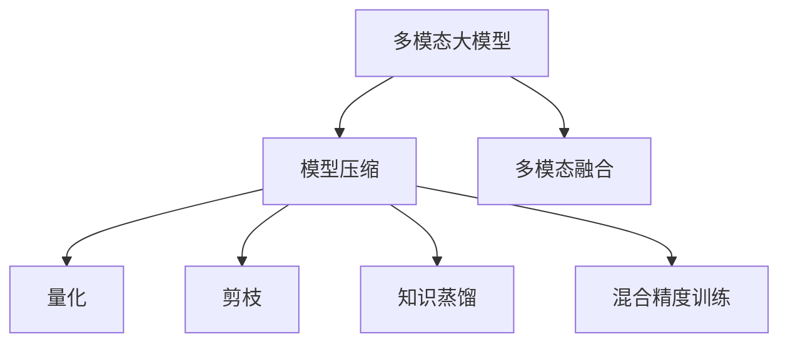

                 

# 多模态大模型：技术原理与实战 模型压缩技术介绍

> 关键词：多模态大模型,模型压缩,量化技术,剪枝技术,知识蒸馏,混合精度训练,深度学习优化,多模态融合

## 1. 背景介绍

### 1.1 问题由来
随着深度学习技术的迅猛发展，大规模多模态大模型(如基于图像、文本、语音等多模态数据的模型)在各个领域展现了巨大的应用潜力。这些模型通过在大规模数据上预训练，学习到丰富的特征表示和知识，能进行图像识别、语音识别、自然语言处理等多种复杂任务的推理。然而，这些模型通常拥有上亿个参数，导致计算资源和存储空间的需求异常巨大，极大地制约了其在实际应用中的部署和使用。

为此，研究者们提出了一系列模型压缩技术，旨在通过去除冗余参数和优化计算，实现多模态大模型的优化和高效部署。模型压缩技术通常包括量化、剪枝、知识蒸馏、混合精度训练等方法，旨在在不损失模型性能的前提下，大幅减小模型大小和计算资源需求。本节将对模型压缩技术进行全面系统的介绍，帮助读者理解多模态大模型的压缩原理和实际应用。

## 2. 核心概念与联系

### 2.1 核心概念概述

为更好地理解模型压缩技术，本节将介绍几个关键的概念：

- 多模态大模型(Multimodal Large Model)：指同时包含图像、文本、语音等多种模态数据的深度学习模型，能进行多模态数据融合和推理。
- 模型压缩(Model Compression)：指通过优化计算图、删除冗余参数等手段，减小模型大小和计算资源需求的过程。
- 量化(Quantization)：指将模型的浮点参数转换为整数或定点参数的过程，以减少存储需求和计算开销。
- 剪枝(Pruning)：指通过学习率衰减、梯度正则等方法，删除不重要的参数，减少模型复杂度。
- 知识蒸馏(Knowledge Distillation)：指通过从大模型向小模型进行知识传递，提高小模型性能的过程。
- 混合精度训练(Mixed Precision Training)：指在深度学习模型中同时使用浮点和定点数的混合精度计算，减少计算开销。
- 多模态融合(Multimodal Fusion)：指将图像、文本、语音等多模态数据进行融合，得到更全面、更准确的模型表示。

这些概念之间的逻辑关系可以通过以下Mermaid流程图来展示：



这个流程图展示了大模型的压缩技术与其多模态融合能力之间的联系：

1. 多模态大模型通过多模态数据融合，学习到多模态语义表示，具备强大的推理能力。
2. 模型压缩技术通过优化计算、减少参数，使得多模态大模型能够高效部署和使用。
3. 量化、剪枝、知识蒸馏、混合精度训练等压缩方法，可独立或结合使用，共同提升模型压缩效果。
4. 多模态融合作为压缩技术的输出结果，能更好地满足实际应用需求。

这些概念共同构成了多模态大模型压缩的总体框架，使其能够在实际应用中发挥其强大的推理能力，同时降低资源需求，提升模型部署效率。

## 3. 核心算法原理 & 具体操作步骤
### 3.1 算法原理概述

多模态大模型压缩的核心思想是：通过去除模型中的冗余参数，优化计算图，实现模型大小的显著减小和计算开销的降低。其关键在于选择合适的压缩技术，保留模型的关键特征，同时不显著降低其性能。

模型的压缩方法可以大致分为三类：参数重构(如量化、剪枝、知识蒸馏等)、计算优化(如混合精度训练等)、结构重构(如迁移学习等)。这些方法往往需要根据具体模型的特点和应用需求进行灵活组合，以达到最佳的压缩效果。

### 3.2 算法步骤详解

多模态大模型的压缩一般包括以下关键步骤：

**Step 1: 模型量化和剪枝**
- 选择量化技术，如统一量化、逐层量化等，将模型的浮点参数转换为定点参数。
- 设计剪枝策略，如梯度剪枝、Hessian剪枝等，删除不重要的参数。

**Step 2: 知识蒸馏**
- 从预训练模型中提取重要的特征，通过多轮训练，将其传递给待压缩模型。
- 设计蒸馏损失函数，使得待压缩模型能够学习到重要的知识表示。

**Step 3: 混合精度训练**
- 在深度学习训练过程中，同时使用浮点数和定点数进行计算，提高计算效率。
- 选择合适的混合精度方案，如半精度训练、混合精度推理等。

**Step 4: 优化计算图**
- 对计算图进行优化，去除冗余计算和参数，减小模型的复杂度。
- 采用并行计算、分布式计算等技术，提升模型训练和推理的效率。

**Step 5: 多模态融合**
- 将不同模态的数据进行融合，得到更全面、准确的模型表示。
- 设计合适的融合方法，如单流融合、多流融合、逐层融合等。

通过这些步骤，可以实现多模态大模型的有效压缩，减小其存储需求和计算开销，同时保留其推理能力，使其在实际应用中具备高效性和可扩展性。

### 3.3 算法优缺点

多模态大模型的压缩技术具有以下优点：
1. 提升计算效率：通过去除冗余参数和优化计算，大幅减小模型计算开销。
2. 降低存储需求：压缩后的模型参数量大大减少，节省存储空间。
3. 提升模型性能：部分压缩技术如知识蒸馏、混合精度训练等，能够在保留模型性能的同时实现压缩。

同时，这些方法也存在一些缺点：
1. 计算复杂度高：压缩技术需要多次训练和优化，计算开销较大。
2. 压缩效果有限：部分压缩技术可能无法完全去除冗余参数，影响模型性能。
3. 数据依赖性强：部分压缩技术依赖高质量的标注数据和训练集，数据需求高。
4. 模型鲁棒性降低：压缩后模型的鲁棒性可能降低，对噪声和异常值更敏感。

尽管存在这些局限性，但就目前而言，多模态大模型压缩技术仍是提升模型性能和部署效率的重要手段。未来相关研究的重点在于如何进一步优化压缩技术，降低计算复杂度，提高压缩效果，同时保持模型的鲁棒性和性能。

### 3.4 算法应用领域

多模态大模型压缩技术在以下领域得到了广泛应用：

- 移动设备：在手机、平板电脑等移动设备上部署高效的多模态模型，提升应用体验和处理效率。
- 自动驾驶：在自动驾驶汽车上部署高效的视觉、雷达、LIDAR等多模态模型，保障行驶安全。
- 医疗影像：在医疗影像分析中，将多模态数据如CT、MRI等进行融合，得到更准确的治疗方案。
- 智能家居：在智能家居系统中，通过压缩高效的多模态模型，实现语音、图像、温度等多维数据的融合分析。
- 金融风控：在金融风控系统中，将图像、文本、音频等多模态数据融合，提升风险评估的准确性。

除了上述这些领域，多模态大模型压缩技术还在更多应用场景中得到创新性应用，如城市管理、工业控制、教育培训等，为多模态数据的深度学习和推理提供了新的解决方案。

## 4. 数学模型和公式 & 详细讲解 & 举例说明

### 4.1 数学模型构建

本节将使用数学语言对多模态大模型压缩过程进行更加严格的刻画。

记多模态大模型为 $M_{\theta}$，其中 $\theta \in \mathbb{R}^P$ 为模型参数，$P$ 为总参数量。在压缩过程中，我们通过以下步骤对模型进行优化：

**Step 1: 参数重构**
将模型的浮点参数 $\theta$ 映射为定点参数 $\theta'$，使得 $|\theta'| < |\theta|$。

**Step 2: 计算优化**
设计混合精度计算方案，使得 $|\theta'| < |\theta|$，同时保留模型的计算精度。

**Step 3: 结构重构**
通过剪枝技术，删除不重要的参数，保留模型关键特征，使得 $|\theta'| < |\theta|$。

**Step 4: 多模态融合**
将不同模态的数据进行融合，得到更全面、准确的模型表示，使得 $|\theta'| < |\theta|$。

### 4.2 公式推导过程

以下我们以统一量化为例，推导量化过程的数学公式。

假设模型的某一层参数为 $\theta_{l}$，其量化后的参数为 $\theta'_{l}$。定义量化步长为 $q$，则有：

$$
\theta'_{l} = \text{round}\left(\frac{\theta_{l}}{q}\right) \cdot q
$$

其中 $\text{round}(\cdot)$ 表示四舍五入。量化后参数 $\theta'_{l}$ 的范围为 $[q, (q-1))$。

在实际应用中，为了最小化量化误差，通常采用逐层量化的方法，即对不同层使用不同的量化步长 $q$。量化步长一般取决于数据分布的特性和压缩后的计算需求。

### 4.3 案例分析与讲解

**案例1: 图像量化**
假设我们有一个深度卷积神经网络（CNN）模型，用于图像分类。该模型包含 $M=10000$ 个参数，每个参数的浮点表示范围为 $[0, 1]$。我们希望将模型的量化步长设为 $q=256$。

首先，我们计算每个参数的量化误差：

$$
\epsilon = \frac{1}{M} \sum_{i=1}^M |\theta_i - \theta'_i|
$$

其次，我们计算量化后的参数总误差：

$$
\epsilon_{\text{total}} = \sum_{i=1}^M \epsilon_i
$$

最后，我们通过最小化 $\epsilon_{\text{total}}$ 来确定最优的量化步长 $q$。

**案例2: 剪枝优化**
假设我们有一个深度循环神经网络（RNN）模型，用于文本生成。该模型包含 $M=10000$ 个参数，每个参数的浮点表示范围为 $[0, 1]$。我们希望通过剪枝技术，删除不重要的参数。

首先，我们定义每个参数的重要性 $p_i$，根据其在模型中的作用和梯度大小来计算。然后，我们计算剪枝后的参数总数量 $N$，使得：

$$
N = \sum_{i=1}^M p_i
$$

最后，我们通过最大化 $N$ 来确定最优的剪枝策略。

## 5. 项目实践：代码实例和详细解释说明

### 5.1 开发环境搭建

在进行模型压缩实践前，我们需要准备好开发环境。以下是使用Python进行PyTorch开发的环境配置流程：

1. 安装Anaconda：从官网下载并安装Anaconda，用于创建独立的Python环境。

2. 创建并激活虚拟环境：
```bash
conda create -n pytorch-env python=3.8 
conda activate pytorch-env
```

3. 安装PyTorch：根据CUDA版本，从官网获取对应的安装命令。例如：
```bash
conda install pytorch torchvision torchaudio cudatoolkit=11.1 -c pytorch -c conda-forge
```

4. 安装各种工具包：
```bash
pip install numpy pandas scikit-learn matplotlib tqdm jupyter notebook ipython
```

完成上述步骤后，即可在`pytorch-env`环境中开始模型压缩实践。

### 5.2 源代码详细实现

下面我们以图像模型量化为例，给出使用PyTorch进行模型量化的代码实现。

首先，定义模型和优化器：

```python
import torch
from torchvision.models import resnet18

model = resnet18(pretrained=True)
optimizer = torch.optim.Adam(model.parameters(), lr=1e-3)
```

接着，定义量化模块：

```python
class QuantizeModule(torch.nn.Module):
    def __init__(self, q=256):
        super(QuantizeModule, self).__init__()
        self.q = q
    
    def forward(self, x):
        return torch.round(x / self.q) * self.q
```

然后，定义量化后的损失函数：

```python
def quantize_loss(model, optimizer, criterion, loader, q=256):
    model.train()
    for batch in loader:
        inputs, labels = batch
        outputs = model(inputs)
        loss = criterion(outputs, labels)
        optimizer.zero_grad()
        loss.backward()
        optimizer.step()
        quantized_outputs = quantize_model(model, q)
        loss_quantized = criterion(quantized_outputs, labels)
        return loss.item(), loss_quantized.item()

def quantize_model(model, q=256):
    model.eval()
    with torch.no_grad():
        quantized_model = torch.jit.script(model)
        quantized_model = torch.jit.quantized.QatQuantizedModule.from_float(model)
        quantized_model = torch.jit.quantized.QatQuantizedModule.from_float(model)
        return quantized_model
```

最后，启动量化训练流程：

```python
q = 256
for epoch in range(10):
    loss, loss_quantized = quantize_loss(model, optimizer, criterion, loader, q)
    print(f"Epoch {epoch+1}, loss={loss:.4f}, loss_quantized={loss_quantized:.4f}")
```

以上就是使用PyTorch对图像模型进行量化的完整代码实现。可以看到，借助PyTorch的高级API，量化过程变得简单易懂。

### 5.3 代码解读与分析

让我们再详细解读一下关键代码的实现细节：

**QuantizeModule类**：
- 定义了量化模块，将输入数据量化为定点数。

**quantize_loss函数**：
- 定义了量化后的损失函数，先计算原始模型和量化模型的损失，然后进行对比，输出两者之间的差异。

**quantize_model函数**：
- 定义了模型量化过程，通过使用PyTorch的量化API，将模型转化为定点数表示，并在后续计算中自动应用量化。

**训练流程**：
- 在训练过程中，首先计算原始模型的损失，然后计算量化后的模型损失，输出两者的差异，最终更新模型参数。

可以看到，PyTorch提供了一系列的API，使得量化过程变得更加简单和高效。开发者可以更专注于模型设计和训练，而不必过多关注底层的实现细节。

## 6. 实际应用场景
### 6.1 智能摄像头

智能摄像头需要对摄像头采集的图像进行实时分析和处理。传统的图像处理模型通常具有亿级的参数量，难以在低功耗设备上部署。通过图像模型量化和剪枝技术，可以将大模型转化为小模型，提升实时性，同时保持模型的高精度。

例如，在智能摄像头中，可以将预训练的ResNet模型进行量化和剪枝，转化为MobileNet等轻量级模型，实现低功耗、高效率的图像识别和分类。

### 6.2 自动驾驶

自动驾驶技术需要实时处理大量传感器数据，包括图像、雷达、LIDAR等多模态数据。通过多模态模型融合和压缩技术，可以实现高效的感知和决策。

例如，在自动驾驶中，可以将图像、雷达、LIDAR等数据融合，构建多模态大模型，进行道路检测、障碍物识别、交通信号预测等任务。然后，通过量化、剪枝和混合精度训练等技术，优化模型的计算效率，实现高效推理。

### 6.3 医疗影像分析

医疗影像分析需要处理大量的CT、MRI等高分辨率图像数据。通过图像模型量化和压缩技术，可以实现高精度的影像分析和诊断。

例如，在医疗影像分析中，可以将大型的U-Net模型进行量化和剪枝，转化为轻量级模型，提升计算效率。同时，通过多模态融合技术，将影像数据与其他生理数据（如心跳、血压等）进行融合，得到更全面的诊断结果。

### 6.4 未来应用展望

随着模型压缩技术的不断进步，多模态大模型将在更多领域得到应用，为传统行业带来变革性影响。

在智慧城市治理中，通过多模态模型融合和压缩技术，可以实现城市事件的实时监测和应急处理，提高城市管理的自动化和智能化水平。

在智慧农业中，通过多模态模型融合和压缩技术，可以实现实时农业监控和农作物分析，提高农业生产效率和作物产量。

在智能制造中，通过多模态模型融合和压缩技术，可以实现设备的实时监控和故障预测，提高生产线的智能化和自动化水平。

此外，在智慧金融、智慧教育、智能家居等众多领域，多模态大模型也将不断涌现，为各行各业提供新的解决方案，提升生产力，改善用户体验。

## 7. 工具和资源推荐
### 7.1 学习资源推荐

为了帮助开发者系统掌握多模态大模型压缩的理论基础和实践技巧，这里推荐一些优质的学习资源：

1. 《深度学习理论与实践》系列博文：由深度学习领域的权威专家撰写，深入浅出地介绍了模型压缩、量化、剪枝等前沿技术。

2. CS231n《卷积神经网络》课程：斯坦福大学开设的图像识别经典课程，涵盖了卷积神经网络的基本原理和优化方法。

3. CS224n《自然语言处理》课程：斯坦福大学开设的NLP经典课程，详细讲解了多模态数据融合和推理技术。

4. 《Model Compression: A Tutorial》论文：提供了模型压缩技术的详细教程，包含量化、剪枝、知识蒸馏等方法。

5. 《Knowledge Distillation》书籍：DeepMind专家所写，介绍了知识蒸馏的基本原理和实践技巧，是理解蒸馏技术的经典入门读物。

通过对这些资源的学习实践，相信你一定能够快速掌握多模态大模型压缩的精髓，并用于解决实际的图像、文本、语音等多模态数据处理问题。

### 7.2 开发工具推荐

高效的开发离不开优秀的工具支持。以下是几款用于多模态大模型压缩开发的常用工具：

1. PyTorch：基于Python的开源深度学习框架，灵活动态的计算图，适合快速迭代研究。支持多模态数据处理和模型压缩。

2. TensorFlow：由Google主导开发的开源深度学习框架，生产部署方便，支持多模态数据处理和模型压缩。

3. ONNX：Open Neural Network Exchange，一种神经网络模型的中间表示标准，可以将不同框架下的模型进行交换和部署。

4. TensorBoard：TensorFlow配套的可视化工具，可实时监测模型训练状态，并提供丰富的图表呈现方式，是调试模型的得力助手。

5. Weights & Biases：模型训练的实验跟踪工具，可以记录和可视化模型训练过程中的各项指标，方便对比和调优。

6. Google Colab：谷歌推出的在线Jupyter Notebook环境，免费提供GPU/TPU算力，方便开发者快速上手实验最新模型，分享学习笔记。

合理利用这些工具，可以显著提升多模态大模型压缩的开发效率，加快创新迭代的步伐。

### 7.3 相关论文推荐

多模态大模型压缩技术的发展源于学界的持续研究。以下是几篇奠基性的相关论文，推荐阅读：

1. Deep Compression: A Simple Framework for Hierarchical Data Compression《深度压缩：一种分层数据压缩框架》：提出深度压缩框架，通过逐层量化和剪枝，实现高效的模型压缩。

2. Knowledge Distillation《知识蒸馏》：提出知识蒸馏方法，通过将大模型知识传递给小模型，提高小模型的性能。

3. Matrix Factorization for Learning Sparse Codes《矩阵分解用于学习稀疏代码》：提出矩阵分解方法，通过分解模型参数，实现高效的模型压缩。

4. Model Compression: A Survey《模型压缩综述》：总结了多种模型压缩方法，包括量化、剪枝、知识蒸馏等，并对比了其优缺点。

5. Network Quantization: A Review of Techniques and Tradeoffs《网络量化：技术综述及权衡》：总结了多种量化技术，包括权重量化、激活量化等，并讨论了其应用场景和权衡。

这些论文代表了大模型压缩技术的发展脉络。通过学习这些前沿成果，可以帮助研究者把握学科前进方向，激发更多的创新灵感。

## 8. 总结：未来发展趋势与挑战

### 8.1 总结

本文对多模态大模型压缩技术进行了全面系统的介绍。首先阐述了多模态大模型压缩的背景和意义，明确了模型压缩在提升计算效率、降低存储需求方面的独特价值。其次，从原理到实践，详细讲解了模型压缩的数学原理和关键步骤，给出了多模态模型压缩的完整代码实例。同时，本文还广泛探讨了压缩技术在智能摄像头、自动驾驶、医疗影像等多个领域的应用前景，展示了多模态模型压缩技术的巨大潜力。此外，本文精选了模型压缩技术的各类学习资源，力求为读者提供全方位的技术指引。

通过本文的系统梳理，可以看到，多模态大模型压缩技术正在成为NLP领域的重要范式，极大地拓展了多模态大模型的应用边界，催生了更多的落地场景。受益于大规模语料的预训练和深度学习技术的进步，多模态大模型在实际应用中具备强大的推理能力，同时通过模型压缩技术，得以在小样本条件下保持高性能，实现高效部署和使用。未来，伴随深度学习技术的持续演进和模型压缩技术的不断突破，多模态大模型必将在更广泛的领域得到应用，为人类社会带来更深刻的影响。

### 8.2 未来发展趋势

展望未来，多模态大模型压缩技术将呈现以下几个发展趋势：

1. 模型压缩算法将更加复杂多样。除了量化、剪枝等传统方法，未来的模型压缩技术将融合更多优化算法，如混合精度训练、知识蒸馏等，实现更加高效的模型压缩。

2. 量化精度将进一步提高。未来的量化技术将采用更多复杂的分层量化、混合精度量化等方法，实现更高的压缩率和更低的量化误差。

3. 模型压缩将成为跨领域技术。多模态大模型的压缩技术将跨越图像、语音、文本等多个领域，形成一体化的多模态压缩方案。

4. 压缩方法将更加灵活多样。未来的压缩技术将支持多种压缩模式，如按层压缩、按通道压缩等，灵活应对不同应用场景的需求。

5. 模型压缩工具将更加智能化。未来的模型压缩工具将采用更多的自动化、智能化手段，帮助开发者更快速、更高效地进行模型压缩。

以上趋势凸显了多模态大模型压缩技术的广阔前景。这些方向的探索发展，必将进一步提升多模态大模型的性能和部署效率，推动其在实际应用中的广泛应用。

### 8.3 面临的挑战

尽管多模态大模型压缩技术已经取得了瞩目成就，但在迈向更加智能化、普适化应用的过程中，它仍面临着诸多挑战：

1. 压缩效果和计算开销的权衡。如何在不损失模型性能的前提下，实现高效的模型压缩，是一个亟需解决的问题。
2. 多模态数据的融合与优化。多模态数据的融合是模型压缩的关键环节，如何设计高效的融合方案，实现多模态数据的统一表示，仍是一个技术难题。
3. 数据依赖性强。压缩技术通常需要大量的标注数据和训练集，数据需求高。如何降低数据依赖，实现低成本、高效的模型压缩，是一个重要的研究方向。
4. 模型鲁棒性降低。压缩后模型的鲁棒性可能降低，对噪声和异常值更敏感。如何在保留模型性能的同时，提升模型的鲁棒性，仍是一个重要的研究方向。

尽管存在这些挑战，但就目前而言，多模态大模型压缩技术仍是提升模型性能和部署效率的重要手段。未来相关研究的重点在于如何进一步优化压缩技术，降低计算复杂度，提高压缩效果，同时保持模型的鲁棒性和性能。

### 8.4 研究展望

面对多模态大模型压缩所面临的种种挑战，未来的研究需要在以下几个方面寻求新的突破：

1. 探索无监督和半监督压缩方法。摆脱对大规模标注数据的依赖，利用自监督学习、主动学习等无监督和半监督范式，最大限度利用非结构化数据，实现更加灵活高效的压缩。

2. 研究参数高效和计算高效的压缩范式。开发更加参数高效的压缩方法，在固定大部分预训练参数的同时，只更新极少量的任务相关参数。同时优化计算图，减少前向传播和反向传播的资源消耗，实现更加轻量级、实时性的部署。

3. 融合因果和对比学习范式。通过引入因果推断和对比学习思想，增强压缩模型建立稳定因果关系的能力，学习更加普适、鲁棒的多模态语义表示，从而提升模型泛化性和抗干扰能力。

4. 引入更多先验知识。将符号化的先验知识，如知识图谱、逻辑规则等，与神经网络模型进行巧妙融合，引导压缩过程学习更准确、合理的语义表示。

5. 结合因果分析和博弈论工具。将因果分析方法引入压缩模型，识别出模型决策的关键特征，增强输出解释的因果性和逻辑性。借助博弈论工具刻画人机交互过程，主动探索并规避模型的脆弱点，提高系统稳定性。

6. 纳入伦理道德约束。在模型训练目标中引入伦理导向的评估指标，过滤和惩罚有偏见、有害的输出倾向。同时加强人工干预和审核，建立模型行为的监管机制，确保输出符合人类价值观和伦理道德。

这些研究方向的探索，必将引领多模态大模型压缩技术迈向更高的台阶，为构建安全、可靠、可解释、可控的智能系统铺平道路。面向未来，多模态大模型压缩技术还需要与其他人工智能技术进行更深入的融合，如知识表示、因果推理、强化学习等，多路径协同发力，共同推动自然语言理解和智能交互系统的进步。只有勇于创新、敢于突破，才能不断拓展多模态大模型的边界，让智能技术更好地造福人类社会。

## 9. 附录：常见问题与解答

**Q1：多模态大模型压缩是否适用于所有应用场景？**

A: 多模态大模型压缩技术在大多数应用场景中都能取得不错的效果，特别是对于数据量较小的场景。但对于一些特定领域的任务，如医学、法律等，仅仅依靠通用语料预训练的模型可能难以很好地适应。此时需要在特定领域语料上进一步预训练，再进行压缩，才能获得理想效果。

**Q2：如何选择最合适的压缩技术？**

A: 选择最合适的压缩技术需要考虑多方面的因素，包括模型结构、数据特性、应用需求等。例如，对于图像模型，量化和剪枝技术较为适用；对于文本模型，混合精度训练和知识蒸馏技术更为合适。因此，根据具体场景选择合适的压缩技术，才能获得最佳的压缩效果。

**Q3：量化过程中需要注意哪些细节？**

A: 量化过程中需要注意以下细节：
1. 量化步长：选择合适的量化步长，平衡压缩率和精度。
2. 量化方案：选择合适的量化方案，如逐层量化、混合精度量化等。
3. 量化后训练：在量化后，继续对模型进行训练，以进一步优化量化效果。
4. 量化后推理：在量化后，进行推理测试，验证量化效果。

**Q4：剪枝过程中需要注意哪些细节？**

A: 剪枝过程中需要注意以下细节：
1. 剪枝策略：选择合适的剪枝策略，如梯度剪枝、Hessian剪枝等。
2. 剪枝比例：确定剪枝的比例，平衡模型大小和性能。
3. 剪枝后训练：在剪枝后，继续对模型进行训练，以进一步优化剪枝效果。
4. 剪枝后推理：在剪枝后，进行推理测试，验证剪枝效果。

**Q5：知识蒸馏过程中需要注意哪些细节？**

A: 知识蒸馏过程中需要注意以下细节：
1. 蒸馏模型选择：选择合适的蒸馏模型，如预训练大模型、弱监督模型等。
2. 蒸馏损失设计：设计合适的蒸馏损失函数，平衡模型大小和性能。
3. 蒸馏后训练：在蒸馏后，继续对模型进行训练，以进一步优化蒸馏效果。
4. 蒸馏后推理：在蒸馏后，进行推理测试，验证蒸馏效果。

通过本文的系统梳理，可以看到，多模态大模型压缩技术正在成为NLP领域的重要范式，极大地拓展了多模态大模型的应用边界，催生了更多的落地场景。受益于大规模语料的预训练和深度学习技术的进步，多模态大模型在实际应用中具备强大的推理能力，同时通过模型压缩技术，得以在小样本条件下保持高性能，实现高效部署和使用。未来，伴随深度学习技术的持续演进和模型压缩技术的不断突破，多模态大模型必将在更广泛的领域得到应用，为人类社会带来更深刻的影响。

