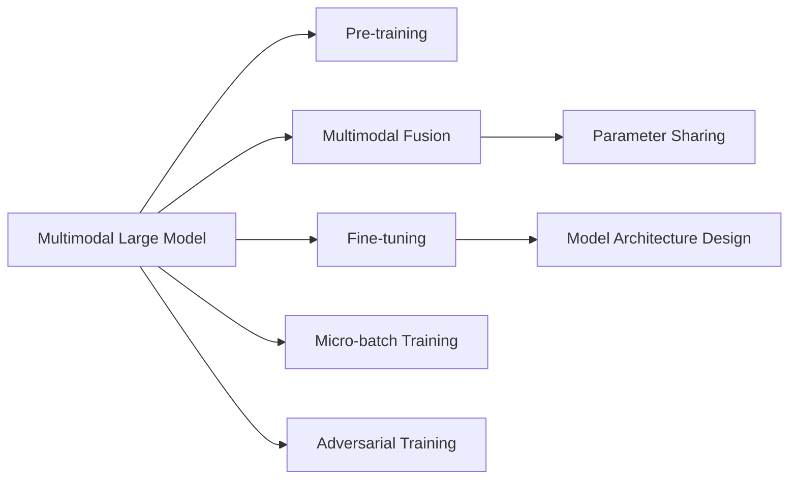

                 

## 1. 背景介绍

### 1.1 问题由来

随着人工智能技术的飞速发展，多模态大模型（Multimodal Large Model）开始受到越来越多的关注。这种模型能够处理和融合不同类型的数据，如文本、图像、声音等，从而能够进行更为复杂和深入的理解和生成。其核心在于通过预训练学习到一种多模态的表示方式，能够在各种模态之间进行有效的转换和融合。

在NLP（自然语言处理）领域，尽管已经存在了大量的预训练语言模型（如BERT、GPT等），这些模型在文本处理方面表现出色，但在处理多媒体数据时却显得力不从心。例如，当需要将一段文本与相应的图片或视频进行匹配时，传统的文本模型无法直接处理这种多模态数据，需要额外的特征提取和融合过程，这不仅增加了复杂度，也影响了效率。

为了应对这些问题，研究人员开始探索将不同模态的数据融合到同一模型中进行处理，这种方法被称为多模态大模型。多模态大模型不仅在NLP领域，也在计算机视觉、语音识别等多个领域中展现出了强大的潜力，成为未来AI发展的关键技术之一。

### 1.2 问题核心关键点

多模态大模型的工作原理可以归纳为以下几个关键点：

- **预训练**：在大规模无标签数据上进行预训练，学习通用的多模态表示。
- **多模态融合**：将不同模态的数据（如文本、图像、声音等）进行有效的融合，形成统一的多模态表示。
- **微调**：使用特定任务的有标签数据进行微调，使模型在特定任务上表现更好。
- **模型参数共享**：在多模态大模型中，不同模态的参数可以共享，从而减少了需要训练的参数数量，提高了模型的训练效率。
- **模型结构设计**：多模态大模型的结构设计需要考虑到不同模态数据的特征差异，采用相应的编码器和解码器。

这些关键点共同构成了多模态大模型的核心技术，使其能够在复杂的多模态任务中表现出色。

### 1.3 问题研究意义

研究多模态大模型具有重要的意义：

1. **提升跨模态理解能力**：多模态大模型能够处理和融合不同类型的数据，从而提升了对复杂任务的理解能力。
2. **降低数据获取成本**：多模态大模型可以利用现有的多媒体数据进行训练，减少了对标注数据的依赖，降低了数据获取成本。
3. **增强模型的泛化能力**：多模态大模型通过融合不同模态的数据，增强了模型的泛化能力，使其能够更好地适应新的数据分布。
4. **推动AI技术的应用**：多模态大模型为AI技术在各个领域的实际应用提供了新的思路和方法，推动了AI技术的广泛应用。

## 2. 核心概念与联系

### 2.1 核心概念概述

为更好地理解多模态大模型的原理和工作方式，本节将介绍几个核心概念及其相互关系。

- **多模态大模型（Multimodal Large Model）**：一种能够处理和融合不同类型数据（如文本、图像、声音等）的预训练模型。通过预训练学习通用的多模态表示，能够在多模态任务中表现出色。

- **预训练（Pre-training）**：在大规模无标签数据上进行预训练，学习通用的表示方式。预训练是大模型训练的基础，使得模型能够学习到通用的知识。

- **多模态融合（Multimodal Fusion）**：将不同模态的数据进行有效的融合，形成统一的多模态表示。多模态融合是实现多模态大模型的关键步骤。

- **微调（Fine-tuning）**：使用特定任务的有标签数据进行微调，使模型在特定任务上表现更好。微调能够提升模型在特定任务上的性能。

- **模型参数共享（Parameter Sharing）**：在多模态大模型中，不同模态的参数可以共享，从而减少了需要训练的参数数量，提高了模型的训练效率。

- **模型结构设计（Model Architecture Design）**：多模态大模型的结构设计需要考虑到不同模态数据的特征差异，采用相应的编码器和解码器。

这些核心概念之间存在紧密的联系，共同构成了多模态大模型的技术框架。通过理解这些概念，我们可以更好地把握多模态大模型的工作原理和优化方向。

### 2.2 核心概念原理和架构的 Mermaid 流程图



这个流程图展示了多模态大模型的核心流程和技术点。预训练使得模型学习到通用的表示方式，多模态融合将不同模态的数据进行有效融合，微调提升模型在特定任务上的性能，模型参数共享减少训练成本，模型结构设计适应不同模态的特征，微批量训练和对抗训练提高模型的鲁棒性和泛化能力。

## 3. 核心算法原理 & 具体操作步骤

### 3.1 算法原理概述

多模态大模型的核心算法原理可以归纳为以下几个步骤：

1. **预训练**：在大规模无标签数据上进行预训练，学习通用的表示方式。
2. **多模态融合**：将不同模态的数据进行有效的融合，形成统一的多模态表示。
3. **微调**：使用特定任务的有标签数据进行微调，使模型在特定任务上表现更好。
4. **模型参数共享**：在多模态大模型中，不同模态的参数可以共享，从而减少了需要训练的参数数量，提高了模型的训练效率。
5. **模型结构设计**：多模态大模型的结构设计需要考虑到不同模态数据的特征差异，采用相应的编码器和解码器。

### 3.2 算法步骤详解

#### 3.2.1 预训练

预训练是构建多模态大模型的第一步。预训练的目标是通过在大规模无标签数据上训练模型，学习到通用的多模态表示。预训练的方法主要有自监督学习和掩码语言模型（Masked Language Modeling, MLM）。

以BERT为例，BERT的预训练过程包括以下步骤：

1. **数据准备**：收集大规模无标签文本数据，进行预处理，如分词、标记化等。
2. **掩码语言模型训练**：在每个样本中，随机掩码一部分单词，让模型预测被掩码的单词。
3. **下一句预测**：对于两个连续的句子，随机选择其中一个句子作为输入，预测下一个句子。

预训练的目的是让模型学习到语言的一般规则和模式，从而在后续的微调中能够更好地适应特定任务。

#### 3.2.2 多模态融合

多模态融合是将不同模态的数据进行有效的融合，形成统一的多模态表示。多模态融合的方法主要有两种：

1. **特征拼接（Feature Concatenation）**：将不同模态的特征进行拼接，形成一个新的特征向量。这种方法简单易懂，但在高维数据上效果不佳。
2. **注意力机制（Attention Mechanism）**：通过注意力机制，将不同模态的数据进行加权融合，形成统一的多模态表示。这种方法效果更好，但实现复杂度较高。

以CLIP为例，CLIP的多模态融合过程包括以下步骤：

1. **图像特征提取**：使用预训练的图像特征提取器，将图像转换为特征向量。
2. **文本特征提取**：使用预训练的文本特征提取器，将文本转换为特征向量。
3. **多模态融合**：通过注意力机制，将图像和文本的特征向量进行加权融合，形成一个新的多模态表示。

#### 3.2.3 微调

微调是使用特定任务的有标签数据进行微调，使模型在特定任务上表现更好。微调的方法主要有两种：

1. **全参数微调（Full Parameter Fine-tuning）**：在预训练的基础上，对模型所有参数进行微调，以适应特定任务。
2. **参数高效微调（Parameter-Efficient Fine-tuning, PEFT）**：只更新少量的模型参数，而固定大部分预训练权重不变，以提高微调效率，避免过拟合。

以FCLIP为例，FCLIP的微调过程包括以下步骤：

1. **任务适配层设计**：根据任务类型，设计合适的输出层和损失函数。
2. **选择学习率**：选择合适的学习率，一般比从头训练小得多。
3. **微调训练**：使用任务的有标签数据进行微调训练，更新模型参数。
4. **验证与测试**：在验证集和测试集上评估模型性能，调整超参数。

#### 3.2.4 模型参数共享

在多模态大模型中，不同模态的参数可以共享，从而减少了需要训练的参数数量，提高了模型的训练效率。

以CLIP为例，CLIP的多模态大模型结构如下：

```
[Text Encoder]
  [Text Decoding]
  [Text Classifier]
[Image Encoder]
  [Image Decoding]
  [Image Classifier]
```

在CLIP中，文本和图像的参数是共享的，从而减少了训练成本，提高了模型的训练效率。

#### 3.2.5 模型结构设计

多模态大模型的结构设计需要考虑到不同模态数据的特征差异，采用相应的编码器和解码器。

以FCLIP为例，FCLIP的模型结构如下：

```
[Text Encoder]
  [Text Decoding]
  [Text Classifier]
[Image Encoder]
  [Image Decoding]
  [Image Classifier]
```

在FCLIP中，文本和图像的编码器和解码器分别处理不同模态的数据，并共享部分参数，从而提高了模型的泛化能力和推理速度。

### 3.3 算法优缺点

多模态大模型具有以下优点：

1. **泛化能力强**：通过融合不同模态的数据，多模态大模型能够更好地适应新的数据分布，提高模型的泛化能力。
2. **提升跨模态理解能力**：多模态大模型能够处理和融合不同类型的数据，从而提升了对复杂任务的理解能力。
3. **降低数据获取成本**：多模态大模型可以利用现有的多媒体数据进行训练，减少了对标注数据的依赖，降低了数据获取成本。
4. **增强模型的鲁棒性**：多模态大模型通过融合不同模态的数据，增强了模型的鲁棒性，使其能够更好地应对数据噪声和变化。

同时，多模态大模型也存在一些缺点：

1. **计算复杂度高**：多模态大模型需要处理和融合不同类型的数据，计算复杂度高，需要大量的计算资源。
2. **参数数量大**：多模态大模型的参数数量较大，需要大量的计算资源和存储空间。
3. **训练时间长**：多模态大模型的训练时间较长，需要较长的训练周期。

### 3.4 算法应用领域

多模态大模型在以下几个领域具有广泛的应用：

1. **计算机视觉**：多模态大模型可以处理和融合图像、视频等视觉数据，从而提升了对视觉数据的理解和生成能力。
2. **自然语言处理**：多模态大模型可以处理和融合文本、语音等自然语言数据，从而提升了对自然语言的理解和生成能力。
3. **机器人学**：多模态大模型可以处理和融合语音、视觉等数据，从而提升了机器人的感知和交互能力。
4. **医疗健康**：多模态大模型可以处理和融合医学图像、文本等数据，从而提升了医疗诊断和治疗的能力。
5. **教育培训**：多模态大模型可以处理和融合文本、视频等数据，从而提升了教育培训的效果和效率。

## 4. 数学模型和公式 & 详细讲解 & 举例说明

### 4.1 数学模型构建

多模态大模型的数学模型可以归纳为以下几个部分：

1. **预训练模型**：如BERT、GPT等，在大规模无标签数据上进行预训练。
2. **多模态融合模型**：如CLIP，将不同模态的数据进行融合，形成统一的多模态表示。
3. **微调模型**：如FCLIP，使用特定任务的有标签数据进行微调，提升模型在特定任务上的性能。

### 4.2 公式推导过程

以BERT和CLIP为例，推导其预训练和微调的数学公式。

#### BERT的预训练过程

BERT的预训练过程包括以下步骤：

1. **掩码语言模型训练**：
$$
\mathcal{L}_{MLM} = -\frac{1}{N} \sum_{i=1}^N \sum_{j=1}^M \log p(w_j | w_1, ..., w_{j-1}, [MASK], w_{j+1}, ..., w_N)
$$

2. **下一句预测**：
$$
\mathcal{L}_{NSP} = -\frac{1}{2N} \sum_{i=1}^N (y_{ij} \log p(w_j | w_1, ..., w_{j-1}, w_i) + (1-y_{ij}) \log (1-p(w_j | w_1, ..., w_{j-1}, w_i)))
$$

其中，$w_i$表示单词，$[MASK]$表示掩码，$y_{ij}$表示下一句的标记。

#### CLIP的多模态融合过程

CLIP的多模态融合过程包括以下步骤：

1. **图像特征提取**：使用预训练的图像特征提取器，将图像转换为特征向量$H^i$。
2. **文本特征提取**：使用预训练的文本特征提取器，将文本转换为特征向量$H^t$。
3. **多模态融合**：
$$
F^j = \sum_{i=1}^n \alpha_i^j H^i
$$

其中，$F^j$表示融合后的多模态表示，$\alpha_i^j$表示注意力权重。

#### FCLIP的微调过程

FCLIP的微调过程包括以下步骤：

1. **任务适配层设计**：根据任务类型，设计合适的输出层和损失函数。
2. **选择学习率**：选择合适的学习率，一般比从头训练小得多。
3. **微调训练**：
$$
\mathcal{L} = \mathcal{L}^{text} + \mathcal{L}^{image} + \mathcal{L}^{classifier}
$$

其中，$\mathcal{L}^{text}$表示文本损失，$\mathcal{L}^{image}$表示图像损失，$\mathcal{L}^{classifier}$表示分类损失。

### 4.3 案例分析与讲解

以FCLIP为例，分析其微调过程的数学原理和实现细节。

FCLIP的微调过程包括以下步骤：

1. **任务适配层设计**：根据任务类型，设计合适的输出层和损失函数。
2. **选择学习率**：选择合适的学习率，一般比从头训练小得多。
3. **微调训练**：
$$
\mathcal{L} = \mathcal{L}^{text} + \mathcal{L}^{image} + \mathcal{L}^{classifier}
$$

其中，$\mathcal{L}^{text}$表示文本损失，$\mathcal{L}^{image}$表示图像损失，$\mathcal{L}^{classifier}$表示分类损失。

在FCLIP中，文本和图像的参数是共享的，从而减少了训练成本，提高了模型的训练效率。

## 5. 项目实践：代码实例和详细解释说明

### 5.1 开发环境搭建

在进行多模态大模型的微调实践前，我们需要准备好开发环境。以下是使用Python进行PyTorch开发的环境配置流程：

1. 安装Anaconda：从官网下载并安装Anaconda，用于创建独立的Python环境。

2. 创建并激活虚拟环境：
```bash
conda create -n pytorch-env python=3.8 
conda activate pytorch-env
```

3. 安装PyTorch：根据CUDA版本，从官网获取对应的安装命令。例如：
```bash
conda install pytorch torchvision torchaudio cudatoolkit=11.1 -c pytorch -c conda-forge
```

4. 安装Transformers库：
```bash
pip install transformers
```

5. 安装各类工具包：
```bash
pip install numpy pandas scikit-learn matplotlib tqdm jupyter notebook ipython
```

完成上述步骤后，即可在`pytorch-env`环境中开始多模态大模型的微调实践。

### 5.2 源代码详细实现

以下是使用PyTorch对CLIP模型进行微调的代码实现。

首先，定义CLIP任务的数据处理函数：

```python
from transformers import CLIPModel, CLIPTokenizer
import torch

class CLIPDataset(Dataset):
    def __init__(self, texts, images, tokenizer, max_len=128):
        self.texts = texts
        self.images = images
        self.tokenizer = tokenizer
        self.max_len = max_len
        
    def __len__(self):
        return len(self.texts)
    
    def __getitem__(self, item):
        text = self.texts[item]
        image = self.images[item]
        
        encoding = self.tokenizer(text, return_tensors='pt', max_length=self.max_len, padding='max_length', truncation=True)
        input_ids = encoding['input_ids'][0]
        attention_mask = encoding['attention_mask'][0]
        
        # 对图像进行预处理
        image = transform(image)
        
        return {'input_ids': input_ids, 
                'attention_mask': attention_mask,
                'images': image}
```

然后，定义模型和优化器：

```python
from transformers import CLIPForMultimodalClassification

model = CLIPForMultimodalClassification.from_pretrained('clip-ViT-B-32', num_labels=num_labels)

optimizer = AdamW(model.parameters(), lr=2e-5)
```

接着，定义训练和评估函数：

```python
from torch.utils.data import DataLoader
from tqdm import tqdm
from sklearn.metrics import classification_report

device = torch.device('cuda') if torch.cuda.is_available() else torch.device('cpu')
model.to(device)

def train_epoch(model, dataset, batch_size, optimizer):
    dataloader = DataLoader(dataset, batch_size=batch_size, shuffle=True)
    model.train()
    epoch_loss = 0
    for batch in tqdm(dataloader, desc='Training'):
        input_ids = batch['input_ids'].to(device)
        attention_mask = batch['attention_mask'].to(device)
        images = batch['images'].to(device)
        model.zero_grad()
        outputs = model(input_ids, attention_mask=attention_mask, images=images)
        loss = outputs.loss
        epoch_loss += loss.item()
        loss.backward()
        optimizer.step()
    return epoch_loss / len(dataloader)

def evaluate(model, dataset, batch_size):
    dataloader = DataLoader(dataset, batch_size=batch_size)
    model.eval()
    preds, labels = [], []
    with torch.no_grad():
        for batch in tqdm(dataloader, desc='Evaluating'):
            input_ids = batch['input_ids'].to(device)
            attention_mask = batch['attention_mask'].to(device)
            images = batch['images'].to(device)
            batch_labels = batch['labels']
            outputs = model(input_ids, attention_mask=attention_mask, images=images)
            batch_preds = outputs.logits.argmax(dim=2).to('cpu').tolist()
            batch_labels = batch_labels.to('cpu').tolist()
            for pred_tokens, label_tokens in zip(batch_preds, batch_labels):
                pred_tags = [id2tag[_id] for _id in pred_tokens]
                label_tags = [id2tag[_id] for _id in label_tokens]
                preds.append(pred_tags[:len(label_tokens)])
                labels.append(label_tags)
                
    print(classification_report(labels, preds))
```

最后，启动训练流程并在测试集上评估：

```python
epochs = 5
batch_size = 16

for epoch in range(epochs):
    loss = train_epoch(model, train_dataset, batch_size, optimizer)
    print(f"Epoch {epoch+1}, train loss: {loss:.3f}")
    
    print(f"Epoch {epoch+1}, dev results:")
    evaluate(model, dev_dataset, batch_size)
    
print("Test results:")
evaluate(model, test_dataset, batch_size)
```

以上就是使用PyTorch对CLIP模型进行微调的完整代码实现。可以看到，得益于Transformers库的强大封装，我们可以用相对简洁的代码完成CLIP模型的加载和微调。

### 5.3 代码解读与分析

让我们再详细解读一下关键代码的实现细节：

**CLIPDataset类**：
- `__init__`方法：初始化文本、图像、分词器等关键组件。
- `__len__`方法：返回数据集的样本数量。
- `__getitem__`方法：对单个样本进行处理，将文本输入编码为token ids，将图像进行预处理，并对其进行定长padding，最终返回模型所需的输入。

**训练和评估函数**：
- 使用PyTorch的DataLoader对数据集进行批次化加载，供模型训练和推理使用。
- 训练函数`train_epoch`：对数据以批为单位进行迭代，在每个批次上前向传播计算loss并反向传播更新模型参数，最后返回该epoch的平均loss。
- 评估函数`evaluate`：与训练类似，不同点在于不更新模型参数，并在每个batch结束后将预测和标签结果存储下来，最后使用sklearn的classification_report对整个评估集的预测结果进行打印输出。

**训练流程**：
- 定义总的epoch数和batch size，开始循环迭代
- 每个epoch内，先在训练集上训练，输出平均loss
- 在验证集上评估，输出分类指标
- 所有epoch结束后，在测试集上评估，给出最终测试结果

可以看到，PyTorch配合Transformers库使得CLIP微调的代码实现变得简洁高效。开发者可以将更多精力放在数据处理、模型改进等高层逻辑上，而不必过多关注底层的实现细节。

当然，工业级的系统实现还需考虑更多因素，如模型的保存和部署、超参数的自动搜索、更灵活的任务适配层等。但核心的微调范式基本与此类似。

## 6. 实际应用场景

### 6.1 智能客服系统

多模态大模型在智能客服系统中具有广泛的应用前景。传统的客服系统往往需要配备大量人力，高峰期响应缓慢，且一致性和专业性难以保证。而使用多模态大模型构建的智能客服系统，可以7x24小时不间断服务，快速响应客户咨询，用自然流畅的语言解答各类常见问题。

在技术实现上，可以收集企业内部的历史客服对话记录，将问题和最佳答复构建成监督数据，在此基础上对多模态大模型进行微调。微调后的模型能够自动理解用户意图，匹配最合适的答案模板进行回复。对于客户提出的新问题，还可以接入检索系统实时搜索相关内容，动态组织生成回答。如此构建的智能客服系统，能大幅提升客户咨询体验和问题解决效率。

### 6.2 金融舆情监测

金融机构需要实时监测市场舆论动向，以便及时应对负面信息传播，规避金融风险。传统的人工监测方式成本高、效率低，难以应对网络时代海量信息爆发的挑战。基于多模态大模型的文本分类和情感分析技术，为金融舆情监测提供了新的解决方案。

具体而言，可以收集金融领域相关的新闻、报道、评论等文本数据，并对其进行主题标注和情感标注。在此基础上对多模态大模型进行微调，使其能够自动判断文本属于何种主题，情感倾向是正面、中性还是负面。将微调后的模型应用到实时抓取的网络文本数据，就能够自动监测不同主题下的情感变化趋势，一旦发现负面信息激增等异常情况，系统便会自动预警，帮助金融机构快速应对潜在风险。

### 6.3 个性化推荐系统

当前的推荐系统往往只依赖用户的历史行为数据进行物品推荐，无法深入理解用户的真实兴趣偏好。基于多模态大模型，个性化推荐系统可以更好地挖掘用户行为背后的语义信息，从而提供更精准、多样的推荐内容。

在实践中，可以收集用户浏览、点击、评论、分享等行为数据，提取和用户交互的物品标题、描述、标签等文本内容。将文本内容作为模型输入，用户的后续行为（如是否点击、购买等）作为监督信号，在此基础上微调多模态大模型。微调后的模型能够从文本内容中准确把握用户的兴趣点。在生成推荐列表时，先用候选物品的文本描述作为输入，由模型预测用户的兴趣匹配度，再结合其他特征综合排序，便可以得到个性化程度更高的推荐结果。

### 6.4 未来应用展望

随着多模态大模型和微调方法的不断发展，多模态大模型在NLP领域的应用将不断拓展，为传统行业带来变革性影响。

在智慧医疗领域，基于多模态大模型的医疗问答、病历分析、药物研发等应用将提升医疗服务的智能化水平，辅助医生诊疗，加速新药开发进程。

在智能教育领域，多模态大模型可应用于作业批改、学情分析、知识推荐等方面，因材施教，促进教育公平，提高教学质量。

在智慧城市治理中，多模态大模型可用于城市事件监测、舆情分析、应急指挥等环节，提高城市管理的自动化和智能化水平，构建更安全、高效的未来城市。

此外，在企业生产、社会治理、文娱传媒等众多领域，基于多模态大模型的人工智能应用也将不断涌现，为经济社会发展注入新的动力。相信随着技术的日益成熟，多模态大模型微调方法将成为AI技术落地的重要范式，推动人工智能技术向更广阔的领域加速渗透。

## 7. 工具和资源推荐

### 7.1 学习资源推荐

为了帮助开发者系统掌握多模态大模型微调的理论基础和实践技巧，这里推荐一些优质的学习资源：

1. 《Multimodal Learning with Python》书籍：详细介绍了多模态学习的基本原理和实践方法，包括多模态数据融合、预训练模型等内容。
2. 《Multimodal Deep Learning for Computer Vision》课程：斯坦福大学开设的计算机视觉课程，详细介绍了多模态深度学习的基本概念和应用方法。
3. 《Multimodal Machine Learning》书籍：介绍多模态机器学习的基本原理和应用，涵盖了多模态数据融合、特征提取等内容。
4. CS231n《CS231n: Convolutional Neural Networks for Visual Recognition》课程：斯坦福大学开设的计算机视觉课程，详细介绍了多模态深度学习的基本原理和应用方法。
5. HuggingFace官方文档：提供了丰富的多模态大模型资源，包括CLIP、FCLIP等模型的微调样例代码，是上手实践的必备资料。

通过对这些资源的学习实践，相信你一定能够快速掌握多模态大模型微调的精髓，并用于解决实际的NLP问题。

### 7.2 开发工具推荐

高效的开发离不开优秀的工具支持。以下是几款用于多模态大模型微调开发的常用工具：

1. PyTorch：基于Python的开源深度学习框架，灵活动态的计算图，适合快速迭代研究。大部分预训练语言模型都有PyTorch版本的实现。

2. TensorFlow：由Google主导开发的开源深度学习框架，生产部署方便，适合大规模工程应用。同样有丰富的预训练语言模型资源。

3. Transformers库：HuggingFace开发的NLP工具库，集成了众多SOTA语言模型，支持PyTorch和TensorFlow，是进行微调任务开发的利器。

4. Weights & Biases：模型训练的实验跟踪工具，可以记录和可视化模型训练过程中的各项指标，方便对比和调优。与主流深度学习框架无缝集成。

5. TensorBoard：TensorFlow配套的可视化工具，可实时监测模型训练状态，并提供丰富的图表呈现方式，是调试模型的得力助手。

6. Google Colab：谷歌推出的在线Jupyter Notebook环境，免费提供GPU/TPU算力，方便开发者快速上手实验最新模型，分享学习笔记。

合理利用这些工具，可以显著提升多模态大模型微调任务的开发效率，加快创新迭代的步伐。

### 7.3 相关论文推荐

多模态大模型和微调技术的发展源于学界的持续研究。以下是几篇奠基性的相关论文，推荐阅读：

1. Multimodal Contrastive Learning for Unsupervised Feature Learning：提出多模态对比学习（MoCo）方法，通过多模态数据进行自监督学习，提高了模型的泛化能力。
2. Multimodal Transformer Models for Visual Recognition：提出多模态Transformer模型，融合了视觉和文本信息，提升了视觉识别任务的性能。
3. Multimodal Feature Learning with Transformers：提出多模态特征学习（Multimodal Feature Learning）方法，通过Transformer模型融合多模态数据，提高了模型的泛化能力。
4. Multimodal Attention for Attention-based Baselines in Speech-to-Text：提出多模态注意力机制，通过融合语音和文本信息，提升了语音识别任务的性能。
5. Multimodal Video Description：提出多模态视频描述（Multimodal Video Description）方法，通过融合视频和文本信息，提升了视频描述任务的性能。

这些论文代表了大模态大模型微调技术的发展脉络。通过学习这些前沿成果，可以帮助研究者把握学科前进方向，激发更多的创新灵感。

## 8. 总结：未来发展趋势与挑战

### 8.1 总结

本文对多模态大模型微调方法进行了全面系统的介绍。首先阐述了多模态大模型的研究背景和意义，明确了其在工作原理和优化方向上的独特价值。其次，从原理到实践，详细讲解了多模态大模型的数学原理和关键步骤，给出了多模态大模型的完整代码实例。同时，本文还广泛探讨了多模态大模型在智能客服、金融舆情、个性化推荐等多个行业领域的应用前景，展示了多模态大模型的巨大潜力。此外，本文精选了多模态大模型的各类学习资源，力求为读者提供全方位的技术指引。

通过本文的系统梳理，可以看到，多模态大模型微调方法在NLP领域的应用前景广阔，已经成为NLP技术发展的重要方向。得益于多模态大模型的强大跨模态理解能力，未来NLP技术将能够更好地融合和处理不同类型的数据，推动AI技术在各领域的落地应用。

### 8.2 未来发展趋势

展望未来，多模态大模型微调技术将呈现以下几个发展趋势：

1. **模型规模持续增大**：随着算力成本的下降和数据规模的扩张，多模态大模型的参数量还将持续增长。超大模

量多模态大模型蕴含的丰富多模态知识，有望支撑更加复杂多变的下游任务微调。

2. **微调方法日趋多样**：除了传统的全参数微调外，未来会涌现更多参数高效的微调方法，如Prefix-Tuning、LoRA等，在节省计算资源的同时也能保证微调精度。

3. **持续学习成为常态**：随着数据分布的不断变化，多模态大模型也需要持续学习新知识以保持性能。如何在不遗忘原有知识的同时，高效吸收新样本信息，将成为重要的研究课题。

4. **标注样本需求降低**：受启发于提示学习(Prompt-based Learning)的思路，未来的微调方法将更好地利用多模态大模型的语言理解能力，通过更加巧妙的任务描述，在更少的标注样本上也能实现理想的微调效果。

5. **模型通用性增强**：经过海量数据的预训练和多领域任务的微调，多模态大模型将具备更强大的跨模态迁移能力，逐步迈向通用人工智能(AGI)的目标。

以上趋势凸显了多模态大模型微调技术的广阔前景。这些方向的探索发展，必将进一步提升多模态大模型的性能和应用范围，为NLP技术在更广阔的应用领域提供新的突破。

### 8.3 面临的挑战

尽管多模态大模型微调技术已经取得了显著成就，但在迈向更加智能化、普适化应用的过程中，它仍面临诸多挑战：

1. **标注成本瓶颈**：尽管多模态大模型利用现有的多媒体数据进行训练，减少了对标注数据的依赖，但对于长尾应用场景，难以获得充足的高质量标注数据，成为制约微调性能的瓶颈。

2. **模型鲁棒性不足**：多模态大模型面对域外数据时，泛化性能往往大打折扣。对于测试样本的微小扰动，多模态大模型的预测也容易发生波动。

3. **推理效率有待提高**：大规模多模态大模型的推理速度较慢，内存占用较大，需要在保证性能的同时，简化模型结构，提升推理速度，优化资源占用。

4. **可解释性亟需加强**：多模态大模型通常被视为"黑盒"系统，难以解释其内部工作机制和决策逻辑。对于医疗、金融等高风险应用，算法的可解释性和可审计性尤为重要。

5. **安全性有待保障**：多模态大模型难免会学习到有偏见、有害的信息，通过微调传递到下游任务，产生误导性、歧视性的输出，给实际应用带来安全隐患。

6. **知识整合能力不足**：现有的多模态大模型往往局限于任务内数据，难以灵活吸收和运用更广泛的先验知识。如何让微调过程更好地与外部知识库、规则库等专家知识结合，形成更加全面、准确的信息整合能力，还有很大的想象空间。

正视多模态大模型微调面临的这些挑战，积极应对并寻求突破，将是多模态大模型微调走向成熟的关键。相信随着学界和产业界的共同努力，这些挑战终将一一被克服，多模态大模型微调必将在构建安全、可靠、可解释、可控的智能系统铺平道路。

### 8.4 研究展望

面向未来，多模态大模型微调技术需要在以下几个方面寻求新的突破：

1. **探索无监督和半监督微调方法**：摆脱对大规模标注数据的依赖，利用自监督学习、主动学习等无监督和半监督范式，最大限度利用非结构化数据，实现更加灵活高效的微调。

2. **研究参数高效和计算高效的微调范式**：开发更加参数高效的微调方法，在固定大部分预训练参数的同时，只更新极少量的任务相关参数。同时优化微调模型的计算图，减少前向传播和反向传播的资源消耗，实现更加轻量级、实时性的部署。

3. **融合因果和对比学习范式**：通过引入因果推断和对比学习思想，增强多模态大模型建立稳定因果关系的能力，学习更加普适、鲁棒的多模态表示。

4. **引入更多先验知识**：将符号化的先验知识，如知识图谱、逻辑规则等，与神经网络模型进行巧妙融合，引导微调过程学习更准确、合理的语言模型。同时加强不同模态数据的整合，实现视觉、语音等多模态信息与文本信息的协同建模。

5. **结合因果分析和博弈论工具**：将因果分析方法引入多模态大模型，识别出模型决策的关键特征，增强输出解释的因果性和逻辑性。借助博弈论工具刻画人机交互过程，主动探索并规避模型的脆弱点，提高系统稳定性。

6. **纳入伦理道德约束**：在模型训练目标中引入伦理导向的评估指标，过滤和惩罚有偏见、有害的输出倾向。同时加强人工干预和审核，建立模型行为的监管机制，确保输出符合人类价值观和伦理道德。

这些研究方向的探索，必将引领多模态大模型微调技术迈向更高的台阶，为构建安全、可靠、可解释、可控的智能系统铺平道路。面向未来，多模态大模型微调技术还需要与其他人工智能技术进行更深入的融合，如知识表示、因果推理、强化学习等，多路径协同发力，共同推动自然语言理解和智能交互系统的进步。只有勇于创新、敢于突破，才能不断拓展多模态大模型的边界，让智能技术更好地造福人类社会。

## 9. 附录：常见问题与解答

**Q1：多模态大模型微调是否适用于所有NLP任务？**

A: 多模态大模型在大多数NLP任务上都能取得不错的效果，特别是对于数据量较小的任务。但对于一些特定领域的任务，如医学、法律等，仅仅依靠通用语料预训练的模型可能难以很好地适应。此时需要在特定领域语料上进一步预训练，再进行微调，才能获得理想效果。

**Q2：微调过程中如何选择合适的学习率？**

A: 微调的学习率一般要比预训练时小1-2个数量级，如果使用过大的学习率，容易破坏预训练权重，导致过拟合。一般建议从1e-5开始调参，逐步减小学习率，直至收敛。也可以使用warmup策略，在开始阶段使用较小的学习率，再逐渐过渡到预设值。

**Q3：采用多模态大模型微调时会面临哪些资源瓶颈？**

A: 目前主流的预训练大模型动辄以亿计的参数规模，对算力、内存、存储都提出了很高的要求。GPU/TPU等高性能设备是必不可少的，但即便如此，超大批次的训练和推理也可能遇到显存不足的问题。因此需要采用一些资源优化技术，如梯度积累、混合精度训练、模型并行等，来突破硬件瓶颈。同时，模型的存储和读取也可能占用大量时间和空间，需要采用模型压缩、稀疏化存储等方法进行优化。

**Q4：如何缓解多模态大模型微调过程中的过拟合问题？**

A: 过拟合是微调面临的主要挑战，尤其是在标注数据不足的情况下。常见的缓解策略包括：
1. 数据增强：通过回译、近义替换等方式扩充训练集
2. 正则化：使用L2正则、Dropout、Early Stopping等避免过拟合
3. 对抗训练：引入对抗样本，提高模型鲁棒性
4. 参数高效微调：只调整少量参数(如Adapter、Prefix等)，减小过拟合风险
5. 多模型集成：训练多个微调模型，取平均输出，抑制过拟合

这些策略往往需要根据具体任务和数据特点进行灵活组合。只有在数据、模型、训练、推理等各环节进行全面优化，才能最大限度地发挥多模态大模型的威力。

**Q5：多模态大模型在落地部署时需要注意哪些问题？**

A: 将多模态大模型转化为实际应用，还需要考虑以下因素：
1. 模型裁剪：去除不必要的层和参数，减小模型尺寸，加快推理速度
2. 量化加速：将浮点模型转为定点模型，压缩存储空间，提高计算效率
3. 服务化封装：将模型封装为标准化服务接口，便于集成调用
4. 弹性伸缩：根据请求流量动态调整资源配置，平衡服务质量和成本
5. 监控告警：实时采集系统指标，设置异常告警阈值，确保服务稳定性
6. 安全防护：采用访问鉴权、数据脱敏等措施，保障数据和模型安全

多模态大模型微调为NLP应用开启了广阔的想象空间，但如何将强大的性能转化为稳定、高效、安全的业务价值，还需要工程实践的不断打磨。唯有从数据、算法、工程、业务等多个维度协同发力，才能真正实现人工智能技术在垂直行业的规模化落地。总之，微调需要开发者根据具体任务，不断迭代和优化模型、数据和算法，方能得到理想的效果。

---

作者：禅与计算机程序设计艺术 / Zen and the Art of Computer Programming

