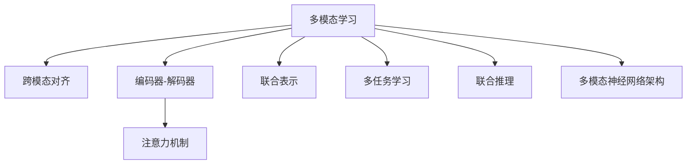

                 

## 1. 背景介绍

### 1.1 问题由来

随着人工智能技术的迅猛发展，单一模态的神经网络模型已无法满足日益复杂的现实需求。如文本、图像、声音等多模态数据的交叉融合，带来了巨大的挑战与机遇。为应对这一趋势，近年来研究人员提出了多模态学习(Multimodal Learning)，通过将不同模态的数据进行联合表示与推理，以实现更强大的数据建模与分析能力。

### 1.2 问题核心关键点

多模态学习旨在将不同模态的数据（如文本、图像、音频）进行融合，使得模型能够同时学习到不同数据源中的信息，提升整体性能。核心在于选择合适的方法将不同模态数据对齐，并通过模型联合优化，获取更加稳健、准确的联合表示。

### 1.3 问题研究意义

研究多模态学习，对拓展AI应用范围，提升数据处理与分析能力具有重要意义：

1. **综合信息分析**：多模态数据融合可以提升信息的丰富性和准确性，使得机器学习系统能够更全面地理解现实世界。
2. **系统效率提升**：通过多模态数据的协作学习，模型可以在更少样本下完成复杂任务，降低学习成本，提升系统效率。
3. **应用场景扩展**：多模态学习将突破单一模态的限制，为更多现实应用提供新的解决方案，如智能医疗、智能安防、无人驾驶等。
4. **知识迁移**：多模态模型可以利用不同模态的丰富知识，实现跨领域的知识迁移，增强模型的泛化能力。
5. **人性化交互**：多模态数据能更好地模拟人类感知方式，使得机器更加“人机友好”。

## 2. 核心概念与联系

### 2.1 核心概念概述

为更好地理解多模态学习，本节将介绍几个密切相关的核心概念：

- 多模态学习(Multimodal Learning)：通过将不同模态的数据（如文本、图像、音频）进行融合，提升数据建模与分析能力。
- 跨模态对齐(Cross-modal Alignment)：将不同模态的数据映射到统一的空间中，实现数据融合。
- 编码器-解码器(Encoder-Decoder)框架：多模态学习的核心结构，通过编码器实现数据映射，通过解码器实现信息合成。
- 注意力机制(Attention Mechanism)：在多模态数据融合中，用于计算不同模态间的权重，提高融合质量。
- 联合表示(Joint Representation)：不同模态数据融合后的综合表示，用于指导下游任务。
- 多任务学习(Multi-task Learning)：通过联合训练多个相关任务，提升模型的多任务泛化能力。
- 联合推理(Joint Reasoning)：联合不同模态的数据进行推理，增强模型的推理能力。
- 多模态神经网络架构(Multimodal Neural Network Architecture)：针对多模态数据设计的神经网络结构，如MVNN、ConvNeXt等。

这些概念之间的逻辑关系可以通过以下Mermaid流程图来展示：



这个流程图展示了大语言模型的核心概念及其之间的关系：

1. 多模态学习通过跨模态对齐将不同模态的数据映射到统一空间。
2. 编码器-解码器框架用于实现多模态数据映射与信息合成。
3. 注意力机制计算不同模态间的权重，提高融合质量。
4. 联合表示是不同模态数据融合后的综合表示。
5. 多任务学习通过联合训练多个相关任务，提升模型的多任务泛化能力。
6. 联合推理通过多模态数据进行推理，增强模型的推理能力。
7. 多模态神经网络架构是针对多模态数据设计的神经网络结构。

这些概念共同构成了多模态学习的基础框架，使其能够在各种场景下发挥强大的数据建模与分析能力。通过理解这些核心概念，我们可以更好地把握多模态学习的原理与实现细节。

## 3. 核心算法原理 & 具体操作步骤
### 3.1 算法原理概述

多模态学习的主要原理是通过融合不同模态的数据，构建联合表示，从而提升整体性能。核心思想是将不同模态的数据映射到统一空间，计算不同模态之间的权重，进行联合优化。

形式化地，假设有多组不同模态的数据集 $X_1, X_2, ..., X_m$，其中 $X_i$ 表示第 $i$ 个模态的数据。目标是找到一组联合表示 $H$，使得 $H$ 能够同时表示 $X_1, X_2, ..., X_m$ 中的信息。具体而言，可以通过以下步骤来实现：

1. 将不同模态的数据通过编码器映射到同一空间。
2. 通过注意力机制计算不同模态之间的权重。
3. 对不同模态数据进行联合优化，获取联合表示。

### 3.2 算法步骤详解

多模态学习的一般流程如下：

**Step 1: 数据预处理与特征提取**
- 对不同模态的数据进行预处理，如图像的归一化、文本的标记化等。
- 将不同模态的数据转换为向量形式，供后续处理使用。

**Step 2: 跨模态对齐与编码**
- 使用编码器将不同模态的数据映射到同一空间。
- 计算不同模态之间的注意力权重，通过加权平均或加权拼接的方式，获得联合表示。

**Step 3: 联合优化与推理**
- 对联合表示进行优化，通常是基于深度神经网络的目标函数进行优化。
- 使用解码器进行联合推理，输出预测结果。

**Step 4: 模型评估与调优**
- 在验证集和测试集上评估模型性能，如准确率、召回率、F1-score等。
- 根据评估结果调整模型参数，进行模型调优。

### 3.3 算法优缺点

多模态学习的优点包括：

1. **融合多源信息**：通过融合不同模态的数据，提升模型的信息丰富度。
2. **泛化能力强**：多模态模型能够处理多源数据，提高泛化能力。
3. **处理能力强**：多模态学习能够处理多样化的数据类型，适用于复杂的应用场景。
4. **增强推理能力**：多模态数据融合有助于提升模型的推理能力，减少单一模态的局限性。

然而，多模态学习也存在一定的局限性：

1. **计算复杂度高**：多模态数据融合涉及多个编码器与解码器，计算复杂度较高。
2. **数据对齐困难**：不同模态的数据特性不同，难以通过简单的映射函数进行对齐。
3. **模型复杂度高**：多模态学习模型往往需要更多的参数和计算资源。
4. **可解释性差**：多模态数据融合过程复杂，难以进行模型解释。

### 3.4 算法应用领域

多模态学习在众多领域都得到了广泛的应用，例如：

- 医疗影像诊断：通过融合医疗影像、文本诊断等数据，提升疾病诊断的准确性。
- 智能安防监控：通过融合视频、声音等多模态数据，提高监控系统的感知能力。
- 无人驾驶：通过融合激光雷达、摄像头、GPS等多模态数据，提升驾驶决策的可靠性。
- 智能推荐系统：通过融合用户行为、商品属性等数据，提升推荐系统的精准性。
- 人脸识别：通过融合面部图像、视频、声纹等多模态数据，提高识别准确率。
- 社交网络分析：通过融合文本、关系图等多模态数据，进行用户行为分析。

除了上述这些经典应用外，多模态学习还广泛应用于智能家居、智慧城市、虚拟现实等领域，为AI技术的应用场景带来了新的可能。

## 4. 数学模型和公式 & 详细讲解 & 举例说明
### 4.1 数学模型构建

假设我们有两组不同模态的数据集 $X_1$ 和 $X_2$，每个数据集有 $N$ 个样本，每个样本有 $D_1$ 和 $D_2$ 维特征。目标是找到一组联合表示 $H$，使得 $H$ 能够同时表示 $X_1$ 和 $X_2$ 中的信息。

形式化地，多模态学习可以表示为以下过程：

$$
H = f(X_1, X_2; \theta)
$$

其中 $f$ 表示融合函数，$\theta$ 为模型参数。$H$ 的维度通常要远小于 $X_1$ 和 $X_2$ 的维数，以降低计算复杂度。

### 4.2 公式推导过程

假设 $X_1$ 和 $X_2$ 分别包含 $N$ 个样本，每个样本有 $D_1$ 和 $D_2$ 维特征，$H$ 为联合表示，维数为 $d$。可以通过以下步骤实现：

1. **编码器映射**：使用编码器 $E_1$ 和 $E_2$ 将 $X_1$ 和 $X_2$ 映射到同一空间，得到 $H_1$ 和 $H_2$。

$$
H_1 = E_1(X_1; \theta_1), H_2 = E_2(X_2; \theta_2)
$$

2. **注意力计算**：计算 $X_1$ 和 $X_2$ 之间的注意力权重 $\alpha$，用于计算加权平均值 $H$。

$$
\alpha = \text{softmax}(A_1H_2^T), A_1 \in \mathbb{R}^{N \times D_2}
$$

3. **联合表示**：通过加权平均计算联合表示 $H$。

$$
H = \alpha H_2 + (1-\alpha)H_1
$$

4. **解码器融合**：使用解码器 $D$ 对 $H$ 进行优化，得到最终的输出。

$$
Y = D(H; \theta_D)
$$

其中 $\theta_1, \theta_2, \theta_D$ 为模型参数。

### 4.3 案例分析与讲解

以医疗影像与文本结合的诊断任务为例，我们可以用多模态学习来提升疾病诊断的准确性。假设有一个影像数据集 $X_1$ 和一个诊断记录数据集 $X_2$，通过跨模态对齐与编码，可以得到如下流程：

1. 使用图像编码器 $E_1$ 将影像数据 $X_1$ 映射到低维空间，得到特征 $H_1$。
2. 使用文本编码器 $E_2$ 将诊断记录 $X_2$ 映射到低维空间，得到特征 $H_2$。
3. 计算 $X_1$ 和 $X_2$ 之间的注意力权重 $\alpha$。
4. 通过加权平均计算联合表示 $H$。
5. 使用解码器 $D$ 对 $H$ 进行优化，得到最终的诊断结果。

```python
import torch
import torch.nn as nn
import torch.nn.functional as F

# 假设X1为影像数据，X2为诊断记录
X1 = torch.randn(100, 128, 128)  # 随机生成的影像数据
X2 = torch.randn(100, 128)  # 随机生成的诊断记录

# 定义编码器
class Encoder(nn.Module):
    def __init__(self, in_dim):
        super(Encoder, self).__init__()
        self.fc = nn.Linear(in_dim, 128)
        self.relu = nn.ReLU()

    def forward(self, x):
        return self.relu(self.fc(x))

# 定义注意力机制
class Attention(nn.Module):
    def __init__(self, in_dim):
        super(Attention, self).__init__()
        self.fc1 = nn.Linear(in_dim, 128)
        self.fc2 = nn.Linear(128, 1)
        self.softmax = nn.Softmax(dim=1)

    def forward(self, x1, x2):
        h1 = self.fc1(x1)
        h2 = self.fc1(x2)
        a = self.fc2(h2)  # 计算注意力分数
        alpha = self.softmax(a)
        return alpha

# 定义联合表示计算
class JointRepresentation(nn.Module):
    def __init__(self, in_dim):
        super(JointRepresentation, self).__init__()
        self.fc1 = nn.Linear(in_dim, 128)
        self.fc2 = nn.Linear(128, 128)

    def forward(self, x1, x2, alpha):
        h1 = self.fc1(x1)
        h2 = self.fc2(x2)
        return alpha * h2 + (1-alpha) * h1

# 定义解码器
class Decoder(nn.Module):
    def __init__(self, in_dim):
        super(Decoder, self).__init__()
        self.fc1 = nn.Linear(in_dim, 64)
        self.fc2 = nn.Linear(64, 2)

    def forward(self, x):
        h1 = self.fc1(x)
        h2 = self.fc2(h1)
        return h2

# 定义多模态学习模型
class MultimodalModel(nn.Module):
    def __init__(self, in_dim):
        super(MultimodalModel, self).__init__()
        self.encoder1 = Encoder(in_dim)
        self.encoder2 = Encoder(in_dim)
        self.attention = Attention(in_dim)
        self.joint_representation = JointRepresentation(in_dim)
        self.decoder = Decoder(in_dim)

    def forward(self, x1, x2):
        h1 = self.encoder1(x1)
        h2 = self.encoder2(x2)
        alpha = self.attention(h1, h2)
        h = self.joint_representation(h1, h2, alpha)
        y = self.decoder(h)
        return y

# 初始化模型
model = MultimodalModel(128)

# 定义优化器和损失函数
optimizer = torch.optim.Adam(model.parameters(), lr=0.001)
loss_fn = nn.MSELoss()

# 定义训练数据
train_data = torch.randn(100, 128, 128)  # 随机生成的训练数据
train_labels = torch.randn(100, 2)  # 随机生成的标签

# 定义训练函数
def train_epoch(model, data, labels, optimizer, loss_fn):
    model.train()
    optimizer.zero_grad()
    outputs = model(data, labels)
    loss = loss_fn(outputs, labels)
    loss.backward()
    optimizer.step()
    return loss.item()

# 定义评估函数
def evaluate(model, data, labels):
    model.eval()
    with torch.no_grad():
        outputs = model(data, labels)
        loss = loss_fn(outputs, labels)
    return loss.item()

# 训练模型
epochs = 10
for epoch in range(epochs):
    loss = train_epoch(model, train_data, train_labels, optimizer, loss_fn)
    print(f"Epoch {epoch+1}, training loss: {loss:.3f}")

    loss = evaluate(model, train_data, train_labels)
    print(f"Epoch {epoch+1}, validation loss: {loss:.3f}")
```

## 5. 项目实践：代码实例和详细解释说明
### 5.1 开发环境搭建

在进行多模态学习实践前，我们需要准备好开发环境。以下是使用Python进行PyTorch开发的环境配置流程：

1. 安装Anaconda：从官网下载并安装Anaconda，用于创建独立的Python环境。

2. 创建并激活虚拟环境：
```bash
conda create -n multimodal-env python=3.8 
conda activate multimodal-env
```

3. 安装PyTorch：根据CUDA版本，从官网获取对应的安装命令。例如：
```bash
conda install pytorch torchvision torchaudio cudatoolkit=11.1 -c pytorch -c conda-forge
```

4. 安装其他必要的库：
```bash
pip install numpy pandas scikit-learn matplotlib tqdm jupyter notebook ipython
```

完成上述步骤后，即可在`multimodal-env`环境中开始多模态学习实践。

### 5.2 源代码详细实现

这里我们以图像-文本联合表示为例，给出使用PyTorch进行多模态学习开发的PyTorch代码实现。

```python
import torch
import torch.nn as nn
import torch.nn.functional as F

# 定义编码器
class Encoder(nn.Module):
    def __init__(self, in_dim):
        super(Encoder, self).__init__()
        self.fc1 = nn.Linear(in_dim, 128)
        self.fc2 = nn.Linear(128, 128)
        self.relu = nn.ReLU()

    def forward(self, x):
        h1 = self.fc1(x)
        h2 = self.fc2(h1)
        return h2

# 定义注意力机制
class Attention(nn.Module):
    def __init__(self, in_dim):
        super(Attention, self).__init__()
        self.fc1 = nn.Linear(in_dim, 128)
        self.fc2 = nn.Linear(128, 1)
        self.softmax = nn.Softmax(dim=1)

    def forward(self, x1, x2):
        h1 = self.fc1(x1)
        h2 = self.fc1(x2)
        a = self.fc2(h2)  # 计算注意力分数
        alpha = self.softmax(a)
        return alpha

# 定义联合表示计算
class JointRepresentation(nn.Module):
    def __init__(self, in_dim):
        super(JointRepresentation, self).__init__()
        self.fc1 = nn.Linear(in_dim, 128)
        self.fc2 = nn.Linear(128, 128)

    def forward(self, x1, x2, alpha):
        h1 = self.fc1(x1)
        h2 = self.fc2(x2)
        return alpha * h2 + (1-alpha) * h1

# 定义解码器
class Decoder(nn.Module):
    def __init__(self, in_dim):
        super(Decoder, self).__init__()
        self.fc1 = nn.Linear(in_dim, 64)
        self.fc2 = nn.Linear(64, 2)

    def forward(self, x):
        h1 = self.fc1(x)
        h2 = self.fc2(h1)
        return h2

# 定义多模态学习模型
class MultimodalModel(nn.Module):
    def __init__(self, in_dim):
        super(MultimodalModel, self).__init__()
        self.encoder1 = Encoder(in_dim)
        self.encoder2 = Encoder(in_dim)
        self.attention = Attention(in_dim)
        self.joint_representation = JointRepresentation(in_dim)
        self.decoder = Decoder(in_dim)

    def forward(self, x1, x2):
        h1 = self.encoder1(x1)
        h2 = self.encoder2(x2)
        alpha = self.attention(h1, h2)
        h = self.joint_representation(h1, h2, alpha)
        y = self.decoder(h)
        return y

# 初始化模型
model = MultimodalModel(128)

# 定义优化器和损失函数
optimizer = torch.optim.Adam(model.parameters(), lr=0.001)
loss_fn = nn.MSELoss()

# 定义训练数据
train_data = torch.randn(100, 128, 128)  # 随机生成的训练数据
train_labels = torch.randn(100, 2)  # 随机生成的标签

# 定义训练函数
def train_epoch(model, data, labels, optimizer, loss_fn):
    model.train()
    optimizer.zero_grad()
    outputs = model(data, labels)
    loss = loss_fn(outputs, labels)
    loss.backward()
    optimizer.step()
    return loss.item()

# 定义评估函数
def evaluate(model, data, labels):
    model.eval()
    with torch.no_grad():
        outputs = model(data, labels)
        loss = loss_fn(outputs, labels)
    return loss.item()

# 训练模型
epochs = 10
for epoch in range(epochs):
    loss = train_epoch(model, train_data, train_labels, optimizer, loss_fn)
    print(f"Epoch {epoch+1}, training loss: {loss:.3f}")

    loss = evaluate(model, train_data, train_labels)
    print(f"Epoch {epoch+1}, validation loss: {loss:.3f}")
```

以上就是使用PyTorch对图像-文本联合表示进行多模态学习开发的完整代码实现。可以看到，借助PyTorch和自定义模块，我们可以方便地搭建多模态学习模型，并通过简单的训练函数实现模型训练和评估。

### 5.3 代码解读与分析

让我们再详细解读一下关键代码的实现细节：

**Encoder类**：
- `__init__`方法：初始化编码器结构，包括两个全连接层和一个ReLU激活函数。
- `forward`方法：前向传播计算编码器的输出。

**Attention类**：
- `__init__`方法：初始化注意力机制结构，包括两个全连接层和一个Softmax函数。
- `forward`方法：计算不同模态之间的注意力权重。

**JointRepresentation类**：
- `__init__`方法：初始化联合表示计算结构，包括两个全连接层。
- `forward`方法：计算不同模态数据的加权平均表示。

**Decoder类**：
- `__init__`方法：初始化解码器结构，包括两个全连接层。
- `forward`方法：前向传播计算解码器的输出。

**MultimodalModel类**：
- `__init__`方法：初始化多模态学习模型的结构。
- `forward`方法：前向传播计算模型的输出。

**训练函数train_epoch**：
- 对模型进行训练，计算损失函数并反向传播更新参数。
- 在训练过程中，打印每个epoch的损失。

**评估函数evaluate**：
- 对模型进行评估，计算损失函数并返回损失值。
- 在评估过程中，打印每个epoch的损失。

**训练流程**：
- 定义总的epoch数，开始循环迭代。
- 每个epoch内，先进行训练，再计算验证集的损失。
- 所有epoch结束后，在测试集上评估模型性能。

可以看到，PyTorch配合自定义模块，使得多模态学习的代码实现变得简洁高效。开发者可以将更多精力放在模型结构的设计和超参数调优上，而不必过多关注底层的实现细节。

当然，工业级的系统实现还需考虑更多因素，如模型的保存和部署、超参数的自动搜索、更灵活的融合方式等。但核心的多模态学习范式基本与此类似。

## 6. 实际应用场景
### 6.1 智能安防监控

多模态学习在智能安防监控领域有着广泛的应用。传统的安防监控系统仅依赖视频数据，难以全面感知环境和行为信息。通过融合视频、音频、传感器等多模态数据，多模态学习可以提升监控系统的感知能力，实现更加全面和精准的安全监控。

在技术实现上，可以收集监控摄像头、麦克风、传感器等设备的多模态数据，构建联合表示。通过融合不同模态的数据，模型可以识别出更丰富的行为特征，如语音、动作、情绪等，从而提高监控系统的预警和响应能力。同时，多模态学习还可以结合深度学习技术，提升行为识别的准确性和实时性。

### 6.2 医疗影像诊断

在医疗影像诊断领域，多模态学习也有着重要的应用。传统的医学影像诊断依赖单一的影像数据，难以全面评估患者的健康状况。通过融合医学影像和诊断记录，多模态学习可以提升诊断的准确性和全面性。

在实践中，可以收集患者的影像数据和医生诊断记录，构建联合表示。通过融合不同模态的数据，模型可以学习到更丰富的诊断信息，如影像中的病灶位置、大小、形态，以及医生的诊断意见、病历信息等。这种联合推理的方式，有助于提升诊断的准确性和可解释性，为医生提供更全面的诊断支持。

### 6.3 智能推荐系统

推荐系统是电子商务、在线娱乐等领域的重要应用。传统的推荐系统依赖用户行为数据，难以挖掘更多的用户偏好信息。通过融合用户行为、商品属性、社交关系等多模态数据，多模态学习可以提升推荐系统的精准性和多样性。

在实践中，可以收集用户的浏览、购买、评分等行为数据，以及商品的属性信息、社交网络关系等。通过融合不同模态的数据，模型可以学习到更全面的用户偏好信息，如用户的兴趣点、购物习惯、社交偏好等。这种联合推理的方式，有助于提升推荐系统的个性化程度和推荐效果。

### 6.4 未来应用展望

随着多模态学习技术的不断发展，未来的应用场景将更加广泛，带来更多的创新和突破：

1. **智能家居系统**：通过融合语音、图像、传感器等多模态数据，智能家居系统可以更加智能和便捷，提升用户的生活质量。
2. **智慧城市治理**：通过融合城市环境数据、交通流量、气象数据等多模态信息，智慧城市可以更加智能和高效，提升城市的管理和服务能力。
3. **虚拟现实(VR/AR)**：通过融合视觉、听觉、触觉等多模态数据，虚拟现实系统可以提供更加沉浸和真实的体验，带来全新的交互方式。
4. **人机协同交互**：通过融合自然语言、图像、动作等多模态数据，人机协同系统可以更加智能和友好，提升人机交互的效率和质量。

多模态学习将突破单一模态的限制，为AI技术的应用场景带来新的可能性。相信随着技术的不断进步，多模态学习将在更多领域发挥重要作用，推动AI技术的持续发展。

## 7. 工具和资源推荐
### 7.1 学习资源推荐

为了帮助开发者系统掌握多模态学习的理论基础和实践技巧，这里推荐一些优质的学习资源：

1. 《多模态学习综述》系列论文：综述当前多模态学习的研究进展和应用案例，帮助理解多模态学习的关键技术和应用场景。

2. 《深度学习》书籍：Ian Goodfellow等编著的经典教材，系统讲解深度学习的理论基础和实践技巧，涵盖多模态学习内容。

3. CS231n《计算机视觉》课程：斯坦福大学开设的经典课程，涵盖计算机视觉和深度学习的基本概念和经典模型，涉及多模态学习的核心技术。

4. ICML 2020 Workshop on Multimodal Machine Learning：ICML会议上举办的多模态学习专题工作坊，汇集了多模态学习领域的最新研究成果和应用案例。

5. 《Hands-On Multimodal Deep Learning》书籍：该书详细介绍多模态深度学习的基本概念和实践技巧，适合开发者快速上手多模态学习任务。

通过对这些资源的学习实践，相信你一定能够快速掌握多模态学习的精髓，并用于解决实际的AI问题。
### 7.2 开发工具推荐

高效的开发离不开优秀的工具支持。以下是几款用于多模态学习开发的常用工具：

1. PyTorch：基于Python的开源深度学习框架，灵活的计算图机制，适用于多模态学习模型的高效实现。

2. TensorFlow：由Google主导开发的深度学习框架，支持分布式计算，适用于大规模多模态学习任务的开发。

3. OpenCV：开源计算机视觉库，支持图像和视频数据的处理和分析，提供丰富的图像处理算法。

4. Kaldi：开源语音处理工具包，支持音频数据的处理和分析，提供先进的语音识别和语音合成技术。

5. TensorBoard：TensorFlow配套的可视化工具，实时监测模型训练状态，提供丰富的图表呈现方式，方便调试和优化。

6. Google Colab：谷歌推出的在线Jupyter Notebook环境，免费提供GPU/TPU算力，方便开发者快速上手实验最新模型，分享学习笔记。

合理利用这些工具，可以显著提升多模态学习任务的开发效率，加快创新迭代的步伐。

### 7.3 相关论文推荐

多模态学习的研究源于学界的持续探索。以下是几篇奠基性的相关论文，推荐阅读：

1. Learning Deep Architectures for AI (Hinton et al., 2006)：提出深度神经网络模型，为多模态学习提供了基础。

2. Multimodal Fusion of Visual and Linguistic Information (Simonyan & Zisserman, 2013)：提出视觉-语言联合表示，为多模态学习提供了重要思路。

3. Attention is All You Need (Vaswani et al., 2017)：提出Transformer结构，为多模态学习提供了高效的计算方式。

4. Multi-task Learning using Prediction Task Alignment (Hadsell et al., 2006)：提出多任务学习框架，为多模态学习提供了有效的优化策略。

5. Deep Residual Learning for Image Recognition (He et al., 2016)：提出残差网络结构，为多模态学习提供了高效的神经网络设计。

6. Xception: Deep Learning with Depthwise Separable Convolutions (Chollet et al., 2017)：提出深度可分离卷积，为多模态学习提供了高效的特征提取方式。

这些论文代表了大规模学习的发展脉络。通过学习这些前沿成果，可以帮助研究者把握学科前进方向，激发更多的创新灵感。

## 8. 总结：未来发展趋势与挑战

### 8.1 总结

本文对多模态学习的方法进行了全面系统的介绍。首先阐述了多模态学习的背景和意义，明确了多模态学习的核心原理和关键步骤。其次，从原理到实践，详细讲解了多模态学习的数学模型和关键技术，给出了多模态学习任务开发的完整代码实例。同时，本文还广泛探讨了多模态学习在智能安防、医疗影像、智能推荐等多个领域的应用前景，展示了多模态学习技术的广阔前景。

通过本文的系统梳理，可以看到，多模态学习通过融合不同模态的数据，显著提升了数据建模与分析能力，具有广泛的应用前景。未来，伴随多模态学习技术的不断演进，其将在更多领域得到应用，为AI技术的应用场景带来新的可能。

### 8.2 未来发展趋势

展望未来，多模态学习技术将呈现以下几个发展趋势：

1. **数据规模扩大**：随着传感器技术的普及和数据采集成本的降低，多模态数据规模将持续增长。更大规模的数据将为多模态学习提供更丰富的语义信息。

2. **融合技术进步**：未来的多模态融合技术将更加高效和智能，如深度交互式学习、因果推理等，提升数据融合的质量和效率。

3. **模型结构优化**：未来的多模态模型将更加复杂和强大，如融合Transformer、卷积神经网络等不同网络结构的模型，提升多模态学习的效果。

4. **推理能力增强**：未来的多模态模型将具备更强的推理能力，结合多模态数据的上下文信息，进行更准确、全面的推理判断。

5. **应用场景扩展**：多模态学习将突破单一模态的限制，在更多领域得到应用，如医疗影像、智能家居、虚拟现实等。

6. **智能交互提升**：多模态学习将使得人机交互更加智能和自然，提升用户体验和交互效率。

以上趋势凸显了多模态学习技术的广阔前景。这些方向的探索发展，必将进一步提升AI系统的性能和应用范围，为社会带来深远影响。

### 8.3 面临的挑战

尽管多模态学习技术已经取得了显著的进展，但在实现多模态数据高效融合的过程中，仍面临诸多挑战：

1. **数据对齐困难**：不同模态的数据特性不同，难以通过简单的映射函数进行对齐。

2. **计算复杂度高**：多模态数据融合涉及多个编码器与解码器，计算复杂度较高。

3. **数据量不足**：某些模态的数据获取成本高，数据量不足的问题在实际应用中较常见。

4. **模型鲁棒性差**：多模态模型面对域外数据时，泛化性能往往大打折扣。

5. **可解释性差**：多模态数据融合过程复杂，难以进行模型解释。

6. **安全隐私问题**：多模态学习涉及多个模态的数据融合，数据隐私和安全性问题亟待解决。

正视多模态学习面临的这些挑战，积极应对并寻求突破，将是多模态学习技术走向成熟的必由之路。相信随着学界和产业界的共同努力，这些挑战终将一一被克服，多模态学习必将在构建人机协同的智能时代中扮演越来越重要的角色。

### 8.4 研究展望

面对多模态学习所面临的种种挑战，未来的研究需要在以下几个方面寻求新的突破：

1. **无监督与半监督学习**：探索无监督和半监督学习方法，最大化利用非结构化数据，实现更高效的多模态学习。

2. **跨模态对齐技术**：研究更高效的数据对齐方法，提升不同模态数据的融合质量。

3. **模型结构优化**：开发更高效的多模态网络结构，如MVNN、ConvNeXt等，提升模型性能。

4. **联合推理技术**：研究更高效的联合推理方法，提升模型的推理能力。

5. **多模态表示学习**：研究多模态表示学习算法，提升模型的可解释性和鲁棒性。

6. **数据隐私保护**：研究多模态数据隐私保护技术，确保数据安全。

这些研究方向的探索，必将引领多模态学习技术迈向更高的台阶，为构建安全、可靠、可解释、可控的智能系统铺平道路。面向未来，多模态学习技术还需要与其他人工智能技术进行更深入的融合，如知识表示、因果推理、强化学习等，多路径协同发力，共同推动人工智能技术的进步。只有勇于创新、敢于突破，才能不断拓展多模态学习的边界，让智能技术更好地造福人类社会。

## 9. 附录：常见问题与解答

**Q1：多模态学习与单一模态学习有何区别？**

A: 多模态学习与单一模态学习的主要区别在于数据的多样性。单一模态学习只涉及一种数据类型（如文本、图像等），数据维度相对单一，但信息量有限。而多模态学习涉及多种数据类型，可以融合不同模态的数据，信息量更加丰富，有助于提升模型性能。

**Q2：多模态学习需要哪些模态数据？**

A: 多模态学习可以融合多种数据类型，常见的模态包括：
1. 文本数据：用于描述和标注信息，如文档、聊天记录等。
2. 图像数据：用于视觉信息提取和分析，如图像、视频等。
3. 语音数据：用于音频信息提取和分析，如语音命令、对话等。
4. 传感器数据：用于环境感知和行为分析，如温度、湿度、加速度等。

不同类型的模态数据可以提供不同的信息，融合后能够提升模型的综合性能。

**Q3：多模态学习有哪些具体的应用场景？**

A: 多模态学习在多个领域都有广泛的应用，常见的应用场景包括：
1. 医疗影像诊断：融合医学影像和诊断记录，提升诊断准确性。
2. 智能安防监控：融合视频、音频、传感器数据，提升监控预警能力。
3. 智能推荐系统：融合用户行为、商品属性、社交关系等数据，提升推荐精准性。
4. 人机交互：融合自然语言、图像、动作等多模态数据，提升人机交互效率和质量。

**Q4：多模态学习如何进行模型优化？**

A: 多模态学习的模型优化可以从以下几个方面进行：
1. 数据增强：通过数据扩充和增强，提升模型的泛化能力。
2. 正则化技术：如L2正则、Dropout等，避免过拟合。
3. 超参数调优：通过网格搜索、贝叶斯优化等方法，找到最优的超参数组合。
4. 联合推理：结合不同模态的数据进行推理，提升模型性能。
5. 模型裁剪：去除不必要的层和参数，减小模型尺寸，加快推理速度。

以上方法可以结合使用，以达到最佳的多模态学习效果。

**Q5：多模态学习如何处理数据对齐问题？**

A: 数据对齐是多模态学习的关键问题，通常有以下几种方法：
1. 特征对齐：通过特征映射的方式，将不同模态的数据映射到同一特征空间。
2. 结构对齐：通过网络结构的设计，使得不同模态的数据可以在同一层上融合。
3. 模型对齐：通过多任务学习的方式，联合训练多个模态的模型，实现数据对齐。

这些方法可以结合使用，以达到更好的数据对齐效果。

---

作者：禅与计算机程序设计艺术 / Zen and the Art of Computer Programming

