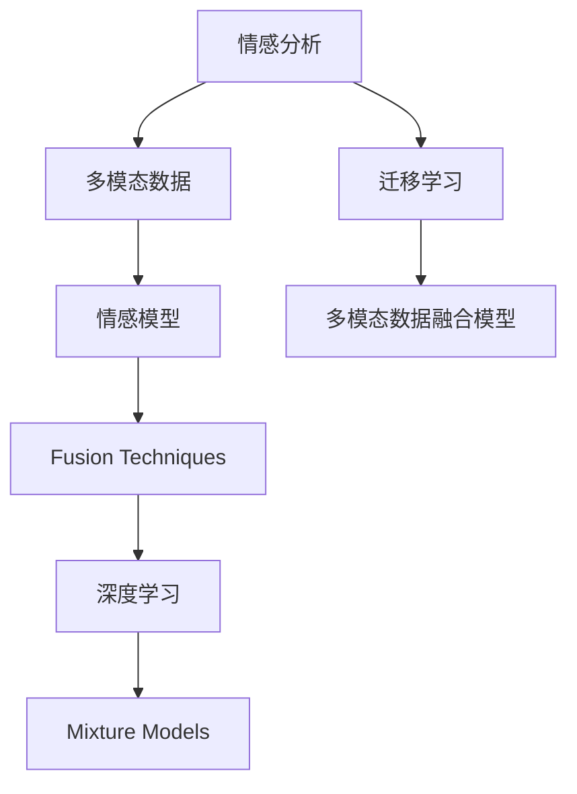

                 

# 多模态情感分析技术的发展与挑战

> 关键词：情感分析, 多模态数据, 自然语言处理, 语音分析, 图像分析, 深度学习, 模型融合

## 1. 背景介绍

### 1.1 问题由来
在当今数字化社会，情感分析（Sentiment Analysis）作为自然语言处理（NLP）领域的重要分支，在社交媒体监测、产品评价分析、市场营销策略制定等领域具有广泛应用。传统情感分析通常只依赖文本数据进行，但由于多媒体数据的普遍存在，多模态情感分析（Multi-modal Sentiment Analysis）逐渐成为热点，能够融合文本、图像、音频等多模态数据，提供更全面、准确的情感信息。

### 1.2 问题核心关键点
多模态情感分析的核心挑战在于如何有效融合多种数据模态，并提取其中的情感信息。主要问题点包括：

- **多模态数据的表示学习**：如何表示和融合来自不同数据源的信息。
- **情感信息的抽取与建模**：如何在多种数据形式中识别和提取情感信息。
- **模型性能的提升**：如何构建高性能的多模态情感分析模型。
- **实际应用的部署与优化**：如何将模型应用到实际场景中，并优化性能。

### 1.3 问题研究意义
多模态情感分析技术的发展不仅提升了情感分析的准确性和全面性，还为各行业决策提供坚实的数据基础。其研究意义主要体现在：

1. **更全面的情感理解**：结合多模态数据，能够更全面地理解情感的变化和细微差异。
2. **数据驱动的决策支持**：为商业策略、产品改进等决策提供数据支撑，提升用户体验。
3. **安全与隐私保护**：在保护用户隐私的前提下，实现情感数据的深度分析。
4. **跨领域的应用拓展**：情感分析技术在医疗、教育、公共安全等多个领域的潜在应用价值。

## 2. 核心概念与联系

### 2.1 核心概念概述

为更好地理解多模态情感分析技术，本节将介绍几个核心概念：

- **情感分析（Sentiment Analysis）**：分析文本、图像、音频等数据中的情感信息，判断其情感倾向。
- **多模态数据（Multi-modal Data）**：包括文本、图像、语音等多种形式的数据。
- **情感模型（Sentiment Models）**：用于抽取和建模情感信息的模型，包括文本情感模型、图像情感模型、语音情感模型等。
- **融合技术（Fusion Techniques）**：将多种模态数据进行融合的技术，包括特征提取、特征匹配、特征融合等。
- **深度学习（Deep Learning）**：一种通过多层神经网络进行数据学习和模型训练的技术，适合多模态数据的复杂特征提取。
- **迁移学习（Transfer Learning）**：利用预训练模型在特定任务上的微调，提高模型性能。
- **多模态数据融合模型（Multi-modal Fusion Models）**：集成多种数据模态，实现全面的情感分析。

这些概念之间的逻辑关系可以通过以下Mermaid流程图来展示：

这个流程图展示了大规模情感分析的核心概念及其之间的关系：

1. 情感分析依赖于多模态数据的输入。
2. 多种情感模型用于抽取和建模不同形式的数据中的情感信息。
3. 融合技术将不同数据源的信息整合，生成统一的情感表示。
4. 深度学习用于复杂特征的提取和建模。
5. 混合模型结合了多种融合技术，构建高性能的多模态情感分析模型。
6. 迁移学习用于提升特定任务的模型性能。

这些概念共同构成了多模态情感分析的核心框架，使其能够在各种场景下提供更准确、全面的情感分析服务。

## 3. 核心算法原理 & 具体操作步骤
### 3.1 算法原理概述

多模态情感分析的核心算法原理在于将不同模态的数据进行表示学习，并综合其情感信息。

- **文本情感分析**：使用LSTM、GRU等RNN或Transformer模型，通过语义理解提取文本中的情感信息。
- **图像情感分析**：通过卷积神经网络（CNN）等模型，提取图像中的情感线索，如面部表情、姿态、颜色等。
- **语音情感分析**：利用音频特征提取和声学模型，提取语音中的情感特征。
- **多模态数据融合**：通过特征提取和匹配技术，将不同模态的数据进行整合，生成统一的情感表示。

最终，通过多模态融合模型，综合考虑所有数据模态，生成更全面的情感分析结果。

### 3.2 算法步骤详解

以下是多模态情感分析的一般步骤：

**Step 1: 数据收集与预处理**
- 收集文本、图像、音频等多种形式的数据。
- 清洗和标准化数据，如去除噪声、归一化等。
- 将不同数据源的数据转化为统一的表示形式。

**Step 2: 多模态表示学习**
- 使用文本情感模型提取文本中的情感信息。
- 使用图像情感模型提取图像中的情感特征。
- 使用语音情感模型提取语音中的情感信息。
- 使用深度学习模型对不同数据模态进行表示学习，生成统一的特征表示。

**Step 3: 多模态数据融合**
- 使用融合技术将不同模态的特征进行匹配和整合。
- 使用机器学习模型对融合后的特征进行建模。
- 对模型进行训练和调优，提升情感分析的准确性。

**Step 4: 模型评估与优化**
- 使用验证集对模型进行评估，调整超参数和模型结构。
- 在测试集上测试模型性能，并进行实际应用部署。
- 持续收集数据，更新模型以适应新的数据分布。

### 3.3 算法优缺点

多模态情感分析技术具有以下优点：

1. **全面性**：结合多模态数据，能够更全面地理解情感的变化和细微差异。
2. **准确性**：通过多种数据模态的融合，提升情感分析的准确性和鲁棒性。
3. **泛化能力**：模型能够更好地泛化到新的数据和场景。

同时，该方法也存在以下局限性：

1. **数据需求大**：需要收集和处理多种形式的数据，数据获取和预处理成本较高。
2. **模型复杂**：多模态数据融合和建模技术复杂，模型训练和优化难度大。
3. **计算资源需求高**：需要高性能的计算设备，资源消耗较大。
4. **数据异构性**：不同数据模态的表示学习可能存在差异，导致数据不一致性。

尽管如此，多模态情感分析在提升情感分析准确性和全面性方面具有显著优势，特别是在需要全面了解用户情感的场景中具有重要应用价值。

### 3.4 算法应用领域

多模态情感分析技术在多个领域具有广泛应用，例如：

- **社交媒体情感分析**：分析社交媒体上的用户评论、帖子等，了解公众情绪。
- **产品评价分析**：分析用户对产品的评价文本、图像、视频等，评估产品满意度。
- **市场营销策略制定**：分析市场调研数据、社交媒体评论等，优化市场营销策略。
- **医疗情感分析**：分析患者反馈、医疗影像等，了解患者的情感状态和疾病影响。
- **智能客服系统**：通过情感分析提升客户服务质量，及时响应客户需求。
- **公共安全监控**：分析社交媒体、公共场所视频等数据，识别公共情绪和异常行为。

## 4. 数学模型和公式 & 详细讲解 & 举例说明

### 4.1 数学模型构建

假设我们收集到的多模态数据为 $X=(X_t, X_i, X_v)$，其中 $X_t$ 表示文本数据，$X_i$ 表示图像数据，$X_v$ 表示语音数据。使用文本情感模型 $M_t$、图像情感模型 $M_i$、语音情感模型 $M_v$ 分别对不同模态的数据进行情感提取，得到文本情感表示 $E_t$、图像情感表示 $E_i$、语音情感表示 $E_v$。

**多模态融合模型** $M_{fus}$ 将三种情感表示融合为一个综合的情感表示 $E$。常用的融合方式包括：

- **加权平均**：基于各模态的权重对情感表示进行加权平均。
- **逐层融合**：逐层融合多种情感表示，生成更高层次的情感表示。
- **深度集成**：使用深度学习模型对不同模态的情感表示进行集成。

**情感分析模型** $M_{s}$ 对综合的情感表示 $E$ 进行分类，得到最终的情感标签 $Y$。常用的分类模型包括：

- **逻辑回归**：用于二分类任务。
- **支持向量机（SVM）**：适用于分类任务。
- **神经网络**：包括全连接神经网络、卷积神经网络、循环神经网络等。

### 4.2 公式推导过程

以下以加权平均融合方式为例，展示多模态情感分析的数学模型：

设文本情感表示 $E_t$、图像情感表示 $E_i$、语音情感表示 $E_v$ 的权重分别为 $w_t$、$w_i$、$w_v$，则加权平均融合公式为：

$$
E = w_t E_t + w_i E_i + w_v E_v
$$

其中 $w_t$、$w_i$、$w_v$ 可以通过数据集训练得到，通常满足 $w_t + w_i + w_v = 1$。

情感分析模型的训练目标是最小化分类损失函数：

$$
L(M_s, Y) = -\frac{1}{N} \sum_{i=1}^N \log M_s(E)
$$

其中 $M_s(E)$ 为情感分析模型对情感表示 $E$ 的预测结果。

### 4.3 案例分析与讲解

以社交媒体情感分析为例，分析如何使用多模态情感分析技术提取用户的情感信息。

**数据收集**：收集用户在社交媒体上的帖子、评论、图片等数据。

**文本情感分析**：使用LSTM模型对文本数据进行情感分析，生成文本情感表示 $E_t$。

**图像情感分析**：使用卷积神经网络对图像数据进行情感分析，生成图像情感表示 $E_i$。

**语音情感分析**：使用声学模型对语音数据进行情感分析，生成语音情感表示 $E_v$。

**多模态融合**：使用加权平均融合方式对三种情感表示进行整合，得到综合情感表示 $E$。

**情感分类**：使用逻辑回归模型对综合情感表示 $E$ 进行分类，得到最终情感标签 $Y$。

## 5. 项目实践：代码实例和详细解释说明

### 5.1 开发环境搭建

在进行多模态情感分析的实践开发前，需要先准备好开发环境。以下是使用Python进行PyTorch开发的环

