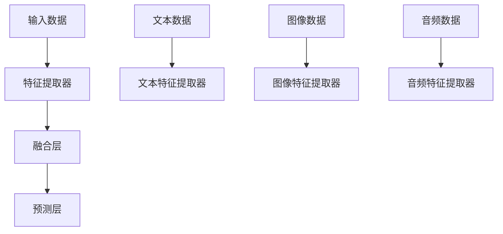
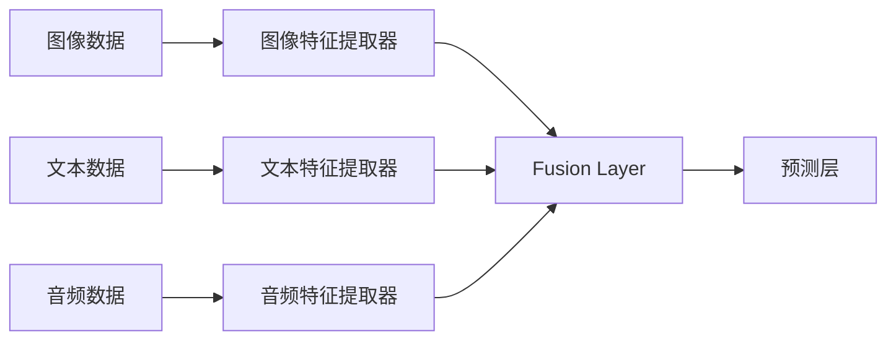

                 

## 1. 背景介绍

随着人工智能技术的发展，多模态学习成为热点话题，特别是近年来深度学习的发展使得多模态模型能够处理视觉、听觉、文本等多种类型的数据，大大拓展了AI应用的范围。通过多模态学习，可以从更丰富的视角理解现实世界，提升智能系统的性能。本文将对多模态模型及其在AI应用中的应用进行详细阐述。

## 2. 核心概念与联系

### 2.1 核心概念概述

多模态模型指的是能够同时处理多种类型数据（如文本、图像、音频等）的深度学习模型。这类模型可以整合来自不同模态的信息，进行更全面的学习和推理，广泛应用于计算机视觉、自然语言处理、语音识别、机器人等领域。

以下图展示了多模态模型处理不同类型数据的基本流程：



该图展示了不同类型的数据分别经过相应的特征提取器后，被输入到融合层进行多模态融合。最终，经过预测层的输出得到最终的预测结果。

### 2.2 核心概念原理和架构的 Mermaid 流程图

以下是基于视觉、文本和语音三种模态数据的融合过程的Mermaid流程图：



该图展示了三种模态数据分别通过对应的特征提取器进行处理，然后在融合层中整合，最终进入预测层进行预测。

## 3. 核心算法原理 & 具体操作步骤

### 3.1 算法原理概述

多模态模型的基本原理是将不同模态的数据通过各自的特征提取器进行编码，然后通过融合层将不同模态的信息进行整合。常用的融合方法包括拼接（Concatenation）、注意力机制（Attention）、时序池化（Temporal Pooling）等。最终的输出结果将通过预测层进行分类、回归或其他类型的预测。

### 3.2 算法步骤详解

1. **数据预处理**：对不同模态的数据进行预处理，如文本数据的分词、图像数据的归一化、音频数据的MFCC提取等。

2. **特征提取**：分别对不同模态的数据进行特征提取，得到各自的特征向量。这一步可以使用不同的模型，如CNN用于图像特征提取，RNN用于文本特征提取，DNN用于音频特征提取等。

3. **多模态融合**：通过融合层将不同模态的特征向量进行整合，生成新的特征表示。常用的融合方法包括拼接、注意力机制和时序池化等。

4. **预测层输出**：将融合后的特征表示输入到预测层进行分类、回归或其他类型的预测。

5. **模型训练**：使用标注数据对模型进行训练，通过反向传播更新模型参数，使得模型能够更好地拟合数据。

### 3.3 算法优缺点

多模态模型的优点包括：

- **信息整合能力强**：通过整合不同模态的信息，模型能够更全面地理解复杂的现象。
- **应用范围广**：多模态模型可以应用于计算机视觉、自然语言处理、语音识别、机器人等众多领域。
- **鲁棒性强**：不同模态的数据可以相互补充，提高模型的鲁棒性。

其缺点包括：

- **计算成本高**：多模态模型需要处理多种类型的数据，计算成本较高。
- **模型复杂度高**：多模态模型的结构较为复杂，训练和推理的难度较大。
- **数据需求大**：多模态模型需要大量的标注数据进行训练，获取标注数据的成本较高。

### 3.4 算法应用领域

多模态模型在多个领域都有广泛的应用，包括但不限于：

- **计算机视觉**：图像分类、目标检测、图像分割等任务。
- **自然语言处理**：文本分类、机器翻译、情感分析等任务。
- **语音识别**：语音识别、语音合成、语音情感识别等任务。
- **机器人**：机器人视觉、机器人语音、机器人动作等任务。
- **医学影像**：医学影像诊断、病理分析等任务。
- **交通监控**：交通视频分析、交通事件检测等任务。

## 4. 数学模型和公式 & 详细讲解

### 4.1 数学模型构建

假设输入数据 $X$ 包含图像数据 $X_{img}$、文本数据 $X_{text}$ 和音频数据 $X_{audio}$。分别通过对应的特征提取器得到特征表示 $\hat{X}_{img}$、$\hat{X}_{text}$ 和 $\hat{X}_{audio}$，然后通过融合层 $G$ 生成融合特征表示 $\hat{X}$，最后通过预测层 $H$ 得到预测结果 $Y$。

其中，图像特征提取器 $F_{img}$、文本特征提取器 $F_{text}$ 和音频特征提取器 $F_{audio}$ 分别可以表示为：

$$
\hat{X}_{img} = F_{img}(X_{img})
$$

$$
\hat{X}_{text} = F_{text}(X_{text})
$$

$$
\hat{X}_{audio} = F_{audio}(X_{audio})
$$

融合层 $G$ 可以有多种方式，包括拼接、注意力机制和时序池化等。以拼接为例，融合后的特征表示可以表示为：

$$
\hat{X} = concat(\hat{X}_{img}, \hat{X}_{text}, \hat{X}_{audio})
$$

预测层 $H$ 可以是一个分类器或回归器，例如：

$$
Y = H(\hat{X})
$$

### 4.2 公式推导过程

以分类任务为例，假设输入数据 $X$ 包含图像数据 $X_{img}$、文本数据 $X_{text}$ 和音频数据 $X_{audio}$，分别通过对应的特征提取器得到特征表示 $\hat{X}_{img}$、$\hat{X}_{text}$ 和 $\hat{X}_{audio}$，然后通过拼接融合层 $G$ 生成融合特征表示 $\hat{X}$，最后通过分类器 $H$ 得到预测结果 $Y$。

假设分类器的损失函数为交叉熵损失函数，其公式为：

$$
L(Y, Y^{*}) = -\frac{1}{N}\sum_{i=1}^N \sum_{k=1}^K y_i^k \log H_k(\hat{X})
$$

其中，$N$ 为样本数，$K$ 为类别数，$y_i^k$ 为第 $i$ 个样本的第 $k$ 个类别的真实标签，$H_k$ 为分类器输出第 $k$ 个类别的概率。

### 4.3 案例分析与讲解

以医学影像分类为例，图像数据可以通过卷积神经网络（CNN）进行特征提取，文本数据可以通过双向LSTM进行特征提取，音频数据可以通过DNN进行特征提取。融合层可以采用注意力机制，将不同模态的特征表示进行加权融合，生成最终的融合特征表示。然后通过预测层进行分类，得到预测结果。

## 5. 项目实践：代码实例和详细解释说明

### 5.1 开发环境搭建

1. 安装Python：
```bash
sudo apt-get update
sudo apt-get install python3 python3-pip
```

2. 安装TensorFlow和Keras：
```bash
pip install tensorflow==2.3.0 keras==2.4.3
```

3. 安装OpenCV和NLTK：
```bash
pip install opencv-python==4.1.1.31
pip install nltk
```

4. 安装音频处理库Librosa：
```bash
pip install librosa
```

### 5.2 源代码详细实现

以下是一个简单的多模态模型代码实现，用于医学影像分类：

```python
import tensorflow as tf
from tensorflow.keras import layers, models
from sklearn.model_selection import train_test_split
import numpy as np
import cv2
import librosa
import os
import nltk

# 数据预处理
def preprocess_image(image_path):
    img = cv2.imread(image_path)
    img = cv2.resize(img, (224, 224))
    img = img.astype('float32') / 255.0
    img = np.expand_dims(img, axis=0)
    return img

def preprocess_text(text):
    nltk.download('punkt')
    tokens = nltk.word_tokenize(text)
    tokens = [token.lower() for token in tokens if token.isalnum()]
    return tokens

def preprocess_audio(audio_path):
    audio, sr = librosa.load(audio_path, sr=16000)
    audio = np.mean(audio, axis=0)
    audio = audio.astype('float32') / np.max(audio)
    audio = np.expand_dims(audio, axis=0)
    return audio

# 加载数据
train_images, train_labels = load_train_data()
train_texts, train_tags = load_train_texts()
train_audios, train_audiotags = load_train_audios()

# 划分训练集和验证集
train_images, val_images, train_labels, val_labels = train_test_split(train_images, train_labels, test_size=0.2)
train_texts, val_texts, train_tags, val_tags = train_test_split(train_texts, train_tags, test_size=0.2)
train_audios, val_audios, train_audiotags, val_audiotags = train_test_split(train_audios, train_audiotags, test_size=0.2)

# 特征提取
train_x = [preprocess_image(img) for img in train_images]
train_y = [preprocess_text(text) for text in train_texts]
train_z = [preprocess_audio(audio) for audio in train_audios]

val_x = [preprocess_image(img) for img in val_images]
val_y = [preprocess_text(text) for text in val_texts]
val_z = [preprocess_audio(audio) for audio in val_audios]

# 构建模型
model = models.Sequential([
    layers.Conv2D(32, (3, 3), activation='relu', input_shape=(224, 224, 3)),
    layers.MaxPooling2D((2, 2)),
    layers.LSTM(64),
    layers.Dense(128, activation='relu'),
    layers.Dense(10, activation='softmax')
])

# 编译模型
model.compile(optimizer='adam', loss='categorical_crossentropy', metrics=['accuracy'])

# 训练模型
model.fit([train_x, train_y, train_z], train_labels, epochs=10, batch_size=32, validation_data=([val_x, val_y, val_z], val_labels))
```

### 5.3 代码解读与分析

以上代码实现了一个包含卷积层、LSTM层和全连接层的简单多模态模型，用于医学影像分类。模型的输入包括图像、文本和音频数据，分别通过卷积神经网络、双向LSTM和DNN进行特征提取。融合层采用拼接方式，将三种模态的特征表示进行拼接。预测层采用softmax激活函数进行多分类预测。

## 6. 实际应用场景

### 6.1 医疗影像分类

在医疗影像分类任务中，多模态模型可以整合图像数据、文本数据和音频数据，提高诊断的准确性。例如，对于肺癌影像的分类，可以同时结合肺部图像、胸片文本描述和咳嗽音频，得到更全面准确的诊断结果。

### 6.2 智能机器人

在智能机器人任务中，多模态模型可以整合视觉、语音和文本数据，使得机器人能够更好地理解人类指令和环境变化。例如，对于导航任务，机器人可以通过摄像头获取环境信息，通过语音识别获取用户指令，通过文本分析获取任务优先级，从而做出最优决策。

### 6.3 视频内容分析

在视频内容分析任务中，多模态模型可以整合图像数据、文本数据和音频数据，进行内容理解、情感分析、事件检测等任务。例如，对于视频监控，多模态模型可以分析监控视频中的图像、文字描述和声音，进行事件检测和行为分析，提高监控系统的智能水平。

### 6.4 未来应用展望

未来，多模态模型在AI应用中的前景广阔，可以应用于更多复杂场景。例如，在智能城市中，多模态模型可以整合交通视频、传感器数据和用户行为数据，进行交通流量预测、异常事件检测和安全监控等任务。在虚拟现实和增强现实中，多模态模型可以整合虚拟环境和用户行为数据，进行实时交互和内容生成。

## 7. 工具和资源推荐

### 7.1 学习资源推荐

1. 《深度学习》课程：斯坦福大学提供的免费在线课程，讲解深度学习的基础知识和算法。
2. 《多模态学习》书籍：Daphne Koller 和 John M. Wainwright 合著，详细介绍了多模态学习的理论基础和应用实例。
3. Coursera 上的《多模态学习》课程：由哥伦比亚大学教授讲授，介绍了多模态学习的最新进展和应用。

### 7.2 开发工具推荐

1. TensorFlow：深度学习框架，支持多模态数据处理和模型训练。
2. Keras：高级深度学习框架，提供简单易用的API，支持多模态数据处理和模型构建。
3. OpenCV：计算机视觉库，支持图像处理和特征提取。
4. NLTK：自然语言处理库，支持文本处理和特征提取。
5. Librosa：音频处理库，支持音频特征提取和处理。

### 7.3 相关论文推荐

1. Multimodal Learning Techniques and Applications in Image Processing（多模态学习技术和图像处理中的应用）。
2. A Survey on Multi-Modal Machine Learning for Healthcare（多模态机器学习在医疗中的应用综述）。
3. Multi-Modal Learning in Speech Recognition（多模态机器学习在语音识别中的应用）。

## 8. 总结：未来发展趋势与挑战

### 8.1 研究成果总结

本文介绍了多模态模型的原理和应用，详细阐述了多模态模型在计算机视觉、自然语言处理、语音识别、机器人等领域的应用。通过多模态模型，可以从更丰富的视角理解现实世界，提升智能系统的性能。未来，随着计算能力的提升和数据量的增加，多模态模型将具有更广泛的应用前景。

### 8.2 未来发展趋势

1. **计算能力提升**：随着计算能力的提升，多模态模型的参数量将进一步增大，模型复杂度将增加。未来，多模态模型将具备更强的表征能力，能够处理更复杂的任务。

2. **数据量增加**：随着数据量的增加，多模态模型的训练效果将进一步提升。未来，多模态模型将能够更好地利用多模态数据，进行更准确的分类和预测。

3. **算法优化**：未来的算法研究将进一步优化多模态模型的融合方式，提高融合效果。例如，注意力机制、时序池化等方法将继续改进，提高模型的鲁棒性和泛化能力。

4. **应用领域扩展**：随着多模态模型的发展，其应用领域将进一步扩展。例如，在智能城市、虚拟现实和增强现实中，多模态模型将发挥更重要的作用。

### 8.3 面临的挑战

1. **计算资源需求大**：多模态模型需要处理多种类型的数据，计算资源需求较大。未来，需要进一步提升计算能力和硬件设备的性能，以满足多模态模型的需求。

2. **数据获取成本高**：多模态模型需要大量的标注数据进行训练。未来，需要开发更加高效的数据标注和采集方法，降低获取标注数据的成本。

3. **模型复杂度高**：多模态模型结构复杂，训练和推理难度较大。未来，需要进一步优化模型结构和算法，提高模型的可解释性和可操作性。

4. **应用场景限制**：多模态模型在某些场景中应用受限，例如，在极端环境下的图像和音频采集存在困难。未来，需要开发更加鲁棒的传感器和多模态采集设备，扩展多模态模型的应用场景。

### 8.4 研究展望

未来的研究重点将包括：

1. **深度学习算法改进**：开发更高效的多模态深度学习算法，提高模型的鲁棒性和泛化能力。

2. **数据标注自动化**：开发自动化的多模态数据标注方法，降低标注成本，提高标注效率。

3. **跨模态融合优化**：进一步优化跨模态融合方式，提高融合效果，增强模型的表征能力。

4. **多模态数据融合**：开发更加有效的多模态数据融合算法，提高多模态模型的性能。

5. **模型可解释性增强**：增强多模态模型的可解释性，使其更容易被理解和接受。

总之，多模态模型在AI应用中的前景广阔，但也需要解决一系列挑战。未来的研究需要在算法、数据和应用等多个方面进行全面探索，进一步推动多模态模型的发展。

## 9. 附录：常见问题与解答

**Q1：多模态模型为何需要多种数据类型的输入？**

A: 多模态模型可以整合不同类型的数据，从而更全面地理解现实世界。例如，在医学影像分类中，图像数据、文本数据和音频数据可以相互补充，提高诊断的准确性。

**Q2：多模态模型如何进行特征提取？**

A: 不同类型的数据需要通过不同的特征提取器进行处理。例如，图像数据可以通过卷积神经网络进行特征提取，文本数据可以通过双向LSTM进行特征提取，音频数据可以通过DNN进行特征提取。

**Q3：多模态模型如何进行融合？**

A: 多模态模型的融合方式包括拼接、注意力机制和时序池化等。拼接是最简单的融合方式，将不同模态的特征表示进行拼接。注意力机制可以学习不同模态特征之间的关系，进行加权融合。时序池化可以将不同时间步的特征表示进行池化，提高融合效果。

**Q4：多模态模型在实际应用中需要注意哪些问题？**

A: 多模态模型在实际应用中需要注意数据预处理、特征提取、融合方式和模型训练等问题。同时，需要考虑多模态数据的不平衡、数据格式和数据质量等问题。

**Q5：多模态模型在医疗影像分类中的应用前景如何？**

A: 多模态模型在医疗影像分类中具有广阔的应用前景。通过整合图像、文本和音频数据，可以提高诊断的准确性和鲁棒性。未来，随着计算能力和数据量的提升，多模态模型在医疗影像分类中将会发挥更重要的作用。

总之，多模态模型在AI应用中的前景广阔，但也需要解决一系列挑战。未来的研究需要在算法、数据和应用等多个方面进行全面探索，进一步推动多模态模型的发展。

