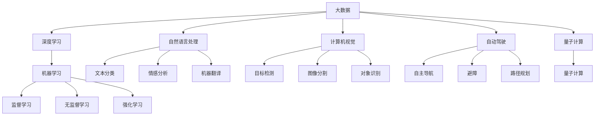

                 

# 大数据与AI未来的发展方向

> 关键词：大数据,人工智能,深度学习,机器学习,自然语言处理,计算机视觉,自动驾驶,量子计算

## 1. 背景介绍

### 1.1 问题由来

随着数字化时代的到来，大数据和人工智能（AI）已经成为驱动科技进步和经济发展的关键力量。大数据的爆炸式增长和AI技术的迅猛发展，正深刻影响着各行各业，催生出前所未有的创新机会和挑战。如何在大数据背景下，合理利用AI技术，实现可持续发展，成为当下业界和学术界关注的热点。

### 1.2 问题核心关键点

大数据与AI的结合，可以从数据驱动、技术融合、应用创新三个维度进行探讨。以下将详细介绍这些问题核心关键点：

1. **数据驱动**：大数据作为AI的基础，提供了训练模型的原材料。数据的质量、规模和多样性决定了AI模型的性能。
2. **技术融合**：AI技术在多个领域的应用，如自然语言处理（NLP）、计算机视觉（CV）、自动驾驶等，需要结合大数据进行优化和提升。
3. **应用创新**：AI技术结合大数据，可以产生新的应用场景，如智能推荐系统、智慧城市、工业互联网等，带来更高的效率和创新价值。

## 2. 核心概念与联系

### 2.1 核心概念概述

为更好地理解大数据与AI的未来发展方向，本节将介绍几个密切相关的核心概念：

- **大数据**：指的是体量大、种类多、速度快的数据集。大数据的核心价值在于其可以提供全面、真实、实时、动态的信息，为决策提供依据。
- **人工智能**：通过模拟人类智能行为，实现数据处理、模式识别、推理判断等任务。AI主要包括机器学习、深度学习、自然语言处理、计算机视觉、自动驾驶等技术领域。
- **深度学习**：一种基于神经网络的机器学习方法，通过多层次的非线性变换，从数据中学习特征表示，进行分类、回归、生成等任务。
- **自然语言处理**：研究计算机如何理解、生成和处理人类语言的技术，主要应用包括机器翻译、文本分类、情感分析、智能问答等。
- **计算机视觉**：研究如何让计算机“看懂”图像和视频，进行目标检测、图像分割、对象识别等任务。
- **自动驾驶**：结合AI和传感器技术，实现车辆的自主导航、避障、路径规划等。
- **量子计算**：利用量子比特进行计算，有望在处理大规模数据和复杂问题上超越经典计算机。

这些核心概念之间的逻辑关系可以通过以下Mermaid流程图来展示：



这个流程图展示了大数据与AI核心概念及其之间的关系：

1. 大数据通过深度学习、自然语言处理、计算机视觉等技术进行处理，得到各类信息。
2. AI技术的各个分支在深度学习的基础上进行应用。
3. 自动驾驶和量子计算是AI技术的前沿应用方向，有望在未来产生重大影响。

## 3. 核心算法原理 & 具体操作步骤

### 3.1 算法原理概述

大数据与AI的结合，核心在于如何高效地利用数据，进行模型训练和推理。常用的方法包括监督学习、无监督学习、强化学习等。

- **监督学习**：通过有标签的数据训练模型，使其能够预测新数据的标签。
- **无监督学习**：利用无标签数据，发现数据的内在结构和模式。
- **强化学习**：通过奖励机制，训练模型在复杂环境中进行最优决策。

### 3.2 算法步骤详解

1. **数据收集与预处理**：
   - 收集大数据，包括结构化数据、非结构化数据等。
   - 清洗、转换数据，使之适合机器学习模型的输入格式。
   - 划分训练集、验证集、测试集。

2. **模型选择与设计**：
   - 根据任务需求选择合适的算法和模型结构。
   - 设计模型的超参数，如学习率、批次大小、迭代轮数等。

3. **模型训练与优化**：
   - 使用训练集数据进行模型训练，优化模型参数。
   - 使用验证集数据进行模型调优，防止过拟合。
   - 使用测试集数据评估模型性能，选择最佳模型。

4. **模型部署与应用**：
   - 将训练好的模型部署到生产环境。
   - 持续监测模型性能，进行增量训练和优化。
   - 收集新数据，更新模型参数，保持模型实时性。

### 3.3 算法优缺点

大数据与AI结合的算法，具有以下优点：

1. **数据驱动**：利用大数据，可以训练出性能更优的AI模型，提升决策的准确性和效率。
2. **技术融合**：通过多种技术的结合，可以实现更加复杂和多样的应用场景，如智能推荐、智能客服、智能监控等。
3. **泛化能力**：AI模型在大量数据上进行训练，具有较强的泛化能力，可以适应不同的数据分布。

但同时也存在以下缺点：

1. **数据依赖**：需要高质量、大规模的数据，获取和处理数据成本较高。
2. **计算资源**：大数据和复杂模型需要大量的计算资源，部署和维护成本较高。
3. **模型复杂**：模型结构复杂，容易受到过拟合、欠拟合等问题的影响。
4. **可解释性**：部分AI模型的决策过程难以解释，缺乏透明性。

### 3.4 算法应用领域

大数据与AI结合的算法，在多个领域得到了广泛应用：

1. **金融科技**：利用大数据进行风险评估、欺诈检测、智能投顾等。
2. **医疗健康**：通过分析医疗数据，进行疾病预测、诊断辅助、个性化治疗等。
3. **智能制造**：结合工业互联网数据，进行生产过程优化、设备故障预测、供应链管理等。
4. **智慧城市**：利用物联网数据，进行城市交通管理、公共安全、环境监测等。
5. **自动驾驶**：结合传感器数据和地图信息，实现车辆自主导航、避障、路径规划等。
6. **智慧零售**：利用消费者行为数据，进行商品推荐、库存管理、营销策略优化等。

这些应用领域展示了大数据与AI结合的巨大潜力和广泛应用前景。未来随着技术的不断发展，更多的行业和场景将迎来AI的赋能。

## 4. 数学模型和公式 & 详细讲解 & 举例说明

### 4.1 数学模型构建

本节将使用数学语言对大数据与AI的未来发展方向进行更加严格的刻画。

假设大数据集为 $D=\{x_1, x_2, ..., x_n\}$，其中 $x_i$ 为第 $i$ 个样本。利用监督学习模型 $f$ 对样本进行训练，目标函数为 $J(f)$，训练过程的损失函数为 $\mathcal{L}$。训练目标最小化损失函数：

$$
\mathop{\arg\min}_{f} \mathcal{L}(f)
$$

模型的训练过程可以表示为梯度下降算法：

$$
\theta \leftarrow \theta - \eta \nabla_{\theta} \mathcal{L}(f)
$$

其中 $\theta$ 为模型参数，$\eta$ 为学习率，$\nabla_{\theta} \mathcal{L}(f)$ 为损失函数对模型参数的梯度。

### 4.2 公式推导过程

以下以一个简单的线性回归为例，推导监督学习模型的数学推导过程。

设样本 $(x_i, y_i)$ 为第 $i$ 个样本，其中 $x_i$ 为输入特征，$y_i$ 为输出标签。假设线性模型为：

$$
y = f(x) = \theta_0 + \theta_1 x_1 + \theta_2 x_2 + ...
$$

训练目标是使得预测值 $y_i^*$ 与真实值 $y_i$ 的误差最小化。常用的损失函数包括均方误差损失函数：

$$
\mathcal{L} = \frac{1}{2n} \sum_{i=1}^{n} (y_i - y_i^*)^2
$$

其中 $y_i^* = f(x_i) = \theta_0 + \theta_1 x_{i,1} + \theta_2 x_{i,2} + ...$。

最小化损失函数，得到梯度下降更新公式：

$$
\theta_j = \theta_j - \eta \frac{1}{n} \sum_{i=1}^{n} (y_i - y_i^*)x_{i,j}
$$

其中 $j = 0, 1, 2, ...$。

### 4.3 案例分析与讲解

以图像分类任务为例，展示监督学习模型的应用。

假设有一张图像 $x$，其中 $x$ 为像素矩阵，通过卷积神经网络（CNN）模型，将图像特征提取并转换为向量表示。假设模型输出的类别概率为 $\hat{y} = f(x)$，其中 $f(x)$ 为神经网络的输出层。

利用监督学习目标，最小化交叉熵损失函数：

$$
\mathcal{L} = -\frac{1}{n} \sum_{i=1}^{n} \sum_{j=1}^{C} y_{i,j} \log(\hat{y}_{i,j})
$$

其中 $C$ 为类别数，$y_{i,j}$ 为第 $i$ 个样本的真实类别，$\hat{y}_{i,j}$ 为模型输出的类别概率。

最小化损失函数，得到梯度下降更新公式：

$$
\theta_{l,k} = \theta_{l,k} - \eta \frac{1}{n} \sum_{i=1}^{n} (\frac{1}{m} \sum_{j=1}^{m} y_{i,j} \delta_{i,j} - \hat{y}_{i,j}) \frac{\partial \hat{y}_{i,j}}{\partial \theta_{l,k}}
$$

其中 $\delta_{i,j}$ 为模型的梯度，$\frac{\partial \hat{y}_{i,j}}{\partial \theta_{l,k}}$ 为神经网络的反向传播计算。

## 5. 项目实践：代码实例和详细解释说明

### 5.1 开发环境搭建

在进行大数据与AI结合的模型实践前，我们需要准备好开发环境。以下是使用Python进行TensorFlow开发的环境配置流程：

1. 安装Anaconda：从官网下载并安装Anaconda，用于创建独立的Python环境。

2. 创建并激活虚拟环境：
```bash
conda create -n ai-env python=3.8 
conda activate ai-env
```

3. 安装TensorFlow：
```bash
pip install tensorflow
```

4. 安装其他常用库：
```bash
pip install numpy pandas scikit-learn matplotlib
```

完成上述步骤后，即可在`ai-env`环境中开始模型开发。

### 5.2 源代码详细实现

下面我们以图像分类任务为例，给出使用TensorFlow实现卷积神经网络（CNN）的代码实现。

首先，定义CNN模型的超参数：

```python
import tensorflow as tf
from tensorflow.keras import layers

batch_size = 32
image_size = (32, 32, 3)
num_classes = 10
learning_rate = 0.001
epochs = 10
```

然后，定义CNN模型：

```python
model = tf.keras.Sequential([
    layers.Conv2D(32, (3, 3), activation='relu', input_shape=image_size),
    layers.MaxPooling2D((2, 2)),
    layers.Conv2D(64, (3, 3), activation='relu'),
    layers.MaxPooling2D((2, 2)),
    layers.Flatten(),
    layers.Dense(64, activation='relu'),
    layers.Dense(num_classes, activation='softmax')
])
```

接着，定义训练和评估函数：

```python
def train_epoch(model, dataset, batch_size, optimizer):
    model.compile(optimizer=optimizer, loss='categorical_crossentropy', metrics=['accuracy'])
    model.fit(dataset, epochs=1, batch_size=batch_size)

def evaluate(model, dataset, batch_size):
    loss, accuracy = model.evaluate(dataset, batch_size=batch_size)
    print(f"Loss: {loss:.4f}, Accuracy: {accuracy:.4f}")
```

最后，启动训练流程并在测试集上评估：

```python
optimizer = tf.keras.optimizers.Adam(learning_rate=learning_rate)
dataset = tf.keras.datasets.cifar10.load_data().numpy() / 255.0
train_dataset, test_dataset = dataset[:800], dataset[800:]

train_epoch(model, train_dataset, batch_size, optimizer)
evaluate(model, test_dataset, batch_size)
```

以上就是使用TensorFlow实现卷积神经网络的代码实现。可以看到，得益于TensorFlow的强大封装，我们可以用相对简洁的代码完成CNN模型的加载和训练。

### 5.3 代码解读与分析

让我们再详细解读一下关键代码的实现细节：

**超参数定义**：
- `batch_size`：批次大小，用于批量处理数据，加快训练速度。
- `image_size`：输入图像尺寸，即输入到模型的图像大小。
- `num_classes`：类别数，即模型的输出维度。
- `learning_rate`：学习率，控制模型参数更新的幅度。
- `epochs`：训练轮数，控制模型的训练次数。

**CNN模型定义**：
- `Sequential`：定义模型顺序结构。
- `Conv2D`：定义卷积层，提取图像特征。
- `MaxPooling2D`：定义池化层，减小特征图尺寸。
- `Flatten`：将池化后的特征图转换为向量表示。
- `Dense`：定义全连接层，进行分类。

**训练和评估函数**：
- `compile`：设置模型的优化器和损失函数。
- `fit`：训练模型，使用`train_dataset`数据集，指定`epochs`轮数和`batch_size`批次大小。
- `evaluate`：评估模型性能，使用`test_dataset`数据集，输出`loss`和`accuracy`。

**训练流程**：
- `optimizer`：创建Adam优化器。
- `dataset`：加载CIFAR-10数据集，并进行归一化处理。
- `train_dataset`和`test_dataset`：将数据集划分为训练集和测试集。
- `train_epoch`：在训练集上进行训练，输出每个epoch的损失和准确率。
- `evaluate`：在测试集上进行评估，输出测试集上的损失和准确率。

可以看到，TensorFlow框架提供了高效的模型构建和训练工具，使得模型开发变得更加简便和高效。

## 6. 实际应用场景

### 6.1 智能推荐系统

智能推荐系统利用大数据和AI技术，为用户提供个性化的商品和服务推荐，提升用户满意度和平台粘性。常见的推荐算法包括协同过滤、基于内容的推荐、基于深度学习的推荐等。

- **协同过滤**：通过分析用户历史行为数据，发现相似用户或物品，推荐与其相似的物品。
- **基于内容的推荐**：分析商品属性和用户画像，发现用户对某一类商品的偏好，进行推荐。
- **基于深度学习的推荐**：利用神经网络模型，从大量数据中学习用户行为和商品特征，进行推荐。

以电子商务平台为例，利用大数据和AI技术，对用户历史浏览、点击、购买等行为数据进行分析，生成用户画像，结合商品属性和推荐算法，生成个性化推荐列表，提升用户购买转化率。

### 6.2 智慧医疗

智慧医疗利用大数据和AI技术，对医疗数据进行分析和挖掘，提升医疗诊断和治疗水平。常见的应用包括医疗影像分析、病历分析、疾病预测等。

- **医疗影像分析**：利用卷积神经网络对医学影像进行分类和分割，辅助医生进行疾病诊断和治疗方案制定。
- **病历分析**：利用自然语言处理技术，从电子病历中提取关键信息，辅助医生进行病情分析和治疗决策。
- **疾病预测**：利用机器学习算法，对大量医疗数据进行分析，预测疾病发生风险，制定预防措施。

以智能诊断系统为例，利用大数据和AI技术，对海量的医疗影像和病历数据进行分析，生成疾病诊断和治疗方案，提升医疗服务质量和效率。

### 6.3 自动驾驶

自动驾驶利用计算机视觉和大数据技术，实现车辆的自主导航、避障、路径规划等。常见的技术包括图像识别、激光雷达、传感器融合等。

- **图像识别**：利用深度学习算法，对车辆周围环境进行图像识别，识别道路、车辆、行人等物体。
- **激光雷达**：利用激光雷达技术，获取车辆周围环境的3D信息，进行障碍物检测和路径规划。
- **传感器融合**：利用多种传感器数据，进行信息融合，提升车辆的安全性和可靠性。

以自动驾驶汽车为例，利用计算机视觉和大数据技术，对车辆周围环境进行实时监控，识别道路标志、车辆、行人等物体，进行避障和路径规划，提升驾驶安全性和舒适性。

### 6.4 未来应用展望

未来，大数据与AI技术的结合，将推动更多行业实现智能化转型，带来新的增长点和发展机会。以下展望未来可能的应用方向：

1. **智能制造**：结合工业互联网数据，进行生产过程优化、设备故障预测、供应链管理等，提升生产效率和质量。
2. **智慧城市**：利用物联网数据，进行城市交通管理、公共安全、环境监测等，提升城市管理和居民生活质量。
3. **智慧农业**：结合传感器数据和大数据分析，进行农作物监测、病虫害预警、精准灌溉等，提升农业生产效率和收益。
4. **智能金融**：利用金融大数据，进行风险评估、欺诈检测、智能投顾等，提升金融服务的效率和安全性。
5. **智慧教育**：利用学生行为数据和AI技术，进行个性化学习推荐、智能答疑等，提升教育质量和学生体验。
6. **智能客服**：利用NLP和AI技术，进行智能对话、情感分析、意图识别等，提升客户服务质量。

这些应用方向展示了大数据与AI结合的巨大潜力和广泛应用前景。未来随着技术的不断发展，更多的行业和场景将迎来AI的赋能。

## 7. 工具和资源推荐

### 7.1 学习资源推荐

为了帮助开发者系统掌握大数据与AI的未来发展方向，这里推荐一些优质的学习资源：

1. **《深度学习》书籍**：由Ian Goodfellow等著，全面介绍了深度学习的基本原理和应用，是深度学习的入门必读书籍。
2. **《TensorFlow官方文档》**：TensorFlow官方文档，提供了丰富的API文档和教程，适合初学者和进阶学习者。
3. **《机器学习实战》书籍**：由Peter Harrington著，介绍了机器学习算法的实现，通过实践案例深入讲解。
4. **Coursera深度学习课程**：斯坦福大学Andrew Ng开设的深度学习课程，系统介绍了深度学习的基本概念和应用。
5. **Kaggle数据竞赛平台**：Kaggle提供大量公开数据集和竞赛任务，适合学习和实践大数据与AI技术。

通过这些资源的学习实践，相信你一定能够系统掌握大数据与AI技术的未来发展方向，并用于解决实际问题。

### 7.2 开发工具推荐

高效的开发离不开优秀的工具支持。以下是几款用于大数据与AI结合开发的常用工具：

1. **TensorFlow**：由Google开发的深度学习框架，支持分布式计算和模型部署。
2. **PyTorch**：由Facebook开发的深度学习框架，支持动态图和静态图，易于调试和扩展。
3. **Scikit-learn**：开源机器学习库，提供了丰富的机器学习算法和工具。
4. **Jupyter Notebook**：开源Jupyter Notebook环境，支持Python代码的交互式开发和可视化展示。
5. **Pandas**：开源数据处理库，提供了丰富的数据处理和分析工具。
6. **TensorBoard**：TensorFlow配套的可视化工具，可以实时监测模型训练状态，并提供丰富的图表呈现方式。

合理利用这些工具，可以显著提升大数据与AI结合任务的开发效率，加快创新迭代的步伐。

### 7.3 相关论文推荐

大数据与AI技术的结合，源于学界的持续研究。以下是几篇奠基性的相关论文，推荐阅读：

1. **《Deep Learning》论文**：Ian Goodfellow等著，介绍了深度学习的原理和应用。
2. **《ImageNet Classification with Deep Convolutional Neural Networks》论文**：Alex Krizhevsky等著，介绍了卷积神经网络的原理和应用。
3. **《Reinforcement Learning: An Introduction》书籍**：Richard S. Sutton和Andrew G. Barto著，介绍了强化学习的原理和应用。
4. **《Natural Language Processing with Deep Learning》书籍**：Yoshua Bengio等著，介绍了NLP的深度学习应用。
5. **《Quantum Computing and Quantum Algorithms》书籍**：Michael A. Nielsen和Michael J. Bennett著，介绍了量子计算的原理和应用。

这些论文代表了大数据与AI技术的最新研究进展，通过学习这些前沿成果，可以帮助研究者把握学科前进方向，激发更多的创新灵感。

## 8. 总结：未来发展趋势与挑战

### 8.1 总结

本文对大数据与AI的未来发展方向进行了全面系统的介绍。首先阐述了大数据与AI的结合背景和重要意义，明确了数据驱动、技术融合、应用创新等关键点。其次，从原理到实践，详细讲解了大数据与AI的数学模型和核心算法，给出了代码实现示例。最后，探讨了大数据与AI在多个领域的应用前景和未来趋势，提出了相关的学习资源和工具推荐。

通过本文的系统梳理，可以看到，大数据与AI技术的结合正在推动各个行业的智能化转型，带来前所未有的创新机会和发展前景。未来随着技术的不断发展，更多行业和场景将迎来AI的赋能，推动社会的数字化、智能化进程。

### 8.2 未来发展趋势

展望未来，大数据与AI技术的结合将呈现以下几个发展趋势：

1. **数据智能化**：大数据技术将更加智能化，实现自动化的数据收集、清洗和标注，降低人工成本。
2. **AI算法的进步**：AI算法将更加高效和准确，利用大数据进行模型优化和调优，提升AI模型的性能。
3. **多模态融合**：大数据将涵盖多模态数据，如图像、视频、语音等，AI技术将实现多模态融合，提升智能系统的感知和理解能力。
4. **联邦学习**：利用分布式计算和大数据技术，实现多方的模型训练和推理，保护数据隐私。
5. **边缘计算**：利用物联网设备和大数据技术，实现数据的本地化处理和存储，提升智能系统的实时性和效率。

这些趋势凸显了大数据与AI技术的广阔前景。未来随着技术的不断发展，更多行业和场景将迎来AI的赋能，推动社会的数字化、智能化进程。

### 8.3 面临的挑战

尽管大数据与AI技术的结合已经取得了瞩目成就，但在迈向更加智能化、普适化应用的过程中，它仍面临着诸多挑战：

1. **数据质量和安全**：大数据的质量和安全问题仍然存在，数据泄露、数据篡改等问题亟需解决。
2. **模型可解释性**：AI模型的决策过程难以解释，缺乏透明性，影响用户信任和应用效果。
3. **计算资源消耗**：大规模数据和复杂模型的计算需求，对硬件和软件资源提出了更高的要求。
4. **隐私保护和伦理**：AI技术的应用涉及隐私保护和伦理问题，需要建立规范和标准，确保数据使用合规。
5. **技术落地困难**：AI技术的落地应用需要综合考虑技术、业务、市场等因素，存在较大的落地难度。

正视这些挑战，积极应对并寻求突破，将是大数据与AI技术走向成熟的必由之路。相信随着学界和产业界的共同努力，这些挑战终将一一被克服，大数据与AI技术的结合必将在构建智能社会中扮演越来越重要的角色。

### 8.4 研究展望

面对大数据与AI技术的结合所面临的种种挑战，未来的研究需要在以下几个方面寻求新的突破：

1. **数据治理和隐私保护**：建立数据治理体系，保护数据隐私，确保数据使用的合规性和安全性。
2. **AI模型的可解释性**：研究AI模型的可解释性技术，提升模型的透明性和可信度。
3. **高效的计算资源**：开发高效的计算框架和算法，优化模型训练和推理的资源消耗。
4. **多模态融合**：研究多模态数据融合技术，提升智能系统的感知和理解能力。
5. **联邦学习**：研究联邦学习技术，实现多方的模型训练和推理，保护数据隐私。
6. **边缘计算**：研究边缘计算技术，实现数据的本地化处理和存储，提升智能系统的实时性和效率。

这些研究方向将推动大数据与AI技术的进一步发展，推动智能系统的普适化和智能化。

## 9. 附录：常见问题与解答

**Q1：如何选择合适的机器学习算法？**

A: 选择机器学习算法需要考虑多个因素，包括数据类型、数据量、任务目标等。常见的算法包括监督学习、无监督学习、强化学习等。

- **监督学习**：适用于有标注数据的任务，如分类、回归等。常用的算法包括决策树、支持向量机、神经网络等。
- **无监督学习**：适用于无标注数据的任务，如聚类、降维等。常用的算法包括K-Means、主成分分析（PCA）等。
- **强化学习**：适用于智能决策任务，如游戏、机器人等。常用的算法包括Q-Learning、策略梯度等。

在选择算法时，需要结合具体任务和数据特点，进行算法选择和调参优化。

**Q2：如何处理数据质量和数据安全问题？**

A: 处理数据质量和数据安全问题，可以从以下几个方面入手：

- **数据质量**：通过数据清洗、数据标注、数据补全等手段，提升数据的质量。
- **数据安全**：采用加密、匿名化、访问控制等手段，保护数据的安全。
- **数据治理**：建立数据治理体系，规范数据的使用和共享。

通过这些手段，可以有效提升数据的质量和安全，为AI模型的训练和应用提供坚实的基础。

**Q3：如何提升AI模型的可解释性？**

A: 提升AI模型的可解释性，可以从以下几个方面入手：

- **特征可视化**：通过可视化手段，展示模型的输入特征和输出结果。
- **局部可解释性**：通过局部可解释性方法，解释模型在特定输入下的决策过程。
- **全局可解释性**：通过全局可解释性方法，解释模型整体的决策机制和推理逻辑。

通过这些手段，可以有效提升AI模型的可解释性，增加用户对模型的信任和理解。

**Q4：如何降低AI模型在计算资源上的消耗？**

A: 降低AI模型在计算资源上的消耗，可以从以下几个方面入手：

- **模型压缩**：通过剪枝、量化、蒸馏等手段，压缩模型的参数和结构。
- **分布式计算**：利用分布式计算框架，如Spark、TensorFlow分布式等，提升计算效率。
- **硬件加速**：利用GPU、TPU等硬件加速设备，提升模型训练和推理的速度。

通过这些手段，可以有效降低AI模型在计算资源上的消耗，提升模型的实时性和效率。

**Q5：如何保护数据隐私？**

A: 保护数据隐私，可以从以下几个方面入手：

- **数据脱敏**：通过数据脱敏技术，保护用户隐私信息。
- **联邦学习**：利用联邦学习技术，实现多方的模型训练和推理，保护数据隐私。
- **差分隐私**：通过差分隐私技术，保护用户数据隐私，防止数据泄露。

通过这些手段，可以有效保护数据隐私，确保数据使用的合规性和安全性。

---

作者：禅与计算机程序设计艺术 / Zen and the Art of Computer Programming

