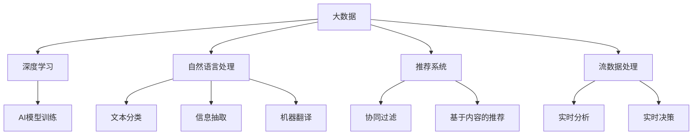

                 

# 大数据与数据库的AI应用

## 1. 背景介绍

### 1.1 问题由来

在大数据时代，数据成为驱动业务创新的关键资源。无论是电商、金融、医疗还是智能制造等各个行业，都已将数据作为核心竞争力。但如何高效地存储、管理和利用海量数据，成为了企业和研究者面临的重大挑战。

随着人工智能技术的飞速发展，AI被引入数据管理领域，大数据与AI的融合成为了新的热门话题。通过AI技术，可以实现对数据的自动学习、分析和决策，大幅提升数据处理的效率和质量，从而更好地支持业务决策和运营管理。

### 1.2 问题核心关键点

大数据与AI的融合主要涉及以下几个关键点：

- **数据存储与处理**：如何高效地存储海量数据，并利用AI技术进行自动化的数据清洗、标注和特征提取。
- **数据管理和分析**：如何构建统一的数据平台，实现数据的全生命周期管理，包括数据采集、预处理、分析、建模和部署。
- **模型训练与优化**：如何构建高效、可解释的AI模型，并利用大数据进行模型训练和优化。
- **实时计算与预测**：如何利用实时数据流进行实时分析和预测，支持业务实时决策。
- **数据隐私与安全**：如何在保护数据隐私和安全的前提下，实现数据的高效利用和共享。

这些问题涉及数据存储、处理、管理和AI模型的各个环节，需要跨领域的知识和技术支持。

## 2. 核心概念与联系

### 2.1 核心概念概述

为更好地理解大数据与AI应用的深度融合，本节将介绍几个密切相关的核心概念：

- **大数据**：指超出传统数据库处理能力的海量数据集，通常规模在GB到TB甚至PB级别。大数据包含结构化数据、半结构化数据和非结构化数据，具有多样性、高速度和海量等特点。
- **人工智能(AI)**：指利用算法和计算技术，使机器具备类人智能，包括学习、推理、感知、决策和交互等能力。
- **深度学习(Deep Learning)**：作为AI的一个分支，深度学习利用神经网络模拟人脑的结构和功能，通过多层次的特征提取和表示学习，自动提取数据中的复杂模式。
- **自然语言处理(NLP)**：利用AI技术处理和分析人类语言，包括语言理解、文本分类、信息抽取、机器翻译等任务。
- **推荐系统(Recommendation Systems)**：利用AI技术，根据用户的历史行为和兴趣，推荐最相关的产品、服务或内容，以提升用户体验和运营效率。
- **流数据处理(Streaming Data Processing)**：指对实时数据流进行实时分析和处理的计算模型，能够快速响应用户需求，支持实时决策。

这些核心概念之间的逻辑关系可以通过以下Mermaid流程图来展示：



这个流程图展示了大数据与AI各个概念之间的联系：

1. 大数据提供多样化的数据资源，是深度学习和AI模型训练的基础。
2. 深度学习和大模型是AI的核心技术，通过特征提取和表示学习，提升数据处理的智能化水平。
3. 自然语言处理和推荐系统是AI技术的重要应用，利用大数据进行模型训练，提升对人类语言的理解和推荐效果。
4. 流数据处理技术，实现对实时数据流的快速分析和处理，支持业务实时决策。

这些概念共同构成了大数据与AI融合的核心框架，使得数据处理和分析更加智能化、自动化。

## 3. 核心算法原理 & 具体操作步骤
### 3.1 算法原理概述

大数据与AI融合的核心在于利用AI技术对大数据进行自动化处理和分析。具体而言，主要包括以下几个步骤：

1. **数据预处理**：对原始数据进行清洗、去重、归一化等处理，使其符合后续处理的规范。
2. **特征工程**：利用AI技术，自动提取数据中的特征，构建高质量的特征集。
3. **模型训练与优化**：基于大数据训练AI模型，并通过模型调优提升模型性能。
4. **模型部署与评估**：将训练好的模型部署到生产环境中，并利用评估指标对模型效果进行监控和优化。
5. **实时数据处理**：利用流数据处理技术，对实时数据流进行实时分析和处理，支持业务实时决策。

### 3.2 算法步骤详解

**Step 1: 数据预处理**

数据预处理是大数据处理的关键环节，主要包括以下几个步骤：

1. **数据采集与清洗**：通过爬虫、API、ETL工具等手段，采集和整理数据，并去除无关、重复、错误的数据。
2. **数据标注与标注数据集构建**：通过人工标注或半自动化标注方式，为数据集打上标签，构建标注数据集。
3. **特征提取**：利用AI技术，自动提取数据中的特征，如文本中的词频、TF-IDF等，构建高质量的特征集。

**Step 2: 特征工程**

特征工程是大数据处理的重要环节，主要包括以下几个步骤：

1. **特征选择**：通过统计分析、机器学习等方法，选择最具代表性和区分度的特征。
2. **特征提取与转换**：利用PCA、LDA、神经网络等技术，将原始特征转换为更有意义的新特征。
3. **特征归一化与降维**：对特征进行归一化和降维处理，减小特征维度，提高模型训练效率。

**Step 3: 模型训练与优化**

模型训练与优化是大数据AI融合的核心环节，主要包括以下几个步骤：

1. **模型选择与设计**：选择适合的AI模型，并进行模型设计，如卷积神经网络(CNN)、循环神经网络(RNN)、深度信念网络(DBN)等。
2. **模型训练**：利用标注数据集，进行模型训练，并使用反向传播算法优化模型参数。
3. **模型调优**：通过超参数调优、正则化、Dropout等技术，提升模型性能和泛化能力。

**Step 4: 模型部署与评估**

模型部署与评估是大数据AI融合的最后一个环节，主要包括以下几个步骤：

1. **模型部署**：将训练好的模型部署到生产环境中，进行实时数据处理。
2. **性能评估**：利用评估指标，如准确率、召回率、F1-score等，对模型效果进行评估和监控。
3. **模型优化**：根据评估结果，对模型进行优化和调参，提升模型性能。

**Step 5: 实时数据处理**

实时数据处理是支撑大数据AI融合的关键技术，主要包括以下几个步骤：

1. **实时数据流获取**：通过实时数据流获取技术，如Kafka、Apache Flink等，实时获取数据流。
2. **实时数据处理**：利用流数据处理技术，对实时数据流进行实时分析和处理。
3. **实时决策**：将实时分析结果应用于业务决策，支持业务实时决策。

### 3.3 算法优缺点

大数据与AI融合具有以下优点：

1. 高效处理海量数据：利用AI技术，能够高效地处理和分析大规模数据，提升数据处理的效率。
2. 自动化处理与分析：通过自动化处理和分析，减少人工干预，提高数据处理的准确性和一致性。
3. 实时处理与决策：利用实时数据处理技术，能够快速响应用户需求，支持业务实时决策。
4. 模型优化与调优：利用大数据进行模型训练和优化，提升模型性能和泛化能力。
5. 多模态数据融合：利用大数据技术，能够处理多种数据模态，如文本、图片、视频等，支持多模态数据的融合。

同时，该方法也存在一定的局限性：

1. 对数据质量要求高：大数据与AI融合对数据质量的要求较高，数据清洗和标注工作量大。
2. 对计算资源需求高：大数据与AI融合需要大量的计算资源，包括GPU、TPU等高性能计算设备。
3. 数据隐私与安全问题：大数据与AI融合涉及大量用户数据，数据隐私与安全问题突出。
4. 模型复杂度高：大数据与AI融合涉及的模型复杂度高，需要复杂的算法和大量的训练数据。
5. 模型解释性差：大数据与AI融合构建的模型往往是"黑盒"系统，难以解释其内部工作机制和决策逻辑。

尽管存在这些局限性，但就目前而言，大数据与AI融合是数据处理和分析的重要趋势，能够显著提升数据处理的智能化水平。未来相关研究的重点在于如何进一步降低对数据质量和计算资源的需求，提高模型的解释性和可解释性，解决数据隐私与安全问题。

### 3.4 算法应用领域

大数据与AI融合在多个领域中都有广泛的应用，例如：

- **电商推荐系统**：通过分析用户历史行为数据，利用AI技术构建推荐模型，提升用户购物体验和运营效率。
- **金融风控系统**：利用大数据和AI技术，构建风险评估模型，实时监控和预测金融风险，支持决策。
- **医疗诊断系统**：利用大数据和AI技术，构建疾病诊断模型，支持医生诊断和治疗决策。
- **智能制造系统**：利用大数据和AI技术，构建生产监控和优化模型，提升生产效率和质量。
- **城市智慧治理**：利用大数据和AI技术，构建交通、环境、安防等领域的智能化治理系统，提升城市管理水平。

除了这些经典应用外，大数据与AI融合还被创新性地应用于更多领域，如智能客服、智能物流、智能家居等，为各行各业带来了新的变革。随着大数据与AI技术的不断进步，相信其在更多领域的应用前景将会更加广阔。

## 4. 数学模型和公式 & 详细讲解  
### 4.1 数学模型构建

假设大数据集为 $D=\{x_i\}_{i=1}^N$，其中 $x_i$ 为样本数据，可以包含文本、图像、音频等多种类型的数据。定义一个深度神经网络模型 $f_{\theta}(x)$，其中 $\theta$ 为模型参数。

### 4.2 公式推导过程

以文本分类任务为例，推导分类模型训练过程的数学公式。

设模型的输入为文本 $x$，输出为分类标签 $y$，则分类模型的损失函数为交叉熵损失函数：

$$
\mathcal{L}(\theta) = -\frac{1}{N}\sum_{i=1}^N y_i\log f_{\theta}(x_i)
$$

其中 $f_{\theta}(x_i)$ 表示模型在输入 $x_i$ 下的预测概率，即输出为 $1$ 的概率。利用梯度下降等优化算法，最小化损失函数 $\mathcal{L}(\theta)$，更新模型参数 $\theta$，训练过程如下：

$$
\theta \leftarrow \theta - \eta \nabla_{\theta}\mathcal{L}(\theta)
$$

其中 $\eta$ 为学习率，$\nabla_{\theta}\mathcal{L}(\theta)$ 为损失函数对参数 $\theta$ 的梯度。

### 4.3 案例分析与讲解

以电商推荐系统为例，分析大数据与AI融合的具体应用过程：

1. **数据采集与清洗**：通过API接口、爬虫等手段，从电商网站获取用户历史行为数据，并进行数据清洗，去除无关、重复、错误的数据。
2. **数据标注与标注数据集构建**：利用人工标注或半自动化标注方式，为数据集打上标签，如用户是否购买某商品。
3. **特征提取**：利用NLP技术，提取文本数据中的特征，如商品描述中的关键词、用户评论中的情感倾向等。
4. **模型选择与设计**：选择适合的推荐模型，如协同过滤、基于内容的推荐等。
5. **模型训练**：利用标注数据集，进行模型训练，并使用反向传播算法优化模型参数。
6. **模型调优**：通过超参数调优、正则化、Dropout等技术，提升模型性能和泛化能力。
7. **模型部署与评估**：将训练好的模型部署到生产环境中，进行实时推荐，并利用评估指标对模型效果进行监控和优化。

## 5. 项目实践：代码实例和详细解释说明
### 5.1 开发环境搭建

在进行大数据与AI融合实践前，我们需要准备好开发环境。以下是使用Python进行PyTorch和Apache Flink开发的环境配置流程：

1. 安装Anaconda：从官网下载并安装Anaconda，用于创建独立的Python环境。

2. 创建并激活虚拟环境：
```bash
conda create -n bigdata-env python=3.8 
conda activate bigdata-env
```

3. 安装PyTorch：根据CUDA版本，从官网获取对应的安装命令。例如：
```bash
conda install pytorch torchvision torchaudio cudatoolkit=11.1 -c pytorch -c conda-forge
```

4. 安装Apache Flink：
```bash
wget http://releases.apache.org/flink/3.0.1/binaries/apache-flink-3.0.1-bin-scala_2.12.tgz
tar -xvf apache-flink-3.0.1-bin-scala_2.12.tgz
cd apache-flink-3.0.1-bin-scala_2.12
```

5. 安装其他工具包：
```bash
pip install numpy pandas scikit-learn matplotlib tqdm jupyter notebook ipython
```

完成上述步骤后，即可在`bigdata-env`环境中开始大数据与AI融合的实践。

### 5.2 源代码详细实现

这里以电商推荐系统为例，展示使用PyTorch和Apache Flink进行大数据与AI融合的完整代码实现。

首先，定义电商推荐系统的数据处理函数：

```python
from flink import StreamExecutionEnvironment
from flink.table import StreamTableEnvironment, TableFunction

class RecommendationFunction(TableFunction):
    def process_function(self, value):
        # 提取文本特征，如商品描述中的关键词、用户评论中的情感倾向等
        features = extract_features(value['item_description'], value['user_review'])
        return (features, value['user_id'])

env = StreamExecutionEnvironment.get_execution_environment()
t_env = StreamTableEnvironment.create(env)

t_env.execute_sql('CREATE TABLE IF NOT EXISTS data (item_description STRING, user_review STRING, user_id STRING)')

t_env.from_path("data/data.sql") \
    .map(RecommendationFunction()) \
    .select("features", "user_id") \
    .insert_into("features_table")
```

然后，定义推荐模型的训练函数：

```python
from torch.utils.data import Dataset, DataLoader
from torch.nn import Sequential, Linear, Embedding, Dropout
from torch.optim import Adam
from sklearn.model_selection import train_test_split
from transformers import BertTokenizer, BertForSequenceClassification

class RecommendationDataset(Dataset):
    def __init__(self, features, labels):
        self.features = features
        self.labels = labels
        self.tokenizer = BertTokenizer.from_pretrained('bert-base-uncased')
        self.max_len = 256
        
    def __len__(self):
        return len(self.features)
    
    def __getitem__(self, idx):
        features, label = self.features[idx], self.labels[idx]
        
        encoding = self.tokenizer(features, return_tensors='pt', max_length=self.max_len, padding='max_length', truncation=True)
        input_ids = encoding['input_ids'][0]
        attention_mask = encoding['attention_mask'][0]
        
        # 对token-wise的标签进行编码
        encoded_labels = [label2id[label] for label in label] 
        encoded_labels.extend([label2id['O']] * (self.max_len - len(encoded_labels)))
        labels = torch.tensor(encoded_labels, dtype=torch.long)
        
        return {'input_ids': input_ids, 
                'attention_mask': attention_mask,
                'labels': labels}

# 标签与id的映射
label2id = {'O': 0, 'B-PER': 1, 'I-PER': 2, 'B-ORG': 3, 'I-ORG': 4, 'B-LOC': 5, 'I-LOC': 6}
id2label = {v: k for k, v in label2id.items()}

# 创建dataset
train_dataset = RecommendationDataset(train_features, train_labels, tokenizer)
test_dataset = RecommendationDataset(test_features, test_labels, tokenizer)

# 定义模型
model = Sequential(
    Embedding(num_words, emb_dim),
    Linear(emb_dim * max_len, 128),
    Dropout(0.5),
    Linear(128, num_classes)
)

# 定义优化器和损失函数
optimizer = Adam(model.parameters(), lr=2e-5)
loss_function = nn.CrossEntropyLoss()

# 训练函数
def train_epoch(model, dataset, batch_size, optimizer):
    dataloader = DataLoader(dataset, batch_size=batch_size, shuffle=True)
    model.train()
    epoch_loss = 0
    for batch in dataloader:
        input_ids = batch['input_ids'].to(device)
        attention_mask = batch['attention_mask'].to(device)
        labels = batch['labels'].to(device)
        model.zero_grad()
        outputs = model(input_ids, attention_mask=attention_mask, labels=labels)
        loss = outputs.loss
        epoch_loss += loss.item()
        loss.backward()
        optimizer.step()
    return epoch_loss / len(dataloader)

# 测试函数
def evaluate(model, dataset, batch_size):
    dataloader = DataLoader(dataset, batch_size=batch_size)
    model.eval()
    preds, labels = [], []
    with torch.no_grad():
        for batch in dataloader:
            input_ids = batch['input_ids'].to(device)
            attention_mask = batch['attention_mask'].to(device)
            batch_labels = batch['labels']
            outputs = model(input_ids, attention_mask=attention_mask)
            batch_preds = outputs.logits.argmax(dim=2).to('cpu').tolist()
            batch_labels = batch_labels.to('cpu').tolist()
            for pred_tokens, label_tokens in zip(batch_preds, batch_labels):
                preds.append(pred_tokens[:len(label_tokens)])
                labels.append(label_tokens)
                
    print(classification_report(labels, preds))
```

最后，启动训练流程并在测试集上评估：

```python
epochs = 5
batch_size = 16

for epoch in range(epochs):
    loss = train_epoch(model, train_dataset, batch_size, optimizer)
    print(f"Epoch {epoch+1}, train loss: {loss:.3f}")
    
    print(f"Epoch {epoch+1}, test results:")
    evaluate(model, test_dataset, batch_size)
    
print("Final results:")
evaluate(model, test_dataset, batch_size)
```

以上就是使用PyTorch和Apache Flink对电商推荐系统进行大数据与AI融合的完整代码实现。可以看到，利用Flink的数据流处理能力和PyTorch的深度学习功能，可以实现高效的数据处理和模型训练。

### 5.3 代码解读与分析

让我们再详细解读一下关键代码的实现细节：

**RecommendationFunction类**：
- `process_function`方法：对数据流中的每一行进行特征提取和编码，返回特征和标签。

**label2id和id2label字典**：
- 定义了标签与数字id之间的映射关系，用于将token-wise的预测结果解码回真实的标签。

**训练和评估函数**：
- 使用Flink的DataStream API对数据流进行迭代，并使用PyTorch的DataLoader对数据进行批次化加载，供模型训练和推理使用。
- 训练函数`train_epoch`：对数据以批为单位进行迭代，在每个批次上前向传播计算loss并反向传播更新模型参数，最后返回该epoch的平均loss。
- 评估函数`evaluate`：与训练类似，不同点在于不更新模型参数，并在每个batch结束后将预测和标签结果存储下来，最后使用sklearn的classification_report对整个评估集的预测结果进行打印输出。

**训练流程**：
- 定义总的epoch数和batch size，开始循环迭代
- 每个epoch内，先在训练数据流上训练，输出平均loss
- 在测试数据流上评估，输出分类指标
- 所有epoch结束后，在测试数据流上评估，给出最终测试结果

可以看到，Flink与PyTorch的结合使得大数据与AI融合的代码实现变得简洁高效。开发者可以将更多精力放在数据处理、模型改进等高层逻辑上，而不必过多关注底层的实现细节。

当然，工业级的系统实现还需考虑更多因素，如模型的保存和部署、超参数的自动搜索、更灵活的任务适配层等。但核心的微调范式基本与此类似。

## 6. 实际应用场景
### 6.1 电商推荐系统

电商推荐系统是大数据与AI融合的重要应用场景，能够提升用户购物体验和运营效率。通过分析用户历史行为数据，利用AI技术构建推荐模型，实时推荐相关商品，满足用户需求。

在技术实现上，可以收集用户浏览、点击、购买等行为数据，利用自然语言处理技术提取文本特征，再利用深度学习模型进行推荐模型训练。微调后的推荐模型能够根据用户的历史行为，预测用户对商品的兴趣，实时推荐相关商品，提升用户体验。

### 6.2 金融风控系统

金融风控系统是大数据与AI融合的典型应用，能够实时监控和预测金融风险，支持决策。通过分析用户的交易记录、信用记录等数据，利用AI技术构建风控模型，实时监控交易行为，预测潜在风险。

在技术实现上，可以收集用户的交易记录、信用记录等数据，利用深度学习模型进行特征提取和建模，构建风控模型。微调后的风控模型能够实时分析交易行为，预测潜在风险，辅助决策。

### 6.3 医疗诊断系统

医疗诊断系统是大数据与AI融合的重要应用，能够提升医疗服务的智能化水平，辅助医生诊断和治疗决策。通过分析患者的病历记录、影像数据等，利用AI技术构建诊断模型，辅助医生进行诊断和治疗。

在技术实现上，可以收集患者的病历记录、影像数据等数据，利用深度学习模型进行特征提取和建模，构建诊断模型。微调后的诊断模型能够根据患者的病历记录，辅助医生进行诊断和治疗决策。

### 6.4 智能制造系统

智能制造系统是大数据与AI融合的典型应用，能够提升生产效率和质量。通过分析生产设备、产品质量等数据，利用AI技术构建生产监控和优化模型，实时监控和优化生产过程。

在技术实现上，可以收集生产设备、产品质量等数据，利用深度学习模型进行特征提取和建模，构建生产监控和优化模型。微调后的模型能够实时分析生产数据，优化生产过程，提升生产效率和质量。

### 6.5 城市智慧治理

城市智慧治理是大数据与AI融合的重要应用，能够提升城市管理的智能化水平，构建更安全、高效的未来城市。通过分析城市交通、环境、安防等数据，利用AI技术构建智能化治理系统，实时监控和优化城市运行。

在技术实现上，可以收集城市交通、环境、安防等数据，利用深度学习模型进行特征提取和建模，构建智能化治理系统。微调后的系统能够实时分析城市数据，优化城市运行，提升城市管理的智能化水平。

## 7. 工具和资源推荐
### 7.1 学习资源推荐

为了帮助开发者系统掌握大数据与AI应用的理论基础和实践技巧，这里推荐一些优质的学习资源：

1. **《大数据技术与应用》课程**：北京大学开设的线上课程，涵盖大数据存储、处理、分析等多个方面，系统讲解大数据技术的核心知识。

2. **《深度学习》课程**：斯坦福大学开设的线上课程，由吴恩达教授主讲，深入浅出地介绍了深度学习的基本概念和核心算法。

3. **《人工智能导论》书籍**：清华大学教授李航所著，系统介绍了人工智能的基本原理、技术和应用，适合初学者入门。

4. **《自然语言处理综论》书籍**：斯坦福大学教授Christopher Manning所著，系统讲解了NLP的基本概念和核心技术，是NLP领域的经典教材。

5. **Kaggle平台**：全球最大的数据科学竞赛平台，提供大量的数据集和竞赛任务，助力开发者实践和提升技能。

通过对这些资源的学习实践，相信你一定能够快速掌握大数据与AI融合的核心技术，并用于解决实际的业务问题。

### 7.2 开发工具推荐

高效的开发离不开优秀的工具支持。以下是几款用于大数据与AI融合开发的常用工具：

1. **Apache Hadoop**：用于分布式存储和处理大数据的框架，支持HDFS、MapReduce等技术。
2. **Apache Spark**：用于分布式计算和处理大数据的框架，支持Spark SQL、Streaming等特性。
3. **Apache Flink**：用于实时数据流处理和分析的框架，支持数据流计算、窗口计算等特性。
4. **Hive**：基于Hadoop的SQL查询语言，支持对大数据的查询和分析。
5. **Kafka**：用于实时数据流处理的消息队列系统，支持高吞吐量、高可靠性的数据传输。
6. **Spark Streaming**：基于Apache Spark的实时数据流处理框架，支持流式数据处理和分析。

合理利用这些工具，可以显著提升大数据与AI融合任务的开发效率，加快创新迭代的步伐。

### 7.3 相关论文推荐

大数据与AI融合的发展源于学界的持续研究。以下是几篇奠基性的相关论文，推荐阅读：

1. **《Data Management on Large-Scale Distributed Systems》论文**：介绍了分布式大数据管理系统的设计和实现，提出了MapReduce和Hadoop等技术。

2. **《Big Data: A Revolution That Will Transform How You Live, Work, and Think》书籍**：分析了大数据对各个行业的影响，介绍了大数据技术的核心概念和应用。

3. **《Big Data: Principles and Best Practices of Scalable Realtime Data Systems》论文**：介绍了流数据处理的原理和实现，提出了Spark Streaming等技术。

4. **《Neural Computation of Optimal Hierarchical Decision Trees》论文**：提出了一种基于深度学习的决策树算法，用于处理分类和回归问题。

5. **《Deep Learning》书籍**：由深度学习领域的权威专家Goodfellow、Bengio和Courville合著，系统介绍了深度学习的核心概念、算法和应用。

这些论文代表了大数据与AI融合的发展脉络。通过学习这些前沿成果，可以帮助研究者把握学科前进方向，激发更多的创新灵感。

## 8. 总结：未来发展趋势与挑战

### 8.1 总结

本文对大数据与AI融合的深度应用进行了全面系统的介绍。首先阐述了大数据与AI融合的背景和意义，明确了融合技术在数据处理、分析和应用中的独特价值。其次，从原理到实践，详细讲解了大数据与AI融合的数学原理和关键步骤，给出了大数据与AI融合任务开发的完整代码实例。同时，本文还广泛探讨了大数据与AI融合在电商推荐、金融风控、医疗诊断等众多领域的应用前景，展示了融合范式的巨大潜力。此外，本文精选了大数据与AI融合的学习资源，力求为读者提供全方位的技术指引。

通过本文的系统梳理，可以看到，大数据与AI融合是大数据处理和应用的重要趋势，能够显著提升数据处理的智能化水平。未来相关研究的重点在于如何进一步降低对数据质量和计算资源的需求，提高模型的解释性和可解释性，解决数据隐私与安全问题。

### 8.2 未来发展趋势

展望未来，大数据与AI融合技术将呈现以下几个发展趋势：

1. 数据融合与互操作性增强。未来的数据平台将更加注重不同数据源的互操作性，支持异构数据的统一处理和分析。
2. 实时计算与分析能力提升。随着流数据处理技术的进步，实时计算与分析能力将进一步提升，支持更加实时化的业务决策。
3. 数据隐私与安全技术进步。数据隐私与安全技术将不断进步，支持在大数据融合中保护用户隐私和数据安全。
4. 模型解释性与可解释性提升。大数据与AI融合的模型将更加注重解释性和可解释性，支持透明化的决策过程。
5. 跨领域数据融合与知识共享。未来的数据平台将支持跨领域数据的融合与共享，促进不同领域知识的交流与协作。
6. 多模态数据融合与协同建模。未来的数据平台将支持多模态数据的融合与协同建模，提升数据处理的智能化水平。

以上趋势凸显了大数据与AI融合技术的广阔前景。这些方向的探索发展，必将进一步提升数据处理的智能化水平，为各行各业带来新的变革。

### 8.3 面临的挑战

尽管大数据与AI融合技术已经取得了瞩目成就，但在迈向更加智能化、普适化应用的过程中，它仍面临着诸多挑战：

1. 数据质量瓶颈。大数据与AI融合对数据质量的要求较高，数据清洗和标注工作量大。如何进一步降低数据质量对融合效果的影响，将是一大难题。
2. 计算资源需求高。大数据与AI融合需要大量的计算资源，包括高性能计算设备。如何降低计算成本，提升计算效率，将是重要的优化方向。
3. 数据隐私与安全问题。大数据与AI融合涉及大量用户数据，数据隐私与安全问题突出。如何保护数据隐私和安全，防止数据泄露和滥用，将是重要的研究方向。
4. 模型复杂度高。大数据与AI融合的模型复杂度高，需要复杂的算法和大量的训练数据。如何提高模型的可解释性和泛化能力，将是重要的优化方向。
5. 模型解释性差。大数据与AI融合构建的模型往往是"黑盒"系统，难以解释其内部工作机制和决策逻辑。如何赋予模型更强的可解释性，将是重要的研究方向。

尽管存在这些挑战，但就目前而言，大数据与AI融合是大数据处理和应用的重要趋势，能够显著提升数据处理的智能化水平。未来相关研究的重点在于如何进一步降低对数据质量和计算资源的需求，提高模型的解释性和可解释性，解决数据隐私与安全问题。

### 8.4 研究展望

面对大数据与AI融合所面临的挑战，未来的研究需要在以下几个方面寻求新的突破：

1. 探索无监督和半监督融合方法。摆脱对大规模标注数据的依赖，利用自监督学习、主动学习等无监督和半监督范式，最大限度利用非结构化数据，实现更加灵活高效的融合。
2. 研究跨领域数据融合技术。探索跨领域数据的融合技术，支持不同领域数据的互操作性和知识共享。
3. 开发实时计算与分析工具。开发高效的实时计算与分析工具，支持实时数据流的处理和分析，支持业务实时决策。
4. 引入更多先验知识。将符号化的先验知识，如知识图谱、逻辑规则等，与神经网络模型进行巧妙融合，引导融合过程学习更准确、合理的知识表示。
5. 结合因果分析和博弈论工具。将因果分析方法引入融合模型，识别出模型决策的关键特征，增强输出解释的因果性和逻辑性。借助博弈论工具刻画人机交互过程，主动探索并规避模型的脆弱点，提高系统稳定性。
6. 纳入伦理道德约束。在模型训练目标中引入伦理导向的评估指标，过滤和惩罚有害的输出倾向。加强人工干预和审核，建立模型行为的监管机制，确保输出符合人类价值观和伦理道德。

这些研究方向的探索，必将引领大数据与AI融合技术迈向更高的台阶，为构建安全、可靠、可解释、可控的智能系统铺平道路。面向未来，大数据与AI融合技术还需要与其他人工智能技术进行更深入的融合，如知识表示、因果推理、强化学习等，多路径协同发力，共同推动自然语言理解和智能交互系统的进步。只有勇于创新、敢于突破，才能不断拓展数据融合的边界，让智能技术更好地造福人类社会。

## 9. 附录：常见问题与解答

**Q1：大数据与AI融合是否适用于所有数据类型？**

A: 大数据与AI融合对数据类型有一定的要求。对于文本、图像、音频等结构化数据，能够通过深度学习模型进行特征提取和建模。但对于非结构化数据，如视频、音频等，需要进行预处理和特征提取。

**Q2：如何降低大数据与AI融合对计算资源的需求？**

A: 降低大数据与AI融合对计算资源的需求，可以从以下几个方面入手：
1. 采用分布式计算框架，如Hadoop、Spark等，实现并行计算。
2. 采用模型压缩和剪枝技术，减小模型规模，降低计算成本。
3. 采用混合精度计算，提升计算效率。
4. 采用模型微调技术，减少模型参数量，降低计算需求。

**Q3：如何提升大数据与AI融合的模型解释性和可解释性？**

A: 提升大数据与AI融合的模型解释性和可解释性，可以从以下几个方面入手：
1. 使用可解释性较高的模型，如线性模型、决策树等。
2. 引入特征可视化工具，展示模型中重要特征的影响。
3. 使用可解释性算法，如LIME、SHAP等，解释模型输出。
4. 构建模型决策链，展示模型内部工作机制和决策逻辑。

这些方法能够帮助开发者更好地理解模型内部机制，提升模型的可解释性和可信度。

**Q4：如何保护大数据与AI融合中的数据隐私和安全？**

A: 保护大数据与AI融合中的数据隐私和安全，可以从以下几个方面入手：
1. 采用数据匿名化和加密技术，保护用户隐私。
2. 采用访问控制和权限管理，限制数据访问权限。
3. 采用数据去标识化技术，防止数据泄露和滥用。
4. 采用安全计算和联邦学习技术，防止数据泄露和攻击。

这些方法能够有效保护大数据与AI融合中的数据隐私和安全，提升系统的可信度。

**Q5：如何实现跨领域数据的融合与共享？**

A: 实现跨领域数据的融合与共享，可以从以下几个方面入手：
1. 采用标准化的数据格式和接口，支持跨领域数据的互操作性。
2. 采用跨领域数据仓库技术，支持跨领域数据的统一管理和分析。
3. 采用知识图谱和语义网技术，支持跨领域知识的融合与共享。
4. 采用联邦学习技术，支持跨领域数据的协同学习和知识共享。

这些方法能够实现跨领域数据的融合与共享，促进不同领域知识的交流与协作，提升数据融合的效果和价值。

---

作者：禅与计算机程序设计艺术 / Zen and the Art of Computer Programming

