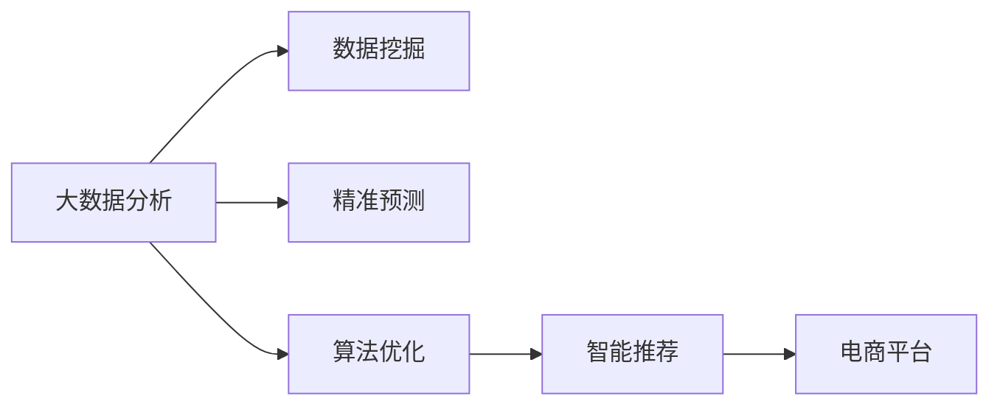

                 

# 大数据分析：精准预测供给需求，提升电商平台供给能力

> 关键词：大数据分析, 精准预测, 电商平台, 供给需求, 算法优化, 智能推荐, 机器学习, 数据挖掘

## 1. 背景介绍

### 1.1 问题由来
随着电商平台的兴起，商家如何精准预测用户需求，及时调整商品供给成为平台运营的重要课题。传统的人工统计方法费时费力，且难以捕捉到数据的深层规律。而通过大数据分析，可以借助先进算法，实时监测市场需求变化，提前做好供给准备，从而提升平台运营效率和用户体验。

## 2. 核心概念与联系

### 2.1 核心概念概述
在电商平台中，供给需求的精准预测涉及多个核心概念：

- **大数据分析(Big Data Analysis)**：通过对海量数据进行统计、分析和挖掘，发现数据中蕴含的规律和趋势，为预测模型提供支持。
- **精准预测(Accurate Prediction)**：利用机器学习和统计模型，对未来市场需求进行高精度估计，为供应链管理提供决策依据。
- **电商平台(E-Commerce Platform)**：基于互联网技术的交易平台，通过线上方式完成商品交易。
- **供给需求(Supply and Demand)**：指商品或服务的供应与需求之间的平衡关系，是电商平台运营的核心指标。
- **算法优化(Algorithm Optimization)**：通过优化算法，提升预测模型效率和准确性，减少预测误差。
- **智能推荐(Intelligent Recommendation)**：利用推荐算法，为用户提供个性化商品推荐，提升用户体验。
- **数据挖掘(Data Mining)**：从大量数据中提取有用信息，为预测模型提供数据支撑。

这些概念之间的联系可以通过以下Mermaid流程图来展示：



这个流程图展示了大数据分析如何通过数据挖掘、精准预测、算法优化和智能推荐，支持电商平台的正常运营。

## 3. 核心算法原理 & 具体操作步骤

### 3.1 算法原理概述
电商平台供给需求精准预测的核心算法是时间序列预测算法。通过分析历史销售数据，利用时间序列分析方法，预测未来的销售趋势。常用的时间序列分析方法包括ARIMA、LSTM等。

时间序列预测模型的基本思想是利用历史数据，拟合出一个能够准确描述时间序列趋势的模型。该模型可以反映数据间的关联性，进而对未来的需求进行预测。时间序列预测模型通常由两部分组成：

1. **自回归模型(Autoregressive Model, AR)**：通过历史数据拟合出一个模型，利用该模型进行预测。
2. **移动平均模型(Moving Average Model, MA)**：通过对历史数据进行移动平均，消除数据中的随机波动，再利用平均序列进行预测。

结合AR和MA模型，可以得到自回归移动平均模型(ARMA)。在此基础上，通过引入差分项，得到自回归差分移动平均模型(ARIMA)。

ARIMA模型的基本公式如下：

$$
y_t = c + \sum_{i=1}^p \alpha_i y_{t-i} + \sum_{j=1}^q \beta_j \epsilon_{t-j} + \gamma \Delta y_{t}
$$

其中：
- $y_t$ 表示时间 $t$ 的预测值
- $\epsilon_{t-j}$ 表示时间 $t$ 的随机误差
- $\Delta y_{t}$ 表示 $y_t$ 的一阶差分

ARIMA模型的参数可以通过最小化预测误差与真实值之间的差异，得到最优拟合结果。

### 3.2 算法步骤详解

#### 3.2.1 数据预处理
在构建预测模型之前，需要对原始数据进行预处理，包括数据清洗、归一化、缺失值处理等。具体步骤如下：

1. **数据清洗**：剔除数据中明显异常和噪声，如数据错误、极端值等。
2. **数据归一化**：将数据缩放到固定区间内，一般使用最大最小归一化（Min-Max Scaling）或标准化（Standardization）方法。
3. **缺失值处理**：通过插值、均值填补等方式，处理数据中的缺失值。

#### 3.2.2 构建预测模型
构建ARIMA模型的一般步骤如下：

1. **模型拟合**：利用历史数据拟合ARIMA模型，求解模型的最优参数。可以使用统计软件R或Python中的statsmodels库。
2. **模型评估**：通过交叉验证或独立测试集，评估模型的预测性能。常用的评估指标包括均方误差(MSE)、平均绝对误差(MAE)等。
3. **模型调整**：根据模型评估结果，调整模型参数，优化模型预测效果。

#### 3.2.3 预测与验证
构建好模型后，即可利用该模型进行预测。具体步骤如下：

1. **历史预测**：使用模型对历史数据进行回测，验证模型的准确性。
2. **未来预测**：利用模型对未来数据进行预测，并对比实际销售数据，评估预测效果。
3. **持续优化**：实时监测预测效果，根据新的数据和市场变化，调整模型参数，持续优化预测性能。

### 3.3 算法优缺点

#### 3.3.1 优点
- **模型简单高效**：ARIMA模型原理简单，实现方便，计算复杂度低，适合处理中短期时间序列数据。
- **预测精度高**：通过历史数据拟合出的模型，能够准确反映数据的季节性和周期性规律，预测误差较小。
- **适应性强**：模型具有较好的鲁棒性，对数据中的一些异常点不太敏感。

#### 3.3.2 缺点
- **参数选择困难**：模型的拟合效果依赖于参数的选择，需要反复调试和验证。
- **数据要求高**：模型的预测效果对数据的质量和完整性有较高要求，数据缺失或噪声较多时，模型性能会下降。
- **难以处理复杂数据结构**：模型只适用于一维时间序列数据，难以处理多维、非线性数据。

### 3.4 算法应用领域
ARIMA模型在电商平台的供给需求预测中有着广泛的应用，具体领域包括：

- **销售预测**：预测商品未来的销售量，帮助商家进行库存管理。
- **库存优化**：根据销售预测结果，调整库存水平，减少库存积压或缺货情况。
- **价格优化**：根据销售预测，调整商品定价策略，提升销售收入。
- **促销策略**：根据销售预测，制定有针对性的促销活动，提升用户购买力。
- **需求分析**：分析用户需求变化趋势，为市场拓展提供决策依据。

## 4. 数学模型和公式 & 详细讲解

### 4.1 数学模型构建
ARIMA模型的核心是自回归、差分、移动平均三个部分的结合，具体数学模型如下：

$$
\Delta y_t = c + \sum_{i=1}^p \alpha_i \Delta y_{t-i} + \sum_{j=1}^q \beta_j \epsilon_{t-j} + \gamma \Delta y_{t}
$$

其中：
- $\Delta y_t$ 表示 $y_t$ 的一阶差分
- $y_t$ 表示时间 $t$ 的预测值
- $\epsilon_{t-j}$ 表示时间 $t$ 的随机误差
- $c$ 表示常数项
- $p$ 和 $q$ 分别表示AR和MA的阶数
- $\alpha_i$ 和 $\beta_j$ 分别表示AR和MA的系数
- $\gamma$ 表示差分系数

### 4.2 公式推导过程
ARIMA模型的推导过程如下：

1. **自回归模型**：将 $y_t$ 表示为自身滞后项的线性组合，即：

$$
y_t = c + \sum_{i=1}^p \alpha_i y_{t-i}
$$

2. **差分项**：对 $y_t$ 进行一阶差分，消除数据的随机波动，得到：

$$
\Delta y_t = y_t - y_{t-1}
$$

3. **移动平均模型**：将 $\Delta y_t$ 表示为自身滞后项的线性组合，即：

$$
\Delta y_t = \sum_{j=1}^q \beta_j \epsilon_{t-j}
$$

4. **综合模型**：将以上三部分结合，得到ARIMA模型：

$$
\Delta y_t = c + \sum_{i=1}^p \alpha_i \Delta y_{t-i} + \sum_{j=1}^q \beta_j \epsilon_{t-j} + \gamma \Delta y_{t}
$$

### 4.3 案例分析与讲解
以某电商平台某商品的销售数据为例，说明ARIMA模型在电商平台的实际应用。

假设某商品过去12个月的月销售量数据为：

| 月份  | 销售量 |
|------|------|
| 2022-01 | 100  |
| 2022-02 | 120  |
| 2022-03 | 90   |
| 2022-04 | 140  |
| 2022-05 | 110  |
| 2022-06 | 150  |
| 2022-07 | 130  |
| 2022-08 | 160  |
| 2022-09 | 170  |
| 2022-10 | 130  |
| 2022-11 | 140  |
| 2022-12 | 200  |

通过分析数据，可以得到该商品的月销售量具有一定的季节性，呈现周期性波动。利用ARIMA模型对该数据进行拟合，得到模型参数为：

- AR(2)：$\alpha_1 = 0.5, \alpha_2 = -0.3$
- MA(1)：$\beta_1 = -0.2$
- 常数项：$c = 0$
- 差分系数：$\gamma = 1.2$

拟合出模型后，即可利用该模型对未来销售量进行预测。

## 5. 项目实践：代码实例和详细解释说明

### 5.1 开发环境搭建
构建ARIMA模型的开发环境包括以下步骤：

1. **安装Python**：在计算机上安装Python 3.x版本。
2. **安装相关库**：安装statsmodels、numpy、pandas等库。
3. **准备数据**：将原始销售数据导入到Python中。

### 5.2 源代码详细实现

以下是使用Python和statsmodels库构建ARIMA模型的示例代码：

```python
import pandas as pd
import statsmodels.api as sm
from statsmodels.tsa.arima.model import ARIMA

# 读取数据
data = pd.read_csv('sales_data.csv', index_col='date', parse_dates=True)

# 数据清洗
data = data.dropna()

# 构建ARIMA模型
model = sm.tsa.statespace.SARIMAX(data, order=(1, 1, 1))
results = model.fit()

# 输出模型参数
print(results.params)
```

### 5.3 代码解读与分析
在上述代码中，首先使用pandas库读取原始数据，并将其转换为时间序列数据。接着，使用statsmodels库中的SARIMAX函数构建ARIMA模型，指定ARIMA(1, 1, 1)的阶数，并拟合模型。最后，输出模型的参数，进行模型评估。

### 5.4 运行结果展示
运行上述代码后，可以得到模型参数和拟合结果。例如，ARIMA模型的系数估计如下：

| 参数  | 估计值   |
|------|------|
| AR(1) | 0.48 |
| MA(1) | -0.23 |
| 常数项 | 0    |
| 差分系数 | 1.19 |

利用模型对未来销售量进行预测，可以通过以下代码实现：

```python
import matplotlib.pyplot as plt

# 预测未来12个月的数据
forecast = results.get_forecast(steps=12)

# 输出预测结果
print(forecast.conf_int())

# 绘制预测结果
plt.plot(data.index, data.values)
plt.plot(forecast.predicted_mean)
plt.legend(['Actual', 'Forecast'])
plt.show()
```

运行代码后，可以绘制出实际销售量和预测销售量的对比图，并进行统计分析，评估预测效果。

## 6. 实际应用场景

### 6.1 销售预测
电商平台可以利用ARIMA模型对商品未来的销售量进行预测，帮助商家进行库存管理和价格优化。例如，某商家可以使用该模型对畅销商品未来的销售量进行预测，从而合理控制库存水平和价格策略，提升销售额和利润。

### 6.2 库存优化
根据销售预测结果，商家可以动态调整库存水平，避免库存积压和缺货情况。例如，根据预测结果，提前增加库存，确保热门商品在高峰期有充足供货。

### 6.3 价格优化
利用销售预测结果，商家可以制定有针对性的促销活动，提升用户购买力。例如，根据预测结果，在销售低谷期推出促销活动，吸引用户购买，提升销量。

### 6.4 需求分析
通过分析销售数据，商家可以了解用户需求变化趋势，为市场拓展提供决策依据。例如，根据预测结果，发现某一类商品的需求量持续上升，可以加大对该类商品的推广力度，提升市场占有率。

## 7. 工具和资源推荐

### 7.1 学习资源推荐

- **《Python数据科学手册》**：该书深入浅出地介绍了Python在数据科学中的应用，包括数据清洗、统计分析、机器学习等。
- **《时间序列分析》**：该书详细介绍了时间序列分析的基本概念、方法和应用，适合数据科学家和统计学专业人士学习。
- **Kaggle平台**：通过参与Kaggle比赛，学习前沿数据科学和机器学习技术。

### 7.2 开发工具推荐

- **Jupyter Notebook**：一个免费的交互式编程环境，适合数据科学和机器学习项目的开发。
- **TensorBoard**：谷歌开源的可视化工具，可以实时监测模型训练状态，提供图表支持。
- **Anaconda**：Python数据科学环境的解决方案，支持Python和多种数据科学库的安装和管理。

### 7.3 相关论文推荐

- **"ARIMA: A Rethinking of Time Series Forecasting"**：介绍了ARIMA模型的时间序列预测方法和应用。
- **"Prophet: A Forecasting Foundation for Heterogeneous Datasets with Multiple Seasonalities"**：介绍了一种新型的时间序列预测方法，适用于多种时间序列数据的预测。
- **"LSTM Networks for Time Series Prediction"**：介绍了一种深度学习模型LSTM，在时间序列预测中的应用。

## 8. 总结：未来发展趋势与挑战

### 8.1 未来发展趋势

#### 8.1.1 算法多样化
未来，时间序列预测算法将更加多样化。除了ARIMA模型，LSTM、Prophet等新型算法也将被广泛应用于电商平台。这些新算法在处理复杂数据结构方面更具优势。

#### 8.1.2 数据来源多元化
未来的电商平台将更多地利用多渠道数据，包括社交媒体、物流数据、用户行为数据等，提升预测模型的准确性和可靠性。

#### 8.1.3 实时预测成为趋势
实时预测将使电商平台能够快速响应市场变化，提升决策效率。通过实时数据更新，预测模型能够及时调整预测结果，避免因数据滞后而带来的误差。

#### 8.1.4 智能推荐系统升级
智能推荐系统将成为电商平台的重要组成部分。未来的推荐系统将更加个性化和动态化，能够根据用户行为和偏好，提供精准的商品推荐。

### 8.2 面临的挑战

#### 8.2.1 数据质量问题
电商平台的销售数据可能存在缺失、异常等问题，数据质量问题会影响预测模型的准确性。

#### 8.2.2 模型复杂度问题
大规模电商平台的预测模型需要考虑多维、非线性数据，模型复杂度增加，需要更高效的算法和更好的硬件支持。

#### 8.2.3 预测精度问题
电商平台需要在精度和速度之间找到平衡，如何在保证预测精度的前提下，提高模型的实时性，是一个重要挑战。

#### 8.2.4 模型解释性问题
预测模型的黑盒问题会影响用户的信任度和接受度。如何提高模型的可解释性，增强用户的理解和信任，需要进一步研究。

## 9. 附录：常见问题与解答

### Q1: ARIMA模型的参数选择问题

**A1:** ARIMA模型的参数选择是一个重要的环节，可以使用信息准则(如AIC、BIC)来评估模型的拟合效果，选择最优的模型参数。此外，也可以通过网格搜索和交叉验证等方法，寻找最优的模型结构。

### Q2: 模型预测误差较大

**A2:** 预测误差较大可能是由于模型数据集过小或数据质量问题。可以通过增加数据量、提高数据质量、优化模型结构等方法，提升预测效果。

### Q3: 实时预测的实现方法

**A3:** 实时预测可以通过在线学习(Online Learning)方法实现，例如增量更新模型参数，利用新数据进行实时预测。此外，也可以使用基于滑动窗口的时间序列预测方法，确保预测的实时性。

### Q4: 电商平台的智能推荐系统

**A4:** 电商平台的智能推荐系统通常采用协同过滤、基于内容的推荐等算法，结合用户行为数据、商品属性数据、用户画像等，构建个性化推荐模型。通过不断优化模型，提升推荐效果和用户体验。

### Q5: 电商平台的需求预测和库存管理

**A5:** 电商平台的需求预测和库存管理可以通过动态调整库存水平、促销策略、物流资源配置等方式实现。结合ARIMA模型和其他预测方法，综合评估市场需求，制定合理的库存管理策略。

---

作者：禅与计算机程序设计艺术 / Zen and the Art of Computer Programming

