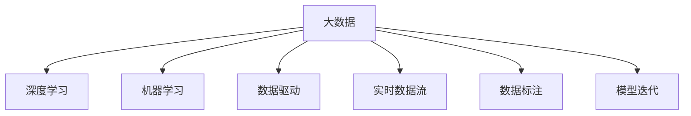

                 

## 1. 背景介绍

### 1.1 问题由来

在人工智能（AI）的快速发展中，大数据扮演了至关重要的角色。从深度学习的突破，到机器学习的广泛应用，再到数据驱动的决策支持系统，大数据在每一个环节都发挥着举足轻重的作用。大数据的广泛应用不仅极大地推动了AI技术的创新，还促进了各行各业的智能化转型。本文将从数据规模、数据多样性、数据质量等多个维度，深入探讨大数据在AI发展中的重要性，并展望其未来发展趋势和挑战。

### 1.2 问题核心关键点

大数据在AI发展中的重要性体现在以下几个方面：
1. **数据规模**：大规模数据集为AI模型提供了丰富的训练样本，使得模型能够学习到更普遍、更抽象的特征和模式。
2. **数据多样性**：不同类型的数据源（如文本、图像、音频等）为AI模型的多模态学习提供了条件，拓宽了模型的应用场景。
3. **数据质量**：高质量的数据确保了模型的稳定性和可靠性，减少了模型误判和过拟合的风险。
4. **数据标注**：丰富的标注数据集为监督学习提供了有效的监督信号，显著提升了模型的泛化能力。
5. **数据更新**：动态更新的数据流为模型的持续学习和适应提供了持续的训练信号，提高了模型的实时性。

这些核心点共同构成了大数据在AI发展中的基石，推动了AI技术的不断进步和广泛应用。

## 2. 核心概念与联系

### 2.1 核心概念概述

为更好地理解大数据在AI发展中的作用，本节将介绍几个核心概念：

- **大数据**：指规模庞大的数据集，通常以GB、TB甚至PB级为单位。大数据的特点包括体量大、种类多、速度快、价值密度低。
- **深度学习**：基于神经网络的机器学习范式，通过多层非线性变换提取特征，实现复杂的模式识别和预测。
- **机器学习**：通过数据驱动的学习算法，使机器能够从数据中学习规律，实现自主决策和推理。
- **数据驱动**：以数据为决策依据，通过数据分析和模型训练支持决策制定，强调数据的中心地位。
- **实时数据流**：指持续生成、实时处理的数据流，为大规模分布式计算和实时分析提供了条件。
- **数据标注**：指为数据集添加标签或注释，帮助机器学习算法识别和分类数据。
- **模型迭代**：通过持续的数据输入和模型更新，不断优化模型性能，适应新的数据分布。

这些核心概念之间的逻辑关系可以通过以下Mermaid流程图来展示：



这个流程图展示了大数据与AI技术的核心概念及其关系：

1. 大数据为深度学习、机器学习等AI技术提供了数据支持。
2. 通过数据标注和实时数据流，确保模型在动态数据环境下持续学习。
3. 数据驱动和模型迭代确保了AI技术的实时性、适应性和可靠性。

这些概念共同构成了大数据在AI发展中的支撑框架，使得AI技术能够不断优化和扩展。

## 3. 核心算法原理 & 具体操作步骤

### 3.1 算法原理概述

大数据在AI发展中的重要性，主要体现在以下几个方面：

- **数据预处理**：大数据集需要通过预处理技术（如去噪、归一化、降维等）进行清洗和预处理，以便于后续分析和建模。
- **数据存储与管理**：大规模数据集需要高效的存储和管理技术，确保数据的安全、可靠和高效访问。
- **分布式计算**：大数据集通常需要借助分布式计算框架（如Hadoop、Spark等）进行并行计算和处理，以提升计算效率。
- **模型训练**：通过大规模数据集训练深度学习模型，提高模型的泛化能力和预测准确度。
- **实时分析**：实时数据流需要借助流计算框架（如Flink、Storm等）进行实时分析和处理，以支持实时决策和响应。

这些步骤构成了大数据在AI发展中的主要流程，从数据预处理到模型训练，再到实时分析，每一步都离不开大数据的支持。

### 3.2 算法步骤详解

以深度学习模型的训练为例，大数据在其中的具体应用流程如下：

**Step 1: 数据收集与预处理**
- 收集与目标任务相关的数据集，包括结构化数据（如表格、数据库记录）和非结构化数据（如文本、图像、音频等）。
- 对数据进行清洗、去噪、归一化等预处理，确保数据质量和一致性。

**Step 2: 数据存储与管理**
- 使用分布式文件系统（如Hadoop HDFS、Amazon S3等）存储大规模数据集。
- 应用数据管理工具（如Apache Hive、Presto等）进行数据查询和分析。

**Step 3: 分布式计算与模型训练**
- 使用分布式计算框架（如Apache Spark、TensorFlow等）进行并行计算和模型训练。
- 将训练好的模型保存为二进制文件或模型库，以便后续调用和使用。

**Step 4: 实时分析与模型迭代**
- 使用流计算框架（如Apache Kafka、Apache Flink等）处理实时数据流。
- 基于实时数据流进行模型迭代训练，更新模型参数，提升模型实时性。

### 3.3 算法优缺点

大数据在AI发展中具有以下优点：
1. **数据丰富性**：大规模数据集提供了丰富的训练样本，使得模型能够学习到更丰富的特征和模式。
2. **计算效率**：分布式计算框架提升了模型训练和实时分析的计算效率，缩短了AI模型迭代周期。
3. **实时响应**：实时数据流技术实现了实时分析和响应，提高了AI系统的实时性和适用性。
4. **可扩展性**：分布式存储和计算框架支持大规模数据的存储和处理，确保了系统的可扩展性。

同时，大数据也存在一定的局限性：
1. **数据隐私和安全**：大规模数据集可能涉及敏感信息，数据隐私和安全问题不容忽视。
2. **数据质量控制**：数据预处理和清洗的复杂性增加了数据质量控制的难度。
3. **存储成本**：大规模数据集需要大容量存储，存储成本较高。
4. **计算资源需求**：分布式计算和存储需要强大的计算资源支持，增加了系统复杂度。

尽管存在这些局限性，但就目前而言，大数据在AI发展中仍是不可或缺的重要基础。未来相关研究的重点在于如何进一步优化数据预处理和存储技术，提升数据质量和计算效率，同时兼顾数据隐私和存储成本等挑战。

### 3.4 算法应用领域

大数据在AI发展中的应用领域非常广泛，涵盖多个行业和技术领域，例如：

- **自然语言处理**：利用大规模文本数据集训练语言模型，提升语音识别、机器翻译、文本分类等任务的效果。
- **计算机视觉**：通过大规模图像数据集训练图像识别和分类模型，提升图像识别、人脸识别、物体检测等任务的性能。
- **推荐系统**：利用用户行为数据和商品数据，通过深度学习模型实现个性化推荐，提升用户体验。
- **金融风险管理**：利用金融市场数据和交易数据，通过机器学习模型进行风险预测和资产定价。
- **智能制造**：利用工业数据和设备数据，通过大数据分析和深度学习，实现智能生产调度、质量检测和故障预测。
- **智慧医疗**：利用医疗数据和患者数据，通过大数据分析和机器学习，提升疾病诊断和治疗效果。

除了这些常见领域，大数据在更多新兴领域中也有着广阔的应用前景，如智能城市、智能交通、智能安防等，为各行各业带来了深刻的变革和创新。

## 4. 数学模型和公式 & 详细讲解 & 举例说明

### 4.1 数学模型构建

本节将使用数学语言对大数据在AI发展中的重要性进行更加严格的刻画。

记大数据集为 $D=\{d_1, d_2, \ldots, d_N\}$，其中 $d_i$ 表示第 $i$ 条数据。假设目标是构建一个深度学习模型 $M_{\theta}$，其中 $\theta$ 为模型参数。

定义模型 $M_{\theta}$ 在数据集 $D$ 上的损失函数为 $\mathcal{L}(M_{\theta}, D)$，表示模型输出与真实标签之间的差异。常见的损失函数包括均方误差损失、交叉熵损失等。

### 4.2 公式推导过程

以均方误差损失函数为例，其定义如下：

$$
\mathcal{L}(M_{\theta}, D) = \frac{1}{N} \sum_{i=1}^N (y_i - M_{\theta}(x_i))^2
$$

其中 $y_i$ 为第 $i$ 条数据的真实标签，$x_i$ 为数据特征。

模型的训练目标是最小化损失函数，即找到最优参数：

$$
\theta^* = \mathop{\arg\min}_{\theta} \mathcal{L}(M_{\theta}, D)
$$

在实践中，我们通常使用基于梯度的优化算法（如SGD、Adam等）来近似求解上述最优化问题。设 $\eta$ 为学习率，则参数的更新公式为：

$$
\theta \leftarrow \theta - \eta \nabla_{\theta}\mathcal{L}(\theta)
$$

其中 $\nabla_{\theta}\mathcal{L}(\theta)$ 为损失函数对参数 $\theta$ 的梯度，可通过反向传播算法高效计算。

### 4.3 案例分析与讲解

以推荐系统为例，探讨大数据在该领域的应用：

假设推荐系统需要预测用户对每个商品的兴趣评分 $y_i$，模型输入为商品特征 $x_i$。目标是最小化预测评分与真实评分之间的均方误差：

$$
\mathcal{L}(M_{\theta}, D) = \frac{1}{N} \sum_{i=1}^N (y_i - M_{\theta}(x_i))^2
$$

模型训练过程如下：

1. **数据收集与预处理**：收集用户行为数据（如点击、浏览、购买等）和商品特征数据，进行去噪、归一化等预处理。
2. **数据存储与管理**：将数据存储在分布式文件系统（如Hadoop HDFS）中，使用数据管理工具（如Apache Hive）进行数据查询和分析。
3. **分布式计算与模型训练**：使用分布式计算框架（如Apache Spark）进行并行计算和模型训练，更新模型参数。
4. **实时分析与模型迭代**：利用实时数据流（如Apache Kafka）处理新增用户行为数据，通过模型迭代训练提升实时推荐精度。

通过以上步骤，利用大数据构建的推荐系统能够实时捕捉用户兴趣变化，提供个性化推荐，显著提升用户体验和满意度。

## 5. 项目实践：代码实例和详细解释说明

### 5.1 开发环境搭建

在进行大数据在AI发展中的实践时，需要准备好开发环境。以下是使用Python进行PyTorch开发的环境配置流程：

1. 安装Anaconda：从官网下载并安装Anaconda，用于创建独立的Python环境。

2. 创建并激活虚拟环境：
```bash
conda create -n pytorch-env python=3.8 
conda activate pytorch-env
```

3. 安装PyTorch：根据CUDA版本，从官网获取对应的安装命令。例如：
```bash
conda install pytorch torchvision torchaudio cudatoolkit=11.1 -c pytorch -c conda-forge
```

4. 安装各类工具包：
```bash
pip install numpy pandas scikit-learn matplotlib tqdm jupyter notebook ipython
```

完成上述步骤后，即可在`pytorch-env`环境中开始大数据在AI发展中的实践。

### 5.2 源代码详细实现

下面我们以自然语言处理（NLP）任务为例，给出使用Transformers库对BERT模型进行训练的PyTorch代码实现。

首先，定义NLP任务的数据处理函数：

```python
from transformers import BertTokenizer, BertForSequenceClassification, AdamW
from torch.utils.data import Dataset
import torch

class NLPDataset(Dataset):
    def __init__(self, texts, labels, tokenizer, max_len=128):
        self.texts = texts
        self.labels = labels
        self.tokenizer = tokenizer
        self.max_len = max_len
        
    def __len__(self):
        return len(self.texts)
    
    def __getitem__(self, item):
        text = self.texts[item]
        label = self.labels[item]
        
        encoding = self.tokenizer(text, return_tensors='pt', max_length=self.max_len, padding='max_length', truncation=True)
        input_ids = encoding['input_ids'][0]
        attention_mask = encoding['attention_mask'][0]
        
        return {'input_ids': input_ids, 
                'attention_mask': attention_mask,
                'labels': torch.tensor(label, dtype=torch.long)}
```

然后，定义模型和优化器：

```python
model = BertForSequenceClassification.from_pretrained('bert-base-cased', num_labels=2)
optimizer = AdamW(model.parameters(), lr=2e-5)
```

接着，定义训练和评估函数：

```python
device = torch.device('cuda') if torch.cuda.is_available() else torch.device('cpu')
model.to(device)

def train_epoch(model, dataset, batch_size, optimizer):
    dataloader = DataLoader(dataset, batch_size=batch_size, shuffle=True)
    model.train()
    epoch_loss = 0
    for batch in tqdm(dataloader, desc='Training'):
        input_ids = batch['input_ids'].to(device)
        attention_mask = batch['attention_mask'].to(device)
        labels = batch['labels'].to(device)
        model.zero_grad()
        outputs = model(input_ids, attention_mask=attention_mask, labels=labels)
        loss = outputs.loss
        epoch_loss += loss.item()
        loss.backward()
        optimizer.step()
    return epoch_loss / len(dataloader)

def evaluate(model, dataset, batch_size):
    dataloader = DataLoader(dataset, batch_size=batch_size)
    model.eval()
    preds, labels = [], []
    with torch.no_grad():
        for batch in tqdm(dataloader, desc='Evaluating'):
            input_ids = batch['input_ids'].to(device)
            attention_mask = batch['attention_mask'].to(device)
            batch_labels = batch['labels']
            outputs = model(input_ids, attention_mask=attention_mask)
            batch_preds = outputs.logits.argmax(dim=2).to('cpu').tolist()
            batch_labels = batch_labels.to('cpu').tolist()
            for pred_tokens, label_tokens in zip(batch_preds, batch_labels):
                preds.append(pred_tokens)
                labels.append(label_tokens)
                
    print(classification_report(labels, preds))
```

最后，启动训练流程并在测试集上评估：

```python
epochs = 5
batch_size = 16

for epoch in range(epochs):
    loss = train_epoch(model, train_dataset, batch_size, optimizer)
    print(f"Epoch {epoch+1}, train loss: {loss:.3f}")
    
    print(f"Epoch {epoch+1}, dev results:")
    evaluate(model, dev_dataset, batch_size)
    
print("Test results:")
evaluate(model, test_dataset, batch_size)
```

以上就是使用PyTorch对BERT模型进行自然语言处理任务训练的完整代码实现。可以看到，Transformers库的强大封装使得NLP任务的开发变得简洁高效。

### 5.3 代码解读与分析

让我们再详细解读一下关键代码的实现细节：

**NLPDataset类**：
- `__init__`方法：初始化文本、标签、分词器等关键组件。
- `__len__`方法：返回数据集的样本数量。
- `__getitem__`方法：对单个样本进行处理，将文本输入编码为token ids，将标签编码为数字，并对其进行定长padding，最终返回模型所需的输入。

**模型训练过程**：
- 使用PyTorch的DataLoader对数据集进行批次化加载，供模型训练和推理使用。
- 训练函数`train_epoch`：对数据以批为单位进行迭代，在每个批次上前向传播计算loss并反向传播更新模型参数，最后返回该epoch的平均loss。
- 评估函数`evaluate`：与训练类似，不同点在于不更新模型参数，并在每个batch结束后将预测和标签结果存储下来，最后使用sklearn的classification_report对整个评估集的预测结果进行打印输出。

**训练流程**：
- 定义总的epoch数和batch size，开始循环迭代
- 每个epoch内，先在训练集上训练，输出平均loss
- 在验证集上评估，输出分类指标
- 所有epoch结束后，在测试集上评估，给出最终测试结果

可以看到，PyTorch配合Transformers库使得BERT模型训练的代码实现变得简洁高效。开发者可以将更多精力放在数据处理、模型改进等高层逻辑上，而不必过多关注底层的实现细节。

当然，工业级的系统实现还需考虑更多因素，如模型的保存和部署、超参数的自动搜索、更灵活的任务适配层等。但核心的训练流程基本与此类似。

## 6. 实际应用场景

### 6.1 智能客服系统

基于大数据的智能客服系统能够实时处理大量的客户咨询请求，通过自然语言处理技术自动识别和解答常见问题。系统可以通过大数据分析识别出热门问题和常见错误，进行预处理和优化，提升客户满意度。

在技术实现上，可以收集企业内部的历史客服对话记录，将问题和最佳答复构建成监督数据，在此基础上对预训练语言模型进行微调。微调后的语言模型能够自动理解用户意图，匹配最合适的答案模板进行回复。对于客户提出的新问题，还可以接入检索系统实时搜索相关内容，动态组织生成回答。如此构建的智能客服系统，能大幅提升客户咨询体验和问题解决效率。

### 6.2 金融舆情监测

大数据在金融领域的应用广泛，通过实时收集金融市场数据和舆情信息，可以构建实时监控系统，及时发现市场异常和风险事件。系统可以基于自然语言处理技术对舆情文本进行情感分析，识别负面新闻和谣言，实现快速预警和应对。

具体而言，可以收集金融领域相关的新闻、报道、评论等文本数据，并对其进行主题标注和情感标注。在此基础上对预训练语言模型进行微调，使其能够自动判断文本属于何种主题，情感倾向是正面、中性还是负面。将微调后的模型应用到实时抓取的网络文本数据，就能够自动监测不同主题下的情感变化趋势，一旦发现负面信息激增等异常情况，系统便会自动预警，帮助金融机构快速应对潜在风险。

### 6.3 个性化推荐系统

大数据在个性化推荐系统中发挥了重要作用。通过收集用户的浏览、点击、购买等行为数据，生成高维稀疏特征向量，构建用户-物品交互矩阵。利用大数据分析和深度学习模型，可以实现用户兴趣的精准刻画和推荐结果的优化。

在实践中，可以收集用户行为数据（如点击、浏览、购买等）和商品数据，利用大数据分析和深度学习模型，构建推荐模型。模型训练过程如下：
1. **数据收集与预处理**：收集用户行为数据和商品数据，进行去噪、归一化等预处理。
2. **数据存储与管理**：将数据存储在分布式文件系统（如Hadoop HDFS）中，使用数据管理工具（如Apache Hive）进行数据查询和分析。
3. **分布式计算与模型训练**：使用分布式计算框架（如Apache Spark）进行并行计算和模型训练，更新模型参数。
4. **实时分析与模型迭代**：利用实时数据流（如Apache Kafka）处理新增用户行为数据，通过模型迭代训练提升实时推荐精度。

通过以上步骤，利用大数据构建的推荐系统能够实时捕捉用户兴趣变化，提供个性化推荐，显著提升用户体验和满意度。

### 6.4 未来应用展望

随着大数据和AI技术的不断进步，其在更多领域的应用前景将更加广阔。

在智慧医疗领域，基于大数据的医疗数据分析和机器学习，可以实现疾病预测、个性化治疗方案制定等功能，提升医疗服务的智能化水平。

在智能教育领域，利用大数据分析学生的学习行为和成绩数据，实现个性化推荐和智能辅导，提升教育公平和教学效果。

在智慧城市治理中，通过大数据分析和机器学习，可以实现城市事件监测、舆情分析、应急指挥等功能，提高城市管理的自动化和智能化水平。

此外，在企业生产、社会治理、文娱传媒等众多领域，大数据和AI技术的深度融合将带来更深远的变革和创新。

## 7. 工具和资源推荐

### 7.1 学习资源推荐

为了帮助开发者系统掌握大数据在AI发展中的理论基础和实践技巧，这里推荐一些优质的学习资源：

1. **《大数据在AI发展中的重要性》系列博文**：由AI领域专家撰写，深入浅出地介绍了大数据在AI发展中的关键作用和应用场景。

2. **CS229《机器学习》课程**：斯坦福大学开设的机器学习课程，涵盖了机器学习算法和大数据处理的基础知识，是学习大数据在AI应用中的重要资源。

3. **《深度学习入门》书籍**：深度学习领域的入门级书籍，介绍了深度学习模型构建和训练的基本原理，包括大数据在模型训练中的应用。

4. **Kaggle竞赛平台**：通过参与数据科学竞赛，实践大数据在实际问题中的应用，提升数据处理和模型训练的技能。

5. **Google Cloud AI平台**：提供了丰富的大数据和AI工具，支持云上数据处理和模型训练，是学习大数据在AI应用中的实用工具。

通过这些资源的学习实践，相信你一定能够快速掌握大数据在AI发展中的精髓，并用于解决实际的AI问题。

### 7.2 开发工具推荐

高效的开发离不开优秀的工具支持。以下是几款用于大数据在AI发展中的开发工具：

1. **Apache Hadoop**：分布式文件系统，支持大规模数据的存储和访问。
2. **Apache Spark**：分布式计算框架，支持大规模数据的并行计算和处理。
3. **Apache Hive**：数据管理工具，支持分布式数据查询和分析。
4. **Apache Kafka**：实时数据流处理系统，支持大数据的实时采集和处理。
5. **PyTorch**：深度学习框架，支持模型的训练和推理。
6. **TensorFlow**：深度学习框架，支持模型的训练和部署。
7. **Jupyter Notebook**：交互式编程环境，支持代码编写和结果展示。

合理利用这些工具，可以显著提升大数据在AI发展中的开发效率，加快创新迭代的步伐。

### 7.3 相关论文推荐

大数据在AI发展中的应用源于学界的持续研究。以下是几篇奠基性的相关论文，推荐阅读：

1. **《Hadoop: A Distributed File System》**：介绍Hadoop分布式文件系统的设计原理和实现方法。
2. **《MapReduce: Simplified Data Processing on Large Clusters》**：介绍MapReduce分布式计算模型的原理和实现方法。
3. **《Large-Scale Machine Learning with Distributed TensorFlow》**：介绍TensorFlow在大规模数据集上的分布式训练方法。
4. **《Scalable Deep Learning in Image Classification using Apache Spark》**：介绍在Apache Spark上实现大规模图像分类任务的实现方法。
5. **《Distributed Deep Learning with PyTorch》**：介绍PyTorch在大规模数据集上的分布式训练方法。

这些论文代表了大数据在AI发展中的应用方向，通过学习这些前沿成果，可以帮助研究者把握学科前进方向，激发更多的创新灵感。

## 8. 总结：未来发展趋势与挑战

### 8.1 总结

本文对大数据在AI发展中的重要性进行了全面系统的介绍。首先阐述了大数据在AI发展中的关键作用，包括数据规模、数据多样性、数据质量等多个维度。其次，从数据预处理、数据存储、分布式计算、模型训练、实时分析等多个方面，详细讲解了大数据在AI发展中的核心流程。最后，展望了大数据在更多领域的应用前景，探讨了未来发展趋势和面临的挑战。

通过本文的系统梳理，可以看到，大数据在AI发展中扮演了举足轻重的角色，极大地推动了AI技术的创新和应用。未来，随着大数据和AI技术的不断进步，其在更多领域的探索应用将更加广泛，为各行各业带来深刻的变革和创新。

### 8.2 未来发展趋势

展望未来，大数据在AI发展中的趋势将更加明显：

1. **数据质量提升**：通过数据清洗和预处理技术，提升大数据的质量和一致性，确保模型训练的稳定性和可靠性。
2. **数据隐私保护**：在大数据应用过程中，加强数据隐私保护和匿名化处理，确保用户隐私和数据安全。
3. **分布式计算优化**：应用更多分布式计算和存储技术，提升大数据处理的效率和性能，支持更大规模数据的处理。
4. **实时分析加速**：应用流计算和实时数据处理技术，实现数据流的实时分析和处理，提升系统响应速度和实时性。
5. **跨领域融合**：大数据和AI技术的融合将更加深入，推动更多跨领域的应用，如医疗、金融、教育等领域。

这些趋势凸显了大数据在AI发展中的重要性和潜力，为未来AI技术的不断进步和应用拓展提供了坚实的基础。

### 8.3 面临的挑战

尽管大数据在AI发展中具有重要意义，但在实际应用中也面临诸多挑战：

1. **数据隐私和安全**：大规模数据集可能涉及敏感信息，数据隐私和安全问题不容忽视。
2. **数据质量控制**：数据预处理和清洗的复杂性增加了数据质量控制的难度。
3. **存储成本**：大规模数据集需要大容量存储，存储成本较高。
4. **计算资源需求**：分布式计算和存储需要强大的计算资源支持，增加了系统复杂度。
5. **模型复杂性**：大规模数据集的复杂性增加了模型训练的难度，可能导致过拟合和泛化性能下降。

尽管存在这些挑战，但通过持续的技术创新和优化，相信大数据在AI发展中的重要性将更加凸显，成为AI技术不断进步和应用拓展的重要支撑。

### 8.4 研究展望

未来，大数据在AI发展中的研究将集中在以下几个方面：

1. **数据清洗和预处理**：开发高效的数据清洗和预处理技术，提升数据质量和一致性。
2. **分布式计算优化**：应用更多分布式计算和存储技术，提升大数据处理的效率和性能。
3. **数据隐私保护**：加强数据隐私保护和匿名化处理，确保用户隐私和数据安全。
4. **跨领域应用**：推动大数据和AI技术的跨领域应用，提升更多行业的信息化水平和智能化能力。
5. **模型复杂性控制**：开发更简单高效的模型架构，提升模型的泛化能力和训练效率。

这些研究方向将引领大数据在AI发展中的不断进步，为未来AI技术的创新和应用拓展提供更多的支撑。

## 9. 附录：常见问题与解答

**Q1：大数据在AI发展中为什么如此重要？**

A: 大数据在AI发展中的重要性体现在以下几个方面：
1. **数据规模**：大规模数据集提供了丰富的训练样本，使得模型能够学习到更丰富的特征和模式。
2. **数据多样性**：不同类型的数据源（如文本、图像、音频等）为AI模型的多模态学习提供了条件，拓宽了模型的应用场景。
3. **数据质量**：高质量的数据确保了模型的稳定性和可靠性，减少了模型误判和过拟合的风险。
4. **数据标注**：丰富的标注数据集为监督学习提供了有效的监督信号，显著提升了模型的泛化能力。
5. **数据更新**：动态更新的数据流为模型的持续学习和适应提供了持续的训练信号，提高了模型的实时性。

这些因素共同构成了大数据在AI发展中的基石，推动了AI技术的不断进步和广泛应用。

**Q2：如何在大数据中提取有用的信息？**

A: 在大数据中提取有用信息是AI应用的关键步骤，主要包括以下几个步骤：
1. **数据清洗和预处理**：对原始数据进行清洗、去噪、归一化等预处理，确保数据质量和一致性。
2. **特征工程**：通过数据变换和特征提取技术，生成更有意义的特征，提升模型的预测性能。
3. **数据建模**：选择合适的机器学习或深度学习模型，对数据进行建模和训练。
4. **模型评估和调优**：使用交叉验证和调参方法，评估模型性能并优化模型参数，提升模型泛化能力。

通过以上步骤，可以有效提取大数据中的有用信息，实现数据驱动的AI应用。

**Q3：大数据在AI发展中面临的主要挑战是什么？**

A: 大数据在AI发展中面临的主要挑战包括：
1. **数据隐私和安全**：大规模数据集可能涉及敏感信息，数据隐私和安全问题不容忽视。
2. **数据质量控制**：数据预处理和清洗的复杂性增加了数据质量控制的难度。
3. **存储成本**：大规模数据集需要大容量存储，存储成本较高。
4. **计算资源需求**：分布式计算和存储需要强大的计算资源支持，增加了系统复杂度。
5. **模型复杂性**：大规模数据集的复杂性增加了模型训练的难度，可能导致过拟合和泛化性能下降。

这些挑战需要在未来的研究和实践中不断克服，以确保大数据在AI发展中的重要性和可靠性。

**Q4：大数据在AI发展中的未来发展趋势是什么？**

A: 大数据在AI发展中的未来发展趋势包括：
1. **数据质量提升**：通过数据清洗和预处理技术，提升大数据的质量和一致性，确保模型训练的稳定性和可靠性。
2. **数据隐私保护**：在大数据应用过程中，加强数据隐私保护和匿名化处理，确保用户隐私和数据安全。
3. **分布式计算优化**：应用更多分布式计算和存储技术，提升大数据处理的效率和性能，支持更大规模数据的处理。
4. **实时分析加速**：应用流计算和实时数据处理技术，实现数据流的实时分析和处理，提升系统响应速度和实时性。
5. **跨领域融合**：大数据和AI技术的融合将更加深入，推动更多跨领域的应用，如医疗、金融、教育等领域。

这些趋势凸显了大数据在AI发展中的重要性和潜力，为未来AI技术的不断进步和应用拓展提供了坚实的基础。

---

作者：禅与计算机程序设计艺术 / Zen and the Art of Computer Programming

