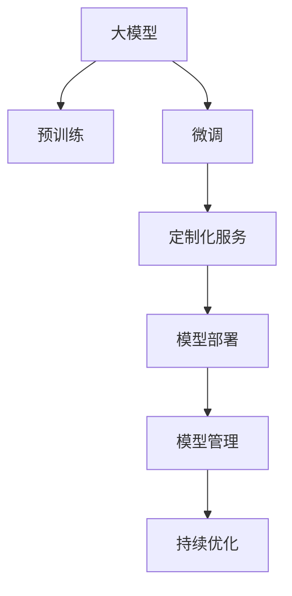

                 

# 大模型企业的定制化服务策略

## 1. 背景介绍

### 1.1 问题由来
随着人工智能(AI)和大数据技术的快速发展，越来越多的企业开始重视利用AI技术提升业务效能，增强市场竞争力。尤其是大模型企业，凭借其强大的计算能力和丰富数据资源，在图像识别、语音识别、自然语言处理(NLP)等AI领域取得了显著成就。

但是，仅仅拥有先进的技术和模型还远远不够。如何将大模型技术与企业实际业务紧密结合，提供符合企业需求的定制化服务，成为了企业AI战略的核心议题。在这一背景下，定制化服务策略应运而生。

### 1.2 问题核心关键点
企业定制化服务策略是指根据企业的具体业务需求，定制开发和部署符合企业实际情况的AI模型和服务。该策略的关键点包括：

- 理解企业需求：准确识别企业当前和未来的业务需求，明确定制化服务的范围和目标。
- 选择合适的模型和技术：基于企业需求选择合适的AI模型和算法，结合企业数据资源，设计高效的技术方案。
- 开发定制化模型：结合企业数据和场景，训练和优化符合企业需求的AI模型。
- 部署和管理服务：将训练好的模型部署到企业IT架构中，并提供持续的运维和管理服务，确保模型稳定高效运行。
- 持续优化改进：根据企业反馈和业务变化，不断迭代和优化模型和服务，提升用户体验和业务价值。

以下，我们将从算法原理、具体操作步骤、案例分析、数学模型等多个方面详细阐述大模型企业的定制化服务策略。

## 2. 核心概念与联系

### 2.1 核心概念概述

为更好地理解大模型企业的定制化服务策略，本节将介绍几个密切相关的核心概念：

- 大模型：指基于深度学习技术，在大规模数据上预训练得到的通用模型。这些模型如GPT-3、BERT等，具有强大的语言理解、图像识别等能力。
- 定制化服务：指根据企业具体需求，开发和部署符合企业实际情况的AI模型和服务。
- 预训练和微调：指先在大规模无标签数据上进行预训练，然后在企业具体任务上进行微调，优化模型性能。
- 模型部署：指将训练好的模型部署到企业IT架构中，使其能够高效服务于业务系统。
- 模型管理：指对部署的模型进行持续监控、更新和优化，保证模型稳定运行。

这些核心概念之间的逻辑关系可以通过以下Mermaid流程图来展示：



这个流程图展示了从预训练到定制化服务再到模型部署和管理的基本流程。

## 3. 核心算法原理 & 具体操作步骤
### 3.1 算法原理概述

大模型企业的定制化服务策略，本质上是一个有监督的细粒度迁移学习过程。其核心思想是：通过预训练得到的通用大模型，结合企业具体任务的数据，进行微调训练，生成符合企业需求的定制化模型。

具体来说，算法流程如下：

1. 预训练：在大规模无标签数据上对大模型进行预训练，使其学习到通用的语言或图像表示。
2. 数据准备：收集和清洗企业业务相关的标注数据集。
3. 微调训练：在标注数据集上对预训练模型进行微调，优化模型在特定任务上的性能。
4. 模型部署：将微调好的模型部署到企业IT架构中，提供实际应用。
5. 模型管理：对部署的模型进行持续监控、更新和优化，保证模型稳定运行。

### 3.2 算法步骤详解

下面将详细介绍大模型企业在定制化服务策略中的具体操作步骤。

#### 3.2.1 数据收集和预处理

1. 收集企业数据：根据企业业务需求，收集相关的文本、图像、音频等数据。
2. 数据清洗和标注：清洗数据，去除噪声和不相关数据。同时，根据业务需求进行标注，如标注文章类别、图像物体类别、语音命令等。
3. 数据集划分：将标注数据划分为训练集、验证集和测试集。

#### 3.2.2 模型选择和设计

1. 选择合适模型：根据企业需求选择合适的预训练模型，如BERT、GPT-3等。
2. 定制化模型设计：在预训练模型的基础上，设计符合企业需求的模型结构。例如，增加或减少某些层，调整学习率等。

#### 3.2.3 微调训练

1. 设置训练参数：选择合适的优化器、学习率、批次大小等。
2. 模型训练：在训练集上对模型进行训练，通过前向传播和反向传播更新模型参数。
3. 验证集评估：在验证集上评估模型性能，调整超参数。
4. 测试集测试：在测试集上测试模型性能，确认模型效果。

#### 3.2.4 模型部署

1. 模型导出：将训练好的模型导出为可用于部署的格式，如TensorFlow SavedModel、PyTorch模型文件等。
2. 部署模型：将模型部署到企业IT架构中，如AWS、Google Cloud等。
3. 接口开发：开发API接口，使模型能够被企业业务系统调用。

#### 3.2.5 模型管理

1. 监控和日志：设置监控系统，实时收集模型性能指标，如推理时间、内存使用等。同时，记录模型训练、推理过程中的日志信息。
2. 更新和迭代：根据企业反馈和业务变化，定期更新模型，迭代优化算法。
3. 安全性保障：确保模型和数据的安全性，防止泄露和篡改。

### 3.3 算法优缺点

大模型企业的定制化服务策略有以下优点：

- 高效：能够快速生成定制化模型，缩短从模型训练到实际应用的时间。
- 灵活：根据企业需求灵活调整模型结构和参数。
- 成本低：相较于从头训练模型，定制化服务策略需要的数据和计算资源较少。
- 易用性高：模型被部署为企业API接口，易于集成到现有业务系统中。

同时，该策略也存在一些局限性：

- 依赖标注数据：定制化服务策略的效果很大程度上取决于标注数据的质量和数量。标注数据不足可能导致模型性能不佳。
- 可解释性差：定制化模型通常是黑盒系统，难以解释其内部工作机制和决策逻辑。
- 资源消耗高：模型部署和推理过程可能消耗大量计算资源，特别是在高并发场景下。
- 运维复杂：模型的持续监控和管理需要专业的技术支持，运维成本较高。

尽管存在这些局限性，但就目前而言，大模型企业的定制化服务策略仍是企业AI战略的重要组成部分。未来相关研究的重点在于如何进一步降低标注数据的依赖，提高模型的可解释性和稳定性，同时兼顾成本和效率等因素。

### 3.4 算法应用领域

大模型企业的定制化服务策略，广泛应用于以下领域：

- 金融：通过定制化模型进行风险评估、信用评分、欺诈检测等。
- 医疗：利用定制化模型进行疾病诊断、药物研发、患者分诊等。
- 零售：通过定制化模型进行个性化推荐、库存管理、客户服务优化等。
- 制造：使用定制化模型进行质量检测、生产优化、供应链管理等。
- 物流：利用定制化模型进行路线规划、货物追踪、异常检测等。

除了这些传统行业，定制化服务策略还被创新性地应用于更多场景中，如智能客服、智能制造、智慧城市等，为各行各业带来了新的突破。随着预训练模型和微调方法的不断进步，相信大模型企业的定制化服务策略将拓展到更多领域，为企业的数字化转型升级提供新的技术路径。

## 4. 数学模型和公式 & 详细讲解 & 举例说明
### 4.1 数学模型构建

本节将使用数学语言对大模型企业的定制化服务策略进行更加严格的刻画。

记企业定制化模型为 $M_{\theta}$，其中 $\theta$ 为模型参数。假设企业标注数据集为 $D=\{(x_i,y_i)\}_{i=1}^N$，其中 $x_i$ 为输入，$y_i$ 为标签。

定义模型 $M_{\theta}$ 在数据样本 $(x,y)$ 上的损失函数为 $\ell(M_{\theta}(x),y)$，则在数据集 $D$ 上的经验风险为：

$$
\mathcal{L}(\theta) = \frac{1}{N} \sum_{i=1}^N \ell(M_{\theta}(x_i),y_i)
$$

微调的优化目标是最小化经验风险，即找到最优参数：

$$
\theta^* = \mathop{\arg\min}_{\theta} \mathcal{L}(\theta)
$$

在实践中，我们通常使用基于梯度的优化算法（如SGD、Adam等）来近似求解上述最优化问题。设 $\eta$ 为学习率，$\lambda$ 为正则化系数，则参数的更新公式为：

$$
\theta \leftarrow \theta - \eta \nabla_{\theta}\mathcal{L}(\theta) - \eta\lambda\theta
$$

其中 $\nabla_{\theta}\mathcal{L}(\theta)$ 为损失函数对参数 $\theta$ 的梯度，可通过反向传播算法高效计算。

### 4.2 公式推导过程

以下我们以文本分类任务为例，推导交叉熵损失函数及其梯度的计算公式。

假设模型 $M_{\theta}$ 在输入 $x$ 上的输出为 $\hat{y}=M_{\theta}(x) \in [0,1]$，表示样本属于正类的概率。真实标签 $y \in \{0,1\}$。则二分类交叉熵损失函数定义为：

$$
\ell(M_{\theta}(x),y) = -[y\log \hat{y} + (1-y)\log (1-\hat{y})]
$$

将其代入经验风险公式，得：

$$
\mathcal{L}(\theta) = -\frac{1}{N}\sum_{i=1}^N [y_i\log M_{\theta}(x_i)+(1-y_i)\log(1-M_{\theta}(x_i))]
$$

根据链式法则，损失函数对参数 $\theta_k$ 的梯度为：

$$
\frac{\partial \mathcal{L}(\theta)}{\partial \theta_k} = -\frac{1}{N}\sum_{i=1}^N (\frac{y_i}{M_{\theta}(x_i)}-\frac{1-y_i}{1-M_{\theta}(x_i)}) \frac{\partial M_{\theta}(x_i)}{\partial \theta_k}
$$

其中 $\frac{\partial M_{\theta}(x_i)}{\partial \theta_k}$ 可进一步递归展开，利用自动微分技术完成计算。

在得到损失函数的梯度后，即可带入参数更新公式，完成模型的迭代优化。重复上述过程直至收敛，最终得到适应企业需求的最优模型参数 $\theta^*$。

## 5. 项目实践：代码实例和详细解释说明
### 5.1 开发环境搭建

在进行定制化服务实践前，我们需要准备好开发环境。以下是使用Python进行TensorFlow开发的环境配置流程：

1. 安装Anaconda：从官网下载并安装Anaconda，用于创建独立的Python环境。

2. 创建并激活虚拟环境：
```bash
conda create -n tf-env python=3.8 
conda activate tf-env
```

3. 安装TensorFlow：从官网获取对应的安装命令。例如：
```bash
conda install tensorflow -c conda-forge
```

4. 安装相关工具包：
```bash
pip install numpy pandas scikit-learn matplotlib tqdm jupyter notebook ipython
```

完成上述步骤后，即可在`tf-env`环境中开始定制化服务实践。

### 5.2 源代码详细实现

下面我以金融风险评估为例，给出使用TensorFlow对预训练模型进行微调的PyTorch代码实现。

首先，定义风险评估任务的数据处理函数：

```python
import tensorflow as tf
from tensorflow.keras.preprocessing.text import Tokenizer
from tensorflow.keras.preprocessing.sequence import pad_sequences
import pandas as pd

def prepare_data(df, max_len=128):
    texts = df['text'].tolist()
    labels = df['label'].tolist()

    tokenizer = Tokenizer(num_words=5000, oov_token='<OOV>')
    tokenizer.fit_on_texts(texts)
    sequences = tokenizer.texts_to_sequences(texts)
    padded_sequences = pad_sequences(sequences, maxlen=max_len, padding='post', truncating='post')

    return padded_sequences, labels
```

然后，定义模型和优化器：

```python
from tensorflow.keras.models import Sequential
from tensorflow.keras.layers import Embedding, LSTM, Dense
from tensorflow.keras.optimizers import Adam

model = Sequential([
    Embedding(input_dim=5000, output_dim=128, input_length=max_len),
    LSTM(128, return_sequences=True),
    LSTM(64),
    Dense(1, activation='sigmoid')
])

optimizer = Adam(lr=0.001)
```

接着，定义训练和评估函数：

```python
def train_epoch(model, dataset, batch_size, optimizer):
    model.compile(loss='binary_crossentropy', optimizer=optimizer, metrics=['accuracy'])
    model.fit(dataset, epochs=5, batch_size=batch_size, validation_split=0.2)
    
def evaluate(model, dataset, batch_size):
    model.evaluate(dataset, batch_size=batch_size)
```

最后，启动训练流程并在测试集上评估：

```python
epochs = 5
batch_size = 16

padded_train, labels_train = prepare_data(train_df, max_len=128)
padded_test, labels_test = prepare_data(test_df, max_len=128)

train_dataset = (padded_train, labels_train)
test_dataset = (padded_test, labels_test)

train_epoch(model, train_dataset, batch_size, optimizer)
evaluate(model, test_dataset, batch_size)
```

以上就是使用TensorFlow对预训练模型进行金融风险评估任务微调的完整代码实现。可以看到，TensorFlow提供了强大的API封装，使得模型训练和评估过程变得简洁高效。

### 5.3 代码解读与分析

让我们再详细解读一下关键代码的实现细节：

**prepare_data函数**：
- 将数据集划分为文本和标签两部分。
- 使用Tokenizer对文本进行分词和编码，并进行截断和填充，使得所有样本长度一致。

**模型定义**：
- 模型结构为Embedding+LSTM+Dense，用于处理文本输入，并进行二分类预测。
- 使用Adam优化器进行梯度下降。

**train_epoch函数**：
- 在每个epoch内，使用训练集数据进行前向传播和反向传播，更新模型参数。
- 在每个epoch结束后，在验证集上评估模型性能。

**evaluate函数**：
- 使用测试集数据进行模型评估，返回准确率等指标。

**训练流程**：
- 定义总epoch数和批大小，启动训练过程。
- 每个epoch结束后，在验证集上评估模型性能。
- 训练完成后，在测试集上评估模型性能。

可以看到，TensorFlow提供了完整的模型训练和评估框架，开发者可以将更多精力放在模型结构和算法设计上，而不必过多关注底层实现细节。

当然，工业级的系统实现还需考虑更多因素，如模型的保存和部署、超参数的自动搜索、更灵活的任务适配层等。但核心的定制化服务流程基本与此类似。

## 6. 实际应用场景
### 6.1 金融风险评估

金融领域的大模型定制化服务策略，可以通过微调预训练模型，为金融机构提供风险评估服务。传统风险评估依赖大量专家知识和繁琐的手工操作，成本高、效率低。而基于预训练模型的定制化服务策略，可以自动学习金融数据的规律，快速评估贷款、投资等业务的风险。

具体而言，可以收集银行的贷款申请、信用卡交易、股市数据等，构建标注数据集。在此基础上对预训练模型进行微调，训练出符合银行需求的定制化风险评估模型。模型能够自动分析贷款申请人的信用记录、收入状况等，预测其违约概率，帮助银行筛选优质客户，降低坏账率。

### 6.2 医疗疾病诊断

医疗领域的定制化服务策略，可以应用于疾病诊断、药物研发、患者分诊等任务。传统医疗诊断依赖医生经验，耗时长、准确率低。而定制化服务策略，能够利用大模型的语言理解能力，自动处理患者的病历记录，辅助医生进行诊断和治疗。

具体而言，可以收集医院的病历记录、检查结果、病史等数据，构建标注数据集。在此基础上对预训练模型进行微调，训练出符合医院需求的定制化疾病诊断模型。模型能够自动分析患者的症状、检查结果等，预测可能的疾病类型，提供治疗建议。

### 6.3 零售个性化推荐

零售领域的定制化服务策略，可以应用于个性化推荐、库存管理、客户服务优化等任务。传统推荐系统依赖用户的历史行为数据，难以理解用户的真实兴趣偏好。而定制化服务策略，能够利用大模型的语言理解能力，自动处理用户的浏览、点击、评论等数据，生成符合用户兴趣的推荐结果。

具体而言，可以收集电商平台的商品信息、用户行为数据，构建标注数据集。在此基础上对预训练模型进行微调，训练出符合电商平台的定制化推荐模型。模型能够自动分析用户的兴趣偏好，生成个性化的商品推荐，提升用户的购物体验。

### 6.4 未来应用展望

随着大模型定制化服务策略的不断发展，未来将在更多领域得到应用，为各行各业带来变革性影响。

在智慧医疗领域，基于定制化服务策略的医疗问答、病历分析、药物研发等应用将提升医疗服务的智能化水平，辅助医生诊疗，加速新药开发进程。

在智能教育领域，定制化服务策略可应用于作业批改、学情分析、知识推荐等方面，因材施教，促进教育公平，提高教学质量。

在智慧城市治理中，定制化服务策略可应用于城市事件监测、舆情分析、应急指挥等环节，提高城市管理的自动化和智能化水平，构建更安全、高效的未来城市。

此外，在企业生产、社会治理、文娱传媒等众多领域，定制化服务策略也将不断涌现，为经济社会发展注入新的动力。相信随着技术的日益成熟，大模型定制化服务策略将成为人工智能落地应用的重要范式，推动人工智能技术在垂直行业的规模化落地。

## 7. 工具和资源推荐
### 7.1 学习资源推荐

为了帮助开发者系统掌握大模型定制化服务策略的理论基础和实践技巧，这里推荐一些优质的学习资源：

1. TensorFlow官方文档：TensorFlow官网提供了完整的TensorFlow开发手册和API文档，是学习定制化服务策略的必备资源。
2. PyTorch官方文档：PyTorch官网提供了丰富的深度学习框架开发手册，适合开发者学习和实践。
3. 《深度学习与TensorFlow实战》书籍：这本书详细介绍了如何使用TensorFlow进行深度学习模型开发，包括定制化服务策略。
4. 《TensorFlow实战》书籍：这本书介绍了TensorFlow的高级特性和开发技巧，适合有一定深度学习基础的开发者。
5. Kaggle平台：Kaggle提供了大量数据集和开源竞赛，可以实践和探索定制化服务策略在实际应用中的效果。

通过对这些资源的学习实践，相信你一定能够快速掌握大模型定制化服务策略的精髓，并用于解决实际的NLP问题。

### 7.2 开发工具推荐

高效的开发离不开优秀的工具支持。以下是几款用于大模型定制化服务开发的常用工具：

1. TensorFlow：由Google主导开发的开源深度学习框架，生产部署方便，适合大规模工程应用。
2. PyTorch：基于Python的开源深度学习框架，灵活动态的计算图，适合快速迭代研究。
3. Jupyter Notebook：交互式编程环境，方便开发者进行模型调试和效果展示。
4. Anaconda：用于创建和管理虚拟环境，简化环境配置和依赖管理。
5. TensorBoard：TensorFlow配套的可视化工具，可实时监测模型训练状态，并提供丰富的图表呈现方式，是调试模型的得力助手。

合理利用这些工具，可以显著提升大模型定制化服务开发的效率，加快创新迭代的步伐。

### 7.3 相关论文推荐

大模型定制化服务策略的研究源于学界的持续研究。以下是几篇奠基性的相关论文，推荐阅读：

1. Attention is All You Need：提出了Transformer结构，开启了NLP领域的预训练大模型时代。
2. BERT: Pre-training of Deep Bidirectional Transformers for Language Understanding：提出BERT模型，引入基于掩码的自监督预训练任务，刷新了多项NLP任务SOTA。
3. Deep Learning for Healthcare: An Overview：介绍了深度学习在医疗领域的应用，包括风险评估、疾病诊断等任务。
4. Recommendation Systems in Retail Industry：介绍了推荐系统的基本原理和应用场景，包括个性化推荐。
5. Smart Cities: Research and Survey：介绍了智慧城市的定义、应用和挑战，包括事件监测、舆情分析等任务。

这些论文代表了大模型定制化服务策略的发展脉络。通过学习这些前沿成果，可以帮助研究者把握学科前进方向，激发更多的创新灵感。

## 8. 总结：未来发展趋势与挑战
### 8.1 总结

本文对大模型企业的定制化服务策略进行了全面系统的介绍。首先阐述了定制化服务策略的背景和意义，明确了定制化服务在提升企业AI效能中的重要性。其次，从算法原理到实践细节，详细讲解了定制化服务的具体步骤，并给出了代码实例和详细解释说明。同时，本文还广泛探讨了定制化服务在金融、医疗、零售等多个行业领域的应用前景，展示了其广阔的想象空间。此外，本文精选了定制化服务策略的学习资源、开发工具和相关论文，力求为读者提供全方位的技术指引。

通过本文的系统梳理，可以看到，大模型企业的定制化服务策略正在成为企业AI战略的重要组成部分，极大地提升了企业的智能化水平和市场竞争力。未来，伴随大模型定制化服务策略的不断演进，相信AI技术将在更多领域发挥重要作用，为经济社会发展注入新的动力。

### 8.2 未来发展趋势

展望未来，大模型企业的定制化服务策略将呈现以下几个发展趋势：

1. 模型规模持续增大：随着算力成本的下降和数据规模的扩张，预训练语言模型的参数量还将持续增长。超大规模语言模型蕴含的丰富语言知识，将使得定制化服务策略更加灵活和高效。
2. 任务多样化：定制化服务策略将拓展到更多领域，如医疗、教育、金融等，为各行各业带来新的突破。
3. 模型通用性增强：通过预训练-微调范式，定制化服务策略将具备更强的通用性和跨领域迁移能力，逐步迈向通用人工智能(AGI)的目标。
4. 持续学习成为常态：随着数据分布的不断变化，定制化服务策略需要持续学习新知识以保持性能。如何在不遗忘原有知识的同时，高效吸收新样本信息，将成为重要的研究课题。
5. 模型鲁棒性提高：面对域外数据时，定制化服务策略的泛化性能将进一步提升，模型鲁棒性也将得到增强。

以上趋势凸显了大模型定制化服务策略的广阔前景。这些方向的探索发展，必将进一步提升企业的智能化水平，推动人工智能技术的产业化进程。

### 8.3 面临的挑战

尽管大模型定制化服务策略已经取得了显著成效，但在迈向更加智能化、普适化应用的过程中，仍面临诸多挑战：

1. 标注数据瓶颈：定制化服务策略的效果很大程度上取决于标注数据的质量和数量，标注数据不足可能导致模型性能不佳。如何进一步降低对标注数据的依赖，将是未来的重要方向。
2. 资源消耗高：定制化服务策略在模型部署和推理过程中，可能消耗大量计算资源，特别是在高并发场景下。如何优化资源利用，提高系统效率，将是重要的优化方向。
3. 运维复杂：定制化服务策略需要持续监控和管理，运维成本较高。如何降低运维复杂度，提升系统稳定性，将是重要的研究方向。
4. 可解释性差：定制化服务策略通常是黑盒系统，难以解释其内部工作机制和决策逻辑。如何赋予模型更强的可解释性，将是重要的研究方向。
5. 安全性问题：预训练模型难免会学习到有偏见、有害的信息，通过定制化服务策略传递到下游任务，产生误导性、歧视性的输出，给实际应用带来安全隐患。如何从数据和算法层面消除模型偏见，保障数据和模型安全，将是重要的研究方向。

这些挑战凸显了大模型定制化服务策略在实际应用中的复杂性和难度。研究者需要在数据、算法、工程、业务等多个维度协同发力，方能克服这些挑战，实现定制化服务策略的稳定高效运行。

### 8.4 研究展望

面向未来，大模型定制化服务策略的研究需要在以下几个方面寻求新的突破：

1. 探索无监督和半监督定制化服务方法：摆脱对大规模标注数据的依赖，利用自监督学习、主动学习等无监督和半监督范式，最大限度利用非结构化数据，实现更加灵活高效的定制化服务。
2. 研究参数高效和计算高效的定制化服务范式：开发更加参数高效的定制化服务方法，在固定大部分预训练参数的同时，只更新极少量的任务相关参数。同时优化定制化服务模型的计算图，减少前向传播和反向传播的资源消耗，实现更加轻量级、实时性的部署。
3. 引入因果分析和博弈论工具：将因果分析方法引入定制化服务模型，识别出模型决策的关键特征，增强输出解释的因果性和逻辑性。借助博弈论工具刻画人机交互过程，主动探索并规避模型的脆弱点，提高系统稳定性。
4. 纳入伦理道德约束：在定制化服务模型的训练目标中引入伦理导向的评估指标，过滤和惩罚有偏见、有害的输出倾向。同时加强人工干预和审核，建立模型行为的监管机制，确保输出符合人类价值观和伦理道德。

这些研究方向将引领大模型定制化服务策略迈向更高的台阶，为构建安全、可靠、可解释、可控的智能系统铺平道路。面向未来，大模型定制化服务策略还需要与其他人工智能技术进行更深入的融合，如知识表示、因果推理、强化学习等，多路径协同发力，共同推动自然语言理解和智能交互系统的进步。只有勇于创新、敢于突破，才能不断拓展语言模型的边界，让智能技术更好地造福人类社会。

## 9. 附录：常见问题与解答

**Q1：大模型定制化服务策略是否适用于所有企业？**

A: 大模型定制化服务策略在大多数企业中都能取得不错的效果，特别是对于数据量较小的任务。但对于一些特定领域的任务，如医学、法律等，仅仅依靠通用语料预训练的模型可能难以很好地适应。此时需要在特定领域语料上进一步预训练，再进行微调，才能获得理想效果。

**Q2：定制化服务策略的标注数据如何选择？**

A: 定制化服务策略的标注数据应充分反映企业的业务需求和实际场景。标注数据应包含多样性和代表性，涵盖各种可能的输入和输出，以确保模型的泛化性能。同时，标注数据应经过严格清洗，去除噪声和不相关数据，确保数据质量。

**Q3：定制化服务策略的训练和评估如何优化？**

A: 定制化服务策略的训练和评估过程可以通过超参数调优、数据增强、正则化等技术进行优化。超参数调优可以通过网格搜索、贝叶斯优化等方法找到最优的超参数组合。数据增强可以通过对标注数据进行回译、近义替换等方式扩充训练集，提升模型鲁棒性。正则化可以通过L2正则、Dropout等技术避免过拟合。

**Q4：定制化服务策略的部署和运维如何保障？**

A: 定制化服务策略的部署和运维需要考虑多个方面。首先，应该选择适合的云计算平台，如AWS、Google Cloud等，进行模型部署。其次，需要设计良好的API接口，确保模型能够被企业业务系统高效调用。最后，需要建立持续监控和更新机制，定期评估模型性能，及时更新模型参数，保持系统稳定高效运行。

**Q5：定制化服务策略的持续学习如何实现？**

A: 定制化服务策略的持续学习可以通过定期收集新数据，对模型进行再训练来实现。同时，可以使用增量学习等技术，只在新增数据上更新模型参数，减少训练时间。另外，可以引入在线学习技术，实时更新模型，保持模型与时俱进。

以上是对大模型企业定制化服务策略的全面介绍和深入分析。希望本文能为你提供有价值的参考和指导，帮助你在实际应用中取得更好的效果。

---

作者：禅与计算机程序设计艺术 / Zen and the Art of Computer Programming

