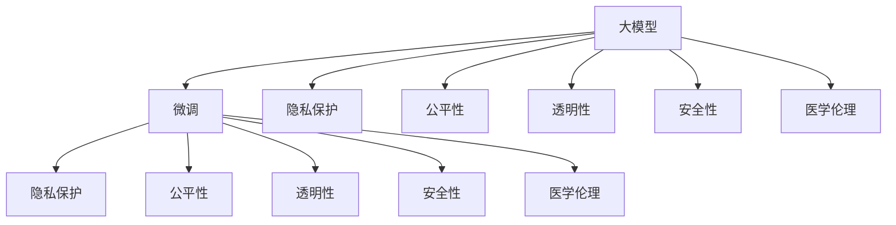

                 

# 大模型在医疗诊断中的伦理挑战

> 关键词：大模型,医疗诊断,伦理挑战,隐私保护,公平性,透明性,安全,可解释性,医学伦理

## 1. 背景介绍

### 1.1 问题由来
随着人工智能（AI）和机器学习（ML）技术的飞速发展，特别是在医疗领域，越来越多的医疗大模型（Large Medical Models, LMMs）被应用到疾病诊断、影像分析、药物研发等环节。这些基于大规模无标签医疗数据预训练的大模型，通过微调（Fine-Tuning）能够实现精确的医疗诊断和治疗方案推荐。然而，随着大模型在医疗诊断中应用的深入，一系列伦理挑战也随之浮现，引发了广泛关注和深入讨论。

### 1.2 问题核心关键点
在医疗领域，大模型的应用不仅要考虑到模型的精度和效果，还需要严格遵循医学伦理规范，确保数据隐私保护、算法公平性、透明性和安全性，避免医疗误诊误治，保障患者权益。

1. **数据隐私保护**：医疗数据涉及患者的隐私信息，如何合理利用和保护这些数据是医疗大模型应用中的重要问题。
2. **算法公平性**：模型是否对不同种族、性别、年龄等群体公平，避免出现歧视性诊断。
3. **透明性和可解释性**：医疗大模型的决策过程应具有透明性，让医生和患者能够理解模型的诊断依据，避免“黑盒”操作。
4. **安全性**：确保模型的输出是安全的，不会产生误诊误治的严重后果。
5. **医学伦理**：应用大模型时必须遵守医学伦理规范，避免伦理风险。

## 2. 核心概念与联系

### 2.1 核心概念概述

为更好地理解大模型在医疗诊断中的伦理挑战，本节将介绍几个密切相关的核心概念：

- **大模型（Large Medical Models, LMMs）**：指通过大规模医疗数据预训练的深度学习模型，如使用Transformer等架构进行训练的模型。
- **微调（Fine-Tuning）**：指在预训练模型基础上，使用特定任务的数据集对其进行有监督学习，优化模型在该任务上的性能。
- **隐私保护**：指保护患者的医疗数据隐私，防止数据泄露和滥用。
- **公平性（Equity）**：指模型应公平对待不同群体，避免偏见和歧视。
- **透明性（Transparency）**：指模型的决策过程应透明，可解释，方便医生和患者理解。
- **安全性（Safety）**：指模型输出的诊断和治疗方案应安全可靠，避免误诊误治。
- **医学伦理（Medical Ethics）**：指在应用大模型时，应遵守医学伦理规范，保护患者权益，避免伦理风险。

这些核心概念之间的逻辑关系可以通过以下Mermaid流程图来展示：



这个流程图展示了大模型在医疗诊断中应用的核心概念及其之间的关系：

1. 大模型通过微调获得特定任务的性能提升。
2. 在微调过程中，隐私保护、公平性、透明性、安全性和医学伦理都是需要考虑的关键因素。
3. 这些因素不仅影响模型本身的性能和应用效果，还关系到模型能否在医疗环境中被合理地应用。

## 3. 核心算法原理 & 具体操作步骤
### 3.1 算法原理概述

大模型在医疗诊断中的应用，本质上是通过对预训练模型的微调，使其适应特定的医疗任务，实现自动化的诊断和治疗方案推荐。其核心思想是：将预训练大模型视为一个"特征提取器"，通过微调使得模型能够学习到特定的医疗知识，从而进行准确的疾病诊断和治疗方案推荐。

形式化地，假设预训练模型为 $M_{\theta}$，其中 $\theta$ 为预训练得到的模型参数。给定医疗诊断任务 $T$ 的标注数据集 $D=\{(x_i, y_i)\}_{i=1}^N$，微调的目标是找到新的模型参数 $\hat{\theta}$，使得：

$$
\hat{\theta}=\mathop{\arg\min}_{\theta} \mathcal{L}(M_{\theta},D)
$$

其中 $\mathcal{L}$ 为针对任务 $T$ 设计的损失函数，用于衡量模型预测输出与真实标签之间的差异。常见的损失函数包括交叉熵损失、均方误差损失等。

通过梯度下降等优化算法，微调过程不断更新模型参数 $\theta$，最小化损失函数 $\mathcal{L}$，使得模型输出逼近真实标签。由于 $\theta$ 已经通过预训练获得了较好的初始化，因此即便在小型数据集 $D$ 上进行微调，也能较快收敛到理想的模型参数 $\hat{\theta}$。

### 3.2 算法步骤详解

大模型在医疗诊断中的微调一般包括以下几个关键步骤：

**Step 1: 准备预训练模型和数据集**
- 选择合适的预训练大模型 $M_{\theta}$ 作为初始化参数，如BERT、GPT等。
- 准备医疗诊断任务 $T$ 的标注数据集 $D$，划分为训练集、验证集和测试集。一般要求标注数据与预训练数据的分布不要差异过大。

**Step 2: 添加任务适配层**
- 根据任务类型，在预训练模型顶层设计合适的输出层和损失函数。
- 对于分类任务，通常在顶层添加线性分类器和交叉熵损失函数。
- 对于生成任务，通常使用语言模型的解码器输出概率分布，并以负对数似然为损失函数。

**Step 3: 设置微调超参数**
- 选择合适的优化算法及其参数，如 AdamW、SGD 等，设置学习率、批大小、迭代轮数等。
- 设置正则化技术及强度，包括权重衰减、Dropout、Early Stopping等。
- 确定冻结预训练参数的策略，如仅微调顶层，或全部参数都参与微调。

**Step 4: 执行梯度训练**
- 将训练集数据分批次输入模型，前向传播计算损失函数。
- 反向传播计算参数梯度，根据设定的优化算法和学习率更新模型参数。
- 周期性在验证集上评估模型性能，根据性能指标决定是否触发 Early Stopping。
- 重复上述步骤直到满足预设的迭代轮数或 Early Stopping 条件。

**Step 5: 测试和部署**
- 在测试集上评估微调后模型 $M_{\hat{\theta}}$ 的性能，对比微调前后的精度提升。
- 使用微调后的模型对新样本进行推理预测，集成到实际的应用系统中。
- 持续收集新的数据，定期重新微调模型，以适应数据分布的变化。

以上是基于监督学习微调大模型的一般流程。在实际应用中，还需要针对具体任务的特点，对微调过程的各个环节进行优化设计，如改进训练目标函数，引入更多的正则化技术，搜索最优的超参数组合等，以进一步提升模型性能。

### 3.3 算法优缺点

大模型在医疗诊断中的微调方法具有以下优点：
1. 快速高效。使用大规模预训练模型，在少量标注数据上进行微调，可以快速提升诊断效果。
2. 广泛适用。适用于多种医疗诊断任务，如疾病分类、影像分析、治疗方案推荐等，只需设计合适的任务适配层即可。
3. 参数效率。通过微调顶层或固定部分预训练参数，可以有效减少计算资源消耗。
4. 性能提升。在少量数据上进行微调，仍能显著提升诊断和治疗方案推荐的准确性。

同时，该方法也存在一定的局限性：
1. 数据隐私风险。医疗数据的敏感性要求对数据隐私保护有严格的要求，防止数据泄露和滥用。
2. 公平性问题。模型可能存在对不同群体不公平的现象，需进行公平性评估和调整。
3. 透明性不足。诊断和治疗方案推荐过程复杂，难以提供透明和可解释的依据。
4. 安全性风险。模型的输出需确保准确可靠，避免误诊误治。
5. 伦理风险。应用大模型时必须遵守医学伦理规范，确保模型的使用符合伦理要求。

尽管存在这些局限性，但就目前而言，基于监督学习的微调方法仍是大模型在医疗诊断中应用的主流范式。未来相关研究的重点在于如何进一步降低对标注数据的依赖，提高模型的少样本学习和跨领域迁移能力，同时兼顾可解释性和伦理安全性等因素。

### 3.4 算法应用领域

基于大模型微调的监督学习方法，在医疗诊断领域已经得到了广泛的应用，覆盖了几乎所有常见任务，例如：

- 疾病分类：如癌症、心脏病、糖尿病等疾病的分类诊断。通过微调使得模型能够自动学习疾病的特征和分类规则。
- 影像分析：如肺部CT影像的肿瘤识别、X光影像的骨折检测等。将影像数据作为输入，模型输出诊断结果。
- 治疗方案推荐：如药物疗效评估、手术方案选择等。通过微调使模型能够根据患者的症状和病历，推荐最适合的治疗方案。
- 医疗问答系统：如智能问诊、病历分析等。将患者描述的病史和症状作为输入，输出诊断结果和治疗建议。

除了上述这些经典任务外，大模型微调还被创新性地应用到更多场景中，如智能诊断、药物研发、医学知识图谱等，为医疗技术的发展带来了新的突破。随着预训练模型和微调方法的不断进步，相信大模型微调技术将在医疗领域展现出更广泛的应用前景。

## 4. 数学模型和公式 & 详细讲解  
### 4.1 数学模型构建

本节将使用数学语言对基于监督学习的大模型微调过程进行更加严格的刻画。

记预训练大模型为 $M_{\theta}$，其中 $\theta$ 为模型参数。假设医疗诊断任务 $T$ 的训练集为 $D=\{(x_i,y_i)\}_{i=1}^N, x_i \in \mathcal{X}, y_i \in \mathcal{Y}$。

定义模型 $M_{\theta}$ 在输入 $x$ 上的损失函数为 $\ell(M_{\theta}(x),y)$，则在数据集 $D$ 上的经验风险为：

$$
\mathcal{L}(\theta) = \frac{1}{N} \sum_{i=1}^N \ell(M_{\theta}(x_i),y_i)
$$

微调的优化目标是最小化经验风险，即找到最优参数：

$$
\theta^* = \mathop{\arg\min}_{\theta} \mathcal{L}(\theta)
$$

在实践中，我们通常使用基于梯度的优化算法（如SGD、Adam等）来近似求解上述最优化问题。设 $\eta$ 为学习率，$\lambda$ 为正则化系数，则参数的更新公式为：

$$
\theta \leftarrow \theta - \eta \nabla_{\theta}\mathcal{L}(\theta) - \eta\lambda\theta
$$

其中 $\nabla_{\theta}\mathcal{L}(\theta)$ 为损失函数对参数 $\theta$ 的梯度，可通过反向传播算法高效计算。

### 4.2 公式推导过程

以下我们以疾病分类任务为例，推导交叉熵损失函数及其梯度的计算公式。

假设模型 $M_{\theta}$ 在输入 $x$ 上的输出为 $\hat{y}=M_{\theta}(x) \in [0,1]$，表示样本属于疾病的概率。真实标签 $y \in \{0,1\}$。则二分类交叉熵损失函数定义为：

$$
\ell(M_{\theta}(x),y) = -[y\log \hat{y} + (1-y)\log (1-\hat{y})]
$$

将其代入经验风险公式，得：

$$
\mathcal{L}(\theta) = -\frac{1}{N}\sum_{i=1}^N [y_i\log M_{\theta}(x_i)+(1-y_i)\log(1-M_{\theta}(x_i))]
$$

根据链式法则，损失函数对参数 $\theta_k$ 的梯度为：

$$
\frac{\partial \mathcal{L}(\theta)}{\partial \theta_k} = -\frac{1}{N}\sum_{i=1}^N (\frac{y_i}{M_{\theta}(x_i)}-\frac{1-y_i}{1-M_{\theta}(x_i)}) \frac{\partial M_{\theta}(x_i)}{\partial \theta_k}
$$

其中 $\frac{\partial M_{\theta}(x_i)}{\partial \theta_k}$ 可进一步递归展开，利用自动微分技术完成计算。

在得到损失函数的梯度后，即可带入参数更新公式，完成模型的迭代优化。重复上述过程直至收敛，最终得到适应医疗诊断任务的最优模型参数 $\theta^*$。

## 5. 项目实践：代码实例和详细解释说明
### 5.1 开发环境搭建

在进行微调实践前，我们需要准备好开发环境。以下是使用Python进行PyTorch开发的环境配置流程：

1. 安装Anaconda：从官网下载并安装Anaconda，用于创建独立的Python环境。

2. 创建并激活虚拟环境：
```bash
conda create -n pytorch-env python=3.8 
conda activate pytorch-env
```

3. 安装PyTorch：根据CUDA版本，从官网获取对应的安装命令。例如：
```bash
conda install pytorch torchvision torchaudio cudatoolkit=11.1 -c pytorch -c conda-forge
```

4. 安装Transformers库：
```bash
pip install transformers
```

5. 安装各类工具包：
```bash
pip install numpy pandas scikit-learn matplotlib tqdm jupyter notebook ipython
```

完成上述步骤后，即可在`pytorch-env`环境中开始微调实践。

### 5.2 源代码详细实现

下面我以疾病分类任务为例，给出使用Transformers库对BERT模型进行微调的PyTorch代码实现。

首先，定义疾病分类任务的数据处理函数：

```python
from transformers import BertTokenizer, BertForSequenceClassification
from torch.utils.data import Dataset
import torch

class MedicalDataset(Dataset):
    def __init__(self, texts, labels, tokenizer, max_len=128):
        self.texts = texts
        self.labels = labels
        self.tokenizer = tokenizer
        self.max_len = max_len
        
    def __len__(self):
        return len(self.texts)
    
    def __getitem__(self, item):
        text = self.texts[item]
        label = self.labels[item]
        
        encoding = self.tokenizer(text, return_tensors='pt', max_length=self.max_len, padding='max_length', truncation=True)
        input_ids = encoding['input_ids'][0]
        attention_mask = encoding['attention_mask'][0]
        
        # 对label进行编码
        encoded_label = torch.tensor(label, dtype=torch.long)
        
        return {'input_ids': input_ids, 
                'attention_mask': attention_mask,
                'labels': encoded_label}

# 标签与id的映射
label2id = {'Healthy': 0, 'Cancer': 1, 'Heart_Disease': 2, 'Diabetes': 3}
id2label = {v: k for k, v in label2id.items()}

# 创建dataset
tokenizer = BertTokenizer.from_pretrained('bert-base-cased')

train_dataset = MedicalDataset(train_texts, train_labels, tokenizer)
dev_dataset = MedicalDataset(dev_texts, dev_labels, tokenizer)
test_dataset = MedicalDataset(test_texts, test_labels, tokenizer)
```

然后，定义模型和优化器：

```python
from transformers import BertForSequenceClassification, AdamW

model = BertForSequenceClassification.from_pretrained('bert-base-cased', num_labels=len(label2id))

optimizer = AdamW(model.parameters(), lr=2e-5)
```

接着，定义训练和评估函数：

```python
from torch.utils.data import DataLoader
from tqdm import tqdm
from sklearn.metrics import classification_report

device = torch.device('cuda') if torch.cuda.is_available() else torch.device('cpu')
model.to(device)

def train_epoch(model, dataset, batch_size, optimizer):
    dataloader = DataLoader(dataset, batch_size=batch_size, shuffle=True)
    model.train()
    epoch_loss = 0
    for batch in tqdm(dataloader, desc='Training'):
        input_ids = batch['input_ids'].to(device)
        attention_mask = batch['attention_mask'].to(device)
        labels = batch['labels'].to(device)
        model.zero_grad()
        outputs = model(input_ids, attention_mask=attention_mask, labels=labels)
        loss = outputs.loss
        epoch_loss += loss.item()
        loss.backward()
        optimizer.step()
    return epoch_loss / len(dataloader)

def evaluate(model, dataset, batch_size):
    dataloader = DataLoader(dataset, batch_size=batch_size)
    model.eval()
    preds, labels = [], []
    with torch.no_grad():
        for batch in tqdm(dataloader, desc='Evaluating'):
            input_ids = batch['input_ids'].to(device)
            attention_mask = batch['attention_mask'].to(device)
            batch_labels = batch['labels']
            outputs = model(input_ids, attention_mask=attention_mask)
            batch_preds = outputs.logits.argmax(dim=2).to('cpu').tolist()
            batch_labels = batch_labels.to('cpu').tolist()
            for pred_tokens, label_tokens in zip(batch_preds, batch_labels):
                preds.append(pred_tokens[:len(label_tokens)])
                labels.append(label_tokens)
                
    print(classification_report(labels, preds))
```

最后，启动训练流程并在测试集上评估：

```python
epochs = 5
batch_size = 16

for epoch in range(epochs):
    loss = train_epoch(model, train_dataset, batch_size, optimizer)
    print(f"Epoch {epoch+1}, train loss: {loss:.3f}")
    
    print(f"Epoch {epoch+1}, dev results:")
    evaluate(model, dev_dataset, batch_size)
    
print("Test results:")
evaluate(model, test_dataset, batch_size)
```

以上就是使用PyTorch对BERT进行疾病分类任务微调的完整代码实现。可以看到，得益于Transformers库的强大封装，我们可以用相对简洁的代码完成BERT模型的加载和微调。

### 5.3 代码解读与分析

让我们再详细解读一下关键代码的实现细节：

**MedicalDataset类**：
- `__init__`方法：初始化文本、标签、分词器等关键组件。
- `__len__`方法：返回数据集的样本数量。
- `__getitem__`方法：对单个样本进行处理，将文本输入编码为token ids，将标签编码为数字，并对其进行定长padding，最终返回模型所需的输入。

**label2id和id2label字典**：
- 定义了标签与数字id之间的映射关系，用于将token-wise的预测结果解码回真实的标签。

**训练和评估函数**：
- 使用PyTorch的DataLoader对数据集进行批次化加载，供模型训练和推理使用。
- 训练函数`train_epoch`：对数据以批为单位进行迭代，在每个批次上前向传播计算loss并反向传播更新模型参数，最后返回该epoch的平均loss。
- 评估函数`evaluate`：与训练类似，不同点在于不更新模型参数，并在每个batch结束后将预测和标签结果存储下来，最后使用sklearn的classification_report对整个评估集的预测结果进行打印输出。

**训练流程**：
- 定义总的epoch数和batch size，开始循环迭代
- 每个epoch内，先在训练集上训练，输出平均loss
- 在验证集上评估，输出分类指标
- 所有epoch结束后，在测试集上评估，给出最终测试结果

可以看到，PyTorch配合Transformers库使得BERT微调的代码实现变得简洁高效。开发者可以将更多精力放在数据处理、模型改进等高层逻辑上，而不必过多关注底层的实现细节。

当然，工业级的系统实现还需考虑更多因素，如模型的保存和部署、超参数的自动搜索、更灵活的任务适配层等。但核心的微调范式基本与此类似。

## 6. 实际应用场景
### 6.1 智能问诊系统

基于大模型微调的智能问诊系统，可以在医院内部实现智能化问诊，帮助医生提高诊断效率和质量。传统问诊方式依赖医生的经验，容易出错，且问诊过程耗时较长。而使用微调后的智能问诊系统，能够24小时在线服务，快速回答患者的问题，辅助医生进行诊断，减少误诊误治的发生。

在技术实现上，可以收集医院的历史病历、症状描述、诊断结果等数据，将问诊问题作为输入，将真实诊断结果作为监督信号，在此基础上对预训练语言模型进行微调。微调后的模型能够自动理解患者的问题，匹配最合适的诊断和建议。对于复杂问题，还可以接入知识库，提供详细解释和参考。如此构建的智能问诊系统，能够有效减轻医生的工作负担，提升问诊质量。

### 6.2 影像分析系统

大模型在影像分析中的应用，可以辅助医生进行肿瘤、骨折等疾病的快速诊断。传统影像分析依赖医生的肉眼判断，存在主观偏差，且效率低下。而使用微调后的影像分析系统，能够自动检测和标注影像中的病变区域，提高诊断的准确性和速度。

在技术实现上，可以收集大量医学影像数据，将其作为输入，通过微调使得模型能够自动检测和标注影像中的病变区域。此外，通过结合知识库和临床经验，模型还可以提供进一步的诊断建议和治疗方案。影像分析系统的应用，可以大幅提高医疗影像的诊断效率和准确性，降低医生的工作强度。

### 6.3 药物研发

大模型在药物研发中的应用，可以辅助药物公司进行新药筛选和设计。传统药物研发流程耗时长、成本高，且成功率低。而使用微调后的模型，可以自动分析药物分子结构和药效关系，筛选潜在的候选药物，提高研发效率和成功率。

在技术实现上，可以收集已知的药物分子数据和药效数据，将分子结构作为输入，通过微调使模型能够预测分子的药效。模型还可以自动学习药物之间的相互作用关系，设计新的药物分子结构，预测其药效。如此构建的药物研发系统，能够显著缩短新药的研发周期，降低研发成本，提高新药的成功率。

### 6.4 未来应用展望

随着大模型和微调技术的不断发展，基于微调范式将在医疗领域展现出更广泛的应用前景。

在智慧医疗领域，基于微调的医疗问答、病历分析、影像分析等应用将提升医疗服务的智能化水平，辅助医生诊疗，加速新药开发进程。

在智能医疗设备中，微调技术可以应用于诊断设备的数据分析和结果优化，提高设备的诊断精度和可靠性。

在健康监测系统中，微调模型可以用于分析健康数据，预测疾病风险，提供个性化的健康建议，提升患者的健康管理水平。

此外，在医疗知识图谱、医疗数据挖掘等方向，基于大模型的微调技术也将不断拓展，为医疗信息的高效管理和应用提供新的解决方案。相信随着技术的日益成熟，微调方法将成为医疗技术落地应用的重要手段，推动医疗产业的数字化转型和智能化升级。

## 7. 工具和资源推荐
### 7.1 学习资源推荐

为了帮助开发者系统掌握大模型在医疗诊断中的伦理挑战，这里推荐一些优质的学习资源：

1. 《Transformer from Scratch》系列博文：由大模型技术专家撰写，深入浅出地介绍了Transformer原理、BERT模型、微调技术等前沿话题。

2. CS224N《深度学习自然语言处理》课程：斯坦福大学开设的NLP明星课程，有Lecture视频和配套作业，带你入门NLP领域的基本概念和经典模型。

3. 《Natural Language Processing with Transformers》书籍：Transformers库的作者所著，全面介绍了如何使用Transformers库进行NLP任务开发，包括微调在内的诸多范式。

4. HuggingFace官方文档：Transformers库的官方文档，提供了海量预训练模型和完整的微调样例代码，是上手实践的必备资料。

5. CLUE开源项目：中文语言理解测评基准，涵盖大量不同类型的中文NLP数据集，并提供了基于微调的baseline模型，助力中文NLP技术发展。

通过对这些资源的学习实践，相信你一定能够快速掌握大模型在医疗诊断中的伦理挑战，并用于解决实际的NLP问题。
###  7.2 开发工具推荐

高效的开发离不开优秀的工具支持。以下是几款用于大模型在医疗诊断中微调开发的常用工具：

1. PyTorch：基于Python的开源深度学习框架，灵活动态的计算图，适合快速迭代研究。大部分预训练语言模型都有PyTorch版本的实现。

2. TensorFlow：由Google主导开发的开源深度学习框架，生产部署方便，适合大规模工程应用。同样有丰富的预训练语言模型资源。

3. Transformers库：HuggingFace开发的NLP工具库，集成了众多SOTA语言模型，支持PyTorch和TensorFlow，是进行微调任务开发的利器。

4. Weights & Biases：模型训练的实验跟踪工具，可以记录和可视化模型训练过程中的各项指标，方便对比和调优。与主流深度学习框架无缝集成。

5. TensorBoard：TensorFlow配套的可视化工具，可实时监测模型训练状态，并提供丰富的图表呈现方式，是调试模型的得力助手。

6. Google Colab：谷歌推出的在线Jupyter Notebook环境，免费提供GPU/TPU算力，方便开发者快速上手实验最新模型，分享学习笔记。

合理利用这些工具，可以显著提升大模型在医疗诊断中微调任务的开发效率，加快创新迭代的步伐。

### 7.3 相关论文推荐

大模型在医疗诊断中的应用源于学界的持续研究。以下是几篇奠基性的相关论文，推荐阅读：

1. Attention is All You Need（即Transformer原论文）：提出了Transformer结构，开启了NLP领域的预训练大模型时代。

2. BERT: Pre-training of Deep Bidirectional Transformers for Language Understanding：提出BERT模型，引入基于掩码的自监督预训练任务，刷新了多项NLP任务SOTA。

3. Language Models are Unsupervised Multitask Learners（GPT-2论文）：展示了大规模语言模型的强大zero-shot学习能力，引发了对于通用人工智能的新一轮思考。

4. Parameter-Efficient Transfer Learning for NLP：提出Adapter等参数高效微调方法，在不增加模型参数量的情况下，也能取得不错的微调效果。

5. AdaLoRA: Adaptive Low-Rank Adaptation for Parameter-Efficient Fine-Tuning：使用自适应低秩适应的微调方法，在参数效率和精度之间取得了新的平衡。

这些论文代表了大模型在医疗诊断中微调技术的发展脉络。通过学习这些前沿成果，可以帮助研究者把握学科前进方向，激发更多的创新灵感。

## 8. 总结：未来发展趋势与挑战

### 8.1 总结

本文对大模型在医疗诊断中的伦理挑战进行了全面系统的介绍。首先阐述了医疗大模型微调的应用背景和意义，明确了在医疗领域中如何合理应用大模型微调。其次，从原理到实践，详细讲解了基于监督学习的大模型微调过程，给出了微调任务开发的完整代码实例。同时，本文还广泛探讨了微调方法在智能问诊、影像分析、药物研发等多个医疗应用场景中的应用前景，展示了微调范式的巨大潜力。此外，本文精选了微调技术的各类学习资源，力求为读者提供全方位的技术指引。

通过本文的系统梳理，可以看到，大模型在医疗诊断中的应用不仅能够提升诊断和治疗方案推荐的准确性，还能显著减轻医生的工作负担，提高医疗服务的智能化水平。然而，在应用过程中，也需要严格遵守医学伦理规范，确保数据隐私保护、算法公平性、透明性和安全性。这些方面的挑战和风险必须引起足够的重视，以确保技术的应用安全和伦理合规。

### 8.2 未来发展趋势

展望未来，大模型在医疗诊断中的应用将呈现以下几个发展趋势：

1. 模型规模持续增大。随着算力成本的下降和数据规模的扩张，预训练大模型的参数量还将持续增长。超大规模语言模型蕴含的丰富医疗知识，有望支撑更加复杂多变的医疗任务微调。

2. 微调方法日趋多样。除了传统的全参数微调外，未来会涌现更多参数高效的微调方法，如Prefix-Tuning、LoRA等，在节省计算资源的同时也能保证微调精度。

3. 持续学习成为常态。随着医疗数据分布的不断变化，微调模型也需要持续学习新知识以保持性能。如何在不遗忘原有知识的同时，高效吸收新样本信息，将成为重要的研究课题。

4. 标注样本需求降低。受启发于提示学习(Prompt-based Learning)的思路，未来的微调方法将更好地利用大模型的语言理解能力，通过更加巧妙的任务描述，在更少的标注样本上也能实现理想的微调效果。

5. 跨模态微调崛起。当前微调主要聚焦于纯文本数据，未来会进一步拓展到图像、视频、语音等多模态数据微调。多模态信息的融合，将显著提升医疗大模型的诊断和治疗能力。

6. 模型的通用性增强。经过海量数据的预训练和多领域任务的微调，未来的医疗大模型将具备更强大的常识推理和跨领域迁移能力，逐步迈向通用人工智能(AGI)的目标。

以上趋势凸显了大模型在医疗诊断中的应用前景。这些方向的探索发展，必将进一步提升医疗系统的性能和应用范围，为医疗服务的智能化升级带来新的动力。

### 8.3 面临的挑战

尽管大模型在医疗诊断中的应用取得了显著进展，但在迈向更加智能化、普适化应用的过程中，它仍面临着诸多挑战：

1. 数据隐私风险。医疗数据的敏感性要求对数据隐私保护有严格的要求，防止数据泄露和滥用。

2. 公平性问题。模型可能存在对不同群体不公平的现象，需进行公平性评估和调整。

3. 透明性不足。诊断和治疗方案推荐过程复杂，难以提供透明和可解释的依据。

4. 安全性风险。模型的输出需确保准确可靠，避免误诊误治。

5. 伦理风险。应用大模型时必须遵守医学伦理规范，确保模型的使用符合伦理要求。

尽管存在这些局限性，但就目前而言，基于监督学习的微调方法仍是大模型在医疗诊断中应用的主流范式。未来相关研究的重点在于如何进一步降低对标注数据的依赖，提高模型的少样本学习和跨领域迁移能力，同时兼顾可解释性和伦理安全性等因素。

### 8.4 研究展望

面对大模型在医疗诊断中面临的挑战，未来的研究需要在以下几个方面寻求新的突破：

1. 探索无监督和半监督微调方法。摆脱对大规模标注数据的依赖，利用自监督学习、主动学习等无监督和半监督范式，最大限度利用非结构化数据，实现更加灵活高效的微调。

2. 研究参数高效和计算高效的微调范式。开发更加参数高效的微调方法，在固定大部分预训练参数的同时，只更新极少量的任务相关参数。同时优化微调模型的计算图，减少前向传播和反向传播的资源消耗，实现更加轻量级、实时性的部署。

3. 引入更多先验知识。将符号化的先验知识，如知识图谱、逻辑规则等，与神经网络模型进行巧妙融合，引导微调过程学习更准确、合理的语言模型。同时加强不同模态数据的整合，实现视觉、语音等多模态信息与文本信息的协同建模。

4. 结合因果分析和博弈论工具。将因果分析方法引入微调模型，识别出模型决策的关键特征，增强输出解释的因果性和逻辑性。借助博弈论工具刻画人机交互过程，主动探索并规避模型的脆弱点，提高系统稳定性。

5. 纳入伦理道德约束。在模型训练目标中引入伦理导向的评估指标，过滤和惩罚有偏见、有害的输出倾向。同时加强人工干预和审核，建立模型行为的监管机制，确保输出符合人类价值观和伦理道德。

这些研究方向的探索，必将引领大模型在医疗诊断中的应用走向更高的台阶，为构建安全、可靠、可解释、可控的智能系统铺平道路。面向未来，大模型在医疗领域的应用还需要与其他人工智能技术进行更深入的融合，如知识表示、因果推理、强化学习等，多路径协同发力，共同推动医疗技术的进步。只有勇于创新、敢于突破，才能不断拓展大模型的边界，让智能技术更好地造福人类社会。

## 9. 附录：常见问题与解答

**Q1：大模型在医疗诊断中是否存在偏见？**

A: 大模型在医疗诊断中可能会存在偏见，这些偏见可能来源于训练数据的不平衡、预训练数据的偏见、模型设计的不公平性等。为减少偏见，可以通过以下措施：
1. 数据预处理：对训练数据进行多样化的数据增强，如随机裁剪、回译、同义词替换等，增加数据的多样性和泛化能力。
2. 模型设计：在设计模型架构时，引入公平性约束，如对抗训练、公平性损失等，确保模型对不同群体的公平性。
3. 数据集平衡：在数据集构建时，确保各类疾病和症状的样本数量均衡，避免数据偏见。
4. 模型监控：在模型应用过程中，定期监测模型的输出和性能，及时发现和纠正偏见问题。

**Q2：如何确保大模型在医疗诊断中的安全性？**

A: 确保大模型在医疗诊断中的安全性，需要从数据、模型和应用多个维度进行严格控制：
1. 数据质量：确保训练数据的准确性和代表性，避免数据污染和误导性。
2. 模型验证：在微调模型时，使用多种验证集进行评估，确保模型在不同数据分布下的泛化能力。
3. 推理校验：在推理过程中，对模型输出进行校验，如与专家共识对比、进行模拟推理等，确保输出的可靠性。
4. 透明性和可解释性：确保模型输出的可解释性，让医生和患者能够理解模型的推理依据。
5. 安全性测试：在模型部署前，进行安全性和鲁棒性测试，确保模型对异常输入的鲁棒性和安全性。

**Q3：大模型在医疗诊断中的应用是否会影响医生和患者的信任？**

A: 大模型在医疗诊断中的应用，如果能够提供准确、可靠、可解释的诊断和治疗建议，将有助于提高医生和患者的信任。然而，模型的可信度需要经过严格的验证和临床验证。在使用大模型时，医生应结合自己的专业知识和临床经验，对模型输出进行综合判断。同时，应通过宣传和教育，让患者了解大模型的原理和应用场景，提高其对新技术的接受度。

**Q4：如何平衡大模型在医疗诊断中的效率和效果？**

A: 大模型在医疗诊断中的应用，需要在效率和效果之间进行平衡：
1. 模型压缩：通过模型压缩技术，如剪枝、量化等，减少模型参数和计算资源消耗，提升推理速度。
2. 分布式训练：使用分布式训练技术，加速模型训练，提高模型性能。
3. 本地化部署：在资源受限的环境下，将大模型部署到本地设备，减少网络传输和计算延迟。
4. 优化算法：使用高效的优化算法，如Adafactor、Adagrad等，加速模型训练和推理。
5. 多模型集成：通过集成多个微调模型，提升诊断的准确性和鲁棒性。

通过这些方法，可以在保证诊断效果的前提下，提高大模型的应用效率，满足实际医疗应用的需求。

---

作者：禅与计算机程序设计艺术 / Zen and the Art of Computer Programming

