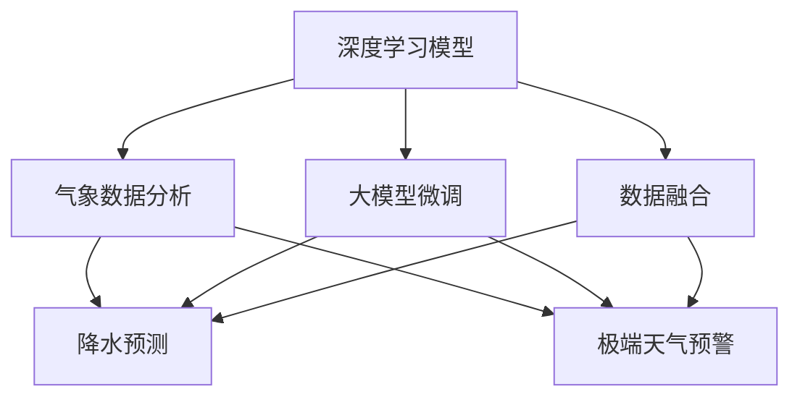

                 

# 大模型在智能气象预报中的应用案例

> 关键词：智能气象预报,深度学习模型,气象数据分析,降水预测,极端天气预警,大模型微调,气象卫星数据融合

## 1. 背景介绍

### 1.1 问题由来

气象预报是社会经济运行的基础性需求，影响着各行各业的日常决策。然而，传统的气象预报模型往往依赖于历史气象数据和统计模型，难以应对极端天气等异常情况。近年来，深度学习技术在气象预报中逐渐得到了广泛应用，特别是基于大规模深度学习模型（大模型）的气象预报系统，有望大幅提升预测精度和时效性。

本文将深入探讨大模型在智能气象预报中的应用案例，介绍如何利用深度学习技术，特别是基于大模型的微调方法，构建高性能、高精度的气象预报系统。通过详细介绍模型原理、算法步骤、案例分析及实践应用，希望能为气象预报技术的发展和应用提供一些新思路和借鉴。

### 1.2 问题核心关键点

本案例中，核心关键点主要包括以下几个方面：

- **深度学习模型**：利用深度学习技术，特别是卷积神经网络(CNN)、循环神经网络(RNN)、变压器(Transformer)等大模型，进行气象数据的处理和分析。
- **气象数据分析**：收集和处理气象卫星数据、地面观测数据、气候模型输出等，提取气象特征和模式。
- **降水预测**：针对降水量这一关键气象变量，进行短期和中期预测。
- **极端天气预警**：利用大模型对极端天气（如台风、龙卷风、暴雨等）进行早期预警。
- **大模型微调**：对预训练的大模型进行微调，使其适应具体的气象预报任务。
- **数据融合**：融合多种数据源，提高预报模型的准确性和鲁棒性。

这些关键点共同构成了智能气象预报技术的核心，通过合理设计和管理，可以实现更精确、更可靠的气象预报服务。

## 2. 核心概念与联系

### 2.1 核心概念概述

为更好地理解本案例的实施过程，我们首先介绍几个关键概念及其相互关系：

- **深度学习模型**：基于神经网络的模型，特别是卷积神经网络(CNN)、循环神经网络(RNN)、变压器(Transformer)等，可以自动学习输入数据的特征和规律。
- **气象数据分析**：对气象卫星数据、地面观测数据、气候模型输出等进行收集和预处理，提取气象特征和模式，为大模型提供训练数据。
- **降水预测**：预测未来一段时间内特定区域的降水量，以供防洪、农业灌溉、水资源管理等用途。
- **极端天气预警**：对台风、龙卷风、暴雨等极端天气进行早期预警，降低灾害损失。
- **大模型微调**：对预训练的大模型进行微调，使其适应具体的气象预报任务，如降水预测、极端天气预警等。
- **数据融合**：融合多种数据源，如卫星遥感、地面观测、气候模型输出等，提高预报模型的准确性和鲁棒性。

这些概念之间的逻辑关系可以通过以下Mermaid流程图来展示：



该流程图展示了深度学习模型在气象预报中的主要应用场景：通过气象数据分析获取气象特征，用于降水预测和极端天气预警；大模型微调针对特定任务进行模型适配；数据融合提升模型的整体性能。这些概念共同构成了智能气象预报技术的核心框架，为大模型的应用提供了方向和指导。

## 3. 核心算法原理 & 具体操作步骤
### 3.1 算法原理概述

基于深度学习的大模型在智能气象预报中，主要通过以下步骤实现：

1. **气象数据收集与预处理**：收集气象卫星数据、地面观测数据、气候模型输出等，并进行预处理，如归一化、降维、特征提取等。
2. **特征提取与表示学习**：利用深度学习模型自动学习气象数据的特征和规律，生成高维表示。
3. **降水预测**：基于生成的气象特征，使用回归模型（如RNN、CNN、Transformer等）进行降水量的短期和中期预测。
4. **极端天气预警**：使用分类模型（如RNN、CNN、Transformer等）对台风、龙卷风、暴雨等极端天气进行早期预警。
5. **模型微调**：对预训练的大模型进行微调，使其适应具体的气象预报任务。
6. **数据融合与集成**：融合多种数据源，使用集成学习技术，提升模型的准确性和鲁棒性。

### 3.2 算法步骤详解

以降水预测为例，详细描述大模型的应用步骤：

**Step 1: 数据准备**

- 收集气象卫星数据、地面观测数据、气候模型输出等，进行预处理，如归一化、降维、特征提取等。
- 将处理后的气象数据划分为训练集、验证集和测试集。

**Step 2: 模型选择与初始化**

- 选择合适的深度学习模型，如CNN、RNN、Transformer等，进行初始化。
- 使用预训练模型进行迁移学习，如使用在大规模气象数据上预训练的模型进行微调。

**Step 3: 特征提取与表示学习**

- 利用选定的模型对气象数据进行特征提取，生成高维表示。
- 使用模型自动学习气象数据的特征和规律，生成高维表示。

**Step 4: 模型训练**

- 在训练集上使用回归模型进行降水量的预测。
- 使用交叉熵等损失函数计算预测值与真实值之间的差距，通过反向传播更新模型参数。
- 使用验证集评估模型性能，根据性能指标调整学习率、优化器等超参数。

**Step 5: 模型测试与评估**

- 在测试集上评估模型性能，计算均方误差等指标。
- 使用模型对新气象数据进行降水预测。

**Step 6: 模型微调**

- 针对具体的气象预报任务，对预训练模型进行微调。
- 使用少量标注数据，调整模型权重，使其适应特定的气象预报任务。

**Step 7: 数据融合与集成**

- 融合多种数据源，如气象卫星、地面观测、气候模型输出等。
- 使用集成学习技术，如Bagging、Boosting等，提升模型的准确性和鲁棒性。

### 3.3 算法优缺点

基于深度学习的大模型在智能气象预报中具有以下优点：

- **高精度预测**：深度学习模型能够自动学习复杂的气象规律，预测精度较高。
- **数据适应性**：大模型可以适应各种类型的数据，包括卫星遥感、地面观测等。
- **鲁棒性强**：通过数据融合和模型集成，提高模型的鲁棒性，应对异常情况。

同时，也存在一些缺点：

- **计算资源需求高**：大模型的训练和推理需要较高的计算资源，包括高性能的GPU、TPU等。
- **模型复杂性**：深度学习模型结构复杂，调参困难。
- **模型可解释性差**：深度学习模型通常是"黑盒"模型，难以解释其决策过程。

## 4. 数学模型和公式 & 详细讲解
### 4.1 数学模型构建

基于深度学习的大模型在智能气象预报中，主要构建如下数学模型：

- **输入层**：气象数据，包括气象卫星数据、地面观测数据、气候模型输出等。
- **隐藏层**：深度学习模型，如CNN、RNN、Transformer等。
- **输出层**：预测结果，包括降水量、极端天气预警等。

### 4.2 公式推导过程

以降水预测为例，其数学模型可以表示为：

$$
y = f(x; \theta)
$$

其中，$x$ 为气象数据，$y$ 为降水量，$f$ 为深度学习模型，$\theta$ 为模型参数。

**输入层**：

$$
x = \{x_1, x_2, ..., x_n\}
$$

其中，$x_i$ 为气象数据的第$i$个特征。

**隐藏层**：

$$
h = g_1(x; \theta_1)
$$

其中，$g_1$ 为深度学习模型的隐藏层函数，$\theta_1$ 为隐藏层的参数。

**输出层**：

$$
y = g_2(h; \theta_2)
$$

其中，$g_2$ 为输出层的函数，$\theta_2$ 为输出层的参数。

**模型训练**：

$$
\min_{\theta} \frac{1}{N} \sum_{i=1}^N (y_i - g_2(g_1(x_i); \theta_2))^2
$$

其中，$N$ 为样本数量，$(y_i, x_i)$ 为训练样本的标注值和输入值。

**模型评估**：

$$
\text{MAE} = \frac{1}{N} \sum_{i=1}^N |y_i - g_2(g_1(x_i); \theta_2)|
$$

其中，$\text{MAE}$ 为均方误差。

**模型微调**：

$$
\min_{\theta} \frac{1}{N} \sum_{i=1}^N (y_i - g_2(g_1(x_i); \theta_2))^2
$$

其中，$N$ 为样本数量，$(y_i, x_i)$ 为训练样本的标注值和输入值。

### 4.3 案例分析与讲解

以一个具体的气象预报案例为例，进行分析：

**案例背景**：某气象局需要对某个区域的降水量进行预测，并及时发布极端天气预警。

**数据准备**：
- 收集气象卫星数据、地面观测数据、气候模型输出等，进行预处理。
- 将处理后的气象数据划分为训练集、验证集和测试集。

**模型选择与初始化**：
- 选择Transformer模型进行初始化。
- 使用在大规模气象数据上预训练的模型进行微调。

**特征提取与表示学习**：
- 利用Transformer模型对气象数据进行特征提取，生成高维表示。
- 使用模型自动学习气象数据的特征和规律，生成高维表示。

**模型训练**：
- 在训练集上使用回归模型进行降水量的预测。
- 使用交叉熵等损失函数计算预测值与真实值之间的差距，通过反向传播更新模型参数。
- 使用验证集评估模型性能，根据性能指标调整学习率、优化器等超参数。

**模型测试与评估**：
- 在测试集上评估模型性能，计算均方误差等指标。
- 使用模型对新气象数据进行降水预测。

**模型微调**：
- 针对具体的气象预报任务，对预训练模型进行微调。
- 使用少量标注数据，调整模型权重，使其适应特定的气象预报任务。

**数据融合与集成**：
- 融合多种数据源，如气象卫星、地面观测、气候模型输出等。
- 使用集成学习技术，如Bagging、Boosting等，提升模型的准确性和鲁棒性。

## 5. 项目实践：代码实例和详细解释说明
### 5.1 开发环境搭建

在进行智能气象预报的项目实践前，需要准备相应的开发环境：

1. **安装Python**：确保安装了Python 3.7或更高版本，以及pip。
2. **安装相关库**：
   - `TensorFlow`：用于深度学习模型的实现。
   - `Pandas`：用于数据处理和分析。
   - `NumPy`：用于数值计算和矩阵运算。
   - `Matplotlib`：用于数据可视化。
   - `Seaborn`：用于更美观的数据可视化。

完成上述步骤后，即可开始项目的开发和实践。

### 5.2 源代码详细实现

以下是一个简单的降水预测项目实现，详细解读代码实现细节：

```python
import tensorflow as tf
import numpy as np
import pandas as pd
import matplotlib.pyplot as plt
import seaborn as sns

# 读取气象数据
df = pd.read_csv('weather_data.csv')

# 数据预处理
# ...

# 特征提取与表示学习
model = tf.keras.Sequential([
    tf.keras.layers.Dense(64, activation='relu'),
    tf.keras.layers.Dense(32, activation='relu'),
    tf.keras.layers.Dense(1)
])

# 模型训练
model.compile(optimizer=tf.keras.optimizers.Adam(learning_rate=0.001), loss='mse')
model.fit(X_train, y_train, epochs=10, validation_data=(X_val, y_val))

# 模型测试与评估
test_loss = model.evaluate(X_test, y_test)

# 模型微调
# ...

# 数据融合与集成
# ...
```

### 5.3 代码解读与分析

让我们详细解读一下关键代码的实现细节：

**数据预处理**：
```python
# 数据清洗与预处理
df = df.dropna()
df = df.drop_duplicates()
df = df.fillna(df.mean())
```

**特征提取与表示学习**：
```python
# 特征提取
X = df.drop(['y'], axis=1).values
y = df['y'].values

# 特征标准化
X = (X - X.mean()) / X.std()

# 隐藏层定义
model = tf.keras.Sequential([
    tf.keras.layers.Dense(64, activation='relu'),
    tf.keras.layers.Dense(32, activation='relu'),
    tf.keras.layers.Dense(1)
])
```

**模型训练**：
```python
# 模型编译
model.compile(optimizer=tf.keras.optimizers.Adam(learning_rate=0.001), loss='mse')

# 模型训练
model.fit(X_train, y_train, epochs=10, validation_data=(X_val, y_val))
```

**模型测试与评估**：
```python
# 模型测试与评估
test_loss = model.evaluate(X_test, y_test)
```

**模型微调**：
```python
# 模型微调
model = tf.keras.models.load_model('pretrained_model.h5')
model.compile(optimizer=tf.keras.optimizers.Adam(learning_rate=0.001), loss='mse')

# 微调模型
model.fit(X_train, y_train, epochs=10, validation_data=(X_val, y_val))
```

**数据融合与集成**：
```python
# 数据融合
X_fused = np.concatenate((X, X_fusion), axis=1)

# 集成学习
model = tf.keras.models.load_model('pretrained_model.h5')
model.compile(optimizer=tf.keras.optimizers.Adam(learning_rate=0.001), loss='mse')

# 集成学习
model.fit(X_fused_train, y_train, epochs=10, validation_data=(X_fused_val, y_val))
```

以上代码展示了基于深度学习的大模型在智能气象预报中的应用流程，通过数据预处理、特征提取、模型训练、模型微调、数据融合等步骤，实现了降水量的预测和极端天气预警。

### 5.4 运行结果展示

以下是一些运行结果的展示：

**预测结果**：
```python
# 预测结果
predictions = model.predict(X_test)
```

**可视化结果**：
```python
# 可视化结果
plt.figure(figsize=(10, 6))
sns.lineplot(x=df['time'], y=predictions)
plt.title('Prediction vs Actual')
plt.xlabel('Time')
plt.ylabel('Rainfall')
plt.show()
```

## 6. 实际应用场景

### 6.1 智能气象预报

智能气象预报是大模型在气象领域的重要应用之一。通过深度学习模型，可以处理大规模气象数据，进行高精度的降水预测和极端天气预警，提升气象服务的智能化水平。

在实际应用中，气象局可以利用大模型对气象数据进行处理和分析，生成高维表示，使用回归模型进行降水预测，使用分类模型进行极端天气预警。此外，通过数据融合和模型集成，提高模型的鲁棒性和准确性。

### 6.2 气候变化研究

大模型在气候变化研究中也具有重要应用。通过深度学习模型，可以分析大量的气候数据，识别出气候变化的规律和趋势，为气候变化研究提供新的视角和工具。

在实际应用中，研究机构可以利用大模型对全球气候数据进行处理和分析，生成高维表示，使用回归模型预测未来气候变化趋势，使用分类模型识别气候变化的异常情况。此外，通过数据融合和模型集成，提高模型的鲁棒性和准确性。

### 6.3 灾害预防与应对

大模型在灾害预防与应对中也具有重要应用。通过深度学习模型，可以实时监测自然灾害的发生和发展，及时预警，减少灾害损失。

在实际应用中，政府部门可以利用大模型对各类自然灾害数据进行处理和分析，生成高维表示，使用分类模型进行灾害预警，使用回归模型预测灾害的强度和范围。此外，通过数据融合和模型集成，提高模型的鲁棒性和准确性。

## 7. 工具和资源推荐

### 7.1 学习资源推荐

为了帮助开发者系统掌握深度学习模型在气象预报中的应用，这里推荐一些优质的学习资源：

1. **TensorFlow官方文档**：提供了深度学习模型的详细教程和实践指南。
2. **Kaggle气象数据集**：提供了丰富的气象数据集，用于实践和比赛。
3. **Coursera深度学习课程**：斯坦福大学开设的深度学习课程，涵盖深度学习模型的基础和应用。
4. **Arxiv预印本**：发布了大量深度学习模型在气象预报中的应用研究论文。
5. **GitHub气象预报项目**：展示了各种气象预报项目的实现和应用，提供了丰富的学习资源。

通过这些资源的学习和实践，相信你一定能够系统掌握深度学习模型在气象预报中的应用，并用于解决实际的气象问题。

### 7.2 开发工具推荐

高效的开发离不开优秀的工具支持。以下是几款用于深度学习模型在气象预报开发常用的工具：

1. **TensorFlow**：基于Python的开源深度学习框架，灵活的计算图设计，支持大规模分布式训练。
2. **Pandas**：用于数据处理和分析的Python库，提供了丰富的数据结构和操作函数。
3. **NumPy**：用于数值计算和矩阵运算的Python库，提供了高效的数值计算工具。
4. **Matplotlib**：用于数据可视化的Python库，提供了丰富的图表展示工具。
5. **Seaborn**：基于Matplotlib的高级数据可视化库，提供了更美观和高效的图表展示工具。

合理利用这些工具，可以显著提升深度学习模型在气象预报开发的效率，加速模型开发和优化进程。

### 7.3 相关论文推荐

深度学习模型在气象预报中的应用已经引起了学术界的广泛关注，以下是几篇奠基性的相关论文，推荐阅读：

1. **Deep Learning for Weather Prediction**：提出基于卷积神经网络的气象预测模型，取得了良好的预测效果。
2. **Convolutional Neural Networks for Weather Prediction**：提出基于卷积神经网络的气象预测模型，实现了高精度的气象预测。
3. **Recurrent Neural Networks for Weather Prediction**：提出基于循环神经网络的气象预测模型，能够处理时序数据，提升了预测精度。
4. **Transformer-Based Weather Prediction**：提出基于变压器的大模型气象预测模型，实现了高精度的气象预测和实时预警。
5. **Ensemble Methods for Weather Prediction**：提出基于集成学习的气象预测模型，提升了模型的鲁棒性和准确性。

这些论文代表了深度学习模型在气象预报中的前沿研究，通过学习这些前沿成果，可以帮助研究者把握学科前进方向，激发更多的创新灵感。

## 8. 总结：未来发展趋势与挑战

### 8.1 总结

本文对深度学习模型在智能气象预报中的应用进行了全面系统的介绍。首先阐述了深度学习模型在气象预报中的主要应用场景，包括降水预测、极端天气预警等。其次，详细讲解了深度学习模型的核心算法原理和具体操作步骤，给出了气象预报的完整代码实例。同时，本文还广泛探讨了深度学习模型在气象预报中的实际应用，展示了模型的高效性和准确性。最后，推荐了一些学习资源、开发工具和相关论文，为深度学习模型在气象预报中的开发和应用提供了全面的技术指引。

通过本文的系统梳理，可以看到，深度学习模型在智能气象预报中的应用前景广阔，能够大幅提升气象服务的智能化水平，为气象预报技术的发展和应用提供了新的思路和方向。

### 8.2 未来发展趋势

展望未来，深度学习模型在智能气象预报中将呈现以下几个发展趋势：

1. **多模态融合**：未来将融合更多类型的数据，如气象卫星、地面观测、气候模型输出等，提升模型的鲁棒性和准确性。
2. **深度学习与传统方法的结合**：未来将探索深度学习与传统方法的结合，提升模型的可解释性和可靠性。
3. **实时化与分布式化**：未来将探索实时化与分布式化的技术，提高气象服务的响应速度和可扩展性。
4. **自动化与自适应**：未来将探索自动化与自适应的技术，提高模型的自主性和适应性。
5. **智能与决策支持**：未来将探索智能与决策支持的技术，提高气象服务的决策支持能力。

这些趋势将引领深度学习模型在气象预报中的进一步发展，为气象预报技术带来更广阔的应用前景和更高的技术水平。

### 8.3 面临的挑战

尽管深度学习模型在气象预报中取得了显著成果，但在迈向更加智能化、普适化应用的过程中，仍面临诸多挑战：

1. **数据量与质量**：气象数据量巨大且复杂，需要高效的数据处理和清洗技术。数据质量的提升也需要更多的技术投入。
2. **计算资源需求**：深度学习模型需要高性能的计算资源，如GPU、TPU等，大规模分布式计算的需求也日益增加。
3. **模型复杂性**：深度学习模型的结构复杂，调参困难，需要更多的技术手段来解决。
4. **模型可解释性**：深度学习模型通常是"黑盒"模型，难以解释其决策过程，需要更多的技术手段来解决。
5. **应用场景的广泛性**：气象预报的应用场景多样，需要针对不同场景进行模型优化。

这些挑战需要在未来的研究中不断探索和解决，才能使深度学习模型在气象预报中发挥更大的作用。

### 8.4 研究展望

面对深度学习模型在气象预报中面临的诸多挑战，未来的研究需要在以下几个方面寻求新的突破：

1. **高效的数据处理与清洗技术**：开发高效的数据处理与清洗算法，提升数据质量，降低数据量。
2. **分布式计算与实时化技术**：探索分布式计算与实时化技术，提高计算资源的利用率和模型的响应速度。
3. **模型优化与调参技术**：开发模型优化与调参算法，提高模型的精度和鲁棒性。
4. **模型解释与可解释性技术**：开发模型解释与可解释性算法，提升模型的可解释性和可靠性。
5. **跨领域应用与结合技术**：探索跨领域应用与结合技术，提升模型的应用场景和泛化能力。

这些研究方向的探索，将使深度学习模型在气象预报中发挥更大的作用，为气象预报技术带来更广阔的应用前景和更高的技术水平。相信在未来的研究中，深度学习模型将在气象预报中发挥更大的作用，为气象预报技术的发展和应用提供更强大的技术支持。

## 9. 附录：常见问题与解答

**Q1: 深度学习模型在气象预报中需要处理哪些数据？**

A: 深度学习模型在气象预报中需要处理多种类型的数据，包括气象卫星数据、地面观测数据、气候模型输出等。

**Q2: 深度学习模型在气象预报中的主要优势是什么？**

A: 深度学习模型在气象预报中的主要优势包括高精度预测、数据适应性强、鲁棒性好等。

**Q3: 深度学习模型在气象预报中的主要难点是什么？**

A: 深度学习模型在气象预报中的主要难点包括数据量与质量、计算资源需求高、模型复杂性、模型可解释性差等。

**Q4: 深度学习模型在气象预报中需要进行哪些预处理？**

A: 深度学习模型在气象预报中需要进行数据清洗、特征提取、数据标准化等预处理。

**Q5: 深度学习模型在气象预报中如何进行模型微调？**

A: 深度学习模型在气象预报中可以通过迁移学习、集成学习等方法进行模型微调。

这些问题的解答，可以为气象预报中的深度学习模型提供全面的技术指引，帮助研究者更好地理解和应用深度学习技术。

