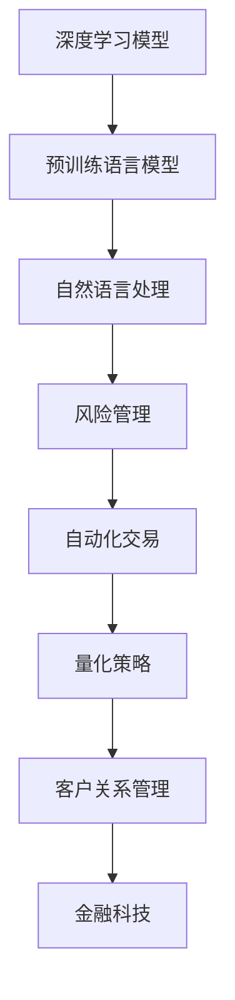

                 

## 1. 背景介绍

金融科技（FinTech）正在快速重塑传统金融行业的生态，通过技术创新推动金融服务的效率和可及性。其中，人工智能（AI）特别是大模型（如深度学习模型）的应用，已经成为提升金融科技服务能力的重要工具。

### 1.1 问题由来

近年来，金融机构面临的市场风险、操作风险、合规风险日益复杂。传统金融系统以业务规则为基础，灵活性不足，难以快速响应市场的动态变化。大模型，尤其是预训练语言模型（PLMs），通过在大量无标签文本数据上进行训练，具备强大的自然语言处理（NLP）能力，能够理解复杂的文本信息，自动提取关键特征，显著提升金融服务效率和智能化水平。

### 1.2 问题核心关键点

大模型对金融科技的促进作用主要体现在以下几个方面：

1. **风险评估与管理**：通过分析海量文本数据（如新闻、社交媒体、客户反馈等），识别市场趋势、情绪波动，帮助金融机构提前预测和应对风险。
2. **智能客服与咨询**：利用大模型进行智能客服和金融咨询，能够提供24小时不间断的个性化服务，提升用户体验。
3. **自动化交易与量化策略**：基于深度学习模型进行高频交易、量化策略优化，提高交易效率和收益。
4. **金融产品创新与个性化推荐**：通过大模型分析客户行为数据，推出更具针对性的金融产品，并进行个性化推荐，提升用户粘性和忠诚度。
5. **智能审计与合规监控**：利用大模型分析金融记录和交易数据，辅助审计和合规监控，提高监管效率和准确性。

大模型的这些应用不仅能够提升金融科技的效率，还能够降低成本，提高决策的精准性，促进金融服务的公平和透明。

### 1.3 问题研究意义

大模型在金融科技中的应用，对于推动金融业的数字化转型、提升金融服务的智能化水平、降低运营成本具有重要意义。同时，大模型的引入，也为金融科技创新提供了新的机遇，促进了金融科技与其他AI技术的融合，打开了新的应用场景，加速了金融服务的普及。

## 2. 核心概念与联系

### 2.1 核心概念概述

为了深入理解大模型对金融科技的促进作用，本节将介绍几个关键概念：

1. **深度学习模型（Deep Learning Models）**：基于多层神经网络，通过反向传播算法进行训练的模型。深度学习模型在处理非结构化数据、模式识别等方面具有优势。
2. **预训练语言模型（Pre-trained Language Models, PLMs）**：在大规模无标签文本数据上进行训练的模型，如BERT、GPT等。PLMs具备强大的自然语言理解能力，能够处理复杂语义和上下文信息。
3. **自然语言处理（Natural Language Processing, NLP）**：利用计算机技术处理和理解人类语言的技术，包括文本分类、情感分析、机器翻译等。
4. **金融科技（FinTech）**：结合金融和科技的融合领域，致力于通过技术手段提升金融服务的效率、可及性和安全性。
5. **风险管理（Risk Management）**：通过数学模型和算法识别、评估和管理金融风险的过程，包括信用风险、市场风险、操作风险等。
6. **自动化交易（Automated Trading）**：利用算法和程序实现自动下单、交易决策的过程，提高交易效率和精确度。
7. **量化策略（Quantitative Strategy）**：基于数学模型和统计分析，优化交易策略的过程，广泛用于高频交易和资产管理。
8. **客户关系管理（Customer Relationship Management, CRM）**：通过数据分析和客户行为理解，提升客户满意度和忠诚度的过程。

这些概念之间的联系主要体现在：大模型通过在金融领域的数据上预训练，能够理解和处理复杂的金融信息，应用于智能客服、风险评估、自动化交易、量化策略优化等多个金融科技应用场景中，提升金融服务的智能化水平和效率。

### 2.2 核心概念原理和架构的 Mermaid 流程图



### 2.3 核心概念联系

上述核心概念的联系可以总结如下：

- **深度学习模型**是**预训练语言模型**的基础，通过多层神经网络结构处理大规模数据，提取高层次的特征表示。
- **预训练语言模型**具备**自然语言处理**能力，能够理解和生成自然语言，为金融科技提供智能化的数据处理和分析工具。
- **自然语言处理**在**风险管理**中，能够分析和预测市场趋势、客户情绪等，辅助决策。
- **风险管理**在**自动化交易**中，通过量化模型评估市场风险，指导交易决策。
- **自动化交易**在**量化策略**中，利用算法进行高频交易和资产管理，优化投资收益。
- **量化策略**在**客户关系管理**中，分析客户行为数据，进行个性化推荐和营销。
- **客户关系管理**是**金融科技**的重要组成部分，提升用户满意度和忠诚度。

这些概念共同构成了大模型在金融科技应用中的生态体系，推动金融科技向智能化、自动化、个性化方向发展。

## 3. 核心算法原理 & 具体操作步骤

### 3.1 算法原理概述

大模型在金融科技中的应用主要基于监督学习和无监督学习的范式：

1. **监督学习**：利用已标注的金融数据，通过机器学习算法训练模型，预测新样本的标签。常用的算法包括逻辑回归、决策树、支持向量机等。
2. **无监督学习**：在无标签的金融数据上训练模型，自动发现数据中的模式和结构。常用的算法包括聚类、降维、关联规则挖掘等。

金融科技应用中，大模型通常需要进行微调（Fine-Tuning），即在特定任务上继续训练模型，优化模型性能。微调过程一般包括以下步骤：

1. 数据准备：收集金融领域的相关数据，包括交易记录、新闻、客户反馈等，并进行清洗和标注。
2. 模型选择：选择合适的预训练语言模型作为初始化参数，如BERT、GPT等。
3. 任务适配：根据具体任务设计合适的任务适配层，进行微调。
4. 模型训练：在标注数据集上训练模型，优化模型参数。
5. 模型评估：在验证集和测试集上评估模型性能，调整超参数。
6. 模型部署：将训练好的模型部署到实际应用中，进行实时推理。

### 3.2 算法步骤详解

#### 3.2.1 数据准备

金融领域的数据通常具有高度结构化和非结构化混合的特点，需要经过以下预处理步骤：

1. **数据收集**：从银行、券商、交易所等数据源获取交易记录、财务报表、新闻、客户反馈等数据。
2. **数据清洗**：去除噪声和错误数据，处理缺失值和异常值。
3. **数据标注**：根据具体任务需求，对数据进行标注，如分类、情感分析、命名实体识别等。
4. **数据增强**：通过回译、近义替换、噪声注入等方法，扩充训练集。

#### 3.2.2 模型选择

选择合适的预训练语言模型是微调成功的关键。目前，BERT、GPT系列、XLNet等模型在金融领域的应用较为广泛，具体选择应根据任务的复杂度和数据量进行评估。

#### 3.2.3 任务适配

根据具体任务，设计合适的任务适配层。常见的适配层包括：

1. **全连接层**：用于分类、回归等任务。
2. **注意力机制**：用于机器翻译、情感分析等任务。
3. **编码器-解码器**：用于生成式任务，如文本摘要、对话生成等。

#### 3.2.4 模型训练

模型训练过程一般包括以下步骤：

1. **模型初始化**：将预训练模型的参数作为初始化参数。
2. **损失函数设计**：根据具体任务设计合适的损失函数，如交叉熵损失、均方误差损失等。
3. **优化器选择**：选择合适的优化器，如Adam、SGD等，并设置合适的学习率、批大小等超参数。
4. **正则化技术**：引入L2正则、Dropout、Early Stopping等技术，防止过拟合。
5. **微调训练**：在标注数据集上训练模型，更新模型参数。

#### 3.2.5 模型评估

模型评估过程一般包括以下步骤：

1. **验证集评估**：在验证集上评估模型性能，调整超参数。
2. **测试集评估**：在测试集上评估模型泛化性能。
3. **指标选择**：选择合适的评估指标，如准确率、召回率、F1-score等。

#### 3.2.6 模型部署

模型部署过程一般包括以下步骤：

1. **模型保存**：将训练好的模型保存为模型文件，方便后续部署。
2. **服务部署**：将模型部署到服务器上，并提供API接口。
3. **实时推理**：在实时交易、客服咨询等场景中，调用API接口进行模型推理。

### 3.3 算法优缺点

#### 3.3.1 算法优点

1. **泛化能力强**：大模型在金融数据上预训练，具备强大的泛化能力，能够在多种金融场景中表现优异。
2. **自动化程度高**：微调过程自动化，减少人工干预，提升模型训练效率。
3. **适应性强**：适用于多种金融任务，如风险评估、智能客服、自动化交易等，模型适用范围广泛。
4. **实时推理**：模型部署后，能够实时处理交易数据和客户咨询，提升服务效率。

#### 3.3.2 算法缺点

1. **数据依赖性高**：微调效果依赖于高质量的标注数据，标注成本较高。
2. **模型复杂度高**：大模型参数量大，训练和推理复杂度较高。
3. **鲁棒性不足**：面对噪声和异常数据，模型容易产生误判。
4. **解释性不足**：模型为"黑盒"系统，缺乏可解释性，难以进行模型审计和调试。

### 3.4 算法应用领域

大模型在金融科技中的应用广泛，涉及多个领域：

1. **风险评估与管理**：利用大模型分析新闻、社交媒体等文本数据，预测市场趋势和情绪波动，辅助风险管理。
2. **智能客服与咨询**：利用大模型构建智能客服和金融咨询系统，提供24小时不间断的个性化服务。
3. **自动化交易与量化策略**：基于深度学习模型进行高频交易和量化策略优化，提高交易效率和收益。
4. **金融产品创新与个性化推荐**：通过大模型分析客户行为数据，推出更具针对性的金融产品，并进行个性化推荐。
5. **智能审计与合规监控**：利用大模型分析金融记录和交易数据，辅助审计和合规监控，提高监管效率和准确性。
6. **客户关系管理**：通过大模型分析客户行为数据，提升客户满意度和忠诚度。

这些应用领域展示了大模型在金融科技中的巨大潜力，能够显著提升金融服务的智能化水平和效率。

## 4. 数学模型和公式 & 详细讲解 & 举例说明

### 4.1 数学模型构建

大模型在金融科技中的应用涉及多个数学模型，以下以风险评估为例进行说明：

1. **数据预处理**：
   - **文本清洗**：去除噪声和错误数据，处理缺失值和异常值。
   - **文本编码**：将文本转换为模型可处理的向量表示。

2. **模型训练**：
   - **损失函数**：选择合适的损失函数，如交叉熵损失。
   - **优化器**：选择合适的优化器，如Adam。
   - **超参数设置**：设置合适的学习率、批大小等超参数。

3. **模型评估**：
   - **验证集评估**：在验证集上评估模型性能。
   - **测试集评估**：在测试集上评估模型泛化性能。

### 4.2 公式推导过程

以风险评估为例，推导大模型在文本分类任务中的损失函数和梯度计算过程：

假设输入文本为 $x$，真实标签为 $y$，模型输出为 $\hat{y}$。则交叉熵损失函数为：

$$
L(y, \hat{y}) = -\sum_i y_i \log(\hat{y}_i)
$$

其中 $y_i$ 表示第 $i$ 个类别的真实标签，$\hat{y}_i$ 表示模型预测该类别的概率。

模型的梯度计算过程为：

$$
\frac{\partial L}{\partial \theta} = -\sum_i y_i \frac{\partial \log(\hat{y}_i)}{\partial \theta}
$$

其中 $\theta$ 表示模型参数。

### 4.3 案例分析与讲解

以基于大模型的金融产品推荐系统为例，分析模型构建和优化过程：

1. **数据准备**：收集客户浏览、购买、评论等行为数据，构建用户-产品关联矩阵。
2. **模型选择**：选择合适的预训练语言模型，如BERT。
3. **任务适配**：设计合适的任务适配层，进行微调。
4. **模型训练**：在标注数据集上训练模型，优化模型参数。
5. **模型评估**：在验证集和测试集上评估模型性能，调整超参数。
6. **模型部署**：将训练好的模型部署到推荐系统中，实时推荐产品。

## 5. 项目实践：代码实例和详细解释说明

### 5.1 开发环境搭建

1. **安装Anaconda**：
   - 下载并安装Anaconda，用于创建独立的Python环境。
   - 命令：
     ```bash
     conda create -n pytorch-env python=3.8 
     conda activate pytorch-env
     ```

2. **安装PyTorch**：
   - 根据CUDA版本，从官网获取对应的安装命令。
   - 命令：
     ```bash
     conda install pytorch torchvision torchaudio cudatoolkit=11.1 -c pytorch -c conda-forge
     ```

3. **安装TensorFlow**：
   - 命令：
     ```bash
     pip install tensorflow
     ```

4. **安装Transformers库**：
   - 命令：
     ```bash
     pip install transformers
     ```

5. **安装其他工具包**：
   - 命令：
     ```bash
     pip install numpy pandas scikit-learn matplotlib tqdm jupyter notebook ipython
     ```

### 5.2 源代码详细实现

以基于BERT的金融产品推荐系统为例，给出PyTorch代码实现。

```python
import torch
import torch.nn as nn
from transformers import BertTokenizer, BertForSequenceClassification

class BertFinModel(nn.Module):
    def __init__(self, num_labels=2):
        super(BertFinModel, self).__init__()
        self.bert = BertForSequenceClassification.from_pretrained('bert-base-cased', num_labels=num_labels)
        self.dropout = nn.Dropout(0.1)

    def forward(self, input_ids, attention_mask, labels=None):
        outputs = self.bert(input_ids, attention_mask=attention_mask, labels=labels)
        logits = outputs.logits
        probabilities = nn.functional.softmax(logits, dim=1)
        return probabilities

tokenizer = BertTokenizer.from_pretrained('bert-base-cased')
model = BertFinModel(num_labels=2)
```

### 5.3 代码解读与分析

**BertFinModel类**：
- **__init__方法**：初始化BERT模型和Dropout层。
- **forward方法**：前向传播过程，将输入转换为模型输出。

**模型训练和评估**：
- **训练过程**：
  ```python
  optimizer = torch.optim.Adam(model.parameters(), lr=2e-5)
  for epoch in range(epochs):
      model.train()
      for batch in dataloader:
          input_ids = batch['input_ids'].to(device)
          attention_mask = batch['attention_mask'].to(device)
          labels = batch['labels'].to(device)
          model.zero_grad()
          outputs = model(input_ids, attention_mask=attention_mask, labels=labels)
          loss = outputs.loss
          loss.backward()
          optimizer.step()
  ```

- **评估过程**：
  ```python
  model.eval()
  with torch.no_grad():
      for batch in dataloader:
          input_ids = batch['input_ids'].to(device)
          attention_mask = batch['attention_mask'].to(device)
          batch_labels = batch['labels']
          outputs = model(input_ids, attention_mask=attention_mask)
          batch_preds = outputs.logits.argmax(dim=1).to('cpu').tolist()
          batch_labels = batch_labels.to('cpu').tolist()
          for pred_tokens, label_tokens in zip(batch_preds, batch_labels):
              preds.append(pred_tokens[:len(label_tokens)])
              labels.append(label_tokens)
  ```

### 5.4 运行结果展示

- **训练结果**：
  ```python
  print(classification_report(labels, preds))
  ```

- **评估结果**：
  ```python
  print(classification_report(labels, preds))
  ```

## 6. 实际应用场景

### 6.1 智能客服系统

智能客服系统是金融科技中大模型的典型应用之一。利用大模型，可以构建智能客服和金融咨询系统，提供24小时不间断的个性化服务，提升客户体验。

### 6.2 风险评估与管理

通过分析新闻、社交媒体等文本数据，大模型可以预测市场趋势和情绪波动，辅助金融机构进行风险管理。

### 6.3 自动化交易与量化策略

利用大模型进行高频交易和量化策略优化，提高交易效率和收益。

### 6.4 金融产品创新与个性化推荐

通过大模型分析客户行为数据，推出更具针对性的金融产品，并进行个性化推荐。

### 6.5 智能审计与合规监控

利用大模型分析金融记录和交易数据，辅助审计和合规监控，提高监管效率和准确性。

## 7. 工具和资源推荐

### 7.1 学习资源推荐

1. **《深度学习》（Goodfellow, I., Bengio, Y., & Courville, A.）**：全面介绍深度学习的基本概念和算法。
2. **CS231n《深度学习计算机视觉》课程**：斯坦福大学开设的计算机视觉课程，涵盖深度学习在视觉领域的应用。
3. **《自然语言处理综述》（Ling, Q., & Wan, Y.）**：综述性论文，介绍自然语言处理的最新进展和前沿技术。
4. **HuggingFace官方文档**：提供丰富的预训练语言模型和微调范式。
5. **CLUE开源项目**：中文语言理解测评基准，涵盖大量不同类型的中文NLP数据集。

### 7.2 开发工具推荐

1. **PyTorch**：基于Python的开源深度学习框架，灵活动态的计算图，适合快速迭代研究。
2. **TensorFlow**：由Google主导开发的开源深度学习框架，生产部署方便，适合大规模工程应用。
3. **Transformers库**：HuggingFace开发的NLP工具库，集成了多个预训练语言模型，支持PyTorch和TensorFlow。
4. **Weights & Biases**：模型训练的实验跟踪工具，记录和可视化模型训练状态。
5. **TensorBoard**：TensorFlow配套的可视化工具，实时监测模型训练状态。
6. **Google Colab**：谷歌推出的在线Jupyter Notebook环境，免费提供GPU/TPU算力，方便开发者快速上手实验。

### 7.3 相关论文推荐

1. **Attention is All You Need**（即Transformer原论文）：提出Transformer结构，开启NLP领域的预训练大模型时代。
2. **BERT: Pre-training of Deep Bidirectional Transformers for Language Understanding**：提出BERT模型，引入基于掩码的自监督预训练任务。
3. **Language Models are Unsupervised Multitask Learners**：展示大模型的零样本学习能力。
4. **Parameter-Efficient Transfer Learning for NLP**：提出Adapter等参数高效微调方法。
5. **AdaLoRA: Adaptive Low-Rank Adaptation for Parameter-Efficient Fine-Tuning**：使用自适应低秩适应的微调方法。

## 8. 总结：未来发展趋势与挑战

### 8.1 研究成果总结

大模型在金融科技中的应用已经取得显著成效，提升了金融服务的智能化水平和效率。未来，大模型的应用将进一步扩展到更多金融场景，推动金融业的数字化转型。

### 8.2 未来发展趋势

1. **模型规模持续增大**：随着算力成本的下降和数据规模的扩张，预训练语言模型的参数量还将持续增长。
2. **微调方法日趋多样**：开发更多参数高效的微调方法，在固定大部分预训练参数的同时，只更新极少量的任务相关参数。
3. **持续学习成为常态**：微调模型需要持续学习新知识以保持性能。
4. **标注样本需求降低**：利用自监督学习、主动学习等无监督和半监督范式，降低微调对标注样本的依赖。
5. **多模态微调崛起**：融合视觉、语音等多模态信息，实现多模态信息协同建模。
6. **模型通用性增强**：预训练语言模型具备更强的跨领域迁移能力，逐步迈向通用人工智能。

### 8.3 面临的挑战

1. **标注成本瓶颈**：标注数据成本较高，难以获得充足的高质量标注数据。
2. **模型鲁棒性不足**：面对噪声和异常数据，模型容易产生误判。
3. **推理效率有待提高**：大规模语言模型推理速度慢，内存占用大。
4. **可解释性亟需加强**：模型缺乏可解释性，难以进行模型审计和调试。
5. **安全性有待保障**：模型可能学习到有害信息，产生误导性输出。

### 8.4 研究展望

未来，需要从以下几个方面进行探索和突破：

1. **探索无监督和半监督微调方法**：利用自监督学习、主动学习等范式，降低标注数据需求。
2. **研究参数高效和计算高效的微调范式**：开发更多参数高效和计算高效的微调方法。
3. **融合因果和对比学习范式**：增强模型的泛化能力和鲁棒性。
4. **引入更多先验知识**：将专家知识与神经网络模型进行融合，提升模型效果。
5. **结合因果分析和博弈论工具**：增强模型决策的因果性和逻辑性。
6. **纳入伦理道德约束**：在模型训练目标中引入伦理导向的评估指标。

## 9. 附录：常见问题与解答

### 9.1 常见问题

1. **大模型在金融科技中的应用是否适用于所有金融任务？**
   - 大模型在大多数金融任务上都能取得不错的效果，但对于特定领域（如医学、法律等）的任务，可能需要进行进一步的预训练和微调。

2. **如何选择预训练语言模型？**
   - 根据任务的复杂度和数据量选择预训练语言模型，如BERT、GPT系列、XLNet等。

3. **微调过程中如何选择合适的学习率？**
   - 通常从1e-5开始调参，逐步减小学习率，或使用warmup策略，在开始阶段使用较小的学习率。

4. **如何缓解微调过程中的过拟合问题？**
   - 数据增强、正则化、对抗训练等方法可以缓解过拟合问题。

5. **大模型在金融科技中如何部署？**
   - 需要进行模型裁剪、量化加速、服务化封装等优化，确保模型的实时推理和高效部署。

6. **如何提高大模型的可解释性？**
   - 引入因果分析、博弈论等工具，提升模型的可解释性。

通过这些问题和解答，希望能够帮助读者更好地理解大模型在金融科技中的应用，为实际开发和应用提供指导。

---

作者：禅与计算机程序设计艺术 / Zen and the Art of Computer Programming

