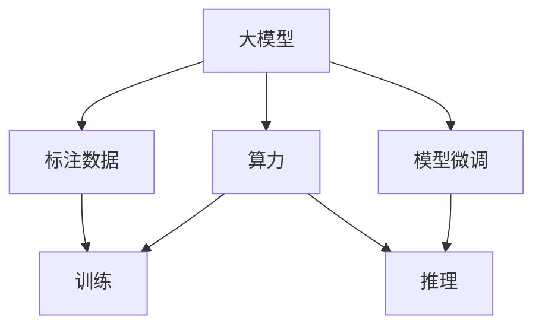

                 

## 1. 背景介绍

### 1.1 问题由来

随着人工智能技术的快速发展，大模型逐渐成为新的技术热点。这些模型通过在海量数据上进行预训练，获得了卓越的性能。但随之而来的是，数据和算力成为了大模型应用过程中难以逾越的壁垒，特别是对于创业公司而言，数据和算力的获取往往需要耗费大量的时间和金钱。

### 1.2 问题核心关键点

数据壁垒和算力瓶颈是当前大模型创业公司面临的两个主要问题：

- 数据壁垒：大模型的训练和微调需要大规模标注数据，而这些数据往往难以获取。标注成本高昂，数据隐私保护也成为一大难题。
- 算力瓶颈：大模型参数众多，计算需求巨大，对GPU、TPU等高性能计算设备依赖性强，创业公司往往难以负担。

这些问题制约了大模型技术在实际应用中的落地速度和应用范围，也对创业公司提出了更高的挑战。

## 2. 核心概念与联系

### 2.1 核心概念概述

为更好地理解数据壁垒和算力瓶颈对大模型创业的影响，本节将介绍几个密切相关的核心概念：

- 大模型(Large Model)：指参数量在千万级以上的预训练模型，如GPT-3、BERT等。这些模型在大规模数据上进行预训练，具备强大的语言理解和生成能力。
- 标注数据(Annotated Data)：经过人工标注，具有明确标签的数据集。标注数据用于训练模型，提升模型的性能。
- 算力(Computational Power)：指计算设备提供的处理能力，通常以计算速度、并行度等指标来衡量。大模型训练和推理过程中，算力是决定效率和性能的关键因素。
- 数据隐私(Data Privacy)：指在数据收集、存储、处理等过程中，保护用户隐私和数据安全。数据隐私保护是大模型创业的重要考量因素。
- 模型微调(Fine-Tuning)：在大模型的基础上，使用下游任务的少量标注数据进行有监督学习，提升模型在该任务上的性能。微调是获取高性能模型的重要途径。

这些核心概念之间的逻辑关系可以通过以下Mermaid流程图来展示：



这个流程图展示了大模型创业过程中，数据和算力的关键作用：

1. 大模型通过预训练和微调获得高性能。
2. 数据标注和获取是大模型训练的必要条件。
3. 算力是训练和推理过程的高性能保证。
4. 微调过程需要充分利用标注数据和算力。

## 3. 核心算法原理 & 具体操作步骤

### 3.1 算法原理概述

大模型创业的核心算法原理可以归纳为以下几个方面：

1. **数据标注与获取**：大模型训练和微调需要大规模标注数据，这些数据需要经过人工标注，标注成本较高。如何高效地获取和处理标注数据，是大模型创业的关键。
2. **模型微调**：在获取标注数据后，需要在大模型基础上进行微调，以提升模型在特定任务上的性能。微调过程需要充分利用标注数据和算力。
3. **算力优化**：算力是大模型训练和推理的瓶颈，创业公司需要优化算力使用，提升计算效率，降低成本。
4. **数据隐私保护**：在数据收集和处理过程中，如何保护用户隐私，是大模型创业的重要考量因素。

### 3.2 算法步骤详解

基于上述核心算法原理，大模型创业的具体操作步骤可以归纳为以下几个关键步骤：

**Step 1: 数据标注与获取**

- **数据收集**：从互联网、社交平台、开放数据集等渠道收集数据。
- **数据清洗**：对收集到的数据进行去重、去噪、清洗等预处理，保证数据质量。
- **数据标注**：通过人工标注或自动化标注工具，对数据进行标签标注，构建标注数据集。
- **数据隐私保护**：在标注和数据处理过程中，采用数据脱敏、加密等技术，保护用户隐私。

**Step 2: 模型微调**

- **选择合适的预训练模型**：根据任务类型，选择适合的预训练模型作为初始化参数，如BERT、GPT-3等。
- **添加任务适配层**：在预训练模型顶层设计合适的输出层和损失函数，适配下游任务。
- **设置微调超参数**：选择合适的优化算法及其参数，如AdamW、SGD等，设置学习率、批大小、迭代轮数等。
- **执行梯度训练**：将训练集数据分批次输入模型，前向传播计算损失函数，反向传播计算参数梯度，更新模型参数。
- **测试和部署**：在测试集上评估微调后模型性能，集成到实际应用系统中。

**Step 3: 算力优化**

- **硬件选择**：根据任务需求，选择合适的硬件设备，如GPU、TPU等。
- **分布式计算**：使用分布式计算框架，如Spark、Dask等，提高计算效率。
- **模型压缩**：采用模型压缩、量化等技术，减少模型大小，降低计算需求。
- **算法优化**：使用优化算法，如梯度累积、混合精度训练等，提升计算效率。

**Step 4: 数据隐私保护**

- **数据脱敏**：在数据收集和处理过程中，采用数据脱敏技术，保护用户隐私。
- **访问控制**：在数据存储和处理过程中，采用访问控制技术，限制数据访问权限。
- **加密存储**：对敏感数据进行加密存储，防止数据泄露。

### 3.3 算法优缺点

基于上述核心算法原理和操作步骤，大模型创业具有以下优点：

1. **高效性能**：大模型具备强大的语言理解和生成能力，能够快速适应各种NLP任务。
2. **灵活性**：通过微调，大模型可以适应特定任务，提升模型性能。
3. **广泛应用**：大模型适用于多种NLP任务，如文本分类、命名实体识别、机器翻译等。
4. **易用性**：大模型和微调工具的广泛使用，使得创业公司能够快速上手，缩短开发周期。

但同时，大模型创业也存在一些局限性：

1. **高标注成本**：大模型的训练和微调需要大规模标注数据，标注成本较高。
2. **高性能计算需求**：大模型对计算资源的需求大，创业公司可能难以负担。
3. **数据隐私问题**：在数据收集和处理过程中，如何保护用户隐私，是大模型创业的重要挑战。
4. **算力瓶颈**：算力是大模型创业的主要瓶颈，如何优化算力使用，提升计算效率，降低成本，需要创新解决方案。

尽管存在这些局限性，但大模型创业在推动NLP技术落地应用、赋能各行各业方面具有巨大的潜力。

### 3.4 算法应用领域

大模型创业在NLP领域的应用范围广泛，包括：

- **智能客服**：使用大模型进行智能问答、情感分析、意图识别等，提升客户咨询体验。
- **金融舆情监测**：通过大模型进行金融舆情分析、市场预测、风险预警等，帮助金融机构规避风险。
- **个性化推荐**：利用大模型进行用户行为分析、推荐系统优化，提升用户体验。
- **医学研究**：使用大模型进行病历分析、药物研发、疾病预测等，提升医疗服务水平。
- **教育应用**：通过大模型进行作业批改、学情分析、知识推荐等，提升教学质量。

此外，大模型创业还在智慧城市、法律咨询、工业制造等领域展现了广泛的应用前景。随着技术的不断进步，大模型创业将进一步推动人工智能技术的产业化进程。

## 4. 数学模型和公式 & 详细讲解 & 举例说明

### 4.1 数学模型构建

本节将使用数学语言对大模型创业的各个关键环节进行严格刻画。

假设大模型为 $M_{\theta}$，其中 $\theta$ 为预训练得到的模型参数。给定下游任务 $T$ 的标注数据集 $D=\{(x_i, y_i)\}_{i=1}^N, x_i \in \mathcal{X}, y_i \in \mathcal{Y}$，其中 $\mathcal{X}$ 为输入空间，$\mathcal{Y}$ 为输出空间。

定义模型 $M_{\theta}$ 在数据样本 $(x,y)$ 上的损失函数为 $\ell(M_{\theta}(x),y)$，则在数据集 $D$ 上的经验风险为：

$$
\mathcal{L}(\theta) = \frac{1}{N} \sum_{i=1}^N \ell(M_{\theta}(x_i),y_i)
$$

在微调过程中，我们希望最小化经验风险，即找到最优参数：

$$
\theta^* = \mathop{\arg\min}_{\theta} \mathcal{L}(\theta)
$$

在实践中，我们通常使用基于梯度的优化算法（如SGD、Adam等）来近似求解上述最优化问题。设 $\eta$ 为学习率，$\lambda$ 为正则化系数，则参数的更新公式为：

$$
\theta \leftarrow \theta - \eta \nabla_{\theta}\mathcal{L}(\theta) - \eta\lambda\theta
$$

其中 $\nabla_{\theta}\mathcal{L}(\theta)$ 为损失函数对参数 $\theta$ 的梯度，可通过反向传播算法高效计算。

### 4.2 公式推导过程

以二分类任务为例，推导交叉熵损失函数及其梯度的计算公式。

假设模型 $M_{\theta}$ 在输入 $x$ 上的输出为 $\hat{y}=M_{\theta}(x) \in [0,1]$，表示样本属于正类的概率。真实标签 $y \in \{0,1\}$。则二分类交叉熵损失函数定义为：

$$
\ell(M_{\theta}(x),y) = -[y\log \hat{y} + (1-y)\log (1-\hat{y})]
$$

将其代入经验风险公式，得：

$$
\mathcal{L}(\theta) = -\frac{1}{N}\sum_{i=1}^N [y_i\log M_{\theta}(x_i)+(1-y_i)\log(1-M_{\theta}(x_i))]
$$

根据链式法则，损失函数对参数 $\theta_k$ 的梯度为：

$$
\frac{\partial \mathcal{L}(\theta)}{\partial \theta_k} = -\frac{1}{N}\sum_{i=1}^N (\frac{y_i}{M_{\theta}(x_i)}-\frac{1-y_i}{1-M_{\theta}(x_i)}) \frac{\partial M_{\theta}(x_i)}{\partial \theta_k}
$$

其中 $\frac{\partial M_{\theta}(x_i)}{\partial \theta_k}$ 可进一步递归展开，利用自动微分技术完成计算。

### 4.3 案例分析与讲解

以金融舆情监测任务为例，分析大模型创业在实际应用中的具体实现。

**案例背景**：某金融机构希望实时监测市场舆论动向，避免负面信息传播导致的金融风险。该任务需要对大规模的金融新闻、评论、报告等进行自然语言处理，提取舆情信息，进行情感分析。

**数据准备**：
- **数据收集**：从互联网、金融媒体、社交平台等渠道收集金融新闻、评论、报告等文本数据。
- **数据清洗**：去除无关信息、噪声数据，清洗处理后的数据。
- **数据标注**：对文本进行情感标注，构建标注数据集。

**模型选择与微调**：
- **预训练模型**：选择BERT、GPT等预训练语言模型。
- **任务适配层**：在顶层添加情感分类器，使用交叉熵损失函数。
- **微调超参数**：设置学习率、批大小、迭代轮数等。

**训练与评估**：
- **训练过程**：将标注数据集分为训练集、验证集和测试集，使用AdamW优化器进行微调训练。
- **评估过程**：在测试集上评估模型性能，输出情感分类结果。

**应用部署**：
- **实时监测**：集成模型到实时舆情监测系统中，实时监测市场舆情，及时预警负面信息。
- **效果分析**：对监测结果进行分析，发现舆情变化趋势，帮助金融机构规避风险。

通过这个案例，可以看出，大模型创业在实际应用中，需要综合考虑数据收集、清洗、标注、微调、训练、评估等多个环节，才能成功实现金融舆情监测等复杂任务。

## 5. 项目实践：代码实例和详细解释说明

### 5.1 开发环境搭建

在进行大模型创业的微调实践前，我们需要准备好开发环境。以下是使用Python进行PyTorch开发的环境配置流程：

1. 安装Anaconda：从官网下载并安装Anaconda，用于创建独立的Python环境。

2. 创建并激活虚拟环境：
```bash
conda create -n pytorch-env python=3.8 
conda activate pytorch-env
```

3. 安装PyTorch：根据CUDA版本，从官网获取对应的安装命令。例如：
```bash
conda install pytorch torchvision torchaudio cudatoolkit=11.1 -c pytorch -c conda-forge
```

4. 安装Transformers库：
```bash
pip install transformers
```

5. 安装各类工具包：
```bash
pip install numpy pandas scikit-learn matplotlib tqdm jupyter notebook ipython
```

完成上述步骤后，即可在`pytorch-env`环境中开始大模型创业的微调实践。

### 5.2 源代码详细实现

下面我们以金融舆情监测任务为例，给出使用Transformers库对BERT模型进行微调的PyTorch代码实现。

首先，定义金融舆情监测任务的数据处理函数：

```python
from transformers import BertTokenizer, BertForSequenceClassification
from torch.utils.data import Dataset, DataLoader
import torch

class FinancialNewsDataset(Dataset):
    def __init__(self, texts, labels, tokenizer, max_len=128):
        self.texts = texts
        self.labels = labels
        self.tokenizer = tokenizer
        self.max_len = max_len
        
    def __len__(self):
        return len(self.texts)
    
    def __getitem__(self, item):
        text = self.texts[item]
        label = self.labels[item]
        
        encoding = self.tokenizer(text, return_tensors='pt', max_length=self.max_len, padding='max_length', truncation=True)
        input_ids = encoding['input_ids'][0]
        attention_mask = encoding['attention_mask'][0]
        
        # 对label进行编码
        encoded_label = [1 if label == 'positive' else 0]
        encoded_label.extend([0] * (self.max_len - len(encoded_label)))
        labels = torch.tensor(encoded_label, dtype=torch.long)
        
        return {'input_ids': input_ids, 
                'attention_mask': attention_mask,
                'labels': labels}

# 标注数据
train_texts = ["XYZ公司股价暴跌...", "金融监管政策变动..."]
train_labels = ["negative", "positive"]
dev_texts = ["ABC公司业绩预增..."]
dev_labels = ["positive"]
test_texts = ["LMN公司财务危机..."]
test_labels = ["negative"]

# 分词器和最大长度
tokenizer = BertTokenizer.from_pretrained('bert-base-cased')
max_len = 128

# 创建dataset
train_dataset = FinancialNewsDataset(train_texts, train_labels, tokenizer, max_len)
dev_dataset = FinancialNewsDataset(dev_texts, dev_labels, tokenizer, max_len)
test_dataset = FinancialNewsDataset(test_texts, test_labels, tokenizer, max_len)
```

然后，定义模型和优化器：

```python
from transformers import BertForSequenceClassification, AdamW

model = BertForSequenceClassification.from_pretrained('bert-base-cased', num_labels=2)

optimizer = AdamW(model.parameters(), lr=2e-5)
```

接着，定义训练和评估函数：

```python
from torch.utils.data import DataLoader
from tqdm import tqdm
from sklearn.metrics import classification_report

device = torch.device('cuda') if torch.cuda.is_available() else torch.device('cpu')
model.to(device)

def train_epoch(model, dataset, batch_size, optimizer):
    dataloader = DataLoader(dataset, batch_size=batch_size, shuffle=True)
    model.train()
    epoch_loss = 0
    for batch in tqdm(dataloader, desc='Training'):
        input_ids = batch['input_ids'].to(device)
        attention_mask = batch['attention_mask'].to(device)
        labels = batch['labels'].to(device)
        model.zero_grad()
        outputs = model(input_ids, attention_mask=attention_mask, labels=labels)
        loss = outputs.loss
        epoch_loss += loss.item()
        loss.backward()
        optimizer.step()
    return epoch_loss / len(dataloader)

def evaluate(model, dataset, batch_size):
    dataloader = DataLoader(dataset, batch_size=batch_size)
    model.eval()
    preds, labels = [], []
    with torch.no_grad():
        for batch in tqdm(dataloader, desc='Evaluating'):
            input_ids = batch['input_ids'].to(device)
            attention_mask = batch['attention_mask'].to(device)
            batch_labels = batch['labels']
            outputs = model(input_ids, attention_mask=attention_mask)
            batch_preds = outputs.logits.argmax(dim=1).to('cpu').tolist()
            batch_labels = batch_labels.to('cpu').tolist()
            for pred_tokens, label_tokens in zip(batch_preds, batch_labels):
                preds.append(pred_tokens)
                labels.append(label_tokens)
                
    print(classification_report(labels, preds))
```

最后，启动训练流程并在测试集上评估：

```python
epochs = 5
batch_size = 16

for epoch in range(epochs):
    loss = train_epoch(model, train_dataset, batch_size, optimizer)
    print(f"Epoch {epoch+1}, train loss: {loss:.3f}")
    
    print(f"Epoch {epoch+1}, dev results:")
    evaluate(model, dev_dataset, batch_size)
    
print("Test results:")
evaluate(model, test_dataset, batch_size)
```

以上就是使用PyTorch对BERT进行金融舆情监测任务微调的完整代码实现。可以看到，得益于Transformers库的强大封装，我们可以用相对简洁的代码完成BERT模型的加载和微调。

### 5.3 代码解读与分析

让我们再详细解读一下关键代码的实现细节：

**FinancialNewsDataset类**：
- `__init__`方法：初始化文本、标签、分词器等关键组件。
- `__len__`方法：返回数据集的样本数量。
- `__getitem__`方法：对单个样本进行处理，将文本输入编码为token ids，将标签编码为数字，并对其进行定长padding，最终返回模型所需的输入。

**标注数据**：
- 定义训练集、验证集和测试集的数据和标签。
- 使用BertTokenizer分词器对文本进行分词。

**训练和评估函数**：
- 使用PyTorch的DataLoader对数据集进行批次化加载，供模型训练和推理使用。
- 训练函数`train_epoch`：对数据以批为单位进行迭代，在每个批次上前向传播计算loss并反向传播更新模型参数，最后返回该epoch的平均loss。
- 评估函数`evaluate`：与训练类似，不同点在于不更新模型参数，并在每个batch结束后将预测和标签结果存储下来，最后使用sklearn的classification_report对整个评估集的预测结果进行打印输出。

**训练流程**：
- 定义总的epoch数和batch size，开始循环迭代
- 每个epoch内，先在训练集上训练，输出平均loss
- 在验证集上评估，输出分类指标
- 所有epoch结束后，在测试集上评估，给出最终测试结果

可以看到，PyTorch配合Transformers库使得BERT微调的代码实现变得简洁高效。开发者可以将更多精力放在数据处理、模型改进等高层逻辑上，而不必过多关注底层的实现细节。

当然，工业级的系统实现还需考虑更多因素，如模型的保存和部署、超参数的自动搜索、更灵活的任务适配层等。但核心的微调范式基本与此类似。

## 6. 实际应用场景

### 6.1 智能客服系统

基于大模型创业的对话技术，可以广泛应用于智能客服系统的构建。传统客服往往需要配备大量人力，高峰期响应缓慢，且一致性和专业性难以保证。而使用微调后的对话模型，可以7x24小时不间断服务，快速响应客户咨询，用自然流畅的语言解答各类常见问题。

在技术实现上，可以收集企业内部的历史客服对话记录，将问题和最佳答复构建成监督数据，在此基础上对预训练对话模型进行微调。微调后的对话模型能够自动理解用户意图，匹配最合适的答案模板进行回复。对于客户提出的新问题，还可以接入检索系统实时搜索相关内容，动态组织生成回答。如此构建的智能客服系统，能大幅提升客户咨询体验和问题解决效率。

### 6.2 金融舆情监测

金融机构需要实时监测市场舆论动向，以便及时应对负面信息传播，规避金融风险。传统的人工监测方式成本高、效率低，难以应对网络时代海量信息爆发的挑战。基于大模型创业的文本分类和情感分析技术，为金融舆情监测提供了新的解决方案。

具体而言，可以收集金融领域相关的新闻、报道、评论等文本数据，并对其进行主题标注和情感标注。在此基础上对预训练语言模型进行微调，使其能够自动判断文本属于何种主题，情感倾向是正面、中性还是负面。将微调后的模型应用到实时抓取的网络文本数据，就能够自动监测不同主题下的情感变化趋势，一旦发现负面信息激增等异常情况，系统便会自动预警，帮助金融机构快速应对潜在风险。

### 6.3 个性化推荐系统

当前的推荐系统往往只依赖用户的历史行为数据进行物品推荐，无法深入理解用户的真实兴趣偏好。基于大模型创业的个性化推荐系统可以更好地挖掘用户行为背后的语义信息，从而提供更精准、多样的推荐内容。

在实践中，可以收集用户浏览、点击、评论、分享等行为数据，提取和用户交互的物品标题、描述、标签等文本内容。将文本内容作为模型输入，用户的后续行为（如是否点击、购买等）作为监督信号，在此基础上微调预训练语言模型。微调后的模型能够从文本内容中准确把握用户的兴趣点。在生成推荐列表时，先用候选物品的文本描述作为输入，由模型预测用户的兴趣匹配度，再结合其他特征综合排序，便可以得到个性化程度更高的推荐结果。

### 6.4 未来应用展望

随着大模型创业技术的不断发展，基于微调范式将在更多领域得到应用，为传统行业带来变革性影响。

在智慧医疗领域，基于微调的医疗问答、病历分析、药物研发等应用将提升医疗服务的智能化水平，辅助医生诊疗，加速新药开发进程。

在智能教育领域，微调技术可应用于作业批改、学情分析、知识推荐等方面，因材施教，促进教育公平，提高教学质量。

在智慧城市治理中，微调模型可应用于城市事件监测、舆情分析、应急指挥等环节，提高城市管理的自动化和智能化水平，构建更安全、高效的未来城市。

此外，在企业生产、社会治理、文娱传媒等众多领域，基于大模型创业的人工智能应用也将不断涌现，为经济社会发展注入新的动力。相信随着技术的日益成熟，微调方法将成为人工智能落地应用的重要范式，推动人工智能技术向更广阔的领域加速渗透。

## 7. 工具和资源推荐

### 7.1 学习资源推荐

为了帮助开发者系统掌握大模型创业的理论基础和实践技巧，这里推荐一些优质的学习资源：

1. 《Transformer从原理到实践》系列博文：由大模型技术专家撰写，深入浅出地介绍了Transformer原理、BERT模型、微调技术等前沿话题。

2. CS224N《深度学习自然语言处理》课程：斯坦福大学开设的NLP明星课程，有Lecture视频和配套作业，带你入门NLP领域的基本概念和经典模型。

3. 《Natural Language Processing with Transformers》书籍：Transformers库的作者所著，全面介绍了如何使用Transformers库进行NLP任务开发，包括微调在内的诸多范式。

4. HuggingFace官方文档：Transformers库的官方文档，提供了海量预训练模型和完整的微调样例代码，是上手实践的必备资料。

5. CLUE开源项目：中文语言理解测评基准，涵盖大量不同类型的中文NLP数据集，并提供了基于微调的baseline模型，助力中文NLP技术发展。

通过对这些资源的学习实践，相信你一定能够快速掌握大模型创业的精髓，并用于解决实际的NLP问题。
###  7.2 开发工具推荐

高效的开发离不开优秀的工具支持。以下是几款用于大模型微调开发的常用工具：

1. PyTorch：基于Python的开源深度学习框架，灵活动态的计算图，适合快速迭代研究。大部分预训练语言模型都有PyTorch版本的实现。

2. TensorFlow：由Google主导开发的开源深度学习框架，生产部署方便，适合大规模工程应用。同样有丰富的预训练语言模型资源。

3. Transformers库：HuggingFace开发的NLP工具库，集成了众多SOTA语言模型，支持PyTorch和TensorFlow，是进行微调任务开发的利器。

4. Weights & Biases：模型训练的实验跟踪工具，可以记录和可视化模型训练过程中的各项指标，方便对比和调优。与主流深度学习框架无缝集成。

5. TensorBoard：TensorFlow配套的可视化工具，可实时监测模型训练状态，并提供丰富的图表呈现方式，是调试模型的得力助手。

6. Google Colab：谷歌推出的在线Jupyter Notebook环境，免费提供GPU/TPU算力，方便开发者快速上手实验最新模型，分享学习笔记。

合理利用这些工具，可以显著提升大模型微调的开发效率，加快创新迭代的步伐。

### 7.3 相关论文推荐

大模型创业在NLP领域的研究源于学界的持续研究。以下是几篇奠基性的相关论文，推荐阅读：

1. Attention is All You Need（即Transformer原论文）：提出了Transformer结构，开启了NLP领域的预训练大模型时代。

2. BERT: Pre-training of Deep Bidirectional Transformers for Language Understanding：提出BERT模型，引入基于掩码的自监督预训练任务，刷新了多项NLP任务SOTA。

3. Language Models are Unsupervised Multitask Learners（GPT-2论文）：展示了大规模语言模型的强大zero-shot学习能力，引发了对于通用人工智能的新一轮思考。

4. Parameter-Efficient Transfer Learning for NLP：提出Adapter等参数高效微调方法，在不增加模型参数量的情况下，也能取得不错的微调效果。

5. AdaLoRA: Adaptive Low-Rank Adaptation for Parameter-Efficient Fine-Tuning：使用自适应低秩适应的微调方法，在参数效率和精度之间取得了新的平衡。

这些论文代表了大模型创业的发展脉络。通过学习这些前沿成果，可以帮助研究者把握学科前进方向，激发更多的创新灵感。

## 8. 总结：未来发展趋势与挑战

### 8.1 总结

本文对大模型创业过程中面临的数据壁垒和算力瓶颈进行了全面系统的介绍。首先阐述了数据标注和获取在大模型训练中的重要性，以及如何高效获取和处理标注数据。其次，从原理到实践，详细讲解了模型微调的过程和关键步骤，给出了微调任务开发的完整代码实例。同时，本文还广泛探讨了微调方法在智能客服、金融舆情、个性化推荐等多个行业领域的应用前景，展示了微调范式的巨大潜力。此外，本文精选了微调技术的各类学习资源，力求为读者提供全方位的技术指引。

通过本文的系统梳理，可以看到，大模型创业在推动NLP技术落地应用、赋能各行各业方面具有巨大的潜力。但如何在数据标注、算力优化等方面突破瓶颈，是未来大模型创业的重要课题。

### 8.2 未来发展趋势

展望未来，大模型创业将呈现以下几个发展趋势：

1. **数据自动化标注**：利用AI技术自动进行数据标注，减少人工成本，提升标注效率。
2. **数据预处理自动化**：开发自动化数据清洗、去重、去噪等工具，提升数据处理效率。
3. **模型压缩与优化**：进一步压缩模型大小，优化推理速度，降低计算资源消耗。
4. **微调方法多样化**：引入更多参数高效微调方法，如Prefix-Tuning、LoRA等，提升微调效率。
5. **算力优化**：采用分布式计算、硬件加速等技术，提升计算效率，降低算力成本。
6. **跨领域迁移学习**：研究如何将通用大模型迁移到特定领域，提升模型泛化能力。

这些趋势凸显了大模型创业技术的发展前景，相信随着技术的不断进步，大模型创业必将在更多领域展现其强大的应用价值。

### 8.3 面临的挑战

尽管大模型创业在推动NLP技术落地应用方面具有巨大潜力，但在实际落地过程中，仍面临诸多挑战：

1. **数据隐私问题**：在数据收集和处理过程中，如何保护用户隐私，是大模型创业的重要考量因素。
2. **标注数据不足**：对于长尾应用场景，难以获得充足的高质量标注数据，成为制约微调性能的瓶颈。
3. **算力瓶颈**：算力是大模型创业的主要瓶颈，如何优化算力使用，提升计算效率，降低成本，需要创新解决方案。
4. **模型鲁棒性不足**：对于域外数据，大模型的泛化性能往往大打折扣，如何提高模型鲁棒性，避免灾难性遗忘，还需要更多理论和实践的积累。

尽管存在这些挑战，但大模型创业在推动NLP技术落地应用、赋能各行各业方面具有巨大的潜力。未来，随着相关研究的不断深入，这些挑战终将一一被克服，大模型创业必将在更多领域展现其强大的应用价值。

### 8.4 研究展望

面对大模型创业所面临的挑战，未来的研究需要在以下几个方面寻求新的突破：

1. **数据自动化标注**：研究如何利用AI技术自动进行数据标注，减少人工成本，提升标注效率。
2. **数据预处理自动化**：开发自动化数据清洗、去重、去噪等工具，提升数据处理效率。
3. **模型压缩与优化**：进一步压缩模型大小，优化推理速度，降低计算资源消耗。
4. **微调方法多样化**：引入更多参数高效微调方法，如Prefix-Tuning、LoRA等，提升微调效率。
5. **算力优化**：采用分布式计算、硬件加速等技术，提升计算效率，降低算力成本。
6. **跨领域迁移学习**：研究如何将通用大模型迁移到特定领域，提升模型泛化能力。
7. **数据隐私保护**：研究如何保护用户隐私，确保数据使用的安全性。

这些研究方向将引领大模型创业技术的不断进步，为NLP技术的落地应用和产业发展提供新的动力。相信随着学界和产业界的共同努力，这些挑战终将一一被克服，大模型创业必将在更多领域展现其强大的应用价值。

## 9. 附录：常见问题与解答

**Q1：大模型创业是否适用于所有NLP任务？**

A: 大模型创业在大多数NLP任务上都能取得不错的效果，特别是对于数据量较小的任务。但对于一些特定领域的任务，如医学、法律等，仅仅依靠通用语料预训练的模型可能难以很好地适应。此时需要在特定领域语料上进一步预训练，再进行微调，才能获得理想效果。

**Q2：微调过程中如何选择合适的学习率？**

A: 微调的学习率一般要比预训练时小1-2个数量级，如果使用过大的学习率，容易破坏预训练权重，导致过拟合。一般建议从1e-5开始调参，逐步减小学习率，直至收敛。也可以使用warmup策略，在开始阶段使用较小的学习率，再逐渐过渡到预设值。需要注意的是，不同的优化器(如AdamW、Adafactor等)以及不同的学习率调度策略，可能需要设置不同的学习率阈值。

**Q3：采用大模型创业时会面临哪些资源瓶颈？**

A: 目前主流的预训练大模型动辄以亿计的参数规模，对算力、内存、存储都提出了很高的要求。GPU/TPU等高性能设备是必不可少的，但即便如此，超大批次的训练和推理也可能遇到显存不足的问题。因此需要采用一些资源优化技术，如梯度积累、混合精度训练、模型并行等，来突破硬件瓶颈。同时，模型的存储和读取也可能占用大量时间和空间，需要采用模型压缩、稀疏化存储等方法进行优化。

**Q4：如何缓解微调过程中的过拟合问题？**

A: 过拟合是微调面临的主要挑战，尤其是在标注数据不足的情况下。常见的缓解策略包括：
1. 数据增强：通过回译、近义替换等方式扩充训练集。
2. 正则化：使用L2正则、Dropout、Early Stopping等避免过拟合。
3. 对抗训练：引入对抗样本，提高模型鲁棒性。
4. 参数高效微调：只调整少量参数(如Adapter、Prefix等)，减小过拟合风险。
5. 多模型集成：训练多个微调模型，取平均输出，抑制过拟合。

这些策略往往需要根据具体任务和数据特点进行灵活组合。只有在数据、模型、训练、推理等各环节进行全面优化，才能最大限度地发挥大模型微调的威力。

**Q5：微调模型在落地部署时需要注意哪些问题？**

A: 将微调模型转化为实际应用，还需要考虑以下因素：
1. 模型裁剪：去除不必要的层和参数，减小模型尺寸，加快推理速度。
2. 量化加速：将浮点模型转为定点模型，压缩存储空间，提高计算效率。
3. 服务化封装：将模型封装为标准化服务接口，便于集成调用。
4. 弹性伸缩：根据请求流量动态调整资源配置，平衡服务质量和成本。
5. 监控告警：实时采集系统指标，设置异常告警阈值，确保服务稳定性。
6. 安全防护：采用访问鉴权、数据脱敏等措施，保障数据和模型安全。

大模型微调为NLP应用开启了广阔的想象空间，但如何将强大的性能转化为稳定、高效、安全的业务价值，还需要工程实践的不断打磨。唯有从数据、算法、工程、业务等多个维度协同发力，才能真正实现人工智能技术在垂直行业的规模化落地。总之，微调需要开发者根据具体任务，不断迭代和优化模型、数据和算法，方能得到理想的效果。

---

作者：禅与计算机程序设计艺术 / Zen and the Art of Computer Programming

