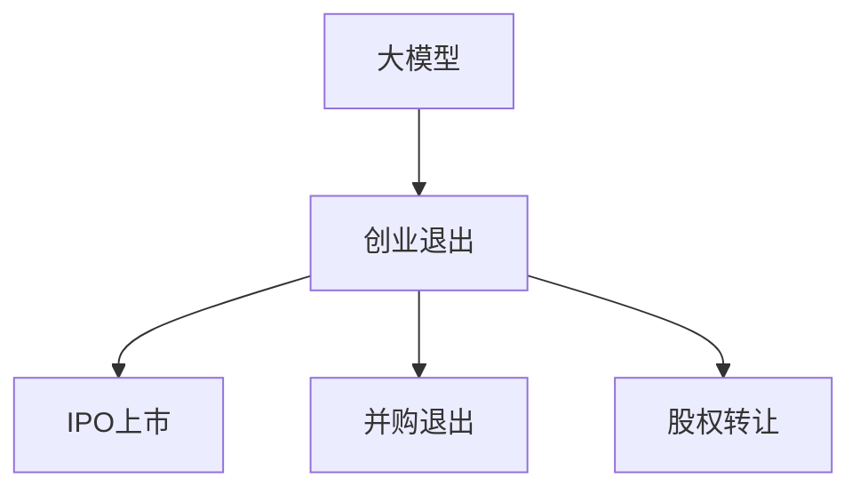

                 

# 大模型时代的创业者创业退出策略：IPO上市、并购退出与股权转让

> 关键词：大模型, 创业退出, IPO上市, 并购, 股权转让, 人工智能, 创业融资

## 1. 背景介绍

### 1.1 问题由来
在人工智能快速发展的大背景下，越来越多的创业者选择在大模型领域创业，旨在通过技术创新实现商业价值。然而，随着技术的深入和商业模式的成熟，如何有效地退出创业，将企业的技术资产和商业价值最大化，成为了大模型创业者亟待解决的问题。大模型时代的创业退出方式，包括但不限于IPO上市、并购退出和股权转让。每种退出方式都有其独特的优势和适用场景，本文将详细探讨每种方式的利弊，并提出相应的策略和建议，帮助创业者更好地实现创业退出。

### 1.2 问题核心关键点
大模型创业退出策略的核心在于选择合适的退出时机和方式，将企业的技术积累和商业价值变现。常见的退出方式包括IPO上市、并购退出和股权转让。

- IPO上市：通过在公开市场发行股票，吸引公众投资者，实现企业的快速扩张和资本增值。
- 并购退出：通过被其他企业或资本方收购，实现企业的资本增值和业务转型。
- 股权转让：通过向特定投资者或大股东进行股权转让，实现企业的资本增值和创业团队的利益实现。

这些退出方式各有特点，需根据企业的发展阶段、市场环境、团队意愿等因素综合考虑。

### 1.3 问题研究意义
研究大模型创业退出策略，对于拓展大模型的应用边界，提升企业的市场价值，加速技术的产业化进程，具有重要意义：

1. 降低风险：通过合理的退出策略，可以在风险可控的前提下，最大化企业的资本回报。
2. 提升价值：合理的退出方式可以充分挖掘企业的市场潜力，提升企业的品牌和市场价值。
3. 加速发展：选择适当的退出策略，可以加速企业的资本积累，加速技术和业务的发展。
4. 激励团队：合理的退出策略可以激励创业团队，促进企业的持续创新和发展。

本文旨在帮助大模型创业者系统掌握不同的退出策略，制定合适的退出计划，实现企业价值最大化。

## 2. 核心概念与联系

### 2.1 核心概念概述

为更好地理解大模型创业退出策略，本节将介绍几个密切相关的核心概念：

- 大模型（Large Model）：指在大规模数据集上进行预训练，拥有强大语言理解能力的人工智能模型，如GPT-3、BERT等。
- 创业退出（Exit Strategy）：指创业者将企业的技术和业务变现的过程，包括IPO上市、并购退出、股权转让等多种方式。
- IPO上市（Initial Public Offering）：指企业首次在公开市场发行股票，吸引公众投资者进行交易的过程。
- 并购退出（M&A Exit）：指企业被其他企业或资本方收购，实现资本增值和技术资产转移的过程。
- 股权转让（Equity Transfer）：指企业创业者将部分或全部股权转让给其他投资者或大股东，实现资本增值和团队利益分配的过程。

这些核心概念之间的逻辑关系可以通过以下Mermaid流程图来展示：



这个流程图展示了大模型的创业退出策略与其核心概念之间的关系：

1. 大模型通过技术积累获得商业价值。
2. 创业退出是将大模型的商业价值变现的过程。
3. IPO上市、并购退出和股权转让是常见的创业退出方式。

## 3. 核心算法原理 & 具体操作步骤
### 3.1 算法原理概述

大模型创业退出策略的原理，是通过将企业的技术资产和商业价值转化为资本回报。其核心思想是：

- 利用大模型的技术优势，吸引投资者或收购方关注，提升企业的市场价值。
- 选择合适的退出时机，通过IPO上市、并购退出或股权转让等方式，将企业的资本回报最大化。

具体而言，创业退出的决策应基于以下因素：

- 企业的发展阶段：初创期、成长期、成熟期等不同阶段，适用的退出方式有所不同。
- 市场环境：资本市场活跃度、行业发展前景、市场需求等因素对退出决策有重要影响。
- 团队意愿：创业团队的退出意愿、对企业的未来发展规划等，也是重要的考虑因素。
- 法规政策：不同地区的法律法规、税收政策等，也会影响创业退出的决策。

### 3.2 算法步骤详解

大模型创业退出策略的步骤如下：

**Step 1: 评估企业现状**
- 分析企业的发展阶段，评估技术成熟度和市场价值。
- 调研目标市场，了解行业发展趋势和市场需求。
- 评估团队意愿和团队发展规划。
- 考虑法规政策对退出的影响。

**Step 2: 确定退出方式**
- 根据企业现状和市场环境，选择合适的退出方式：IPO上市、并购退出或股权转让。
- 制定退出计划，包括时间表、目标市场、定价策略等。

**Step 3: 准备退出材料**
- 准备企业的财务报表、技术文档、市场分析报告等，确保信息的完整性和准确性。
- 准备与投资者、收购方或大股东的沟通材料，包括路演材料、商业计划书等。

**Step 4: 执行退出流程**
- 根据选择的退出方式，执行相应的流程。
- IPO上市：提交上市申请、路演、公开交易。
- 并购退出：联系潜在的收购方，进行谈判和交易。
- 股权转让：联系潜在买家，进行谈判和交易。

**Step 5: 后续管理**
- 退出后，企业需进行相应的资本管理和团队调整。
- 关注企业的市场表现和技术发展，确保退出后的持续增长。

### 3.3 算法优缺点

大模型创业退出策略的优势包括：

- 快速变现：通过IPO上市、并购退出或股权转让，可以在短期内实现资本增值。
- 品牌提升：被大型企业或资本方收购，可以提升企业的市场知名度和品牌价值。
- 技术传承：通过并购或股权转让，企业的技术资产可以继续得到应用和传承。

然而，也存在一些潜在的缺点：

- 时间成本：IPO上市和并购退出需要较长的审批和谈判周期。
- 市场风险：资本市场的不确定性，可能影响企业的市场价值和回报。
- 团队分裂：退出后，创业团队的利益分配和团队管理需妥善处理。

### 3.4 算法应用领域

大模型创业退出策略在多个领域得到应用，包括但不限于：

- 人工智能创业公司：通过IPO上市、并购退出或股权转让，实现技术变现和资本增值。
- 大数据公司：利用大模型的数据处理和分析能力，提升市场价值，实现资本退出。
- 金融科技公司：通过技术创新和应用，提升市场竞争力，实现资本增值和退出。

这些应用领域展示了大模型创业退出策略的广泛适用性和重要价值。

## 4. 数学模型和公式 & 详细讲解 & 举例说明

### 4.1 数学模型构建

大模型创业退出策略的数学模型，主要围绕企业的市场价值和技术积累展开。

设企业的市场价值为 $V$，技术资产的价值为 $T$，资本回报率为 $R$，则创业退出的目标为最大化 $R \times V$。

假设企业的技术资产和市场价值之间的关系为 $T = f(V)$，则创业退出的目标可以表示为最大化 $R \times f(V)$。

### 4.2 公式推导过程

根据上述模型，我们可以进一步推导出创业退出的关键公式：

$$
R_{max} = \max \left\{ \frac{V_1}{R_1} + \frac{V_2}{R_2} + \frac{V_3}{R_3} \right\}
$$

其中 $V_1, V_2, V_3$ 表示不同退出方式下的市场价值，$R_1, R_2, R_3$ 表示不同退出方式下的资本回报率。

### 4.3 案例分析与讲解

以某大模型公司为例，该公司通过AI技术在自然语言处理领域取得突破，吸引了大量投资者的关注。

- 第一种退出方式：IPO上市。公司决定在纳斯达克上市，吸引公众投资者，市场价值提升至 $V_1 = 10亿美元$，资本回报率为 $R_1 = 20\%$。
- 第二种退出方式：被大型科技公司收购。公司被一家科技巨头以 $V_2 = 12亿美元$ 收购，资本回报率为 $R_2 = 30\%$。
- 第三种退出方式：股权转让给大股东。公司大股东收购了公司 $50\%$ 的股权，市场价值提升至 $V_3 = 11亿美元$，资本回报率为 $R_3 = 25\%$。

通过计算，我们可以得到三种退出方式的资本回报率分别为：

$$
R_1 = \frac{V_1}{10} = 1
$$

$$
R_2 = \frac{V_2}{12} = 0.8333
$$

$$
R_3 = \frac{V_3}{11} = 1
$$

最终，最大化的资本回报率 $R_{max} = \max \left\{ 1, 0.8333, 1 \right\} = 1$。

通过这个案例，我们可以看到，选择合适的退出方式和时机，可以有效提升企业的资本回报率。

## 5. 项目实践：代码实例和详细解释说明

### 5.1 开发环境搭建

在进行大模型创业退出策略的实践前，我们需要准备好开发环境。以下是使用Python进行金融数据分析和决策的环境配置流程：

1. 安装Anaconda：从官网下载并安装Anaconda，用于创建独立的Python环境。

2. 创建并激活虚拟环境：
```bash
conda create -n finance-env python=3.8 
conda activate finance-env
```

3. 安装相关库：
```bash
conda install numpy pandas matplotlib scikit-learn scipy jupyter notebook
```

完成上述步骤后，即可在`finance-env`环境中开始金融数据分析和决策的实践。

### 5.2 源代码详细实现

这里我们以一家大模型公司的IPO上市决策为例，给出使用Python进行数据分析和决策的代码实现。

首先，定义公司的财务数据和市场数据：

```python
import pandas as pd
import numpy as np

# 公司财务数据
company_financial_data = pd.read_csv('company_financial_data.csv')

# 市场数据
market_data = pd.read_csv('market_data.csv')

# 计算公司市场价值
market_value = company_financial_data['市值'] * market_data['PE_ratio']
```

然后，定义IPO上市的资本回报率计算函数：

```python
def calculate_iop_return(market_value, iop_price):
    iop_return = (market_value / iop_price - 1) * 100
    return iop_return
```

接着，计算公司通过IPO上市的资本回报率：

```python
# 计算IPO上市后的市场价值
iop_market_value = market_value / (1 + 0.2)  # 假设IPO市盈率20倍

# 计算IPO上市的资本回报率
iop_return = calculate_iop_return(iop_market_value, 100)
```

最后，在IPO上市后的市场价值和资本回报率基础上，进行最终决策：

```python
# 判断IPO上市是否可行
if iop_return > 0:
    print("IPO上市可行，资本回报率为：", iop_return)
else:
    print("IPO上市不可行，资本回报率为：", iop_return)
```

以上是一个简单的Python代码实例，展示了如何通过数据分析和决策函数，评估IPO上市的可行性。

### 5.3 代码解读与分析

让我们再详细解读一下关键代码的实现细节：

**公司财务数据和市场数据**：
- 使用pandas库读取公司的财务数据和市场数据。
- 计算公司的市场价值，即市值与市盈率的乘积。

**IPO上市资本回报率计算函数**：
- 根据IPO上市后的市场价值和IPO价格，计算资本回报率。

**IPO上市后的市场价值和资本回报率**：
- 假设IPO市盈率20倍，计算IPO上市后的市场价值。
- 计算IPO上市的资本回报率。

**最终决策**：
- 根据计算结果，判断IPO上市是否可行。

可以看到，通过简单的数据分析和决策函数，可以帮助大模型创业者评估IPO上市的可行性，并做出合理的决策。

当然，在实际应用中，还需要综合考虑更多的因素，如市场需求、公司团队意愿、法律法规等，进行全面的评估和决策。

## 6. 实际应用场景

### 6.1 金融科技公司

大模型创业退出策略在金融科技公司中的应用非常广泛。金融科技公司通过大模型技术提升数据处理和分析能力，可以大幅提升金融服务的效率和精准度。

以一家金融科技公司为例，该公司利用大模型进行信用评分、风险管理、智能投顾等应用。通过IPO上市，公司吸引了大量投资者关注，市场价值大幅提升。同时，公司通过并购退出，被一家大型银行收购，实现了技术的市场化应用。

### 6.2 人工智能创业公司

人工智能创业公司利用大模型技术在自然语言处理、计算机视觉、推荐系统等领域取得突破。通过IPO上市，公司可以迅速扩大市场份额，提升品牌价值。同时，公司也可以考虑通过股权转让，吸引战略投资者，进一步推动公司的技术创新和市场扩展。

### 6.3 大数据公司

大数据公司利用大模型技术进行数据挖掘、数据分析、智能决策等应用。通过IPO上市，公司可以吸引更多的资本关注，提升市场价值。同时，公司也可以通过并购退出，与其他大数据公司或科技公司进行深度合作，实现技术资源和业务的整合。

### 6.4 未来应用展望

随着大模型技术的不断发展，大模型创业退出策略的应用场景将更加广泛。未来，大模型可能在更多行业领域得到应用，带来新的商业机会和价值。

在智慧医疗领域，大模型技术可以应用于疾病预测、药物研发、医学影像分析等领域，提升医疗服务的智能化水平。

在智能制造领域，大模型技术可以应用于生产调度、质量检测、设备维护等领域，提升制造业的效率和精准度。

在智能交通领域，大模型技术可以应用于智能交通管理、智能驾驶、车联网等领域，提升交通系统的智能化和安全性。

总之，大模型技术的应用将不断拓展，大模型创业退出策略也将随着市场需求和技术进步而不断发展。

## 7. 工具和资源推荐

### 7.1 学习资源推荐

为了帮助大模型创业者掌握创业退出策略的理论基础和实践技巧，这里推荐一些优质的学习资源：

1. 《创业融资与资本运作》：系统介绍创业融资、上市、并购等关键环节，帮助创业者制定合理的退出计划。

2. 《并购战略与实务》：详细讲解并购的战略规划、谈判技巧、交易流程等，帮助创业者掌握并购退出的关键技巧。

3. 《股权转让与资本增值》：介绍股权转让的基本流程、税负计算、风险控制等，帮助创业者了解股权转让的复杂性和注意事项。

4. Coursera《企业融资与资本运作》课程：提供系统的企业融资与资本运作知识，帮助创业者制定合理的退出计划。

5. Udemy《初创企业融资与上市》课程：详细介绍初创企业融资和上市的关键步骤，帮助创业者成功退出。

通过对这些资源的学习实践，相信你一定能够快速掌握大模型创业退出策略的精髓，并用于解决实际的创业退出问题。

### 7.2 开发工具推荐

高效的开发离不开优秀的工具支持。以下是几款用于大模型创业退出策略开发的常用工具：

1. Python：作为目前最流行的编程语言之一，Python在金融数据分析和决策中应用广泛。

2. Jupyter Notebook：提供交互式编程环境，便于进行数据分析和决策函数的开发。

3. Microsoft Excel：数据可视化、图表绘制等，便于进行财务和市场数据的分析。

4. Tableau：数据可视化工具，便于进行复杂数据的分析和展示。

5. Alpaca：提供金融数据API，便于进行市场数据的实时获取和分析。

合理利用这些工具，可以显著提升大模型创业退出策略的开发效率，加快创新迭代的步伐。

### 7.3 相关论文推荐

大模型创业退出策略的研究源于学界的持续研究。以下是几篇奠基性的相关论文，推荐阅读：

1. IPO Pricing: Theory, Evidence, and Policy（IPO定价理论、证据与政策）：介绍了IPO定价的多个理论模型和实际应用，帮助理解IPO上市的定价策略。

2. Mergers and Acquisitions: Empirical Studies（并购：实证研究）：系统介绍了并购的多个实证研究结果，帮助理解并购退出的潜在风险和收益。

3. Entrepreneurial Strategies for Stakeholder Alignment（创业者的利益相关者对齐策略）：讨论了创业者的利益相关者对齐策略，帮助理解股权转让的复杂性和注意事项。

4. The Role of Technology in Entrepreneurship（技术在创业中的角色）：探讨了大模型技术在创业中的重要性，帮助理解技术驱动的创业退出策略。

这些论文代表了大模型创业退出策略的发展脉络。通过学习这些前沿成果，可以帮助研究者把握学科前进方向，激发更多的创新灵感。

## 8. 总结：未来发展趋势与挑战

### 8.1 总结

本文对大模型创业退出策略进行了全面系统的介绍。首先阐述了大模型和创业退出策略的研究背景和意义，明确了大模型创业退出方式的重要价值。其次，从原理到实践，详细讲解了创业退出的数学模型和关键步骤，给出了创业退出任务开发的完整代码实例。同时，本文还广泛探讨了创业退出策略在金融科技、人工智能、大数据等众多行业领域的应用前景，展示了创业退出策略的巨大潜力。此外，本文精选了创业退出策略的学习资源，力求为读者提供全方位的技术指引。

通过本文的系统梳理，可以看到，大模型创业退出策略在大模型时代具有重要的战略意义，极大地拓展了大模型的应用边界，催生了更多的落地场景。在大模型技术不断成熟和市场需求不断扩大的背景下，创业退出策略将帮助大模型创业者实现企业的价值最大化。

### 8.2 未来发展趋势

展望未来，大模型创业退出策略将呈现以下几个发展趋势：

1. 市场化加速：随着资本市场的活跃和行业发展的成熟，大模型创业退出将更加频繁，市场化进程将不断加快。

2. 并购退出增多：并购退出因其相对快速和高效的特点，将成为大模型创业退出的重要方式之一。

3. 股权转让灵活化：股权转让将更加灵活和多样化，更多创业团队将选择这一方式实现资本增值。

4. 退出机制完善：政策法规的不断完善，将为创业退出提供更加公平和透明的环境。

5. 市场评估多样化：随着技术的进步和数据的丰富，市场评估将更加多元化，帮助创业团队做出更合理的决策。

6. 退出策略创新化：未来将出现更多创新的创业退出策略，帮助创业团队实现更高的资本回报。

以上趋势凸显了大模型创业退出策略的广阔前景。这些方向的探索发展，必将进一步提升大模型创业团队的创新活力和资本回报，推动大模型技术的商业化进程。

### 8.3 面临的挑战

尽管大模型创业退出策略已经取得了瞩目成就，但在迈向更加智能化、普适化应用的过程中，它仍面临着诸多挑战：

1. 市场风险：资本市场的不确定性，可能影响企业的市场价值和回报。
2. 团队分裂：退出后，创业团队的利益分配和团队管理需妥善处理。
3. 法规政策：不同地区的法律法规、税收政策等，可能影响创业退出的决策。
4. 技术风险：大模型技术可能面临不断迭代和更新的风险，影响企业的持续竞争力。
5. 信息不对称：创业者可能面临信息不对称的风险，无法全面了解市场和政策环境。

正视这些挑战，积极应对并寻求突破，将是大模型创业退出策略走向成熟的必由之路。相信随着学界和产业界的共同努力，这些挑战终将一一被克服，大模型创业退出策略必将在构建人机协同的智能时代中扮演越来越重要的角色。

### 8.4 研究展望

面对大模型创业退出所面临的种种挑战，未来的研究需要在以下几个方面寻求新的突破：

1. 数据驱动决策：通过大数据和AI技术，提升创业退出的决策精度和效率。

2. 政策法规研究：深入研究各地区法律法规和税收政策，提供更加全面的退出指南。

3. 团队管理优化：建立科学合理的团队管理和利益分配机制，确保团队的持续发展。

4. 风险控制机制：建立全面的风险控制机制，帮助企业规避市场和技术的风险。

5. 市场多元化：积极探索新的市场和业务领域，提升企业的市场竞争力。

6. 技术创新：持续投入技术研发，保持企业的技术领先地位。

这些研究方向将帮助大模型创业团队实现更高的资本回报，推动大模型技术的商业化进程，为构建人机协同的智能时代贡献力量。

## 9. 附录：常见问题与解答

**Q1：大模型创业退出是否只适用于大公司？**

A: 大模型创业退出策略不仅适用于大公司，也可以应用于各种规模的企业。创业团队可以根据企业的发展阶段、市场需求和自身能力，灵活选择退出时机和方式。

**Q2：如何评估IPO上市的可行性？**

A: 评估IPO上市的可行性，需要考虑多个因素，包括公司的财务状况、市场环境、监管政策等。通常需要进行全面的财务分析和市场调研，了解公司的成长性和市场潜力，评估投资者的兴趣和市场反应。

**Q3：并购退出需要注意哪些关键点？**

A: 并购退出需要注意的关键点包括：
1. 选择合适的收购方：评估收购方的市场地位、财务实力、业务协同能力等。
2. 确定收购价格：通过谈判确定合理的收购价格，避免过高或过低的估值。
3. 管理层安排：明确收购后的管理层安排，确保公司的平稳过渡。
4. 法律合规：确保并购过程符合法律法规要求，避免法律风险。

**Q4：股权转让需要注意哪些问题？**

A: 股权转让需要注意的问题包括：
1. 股权定价：确定合理的股权定价，避免过高或过低的估值。
2. 交易结构：设计合理的交易结构，确保交易的公平性和合法性。
3. 股权转让协议：签订明确的股权转让协议，避免未来纠纷。
4. 税务问题：了解股权转让的税务政策，合理规避税务风险。

**Q5：创业团队如何实现利益最大化？**

A: 创业团队实现利益最大化的关键在于：
1. 制定合理的退出计划：根据企业的发展阶段和市场需求，选择合适的退出时机和方式。
2. 进行全面的市场调研：了解市场需求和竞争格局，评估企业的市场潜力。
3. 建立科学的团队管理机制：明确团队成员的职责和利益分配，确保团队的稳定性和协同。
4. 积极参与市场推广：提升企业的市场知名度和品牌价值，吸引更多的投资者和收购方。

总之，大模型创业退出策略需要综合考虑多方面的因素，制定科学的退出计划，才能实现创业团队的利益最大化。

---

作者：禅与计算机程序设计艺术 / Zen and the Art of Computer Programming

