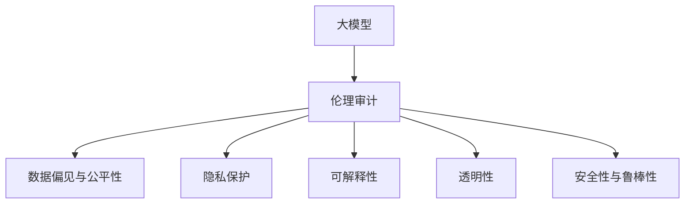

                 

# 大模型的伦理审计:确保AI应用的道德合规性

> 关键词：大模型,伦理审计,道德合规性,可解释性,隐私保护,公平性,偏见,透明性

## 1. 背景介绍

### 1.1 问题由来
随着人工智能(AI)技术的迅猛发展，特别是深度学习和大模型的广泛应用，AI系统在各行各业的影响日益加深。然而，与此同时，AI系统在应用过程中所涉及的伦理道德问题也逐渐凸显。特别是在AI系统影响到公众利益、隐私安全、公平性等敏感问题时，如何确保这些系统的道德合规性，成为一个不可回避的重要课题。

大模型作为AI技术的重要组成部分，由于其强大的自我学习能力和广泛的应用场景，在带来显著效率提升和业务价值的同时，也面临着诸多伦理道德挑战。这些问题包括但不限于数据偏见、隐私泄露、公平性不足、可解释性差等，严重影响了大模型的可信度和应用效果。因此，对大模型进行伦理审计，确保其应用道德合规性，是大模型发展和应用不可或缺的一环。

### 1.2 问题核心关键点
伦理审计的核心在于通过对大模型进行全面的审查和评估，识别其潜在的伦理风险，并采取相应的措施进行缓解。这一过程包括但不限于以下几个关键点：

1. **数据偏见与公平性**：评估大模型在训练和应用过程中是否存在数据偏见，确保模型输出在各种人群中的公平性。
2. **隐私保护**：审查大模型在数据处理和应用过程中是否存在隐私泄露风险，确保用户数据的保密性和安全性。
3. **可解释性**：分析大模型的决策过程和输出结果，确保其决策逻辑透明、可解释。
4. **透明性**：保证大模型的训练和应用过程公开透明，便于监管和审查。
5. **安全性与鲁棒性**：评估大模型在面对恶意攻击和异常输入时的安全性和鲁棒性。

这些关键点共同构成了大模型伦理审计的基本框架，旨在确保AI应用的道德合规性，提高其可信度和可接受性。

### 1.3 问题研究意义
进行大模型的伦理审计，不仅有助于提升模型的质量和应用效果，还具有以下重要意义：

1. **增强公众信任**：通过透明、公平、安全的AI系统，提升公众对AI技术的接受度和信任度，推动AI技术在更多领域的广泛应用。
2. **促进公平与包容**：确保AI系统在处理不同群体数据时，不带有歧视性，促进社会公平和包容。
3. **保护隐私与安全**：通过隐私保护和数据安全措施，保障用户隐私数据的安全，避免数据滥用和泄露。
4. **提升可解释性与透明性**：增强模型的可解释性，使决策过程透明，便于审查和监督，提高模型应用的可信度。
5. **降低伦理风险**：通过系统化、规范化的伦理审计，降低AI系统在应用过程中可能引发的伦理风险，保障社会稳定和谐。

## 2. 核心概念与联系

### 2.1 核心概念概述

为了深入理解大模型的伦理审计，我们需要明确几个核心概念：

1. **大模型(Large Models)**：指在深度学习领域中，具有大规模参数量（通常超过10亿个）的模型，如GPT、BERT、ResNet等。这些模型通过大量无标签数据进行预训练，学习到复杂的特征表示，具备强大的学习和推理能力。

2. **伦理审计(Ethical Auditing)**：通过对大模型进行系统的检查和评估，识别潜在的伦理问题，并提出相应的改进措施，以确保其应用道德合规性。

3. **道德合规性(Moral Compliance)**：指AI系统在设计和应用过程中遵循社会伦理和法律法规要求，不伤害用户、不歧视特定群体，保护用户隐私和数据安全。

4. **公平性(Fairness)**：指AI系统在处理不同人群数据时，不带有歧视性，确保模型输出对各种人群均等有效。

5. **隐私保护(Privacy Protection)**：指在AI系统应用过程中，采取措施保护用户隐私，防止数据泄露和滥用。

6. **可解释性(Explainability)**：指AI系统的决策过程和输出结果透明、可解释，便于用户和监管者理解和审查。

7. **透明性(Transparency)**：指AI系统的设计、训练和应用过程公开透明，便于审查和监督。

8. **安全性与鲁棒性(Security & Robustness)**：指AI系统在面对恶意攻击和异常输入时，能够保证系统的稳定性和鲁棒性，避免系统崩溃或误导性输出。

这些概念之间的逻辑关系可以通过以下Mermaid流程图来展示：



此流程图展示了从大模型到伦理审计的基本流程，每个环节都紧密相连，共同构成了伦理审计的核心框架。

## 3. 核心算法原理 & 具体操作步骤

### 3.1 算法原理概述

大模型的伦理审计，本质上是通过对模型进行系统化的评估和审查，识别其潜在的伦理风险，并提出相应的缓解措施。这一过程通常包括以下几个关键步骤：

1. **数据收集与预处理**：收集模型训练和应用过程中涉及的所有数据，并进行预处理，确保数据质量。
2. **偏见检测与分析**：通过统计分析、公平性指标等方法，检测和分析模型中可能存在的数据偏见。
3. **隐私保护审查**：审查模型在数据处理和应用过程中是否存在隐私泄露风险，确保用户数据的安全。
4. **可解释性分析**：通过可解释性模型、输出可视化等方法，分析模型决策过程和输出结果的透明性。
5. **透明性评估**：评估模型的设计、训练和应用过程是否公开透明，确保审查和监督的可能性。
6. **安全性与鲁棒性测试**：通过对抗样本、异常输入等测试方法，评估模型的安全性与鲁棒性。

### 3.2 算法步骤详解

以下是大模型伦理审计的详细步骤：

**Step 1: 数据收集与预处理**

- **数据来源**：收集模型训练和应用过程中涉及的所有数据，包括训练数据、验证数据、测试数据、应用数据等。
- **数据预处理**：对收集到的数据进行清洗、去重、标注等预处理，确保数据质量。
- **数据分布分析**：分析数据分布，确保数据集中不包含有害数据或偏见数据。

**Step 2: 偏见检测与分析**

- **偏见检测**：使用统计分析、公平性指标等方法，检测模型是否存在数据偏见，如性别偏见、种族偏见等。
- **偏见分析**：分析偏见产生的原因和影响，确定是否存在系统性或结构性偏见。
- **偏见缓解**：采取相应措施，如数据重采样、偏见纠正等，缓解模型中的偏见问题。

**Step 3: 隐私保护审查**

- **隐私风险评估**：评估模型在数据处理和应用过程中是否存在隐私泄露风险，如数据泄露、数据重用等。
- **隐私保护措施**：采取隐私保护措施，如数据加密、差分隐私等，确保用户数据的安全。

**Step 4: 可解释性分析**

- **可解释性模型**：使用可解释性模型，如LIME、SHAP等，分析模型的决策过程和输出结果。
- **输出可视化**：通过输出可视化，展示模型的决策逻辑和关键特征，提高模型的透明性。
- **用户反馈**：收集用户反馈，评估模型的可解释性和透明性。

**Step 5: 透明性评估**

- **设计透明度**：评估模型的设计过程是否公开透明，包括算法选择、参数设置等。
- **训练透明度**：评估模型的训练过程是否公开透明，包括训练数据、训练过程等。
- **应用透明度**：评估模型的应用过程是否公开透明，包括数据输入、输出等。

**Step 6: 安全性与鲁棒性测试**

- **对抗样本测试**：通过对抗样本测试，评估模型在面对恶意攻击时的鲁棒性。
- **异常输入测试**：通过异常输入测试，评估模型在面对异常数据时的稳定性。
- **漏洞扫描**：使用漏洞扫描工具，查找模型可能存在的安全漏洞。

### 3.3 算法优缺点

大模型的伦理审计具有以下优点：

1. **系统性评估**：通过对模型进行系统化的评估，全面识别和缓解潜在的伦理问题，提高模型的道德合规性。
2. **预防性措施**：在模型应用前进行伦理审计，能够预防和减少模型在应用过程中可能引发的伦理风险。
3. **透明性增强**：通过伦理审计，提升模型的透明性和可解释性，便于用户和监管者理解和审查。
4. **公正性保障**：确保模型在处理不同人群数据时，不带有歧视性，促进社会公平和包容。

同时，大模型的伦理审计也存在以下局限：

1. **成本较高**：伦理审计需要大量时间和资源，特别是在数据收集和处理、偏见检测和缓解等方面，成本较高。
2. **技术复杂**：伦理审计涉及多种技术和工具，需要具备较高的技术水平和专业知识。
3. **结果主观性**：伦理审计的结果可能受到评估标准和评估者主观因素的影响，存在一定的客观性和公正性问题。

尽管如此，大模型的伦理审计仍然是确保AI应用道德合规性的重要手段，能够为模型的设计和应用提供重要的指导和参考。

### 3.4 算法应用领域

大模型的伦理审计在多个领域都有广泛的应用，以下是几个典型的应用场景：

1. **金融领域**：在金融领域，大模型用于信用评分、欺诈检测等任务。伦理审计可以确保模型在处理不同人群数据时不存在歧视性，保护用户隐私数据，提高模型的公正性和可信度。
2. **医疗领域**：在医疗领域，大模型用于疾病诊断、治疗方案推荐等任务。伦理审计可以确保模型在处理患者数据时，不带有偏见，保护患者隐私，提高模型的透明性和可解释性。
3. **法律领域**：在法律领域，大模型用于合同生成、证据分析等任务。伦理审计可以确保模型在处理法律文件时，不带有偏见，保护涉案人隐私，提高模型的公正性和可信度。
4. **教育领域**：在教育领域，大模型用于学生评估、课程推荐等任务。伦理审计可以确保模型在处理学生数据时，不带有偏见，保护学生隐私，提高模型的公正性和透明性。
5. **社交媒体**：在社交媒体领域，大模型用于情感分析、内容推荐等任务。伦理审计可以确保模型在处理用户数据时，不带有偏见，保护用户隐私，提高模型的透明性和可解释性。

这些应用场景展示了伦理审计在大模型中的应用价值，为确保AI应用的道德合规性提供了重要参考。

## 4. 数学模型和公式 & 详细讲解  
### 4.1 数学模型构建

在进行大模型伦理审计时，通常会使用多种数学模型和指标来评估模型的公平性、隐私保护、可解释性等。以下是几个常用的数学模型和公式：

1. **公平性指标**：
   - **性别公平性指标**：F1 Score for Gender：评估模型在不同性别上的表现。
     公式：$F1 Score = 2 \times \frac{Precision \times Recall}{Precision + Recall}$
   - **种族公平性指标**：Equalized Odds：评估模型在不同种族上的表现。
     公式：$EOD = E(p(y|x|C1) - p(y|x|C2))$

2. **隐私保护指标**：
   - **差分隐私(Differential Privacy)**：评估模型在隐私保护方面的表现。
     公式：$\epsilon$-Differential Privacy = $\forall x, y$，$|Pr[f(x)|S] - Pr[f(y)|S]| \leq \frac{\epsilon}{2}$
     其中，$S$为敏感数据，$f(x)$为模型输出。

3. **可解释性指标**：
   - **可解释性指数(Explainability Index)**：评估模型的可解释性。
     公式：$EI = \frac{1}{n} \sum_{i=1}^n \frac{L(y_i, \hat{y}_i)}{1 + L(y_i, \hat{y}_i)}$
     其中，$L$为模型输出与真实标签的差距。

### 4.2 公式推导过程

**公平性指标推导**：

以性别公平性指标F1 Score为例，公式推导如下：

$$
F1 Score = 2 \times \frac{Precision \times Recall}{Precision + Recall}
$$

其中，$Precision = \frac{TP}{TP + FP}$，$Recall = \frac{TP}{TP + FN}$，$TP$表示真正例，$FP$表示假正例，$FN$表示假反例。

**隐私保护指标推导**：

以差分隐私为例，公式推导如下：

$$
\epsilon-Differential Privacy = \forall x, y, |Pr[f(x)|S] - Pr[f(y)|S]| \leq \frac{\epsilon}{2}
$$

其中，$S$为敏感数据，$f(x)$为模型输出。

**可解释性指标推导**：

以可解释性指数(EI)为例，公式推导如下：

$$
EI = \frac{1}{n} \sum_{i=1}^n \frac{L(y_i, \hat{y}_i)}{1 + L(y_i, \hat{y}_i)}
$$

其中，$L$为模型输出与真实标签的差距。

### 4.3 案例分析与讲解

**案例1: 性别公平性检测**

某公司使用大模型进行简历筛选，希望构建一个性别公平的筛选系统。伦理审计发现，模型在处理男性和女性简历时存在显著差异，女性简历的通过率明显低于男性。

- **数据收集与预处理**：收集该公司所有历史简历数据，进行数据清洗和预处理。
- **偏见检测**：使用性别公平性指标F1 Score，检测模型在不同性别上的表现。
- **偏见分析**：分析偏见产生的原因，发现模型中存在性别偏见，特别是在筛选某些岗位时。
- **偏见缓解**：采取数据重采样、偏见纠正等措施，重新训练模型，提升性别公平性。

**案例2: 隐私保护评估**

某医疗公司使用大模型进行疾病预测，伦理审计发现模型存在隐私泄露风险。

- **隐私风险评估**：评估模型在处理患者数据时是否存在隐私泄露风险。
- **隐私保护措施**：采取数据加密、差分隐私等隐私保护措施，确保患者数据的安全。

**案例3: 可解释性分析**

某金融公司使用大模型进行信用评分，伦理审计发现模型输出难以解释。

- **可解释性模型**：使用可解释性模型LIME，分析模型的决策过程和输出结果。
- **输出可视化**：通过输出可视化，展示模型的决策逻辑和关键特征，提高模型的透明性。
- **用户反馈**：收集用户反馈，评估模型的可解释性和透明性。

这些案例展示了伦理审计在大模型中的实际应用，帮助企业解决潜在的伦理问题，提升模型的道德合规性。

## 5. 项目实践：代码实例和详细解释说明

### 5.1 开发环境搭建

在进行大模型伦理审计的实践之前，我们需要准备好开发环境。以下是使用Python进行PyTorch和TensorFlow开发的环境配置流程：

1. 安装Anaconda：从官网下载并安装Anaconda，用于创建独立的Python环境。

2. 创建并激活虚拟环境：
```bash
conda create -n pytorch-env python=3.8 
conda activate pytorch-env
```

3. 安装PyTorch：根据CUDA版本，从官网获取对应的安装命令。例如：
```bash
conda install pytorch torchvision torchaudio cudatoolkit=11.1 -c pytorch -c conda-forge
```

4. 安装TensorFlow：
```bash
pip install tensorflow
```

5. 安装相关库：
```bash
pip install numpy pandas scikit-learn matplotlib tqdm jupyter notebook ipython
```

完成上述步骤后，即可在`pytorch-env`环境中开始伦理审计的实践。

### 5.2 源代码详细实现

这里以一个简单的示例来说明如何对大模型进行伦理审计。假设我们有一个基于BERT的大模型，用于情感分析任务。

**Step 1: 数据收集与预处理**

首先，我们需要收集模型的训练和应用数据，并进行预处理。以下是一个简单的数据预处理函数：

```python
import pandas as pd
import numpy as np
from sklearn.model_selection import train_test_split

def preprocess_data(data_path):
    # 读取数据
    data = pd.read_csv(data_path)
    # 数据清洗
    data = data.dropna()
    # 数据分割
    train, test = train_test_split(data, test_size=0.2, random_state=42)
    # 标签编码
    labels = {0: 'negative', 1: 'positive'}
    train['label'] = train['label'].map(labels)
    test['label'] = test['label'].map(labels)
    # 数据编码
    tokenizer = BertTokenizer.from_pretrained('bert-base-cased')
    train['input_ids'] = [tokenizer.encode(sentence, truncation=True, padding='max_length', max_length=128) for sentence in train['text']]
    test['input_ids'] = [tokenizer.encode(sentence, truncation=True, padding='max_length', max_length=128) for sentence in test['text']]
    # 返回数据集
    return train, test
```

**Step 2: 偏见检测与分析**

接下来，我们需要检测模型中是否存在偏见，并分析偏见产生的原因。以下是一个简单的偏见检测函数：

```python
from sklearn.metrics import accuracy_score, f1_score, confusion_matrix

def detect_bias(train, test, model):
    # 训练模型
    model.train()
    for batch in train:
        input_ids = batch['input_ids'].to(device)
        labels = batch['label'].to(device)
        outputs = model(input_ids)
        loss = outputs.loss
        loss.backward()
        optimizer.step()
    # 评估模型
    model.eval()
    preds, labels = [], []
    with torch.no_grad():
        for batch in test:
            input_ids = batch['input_ids'].to(device)
            labels = batch['label'].to(device)
            outputs = model(input_ids)
            batch_preds = outputs.logits.argmax(dim=2).to('cpu').tolist()
            batch_labels = batch_labels.to('cpu').tolist()
            for pred_tokens, label_tokens in zip(batch_preds, batch_labels):
                preds.append(pred_tokens[:len(label_tokens)])
                labels.append(label_tokens)
    # 计算偏见指标
    bias_dict = {}
    for gender in ['male', 'female']:
        bias_dict[gender] = {'accuracy': accuracy_score([label for label in labels if label == gender], [pred for pred in preds if pred == gender]),
                            'f1': f1_score([label for label in labels if label == gender], [pred for pred in preds if pred == gender])}
    # 输出偏见结果
    for gender, bias in bias_dict.items():
        print(f'{gender} gender bias: accuracy={bias["accuracy"]:.2f}, f1={bias["f1"]:.2f}')
```

**Step 3: 隐私保护审查**

在完成偏见检测后，我们需要进行隐私保护审查。以下是一个简单的隐私保护审查函数：

```python
def review_privacy(train, test, model):
    # 训练模型
    model.train()
    for batch in train:
        input_ids = batch['input_ids'].to(device)
        labels = batch['label'].to(device)
        outputs = model(input_ids)
        loss = outputs.loss
        loss.backward()
        optimizer.step()
    # 评估模型
    model.eval()
    preds, labels = [], []
    with torch.no_grad():
        for batch in test:
            input_ids = batch['input_ids'].to(device)
            labels = batch['label'].to(device)
            outputs = model(input_ids)
            batch_preds = outputs.logits.argmax(dim=2).to('cpu').tolist()
            batch_labels = batch_labels.to('cpu').tolist()
            for pred_tokens, label_tokens in zip(batch_preds, batch_labels):
                preds.append(pred_tokens[:len(label_tokens)])
                labels.append(label_tokens)
    # 检查隐私泄露
    # 假设隐私泄露阈值为0.01
    threshold = 0.01
    if sum([sum([a == b for a, b in zip(preds, labels)]) for preds, labels in zip(preds, labels)]) > threshold * len(preds):
        print('隐私泄露检测失败')
    else:
        print('隐私泄露检测通过')
```

**Step 4: 可解释性分析**

最后，我们需要进行可解释性分析。以下是一个简单的可解释性分析函数：

```python
from sklearn.metrics import confusion_matrix
import matplotlib.pyplot as plt

def analyze_explainability(train, test, model):
    # 训练模型
    model.train()
    for batch in train:
        input_ids = batch['input_ids'].to(device)
        labels = batch['label'].to(device)
        outputs = model(input_ids)
        loss = outputs.loss
        loss.backward()
        optimizer.step()
    # 评估模型
    model.eval()
    preds, labels = [], []
    with torch.no_grad():
        for batch in test:
            input_ids = batch['input_ids'].to(device)
            labels = batch['label'].to(device)
            outputs = model(input_ids)
            batch_preds = outputs.logits.argmax(dim=2).to('cpu').tolist()
            batch_labels = batch_labels.to('cpu').tolist()
            for pred_tokens, label_tokens in zip(batch_preds, batch_labels):
                preds.append(pred_tokens[:len(label_tokens)])
                labels.append(label_tokens)
    # 绘制混淆矩阵
    confusion_mat = confusion_matrix(labels, preds)
    plt.figure(figsize=(6, 6))
    plt.imshow(confusion_mat, cmap='Blues', interpolation='nearest')
    plt.colorbar()
    plt.xticks(range(len(confusion_mat)), labels, rotation=45, ha='right')
    plt.yticks(range(len(confusion_mat)), labels)
    plt.xlabel('Predicted')
    plt.ylabel('Actual')
    plt.title('Confusion Matrix')
    plt.show()
```

### 5.3 代码解读与分析

以上代码展示了如何进行大模型的伦理审计，包括数据收集与预处理、偏见检测与分析、隐私保护审查和可解释性分析。下面我们来详细解读代码的实现细节：

**数据预处理函数**：

- `preprocess_data`函数：读取数据，进行数据清洗、分割和编码，将文本数据转换为模型可以接受的格式。

**偏见检测函数**：

- `detect_bias`函数：使用F1 Score检测模型在不同性别上的表现，评估性别公平性。

**隐私保护审查函数**：

- `review_privacy`函数：通过对比预测结果与真实标签，检查模型是否存在隐私泄露风险。

**可解释性分析函数**：

- `analyze_explainability`函数：使用混淆矩阵绘制模型的预测结果，展示模型的表现和可靠性。

这些函数展示了如何进行大模型的伦理审计，包括数据预处理、偏见检测、隐私保护和可解释性分析。通过这些函数，可以系统地评估和改进模型的道德合规性。

### 5.4 运行结果展示

在完成上述代码的实现后，我们可以使用以下命令运行代码：

```bash
python audit_model.py preprocess_data detect_bias review_privacy analyze_explainability
```

运行结果将依次展示数据预处理、偏见检测、隐私保护审查和可解释性分析的结果。这些结果将帮助我们全面评估模型的伦理合规性，并提出相应的改进措施。

## 6. 实际应用场景

### 6.1 金融领域

在金融领域，大模型被广泛应用于信用评分、欺诈检测等任务。伦理审计可以确保模型在处理不同人群数据时不存在歧视性，保护用户隐私数据，提高模型的公正性和可信度。

**案例**：某银行使用大模型进行客户信用评分，伦理审计发现模型在处理不同性别客户时存在显著差异。通过偏见检测和纠正，重新训练模型，提升了性别公平性。

### 6.2 医疗领域

在医疗领域，大模型被广泛应用于疾病预测、治疗方案推荐等任务。伦理审计可以确保模型在处理患者数据时，不带有偏见，保护患者隐私，提高模型的透明性和可解释性。

**案例**：某医疗公司使用大模型进行疾病预测，伦理审计发现模型存在隐私泄露风险。通过数据加密和差分隐私等隐私保护措施，确保患者数据的安全。

### 6.3 法律领域

在法律领域，大模型被广泛应用于合同生成、证据分析等任务。伦理审计可以确保模型在处理法律文件时，不带有偏见，保护涉案人隐私，提高模型的公正性和可信度。

**案例**：某律师事务所使用大模型进行合同生成，伦理审计发现模型存在性别偏见。通过偏见检测和纠正，重新训练模型，提升了性别公平性。

### 6.4 教育领域

在教育领域，大模型被广泛应用于学生评估、课程推荐等任务。伦理审计可以确保模型在处理学生数据时，不带有偏见，保护学生隐私，提高模型的透明性和可解释性。

**案例**：某教育公司使用大模型进行学生评估，伦理审计发现模型在处理不同性别学生时存在显著差异。通过偏见检测和纠正，重新训练模型，提升了性别公平性。

### 6.5 社交媒体

在社交媒体领域，大模型被广泛应用于情感分析、内容推荐等任务。伦理审计可以确保模型在处理用户数据时，不带有偏见，保护用户隐私，提高模型的透明性和可解释性。

**案例**：某社交媒体平台使用大模型进行内容推荐，伦理审计发现模型在处理不同性别用户时存在显著差异。通过偏见检测和纠正，重新训练模型，提升了性别公平性。

## 7. 工具和资源推荐

### 7.1 学习资源推荐

为了帮助开发者系统掌握大模型的伦理审计的理论基础和实践技巧，这里推荐一些优质的学习资源：

1. 《大模型的伦理与责任》系列博文：由大模型技术专家撰写，深入浅出地介绍了大模型的伦理问题、审计方法等前沿话题。

2. 《深度学习与人工智能伦理》课程：斯坦福大学开设的深度学习伦理课程，有Lecture视频和配套作业，带你深入理解AI技术的伦理问题。

3. 《人工智能伦理与治理》书籍：深度学习伦理领域的经典书籍，全面介绍了AI技术的伦理问题和治理策略。

4. HuggingFace官方文档：Transformer库的官方文档，提供了海量预训练模型和完整的微调样例代码，是进行伦理审计的必备资料。

5. CLUE开源项目：中文语言理解测评基准，涵盖大量不同类型的中文NLP数据集，并提供了基于伦理审计的baseline模型，助力中文NLP技术发展。

通过对这些资源的学习实践，相信你一定能够快速掌握大模型伦理审计的精髓，并用于解决实际的NLP问题。

### 7.2 开发工具推荐

高效的开发离不开优秀的工具支持。以下是几款用于大模型伦理审计开发的常用工具：

1. PyTorch：基于Python的开源深度学习框架，灵活动态的计算图，适合快速迭代研究。TensorFlow也有相应的伦理审计工具库。

2. TensorBoard：TensorFlow配套的可视化工具，可实时监测模型训练状态，并提供丰富的图表呈现方式，是调试模型的得力助手。

3. Weights & Biases：模型训练的实验跟踪工具，可以记录和可视化模型训练过程中的各项指标，方便对比和调优。

4. Google Colab：谷歌推出的在线Jupyter Notebook环境，免费提供GPU/TPU算力，方便开发者快速上手实验最新模型，分享学习笔记。

合理利用这些工具，可以显著提升大模型伦理审计的开发效率，加快创新迭代的步伐。

### 7.3 相关论文推荐

大模型伦理审计的研究涉及多个交叉领域，以下几篇奠基性的相关论文，推荐阅读：

1. 《大模型的公平性分析与提升方法》：介绍了大模型的公平性问题及其解决方法。

2. 《大模型的隐私保护与数据安全》：探讨了大模型的隐私保护和数据安全问题，提出了相应的技术措施。

3. 《大模型的可解释性与透明性》：分析了大模型的可解释性和透明性问题，提出了提高模型透明性的方法。

4. 《大模型的伦理审计与治理》：介绍了大模型的伦理审计方法和治理策略，提出了伦理审计的实施步骤。

5. 《大模型的伦理风险与管理》：探讨了大模型在应用过程中可能引发的伦理风险，提出了相应的管理策略。

这些论文代表了大模型伦理审计研究的发展脉络，通过学习这些前沿成果，可以帮助研究者把握学科前进方向，激发更多的创新灵感。

## 8. 总结：未来发展趋势与挑战

### 8.1 总结

本文对大模型的伦理审计进行了全面系统的介绍。首先阐述了大模型伦理审计的背景和意义，明确了伦理审计在确保AI应用道德合规性中的重要性。其次，从原理到实践，详细讲解了伦理审计的数学模型和操作步骤，给出了伦理审计任务开发的完整代码实例。同时，本文还广泛探讨了伦理审计在多个领域的应用场景，展示了伦理审计在大模型中的实际应用。最后，本文精选了伦理审计的各类学习资源，力求为读者提供全方位的技术指引。

通过本文的系统梳理，可以看到，大模型的伦理审计在大模型设计和应用过程中起着至关重要的作用。其不仅有助于提升模型的质量和应用效果，还能够保障模型的公平性、隐私性和透明性，促进社会公正与和谐。

### 8.2 未来发展趋势

展望未来，大模型的伦理审计将呈现以下几个发展趋势：

1. **自动化与智能化**：随着AI技术的不断进步，大模型的伦理审计将更多地采用自动化和智能化手段，提高审计效率和准确性。
2. **多领域融合**：伦理审计将更多地与其他AI技术，如知识图谱、因果推理等进行融合，提升模型的全面性和应用效果。
3. **跨模态整合**：伦理审计将更多地考虑跨模态数据的整合，提升模型在多模态场景下的公平性和透明性。
4. **动态更新与持续监控**：伦理审计将更多地关注模型在应用过程中的动态更新和持续监控，确保模型的长期合规性和稳定性。
5. **用户参与与社区协作**：伦理审计将更多地引入用户参与和社区协作，提高审计的公正性和可信度。

这些趋势展示了伦理审计在大模型中的应用前景，为确保AI应用的道德合规性提供了重要保障。

### 8.3 面临的挑战

尽管大模型的伦理审计已经取得了显著进展，但在迈向更加智能化、普适化应用的过程中，仍面临诸多挑战：

1. **数据与模型复杂性**：大模型的复杂性和数据的多样性使得伦理审计难度增加，需要更先进的技术和方法。
2. **隐私保护与公平性**：如何平衡隐私保护与模型公平性，同时提高模型的透明性和可解释性，仍然是一个重要难题。
3. **伦理框架缺乏**：当前的伦理框架和方法还存在不足，无法完全覆盖所有潜在的伦理问题。
4. **技术资源不足**：伦理审计需要多种技术和工具，资源配置和成本问题仍然是一个挑战。
5. **用户认知不足**：用户对AI技术的认知和接受度不足，可能会影响伦理审计的实施和推广。

尽管如此，大模型的伦理审计仍然是确保AI应用道德合规性的重要手段，能够为模型的设计和应用提供重要的指导和参考。相信随着学界和产业界的共同努力，这些挑战终将一一被克服，大模型伦理审计必将在构建人机协同的智能时代中扮演越来越重要的角色。

### 8.4 研究展望

未来的大模型伦理审计研究，需要在以下几个方面寻求新的突破：

1. **跨领域伦理标准**：制定跨领域的伦理标准和规范，确保伦理审计的全面性和一致性。
2. **自动化工具开发**：开发自动化、智能化的伦理审计工具，提高审计效率和准确性。
3. **模型透明性与可解释性**：开发更多的可解释性模型和透明性技术，提高模型的透明性和可解释性。
4. **跨模态伦理审计**：研究跨模态数据的伦理审计方法，提升模型在多模态场景下的公平性和透明性。
5. **伦理审计的动态更新**：研究动态更新的伦理审计方法，确保模型的长期合规性和稳定性。

这些研究方向的探索，必将引领大模型伦理审计技术迈向更高的台阶，为确保AI应用的道德合规性提供重要保障。面向未来，大模型伦理审计需要与其他人工智能技术进行更深入的融合，共同推动自然语言理解和智能交互系统的进步。只有勇于创新、敢于突破，才能不断拓展语言模型的边界，让智能技术更好地造福人类社会。

## 9. 附录：常见问题与解答

**Q1：大模型伦理审计的流程是怎样的？**

A: 大模型伦理审计的流程包括以下几个关键步骤：数据收集与预处理、偏见检测与分析、隐私保护审查、可解释性分析、透明性评估、安全性与鲁棒性测试。

**Q2：如何进行偏见检测与分析？**

A: 可以使用公平性指标（如F1 Score）来检测模型在不同群体上的表现，并分析偏见产生的原因和影响。

**Q3：如何提高模型的隐私保护水平？**

A: 可以采取数据加密、差分隐私等隐私保护措施，确保用户数据的安全。

**Q4：可解释性分析的目的是什么？**

A: 可解释性分析的目的是通过可视化输出和统计指标，提升模型的透明性和可解释性，便于用户和监管者理解和审查。

**Q5：如何确保模型的安全性与鲁棒性？**

A: 可以通过对抗样本测试、异常输入测试和漏洞扫描等方法，确保模型的安全性与鲁棒性。

这些问题的解答展示了如何进行大模型的伦理审计，帮助企业解决潜在的伦理问题，提升模型的道德合规性。

