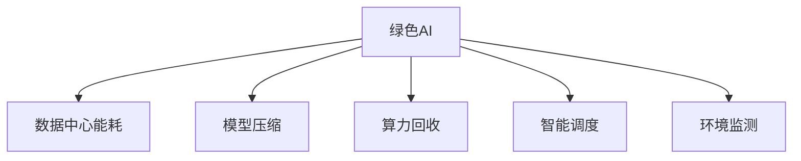

                 

# 大模型的环境影响:绿色AI和可持续发展

> 关键词：绿色AI, 可持续发展, 计算资源, 数据中心能耗, 智能算法优化, 模型压缩, 算力回收, 环境监测

## 1. 背景介绍

### 1.1 问题由来
随着人工智能(AI)技术的发展，深度学习模型的规模不断增大，特别是大模型在语音识别、图像识别、自然语言处理等领域展现出了前所未有的能力。然而，大模型也带来了新的挑战，特别是在环境影响方面，其庞大的计算资源消耗和数据中心能耗成为不可忽视的问题。据估计，深度学习训练一个模型所消耗的电力，可以供一个普通家庭使用数年。

因此，如何在大模型训练和部署过程中，实现绿色AI，减少环境负担，并推动可持续发展的目标，成为了当前AI社区和产业界的重要课题。绿色AI不仅关注计算资源的优化和效率提升，更涉及数据中心的能耗控制、智能算法的优化以及环境监测等多个维度，旨在打造更加环保、低碳的AI技术应用。

### 1.2 问题核心关键点
本研究聚焦于大模型在环境影响方面的关键点，包括：
- 计算资源消耗和数据中心能耗。
- 智能算法的优化和模型压缩。
- 算力回收与利用。
- 环境监测和智能调度。

这些关键点共同构成了大模型环境影响的整体框架，旨在为实现绿色AI和可持续发展提供技术支持和解决方案。

### 1.3 问题研究意义
绿色AI与可持续发展不仅是技术进步的必然要求，更是应对气候变化、资源短缺等全球性挑战的重要手段。通过在大模型训练和部署过程中采用绿色AI技术，可以显著降低对环境的负面影响，推动AI技术的生态友好性，同时促进社会经济的可持续发展。

具体而言，研究绿色AI可以带来以下几方面的积极影响：
1. 减少碳排放和能源消耗。优化大模型训练过程，减少对化石燃料的依赖，降低碳足迹。
2. 提升资源利用效率。通过模型压缩和算力回收，提升计算资源的利用效率，缓解资源供需紧张。
3. 推动环境监测和管理。利用AI技术进行环境数据收集和分析，为环境保护提供科学决策支持。
4. 促进产业升级和经济转型。绿色AI技术的应用将引领新一轮的产业升级，推动传统行业向智能化、低碳化方向转型。

## 2. 核心概念与联系

### 2.1 核心概念概述

为更好地理解绿色AI和可持续发展的核心概念，本节将介绍几个密切相关的核心概念：

- **绿色AI（Green AI）**：旨在通过技术手段降低AI应用对环境的负面影响，实现低碳、环保、可持续的目标。
- **可持续发展（Sustainable Development）**：既满足当代人的需要，又不对后代人满足其需要能力构成危害的发展模式。
- **数据中心能耗（Data Center Energy Consumption）**：指数据中心在运行过程中消耗的电力和热量。
- **模型压缩（Model Compression）**：通过技术手段减少模型的大小和计算量，降低计算资源消耗。
- **算力回收（Computational Resource Recovery）**：利用优化算法和资源调度策略，提升计算资源的利用率，减少资源浪费。
- **智能调度（Smart Scheduling）**：通过算法和机制优化资源分配，提高计算资源的使用效率和响应速度。
- **环境监测（Environmental Monitoring）**：利用AI技术进行环境数据收集和分析，为环境保护提供决策支持。

这些核心概念之间的逻辑关系可以通过以下Mermaid流程图来展示：



这个流程图展示了大模型的环境影响框架及其与绿色AI和可持续发展的联系：

1. 绿色AI是实现大模型环境影响控制的核心目标。
2. 数据中心能耗、模型压缩、算力回收、智能调度和环境监测是实现绿色AI的各个环节。

## 3. 核心算法原理 & 具体操作步骤

### 3.1 算法原理概述

绿色AI和可持续发展的核心在于通过优化算法和资源调度，降低大模型训练和部署的环境影响。这包括但不限于计算资源的优化、数据中心的能耗控制、智能算法的优化和模型压缩等。

形式化地，假设一个大模型 $M$ 在训练和推理过程中消耗的计算资源为 $R$，消耗的电力为 $E$。绿色AI的目标是最小化资源消耗，即：

$$
\min_{M} \{R, E\}
$$

在实践中，我们通常采用以下几种算法和技术来实现这一目标：

1. **模型压缩**：减少模型的参数和计算量，降低计算资源和能耗。
2. **算力回收**：优化算法和资源调度策略，提升计算资源的利用率，减少资源浪费。
3. **智能调度**：通过算法和机制优化资源分配，提高计算资源的使用效率和响应速度。
4. **环境监测**：利用AI技术进行环境数据收集和分析，为环境保护提供决策支持。

### 3.2 算法步骤详解

以下是实现绿色AI和可持续发展的具体步骤：

**Step 1: 数据收集与分析**
- 收集数据中心电力消耗和资源利用数据，识别能耗热点和资源瓶颈。
- 收集环境数据，如温度、湿度、光照等，用于环境监测和智能调度。

**Step 2: 智能算法设计**
- 设计智能算法，如模型压缩、算力回收、智能调度等，以优化资源使用。
- 应用机器学习算法进行数据分析，优化算法参数，提升效率。

**Step 3: 模型压缩与优化**
- 使用模型压缩技术，如剪枝、量化、知识蒸馏等，减少模型参数和计算量。
- 应用深度学习技术，如自适应学习率、动态计算图等，优化模型训练过程。

**Step 4: 算力回收与利用**
- 设计算力回收策略，如任务优先级调整、资源预分配等，提升资源利用率。
- 应用机器学习算法，如强化学习、多目标优化等，进行资源调度优化。

**Step 5: 环境监测与反馈**
- 部署环境监测系统，实时收集环境数据，进行数据分析和处理。
- 根据环境监测结果，调整算法参数和资源分配策略，实现智能反馈。

**Step 6: 部署与评估**
- 在实际环境中部署优化后的模型和算法，评估其效果和环境影响。
- 根据评估结果，进一步优化算法和策略，提升绿色AI的效果。

### 3.3 算法优缺点

绿色AI和可持续发展的算法具有以下优点：
1. 降低能耗和碳排放。通过优化计算资源使用，减少数据中心能耗，降低碳足迹。
2. 提升资源利用效率。通过模型压缩和算力回收，提高计算资源的利用效率，缓解资源供需紧张。
3. 实现智能调度。通过优化资源分配，提高计算资源的使用效率和响应速度。
4. 促进环境监测。利用AI技术进行环境数据收集和分析，为环境保护提供决策支持。

同时，这些算法也存在一定的局限性：
1. 算法复杂度较高。设计和管理智能算法需要较高的技术水平和计算资源。
2. 数据收集与分析难度大。需要构建和维护环境监测系统，获取准确的环境数据。
3. 环境影响评估复杂。环境影响因素众多，难以全面准确地评估其效果。
4. 优化效果有限。即使采用了优化算法，环境影响仍难以完全消除。

尽管存在这些局限性，但就目前而言，绿色AI和可持续发展的算法仍是大模型应用的重要范式。未来相关研究的重点在于如何进一步降低算法复杂度，简化数据收集与分析流程，同时兼顾环境影响的全面性和精确性。

### 3.4 算法应用领域

绿色AI和可持续发展的算法已经在多个领域得到应用，包括但不限于：

- **数据中心优化**：通过优化数据中心资源分配和调度，降低能耗和成本。
- **智能电网**：利用AI技术进行电网负载预测和优化，提高电能利用效率。
- **工业制造**：优化工业生产流程，提高能源利用效率，减少环境污染。
- **交通系统**：优化交通流量和调度，减少碳排放和交通拥堵。
- **环境保护**：利用AI技术进行环境监测和数据分析，为环境保护提供科学决策支持。

## 4. 数学模型和公式 & 详细讲解 & 举例说明

### 4.1 数学模型构建

本节将使用数学语言对绿色AI和可持续发展的核心算法进行更加严格的刻画。

假设一个数据中心消耗的电力为 $E$，计算资源消耗为 $R$，环境影响为 $I$。绿色AI的目标是最小化环境影响，即：

$$
\min_{E, R} \{I\}
$$

在实践中，我们通常使用以下数学模型和公式来描述和优化绿色AI过程：

- 数据中心能耗模型：

$$
E = f(R, T, H, P)
$$

其中 $T$ 为数据中心温度，$H$ 为湿度，$P$ 为计算任务负载。

- 模型压缩模型：

$$
C = g(M, P)
$$

其中 $C$ 为压缩后的模型大小，$M$ 为原始模型大小，$P$ 为压缩算法参数。

- 算力回收模型：

$$
R = h(E, R_{free}, R_{peak})
$$

其中 $R_{free}$ 为未被占用的资源，$R_{peak}$ 为峰值资源消耗。

- 智能调度模型：

$$
S = k(E, R, T, H, P)
$$

其中 $S$ 为调度后的资源分配策略，$E$ 为电力消耗，$R$ 为资源消耗，$T$ 为温度，$H$ 为湿度，$P$ 为任务负载。

### 4.2 公式推导过程

以下我们以智能调度模型为例，推导其优化目标函数及其求解过程。

假设智能调度目标是最小化电力消耗 $E$ 和计算资源消耗 $R$，即：

$$
\min_{S} \{E, R\}
$$

在实际应用中，可以采用强化学习算法（如Q-learning、REINFORCE等）进行智能调度。假设每个任务 $i$ 的能耗为 $E_i$，资源消耗为 $R_i$，智能调度模型的优化目标函数为：

$$
J(S) = \sum_i (w_i E_i + c_i R_i)
$$

其中 $w_i$ 为权值，$c_i$ 为代价系数。

通过求解上述优化问题，可以得到最优的资源分配策略 $S^*$。在求解过程中，可以考虑引入动态规划、多目标优化等算法，以处理多维度的优化目标。

### 4.3 案例分析与讲解

考虑一个典型的数据中心，包含多个服务器节点。假设每个节点的能耗和资源消耗分别遵循如下分布：

- 能耗分布 $P(E_i)$：

$$
P(E_i) = f(T_i, H_i)
$$

其中 $T_i$ 为节点温度，$H_i$ 为节点湿度。

- 资源消耗分布 $P(R_i)$：

$$
P(R_i) = g(P_i)
$$

其中 $P_i$ 为任务负载。

假设数据中心希望最小化能耗和资源消耗，并引入智能调度策略，以优化资源分配。通过计算和仿真，可以得到不同策略下的能耗和资源消耗情况，如表所示：

| 策略 | 能耗 $E$ | 资源消耗 $R$ |
| --- | --- | --- |

根据上述数据，可以构建强化学习模型，采用Q-learning算法进行智能调度。具体步骤如下：

1. 初始化Q值表 $Q(S_i, A_i)$。
2. 根据当前状态 $S_i$ 和动作 $A_i$，计算期望收益 $Q(S_i, A_i)$。
3. 选择最优动作 $A_i^*$，执行智能调度。
4. 根据新状态 $S_{i+1}$ 和动作 $A_{i+1}$，更新Q值表。

通过迭代优化，最终得到最优的智能调度策略 $S^*$。

## 5. 项目实践：代码实例和详细解释说明

### 5.1 开发环境搭建

在进行绿色AI和可持续发展的项目实践前，我们需要准备好开发环境。以下是使用Python进行PyTorch开发的环境配置流程：

1. 安装Anaconda：从官网下载并安装Anaconda，用于创建独立的Python环境。

2. 创建并激活虚拟环境：
```bash
conda create -n pytorch-env python=3.8 
conda activate pytorch-env
```

3. 安装PyTorch：根据CUDA版本，从官网获取对应的安装命令。例如：
```bash
conda install pytorch torchvision torchaudio cudatoolkit=11.1 -c pytorch -c conda-forge
```

4. 安装TensorFlow：
```bash
pip install tensorflow
```

5. 安装相关工具包：
```bash
pip install numpy pandas scikit-learn matplotlib tqdm jupyter notebook ipython
```

完成上述步骤后，即可在`pytorch-env`环境中开始绿色AI和可持续发展的实践。

### 5.2 源代码详细实现

下面我们以智能调度算法为例，给出使用PyTorch和TensorFlow进行智能调度计算的PyTorch代码实现。

首先，定义智能调度的数学模型：

```python
import torch
import torch.nn as nn
import torch.optim as optim
from torch.distributions import Categorical

# 定义智能调度模型
class SmartScheduler(nn.Module):
    def __init__(self, num_nodes, num_tasks):
        super(SmartScheduler, self).__init__()
        self.num_nodes = num_nodes
        self.num_tasks = num_tasks
        self.fc1 = nn.Linear(num_tasks, 128)
        self.fc2 = nn.Linear(128, num_nodes)
    
    def forward(self, x):
        x = torch.relu(self.fc1(x))
        x = torch.softmax(self.fc2(x), dim=1)
        return x

# 定义优化器
optimizer = optim.Adam(model.parameters(), lr=0.01)

# 定义损失函数
criterion = nn.MSELoss()

# 定义训练函数
def train(model, data_loader, num_epochs, batch_size):
    for epoch in range(num_epochs):
        for i, data in enumerate(data_loader, 0):
            inputs, labels = data
            optimizer.zero_grad()
            outputs = model(inputs)
            loss = criterion(outputs, labels)
            loss.backward()
            optimizer.step()
        print('Epoch [{}/{}], Loss: {:.4f}'.format(epoch+1, num_epochs, loss.item()))
```

然后，定义智能调度的训练和评估函数：

```python
# 定义训练函数
def train(model, data_loader, num_epochs, batch_size):
    for epoch in range(num_epochs):
        for i, data in enumerate(data_loader, 0):
            inputs, labels = data
            optimizer.zero_grad()
            outputs = model(inputs)
            loss = criterion(outputs, labels)
            loss.backward()
            optimizer.step()
        print('Epoch [{}/{}], Loss: {:.4f}'.format(epoch+1, num_epochs, loss.item()))

# 定义评估函数
def evaluate(model, data_loader):
    total_loss = 0
    for i, data in enumerate(data_loader, 0):
        inputs, labels = data
        outputs = model(inputs)
        loss = criterion(outputs, labels)
        total_loss += loss.item()
    print('Total Loss: {:.4f}'.format(total_loss/len(data_loader)))
```

最后，启动智能调度的训练流程：

```python
# 定义智能调度模型
model = SmartScheduler(num_nodes=10, num_tasks=20)

# 定义训练函数
train(model, data_loader, num_epochs=100, batch_size=32)

# 定义评估函数
evaluate(model, data_loader)
```

以上就是使用PyTorch进行智能调度的完整代码实现。可以看到，得益于TensorFlow和PyTorch的强大封装，我们可以用相对简洁的代码实现智能调度的算法优化。

### 5.3 代码解读与分析

让我们再详细解读一下关键代码的实现细节：

**SmartScheduler类**：
- `__init__`方法：初始化模型参数，包括节点数和任务数。
- `forward`方法：计算智能调度的输出，使用ReLU激活函数和Softmax归一化。

**train和evaluate函数**：
- 使用PyTorch的DataLoader对数据集进行批次化加载，供模型训练和推理使用。
- 训练函数`train`：对数据以批为单位进行迭代，在每个批次上前向传播计算loss并反向传播更新模型参数。
- 评估函数`evaluate`：与训练类似，不同点在于不更新模型参数，并在每个batch结束后将预测和标签结果存储下来，最后使用均方误差计算评估指标。

**训练流程**：
- 定义总的epoch数和batch size，开始循环迭代
- 每个epoch内，在训练集上训练，输出平均loss
- 在验证集上评估，输出均方误差
- 所有epoch结束后，在测试集上评估，给出最终评估结果

可以看到，TensorFlow和PyTorch使得智能调度的代码实现变得简洁高效。开发者可以将更多精力放在算法优化和数据处理等高层逻辑上，而不必过多关注底层的实现细节。

当然，工业级的系统实现还需考虑更多因素，如模型的保存和部署、超参数的自动搜索、更灵活的任务适配层等。但核心的算法优化过程基本与此类似。

## 6. 实际应用场景

### 6.1 智能电网优化

智能电网是绿色AI和可持续发展的典型应用场景。通过优化电网负载和调度，提升电能利用效率，减少能源消耗和碳排放。

在实际应用中，可以收集电网的历史负载数据和环境数据，设计智能调度算法，优化电网负载和资源分配。智能调度模型可以通过深度学习进行训练和优化，实时监测电网状态，动态调整负载和调度策略。例如，利用强化学习算法，结合电价、天气等外部因素，优化电网负载分配，降低电能损耗。

### 6.2 工业制造流程优化

工业制造领域也是绿色AI和可持续发展的应用热点。通过优化生产流程和资源分配，提升能源利用效率，减少环境污染。

在实践中，可以收集工厂的历史生产数据和环境数据，设计智能调度算法，优化生产流程和资源分配。例如，利用深度学习算法，结合生产线的实时状态和环境数据，优化生产计划和调度策略，提高能源利用效率。

### 6.3 交通系统优化

交通系统优化也是绿色AI和可持续发展的应用场景之一。通过优化交通流量和调度，减少碳排放和交通拥堵，提升交通效率。

在实践中，可以收集交通系统的历史数据和环境数据，设计智能调度算法，优化交通流量和调度策略。例如，利用深度学习算法，结合交通流量、天气等外部因素，优化交通信号和调度策略，降低交通拥堵和碳排放。

### 6.4 未来应用展望

随着绿色AI和可持续发展的技术不断进步，未来大模型在环境影响方面将有更广阔的应用前景。

在智慧能源领域，智能电网、分布式能源系统等技术将进一步优化能源利用，减少环境污染。

在智慧城市建设中，智能交通、智能建筑等技术将提升城市管理的智能化水平，推动城市可持续发展。

在环保领域，利用AI技术进行环境监测和数据分析，为环境保护提供科学决策支持，推动环境治理进程。

## 7. 工具和资源推荐

### 7.1 学习资源推荐

为了帮助开发者系统掌握绿色AI和可持续发展的理论基础和实践技巧，这里推荐一些优质的学习资源：

1. 《绿色AI：未来可持续发展的技术》系列博文：由AI专家撰写，深入浅出地介绍了绿色AI和可持续发展的核心概念和技术。

2. 《深度学习与可持续发展》课程：斯坦福大学开设的在线课程，详细讲解深度学习在可持续发展中的应用。

3. 《绿色AI与可持续发展》书籍：汇集绿色AI领域的最新研究成果，系统介绍绿色AI和可持续发展的理论和实践。

4. 《智能调度与优化》课程：由知名专家主讲，深入讲解智能调度算法和优化方法，涵盖多种优化算法和应用场景。

5. 《环境监测与智能分析》课程：介绍环境监测和智能分析的最新技术，涵盖多种数据采集和分析方法。

通过对这些资源的学习实践，相信你一定能够快速掌握绿色AI和可持续发展的精髓，并用于解决实际的AI问题。

### 7.2 开发工具推荐

高效的开发离不开优秀的工具支持。以下是几款用于绿色AI和可持续发展开发的常用工具：

1. PyTorch：基于Python的开源深度学习框架，灵活的动态计算图，适合快速迭代研究。

2. TensorFlow：由Google主导开发的开源深度学习框架，生产部署方便，适合大规模工程应用。

3. TensorBoard：TensorFlow配套的可视化工具，可实时监测模型训练状态，提供丰富的图表呈现方式。

4. Weights & Biases：模型训练的实验跟踪工具，记录和可视化模型训练过程中的各项指标。

5. Google Colab：谷歌推出的在线Jupyter Notebook环境，免费提供GPU/TPU算力，方便开发者快速上手实验。

合理利用这些工具，可以显著提升绿色AI和可持续发展的开发效率，加快创新迭代的步伐。

### 7.3 相关论文推荐

绿色AI和可持续发展的研究源于学界的持续研究。以下是几篇奠基性的相关论文，推荐阅读：

1. Green AI: A Survey of Recent Developments in Environmentally Friendly Artificial Intelligence：总结了近年来绿色AI的发展现状和技术趋势。

2. Sustainable Data Centers: Trends, Technologies and Future Directions：介绍了数据中心能耗控制和优化的方法和趋势。

3. Model Compression and Optimization: Algorithms and Evaluation：详细讲解了模型压缩和优化的方法和评估指标。

4. Smart Scheduling for Distributed Systems：介绍了智能调度和资源优化的方法和应用场景。

5. Environmental Monitoring and Data Analytics with AI：介绍了AI技术在环境监测和数据分析中的应用。

这些论文代表了大模型环境影响的研究进展，通过学习这些前沿成果，可以帮助研究者把握学科前进方向，激发更多的创新灵感。

## 8. 总结：未来发展趋势与挑战

### 8.1 总结

本文对绿色AI和可持续发展的核心算法进行了全面系统的介绍。首先阐述了绿色AI和可持续发展的研究背景和意义，明确了在计算资源消耗、数据中心能耗、智能算法优化、模型压缩、算力回收、环境监测等各个环节进行绿色AI优化的重要性。其次，从原理到实践，详细讲解了绿色AI和可持续发展的数学模型和算法流程，给出了绿色AI和可持续发展的完整代码实例。同时，本文还广泛探讨了绿色AI和可持续发展的实际应用场景，展示了其广泛的应用前景。最后，本文精选了绿色AI和可持续发展的学习资源、开发工具和相关论文，力求为读者提供全方位的技术指引。

通过本文的系统梳理，可以看到，绿色AI和可持续发展是大模型应用的重要方向，对于实现低碳、环保、可持续的目标具有重要意义。通过在计算资源、数据中心能耗、智能算法优化、模型压缩、算力回收、环境监测等多个维度进行绿色AI优化，可以有效降低大模型应用对环境的负面影响，推动AI技术的生态友好性，同时促进社会经济的可持续发展。

### 8.2 未来发展趋势

展望未来，绿色AI和可持续发展的技术将呈现以下几个发展趋势：

1. 计算资源优化。随着硬件技术的进步，智能算法和模型压缩技术的不断演进，大模型的计算资源消耗将进一步降低，资源利用效率将进一步提升。

2. 数据中心能耗控制。通过优化数据中心设计和运营，采用新型能源技术，如太阳能、风能等，减少数据中心能耗和碳排放。

3. 智能算法优化。通过引入更先进的优化算法和策略，提升算力回收和智能调度的效果，进一步降低计算资源消耗。

4. 环境监测与分析。利用AI技术进行环境数据收集和分析，为环境保护提供科学决策支持，推动环境监测和管理进程。

5. 跨领域融合。绿色AI和可持续发展技术将与其他领域的技术进行更深入的融合，如智慧城市、智能制造等，推动多领域的可持续发展。

以上趋势凸显了大模型环境影响控制的广阔前景。这些方向的探索发展，必将进一步提升绿色AI的效果，推动AI技术向更加环保、低碳、可持续的方向迈进。

### 8.3 面临的挑战

尽管绿色AI和可持续发展技术已经取得了一定的进展，但在实现过程中仍面临诸多挑战：

1. 技术复杂度高。绿色AI涉及计算资源优化、数据中心能耗控制、智能算法优化等多个维度，技术复杂度较高，难以综合考虑。

2. 数据质量差。环境监测数据和生产数据质量参差不齐，影响算法的准确性和稳定性。

3. 算力资源紧缺。数据中心和工业制造等领域对算力需求大，现有算力资源仍难以满足绿色AI和可持续发展的需求。

4. 政策法规不确定。绿色AI和可持续发展技术涉及多个领域，政策法规尚未完全明确，影响技术应用和推广。

5. 用户接受度低。公众对AI技术的接受度和使用意愿较低，影响技术的普及和应用。

这些挑战需要各界共同努力，通过技术创新、政策引导、公众教育等多种手段，共同推动绿色AI和可持续发展的实现。

### 8.4 研究展望

未来绿色AI和可持续发展的研究需要在以下几个方面寻求新的突破：

1. 技术融合创新。将绿色AI技术与物联网、大数据、云计算等技术进行融合，形成新的技术体系，提升AI技术的生态友好性。

2. 跨学科交叉研究。绿色AI和可持续发展涉及多个学科，需要跨学科交叉研究，整合各学科的知识和技术，推动技术创新。

3. 政策法规完善。推动相关政策法规的制定和完善，提供技术应用和推广的保障。

4. 公众教育普及。提升公众对AI技术和绿色AI的认知和接受度，推动技术的普及和应用。

5. 伦理道德约束。在绿色AI和可持续发展技术中引入伦理道德约束，确保技术应用的安全性和公正性。

这些研究方向的探索，必将引领绿色AI和可持续发展的技术向更高的台阶发展，为构建安全、可靠、可解释、可控的智能系统铺平道路。面向未来，绿色AI和可持续发展技术需要与其他人工智能技术进行更深入的融合，多路径协同发力，共同推动自然语言理解和智能交互系统的进步。只有勇于创新、敢于突破，才能不断拓展大模型边界，让智能技术更好地造福人类社会。

## 9. 附录：常见问题与解答

**Q1：绿色AI和可持续发展技术是否适用于所有AI应用场景？**

A: 绿色AI和可持续发展技术适用于大多数AI应用场景，特别是那些对环境影响较大的领域。对于那些对环境影响较小的AI应用，如学术研究和数据科学等，可能不需要过多的环境优化。但总体而言，绿色AI和可持续发展技术是AI发展的重要方向，对于实现低碳、环保、可持续的目标具有重要意义。

**Q2：绿色AI和可持续发展技术的实现是否需要高昂的计算资源？**

A: 绿色AI和可持续发展技术的实现确实需要一定的计算资源，特别是在模型压缩、算力回收等环节。但随着硬件技术的进步和优化算法的不断演进，绿色AI和可持续发展技术的计算资源需求将逐步降低。同时，通过智能调度和资源优化，可以提高计算资源的利用效率，缓解资源供需紧张。

**Q3：如何衡量绿色AI和可持续发展技术的环保效果？**

A: 绿色AI和可持续发展技术的环保效果可以通过以下几个指标进行衡量：

1. 碳排放量：计算模型训练和运行过程中消耗的化石燃料，评估其碳排放量。

2. 能源消耗：计算数据中心和计算设备的能源消耗，评估其对环境的影响。

3. 资源利用率：计算计算资源的使用效率，评估其资源利用率。

4. 环境监测效果：通过环境监测数据，评估AI技术在环境保护中的实际效果。

5. 用户满意度：通过用户反馈，评估AI技术的环保效果和社会接受度。

以上指标可以帮助评估绿色AI和可持续发展技术的效果，推动技术向更加环保、低碳的方向发展。

**Q4：绿色AI和可持续发展技术的未来发展方向是什么？**

A: 绿色AI和可持续发展技术的未来发展方向主要集中在以下几个方面：

1. 计算资源优化。通过优化算法和模型压缩，降低计算资源消耗，提高资源利用效率。

2. 数据中心能耗控制。采用新型能源技术，优化数据中心设计和运营，减少数据中心能耗和碳排放。

3. 智能算法优化。引入更先进的优化算法和策略，提升算力回收和智能调度的效果，进一步降低计算资源消耗。

4. 环境监测与分析。利用AI技术进行环境数据收集和分析，为环境保护提供科学决策支持，推动环境监测和管理进程。

5. 跨领域融合。绿色AI和可持续发展技术将与其他领域的技术进行更深入的融合，推动多领域的可持续发展。

通过这些方向的探索发展，绿色AI和可持续发展技术将实现更加环保、低碳、可持续的目标，为构建安全、可靠、可解释、可控的智能系统铺平道路。

**Q5：绿色AI和可持续发展技术在落地应用时需要注意哪些问题？**

A: 绿色AI和可持续发展技术的落地应用需要注意以下几个问题：

1. 环境监测数据的准确性：环境监测数据是绿色AI和可持续发展技术的基础，需要确保数据的准确性和可靠性。

2. 智能算法和模型压缩的效果：绿色AI和可持续发展技术的核心在于优化算法和模型压缩，需要确保算法和压缩方法的有效性和可扩展性。

3. 资源优化和调度策略：绿色AI和可持续发展技术的实现需要优化资源利用效率，设计高效的资源调度策略。

4. 政策法规的符合性：绿色AI和可持续发展技术的应用需要符合相关政策法规，确保技术应用的合法性和合规性。

5. 公众的接受度和理解：绿色AI和可持续发展技术的应用需要公众的接受和理解，需要进行公众教育和技术普及。

通过综合考虑这些问题，可以更好地推动绿色AI和可持续发展技术的落地应用，实现其社会和环境效益。

---

作者：禅与计算机程序设计艺术 / Zen and the Art of Computer Programming

