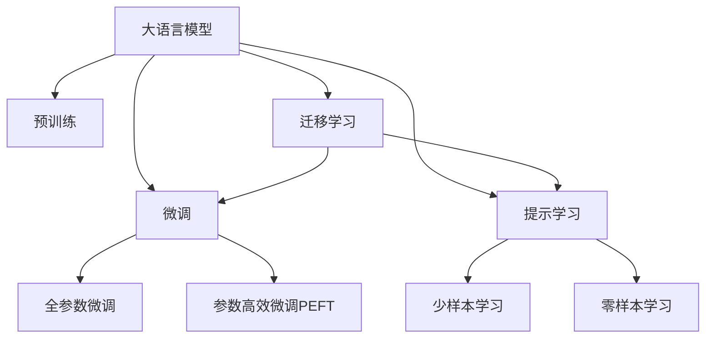

                 

# 大模型赋能创业，开启人工智能新纪元

大模型以其强大的语言处理能力和泛化性能，正在推动NLP（自然语言处理）领域的创新发展，为创业者提供了新的机遇。本文将从背景介绍、核心概念、算法原理、实际操作、应用场景、工具资源、总结与展望等方面，深入探讨大模型赋能创业的意义，并提出研究展望和常见问题的解答。

## 1. 背景介绍

### 1.1 问题由来
随着深度学习技术的迅速发展，大规模预训练语言模型（Large Language Models, LLMs）在自然语言处理（NLP）领域取得了突破性进展。这些模型通过在大规模无标签文本数据上进行预训练，获得了丰富的语言知识，能够在各种NLP任务上表现出色。

然而，这些模型往往需要耗费巨大的算力和时间进行预训练，且在大规模部署时，可能面临性能瓶颈和成本问题。为此，微调（Fine-Tuning）方法应运而生。微调是一种有监督学习范式，通过在少量有标签数据上训练，优化预训练模型，使其能够适应特定任务，从而在资源受限的情况下，快速提升模型性能。

### 1.2 问题核心关键点
微调的核心在于将预训练模型应用于特定任务，通过调整少量参数，使其能够更好地适应目标数据。这种方法可以显著降低标注数据的需求，提高模型训练的效率，同时避免从头训练的巨大计算成本。

微调的主要优点包括：
- **高效率**：在小规模数据集上训练，能够快速获得高性能模型。
- **高泛化能力**：预训练模型在大规模数据上获得泛化能力，可以迁移到新任务上。
- **低成本**：不需要从头训练，减少了数据标注和计算资源投入。

同时，微调也存在以下挑战：
- **过拟合风险**：在小样本情况下，模型容易过拟合。
- **鲁棒性问题**：模型对新数据泛化能力可能不足。
- **可解释性差**：预训练模型的黑盒特性，使得输出结果缺乏解释。

## 2. 核心概念与联系

### 2.1 核心概念概述
- **大语言模型（LLMs）**：如BERT、GPT等预训练语言模型，通过在大规模无标签文本数据上进行自监督学习，获得强大的语言表示能力。
- **微调（Fine-Tuning）**：在预训练模型的基础上，通过有监督学习任务，调整模型参数，使其适应特定任务的优化方法。
- **迁移学习（Transfer Learning）**：利用预训练模型在新任务上的泛化能力，进行微调，以提高模型在新任务上的性能。
- **参数高效微调（PEFT）**：仅更新少量的模型参数，避免大规模参数更新导致的过拟合。
- **提示学习（Prompt Learning）**：通过在输入中设计特定的提示模板，引导模型进行推理和生成，实现零样本和少样本学习。

这些概念之间的关系可以通过以下Mermaid流程图来展示：



该图展示了这些概念之间的逻辑关系：大语言模型通过预训练获得基础能力，微调是其在大规模标注数据上的优化方法，迁移学习连接预训练模型与下游任务，提示学习通过设计特定的输入模板，实现少样本和零样本学习。

## 3. 核心算法原理 & 具体操作步骤

### 3.1 算法原理概述
基于监督学习的微调方法，主要通过在大规模标注数据集上，对预训练模型进行有监督训练，调整模型参数，以适应特定任务。微调的目标是最小化模型在任务上的损失函数。

### 3.2 算法步骤详解

1. **数据准备**：收集任务相关的标注数据集，划分为训练集、验证集和测试集。
2. **模型选择**：选择合适的预训练语言模型作为微调的基础。
3. **任务适配**：根据任务类型，设计适当的输出层和损失函数，如分类任务的线性分类器、回归任务的最小二乘损失函数等。
4. **超参数设置**：选择合适的优化器（如AdamW、SGD）、学习率、批大小、迭代次数等。
5. **训练过程**：使用训练集进行模型训练，验证集评估模型性能，调整超参数，最终在测试集上评估模型性能。
6. **模型部署**：将训练好的模型部署到实际应用中，进行推理和预测。

### 3.3 算法优缺点

#### 优点：
- **高效**：通过利用预训练模型的强大泛化能力，能够在少量标注数据上获得高性能模型。
- **泛化能力**：预训练模型在大规模无标签数据上获得泛化能力，能够迁移到新任务上。
- **低成本**：减少了从头训练的巨大成本和数据标注工作。

#### 缺点：
- **过拟合风险**：在小样本情况下，模型容易过拟合。
- **鲁棒性问题**：模型对新数据泛化能力可能不足。
- **可解释性差**：预训练模型的黑盒特性，使得输出结果缺乏解释。

### 3.4 算法应用领域

微调方法广泛适用于各种NLP任务，包括文本分类、命名实体识别、关系抽取、问答系统、机器翻译、文本摘要等。同时，微调也适用于跨领域迁移学习和领域自适应学习，提升模型在不同领域和数据分布上的性能。

## 4. 数学模型和公式 & 详细讲解 & 举例说明

### 4.1 数学模型构建

设预训练语言模型为 $M_{\theta}$，训练数据集为 $D=\{(x_i,y_i)\}_{i=1}^N$。微调的目标是最小化经验风险：

$$
\hat{\theta} = \mathop{\arg\min}_{\theta} \frac{1}{N} \sum_{i=1}^N \ell(M_{\theta}(x_i),y_i)
$$

其中 $\ell$ 为任务相关的损失函数，如分类任务的交叉熵损失函数。

### 4.2 公式推导过程

以二分类任务为例，假设模型 $M_{\theta}$ 在输入 $x$ 上的输出为 $\hat{y}=M_{\theta}(x) \in [0,1]$。则二分类交叉熵损失函数定义为：

$$
\ell(M_{\theta}(x),y) = -[y\log \hat{y} + (1-y)\log(1-\hat{y})]
$$

代入经验风险公式，得：

$$
\mathcal{L}(\theta) = -\frac{1}{N}\sum_{i=1}^N [y_i\log M_{\theta}(x_i)+(1-y_i)\log(1-M_{\theta}(x_i))]
$$

根据链式法则，损失函数对参数 $\theta_k$ 的梯度为：

$$
\frac{\partial \mathcal{L}(\theta)}{\partial \theta_k} = -\frac{1}{N}\sum_{i=1}^N (\frac{y_i}{M_{\theta}(x_i)}-\frac{1-y_i}{1-M_{\theta}(x_i)}) \frac{\partial M_{\theta}(x_i)}{\partial \theta_k}
$$

其中 $\frac{\partial M_{\theta}(x_i)}{\partial \theta_k}$ 可进一步递归展开，利用自动微分技术完成计算。

### 4.3 案例分析与讲解

以命名实体识别（NER）为例，假设模型 $M_{\theta}$ 的输出为 $\hat{y}=M_{\theta}(x) \in [0,1]$，其中 $y \in \{0,1\}$。则NER任务的损失函数为：

$$
\ell(M_{\theta}(x),y) = -[y\log M_{\theta}(x)+(1-y)\log(1-M_{\theta}(x))]
$$

在训练过程中，使用随机梯度下降（SGD）等优化算法，不断调整模型参数 $\theta$，最小化损失函数 $\mathcal{L}(\theta)$，直到收敛。

## 5. 项目实践：代码实例和详细解释说明

### 5.1 开发环境搭建

1. **安装Python和PyTorch**：
   - 安装Python 3.7及以上版本，建议使用Anaconda或Miniconda。
   - 安装PyTorch 1.9及以上版本，建议使用GPU加速版本。
   - 安装必要的依赖库，如numpy、scipy、pandas、matplotlib等。

2. **安装Transformers库**：
   - 使用pip安装Transformer库：`pip install transformers`

### 5.2 源代码详细实现

以下以命名实体识别（NER）任务为例，展示微调的代码实现。

```python
from transformers import BertForTokenClassification, AdamW, BertTokenizer
from torch.utils.data import DataLoader
from tqdm import tqdm
from sklearn.metrics import classification_report

# 数据准备
tokenizer = BertTokenizer.from_pretrained('bert-base-cased')
train_dataset = BertDataset(train_texts, train_tags, tokenizer)
dev_dataset = BertDataset(dev_texts, dev_tags, tokenizer)
test_dataset = BertDataset(test_texts, test_tags, tokenizer)

# 模型构建和训练
model = BertForTokenClassification.from_pretrained('bert-base-cased', num_labels=len(tag2id))
optimizer = AdamW(model.parameters(), lr=2e-5)

device = torch.device('cuda') if torch.cuda.is_available() else torch.device('cpu')
model.to(device)

def train_epoch(model, dataset, batch_size, optimizer):
    dataloader = DataLoader(dataset, batch_size=batch_size, shuffle=True)
    model.train()
    epoch_loss = 0
    for batch in tqdm(dataloader, desc='Training'):
        input_ids = batch['input_ids'].to(device)
        attention_mask = batch['attention_mask'].to(device)
        labels = batch['labels'].to(device)
        model.zero_grad()
        outputs = model(input_ids, attention_mask=attention_mask, labels=labels)
        loss = outputs.loss
        epoch_loss += loss.item()
        loss.backward()
        optimizer.step()
    return epoch_loss / len(dataloader)

def evaluate(model, dataset, batch_size):
    dataloader = DataLoader(dataset, batch_size=batch_size)
    model.eval()
    preds, labels = [], []
    with torch.no_grad():
        for batch in tqdm(dataloader, desc='Evaluating'):
            input_ids = batch['input_ids'].to(device)
            attention_mask = batch['attention_mask'].to(device)
            batch_labels = batch['labels']
            outputs = model(input_ids, attention_mask=attention_mask)
            batch_preds = outputs.logits.argmax(dim=2).to('cpu').tolist()
            batch_labels = batch_labels.to('cpu').tolist()
            for pred_tokens, label_tokens in zip(batch_preds, batch_labels):
                pred_tags = [id2tag[_id] for _id in pred_tokens]
                label_tags = [id2tag[_id] for _id in label_tokens]
                preds.append(pred_tags[:len(label_tags)])
                labels.append(label_tags)
                
    print(classification_report(labels, preds))

# 训练和评估
epochs = 5
batch_size = 16

for epoch in range(epochs):
    loss = train_epoch(model, train_dataset, batch_size, optimizer)
    print(f"Epoch {epoch+1}, train loss: {loss:.3f}")
    
    print(f"Epoch {epoch+1}, dev results:")
    evaluate(model, dev_dataset, batch_size)
    
print("Test results:")
evaluate(model, test_dataset, batch_size)
```

### 5.3 代码解读与分析

1. **数据准备**：
   - 使用BertTokenizer对输入文本进行分词，并转换为模型所需的token ids。
   - 对标签进行编码，转换为模型所需的数字id。
   - 使用DataLoader将数据集划分为批次进行训练和评估。

2. **模型构建和训练**：
   - 使用BertForTokenClassification作为模型的顶层分类器，使用AdamW优化器进行参数更新。
   - 在训练过程中，使用梯度下降算法更新模型参数，最小化损失函数。
   - 在验证集上评估模型性能，调整学习率等超参数。

3. **评估和部署**：
   - 在测试集上评估模型的泛化性能。
   - 将训练好的模型部署到实际应用中，进行推理和预测。

## 6. 实际应用场景

### 6.1 智能客服系统

智能客服系统利用微调技术，将大语言模型应用于客户咨询场景。通过收集历史客服对话记录，设计特定的任务模板，将问题-答案对作为监督数据，对预训练模型进行微调。微调后的模型能够自动理解用户意图，匹配最合适的答案模板进行回复，从而提高客户咨询体验和问题解决效率。

### 6.2 金融舆情监测

金融机构利用微调技术，对新闻、报道、评论等文本数据进行情感分析，实时监测市场舆论动向，以便及时应对负面信息传播，规避金融风险。通过在金融领域相关的标注数据上微调大语言模型，能够自动判断文本情感倾向，预测市场舆情变化趋势，确保金融机构能够快速响应潜在风险。

### 6.3 个性化推荐系统

个性化推荐系统利用微调技术，将大语言模型应用于用户行为分析。通过收集用户浏览、点击、评论、分享等行为数据，提取和用户交互的物品标题、描述、标签等文本内容，将文本内容作为模型输入，用户在物品上的后续行为作为监督信号，在特定领域语料上微调模型，使其能够从文本内容中准确把握用户的兴趣点，生成个性化推荐列表。

### 6.4 未来应用展望

未来，大语言模型微调技术将在更多领域得到应用，为传统行业带来变革性影响：

- **智慧医疗**：通过微调医疗问答、病历分析、药物研发等应用，提升医疗服务的智能化水平，辅助医生诊疗，加速新药开发进程。
- **智能教育**：利用微调技术，开发作业批改、学情分析、知识推荐等应用，因材施教，促进教育公平，提高教学质量。
- **智慧城市治理**：在城市事件监测、舆情分析、应急指挥等环节，提高城市管理的自动化和智能化水平，构建更安全、高效的未来城市。
- **企业生产**：通过微调技术，提升生产效率、质量控制、设备维护等应用，加速企业数字化转型。
- **社会治理**：在舆情监测、灾害预警、公共安全等领域，提高社会治理的智能化水平，保障公共安全。

## 7. 工具和资源推荐

### 7.1 学习资源推荐

1. **《自然语言处理基础》**：介绍NLP基本概念和经典模型，适合初学者入门。
2. **《深度学习与自然语言处理》**：讲解深度学习在NLP中的应用，包括微调技术。
3. **《Transformer: From Principles to Practice》**：介绍Transformer架构和微调技术。
4. **HuggingFace官方文档**：提供丰富的预训练模型和微调样例代码，是学习微调技术的重要资源。

### 7.2 开发工具推荐

1. **PyTorch**：开源深度学习框架，支持动态计算图，适合快速迭代研究。
2. **TensorFlow**：开源深度学习框架，支持静态计算图，适合大规模工程应用。
3. **Transformers库**：HuggingFace开发的NLP工具库，集成了众多SOTA语言模型。
4. **Weights & Biases**：模型训练的实验跟踪工具，记录和可视化模型训练过程中的各项指标。
5. **TensorBoard**：TensorFlow配套的可视化工具，实时监测模型训练状态。
6. **Google Colab**：在线Jupyter Notebook环境，免费提供GPU/TPU算力，方便快速上手实验。

### 7.3 相关论文推荐

1. **Attention is All You Need**：Transformer论文，提出Transformer结构，开启预训练大模型时代。
2. **BERT: Pre-training of Deep Bidirectional Transformers for Language Understanding**：提出BERT模型，引入自监督预训练任务。
3. **Language Models are Unsupervised Multitask Learners**：展示大语言模型的强大zero-shot学习能力。
4. **Parameter-Efficient Transfer Learning for NLP**：提出Adapter等参数高效微调方法。
5. **Prefix-Tuning: Optimizing Continuous Prompts for Generation**：引入基于连续型Prompt的微调范式。
6. **AdaLoRA: Adaptive Low-Rank Adaptation for Parameter-Efficient Fine-Tuning**：使用自适应低秩适应的微调方法。

## 8. 总结：未来发展趋势与挑战

### 8.1 研究成果总结

本文详细介绍了大语言模型微调技术的原理、操作步骤、实际应用和未来趋势，重点探讨了微调在NLP领域的应用和挑战。

### 8.2 未来发展趋势

1. **模型规模增大**：随着算力成本的下降和数据规模的扩张，预训练语言模型的参数量将继续增长。
2. **微调方法多样**：未来的微调方法将更加多样化，包括参数高效微调、因果推断、对比学习等。
3. **持续学习成为常态**：微调模型需要持续学习新知识，以保持性能和时效性。
4. **少样本和零样本学习**：利用大语言模型的语言理解能力，实现少样本和零样本学习。
5. **多模态微调**：将视觉、语音等多模态信息与文本信息进行融合，提升模型的语言建模能力。
6. **伦理和安全性**：引入伦理导向的评估指标，过滤和惩罚有偏见、有害的输出倾向，确保模型安全性。

### 8.3 面临的挑战

1. **标注数据瓶颈**：小样本情况下，标注数据不足导致微调性能受限。
2. **鲁棒性不足**：模型对新数据的泛化能力可能不足，容易过拟合。
3. **推理效率低**：大模型推理速度慢，内存占用大，需要优化以提高效率。
4. **可解释性差**：预训练模型的黑盒特性，使得输出结果缺乏解释。
5. **安全性问题**：模型可能学习到有害信息，传递到下游任务，导致安全风险。
6. **知识整合能力不足**：模型难以灵活吸收和运用外部知识库，限制了其应用范围。

### 8.4 研究展望

1. **探索无监督和半监督微调方法**：利用自监督学习、主动学习等无监督和半监督范式，最大限度利用非结构化数据。
2. **开发参数高效和计算高效的微调范式**：设计更加参数高效和计算高效的微调方法，提高模型训练效率。
3. **引入因果和对比学习范式**：增强微调模型建立稳定因果关系的能力，学习更加普适、鲁棒的语言表征。
4. **融合外部知识**：将符号化的先验知识与神经网络模型结合，实现视觉、语音等多模态信息的整合。
5. **加入伦理和道德约束**：引入伦理导向的评估指标，过滤和惩罚有害的输出倾向，确保模型安全性。

## 9. 附录：常见问题与解答

**Q1：大语言模型微调是否适用于所有NLP任务？**

A: 大语言模型微调在大多数NLP任务上都能取得不错的效果，特别是对于数据量较小的任务。但对于一些特定领域的任务，如医学、法律等，仅仅依靠通用语料预训练的模型可能难以很好地适应。此时需要在特定领域语料上进一步预训练，再进行微调，才能获得理想效果。

**Q2：微调过程中如何选择合适的学习率？**

A: 微调的学习率一般要比预训练时小1-2个数量级，如果使用过大的学习率，容易破坏预训练权重，导致过拟合。一般建议从1e-5开始调参，逐步减小学习率，直至收敛。也可以使用warmup策略，在开始阶段使用较小的学习率，再逐渐过渡到预设值。

**Q3：采用大模型微调时会面临哪些资源瓶颈？**

A: 目前主流的预训练大模型动辄以亿计的参数规模，对算力、内存、存储都提出了很高的要求。GPU/TPU等高性能设备是必不可少的，但即便如此，超大批次的训练和推理也可能遇到显存不足的问题。因此需要采用一些资源优化技术，如梯度积累、混合精度训练、模型并行等，来突破硬件瓶颈。同时，模型的存储和读取也可能占用大量时间和空间，需要采用模型压缩、稀疏化存储等方法进行优化。

**Q4：如何缓解微调过程中的过拟合问题？**

A: 过拟合是微调面临的主要挑战，尤其是在标注数据不足的情况下。常见的缓解策略包括：
1. 数据增强：通过回译、近义替换等方式扩充训练集。
2. 正则化：使用L2正则、Dropout、Early Stopping等避免过拟合。
3. 对抗训练：引入对抗样本，提高模型鲁棒性。
4. 参数高效微调：只调整少量参数(如Adapter、Prefix等)，减小过拟合风险。
5. 多模型集成：训练多个微调模型，取平均输出，抑制过拟合。

这些策略往往需要根据具体任务和数据特点进行灵活组合。只有在数据、模型、训练、推理等各环节进行全面优化，才能最大限度地发挥大模型微调的威力。

**Q5：微调模型在落地部署时需要注意哪些问题？**

A: 将微调模型转化为实际应用，还需要考虑以下因素：
1. 模型裁剪：去除不必要的层和参数，减小模型尺寸，加快推理速度。
2. 量化加速：将浮点模型转为定点模型，压缩存储空间，提高计算效率。
3. 服务化封装：将模型封装为标准化服务接口，便于集成调用。
4. 弹性伸缩：根据请求流量动态调整资源配置，平衡服务质量和成本。
5. 监控告警：实时采集系统指标，设置异常告警阈值，确保服务稳定性。
6. 安全防护：采用访问鉴权、数据脱敏等措施，保障数据和模型安全。

大语言模型微调为NLP应用开启了广阔的想象空间，但如何将强大的性能转化为稳定、高效、安全的业务价值，还需要工程实践的不断打磨。只有从数据、算法、工程、业务等多个维度协同发力，才能真正实现人工智能技术在垂直行业的规模化落地。

综上所述，大语言模型微调技术在大模型赋能创业、开启人工智能新纪元方面具有广阔的应用前景。通过深入理解其原理和操作步骤，合理应用其方法和工具，可以有效提升NLP系统的性能和应用范围，为各行各业带来变革性影响。

---

作者：禅与计算机程序设计艺术 / Zen and the Art of Computer Programming

