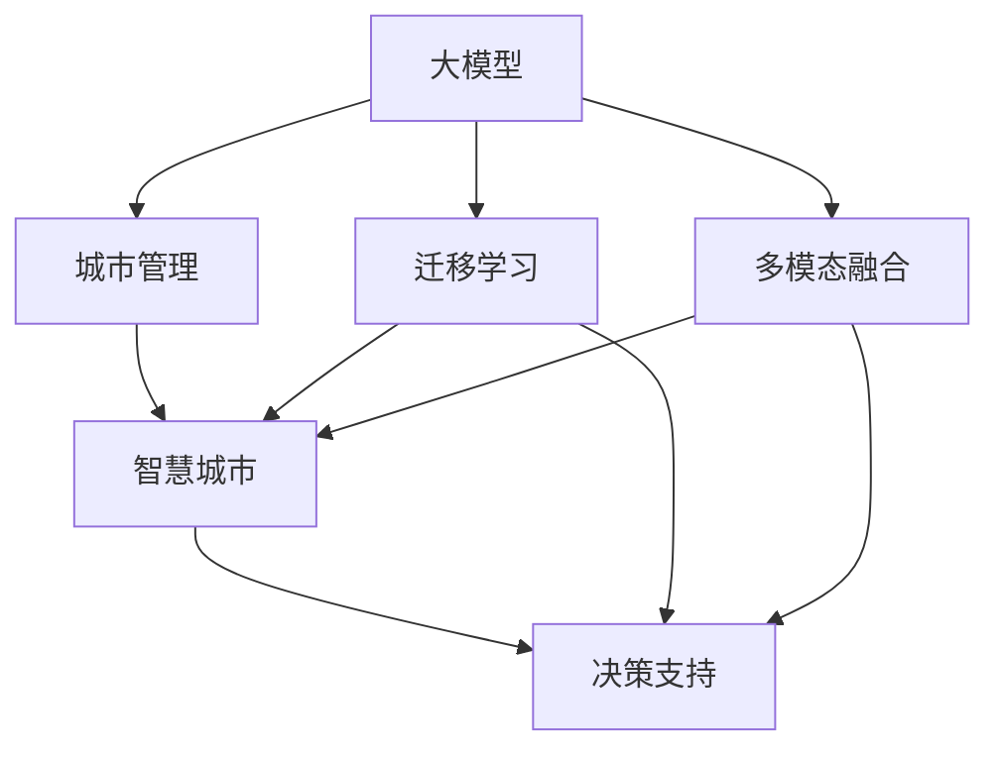

                 

# 大模型赋能智慧城管，创业者如何提升城市管理效能？

## 1. 背景介绍

### 1.1 问题由来
随着城市化进程的不断推进，智慧城市建设已成为衡量一个国家或城市现代化水平的重要标准。智慧城市不仅能提升公共服务的效率，还能促进城市管理的精细化和智能化。然而，在智慧城市建设中，城市管理者常常面临着数据量大、应用场景复杂、服务响应速度要求高等诸多挑战。

为应对这些挑战，传统的城市管理系统往往依赖于大量的传感器和监控设备收集数据，然后通过人工分析进行处理。这种方法不仅效率低下，且难以满足现代城市管理对快速反应和精准决策的需求。随着人工智能技术，尤其是大模型的不断发展，利用大模型进行城市管理的思路开始得到广泛关注和探索。

### 1.2 问题核心关键点
通过大模型进行城市管理，可以有效解决传统城市管理中存在的问题：

- **数据处理效率提升**：利用大模型强大的数据处理能力，可以迅速分析大量城市数据，从中提取出有用的信息。
- **智能决策支持**：大模型通过学习历史数据，可以预测城市发展趋势，辅助城市管理者做出更科学的决策。
- **服务响应速度加快**：大模型可以实时处理城市数据，缩短服务响应时间，提升用户体验。
- **跨领域融合**：大模型具备良好的泛化能力，可以应用于智慧城管的各个领域，如交通管理、垃圾处理、绿化维护等。

但大模型在城市管理中的应用也存在一些挑战，如模型部署成本高、模型解释性不足、模型泛化能力有待提升等。针对这些挑战，本文将探讨如何通过大模型实现智慧城管，并给出具体的操作方法。

## 2. 核心概念与联系

### 2.1 核心概念概述

为更好地理解大模型在智慧城管中的应用，本节将介绍几个密切相关的核心概念：

- **大模型**：指通过大规模数据预训练得到的语言、视觉、音频等多模态模型，具备强大的数据处理和预测能力。
- **迁移学习**：指将一个领域学习到的知识，迁移到另一个不同但相关的领域，实现知识迁移和知识复用的学习范式。
- **城市管理**：包括城市规划、环境监控、公共安全、交通管理、垃圾处理等多个方面，通过信息化手段提升管理效能和精细化程度。
- **智慧城市**：利用信息通信技术，整合城市数据资源，实现智能化、精细化、人性化管理，提升城市运行效率。
- **多模态融合**：将不同模态的数据和知识进行整合，提升模型的泛化能力和决策精准度。
- **决策支持**：利用大模型对城市数据进行分析和预测，为城市管理者提供决策支持，提高决策科学性。

这些核心概念之间的逻辑关系可以通过以下Mermaid流程图来展示：



这个流程图展示了大模型在智慧城管中的应用逻辑：

1. 大模型通过迁移学习，将知识迁移到城市管理的各个领域，提升模型的泛化能力和泛化深度。
2. 多模态融合使得模型可以处理不同模态的数据，如视频、图像、文本等，提升决策的全面性和准确性。
3. 决策支持系统利用大模型对城市数据进行分析和预测，为城市管理者提供数据驱动的决策支持。

## 3. 核心算法原理 & 具体操作步骤
### 3.1 算法原理概述

利用大模型进行城市管理的核心在于迁移学习和多模态融合。其核心思想是：将大模型在某一领域的预训练知识迁移到城市管理的其他领域，实现多模态数据的整合和深度学习。

具体来说，大模型在某一领域的数据上预训练后，可以学习到该领域的知识表示。通过迁移学习，将这种知识表示迁移到城市管理的其他领域，如智能交通、环境监控、垃圾分类等。同时，通过多模态融合，将不同模态的数据和知识整合起来，使得模型能够处理更多样化的城市数据，提升决策的精准度。

### 3.2 算法步骤详解

利用大模型进行智慧城管的具体操作步骤如下：

**Step 1: 准备数据集**
- 收集城市管理的各个领域的数据集，包括交通流量、环境监控、垃圾分类等。
- 对数据进行清洗、标注，确保数据质量和完整性。

**Step 2: 选择合适的预训练模型**
- 选择适合城市管理领域的预训练模型，如在视觉领域使用的ResNet、在文本领域使用的BERT等。
- 根据任务需求，对预训练模型进行微调或迁移学习。

**Step 3: 定义任务目标**
- 根据具体城市管理任务，定义模型需要解决的问题，如交通流量预测、环境质量评估等。
- 设计任务目标函数，指导模型的训练过程。

**Step 4: 多模态数据融合**
- 收集不同模态的数据，如图像、视频、文本等，进行预处理和标准化。
- 将数据输入大模型进行联合训练，融合不同模态的知识。

**Step 5: 训练和评估模型**
- 利用训练集数据训练模型，根据任务目标函数进行优化。
- 在验证集上评估模型性能，根据评估结果调整超参数。
- 在测试集上对模型进行最终测试，确保模型的泛化能力和稳定性。

**Step 6: 部署和应用**
- 将训练好的模型部署到城市管理的各个应用场景中，实现实时监控和决策支持。
- 定期更新数据，重新训练模型，确保模型的持续优化。

### 3.3 算法优缺点

利用大模型进行城市管理具有以下优点：

- **高效性**：利用大模型的强大计算能力，可以迅速处理大量城市数据，提高城市管理的效率。
- **泛化能力强**：大模型可以学习到广泛的知识表示，能够适应城市管理中的各种场景和变化。
- **灵活性高**：大模型可以应用于城市管理的各个领域，具有广泛的适用性。

同时，该方法也存在一些缺点：

- **资源消耗高**：大模型的训练和推理需要消耗大量的计算资源，对硬件设备的要求较高。
- **模型解释性不足**：大模型的决策过程往往是"黑箱"，难以解释其内部工作机制。
- **泛化能力有待提升**：虽然大模型具备较强的泛化能力，但在特定领域和特定任务上，仍需要进一步优化和调整。

### 3.4 算法应用领域

利用大模型进行智慧城管，可以应用于城市管理的多个领域，如：

- **智能交通管理**：利用大模型进行交通流量预测、事故预警等，提升交通管理效率。
- **环境质量监控**：利用大模型对环境数据进行分析和预测，监测空气质量、水质等环境指标。
- **垃圾分类和处理**：利用大模型对垃圾进行识别和分类，辅助垃圾处理系统的优化。
- **智慧绿化**：利用大模型对绿化数据进行分析和预测，指导城市绿化和养护。
- **公共安全监控**：利用大模型进行人脸识别、异常检测等，提升公共安全管理水平。

## 4. 数学模型和公式 & 详细讲解 & 举例说明

### 4.1 数学模型构建

利用大模型进行智慧城管的核心在于多模态数据的联合训练。假设城市管理的某个领域有 $m$ 个模态，每个模态的数据表示为 $X_i$，$i=1,\cdots,m$，则多模态融合的数学模型可以表示为：

$$
f(X) = g(X_1;W_1) + g(X_2;W_2) + \cdots + g(X_m;W_m)
$$

其中 $g(X_i;W_i)$ 表示第 $i$ 个模态的特征表示，$W_i$ 为该模态的特征表示权重。通过联合训练，使得模型能够整合不同模态的数据，提升决策的全面性和准确性。

### 4.2 公式推导过程

以交通流量预测为例，假设利用大模型进行交通流量预测，模型输入为交通摄像头拍摄到的图像 $X$，输出为预测的流量 $y$。则模型的数学模型可以表示为：

$$
f(X;W) = g(X;W_1) + g(X;W_2)
$$

其中 $g(X;W_1)$ 表示视觉特征提取模块，$W_1$ 为视觉特征提取层的权重；$g(X;W_2)$ 表示交通流量预测模块，$W_2$ 为流量预测层的权重。模型的训练目标函数为均方误差损失函数：

$$
\mathcal{L}(f(X),y) = \frac{1}{N}\sum_{i=1}^N (y_i - f(X_i;W))^2
$$

其中 $N$ 为样本数量，$X_i$ 为第 $i$ 个样本的图像数据。

通过反向传播算法，模型可以不断更新权重 $W$，最小化损失函数 $\mathcal{L}$，从而得到流量预测的准确结果。

### 4.3 案例分析与讲解

以智能交通管理为例，利用大模型进行交通流量预测和事故预警的具体实现如下：

**Step 1: 数据收集和预处理**
- 从交通摄像头获取实时图像数据 $X$。
- 对图像进行预处理，如归一化、裁剪、增强等，得到特征表示 $g(X;W_1)$。
- 结合历史交通流量数据，生成训练集和验证集。

**Step 2: 模型搭建**
- 使用预训练的ResNet模型作为特征提取模块 $g(X;W_1)$。
- 利用流量预测模块 $g(X;W_2)$，设计适当的神经网络结构。

**Step 3: 模型训练**
- 将特征表示 $g(X;W_1)$ 和历史流量数据作为输入，训练流量预测模块 $g(X;W_2)$。
- 在验证集上评估模型性能，调整学习率、正则化参数等超参数。

**Step 4: 模型应用**
- 将训练好的模型部署到交通管理系统中，实时处理摄像头数据。
- 利用预测结果，进行交通流量控制、事故预警等操作。

## 5. 项目实践：代码实例和详细解释说明
### 5.1 开发环境搭建

在进行智慧城管项目开发前，我们需要准备好开发环境。以下是使用Python进行TensorFlow开发的流程：

1. 安装Anaconda：从官网下载并安装Anaconda，用于创建独立的Python环境。

2. 创建并激活虚拟环境：
```bash
conda create -n tf-env python=3.8 
conda activate tf-env
```

3. 安装TensorFlow：根据CUDA版本，从官网获取对应的安装命令。例如：
```bash
conda install tensorflow
```

4. 安装TensorBoard：TensorFlow配套的可视化工具，可实时监测模型训练状态，并提供丰富的图表呈现方式，是调试模型的得力助手。

5. 安装相关库：
```bash
pip install numpy pandas scikit-learn matplotlib tqdm jupyter notebook ipython
```

完成上述步骤后，即可在`tf-env`环境中开始开发。

### 5.2 源代码详细实现

这里我们以智能交通管理为例，给出使用TensorFlow进行交通流量预测的代码实现。

```python
import tensorflow as tf
from tensorflow.keras.layers import Input, Conv2D, MaxPooling2D, Flatten, Dense
from tensorflow.keras.models import Model

# 定义输入层
input_layer = Input(shape=(224, 224, 3))

# 定义卷积层和池化层
x = Conv2D(32, kernel_size=(3, 3), activation='relu')(input_layer)
x = MaxPooling2D(pool_size=(2, 2))(x)
x = Conv2D(64, kernel_size=(3, 3), activation='relu')(x)
x = MaxPooling2D(pool_size=(2, 2))(x)

# 定义全连接层
x = Flatten()(x)
x = Dense(128, activation='relu')(x)

# 定义输出层
output_layer = Dense(1, activation='sigmoid')(x)

# 定义模型
model = Model(inputs=input_layer, outputs=output_layer)

# 编译模型
model.compile(loss='mse', optimizer='adam', metrics=['mae'])

# 训练模型
model.fit(X_train, y_train, validation_data=(X_valid, y_valid), epochs=10)

# 保存模型
model.save('traffic_flow_predictor.h5')
```

其中，$X$ 为输入图像数据，$y$ 为流量标签数据。

### 5.3 代码解读与分析

让我们再详细解读一下关键代码的实现细节：

**卷积层和池化层**：
- 使用卷积层和池化层对输入图像进行特征提取，提升特征表示的鲁棒性和泛化能力。

**全连接层**：
- 将特征表示展平后，通过全连接层进行分类预测，输出流量标签。

**输出层**：
- 使用Sigmoid激活函数，将输出值映射到[0,1]区间，表示流量预测的概率。

**模型编译**：
- 设置损失函数为均方误差，优化器为Adam，评估指标为平均绝对误差。

**模型训练**：
- 利用训练集数据，进行模型训练，调整模型参数。

**模型保存**：
- 将训练好的模型保存为文件，方便后续部署和应用。

## 6. 实际应用场景
### 6.1 智能交通管理

利用大模型进行智能交通管理，可以显著提升城市交通的效率和安全性。具体而言，通过实时分析交通流量数据，可以预测交通拥堵情况，提前进行流量控制和疏导。

在技术实现上，可以收集交通摄像头拍摄的实时图像数据，利用大模型进行流量预测，输出预测结果后，通过控制信号灯和路标，对交通流量进行实时调控，实现智能化交通管理。

### 6.2 环境质量监控

环境质量的监控和管理是城市管理中的重要环节。通过大模型进行环境监测，可以实时分析环境数据，及时发现和预警环境问题。

在实践中，可以收集空气质量监测数据、水质监测数据等，利用大模型进行环境质量的预测和分析。例如，使用大模型预测空气质量指数，根据预测结果，提前进行环境治理，减轻污染对居民健康的影响。

### 6.3 垃圾分类和处理

垃圾分类是城市管理中的一项重要任务。通过大模型进行垃圾识别和分类，可以提高垃圾处理的效率和精确度。

在具体实现中，可以收集垃圾分类图片数据，利用大模型进行垃圾识别和分类，输出分类结果后，进行垃圾处理和回收利用。例如，使用大模型对垃圾图片进行识别，判断垃圾类别，然后将其送往相应的处理设施。

### 6.4 未来应用展望

随着大模型和城市管理技术的发展，基于大模型的智慧城管将迎来更多的应用场景，为城市管理带来更多创新和提升。

- **智能停车管理**：利用大模型进行停车场数据分析，优化停车资源的分配和管理，提升停车效率。
- **智慧绿化**：利用大模型对绿化数据进行分析和预测，指导城市绿化和养护，提升城市生态质量。
- **公共安全监控**：利用大模型进行人脸识别、异常检测等，提升公共安全管理水平，保障城市安全。
- **智能能源管理**：利用大模型对能源数据进行分析和预测，优化能源分配和管理，提高能源利用效率。

## 7. 工具和资源推荐
### 7.1 学习资源推荐

为了帮助开发者系统掌握大模型在智慧城管中的应用，这里推荐一些优质的学习资源：

1. TensorFlow官方文档：TensorFlow官方提供的详细文档，包含大量案例和示例代码，是学习TensorFlow的最佳资料。

2. TensorFlow tutorials：TensorFlow提供的交互式教程，适合初学者快速上手学习。

3. Kaggle比赛：参加Kaggle比赛，使用大模型进行城市管理相关的数据处理和预测，积累实战经验。

4. CS229《机器学习》课程：斯坦福大学提供的机器学习课程，涵盖深度学习、模型训练、优化算法等多个方面，是学习大模型的基础课程。

5. 《TensorFlow实战》书籍：详细讲解TensorFlow的使用方法和实际应用案例，适合进阶学习。

通过对这些资源的学习实践，相信你一定能够快速掌握大模型在智慧城管中的应用，并用于解决实际的智慧城管问题。

### 7.2 开发工具推荐

高效的开发离不开优秀的工具支持。以下是几款用于大模型开发和部署的工具：

1. TensorFlow：由Google主导开发的开源深度学习框架，生产部署方便，适合大规模工程应用。

2. Jupyter Notebook：交互式的数据科学环境，方便开发者快速迭代和实验。

3. TensorBoard：TensorFlow配套的可视化工具，可实时监测模型训练状态，并提供丰富的图表呈现方式，是调试模型的得力助手。

4. Keras：高层次的深度学习框架，易于上手，适合快速原型设计和实验。

5. PyTorch：基于Python的开源深度学习框架，灵活的动态计算图，适合研究实验和创新应用。

合理利用这些工具，可以显著提升大模型在智慧城管开发和部署的效率，加快创新迭代的步伐。

### 7.3 相关论文推荐

大模型和智慧城管技术的发展源于学界的持续研究。以下是几篇奠基性的相关论文，推荐阅读：

1. Deep learning for self-driving cars（即DQN论文）：提出了基于深度强化学习的自动驾驶算法，展示了深度学习在复杂环境下的应用潜力。

2. Real-time visual object detection with region proposal networks（即R-CNN论文）：提出了基于区域提议网络的实时目标检测算法，展示了大模型在图像处理中的应用效果。

3. Google Brain Team: "Scalable Multimodal Search"：提出了大规模多模态搜索模型，展示了多模态融合在信息检索中的应用效果。

4. Deep residual learning for image recognition（即ResNet论文）：提出了残差网络结构，展示了深度卷积神经网络在图像分类中的应用效果。

5. Transformer is All you Need（即Transformer原论文）：提出了Transformer结构，展示了大模型在自然语言处理中的应用效果。

这些论文代表了大模型在智慧城管技术的发展脉络。通过学习这些前沿成果，可以帮助研究者把握学科前进方向，激发更多的创新灵感。

## 8. 总结：未来发展趋势与挑战
### 8.1 研究成果总结

本文对大模型在智慧城管中的应用进行了全面系统的介绍。首先阐述了智慧城管的背景和重要性，明确了利用大模型进行智慧城管的优势和适用场景。其次，从原理到实践，详细讲解了大模型在智慧城管中的应用流程和操作步骤。同时，本文还广泛探讨了大模型在智慧城管中的实际应用场景，展示了其巨大的潜力和应用前景。

通过本文的系统梳理，可以看到，大模型在智慧城管中的应用已经取得了显著的成效，但仍然面临一些挑战，如模型部署成本高、模型解释性不足、模型泛化能力有待提升等。未来需要更多研究者探索新技术和方法，不断优化和改进大模型在智慧城管中的应用。

### 8.2 未来发展趋势

展望未来，大模型在智慧城管中的应用将呈现以下几个发展趋势：

1. **模型规模增大**：随着算力成本的下降和数据规模的扩张，预训练语言模型的参数量还将持续增长，大模型的规模也将进一步增大。

2. **多模态融合加深**：未来大模型将更好地整合不同模态的数据，提升模型的泛化能力和决策精准度。

3. **跨领域迁移提升**：大模型将具备更强的跨领域迁移能力，能够适应更多的城市管理任务。

4. **决策支持更加智能化**：利用大模型进行城市数据分析和预测，为城市管理者提供更加智能化、精准的决策支持。

5. **实时性要求提升**：未来大模型将在实时性要求更高的场景中得到应用，如交通流量预测、智能停车管理等。

6. **资源优化更加精细**：大模型将更加注重资源优化，通过模型裁剪、量化加速等方法，降低计算和存储成本。

### 8.3 面临的挑战

尽管大模型在智慧城管中的应用已经取得了一定的成效，但仍然面临诸多挑战：

1. **模型部署成本高**：大模型的训练和部署需要消耗大量的计算资源，对硬件设备的要求较高。

2. **模型解释性不足**：大模型的决策过程往往是"黑箱"，难以解释其内部工作机制。

3. **泛化能力有待提升**：虽然大模型具备较强的泛化能力，但在特定领域和特定任务上，仍需要进一步优化和调整。

4. **实时性要求高**：大模型需要在实时性要求更高的场景中得到应用，如何提升实时处理能力是一个重要挑战。

5. **数据质量要求高**：大模型对数据质量要求较高，需要收集和处理高质量的城市管理数据。

### 8.4 研究展望

面对大模型在智慧城管中的应用挑战，未来的研究需要在以下几个方面寻求新的突破：

1. **探索参数高效微调方法**：开发更加参数高效的微调方法，在固定大部分预训练参数的情况下，只更新极少量的任务相关参数。

2. **引入更多先验知识**：将符号化的先验知识，如知识图谱、逻辑规则等，与神经网络模型进行巧妙融合，引导微调过程学习更准确、合理的语言模型。

3. **研究多模态融合算法**：研究更高效的多模态融合算法，提升模型的泛化能力和决策精准度。

4. **优化模型实时处理能力**：通过模型裁剪、量化加速等方法，降低计算和存储成本，提升实时处理能力。

5. **提升模型解释性**：引入可解释性技术，如注意力机制、模型压缩等，提升模型的可解释性和可审计性。

6. **优化数据处理流程**：研究高效的数据处理和清洗方法，提升数据质量，优化数据预处理流程。

这些研究方向的探索，必将引领大模型在智慧城管中的应用走向更高的台阶，为构建智慧城市提供更强大的技术支持。面向未来，大模型将有望成为城市管理的重要工具，为城市管理带来更多创新和提升。

